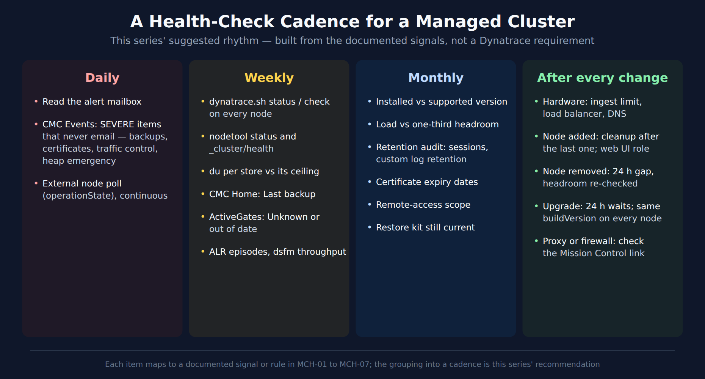

# MCH-99: Best Practice Summary and Health-Check Checklist

> **Series:** MCH — Managed Cluster Health | **Notebook:** 8 of 8 | **Created:** September 2026 | **Last Updated:** 10/02/2026

## Overview

This is the MCH series on one page. MCH-01 introduced a five-layer health model for a self-hosted Dynatrace Managed cluster (node and process, storage, capacity, connectivity, lifecycle), and MCH-02 to MCH-07 covered one layer each. This notebook turns them into something to run: a checklist per layer, one table of every signal that never reaches your mailbox, a review cadence, the numbers worth knowing, the anti-patterns that cause most of the trouble, and the gaps the documentation leaves.

Use it as the operating reference, and the earlier notebooks for the detail behind each line.

---

## Table of Contents

1. [Short Answer](#short-answer)
2. [The Five-Layer Health-Check Checklist](#checklist)
3. [Signals That Never Email You](#not-emailed)
4. [A Review Cadence](#cadence)
5. [Numbers Worth Knowing](#numbers)
6. [Anti-Patterns](#anti-patterns)
7. [What the Documentation Does Not Say](#doc-gaps)
8. [Beyond the Docs](#beyond-the-docs)
9. [Summary and Where to Go Next](#summary)

---

## Prerequisites

| Requirement | Details |
|-------------|---------|
| **Dynatrace deployment** | A self-hosted **Dynatrace Managed** cluster. Nothing in this series applies to Dynatrace SaaS. |
| **Access** | Cluster Management Console (CMC) administrator access; root (or `sudo`) on the cluster nodes; a cluster API token with `ServiceProviderAPI` for the external checks |
| **Query language** | None. Managed has no Grail, so this series has **no DQL cells** |
| **Read first** | MCH-01. This notebook summarizes MCH-01 to MCH-07 and points back to them |
| **Version basis** | Written against the Managed documentation read 10/01/2026 |

## 1. Short Answer

1. **Node and process.** Every node `RUNNING`, every service up. The cluster survives one node: *"Dynatrace Managed continues to operate after the loss of one node."* (From five nodes up, a Dynatrace blog allows two.)
2. **Storage.** Cassandra under 2 TB per node with every node `UN`; Elasticsearch `green`. Elasticsearch retention is a size lever; Cassandra's isn't.
3. **Capacity.** One-third headroom, and adaptive load reduction that never lasts 15 minutes or more.
4. **Connectivity.** The cluster kept internal behind Cluster ActiveGates, and a working Mission Control link.
5. **Lifecycle.** Backups that run, a restore you could actually perform, and a supported version.

Across all five, the most important habit is reading CMC **Events**. Many of the serious signals never email you (§3).

> **Sources:** [Single-cluster high availability (DT docs)](https://docs.dynatrace.com/managed/managed-cluster/high-availability/single-cluster-high-availability), [Configure Cluster event notifications (DT docs)](https://docs.dynatrace.com/managed/managed-cluster/configuration/configure-cluster-event-notifications).

## 2. The Five-Layer Health-Check Checklist

### Layer 1 — Node and process (MCH-02)

| Check | How | Healthy |
|-------|-----|---------|
| Every node present and running | `GET /api/v1.0/onpremise/cluster`, or CMC **Deployment status** | Every node's `operationState` is `RUNNING`; node count = cluster size |
| Every service up | `dynatrace.sh status` and `check` on each node | *"All services are OK"*, *"All rules are active."*, *"All processes are OK"* |
| Same version everywhere | The same API call | Identical `buildVersion` on every node |
| Clocks in sync | Host NTP monitoring | All nodes *"Synchronize with NTP"* and *"Be in the same time zone"* |

### Layer 2 — Storage (MCH-03, MCH-04)

| Check | How | Healthy |
|-------|-----|---------|
| Cassandra ring | `cassandra-nodetool.sh status` | *"Make sure that all nodes display UN"*; `Load` roughly even |
| Metrics store size | `du -sh` on each node | *"Keep the Long-term Metrics Store below 2 TB per node."* |
| Elasticsearch | `_cluster/health` | `"status" : "green"` (`yellow` only on a one-node cluster) |
| Retention settings | CMC → Environments → Storage settings | Each environment above the 35-day user-session default is a deliberate choice |

### Layer 3 — Capacity (MCH-06)

| Check | How | Healthy |
|-------|-----|---------|
| Headroom | Your load vs. the sizing table | *"Plan for a processing capacity one-third higher than typical utilization."* |
| Load reduction | CMC Events | Brief only. *"consistent use for intervals of 15 minutes or longer can impact the accuracy of your monitoring data"* |
| Ingest limits | CMC → Environments → Cluster overload prevention | Updated after the last hardware change |

### Layer 4 — Connectivity (MCH-05)

| Check | How | Healthy |
|-------|-----|---------|
| Mission Control link | CMC → *Check Mission Control connection* | Connected. A lost link starts the clock: *"If a connection outage to Mission Control lasts longer than 14 days (7 days for free trial accounts), the Managed Cluster disallows the ability to exceed the license limit (overages)."* |
| Load balancer | Its health checks | Every node checked at `/rest/health`; targets match the current nodes |
| Cluster ActiveGates | CMC → Deployment Status → ActiveGates | None *Unknown*; none flagged as behind by more than five versions |
| Certificates | Your certificate inventory | Expiry tracked outside the cluster |

### Layer 5 — Lifecycle (MCH-07)

| Check | How | Healthy |
|-------|-----|---------|
| Backups running | CMC **Home** → *Last backup* | Recent; no backup-problem events |
| Backup mount | `fstab` or your disk tool | Persistent. Otherwise *"If the shared file system mount point isn't available on system boot, Dynatrace won't start on that node."* |
| Restore readiness | Your restore kit | Exact installer version, node inventory, seed choice, matching UID:GID |
| Version | CMC user menu vs. the release table | Inside "Currently supported" |

> **Sources:**
> - [Get cluster information about known cluster nodes (DT docs)](https://docs.dynatrace.com/managed/dynatrace-api/cluster-api/cluster-api-v1/cluster-v1/get-cluster-info-known-servers), [Start/stop/restart a node (DT docs)](https://docs.dynatrace.com/managed/managed-cluster/operation/start-stop-restart-node), [Hardware requirements (DT docs)](https://docs.dynatrace.com/managed/managed-cluster/installation/managed-hardware-requirements)
> - [Start/stop/restart a cluster (DT docs)](https://docs.dynatrace.com/managed/managed-cluster/operation/start-stop-restart-cluster), [Single-cluster high availability (DT docs)](https://docs.dynatrace.com/managed/managed-cluster/high-availability/single-cluster-high-availability), [Adaptive traffic management for Managed (DT docs)](https://docs.dynatrace.com/managed/ingest-from/dynatrace-oneagent/adaptive-traffic-management/adaptive-traffic-management-managed)
> - [Mission Control proactive support (DT docs)](https://docs.dynatrace.com/managed/managed-cluster/basics/mission-control-proactive-support), [Set up load balancer (DT docs)](https://docs.dynatrace.com/managed/managed-cluster/configuration/set-up-load-balancer), [Update Cluster ActiveGate (DT docs)](https://docs.dynatrace.com/managed/managed-cluster/operation/update-dynatrace-managed-activegate)
> - [Backup and restore a cluster (DT docs)](https://docs.dynatrace.com/managed/managed-cluster/operation/back-up-and-restore-a-cluster), [Cluster Management Console (DT docs)](https://docs.dynatrace.com/managed/managed-cluster/basics/cluster-management-console), [Dynatrace Managed release notes (DT docs)](https://docs.dynatrace.com/managed/whats-new/managed)

## 3. Signals That Never Email You

Cluster events appear in the CMC **Events** list, and the docs' event table gives each one an email column. These are the ones in this series whose email column is **No**, grouped by layer. None of them will reach you unless someone reads the Events list:

| Layer | Event (as the docs print it) | Severity |
|-------|------------------------------|----------|
| 1 | *"<component name> is down."* | SEVERE |
| 1 | *"Heap memory: Server %d started memory emergency mode."* | SEVERE |
| 1 | *"Insufficient system privileges on %s."* | SEVERE |
| 1 | *"Node cannot read and write to directory: '%s'."* | WARNING |
| 1 | *"Server time of server %d is out of sync. Time difference %d milliseconds. Please enable NTP on all cluster nodes."* | not shown |
| 2 | *"Long-term Metrics Store size exceeds recommended 2 TB on %s."* | WARNING |
| 2 | *"Cassandra node connection lost ( %d times in the last hour)."* | WARNING |
| 2 | *"Elasticsearch storage service on your Dynatrace Managed cluster might be overloaded!"* | INFO |
| 2 | *"Elasticsearch log queue is full."* / *"Elasticsearch log storing failed."* | WARNING |
| 3 | *"Cluster traffic control: OneAgent monitoring was disabled on recently connected hosts to avoid cluster overload."* | SEVERE |
| 4 | *"A cluster node can't receive OneAgent traffic."* | SEVERE |
| 4 | *"SSL certificate expired."* / *"Your SSL certificate will expire soon."* | SEVERE / WARNING |
| 4 | *"ActiveGate (host=…) lost connection to cluster."* | INFO |
| 5 | *"Cassandra backup problem."* / *"ElasticSearch backup problem."* | SEVERE |

For contrast, these **do** email: *"Node is down - %s."* (*"if happened outside of the upgrade procedure"*), *"Host is down."*, and *"There is lack of connection to Dynatrace Mission Control."*. The *Configurable* ones also email by default: insufficient disk space, the 4 TB metrics ceiling, retention truncation, and adaptive load reduction.

> **Sources:** [Configure Cluster event notifications (DT docs)](https://docs.dynatrace.com/managed/managed-cluster/configuration/configure-cluster-event-notifications) — Email notification column, read 10/01/2026.

## 4. A Review Cadence

The documentation sets no review schedule. This is the series' suggestion for turning the checklist into a routine. Each item comes from a documented signal or rule, but the grouping is ours.

<!-- MARKDOWN_TABLE_ALTERNATIVE
| Daily | Weekly | Monthly | After every change |
|-------|--------|---------|--------------------|
| Read the alert mailbox | dynatrace.sh status / check on every node | Installed vs supported version | Hardware: ingest limit, load balancer, DNS |
| CMC Events: SEVERE items that never email (backups, certificates, traffic control, heap emergency) | nodetool status and _cluster/health | Load vs one-third headroom | Node added: cleanup after the last one; web UI role |
| External node poll (operationState), continuous | du per store vs its ceiling | Retention audit (sessions, custom log retention) | Node removed: 24 h gap, headroom re-checked |
| | CMC Home: Last backup | Certificate expiry dates | Upgrade: 24 h waits; same buildVersion on every node |
| | ActiveGates: Unknown or out of date | Remote-access scope | Proxy or firewall: check the Mission Control link |
| | ALR episodes, dsfm throughput | Restore kit still current | |
For environments where SVG doesn't render
-->

The "after every change" column is the one teams most often skip. Each item in it is something a hardware, node, upgrade or network change leaves behind for someone to do.

## 5. Numbers Worth Knowing

| Number | What it is | From the docs |
|--------|------------|---------------|
| **3** | Production minimum | *"Production environments require a minimum 3-node Managed Cluster for reliability and data redundancy."* |
| **30** | Maximum nodes | *"Dynatrace Managed supports up to 30 Managed Cluster nodes."* |
| **3 / 2** | Copies: metrics, user sessions / log events | *"Replication factor is set to three."* (user sessions); *"Replication factor is set to two."* (logs) |
| **2 TB / 4 TB** | Metrics store per node: recommended / supported | *"Keep the Long-term Metrics Store below 2 TB per node. Dynatrace supports stability and operational resilience up to 4 TB per node."* |
| **⅓** | Headroom | *"Plan for a processing capacity one-third higher than typical utilization."* |
| **10 ms / 100 ms** | Latency between nodes / between Premium HA data centers | *"Have a network latency between nodes of 10 ms or less"*; *"Keep round-trip network latency at 100 ms or less."* |
| **15 min** | Sustained load reduction that costs accuracy; Premium HA failover trigger | *"consistent use for intervals of 15 minutes or longer"*; nodes *"down for 15 minutes"* |
| **24 h** | Between node removals; after a download; between updates | *"allow 24 hours before removing any subsequent nodes"*; *"a 24-hour waiting period is required before an automatic update can run"* |
| **14 days** | Mission Control outage before overages stop (classic) | *"lasts longer than 14 days (7 days for free trial accounts)"* |
| **72 h** | Premium HA automatic repair window | *"PHA automatically repairs network disconnections of up to 72 hours between DCs."* |
| **5 GB** | Free space needed to update | *"You have at least 5 GB of available disk space on the partition where Dynatrace Managed is installed."* |
| **4 weeks** | Release cadence | *"typically released every four weeks"* |

> **Sources:**
> - [Hardware requirements (DT docs)](https://docs.dynatrace.com/managed/managed-cluster/installation/managed-hardware-requirements), [Data retention periods (DT docs)](https://docs.dynatrace.com/managed/manage/data-privacy-and-security/data-privacy/data-retention-periods), [Single-cluster high availability (DT docs)](https://docs.dynatrace.com/managed/managed-cluster/high-availability/single-cluster-high-availability)
> - [Multi-data center high availability (DT docs)](https://docs.dynatrace.com/managed/managed-cluster/high-availability/multi-data-centers), [Multi-data center failover (DT docs)](https://docs.dynatrace.com/managed/managed-cluster/high-availability/failover), [Adaptive traffic management for Managed (DT docs)](https://docs.dynatrace.com/managed/ingest-from/dynatrace-oneagent/adaptive-traffic-management/adaptive-traffic-management-managed)
> - [Remove a cluster node (DT docs)](https://docs.dynatrace.com/managed/managed-cluster/operation/remove-a-cluster-node), [Update a cluster (DT docs)](https://docs.dynatrace.com/managed/managed-cluster/operation/update-cluster), [Mission Control proactive support (DT docs)](https://docs.dynatrace.com/managed/managed-cluster/basics/mission-control-proactive-support)

## 6. Anti-Patterns

| Anti-pattern | What the docs say happens |
|--------------|---------------------------|
| **Trusting the mailbox alone** | Backup failures, certificate expiry, traffic control and heap emergencies never email (§3) |
| **Nodes of different sizes** | Every node must *"Have the same hardware configuration"*; *"When adding CPUs or RAM, keep all nodes equally sized."* |
| **Network file systems for live data** | *"High-latency remote volumes such as NFS or CIFS aren't supported for primary storage; NFS is sufficient for backups only."* |
| **A backup mount that isn't persistent** | *"If the shared file system mount point isn't available on system boot, Dynatrace won't start on that node."* |
| **Restarting a 3+ node cluster with `dynatrace.sh`** | *"For Dynatrace Managed deployments containing three (3) or more nodes, use the cluster procedure"* |
| **More than one node out at once** | *"The loss of two or more nodes might affect Managed Cluster performance and availability"* |
| **Running at capacity** | With no headroom, a node failure moves its traffic onto nodes that can't absorb it: *"If a node fails, the NGINX load balancer automatically redirects all OneAgent traffic to the remaining working nodes."* |
| **Exposing the cluster directly** | *"Exposing the Managed Cluster directly to external networks isn't recommended for security reasons."* |
| **Forgetting the change follow-ups** | *"Update the Managed Cluster ingest limit via Cluster Management Console or REST API whenever hardware changes."*; a load balancer's target list *"has to be updated after node join or removal."* |
| **Assuming a backup is a full copy** | *"Transaction storage data isn't backed up, so when you restore backups you may see gaps in deep monitoring data"* |

> **Sources:**
> - [Configure Cluster event notifications (DT docs)](https://docs.dynatrace.com/managed/managed-cluster/configuration/configure-cluster-event-notifications), [Hardware requirements (DT docs)](https://docs.dynatrace.com/managed/managed-cluster/installation/managed-hardware-requirements)
> - [Backup and restore a cluster (DT docs)](https://docs.dynatrace.com/managed/managed-cluster/operation/back-up-and-restore-a-cluster), [Start/stop/restart a cluster (DT docs)](https://docs.dynatrace.com/managed/managed-cluster/operation/start-stop-restart-cluster)
> - [Single-cluster high availability (DT docs)](https://docs.dynatrace.com/managed/managed-cluster/high-availability/single-cluster-high-availability), [Managed deployments (DT docs)](https://docs.dynatrace.com/managed/managed-cluster/basics/managed-deployments), [Set up load balancer (DT docs)](https://docs.dynatrace.com/managed/managed-cluster/configuration/set-up-load-balancer)

## 7. What the Documentation Does Not Say

Each notebook ends with its own gaps. Taken together, they say where to rely on your own monitoring rather than a documented threshold.

**Not documented**, as read by 10/01/2026:

| Area | Gap | Notebook |
|------|-----|----------|
| Node state | An official list of `operationState` values (the docs show only `RUNNING`; a community-posted list of 12 exists) | MCH-01, MCH-02 |
| Node operations | A procedure for restarting one node of a 3+ node cluster | MCH-02 |
| Memory | What "memory emergency mode" does to processing | MCH-02 |
| Storage | Dynatrace-set disk thresholds (community KBs cite Elasticsearch's upstream watermarks and Cassandra's compaction headroom) | MCH-03, MCH-04 |
| Storage | Where Davis problems and events are stored (a 2019 community answer says Elasticsearch) | MCH-01, MCH-04 |
| Self-monitoring | `dsfm:` metrics for the stores' own health (the `dsfm:active_gate.*` keys are now covered in MCH-05) | MCH-03, MCH-04 |
| Capacity | A number behind "sufficient capacity" or behind adaptive load reduction | MCH-06 |
| Connectivity | What stops working when the cluster certificate expires (community answers: monitoring continues, the UI warns) | MCH-05 |
| Lifecycle | A way to rehearse a restore without disturbing production | MCH-07 |

**Conflicts between pages:**

| Topic | The two statements | Series follows |
|-------|--------------------|----------------|
| Elasticsearch snapshot interval | Every 2 hours vs. every 2 days | 2 hours, from the backup page (MCH-04) |
| Cluster ActiveGate inbound port | 9999 vs. HTTPS on 443 | Neither stated (MCH-05) |
| Mission Control health-check interval | Every 2 minutes vs. every 5 minutes | 2 minutes, from the data-exchange page (MCH-05) |
| Local self-monitoring | Every cluster vs. DDU licensing only | Both recorded; a Dynatrace blog sides with "every cluster" (MCH-01, MCH-06) |
| Premium HA copy count | Two copies vs. three copies in each DC | Unresolved; confirm with Dynatrace support (MCH-01) |

> **Observed 10/01/2026:** this table consolidates the documentation-gap sections of MCH-01 to MCH-07; each row was searched for, and each conflict quoted, in the notebook named.

## 8. Beyond the Docs

The Managed documentation is the primary source for this series. These are the most useful additional resources, checked 10/02/2026. Community items are answers and articles on the Dynatrace community, some by Dynatrace staff. They are useful practice, not documentation, and several are years old.

| Resource | Type | Useful for |
|----------|------|-----------|
| [ActiveGate self-monitoring metrics](https://docs.dynatrace.com/managed/ingest-from/dynatrace-activegate/activegate-sfm-metrics) | Dynatrace docs | The 70 `dsfm:active_gate.*` keys (MCH-05) |
| [Proactive self-monitoring for Dynatrace Managed](https://www.dynatrace.com/news/blog/proactive-self-monitoring-ensures-seamless-operations-for-dynatrace-managed-at-scale/) | Dynatrace blog | Reading the capacity indicator (MCH-06) |
| [Premium High Availability and turnkey disaster recovery](https://www.dynatrace.com/news/blog/premium-high-availability-and-turnkey-disaster-recovery-for-dynatrace-managed-early-adopter/) | Dynatrace blog | Node-loss tolerance by cluster size (MCH-01) |
| [Dynatrace Self-Monitoring (Managed)](https://www.dynatrace.com/hub/detail/dynatrace-self-monitoring-managed/) | Dynatrace Hub | A packaged capacity view (MCH-06) |
| [dtmgd](https://github.com/dynatrace-oss/dtmgd) and [dynatrace-managed-mcp](https://github.com/dynatrace-oss/dynatrace-managed-mcp) | Dynatrace open source (Apache-2.0) | A read-only CLI and MCP server for Managed environments and the cluster API |
| [state of nodes](https://community.dynatrace.com/t5/Alerting/state-of-nodes/m-p/113564) | Dynatrace community | All 12 `operationState` values (MCH-02) |
| [How to restart Dynatrace nodes on the cluster](https://community.dynatrace.com/t5/Dynatrace-Managed-Q-A/How-to-restart-Dynatrace-nodes-on-the-cluster/td-p/117644) | Dynatrace community | The CMC per-node Restart (MCH-02, a recorded conflict) |
| [Elasticsearch store usage differences](https://community.dynatrace.com/t5/Troubleshooting/Why-there-is-difference-in-Elasticsearch-store-usage-between/ta-p/200631) | Dynatrace community KB | Elasticsearch watermarks (MCH-04) |
| [Reserve disk space consumed](https://community.dynatrace.com/t5/Troubleshooting/Why-is-my-reserve-disk-space-in-managed-node-is-getting-consumed/ta-p/204801) | Dynatrace community KB | Cassandra compaction headroom (MCH-03) |
| [Elasticsearch won't start](https://community.dynatrace.com/t5/Troubleshooting/Why-does-my-ElasticSearch-in-Dynatrace-managed-cluster-node-will/ta-p/199324) | Dynatrace community KB | A missing backup mount stopping Elasticsearch (MCH-04, MCH-07) |
| [Elasticsearch log queue is full](https://community.dynatrace.com/t5/Troubleshooting/Troubleshoot-Elasticsearch-log-queue-is-full-and-Elasticsearch/ta-p/240404) | Dynatrace community KB | Log-ingest pressure (MCH-04) |
| [Is Cassandra corrupted?](https://community.dynatrace.com/t5/Troubleshooting/How-to-check-if-cassandra-is-corrupted-on-Managed-node/ta-p/199438) | Dynatrace community KB | Spotting corrupt Cassandra tables (MCH-03) |

The community pages block scripted fetches; open them in a browser.

## 9. Summary and Where to Go Next

A healthy Managed cluster is five things at once. Its nodes and services run. Its stores stay under their ceilings with every replica in place. It has a third more capacity than it uses. Data can reach it and it can reach Mission Control. And it can be restored and stays supported. Most of what goes wrong announces itself only in CMC Events, so the routine matters more than any single alert: daily for what doesn't email, weekly for the node, store and backup checks, monthly for versions, headroom and retention, and after every change for the follow-ups.

**The series:**

| Notebook | Layer |
|----------|-------|
| MCH-01: Managed Cluster Architecture and Health Model | The model |
| MCH-02: Server Nodes and Processes | 1 — Node and process |
| MCH-03: Cassandra Metrics Store Health | 2 — Storage |
| MCH-04: Elasticsearch Store Health | 2 — Storage |
| MCH-05: Cluster ActiveGates and Mission Control Connectivity | 4 — Connectivity |
| MCH-06: Capacity and Scaling | 3 — Capacity |
| MCH-07: Backup, Upgrade, and Disaster Recovery | 5 — Lifecycle |

**Moving off Managed?** The M2S series (Managed to SaaS Migration) is the next step. A healthy source cluster is the best starting point for a migration.

---

*This notebook was AI-generated from community-submitted and publicly available sources. This notebook series is not officially supported by Dynatrace. Always verify information against official [Dynatrace documentation](https://docs.dynatrace.com/managed).*
