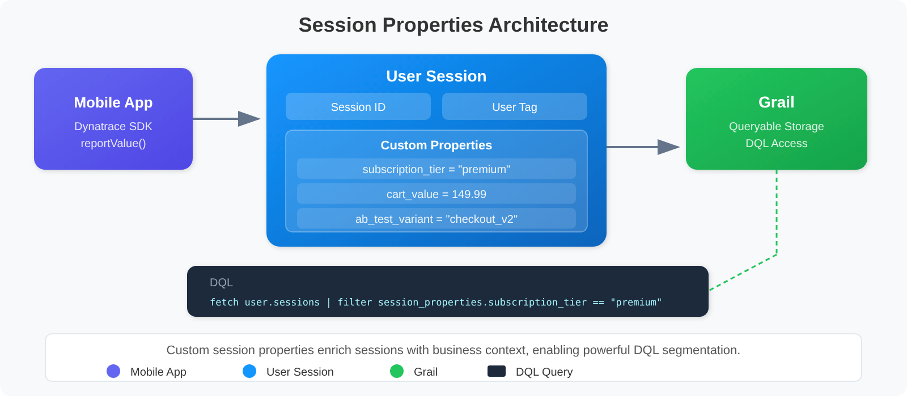

# MOBL-09: Session Properties & Data Privacy

> **Series:** MOBL — Mobile Monitoring | **Notebook:** 9 of 12 | **Created:** February 2026 | **Last Updated:** 10/02/2026

## Overview

This notebook covers how to enrich mobile sessions with custom session properties, implement user tagging for session identification, configure data collection levels to control what telemetry the SDK captures, and ensure compliance with GDPR and CCPA privacy regulations. Session properties and privacy controls are two sides of the same coin -- properties make your data actionable, while privacy controls ensure you collect only what you're permitted to.

---

## Table of Contents

1. [Custom Session Properties](#custom-session-properties)
2. [User Tagging](#user-tagging)
3. [Data Collection Levels](#data-collection-levels)
4. [Opt-In Mode](#opt-in-mode)
5. [Privacy Compliance (GDPR/CCPA)](#privacy-compliance)
6. [Querying with Session Properties](#querying-session-properties)
7. [Data Retention](#data-retention)

---

## Prerequisites

| Requirement | Details |
|-------------|---------|
| **Dynatrace Environment** | SaaS with Grail enabled |
| **Permissions** | `storage:user.sessions:read`, `storage:user.events:read`; `user.identifier` is in the sensitive fieldset `builtin-sensitive-user-events-and-sessions`, so reading user tags also needs a grant for that fieldset |
| **Mobile App** | At least one mobile app with Dynatrace SDK integrated |
| **SDK Version** | iOS Agent 8.x+ or Android Agent 8.x+ |
| **Prior Knowledge** | Basic understanding of GDPR/CCPA privacy regulations |
| **Recommended** | Complete MOBL-01 through MOBL-08 first |

<a id="custom-session-properties"></a>

## 1. Custom Session Properties



<!-- MARKDOWN_TABLE_ALTERNATIVE
| Component | Description |
|-----------|-------------|
| Mobile SDK | Reports custom key-value pairs via reportValue() API |
| Session Context | Properties are attached to the user session and sent with beacons |
| Server-Side Rules | Additional properties can be extracted from request attributes |
| Grail Storage | Properties are stored alongside session data for DQL querying |
| Dynatrace UI | Filter and segment sessions by property values in dashboards |
For environments where SVG doesn't render
-->

**Session properties** are custom key-value pairs attached to a user session. They enrich your mobile telemetry with business context that Dynatrace cannot automatically detect -- subscription tier, A/B test variant, feature flags, cart value, or any other app-specific attribute.

### Property Types

| Type | Description | Example |
|------|-------------|---------|
| **String** | Text values | `"subscription_tier" = "premium"` |
| **Int / Long** | Integer values | `"items_in_cart" = 5` |
| **Double** | Decimal values | `"cart_value" = 149.99` |

The Android SDK documents `int`, `long`, `double` and `string` values; report a date as a string or an epoch number.

### Setting Properties from the SDK

Properties can be reported at any point during a session, and are sent with the next beacon.

Values are reported **on a user action** -- *"The reported values must be part of a user action"* -- and are then converted into user action and session properties in the Dynatrace UI. There is no static `reportValue`.

**iOS (Swift):**

```swift
// iOS -- report values on an open action
Dynatrace.identifyUser("usr_a1b2c3d4")
let action = DTXAction.enter(withName: "Load account")
action?.reportValue(withName: "subscription_tier", stringValue: "premium")
action?.reportValue(withName: "cart_value", doubleValue: 149.99)
action?.leave()
```

**Android (Kotlin):**

```kotlin
// Android -- report values on an open action
Dynatrace.identifyUser("usr_a1b2c3d4")
val action = Dynatrace.enterAction("Load account")
action.reportValue("subscription_tier", "premium")
action.reportValue("cart_value", 149.99)
action.leaveAction()
```

> **Correction (09/28/2026).** Earlier revisions called `DTXAction.reportValue(...)` / `Dynatrace.reportValue(...)` statically. Both SDKs report values on an action instance.

> <sub>**Sources:** [OneAgent SDK for Android (DT docs)](https://docs.dynatrace.com/docs/observe/digital-experience/rum-classic/mobile-applications/instrument-android-app/instrumentation-via-oneagent-sdk/oneagent-sdk-for-android) — *"The reported values must be part of a user action."*, [OneAgent SDK for iOS (DT docs)](https://docs.dynatrace.com/docs/observe/digital-experience/rum-classic/mobile-applications/instrument-ios-app/customization/oneagent-sdk-for-ios).</sub>

### Where Mobile Properties Come From

In the New RUM Experience, properties land in two namespaces on Grail: **event properties** (`event_properties.*` on `user.events`) and **session properties** (`session_properties.*` on `user.sessions`). For a mobile frontend there are three ways to get them:

| Method | Scope | Mobile? |
|--------|-------|---------|
| **Reported via the RUM APIs** (from your app code) | Event and session properties | Yes |
| **Enriched in OpenPipeline** (aggregated from event properties at ingest) | Session properties | Yes |
| **Config-less via the API** *(Preview)* | Event and session properties | Yes |
| Captured by rules set in the Dynatrace web UI (extracted from a web page) | Event properties | **Web frontends only** |

So mobile properties always start in your code. CSS selectors and JavaScript variables are web capture methods — for a hybrid app they apply to the web content, which is monitored as web RUM. In RUM Classic, values reported with `reportValue()` become properties once they are defined in the mobile app's **Session and user action properties** settings.

> <sub>**Sources:** [RUM data model (DT docs)](https://docs.dynatrace.com/docs/observe/digital-experience/rum/concepts/data-model) — *"Event properties apply to individual user events and are stored in the event_properties namespace. Session properties are aggregated across user sessions and stored in the session_properties namespace."*; method table: rule capture is *"Extracted from a web page, without any code changes required."* (web frontends only); API reporting is *"Sent from your frontend through the RUM APIs."* (web and mobile frontends).</sub>

### Best Practices for Session Properties

| Practice | Reason |
|----------|--------|
| Use descriptive, consistent key names | Makes DQL queries readable and maintainable |
| Set properties early in the session | Ensures they are available for all subsequent actions |
| Keep the property set small and deliberate | Every property is data you send, store and must justify under data minimization |
| Keep PII out of property values | A property is stored as sent — treat it like any other field you would have to delete on request |
| Use enum-like values for strings | Facilitates aggregation (e.g., `"tier" = "free"` vs `"tier" = "Free Trial Account"`) |

<a id="user-tagging"></a>

## 2. User Tagging

User tagging associates a mobile session with a specific user identity. This enables you to track individual user journeys across sessions, correlate mobile issues with support tickets, and analyze per-user performance.

### How User Tagging Works

The `identifyUser()` SDK call sets the user tag for the current session. Once set, the tag persists for the duration of the session and appears in all related telemetry. In Grail it is the `user.identifier` field on `user.sessions`, which belongs to the sensitive fieldset `builtin-sensitive-user-events-and-sessions` and is hidden unless that fieldset is granted.

**iOS (Swift):**

```swift
// Tag the session after user login
Dynatrace.identifyUser("user-id-12345")
```

**Android (Kotlin):**

```kotlin
// Tag the session after user login
Dynatrace.identifyUser("user-id-12345")
```

### Privacy-Aware User Tagging

User tagging requires careful consideration of privacy:

| Approach | Example | Privacy Level |
|----------|---------|---------------|
| **Opaque ID** (recommended) | `"usr_a1b2c3d4"` | High -- no PII exposed |
| **Hashed email** | `sha256("user@example.com")` | Medium -- reversible with rainbow tables |
| **Email address** | `"user@example.com"` | Low -- contains PII, not recommended |
| **Internal user ID** | `"12345"` | High -- meaningless without backend lookup |

> **Important:** Avoid using email addresses, phone numbers, or full names as user tags. Use opaque identifiers that can be correlated with user records on the backend but do not expose personally identifiable information (PII) in Dynatrace.

### Clearing the User Tag

When a user logs out, clear the user tag to prevent subsequent anonymous sessions from being attributed to the previous user:

```swift
// iOS -- clear user identity on logout
Dynatrace.identifyUser(nil)
```

```kotlin
// Android -- clear user identity on logout
Dynatrace.identifyUser(null)
```

<a id="data-collection-levels"></a>

## 3. Data Collection Levels


<!-- MARKDOWN_TABLE_ALTERNATIVE
| Level | Description | Data Captured |
|-------|-------------|---------------|
| Off | No monitoring at all | Nothing -- SDK is completely silent |
| Performance | Anonymous performance data only | Crashes, actions, network timings (no user identification) |
| User Behavior | Full RUM with user identification | All actions, sessions, user tags, session properties, replay |
For environments where SVG doesn't render
-->

Dynatrace provides three **data collection levels** that control how much telemetry the mobile SDK captures. This is the primary mechanism for implementing privacy controls at the SDK level.

| Level | Description | Data Captured |
|-------|-------------|---------------|
| **Off** | No monitoring | Nothing -- SDK is completely silent |
| **Performance** | Anonymous performance data | Crashes, actions, network timings (no user info) |
| **User Behavior** | Full RUM with user identification | Actions, sessions, user tags, properties, session replay |

### Setting the Data Collection Level

**iOS (Swift):**

```swift
// iOS -- configure data collection level and crash reporting
let privacyConfig = Dynatrace.userPrivacyOptions()
privacyConfig.dataCollectionLevel = .userBehavior
privacyConfig.crashReportingOptedIn = true
privacyConfig.crashReplayOptedIn = true // Session Replay on crashes
Dynatrace.applyUserPrivacyOptions(privacyConfig) { (successful) in }
```

**Android (Kotlin):**

```kotlin
// Android -- configure data collection level and crash reporting
Dynatrace.applyUserPrivacyOptions(
    UserPrivacyOptions.builder()
        .withDataCollectionLevel(DataCollectionLevel.USER_BEHAVIOR)
        .withCrashReportingOptedIn(true)
        .withCrashReplayOptedIn(true) // Session Replay on crashes
        .build()
)
```

OneAgent **persists** these preferences and applies them again when the app restarts, and starts a new session whenever they change.

> <sub>**Sources:** [OneAgent SDK for iOS (DT docs)](https://docs.dynatrace.com/docs/observe/digital-experience/rum-classic/mobile-applications/instrument-ios-app/customization/oneagent-sdk-for-ios) — *"OneAgent persists the data privacy preferences and automatically applies them when the application is restarted."*, [OneAgent SDK for Android (DT docs)](https://docs.dynatrace.com/docs/observe/digital-experience/rum-classic/mobile-applications/instrument-android-app/instrumentation-via-oneagent-sdk/oneagent-sdk-for-android).</sub>

### What Each Level Controls

| Feature | Off | Performance | User Behavior |
|---------|-----|-------------|---------------|
| User actions | No | Yes (anonymous) | Yes (with user context) |
| Network requests | No | Yes (anonymous) | Yes (with correlation) |
| Crash reporting | No | Only if opted in | Only if opted in |
| User tagging | No | No | Yes |
| Session properties | No | No | Yes |
| Session replay | No | No | Yes (if enabled) |
| Device context | No | Yes | Yes |

> **Note:** Crash reporting has its own separate opt-in flag (`crashReportingOptedIn`) that works independently of the data collection level. A user can be at the "Performance" level with crash reporting enabled or disabled.

<a id="opt-in-mode"></a>

## 4. Opt-In Mode

**Opt-in mode** means OneAgent starts with the `OFF` data collection level and waits for the user to explicitly consent before collecting data. In community practice, it is the usual basis for consent-before-collection under the EU GDPR — confirm the legal position with your privacy counsel.

### How Opt-In Mode Works

1. **Enable opt-in mode** -- Add the `DTXUserOptIn` key (set to `true`) to `Info.plist` on iOS, or set `userOptIn(true)` in the Dynatrace Android Gradle plugin configuration (MOBL-03 §3). OneAgent starts, but collects nothing until preferences are applied.
2. **Consent dialog shown** -- The app displays a privacy consent dialog explaining what data will be collected and why.
3. **User grants consent** -- The app calls `applyUserPrivacyOptions` with the level the user agreed to.
4. **User declines** -- The app does nothing (or applies `OFF` explicitly); the app functions normally without monitoring.

### iOS

```xml
<!-- Info.plist -->
<key>DTXUserOptIn</key>
<true/>
```

```swift
// After the user grants consent:
func userGrantedConsent() {
    let privacyConfig = Dynatrace.userPrivacyOptions()
    privacyConfig.dataCollectionLevel = .userBehavior
    privacyConfig.crashReportingOptedIn = true
    Dynatrace.applyUserPrivacyOptions(privacyConfig) { (successful) in }
}
```

### Android

```kotlin
// build.gradle.kts (top-level) -- opt-in mode
configure<com.dynatrace.tools.android.dsl.DynatraceExtension> {
    configurations {
        create("sampleConfig") {
            userOptIn(true)
        }
    }
}
```

```kotlin
// After the user grants consent:
fun userGrantedConsent() {
    Dynatrace.applyUserPrivacyOptions(
        UserPrivacyOptions.builder()
            .withDataCollectionLevel(DataCollectionLevel.USER_BEHAVIOR)
            .withCrashReportingOptedIn(true)
            .build()
    )
}
```

### Persisting Consent

OneAgent **persists** the privacy preferences you apply and re-applies them on the next app start, so you do not have to call `applyUserPrivacyOptions` on every launch. Your app is still responsible for:

- Showing the consent dialog only when no choice has been made yet
- Providing a way for the user to change their consent in app settings, which calls `applyUserPrivacyOptions` again
- Recording consent for your own compliance records

> **Correction (09/28/2026).** Earlier revisions implemented opt-in by disabling auto-start and calling a startup method, created privacy options with `DTXUserPrivacyOptions()`, and said the SDK does not persist consent. The documented mechanism is the `DTXUserOptIn` key / `userOptIn` property plus `applyUserPrivacyOptions`, and OneAgent persists the preferences.

> <sub>**Sources:** [OneAgent SDK for iOS (DT docs)](https://docs.dynatrace.com/docs/observe/digital-experience/rum-classic/mobile-applications/instrument-ios-app/customization/oneagent-sdk-for-ios) — *"To activate the user opt-in mode, add the DTXUserOptIn configuration key to your app's Info.plist file"*, [Adjust OneAgent configuration (DT docs)](https://docs.dynatrace.com/docs/observe/digital-experience/rum-classic/mobile-applications/instrument-android-app/instrumentation-via-plugin/adjust-oneagent-configuration) — *"To activate the user opt-in mode (when you use the automatic OneAgent startup ), enable the userOptIn property."*</sub>

<a id="privacy-compliance"></a>

## 5. Privacy Compliance (GDPR/CCPA)

When implementing mobile monitoring, you must comply with applicable privacy regulations. The two most common are GDPR (European Union) and CCPA (California, United States).

### Regulation Requirements & Dynatrace Features

| Regulation | Requirement | Dynatrace Feature |
|------------|-------------|-------------------|
| GDPR | Consent before collection | Opt-in mode (`DTXUserOptIn` / `userOptIn`) |
| GDPR | Right to erasure (Art. 17) | Sensitive Data Center deletion request / Grail record deletion |
| GDPR | Data minimization (Art. 5) | Data collection levels (Off / Performance / User Behavior) |
| GDPR | Purpose limitation | Configurable session properties (collect only what's needed) |
| CCPA | Right to opt out | Privacy options API (`applyUserPrivacyOptions`) |
| CCPA | Data disclosure | Session export via DQL and Grail APIs |
| CCPA | Right to delete | Sensitive Data Center deletion request / Grail record deletion |

### GDPR Implementation Checklist

1. **Implement opt-in mode** -- SDK must not collect data before consent
2. **Display clear consent dialog** -- Explain what data is collected and why, using plain language
3. **Provide granular consent options** -- Allow users to consent to performance monitoring separately from user behavior tracking
4. **Support consent withdrawal** -- Users must be able to revoke consent at any time (set collection level to "Off")
5. **Implement data deletion** -- Use a Sensitive Data Center deletion request (or Grail record deletion) when users exercise their right to erasure
6. **Document data processing** -- Maintain records of processing activities (Art. 30)
7. **Avoid storing PII in session properties** -- Use opaque user IDs, not email addresses or names

### CCPA Implementation Checklist

1. **Add "Do Not Sell" option** -- Provide a mechanism to opt out of data sharing
2. **Disclose data collection in privacy policy** -- List categories of data collected by the mobile SDK
3. **Support data access requests** -- Be able to export a user's session data via DQL
4. **Support data deletion requests** -- Use a Sensitive Data Center deletion request (or Grail record deletion)
5. **Do not discriminate** -- Users who opt out should receive the same app experience

### Deleting a User's Data

Dynatrace documents two routes for erasure requests:

1. **Sensitive Data Center deletion request** (UI) -- the built-in deletion request workflow searches for, reviews and removes personal data associated with specific end users, tracks each request on the **Requests** tab, and keeps an audit trail of every step.
2. **Grail record deletion** (API) -- deletes records selected by a DQL condition. It covers `user.events`, `user.sessions` and `user.replays` among other tables; Sensitive Data Center uses this API underneath.

Identify the user's records first, for example by `user.identifier` (the user tag set with `identifyUser()`), then submit the request through one of the two routes.

> **Warning:** Record deletion is final and cannot be undone. Ensure you have proper authorization and audit logging before processing deletion requests.

> **Correction (09/28/2026).** Earlier revisions showed a `POST /api/v2/data-privacy/deletion` call with `dataTypes: ["RUM"]`. That endpoint is not documented, so an erasure procedure built on it would fail.

> <sub>**Sources:** [Delete personal data in Sensitive Data Center (DT docs)](https://docs.dynatrace.com/docs/manage/data-privacy-and-security/data-privacy/sensitive-data-center/delete-personal-data) — *"The built-in deletion request workflow makes it straightforward to search for, review, and remove personal data associated with specific end users."*, [Record deletion in Grail via API (DT docs)](https://docs.dynatrace.com/docs/platform/grail/organize-data/record-deletion-in-grail) — *"Record deletion is final and can't be undone."*</sub>

<a id="querying-session-properties"></a>

## 6. Querying with Session Properties

Session properties, geolocation, device metadata, and operating system information are available in Grail and can be queried using DQL. `user.sessions` holds one record per session, so `count()` is a session count; `geo.country.iso_code`, `device.manufacturer`, `device.model.identifier`, `os.name`, `os.version` and `app.short_version` are session fields. The following queries demonstrate how to segment mobile sessions by various dimensions.

### Sessions by Country (Geolocation)

```dql
// Sessions by country (geolocation) -- one user.sessions record per session
fetch user.sessions, from:-24h
| filter dt.rum.application.type == "mobile"
| summarize session_count = count(), by:{geo.country.iso_code}
| sort session_count desc
| limit 20
```

### Sessions by Device Manufacturer

```dql
// Sessions by device manufacturer
fetch user.sessions, from:-24h
| filter dt.rum.application.type == "mobile"
| filter isNotNull(device.manufacturer)
| summarize session_count = count(), by:{device.manufacturer}
| sort session_count desc
| limit 15
```

### Sessions by Operating System

```dql
// Sessions by operating system
fetch user.sessions, from:-24h
| filter dt.rum.application.type == "mobile"
| summarize session_count = count(), by:{os.name, os.version}
| sort session_count desc
| limit 20
```

### Sessions by App Version

```dql
// Sessions by app version
fetch user.sessions, from:-24h
| filter dt.rum.application.type == "mobile"
| filter isNotNull(app.short_version)
| summarize session_count = count(), by:{app.short_version, os.name}
| sort session_count desc
| limit 20
```

<a id="data-retention"></a>

## 7. Data Retention

Dynatrace Grail stores mobile RUM data in built-in buckets whose retention you cannot currently change. Understanding data retention is critical for both performance analysis and privacy compliance.

### Default Retention Periods

| Data Type | Default Retention | Configurable |
|-----------|-------------------|-------------|
| User events and sessions (`user.events`, `user.sessions` — actions, crashes, errors, requests) | 35 days | No — built-in RUM buckets |
| Mobile session replay (`default_mobile_user_replays`) | 35 days | No — built-in RUM bucket |
| Business events your app sends (`bizevents`) | 35 days | Yes, per bucket |
| Metrics (aggregated performance data, `default_metrics`) | 15 months | Longer retention depends on your subscription (ORGNZ series) |
| Entities (mobile app configurations) | Lifetime of entity | N/A |

### RUM Retention Is Not Configurable Today

Dynatrace: *"Grail stores RUM data across seven built-in buckets. All buckets have a 35-day retention period by default"*, and *"You cannot currently modify these buckets or create custom RUM buckets."* Extended retention for RUM data is in preview ([RUM data access controls (DT docs)](https://docs.dynatrace.com/docs/platform/upgrade/best-practices/stage-02-post-ingest-enrichment/rum-data-access-controls)). So a bucket cannot shorten or lengthen mobile session, event or replay retention, and RUM data cannot be routed into custom buckets.

A dedicated bucket applies only to data you can route, such as business events your app sends:

1. **Create a dedicated bucket** -- Create a Grail bucket for those business events with the desired retention period
2. **Configure OpenPipeline** -- Route the business events to the dedicated bucket using OpenPipeline processing rules

### Privacy Implications of Retention

| Consideration | Recommendation |
|---------------|----------------|
| **GDPR data minimization** | Set the shortest retention that meets business needs where retention is configurable (business events); for RUM data, minimize what the SDK captures |
| **Right to erasure** | Use a Sensitive Data Center deletion request (or Grail record deletion) for individual user requests; do not rely solely on retention expiry |
| **Regulatory audit** | Ensure retention periods are documented in your data processing records |
| **Cross-border data** | Verify that Grail storage regions comply with data residency requirements |
| **Session replay** | Replay retention is fixed at 35 days today, so limit what is captured instead — masking and replay sampling (MOBL-08) |

> <sub>**Sources:** [Organize data (DT docs)](https://docs.dynatrace.com/docs/platform/grail/organize-data) — built-in bucket table: `default_metrics` metrics 15 months.</sub>

---

## Summary

In this notebook, you learned:

- **Custom session properties** -- how to enrich mobile sessions with key-value pairs using `reportValue()` on a user action
- **User tagging** -- how `identifyUser()` associates sessions with a user identity, and why opaque IDs are preferred over PII
- **Data collection levels** -- the three levels (Off, Performance, User Behavior) and what telemetry each controls
- **Opt-in mode** -- how `DTXUserOptIn` / `userOptIn` keeps OneAgent from collecting until the app applies the user's consent
- **GDPR and CCPA compliance** -- regulation requirements mapped to Dynatrace features, including Sensitive Data Center deletion requests and Grail record deletion
- **Querying session properties** -- DQL patterns for segmenting sessions by country, device, OS, and app version
- **Data retention** -- built-in 35-day RUM buckets (not currently configurable) and their privacy implications

---

## Next Steps

Continue to **MOBL-10: DQL for Mobile Analytics** to learn:
- The mobile data model in Grail (`user.events`, `user.sessions`, Smartscape `FRONTEND`)
- Engagement, crash, app-start and network analysis queries
- Device, OS, geography and release segmentation

---

<sub>*This notebook was AI-generated from community-submitted and publicly available sources. This notebook series is not officially supported by Dynatrace. Always verify information against official Dynatrace documentation.*</sub>
