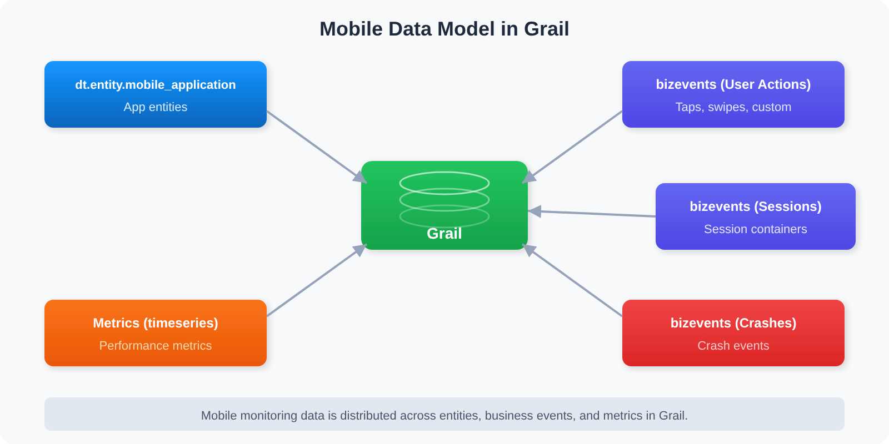

# MOBL-10: DQL for Mobile Analytics

> **Series:** MOBL — Mobile Monitoring | **Notebook:** 10 of 12 | **Created:** February 2026 | **Last Updated:** 10/02/2026

## Overview

A comprehensive DQL reference for mobile analytics — querying the app inventory, user actions, crashes, app starts, device/OS segmentation, and geolocation from Grail `user.events` and `user.sessions`. This notebook is designed as a **reusable query template library** that SREs and platform engineers can copy, adapt, and integrate into dashboards, notebooks, and automation workflows.

Every query in this notebook targets real mobile monitoring data in Grail and follows DQL best practices: explicit time ranges, early filtering, proper aliasing, and performance-conscious patterns.

---

## Table of Contents

1. [Mobile Data Model in Grail](#mobile-data-model)
2. [Querying Mobile Entities](#querying-entities)
3. [User Action Analytics](#user-action-analytics)
4. [Crash & Error Analytics](#crash-error-analytics)
5. [Performance Metrics](#performance-metrics)
6. [Device & OS Segmentation](#device-os-segmentation)
7. [Geolocation Analysis](#geolocation-analysis)
8. [Reusable Query Templates](#reusable-templates)

---

## Prerequisites

| Requirement | Details |
|-------------|---------|
| **Dynatrace Environment** | SaaS with Grail enabled |
| **Permissions** | `storage:user.events:read`, `storage:user.sessions:read`, `storage:smartscape:read` (or `storage:entities:read` for the classic table) |
| **Mobile App Data** | At least one mobile application (iOS or Android) instrumented with OneAgent Mobile SDK and sending data |
| **DQL Knowledge** | Familiarity with `fetch`, `filter`, `summarize`, and `makeTimeseries` commands |

<a id="mobile-data-model"></a>

## 1. Mobile Data Model in Grail

Understanding where mobile data lives in Grail is the foundation for writing effective DQL queries. Unlike traditional APM data that maps neatly to logs and spans, mobile monitoring data is distributed across multiple Grail data objects.



<!-- MARKDOWN_TABLE_ALTERNATIVE
| Data Source | Description |
|-------------|-------------|
| Smartscape FRONTEND (frontend.type = mobile) | Mobile app inventory |
| user.events -- actions, requests | characteristics.has_user_action, has_request |
| user.sessions | One record per session |
| user.events -- crashes, ANRs | characteristics.has_crash, has_anr |
| Metrics (timeseries) | Aggregated performance counters |
For environments where SVG doesn't render
-->

The following table maps each mobile data type to its Grail location and the DQL used to query it:

| Data Type | Grail Location | DQL |
|-----------|---------------|-----|
| App inventory | Smartscape `FRONTEND` node | `smartscapeNodes "FRONTEND" \| filter frontend.type == "mobile"` |
| User actions | `user.events` | `filter characteristics.has_user_action` (control: `ui_element.detected_name`; kind: `interaction.type`) |
| Sessions | `user.sessions` | one record per session; `count()` is a session count |
| Crashes / ANRs | `user.events` | `filter characteristics.has_crash` / `characteristics.has_anr` |
| Reported errors | `user.events` | `filter characteristics.has_error and characteristics.is_api_reported` |
| App starts | `user.events` | `filter characteristics.has_app_start` |
| Network requests | `user.events` | `filter characteristics.has_request` (`url.full`, `http.request.method`, `http.response.status_code`) |
| Custom business events (`sendBizEvent`) | `bizevents` | `fetch bizevents \| filter event.type == "<your type>"` |

`dt.rum.application.type == "mobile"` separates mobile from web frontends in both stores; the crash, ANR and app-start characteristics are set only by OneAgent for Mobile.

> **Correction (09/28/2026).** Earlier revisions of this notebook said mobile data is ingested as business events, identified by `event.provider == "www.dynatrace.com/mobile"`, with `useraction.*` fields and `event.type == "com.dynatrace.crash"`. None of that exists: every such query ran and returned zero rows, silently. The semantic dictionary (read 09/28/2026) places the mobile models -- `rum_mobile_user_action`, `rum_crash`, `rum_anr`, `rum_app_start`, `rum_request`, `rum_api_reported_error` -- in `user.events`, and the session model `rum.user_session` in `user.sessions`.

> <sub>**Dictionary:** models `rum_crash` (description: supported only for OneAgent for Mobile), `rum_mobile_user_action`, `rum_app_start`, `rum_request` with `data_object == "user.events"`; `rum.user_session` with `data_object == "user.sessions"`; fields `frontend.name` (`stable`), `os.name` (`stable`), `app.short_version` (`stable`), `duration` (`stable`), `trace.id` (`stable`), `device.model.identifier` (`experimental`), `geo.country.iso_code` (`experimental`), read 09/28/2026. No row for any `useraction.*` field under `startsWith(name, "useraction")`, read 09/28/2026 (control: `startsWith(name, "os.")` returns rows).</sub>

<a id="querying-entities"></a>

## 2. Querying Mobile Entities

Each mobile application registered in Dynatrace is a Smartscape `FRONTEND` node with `frontend.type == "mobile"` (classic: `dt.entity.mobile_application`). Querying entities gives you an inventory of your monitored mobile apps along with their metadata.

This is typically the first query to run when onboarding a new environment — it confirms which mobile apps are being monitored and how they are tagged.

```dql
// Mobile application inventory with details
// PREFERRED -- Smartscape. Mobile and web applications converged onto the single
// FRONTEND node type; frontend.type ("mobile" / "web") is the discriminator, and
// there is no dt.smartscape.mobile_application. id_classic holds the
// MOBILE_APPLICATION-* id for joining back to unmigrated queries.
smartscapeNodes "FRONTEND"
| filter frontend.type == "mobile"
| fields name, id, id_classic, lifetime, tags
| sort name asc
| limit 50

// Mobile-vs-web split in one pass (no filter needed):
// smartscapeNodes "FRONTEND"
// | summarize apps = count(), by:{frontend.type}

// CORRECTION (07/30/2026): a previous revision claimed dt.entity.mobile_application had no
// Grail Smartscape equivalent. It does -- FRONTEND filtered on frontend.type == "mobile"
// (dt.smartscape.frontend). SaaS 1.344 (07/27/2026, staged tenant rollout from 07/29/2026)
// makes Smartscape the primary surface for the Digital Experience apps; verify it has
// reached your tenant. The classic table below still works and remains a real fallback.
// FALLBACK (classic surface -- still functional):
// fetch dt.entity.mobile_application
// | fields entity.name, id, lifetime, tags
// | sort entity.name asc
// | limit 50
```

**Expected output:** A table listing each mobile application entity with its display name, entity ID, lifetime (first seen to last seen), and any assigned tags.

> **Tip:** Inventory queries (`smartscapeNodes`, or classic `dt.entity.*`) do not require a `from:` time range because they return the current state of the entity, not time-series data.

<a id="user-action-analytics"></a>

## 3. User Action Analytics

User actions represent every meaningful interaction a user has with your mobile app — taps, swipes, app starts, and custom-defined actions. Analyzing user actions reveals engagement patterns, popular features, and potential friction points.

The query below calculates **total actions**, **unique sessions**, and **actions per session** for each application. A high actions-per-session ratio typically indicates strong engagement, while a low ratio may signal usability issues or users abandoning the app early.

```dql
// User engagement summary -- actions per session, per app
fetch user.events, from:-24h
| filter dt.rum.application.type == "mobile" and characteristics.has_user_action
| summarize total_actions = count(), unique_sessions = countDistinct(dt.rum.session.id), by:{frontend.name}
| fieldsAdd actions_per_session = toDouble(total_actions) / toDouble(unique_sessions)
| sort total_actions desc
| limit 20
```

**Expected output:** A ranked table of mobile applications showing total user actions, unique session count, and the computed actions-per-session engagement ratio.

**Key fields used:**

| Field | Description |
|-------|-------------|
| `dt.rum.application.type` | `"mobile"` for mobile frontends, `"web"` for web |
| `characteristics.has_user_action` | Marks user-action events in `user.events` |
| `frontend.name` | Name of the mobile application |
| `dt.rum.session.id` | Unique session identifier for counting distinct sessions |

<a id="crash-error-analytics"></a>

## 4. Crash & Error Analytics

Crashes are the most critical mobile quality signal. A single crash can result in a negative app store review and lost users. This section provides queries for tracking crash volume trends over time.

The following query creates a 7-day timeseries of daily crash counts, broken down by application. This is ideal for spotting regressions after a new release.

```dql
// Daily crash volume by application (7 day trend)
fetch user.events, from:-7d
| filter characteristics.has_crash
| makeTimeseries crash_count = count(), by:{frontend.name}, interval:24h
```

**Expected output:** A time chart with one line per mobile application showing daily crash counts over the past 7 days.

> **Important:** A sudden spike in the crash timeseries after a deployment date is a strong signal that a release introduced a regression. Pair this query with the crash rate by app version query in [Section 8](#reusable-templates) for release-level analysis.

<a id="performance-metrics"></a>

## 5. Performance Metrics

App launch time is a key performance indicator for mobile applications — it is the first thing every user waits for.

This query tracks the average app launch duration over the past 24 hours at hourly granularity, using app-start events (`characteristics.has_app_start`, mobile-only) and reporting both the average and the 90th percentile per OS.

```dql
// App start duration trend (timeseries) -- app-start events are mobile-only
fetch user.events, from:-24h
| filter characteristics.has_app_start
| makeTimeseries {avg_start = avg(duration), p90_start = percentile(duration, 90)}, by:{os.name}, interval:1h
```

**Expected output:** A time chart showing average and p90 app-start duration per hour and OS over the last 24 hours. `duration` is a duration value, so charts show it with time units.

**Rule-of-thumb bands** (community practice — set your own targets from your app's baseline):

| Launch Time | Rating |
|-------------|--------|
| `duration < 1s` | Excellent |
| `1s`–`2s` | Acceptable |
| `2s`–`5s` | Needs improvement |
| `duration > 5s` | Poor — investigate immediately |

> **Tip:** The query already splits by `os.name`. To compare start types (cold, warm, hot), inspect the app-start events in your tenant for the start-type field before grouping on it. Compare `duration` with duration literals (`duration > 2s`), never with a bare number.

<a id="device-os-segmentation"></a>

## 6. Device & OS Segmentation

Understanding the device and OS landscape of your user base is critical for prioritizing testing efforts and identifying platform-specific issues. These queries segment `user.sessions` (one record per session) by OS version and device model.

```dql
// OS version distribution
fetch user.sessions, from:-24h
| filter dt.rum.application.type == "mobile"
| summarize session_count = count(), by:{os.name, os.version}
| sort session_count desc
| limit 20
```

**Expected output:** A table showing the top 20 OS type/version combinations ranked by session count. This helps answer questions like "What percentage of our users are on iOS 18 vs iOS 17?" and "Should we still support Android 12?"

The next query drills into the physical device landscape:

```dql
// Top device models by session count
fetch user.sessions, from:-24h
| filter dt.rum.application.type == "mobile"
| filter isNotNull(device.model.identifier)
| summarize session_count = count(), by:{device.manufacturer, device.model.identifier}
| sort session_count desc
| limit 20
```

**Expected output:** A ranked table of the top 20 device manufacturer/model combinations by session count.

> **Tip:** Combine device segmentation with crash data to identify device-specific crash patterns. For example, if a particular Samsung model has a disproportionately high crash rate, it may indicate a hardware or firmware compatibility issue.

<a id="geolocation-analysis"></a>

## 7. Geolocation Analysis

Geographic distribution of mobile sessions helps you understand where your users are and whether regional performance or availability issues exist. This data is invaluable for CDN optimization, regional rollout planning, and compliance considerations.

```dql
// Geographic distribution of mobile sessions
fetch user.sessions, from:-24h
| filter dt.rum.application.type == "mobile"
| summarize {session_count = count(), action_count = sum(user_action_count)}, by:{geo.country.iso_code}
| sort session_count desc
| limit 20
```

**Expected output:** A table of the top 20 countries by session count, also showing total user-action count per country (the sum of `user_action_count`). This dual metric helps distinguish between countries with many casual users (high sessions, low actions) versus countries with highly engaged users (lower sessions, high actions per session).

> **Tip:** `geo.country.iso_code` is the session's country code. Check the semantic dictionary for finer-grained geo fields available on `user.sessions` in your tenant before grouping on them.

<a id="reusable-templates"></a>

## 8. Reusable Query Templates

This section provides production-ready query templates that combine multiple concepts. The crash rate by app version query below is one of the most valuable templates for mobile release monitoring.

### Crash Rate by App Version

This query calculates the **crash rate percentage** for each app version and OS combination over the past 7 days. It reads `user.sessions`, where each record is one session and `error.has_crash` marks sessions that crashed, so `countIf(error.has_crash == true)` over `count()` is the session crash rate.

```dql
// Crash rate by app version -- useful for release monitoring (session grain)
fetch user.sessions, from:-7d
| filter dt.rum.application.type == "mobile"
| summarize {total_sessions = count(), crash_sessions = countIf(error.has_crash == true)}, by:{app.short_version, os.name}
| fieldsAdd crash_rate_pct = toDouble(crash_sessions) / toDouble(total_sessions) * 100.0
| sort crash_rate_pct desc
| limit 20
```

**Expected output:** A table showing each app version and OS combination with total sessions, crash sessions, and crash rate percentage.

**Interpreting crash rates.** There is no single industry standard. One published external anchor is Google Play's Android vitals *bad behavior threshold*: a user-perceived crash rate of **1.09%** overall (8% per phone model) and an ANR rate of **0.47%**. Google measures the share of **daily active users** who saw a crash, not the share of sessions, so this query's session rate is not directly comparable — use the threshold as a ceiling to stay well below, and set your own target from your app's baseline.

> <sub>**Sources:** [Android vitals (Android Developers)](https://developer.android.com/topic/performance/vitals) — bad-behavior thresholds table: *"User-perceived crash rate 1.09% 8% 4%"*, *"User-perceived ANR rate 0.47% 8% 5%"*.</sub>

> **Note:** Because `user.sessions` has one record per session, `countIf(error.has_crash == true)` counts each crashed session once, however many crashes it had. Subtract the rate from 100% for the crash-free session rate.

## Summary

This notebook provided 8 production-ready DQL queries covering the full spectrum of mobile analytics:

| Section | Query Focus | Key Insight |
|---------|-------------|-------------|
| Mobile Data Model | Data architecture | Mobile RUM data lives in `user.events` and `user.sessions` |
| Entity Queries | App inventory | Smartscape `FRONTEND` with `frontend.type == "mobile"` |
| User Action Analytics | Engagement | Actions per session measures user engagement |
| Crash Analytics | Stability | Daily crash trends reveal regression patterns |
| Performance Metrics | Launch time | App start duration is the key mobile KPI |
| Device/OS Segmentation | Compatibility | Identify platform-specific issues |
| Geolocation | Regional analysis | Session and action counts by country |
| Reusable Templates | Release monitoring | Crash rate by app version for release gates |

**Key patterns to remember:**
- Filter `user.events` / `user.sessions` on `dt.rum.application.type == "mobile"`, and select event types with `characteristics.has_*`
- Count sessions with `count()` on `user.sessions` (one record per session), or `countDistinct(dt.rum.session.id)` on `user.events`
- Use `countIf(error.has_crash == true)` on `user.sessions` for crashed sessions
- Add `isNotNull()` filters before grouping on optional fields like `app.short_version` or `device.model.identifier`
- `duration` is a duration: compare with `duration > 2s`, not a number

## Next Steps

Continue to **MOBL-11: Dashboards & Alerting** to learn about building mobile monitoring dashboards and alerts that operationalize the DQL queries from this notebook into automated workflows.

---

<sub>*This notebook was AI-generated from community-submitted and publicly available sources. This notebook series is not officially supported by Dynatrace. Always verify information against official Dynatrace documentation.*</sub>
