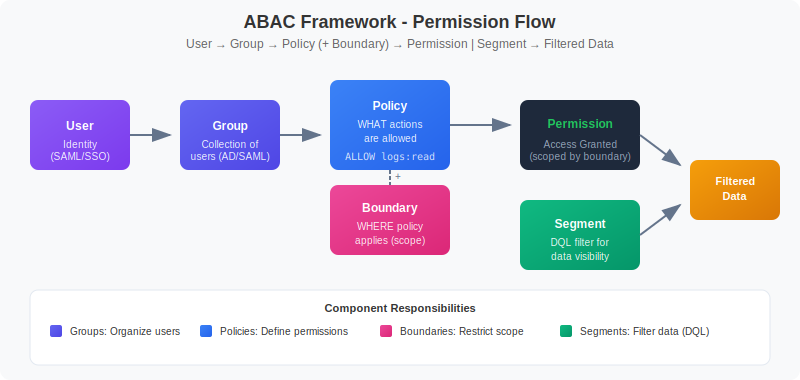

# MZ2POL-02: Understanding the New Access Control Model

> **Series:** MZ2POL | **Notebook:** 3 of 8 | **Created:** December 2025

## Overview

This notebook provides a deep dive into the **ABAC (Attribute-Based Access Control)** framework that replaces Management Zones for access control. You'll learn how Policies, Boundaries, and Segments work together to provide flexible, scalable access management.

## Prerequisites

- Completed MZ2POL-01: Introduction
- Access to Dynatrace Account Management
- Understanding of current Management Zone configuration

## Learning Objectives

By the end of this notebook, you will:
1. Understand the ABAC framework architecture
2. Know the relationship between Policies, Boundaries, and Segments
3. Understand how permissions flow through the system
4. Be able to map MZ concepts to the new model

---

## 1. ABAC Framework Architecture

### The Permission Flow



<!--MARKDOWN_TABLE_ALTERNATIVE
| Component | Purpose | Configured In |
|-----------|---------|---------------|
| Users | Individual identities | Account Management |
| Groups | Collections of users | Identity & Access Management |
| Policies | Permission definitions | Policy Management |
| Boundaries | Scope restrictions | Policy Boundaries |
| Segments | Data filtering | Segments app |
-->

### Key Components

| Component | Purpose | Configured In |
|-----------|---------|---------------|
| **Users** | Individual identities | Account Management |
| **Groups** | Collections of users | Identity & Access Management |
| **Policies** | Permission definitions | Policy Management |
| **Boundaries** | Scope restrictions | Policy Boundaries |
| **Segments** | Data filtering | Segments app |

### How It Works Together

1. **Users** are assigned to **Groups**
2. **Groups** are bound to **Policies**
3. **Boundaries** can optionally restrict the **Policy** scope
4. **Segments** filter what data users see (independent of permissions)

---

## 2. Policies Deep Dive

### What Are Policies?

Policies are the core of ABAC - they define **WHAT** users can do.

### Policy Types

| Type | Description | Editable |
|------|-------------|----------|
| **Default Policies** | Pre-defined by Dynatrace | No (read-only) |
| **Custom Policies** | Created by administrators | Yes |

### Default Policies Categories

**Dynatrace Access Policies** (Platform features):
- `Dynatrace Viewer` - Read-only access
- `Dynatrace Standard User` - Standard operations
- `Dynatrace Professional User` - Advanced features
- `Dynatrace Admin User` - Full administration

**Data Access Policies** (Monitored data):
- `Data Viewer` - Read monitored data
- `Data Editor` - Modify data configurations

### Policy Statement Structure

```
ALLOW <service>:<resource>:<action> [WHERE <condition>]
```

**Examples:**
```
ALLOW storage:buckets:read
ALLOW settings:objects:read WHERE settings:schemaId = "builtin:alerting.profile"
ALLOW storage:logs:read WHERE storage:dt.security_context = "team-a"
```

---

## 3. Boundaries Deep Dive

### What Are Boundaries?

Boundaries restrict **WHERE** policies apply - they limit the scope of permissions.

### Key Characteristics

- **Optional** but powerful for fine-grained access control
- Work **together** with policies (not standalone)
- **Further restrict** existing policy permissions
- Enable **reusability** across multiple policy assignments

### Boundary Query Syntax

```
<field> <operator> "<value>"
```

**Supported Operators:**
- `=` - Equals
- `!=` - Not equals
- `startsWith` - Prefix match
- `in` - Value in list

**Common Fields:**
- `environment` - Environment restrictions
- `environment:management-zone` - MZ-based restrictions
- `storage:dt.security_context` - Security context filtering

### Boundary Examples

**Restrict to specific Management Zone (transitional):**
```
environment:management-zone = "Production-NA"
```

**Restrict by Management Zone prefix:**
```
environment:management-zone startsWith "mgmt_na"
```

**Restrict by Security Context:**
```
storage:dt.security_context = "team-frontend"
```

### Boundary Limitations

| Limitation | Workaround |
|------------|------------|
| Max 10 restrictions per boundary | Create multiple boundaries |
| No AND operator (lines are OR) | Use multiple boundary assignments |
| Only works with security policies | Cannot use with role-based permissions |

---

## 4. Segments Deep Dive

### What Are Segments?

Segments are **DQL-based filter conditions** that control what data users see - they're the replacement for MZ data filtering.

### Key Characteristics

- **Query-time evaluation** (not precalculated)
- **Multi-dimensional** - can layer multiple segments
- **DQL-powered** - full query language flexibility
- Support **variables** for dynamic filtering
- **Independent of permissions** - filtering only

### How Segments Work in DQL

When a segment is applied, Grail:
1. Evaluates segment conditions relevant to the query
2. Applies filters based on the targeted data object
3. Multiple conditions for same data object = OR combined

### Segment vs. Management Zone Filtering

| Aspect | Management Zone | Segment |
|--------|-----------------|----------|
| Evaluation | Precalculated | Query-time |
| Performance | Bottleneck at scale | Highly scalable |
| Flexibility | Fixed rules | Dynamic DQL |
| Variables | No | Yes |
| Multi-dimensional | No | Yes |

---

## 5. Querying Current Access Configuration

### View Services with Security Context

Security Context is key for access control in the new model:

```dql
// List services and their security context
// Security context is used for fine-grained access control
fetch dt.entity.service
| fields entity.name, 
         dt.security_context,
         managementZones
| filter isNotNull(dt.security_context)
| sort entity.name asc
| limit 50
```

### Analyze Entity Types and Their Attributes

Understanding entity attributes helps design effective segments:

```dql
// Analyze host entity attributes for segment planning
// Tags and metadata are useful for segment conditions
fetch dt.entity.host
| fields entity.name,
         tags,
         managementZones
| limit 20
```

### Check Kubernetes Cluster Distribution

K8s clusters often map to organizational boundaries:

```dql
// List Kubernetes clusters with their attributes
// Clusters often align with team or environment boundaries
fetch dt.entity.kubernetes_cluster
| fields entity.name,
         tags,
         managementZones
| sort entity.name asc
```

---

## 6. Mapping MZ Concepts to New Model

### Common MZ Patterns and Their Replacements

| MZ Pattern | New Approach |
|------------|-------------|
| **Team-based MZs** | Security Context + Policies |
| **Environment MZs** (Dev/Prod) | Boundaries with environment filters |
| **Region MZs** | Segments with cloud region filters |
| **Application MZs** | Segments with service/app filters |
| **Multi-tenant MZs** | Boundaries + Security Context |

### Example: Team-Based Access Control

**Old (Management Zone):**
- MZ: "Team-Frontend" with rules for frontend services
- Users assigned to MZ get filtered view

**New (Policies + Boundaries + Segments):**
1. **Policy**: `Dynatrace Standard User` or custom policy
2. **Boundary**: `storage:dt.security_context = "team-frontend"`
3. **Segment**: DQL filter for frontend services

### Example: Environment Separation

**Old (Management Zone):**
- MZ: "Production" with host/service rules
- MZ: "Development" with different rules

**New (Policies + Boundaries + Segments):**
1. **Policy**: Same policy for both groups
2. **Boundary (Prod)**: Environment-specific restrictions
3. **Boundary (Dev)**: Environment-specific restrictions
4. **Segments**: Environment-based data filters

---

## 7. Access Control Decision Flow

### Permission Evaluation Order

```
1. User attempts action
2. System checks user's group memberships
3. For each group, evaluate bound policies
4. Apply boundary restrictions (if any)
5. If ALLOW found with matching conditions → Permit
6. If no ALLOW found → Deny (implicit)
```

### Segment Application

```
1. User queries data (DQL, dashboard, app)
2. Active segment(s) identified
3. Segment conditions injected into query
4. Grail evaluates with segment filters
5. Filtered results returned
```

### Key Differences from MZ

| MZ Behavior | New Behavior |
|-------------|-------------|
| Single construct for access + filtering | Separate concerns (Policies vs Segments) |
| Precalculated membership | Runtime evaluation |
| Limited to entity types | Any DQL-queryable attribute |
| Flat structure | Hierarchical (groups → policies → boundaries) |

---

## 8. Best Practices for the New Model

### Policy Design

1. **Start with default policies** - customize only when needed
2. **Use least privilege** - grant minimum required permissions
3. **Group similar permissions** - avoid policy sprawl
4. **Document policy purpose** - maintain clarity

### Boundary Design

1. **Create reusable boundaries** - one boundary, many uses
2. **Use meaningful names** - indicate scope clearly
3. **Keep conditions simple** - easier to audit
4. **Leverage security context** - for entity-level control

### Segment Design

1. **Align with business structure** - teams, regions, products
2. **Use variables** - for dynamic, flexible filters
3. **Test thoroughly** - verify filtering works as expected
4. **Layer segments** - combine for precise filtering

---

## Summary

In this notebook, you learned:

1. **ABAC Framework**: How Users → Groups → Policies → Permissions flow
2. **Policies**: Define WHAT users can do (permissions)
3. **Boundaries**: Restrict WHERE policies apply (scope)
4. **Segments**: Filter WHAT data users see (DQL-based)
5. **Mapping**: How MZ patterns translate to the new model

## Next Steps

Continue to **MZ2POL-03: Assessment and Migration Planning** to:
- Audit your current MZ configuration in detail
- Create a migration mapping document
- Plan the phased migration approach

## Additional Resources

- [Working with Policies](https://docs.dynatrace.com/docs/manage/identity-access-management/permission-management/manage-user-permissions-policies)
- [IAM Policy Reference](https://docs.dynatrace.com/docs/manage/identity-access-management/permission-management/manage-user-permissions-policies/advanced/iam-policystatements)
- [Default Policies Reference](https://docs.dynatrace.com/docs/manage/identity-access-management/use-cases/default-groups-permissions)
- [Grant Access to Entities with Security Context](https://docs.dynatrace.com/docs/manage/identity-access-management/use-cases/access-security-context)
