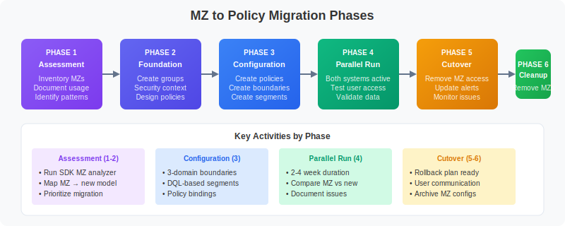

# MZ2POL-03: Assessment and Migration Planning

> **Series:** MZ2POL | **Notebook:** 4 of 8 | **Created:** December 2025

## Overview

This notebook guides you through a comprehensive assessment of your current Management Zone implementation and helps you create a detailed migration plan to the new Policies, Boundaries, and Segments model.

## Prerequisites

- Completed MZ2POL-01 and MZ2POL-02
- Admin access to Dynatrace environment
- Access to Account Management
- List of current user groups and their MZ assignments

## Learning Objectives

By the end of this notebook, you will:
1. Have a complete inventory of your Management Zones
2. Understand the mapping from MZs to new constructs
3. Have a prioritized migration plan
4. Know the risks and mitigation strategies

---

## 1. Management Zone Inventory

> ⚠️ **Important:** Management Zone configurations **cannot be queried via DQL**.
>
> **Options for MZ inventory:**
> 1. **Dynatrace UI (Recommended):** Settings → Management Zones
> 2. **SDK Analysis:** See **MZ2POL-00: SDK Management Zone Analysis Tool** for comprehensive analysis including rule patterns, coverage metrics, and migration readiness.

### Entity Distribution Across MZs

> ⚠️ **Limitation:** DQL queries against `managementZones` may not accurately reflect the full MZ entity distribution due to how MZ rules propagate. For accurate counts, use the **classic Dynatrace UI** which shows entity counts directly on each Management Zone configuration.

The query below provides an approximation of entity distribution:

```python
// Service distribution by Management Zone
fetch dt.entity.service
| expand mz = managementZones
| summarize serviceCount = count(), by:{managementZone = mz}
| sort serviceCount desc
| limit 25
```

---

## 2. MZ Pattern Classification

### Categorize Your Management Zones

Group your MZs by their primary purpose:

#### Category 1: Team/Ownership Based
- **Pattern**: MZs named after teams (e.g., "Team-Frontend", "Platform-Team")
- **Migration**: → Security Context + Policies + Boundaries
- **Priority**: High (affects user access)

#### Category 2: Environment Based
- **Pattern**: MZs for environments (e.g., "Production", "Staging", "Development")
- **Migration**: → Boundaries with environment conditions
- **Priority**: High (critical for access separation)

#### Category 3: Geographic/Region Based
- **Pattern**: MZs for regions (e.g., "NA-East", "EU-West", "APAC")
- **Migration**: → Segments with cloud region/location filters
- **Priority**: Medium (primarily filtering)

#### Category 4: Application/Service Based
- **Pattern**: MZs for applications (e.g., "Payment-System", "User-Portal")
- **Migration**: → Segments with service/application filters
- **Priority**: Medium (primarily filtering)

#### Category 5: Infrastructure Based
- **Pattern**: MZs for infrastructure (e.g., "Kubernetes", "Legacy-VMs")
- **Migration**: → Segments with infrastructure type filters
- **Priority**: Low (usually informational)

---

## 3. Security Context Planning

### Design Your Security Context Strategy

Security Context enables entity-level access control. Plan how to tag your entities:

| Entity Type | Security Context Value | Purpose |
|-------------|----------------------|----------|
| Services | `team-{teamname}` | Team ownership |
| Hosts | `env-{environment}` | Environment separation |
| Applications | `app-{appname}` | Application isolation |

### Query Entities Without Security Context

Identify entities that need security context assignment:

```dql
// Find services without security context
// These need to be tagged before migration
fetch dt.entity.service
| filter isNull(dt.security_context)
| fields entity.name,
         managementZones,
         tags
| limit 50
```

```dql
// Count entities by security context presence
// Helps estimate security context tagging effort
fetch dt.entity.service
| summarize 
    withContext = countIf(isNotNull(dt.security_context)),
    withoutContext = countIf(isNull(dt.security_context))
```

---

## 4. Migration Priority Matrix

### Prioritize Based on Impact and Complexity



<!--MARKDOWN_TABLE_ALTERNATIVE
| Priority | Criteria | Examples |
|----------|----------|----------|
| P1 - Critical | Security/compliance requirements | Production access control |
| P2 - High | Actively used for access control | Team-based MZs |
| P3 - Medium | Used for filtering only | Region/app MZs |
| P4 - Low | Informational/rarely used | Legacy MZs |
-->

| Priority | Criteria | Examples |
|----------|----------|----------|
| **P1 - Critical** | Security/compliance requirements | Production access control |
| **P2 - High** | Actively used for access control | Team-based MZs |
| **P3 - Medium** | Used for filtering only | Region/app MZs |
| **P4 - Low** | Informational/rarely used | Legacy MZs |

### Risk Assessment

| Risk | Likelihood | Impact | Mitigation |
|------|------------|--------|------------|
| Users lose access | Medium | High | Parallel running period |
| Wrong data visible | Medium | High | Thorough testing |
| Alert routing breaks | High | Medium | Update alerts before cutover |
| Dashboard filters fail | Medium | Low | Pre-update dashboards |

---

## 5. Migration Timeline Template

### Recommended Phases

#### Phase 1: Preparation
- [ ] Complete MZ inventory
- [ ] Document current user access patterns
- [ ] Create migration mapping for all MZs
- [ ] Design security context strategy
- [ ] Identify dependencies (alerts, dashboards, APIs)

#### Phase 2: Foundation
- [ ] Apply security context to entities
- [ ] Create user groups in Account Management
- [ ] Set up IAM policy structure
- [ ] Create boundary definitions

#### Phase 3: Segments
- [ ] Create segments for data filtering
- [ ] Test segment functionality
- [ ] Update dashboards to use segments
- [ ] Validate filtering behavior

#### Phase 4: Policy Assignment
- [ ] Bind policies to groups
- [ ] Apply boundaries to policy bindings
- [ ] Test user access (parallel with MZs)
- [ ] Document access verification results

#### Phase 5: Cutover
- [ ] Update alerting profiles to use segments
- [ ] Migrate API integrations
- [ ] Remove MZ-based access (RBAC)
- [ ] Monitor for access issues

#### Phase 6: Cleanup
- [ ] Verify no MZ dependencies remain
- [ ] Archive MZ configurations
- [ ] Remove unused MZs
- [ ] Update documentation

---

## 6. Dependencies Checklist

### What References Management Zones?

Before migrating, identify all MZ dependencies:

#### Alerting
- [ ] Alerting profiles using MZ filters
- [ ] Problem notifications scoped to MZs
- [ ] Metric events with MZ dimensions

#### Dashboards & Reports
- [ ] Dashboards with MZ filters
- [ ] Reports scoped to MZs
- [ ] SLOs using MZ-filtered data

#### Integrations
- [ ] API calls with MZ parameters
- [ ] Automation workflows using MZ scopes
- [ ] Third-party integrations filtering by MZ

#### Access Control
- [ ] User groups with MZ assignments
- [ ] RBAC roles using MZ restrictions

---

## Summary

In this notebook, you:

1. **Inventoried** all Management Zones with DQL queries
2. **Classified** MZs by pattern (team, environment, region, etc.)
3. **Created** migration mapping templates
4. **Planned** security context strategy
5. **Prioritized** migration based on risk and impact
6. **Identified** dependencies to address

## Deliverables Checklist

- [ ] Complete MZ inventory spreadsheet
- [ ] Migration mapping document for each MZ
- [ ] Security context assignment plan
- [ ] Prioritized migration schedule
- [ ] Risk assessment and mitigation plan
- [ ] Dependencies checklist

## Next Steps

Continue to **MZ2POL-04: Policies and Boundaries** to:
- Learn policy syntax and structure
- Create custom policies
- Understand default policy capabilities

## Additional Resources

- [Management Zones Documentation](https://docs.dynatrace.com/docs/manage/identity-access-management/permission-management/management-zones)
- [Upgrade from RBAC to IAM Policies](https://docs.dynatrace.com/docs/manage/identity-access-management/permission-management/manage-user-permissions-policies/advanced/migrate-roles)
- [Grant Access to Entities with Security Context](https://docs.dynatrace.com/docs/manage/identity-access-management/use-cases/access-security-context)
