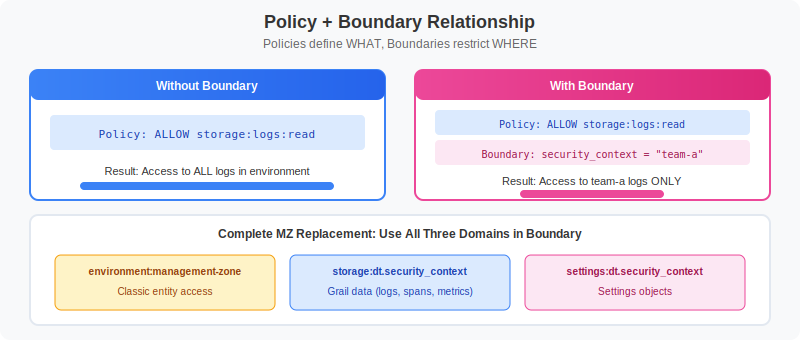
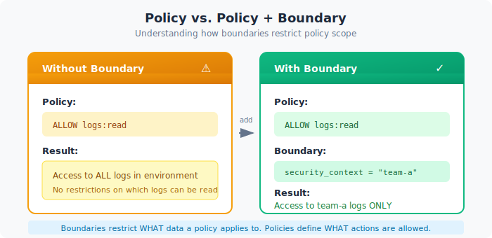
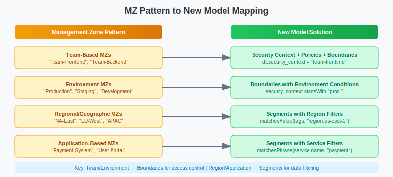

# MZ2POL-04: Policies and Boundaries

> **Series:** MZ2POL | **Notebook:** 5 of 8 | **Created:** December 2025

## Overview

This notebook provides a comprehensive guide to **IAM Policies** and **Policy Boundaries** - the two components that together replace Management Zone access control. Policies define **WHAT** users can do, while boundaries define **WHERE** those permissions apply.

## Prerequisites

- Completed MZ2POL-01 through MZ2POL-03
- Access to Dynatrace Account Management
- Policy Management permissions

## Learning Objectives

By the end of this notebook, you will:
1. Understand policy statement syntax and structure
2. Know the default policies and when to use them
3. Understand boundary syntax and how boundaries restrict policies
4. Be able to map MZ access patterns to policy + boundary combinations
5. Know the recommended group-policy-boundary structure for SAML/AD integration

---

## 1. Understanding the Relationship

### Policies vs Boundaries



<!--MARKDOWN_TABLE_ALTERNATIVE
| Component | Purpose | Analogy |
|-----------|---------|--------|
| Policy | Defines WHAT actions are allowed | "You can read logs" |
| Boundary | Defines WHERE policies apply | "...but only for team-frontend" |
-->

| Component | Purpose | Analogy |
|-----------|---------|--------|
| **Policy** | Defines WHAT actions are allowed | "You can read logs" |
| **Boundary** | Defines WHERE policies apply | "...but only for team-frontend" |

### How They Work Together



<!--MARKDOWN_TABLE_ALTERNATIVE
| Scenario | Policy | Boundary | Result |
|----------|--------|----------|--------|
| Without Boundary | ALLOW logs:read | (none) | Access to ALL logs |
| With Boundary | ALLOW logs:read | security_context = "team-a" | Access to team-a logs ONLY |
-->

### Key Characteristics

**Policies:**
- Define permissions (ALLOW statements)
- Can include conditions (WHERE clauses)
- Default policies cover most use cases

**Boundaries:**
- Separate from policies (decoupled)
- Reusable across multiple policies
- Can only narrow permissions, never expand
- Optional - policies work without them (full scope)

---

## 2. Policy Fundamentals

### Policy Statement Structure

```
<effect> <service>:<resource>:<action> [WHERE <condition>]
```

| Component | Description | Examples |
|-----------|-------------|----------|
| **Effect** | Permission type | `ALLOW` (only option currently) |
| **Service** | Dynatrace service | `storage`, `settings`, `app` |
| **Resource** | Resource type | `logs`, `buckets`, `objects` |
| **Action** | Operation | `read`, `write`, `delete` |
| **Condition** | Optional filter | `WHERE field = "value"` |

### Basic Policy Statements

```
// Grant read access to all logs
ALLOW storage:logs:read

// Grant read/write to buckets
ALLOW storage:buckets:read
ALLOW storage:buckets:write

// Grant all actions on a resource
ALLOW storage:logs:*
```

### Common Services and Resources

| Service | Resources | Common Actions |
|---------|-----------|----------------|
| `storage` | `logs`, `spans`, `events`, `metrics`, `buckets` | `read`, `write`, `delete` |
| `settings` | `objects`, `schemas` | `read`, `write`, `delete` |
| `app` | `apps`, `functions` | `run`, `install` |
| `automation` | `workflows` | `read`, `write`, `run` |
| `document` | `documents` | `read`, `write`, `delete`, `share` |

---

## 3. Default Policies

Dynatrace provides **default policies** that cover common access patterns. These are **read-only** but cover most use cases.

### Dynatrace Access Policies

| Policy | Use Case | Key Permissions |
|--------|----------|----------------|
| **Dynatrace Viewer** | Read-only access | View dashboards, data, settings |
| **Dynatrace Operator** | Basic operations | Viewer + create dashboards, notebooks |
| **Dynatrace Standard User** | Regular users | Operator + modify some settings |
| **Dynatrace Professional User** | Power users | Standard + advanced features |
| **Dynatrace Admin User** | Administrators | Full platform access |

### Data Access Policies

| Policy | Use Case | Key Permissions |
|--------|----------|----------------|
| **Data Viewer** | Read monitored data | Query logs, metrics, traces |
| **Data Editor** | Modify data configs | Viewer + data configuration |

### Choosing the Right Default Policy

```
User Type              → Dynatrace Policy       + Data Policy
─────────────────────────────────────────────────────────────
Executives/Viewers     → Dynatrace Viewer       + Data Viewer
Developers             → Dynatrace Standard     + Data Viewer
SRE/Operations         → Dynatrace Professional + Data Editor
Platform Admins        → Dynatrace Admin        + Data Editor
```

---

## 4. Condition and Boundary Syntax

Policies and boundaries share the same condition syntax.

### Supported Operators

| Operator | Description | Example |
|----------|-------------|----------|
| `=` | Exact match | `field = "value"` |
| `!=` | Not equal | `field != "value"` |
| `startsWith` | Prefix match | `field startsWith "prefix"` |
| `in` | Value in list | `field in ("a", "b", "c")` |
| `IN` | Value in list (alternative) | `field IN ("a", "b")` |

### Supported Fields

| Field | Description | Used In |
|-------|-------------|----------|
| `environment` | Environment restrictions | Boundaries |
| `environment:name` | Environment by name | Boundaries |
| `environment:management-zone` | MZ-based (transitional) | Boundaries |
| `storage:dt.security_context` | Security context | Both |
| `storage:bucket` | Grail bucket | Both |
| `settings:schemaId` | Settings schema ID | Policies |
| `settings:dt.security_context` | Settings security context | Boundaries |

### Combining Conditions

**AND logic** (all conditions must match):
```
ALLOW storage:logs:read 
  WHERE storage:dt.security_context = "team-a"
  AND storage:bucket = "production_logs"
```

**OR logic** (multiple statements or lines):
```
// In policies: Multiple statements
ALLOW storage:logs:read WHERE storage:dt.security_context = "team-a"
ALLOW storage:logs:read WHERE storage:dt.security_context = "team-b"

// In boundaries: Each line is OR-combined
storage:dt.security_context = "team-a"
storage:dt.security_context = "team-b"
```

---

## 5. Creating Boundaries

### Via UI

1. Navigate to **Account Management** → **Identity & Access Management**
2. Select **Policy Boundaries** → **Boundaries** tab
3. Click **Create boundary**
4. Enter:
   - **Boundary name**: Descriptive name
   - **Boundary query**: Restriction conditions
5. Click **Save**

### Boundary Examples

**Team-Based Boundary:**
```
Name: Frontend Team Scope
Query: storage:dt.security_context = "team-frontend"
```

**Environment Boundary:**
```
Name: Production Only
Query: storage:dt.security_context startsWith "prod-"
```

**Multi-Team Boundary (OR logic):**
```
Name: Platform Teams
Query:
storage:dt.security_context = "team-infra"
storage:dt.security_context = "team-sre"
storage:dt.security_context = "team-platform"
```

### Boundary Limitations

| Limitation | Description | Workaround |
|------------|-------------|------------|
| Max 10 lines | Only 10 conditions per boundary | Create multiple boundaries |
| No AND in lines | Each line is one condition | Use multiple boundaries for AND |
| No complex expressions | Limited to basic operators | Simplify conditions |

---

## 6. Best Practice: Complete Boundary for MZ Restriction

When restricting access to replicate a Management Zone, use **all three domains** in your boundary query:

```
environment:management-zone IN ("LOB5");
storage:dt.security_context IN ("LOB5");
settings:dt.security_context IN ("LOB5");
```

### Why All Three Domains?

| Domain | What It Restricts |
|--------|-------------------|
| `environment:management-zone` | Classic entity access (hosts, services, processes) |
| `storage:dt.security_context` | Grail data (logs, spans, metrics, events) |
| `settings:dt.security_context` | Settings objects |

Using only one domain leaves gaps in access control. For complete MZ replacement, include all three.

---

## 7. Recommended Group-Policy-Boundary Structure

For organizations using SAML/SSO with Active Directory, this structure provides clear separation of duties:

```
Group: "LOB5-Team" (SAML from Active Directory)
├── Policy: Dynatrace Viewer (standard read access)
└── Policy: Dynatrace Professional
    └── Boundary:
        environment:management-zone IN ("LOB5");
        storage:dt.security_context IN ("LOB5");
        settings:dt.security_context IN ("LOB5");
```

### Key Benefits

- **SAML Group**: Ties to existing AD group membership - no separate user management
- **Standard User Policy**: Provides baseline access without boundary (if needed)
- **Pro User + Boundary**: Advanced permissions restricted to team's scope

### Alternative: All Policies with Boundary

For stricter isolation, apply the boundary to all policies:

```
Group: "LOB5-Team" (SAML from AD)
├── Policy: Dynatrace Viewer
│   └── Boundary: LOB5-Scope
└── Policy: Dynatrace Professional
    └── Boundary: LOB5-Scope
```

### Binding via UI

1. Navigate to **Group Management**
2. Select or create a group
3. Go to **Permissions** tab
4. Click **Add permission**
5. Select:
   - **Policy**: Choose policy to bind
   - **Boundary** (optional): Select restriction
   - **Environment**: Select target environment
6. Click **Save**

---

## 8. Mapping MZ Access to Policies + Boundaries

### Common MZ Permission Patterns



<!--MARKDOWN_TABLE_ALTERNATIVE
| MZ Pattern | New Approach |
|------------|-------------|
| Team-Based MZs | Security Context + Policies + Boundaries |
| Environment MZs | Boundaries with environment conditions |
| Regional MZs | Segments with region filters |
| Application MZs | Segments with service filters |
-->

| MZ Permission | Equivalent Policy + Boundary |
|---------------|-----------------------------|
| View only | `Dynatrace Viewer` + Boundary |
| View + Edit | `Dynatrace Standard User` + Boundary |
| Full access to MZ | `Dynatrace Professional User` + Boundary |
| Admin in MZ | Custom policy + Boundary |

### Migration Example: Team-Based MZ

**Before (MZ-based):**
- Management Zone: "Frontend-Team"
- Rules: Services with tag `team:frontend`
- Users assigned via RBAC

**After (Policy + Boundary):**
```
1. Set security context on entities:
   - Services get dt.security_context = "team-frontend"

2. Create boundary:
   Name: Frontend Team Scope
   Query:
   environment:management-zone IN ("Frontend-Team");
   storage:dt.security_context IN ("team-frontend");
   settings:dt.security_context IN ("team-frontend");

3. Bind to group:
   Group: Frontend Developers (SAML)
   Policy: Dynatrace Standard User
   Boundary: Frontend Team Scope
```

### Migration Example: Environment MZ

**Before (MZ-based):**
- Management Zone: "Production"
- Rules: Hosts with tag `env:production`
- Users get MZ-filtered view

**After (Policy + Boundary):**
```
1. Set security context on entities:
   - Hosts get dt.security_context = "prod-{region}"

2. Create boundary:
   Name: Production Environment
   Query:
   environment:management-zone IN ("Production");
   storage:dt.security_context startsWith "prod-";
   settings:dt.security_context startsWith "prod-";

3. Bind to group:
   Group: Production Operators (SAML)
   Policy: Dynatrace Professional User
   Boundary: Production Environment
```

---

## 9. Security Context Configuration

### What Is Security Context?

**Security Context** (`dt.security_context`) is an entity attribute used for access control. It's the recommended way to scope boundaries for Grail data.

### Setting Security Context

Security context can be set via:
- **Auto-tagging rules**
- **OneAgent configuration**
- **API**
- **Settings UI**

### Security Context Naming Strategy

| Pattern | Example | Use Case |
|---------|---------|----------|
| `team-{name}` | `team-frontend` | Team ownership |
| `env-{name}` | `env-production` | Environment separation |
| `region-{code}` | `region-us-east` | Geographic isolation |
| `app-{name}` | `app-checkout` | Application scoping |
| `{env}-{team}` | `prod-frontend` | Combined scoping |

### Query Entities by Security Context

```dql
// List services with their security context
// Identify services that need security context assignment
fetch dt.entity.service
| fields entity.name,
         dt.security_context,
         tags,
         managementZones
| sort dt.security_context asc
| limit 50
```

```dql
// Count entities by security context
// Helps verify security context distribution
fetch dt.entity.service
| summarize count = count(), by:{dt.security_context}
| sort count desc
```

---

## 10. Custom Policies

### When to Create Custom Policies

- Default policies are too broad or narrow
- Need specific permission combinations
- Require conditional access
- Compliance requirements

### Custom Policy Examples

**Log Viewer for Specific Team:**
```
// Policy Name: Frontend Team Log Access
// Description: Read-only access to frontend service logs

ALLOW storage:logs:read 
  WHERE storage:dt.security_context = "team-frontend"

ALLOW storage:spans:read 
  WHERE storage:dt.security_context = "team-frontend"
```

**Environment-Restricted Admin:**
```
// Policy Name: Development Admin
// Description: Full access to development environment only

ALLOW storage:*:* 
  WHERE storage:dt.security_context startsWith "dev-"

ALLOW settings:objects:* 
  WHERE settings:scope startsWith "environment:dev"
```

**Dashboard and Notebook Creator:**
```
// Policy Name: Dashboard Creator
// Description: Create and manage dashboards and notebooks

ALLOW document:documents:read
ALLOW document:documents:write
ALLOW document:documents:delete
ALLOW document:documents:share

// Read data for dashboards
ALLOW storage:logs:read
ALLOW storage:metrics:read
ALLOW storage:spans:read
```

---

## 11. Best Practices

### Do's

- ✅ **Start with default policies** - customize only when needed
- ✅ **Use least privilege** - grant minimum required permissions
- ✅ **Document policies and boundaries** - clear names and descriptions
- ✅ **Test before production** - verify with test users
- ✅ **Use boundaries for scope** - keep policies reusable
- ✅ **Include all three domains** in boundaries for complete MZ replacement
- ✅ **Use SAML groups** tied to AD for team management

### Don'ts

- ❌ **Don't create policy per user** - use groups
- ❌ **Don't duplicate default policies** - extend instead
- ❌ **Don't use overly broad wildcards** - be specific
- ❌ **Don't embed conditions in policies** when boundaries are better
- ❌ **Don't forget the settings domain** in boundaries

### Naming Conventions

```
// Good names
"Frontend Team - Standard Access"     (policy)
"Production Environment"              (boundary)
"LOB5-Scope"                          (boundary)

// Bad names
"Policy 1"
"Test"
"John's boundary"
```

### Audit Checklist

- [ ] Each boundary has a clear purpose
- [ ] Boundary names follow naming convention
- [ ] All three domains included (environment, storage, settings)
- [ ] SAML groups aligned with AD structure
- [ ] Dependencies tracked (which policies use which boundaries)
- [ ] Regular review scheduled

---

## 12. Troubleshooting

### Common Issues

| Issue | Likely Cause | Solution |
|-------|-------------|----------|
| User can't access anything | No policy bound | Bind policy to user's group |
| User sees too much | Boundary too broad or missing | Tighten boundary conditions |
| User can't see expected data | Missing data policy | Add Data Viewer/Editor |
| Permissions inconsistent | Multiple conflicting policies | Review all bound policies |
| Works in classic, not Grail | Only environment domain used | Add storage domain to boundary |
| Settings not restricted | Missing settings domain | Add settings:dt.security_context |

### Debugging Steps

1. **Verify group membership**: Is user in correct group?
2. **Check policy bindings**: What policies are bound to group?
3. **Review boundaries**: Are all three domains included?
4. **Test with admin**: Does admin see the data?
5. **Check security context**: Is it set on the entities?

### Testing Boundaries

1. **Create test user** in target group
2. **Log in as test user**
3. **Verify access**:
   - Can access expected data?
   - Cannot access restricted data?
4. **Test edge cases**:
   - Entities at boundary edges
   - New entities without security context

---

## Summary

In this notebook, you learned:

1. **Policies define WHAT**, boundaries define **WHERE**
2. **Default policies** cover most use cases - customize only when needed
3. **Shared syntax** for conditions in both policies and boundaries
4. **Three domains** needed for complete MZ replacement (environment, storage, settings)
5. **SAML + Policy + Boundary** structure for AD integration
6. **Migration patterns** for team-based and environment-based MZs

## Next Steps

Continue to **MZ2POL-05: Segments Implementation** to:
- Create DQL-based data filters
- Replace MZ data filtering with Segments
- Configure cross-app filtering

## Additional Resources

- [Working with Policies](https://docs.dynatrace.com/docs/manage/identity-access-management/permission-management/manage-user-permissions-policies)
- [IAM Policy Reference](https://docs.dynatrace.com/docs/manage/identity-access-management/permission-management/manage-user-permissions-policies/advanced/iam-policystatements)
- [Policy Boundaries Documentation](https://docs.dynatrace.com/docs/manage/identity-access-management/permission-management/manage-user-permissions-policies/iam-policy-boundaries)
- [Grant Access with Security Context](https://docs.dynatrace.com/docs/manage/identity-access-management/use-cases/access-security-context)
