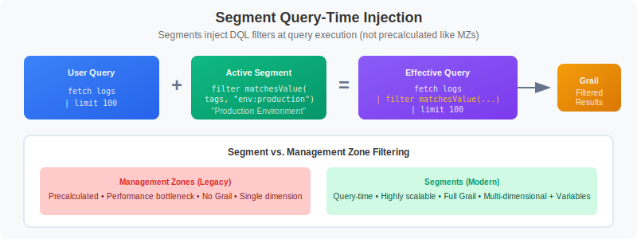

# MZ2POL-05: Segments Implementation

> **Series:** MZ2POL | **Notebook:** 6 of 8 | **Created:** December 2025

## Overview

This notebook provides a comprehensive guide to **Segments** - the DQL-powered data filtering mechanism that replaces Management Zone filtering. Segments allow you to create reusable, dynamic filter conditions for cross-app data segmentation.

## Prerequisites

- Completed MZ2POL-01 through MZ2POL-04
- Understanding of DQL basics
- Knowledge of your MZ filtering patterns

## Learning Objectives

By the end of this notebook, you will:
1. Understand how Segments work with Grail
2. Be able to create Segments that replace MZ filtering
3. Know how to use variables for dynamic filtering
4. Understand Segment application across apps

---

## 1. What Are Segments?

### Definition

**Segments** are reusable, pre-defined filter conditions powered by DQL. They provide query-time filtering to control what data users see.

### Key Characteristics

| Feature | Description |
|---------|-------------|
| **DQL-powered** | Full query language flexibility |
| **Query-time** | Evaluated at query execution, not precalculated |
| **Multi-dimensional** | Can be layered for precise filtering |
| **Dynamic** | Support variables for runtime flexibility |
| **Cross-app** | Work across all Grail-based apps |

### Segments vs. Management Zones

| Aspect | Management Zone | Segment |
|--------|-----------------|----------|
| Evaluation | Precalculated | Query-time |
| Performance | Bottleneck at scale | Highly scalable |
| Flexibility | Entity rules only | Any DQL filter |
| Variables | Not supported | Supported |
| Multi-dimensional | No | Yes |
| Grail support | No | Yes |

---

## 2. How Segments Work

### Query-Time Injection



<!--MARKDOWN_TABLE_ALTERNATIVE
| Aspect | Management Zone | Segment |
|--------|-----------------|----------|
| Evaluation | Precalculated | Query-time |
| Performance | Bottleneck at scale | Highly scalable |
| Flexibility | Entity rules only | Any DQL filter |
| Variables | Not supported | Supported |
| Multi-dimensional | No | Yes |
| Grail support | No | Yes |
-->

When a segment is active:
1. User executes a DQL query or opens an app
2. Segment conditions are injected into the query
3. Grail evaluates only conditions relevant to the data type
4. Filtered results returned

```
User Query:           fetch logs | limit 100
Active Segment:       filter matchesValue(tags, "env:production")
Effective Query:      fetch logs | filter matchesValue(tags, "env:production") | limit 100
```

### Segment Condition Evaluation

- `fetch logs` → Only log-related conditions apply
- `fetch spans` → Only span-related conditions apply
- `timeseries` → Only metric-related conditions apply

### Multiple Conditions (OR Logic)

Multiple conditions for the same data type in a segment are OR-combined:

```dql
// Segment with multiple conditions
filter dt.entity.service == "SERVICE-123"
filter dt.entity.service == "SERVICE-456"

// Results in: Show data for SERVICE-123 OR SERVICE-456
```

---

## 3. Creating Segments

### Via Segments App

1. Navigate to **Segments** app in Dynatrace
2. Click **Create segment**
3. Configure:
   - **Name**: Descriptive segment name
   - **Description**: Purpose and scope
   - **Filter conditions**: DQL filter expressions
4. Click **Save**

### Segment Filter Syntax

Segments use DQL filter syntax:

```dql
// Basic entity filter
filter dt.entity.host == "HOST-ABC123"

// Tag-based filter
filter matchesValue(tags, "env:production")

// Multiple conditions (AND)
filter matchesValue(tags, "env:production") and matchesValue(tags, "team:frontend")

// Pattern matching
filter matchesPhrase(dt.entity.service.name, "payment")
```

---

## 4. Segment Examples

### Example 1: Team-Based Segment

**Replaces**: Management Zone filtering by team ownership

**Segment Name**: `Frontend Team`
**Description**: Shows data for frontend team services
**Filter**:
```dql
filter matchesValue(tags, "team:frontend")
```

### Example 2: Environment Segment

**Replaces**: Production Management Zone

**Segment Name**: `Production Environment`
**Description**: Filters to production environment only
**Filter**:
```dql
filter matchesValue(tags, "env:production")
```

### Example 3: Regional Segment

**Replaces**: Geographic Management Zone

**Segment Name**: `North America`
**Description**: Data from NA region infrastructure
**Filter**:
```dql
filter matchesValue(tags, "region:us-east-1") or matchesValue(tags, "region:us-west-2")
```

### Example 4: Application Segment

**Replaces**: Application-specific Management Zone

**Segment Name**: `Payment System`
**Description**: Payment system services and dependencies
**Filter**:
```dql
filter matchesPhrase(dt.entity.service.name, "payment") 
   or matchesPhrase(dt.entity.service.name, "checkout")
```

---

## 5. Variables in Segments

### What Are Variables?

Variables make segments dynamic - users can select values at runtime instead of hardcoding them.

### Variable Types

| Type | Description | Example |
|------|-------------|----------|
| **Entity** | Select from entities | Kubernetes clusters |
| **String** | Free text input | Environment name |
| **List** | Predefined options | [prod, staging, dev] |

### Creating a Variable Segment

**Segment Name**: `Dynamic Environment`
**Variable**: `$environment` (type: list, values: production, staging, development)
**Filter**:
```dql
filter matchesValue(tags, concat("env:", $environment))
```

### Entity Variable Example

**Segment Name**: `By Kubernetes Cluster`
**Variable**: `$cluster` (type: entity, entity type: kubernetes_cluster)
**Filter**:
```dql
filter dt.entity.kubernetes_cluster == $cluster
```

Users can then select which cluster to filter by when using the segment.

---

## 6. Testing Segments with DQL

### Validate Segment Logic

Before creating a segment, test the filter logic with DQL queries:

```dql
// Test: Team-based filter for segment
// Verify this returns expected services
fetch dt.entity.service
| filter matchesValue(tags, "team:frontend")
| fields entity.name, tags
| limit 20
```

```dql
// Test: Environment filter for segment
// Should return only production entities
fetch dt.entity.host
| filter matchesValue(tags, "env:production")
| fields entity.name, tags
| limit 20
```

```dql
// Test: Combined filter (environment AND team)
// For layered segment filtering
fetch dt.entity.service
| filter matchesValue(tags, "env:production") 
    and matchesValue(tags, "team:frontend")
| fields entity.name, tags
| limit 20
```

### Test Segment on Logs

```dql
// Test log filtering with segment condition
// Validates segment will work for log queries
fetch logs
| filter matchesValue(dt.entity.service.tags, "team:frontend")
| fields timestamp, content, dt.entity.service
| sort timestamp desc
| limit 20
```

---

## 7. Mapping MZ Rules to Segment Filters

### Common MZ Rule Patterns

| MZ Rule Type | Segment Filter Equivalent |
|--------------|---------------------------|
| Host tag equals | `filter matchesValue(tags, "key:value")` |
| Service name contains | `filter matchesPhrase(dt.entity.service.name, "text")` |
| Process group tag | `filter matchesValue(dt.entity.process_group.tags, "key:value")` |
| Kubernetes namespace | `filter dt.entity.cloud_application.namespace == "namespace"` |
| Cloud provider tag | `filter matchesValue(tags, "cloud:aws")` |

### Conversion Examples

**MZ Rule**: Host with tag `env` equals `production`
**Segment Filter**:
```dql
filter matchesValue(tags, "env:production")
```

**MZ Rule**: Service name contains `payment`
**Segment Filter**:
```dql
filter matchesPhrase(dt.entity.service.name, "payment")
```

**MZ Rule**: Host in AWS
**Segment Filter**:
```dql
filter matchesValue(tags, "cloud:aws")
```

**MZ Rule**: Kubernetes namespace equals `production`
**Segment Filter**:
```dql
filter dt.entity.cloud_application.namespace == "production"
```

---

## 8. Using Segments in Apps

### Segment Selection

Most Grail-based apps have a segment selector:
- **Location**: Usually top of the app interface
- **Multiple selection**: Can select multiple segments (layered)
- **Persistence**: Selection persists across navigation

### Dashboard Integration

Segments can be applied at two levels:

1. **Dashboard level**: Applies to all tiles
2. **Tile level**: Overrides dashboard segment for specific tile

### Apps Supporting Segments

| App | Segment Support |
|-----|----------------|
| Logs | ✅ Full support |
| Distributed Traces | ✅ Full support |
| Services | ✅ Full support |
| Dashboards | ✅ Dashboard + Tile level |
| Notebooks | ✅ Full support |
| Problems | ✅ Full support |

### Classic Apps

Classic apps still use Management Zones. During migration:
- Use MZs for classic apps
- Use Segments for new apps
- Both can coexist during transition

---

## 9. Segment Sharing and Permissions

### Sharing Segments

Segments can be:
- **Private**: Only creator can see/use
- **Shared**: Available to specified users/groups
- **Public**: Available to all users in environment

### Required Permissions

| Action | Required Permission |
|--------|--------------------|
| View segments | `storage:filter-segments:read` |
| Create segments | `storage:filter-segments:write` |
| Share segments | `storage:filter-segments:share` |
| Delete segments | `storage:filter-segments:delete` |

These permissions are included in default policies:
- **Dynatrace Standard User**: Read, Write, Share
- **Dynatrace Professional User**: Read, Write, Share, Delete

---

## 10. Segment Best Practices

### Design Principles

1. **Align with business structure**: Teams, products, regions
2. **Use consistent naming**: Clear, descriptive names
3. **Leverage variables**: For flexibility
4. **Test thoroughly**: Verify filtering works as expected
5. **Document purpose**: Help users understand when to use

### Naming Conventions

```
// Good segment names
"Production Environment"
"Frontend Team Services"
"North America Region"
"Payment System"

// Bad segment names
"Segment 1"
"Test"
"My filter"
```

### Performance Considerations

- Segments are evaluated at query time
- Complex filters may impact performance
- Use indexed fields when possible (tags, entity IDs)
- Avoid expensive operations like regex on large datasets

### Migration Checklist

- [ ] Identify all MZ filtering use cases
- [ ] Design segment for each use case
- [ ] Test segment filter logic with DQL
- [ ] Create segment in Segments app
- [ ] Share segment with appropriate users
- [ ] Update dashboards to use segments
- [ ] Train users on segment selection

---

## Summary

In this notebook, you learned:

1. **Segment fundamentals**: DQL-powered, query-time filters
2. **Creating segments**: Via Segments app with DQL filters
3. **Variables**: Making segments dynamic with runtime values
4. **MZ mapping**: Converting MZ rules to segment filters
5. **App integration**: How segments work across Dynatrace apps

## Next Steps

Continue to **MZ2POL-06: Migration Execution** to:
- Execute the migration plan step-by-step
- Handle parallel running period
- Perform cutover from MZs to new model

## Additional Resources

- [Segments in DQL Queries](https://docs.dynatrace.com/docs/manage/segments/concepts/segments-concepts-queries)
- [Log Filtering with Segments](https://www.dynatrace.com/news/blog/log-filtering-made-easy-data-segmentation-and-advanced-filters-in-dynatrace-logs/)
- [Power Dashboarding: Filter Data Effectively](https://www.dynatrace.com/news/blog/power-dashboarding-3-filter-data-effectively/)
