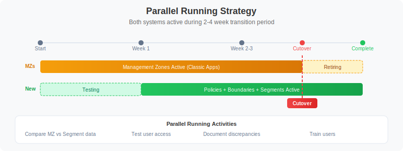

# MZ2POL-06: Migration Execution

> **Series:** MZ2POL | **Notebook:** 7 of 8 | **Created:** December 2025

## Overview

This notebook provides a step-by-step guide for executing your migration from Management Zones to Policies, Boundaries, and Segments. It covers the parallel running period, cutover procedures, and rollback strategies.

## Prerequisites

- Completed MZ2POL-01 through MZ2POL-05
- Migration plan document (from MZ2POL-03)
- Policies and boundaries configured (from MZ2POL-04)
- Segments created (from MZ2POL-05)

## Learning Objectives

By the end of this notebook, you will:
1. Know how to execute each migration phase
2. Understand parallel running strategies
3. Be able to perform cutover safely
4. Know how to handle rollback if needed

---

## 1. Migration Phase Overview

### Phase Summary

```
Phase 1: Foundation Setup
    ↓
Phase 2: Security Context Assignment
    ↓
Phase 3: Policy & Boundary Configuration
    ↓
Phase 4: Segment Creation
    ↓
Phase 5: Parallel Running (MZ + New Model)
    ↓
Phase 6: Cutover
    ↓
Phase 7: Cleanup
```

### Risk Mitigation Strategy

- **Parallel running**: Both systems active simultaneously
- **Phased rollout**: Migrate groups incrementally
- **Rollback capability**: Document how to revert
- **Testing checkpoints**: Verify at each phase

---

## 2. Phase 1: Foundation Setup

### Checklist

- [ ] Create user groups in Account Management
- [ ] Document group → MZ mapping
- [ ] Verify Account Management access
- [ ] Backup current RBAC configuration

### Create User Groups

For each MZ-based access pattern, create a corresponding group:

| MZ Access Pattern | New Group Name |
|-------------------|----------------|
| Frontend Team MZ | `frontend-team` |
| Production MZ viewers | `prod-viewers` |
| SRE full access | `sre-team` |

### Via Account Management

1. Navigate to **Account Management** → **Identity & Access Management**
2. Select **Group Management**
3. Click **Create group**
4. Configure:
   - **Group name**: Match your naming convention
   - **Description**: Purpose and MZ equivalent
5. Add initial members (or leave empty for now)
6. Click **Save**

---

## 3. Phase 2: Security Context Assignment

### Why Security Context?

Security context enables entity-level access control with boundaries. Before creating boundaries, entities must have security context assigned.

### Query Current Security Context Coverage

```dql
// Check security context assignment status
// Identify entities needing security context
fetch dt.entity.service
| summarize 
    total = count(),
    withContext = countIf(isNotNull(dt.security_context)),
    withoutContext = countIf(isNull(dt.security_context))
| fields total, withContext, withoutContext,
         coveragePercent = 100.0 * withContext / total
```

### Assignment Methods

| Method | Best For | Automation |
|--------|----------|------------|
| Auto-tagging rules | Tag-based assignment | Yes |
| Settings API | Bulk updates | Yes |
| UI Settings | Individual entities | No |
| OneAgent config | Host-level | Yes |

### Recommended: Tag-Based Security Context

If entities already have team/environment tags, derive security context from tags:

```
Tag: team:frontend → Security Context: team-frontend
Tag: env:production → Security Context: prod-{team}
```

### Checklist

- [ ] Identify security context naming strategy
- [ ] Map existing tags to security context values
- [ ] Apply security context to all relevant entities
- [ ] Verify coverage with DQL query
- [ ] Document security context → team/env mapping

---

## 4. Phase 3: Policy & Boundary Configuration

### Verify Policies and Boundaries

Confirm policies and boundaries are created per MZ2POL-04:

- [ ] Default policies identified for each user type
- [ ] Custom policies created where needed
- [ ] Boundary for each access scope (all three domains)
- [ ] Security context conditions configured
- [ ] Boundary naming follows convention
- [ ] Policy and boundary documentation complete

### Create Policy Bindings (Parallel Mode)

During parallel running, users have BOTH:
- Existing MZ-based RBAC access
- New policy-based access

**Important**: Users should see the same data with both systems.

### Binding Process

For each group:

1. Navigate to **Group Management**
2. Select the target group
3. Go to **Permissions** tab
4. Click **Add permission**
5. Configure:
   - **Policy**: Select appropriate policy
   - **Boundary**: Select matching boundary
   - **Environment**: Target environment
6. Click **Save**

### Binding Matrix Template

| Group | Policy | Boundary | Environment |
|-------|--------|----------|-------------|
| frontend-team | Dynatrace Standard User | Frontend Team Scope | Production |
| sre-team | Dynatrace Professional User | All Production | Production |
| prod-viewers | Dynatrace Viewer | Production Only | Production |

---

## 5. Phase 4: Segment Creation

### Verify Segments

Confirm segments are created per MZ2POL-05:

- [ ] Segment for each MZ filtering use case
- [ ] Segment filters tested with DQL
- [ ] Segments shared with appropriate users

### Update Dashboards

For dashboards currently using MZ filtering:

1. Open dashboard in edit mode
2. Configure dashboard-level segment
3. Update individual tiles if needed
4. Save and test

### Segment Rollout Strategy

| Phase | Action |
|-------|--------|
| Week 1 | Create all segments, test internally |
| Week 2 | Share segments with pilot users |
| Week 3 | Update key dashboards to use segments |
| Week 4 | Communicate segment availability to all users |

---

## 6. Phase 5: Parallel Running

### Duration

Recommended: **2-4 weeks** depending on complexity



<!--MARKDOWN_TABLE_ALTERNATIVE
| System | Status | User Experience |
|--------|--------|----------------|
| Management Zones | Active | Users see MZ-filtered data |
| Policies + Boundaries | Active | Access control via ABAC |
| Segments | Active | Users can select segments |
-->

### During Parallel Running

| System | Status | User Experience |
|--------|--------|----------------|
| Management Zones | Active | Users see MZ-filtered data |
| Policies + Boundaries | Active | Access control via ABAC |
| Segments | Active | Users can select segments |

### Validation Queries

Compare data visibility between systems:

```dql
// Compare: Services visible via MZ
// Run as user with MZ access
fetch dt.entity.service
| filter in(managementZones, {"Frontend-Team"})
| summarize mzServiceCount = count()
```

```dql
// Compare: Services visible via Segment
// Should match MZ count
fetch dt.entity.service
| filter matchesValue(tags, "team:frontend")
| summarize segmentServiceCount = count()
```

### Parallel Running Checklist

- [ ] All groups have policy bindings
- [ ] Users added to new groups
- [ ] Segments available and shared
- [ ] Dashboards updated (optional in parallel phase)
- [ ] Test users verify equivalent access
- [ ] Document any discrepancies

### Issue Tracking

Track issues during parallel running:

| Issue | MZ Behavior | New Model Behavior | Resolution |
|-------|-------------|-------------------|-------------|
| Example | Users see 100 services | Users see 95 services | Missing security context on 5 services |

---

## 7. Phase 6: Cutover

### Cutover Prerequisites

- [ ] Parallel running completed successfully
- [ ] All discrepancies resolved
- [ ] User training completed
- [ ] Communication sent to stakeholders
- [ ] Rollback plan documented

### Cutover Steps

#### Step 1: Update Dependencies

Before removing MZ access:

- [ ] Alerting profiles: Update to use segments (when available)
- [ ] API integrations: Update to use new access model
- [ ] Automation workflows: Verify still functional

#### Step 2: Remove RBAC MZ Assignments

For each user/group:

1. Navigate to user/group management
2. Remove MZ-based permission assignments
3. Verify policy-based access still works

#### Step 3: Verify Access

For each user type:

1. Log in as test user
2. Verify expected data access
3. Verify restricted data not accessible
4. Document verification result

#### Step 4: Monitor

For 24-48 hours after cutover:

- Monitor for access issues
- Check support tickets
- Verify critical workflows

### Cutover Communication Template

```
Subject: Dynatrace Access Model Migration - Cutover Complete

Team,

We have completed the migration from Management Zones to the new
Policies/Boundaries/Segments access model.

What changed:
- Access is now controlled via IAM Policies
- Data filtering uses Segments (select in app header)
- Management Zone filters no longer work in new apps

Action required:
- Select your team's Segment when using Logs, Traces, Services apps
- Report any access issues to [contact]

Documentation: [link to internal docs]

Questions? Contact [team/channel]
```

---

## 8. Phase 7: Cleanup

### Post-Cutover Cleanup

After successful cutover (recommended: wait 2+ weeks):

#### Step 1: Archive MZ Configuration

- Export MZ settings via API
- Store in version control or documentation
- Document MZ → new model mapping

#### Step 2: Remove Unused MZs

**Caution**: Only remove MZs no longer referenced anywhere

- [ ] Verify no alerting profiles use MZ
- [ ] Verify no API integrations use MZ
- [ ] Verify no dashboards rely on MZ filtering
- [ ] Delete MZ via Settings

#### Step 3: Update Documentation

- [ ] Update internal runbooks
- [ ] Update onboarding documentation
- [ ] Archive MZ-related documentation
- [ ] Create new model reference guide

---

## 9. Rollback Procedures

### When to Rollback

- Critical access issues affecting multiple users
- Data visibility significantly different than expected
- Business-critical workflows broken

### Rollback Steps

#### Quick Rollback (During Parallel Running)

1. Communicate rollback to users
2. Instruct users to use MZ filtering (classic apps)
3. Investigate and resolve issues
4. Re-attempt cutover when ready

#### Full Rollback (After Cutover)

1. Re-enable RBAC MZ assignments
2. Communicate to users
3. Document what went wrong
4. Create remediation plan
5. Schedule new cutover date

### Rollback Checklist

- [ ] Identify affected users/groups
- [ ] Re-apply MZ-based RBAC
- [ ] Verify access restored
- [ ] Communicate status
- [ ] Document root cause

---

## 10. Migration Verification Queries

### Final Verification

```dql
// Verify: Security context coverage is complete
fetch dt.entity.service
| summarize 
    total = count(),
    withContext = countIf(isNotNull(dt.security_context))
| fields total, withContext,
         coveragePercent = 100.0 * withContext / total
| filter coveragePercent < 100
```

```dql
// Verify: Entities accessible via segment match MZ
// Adjust filters to match your environment
fetch dt.entity.service
| summarize 
    viaMZ = countIf(arraySize(managementZones) > 0),
    viaTag = countIf(isNotNull(tags))
| fields viaMZ, viaTag
```

---

## Summary

In this notebook, you learned:

1. **Migration phases**: Foundation → Security Context → Policies → Segments → Parallel → Cutover → Cleanup
2. **Parallel running**: How to run both systems simultaneously
3. **Cutover process**: Step-by-step cutover with verification
4. **Rollback procedures**: How to revert if needed

## Next Steps

Continue to **MZ2POL-07: Validation and Troubleshooting** to:
- Validate migration success
- Troubleshoot common issues
- Perform ongoing maintenance

## Additional Resources

- [Upgrade from RBAC to IAM Policies](https://docs.dynatrace.com/docs/manage/identity-access-management/permission-management/manage-user-permissions-policies/advanced/migrate-roles)
- [Management Zones Documentation](https://docs.dynatrace.com/docs/manage/identity-access-management/permission-management/management-zones)
- [Grant Access to Dynatrace](https://docs.dynatrace.com/docs/manage/identity-access-management/use-cases/access-platform)
