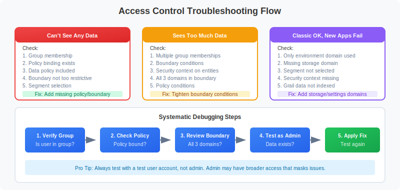

# MZ2POL-07: Validation and Troubleshooting

> **Series:** MZ2POL | **Notebook:** 8 of 8 | **Created:** December 2025

## Overview

This notebook provides comprehensive validation procedures and troubleshooting guidance for your migration from Management Zones to Policies, Boundaries, and Segments. Use this guide to verify your migration success and resolve common issues.

## Prerequisites

- Completed migration (MZ2POL-06)
- Admin access to Dynatrace
- Test user accounts for validation

## Learning Objectives

By the end of this notebook, you will:
1. Be able to validate migration completeness
2. Know how to troubleshoot common access issues
3. Understand ongoing maintenance requirements
4. Have queries for monitoring access health

---

## 1. Migration Validation Checklist

### Component Validation

| Component | Validation | Status |
|-----------|------------|--------|
| User Groups | All groups created and populated | ☐ |
| Policies | Policies bound to all groups | ☐ |
| Boundaries | Boundaries applied where needed | ☐ |
| Security Context | All entities have security context | ☐ |
| Segments | Segments created for all filtering needs | ☐ |
| Dashboards | Updated to use segments | ☐ |
| Alerts | Updated (when segment support available) | ☐ |

### Access Validation Matrix

For each user type, verify:

| User Type | Can Access | Cannot Access | Verified |
|-----------|------------|---------------|----------|
| Frontend Dev | Frontend services | Backend services | ☐ |
| SRE | All production | Development | ☐ |
| Viewer | View dashboards | Edit settings | ☐ |

---

## 2. Security Context Validation

### Check Coverage

```dql
// Validate: All services have security context
fetch dt.entity.service
| summarize 
    total = count(),
    withContext = countIf(isNotNull(dt.security_context)),
    missingContext = countIf(isNull(dt.security_context))
| fields total, withContext, missingContext,
         coveragePercent = round(100.0 * withContext / total, decimals: 2)
```

```dql
// Find services missing security context
// These need to be addressed for complete migration
fetch dt.entity.service
| filter isNull(dt.security_context)
| fields entity.name, tags, managementZones
| sort entity.name asc
| limit 50
```

```dql
// Validate: Host security context coverage
fetch dt.entity.host
| summarize 
    total = count(),
    withContext = countIf(isNotNull(dt.security_context)),
    missingContext = countIf(isNull(dt.security_context))
| fields total, withContext, missingContext,
         coveragePercent = round(100.0 * withContext / total, decimals: 2)
```

### Verify Security Context Distribution

```dql
// Distribution of security context values
// Verify expected teams/environments are represented
fetch dt.entity.service
| filter isNotNull(dt.security_context)
| summarize count = count(), by:{dt.security_context}
| sort count desc
```

---

## 3. Access Control Validation

### Test User Access Scenarios

For each test scenario:
1. Log in as test user
2. Navigate to target app/data
3. Verify expected access
4. Document results

### Scenario 1: Team-Based Access

**Test User**: Member of `frontend-team` group
**Expected**: Access to frontend services only

**Validation Steps**:
1. Open Services app
2. Select "Frontend Team" segment
3. Verify only frontend services visible
4. Try accessing backend service directly → Should fail

### Scenario 2: Environment Restriction

**Test User**: Member of `prod-viewers` group
**Expected**: View production data only, no edit

**Validation Steps**:
1. Open Logs app
2. Select "Production" segment
3. Query logs → Should succeed
4. Try editing settings → Should fail
5. Select different segment → Should show no data (if boundary restricts)

### Scenario 3: Full Access (SRE)

**Test User**: Member of `sre-team` group
**Expected**: Full access to production environment

**Validation Steps**:
1. Open any app
2. Verify data visible across all services
3. Verify edit capabilities work
4. Verify settings access

---

## 4. Segment Validation

### Verify Segment Data Match

Compare segment results with expected MZ results:

```dql
// Compare: MZ entity count vs Segment entity count
// Replace with your MZ name and segment filter
fetch dt.entity.service
| summarize 
    viaMZ = countIf(in(managementZones, {"Frontend-Team"})),
    viaSegment = countIf(matchesValue(tags, "team:frontend"))
| fields viaMZ, viaSegment,
         match = if(viaMZ == viaSegment, then: "MATCH", else: "MISMATCH")
```

```dql
// Find entities in MZ but not matching segment filter
// These are migration gaps
fetch dt.entity.service
| filter in(managementZones, {"Frontend-Team"})
| filter NOT matchesValue(tags, "team:frontend")
| fields entity.name, tags, managementZones
```

```dql
// Find entities matching segment but not in MZ
// May indicate over-inclusion in new model
fetch dt.entity.service
| filter matchesValue(tags, "team:frontend")
| filter NOT in(managementZones, {"Frontend-Team"})
| fields entity.name, tags, managementZones
```

---

## 5. Common Issues and Troubleshooting



<!--MARKDOWN_TABLE_ALTERNATIVE
| Issue | Likely Cause | Solution |
|-------|-------------|----------|
| User can't access anything | No policy bound | Bind policy to user's group |
| User sees too much | Boundary too broad or missing | Tighten boundary conditions |
| User can't see expected data | Missing data policy | Add Data Viewer/Editor |
| Permissions inconsistent | Multiple conflicting policies | Review all bound policies |
| Works in classic, not Grail | Only environment domain used | Add storage domain to boundary |
-->

### Issue 1: User Can't See Any Data

**Symptoms**:
- Apps show empty results
- DQL queries return no records

**Troubleshooting**:

| Check | Action |
|-------|--------|
| Group membership | Verify user is in correct group |
| Policy binding | Verify group has policy bound |
| Boundary scope | Verify boundary isn't too restrictive |
| Data policy | Verify Data Viewer/Editor policy included |
| Segment selection | Check if restrictive segment is active |

**Resolution Steps**:
1. Check user's group membership in Account Management
2. Verify group has appropriate policy binding
3. Review boundary conditions
4. Test with admin account to verify data exists

### Issue 2: User Sees Too Much Data

**Symptoms**:
- User sees data outside their scope
- Cross-team data visible

**Troubleshooting**:

| Check | Action |
|-------|--------|
| Boundary conditions | Verify boundary is correctly restrictive |
| Multiple group membership | User may be in multiple groups |
| Security context | Verify entities have correct context |
| Policy conditions | Check for overly broad conditions |

**Resolution Steps**:
1. Review all groups user belongs to
2. Check all policy bindings for those groups
3. Verify boundary conditions are correct
4. Check security context on visible entities

### Issue 3: Segment Filter Not Working

**Symptoms**:
- Segment selected but data not filtered
- Same data visible with/without segment

**Troubleshooting**:

| Check | Action |
|-------|--------|
| Segment syntax | Verify DQL filter is correct |
| Tag existence | Verify entities have expected tags |
| App support | Verify app supports segments |
| Segment sharing | Verify segment is shared with user |

**Resolution Steps**:
1. Test segment filter as standalone DQL query
2. Verify tags exist on target entities
3. Check segment is shared/public
4. Try segment in different app

### Issue 4: Classic Apps Work, New Apps Don't

**Symptoms**:
- Legacy UI shows expected data
- New apps (Services, Logs) show no/wrong data

**Cause**: MZ-based access works for classic, but new apps need segments

**Resolution**:
1. Create corresponding segment for MZ filter
2. Ensure user selects segment in new apps
3. Consider setting default segment for user/group

---

## 6. Diagnostic Queries

### Check Entity Tag Distribution

```dql
// Analyze tag patterns for segment creation
fetch dt.entity.service
| expand tag = tags
| parse tag, "LD:key ':' LD:value"
| summarize count = count(), by:{key}
| sort count desc
| limit 20
```

```dql
// Find entities without standard tags
// These may need tagging for segment filters
fetch dt.entity.service
| filter NOT matchesValue(tags, "team:*")
| filter NOT matchesValue(tags, "env:*")
| fields entity.name, tags
| limit 50
```

### Check MZ Assignment Health

```dql
// Entities with MZ but no security context
// These need security context for boundary-based access
fetch dt.entity.service
| filter arraySize(managementZones) > 0
| filter isNull(dt.security_context)
| fields entity.name, managementZones, tags
| limit 50
```

```dql
// MZ to tag alignment check
// Verify MZ membership aligns with tags used in segments
fetch dt.entity.service
| expand mz = managementZones
| summarize 
    entityCount = count(),
    withTeamTag = countIf(matchesValue(tags, "team:*")),
    withEnvTag = countIf(matchesValue(tags, "env:*")),
    by:{mz}
| sort entityCount desc
```

---

## 7. Ongoing Maintenance

### Regular Validation Tasks

| Task | Frequency | Purpose |
|------|-----------|----------|
| Security context audit | Weekly | Ensure new entities have context |
| Segment effectiveness | Monthly | Verify segments return expected data |
| Access review | Quarterly | Verify user access is appropriate |
| Policy review | Quarterly | Ensure policies match requirements |

### New Entity Onboarding

When new services/hosts are deployed:

1. **Auto-tagging**: Ensure auto-tagging rules apply correct tags
2. **Security context**: Verify security context is set
3. **Segment inclusion**: Verify entity appears in appropriate segments
4. **Access verification**: Test user access to new entity

### New User Onboarding

When new users join:

1. Add user to appropriate group(s)
2. Communicate available segments
3. Provide access documentation
4. Verify access works as expected

---

## 8. Health Monitoring Queries

### Create Monitoring Dashboard

Use these queries for an access health dashboard:

```dql
// KPI: Security Context Coverage
fetch dt.entity.service
| summarize 
    total = count(),
    covered = countIf(isNotNull(dt.security_context))
| fields coveragePercent = round(100.0 * covered / total, decimals: 1)
```

```dql
// KPI: Entities per Security Context
// Monitor for unexpected growth/decline
fetch dt.entity.service
| summarize count = count(), by:{dt.security_context}
| sort count desc
| limit 10
```

```dql
// KPI: Untagged Entities (migration gaps)
fetch dt.entity.service
| filter isNull(dt.security_context)
| filter NOT matchesValue(tags, "team:*")
| summarize untaggedCount = count()
```

---

## 9. Best Practices Summary

### Access Control

- ✅ Use groups, not individual user permissions
- ✅ Apply least privilege principle
- ✅ Document all policy bindings
- ✅ Regular access reviews

### Segments

- ✅ Align with organizational structure
- ✅ Use consistent naming conventions
- ✅ Test filters before deployment
- ✅ Share segments appropriately

### Boundaries

- ✅ Create reusable boundaries
- ✅ Use security context for entity-level control
- ✅ Document boundary purpose
- ✅ Keep conditions simple

### Maintenance

- ✅ Automate security context assignment
- ✅ Monitor access health metrics
- ✅ Review and update documentation
- ✅ Train new team members

---

## Summary

In this notebook, you learned:

1. **Validation procedures**: How to verify migration success
2. **Troubleshooting**: Common issues and resolutions
3. **Diagnostic queries**: DQL for investigating access problems
4. **Ongoing maintenance**: Regular tasks for access health
5. **Health monitoring**: Queries for access dashboards

## Migration Complete!

Congratulations on completing the MZ2POL migration series. You have:

- ✅ Understood why migration is necessary (MZ2POL-01)
- ✅ Learned the new access control model (MZ2POL-02)
- ✅ Assessed and planned your migration (MZ2POL-03)
- ✅ Configured policies and boundaries (MZ2POL-04)
- ✅ Implemented segments (MZ2POL-05)
- ✅ Executed the migration (MZ2POL-06)
- ✅ Validated and can troubleshoot (MZ2POL-07)

## Additional Resources

- [Access Management Concepts](https://docs.dynatrace.com/docs/manage/identity-access-management/permission-management/access-concepts)
- [Dynatrace Community - Boundaries + Policies Best Practices](https://community.dynatrace.com/t5/Open-Q-A/Boundaries-Policies-Best-Practices-Advice/td-p/284808)
- [Segments Documentation](https://docs.dynatrace.com/docs/manage/segments/concepts/segments-concepts-queries)
- [IAM Policy Reference](https://docs.dynatrace.com/docs/manage/identity-access-management/permission-management/manage-user-permissions-policies/advanced/iam-policystatements)
