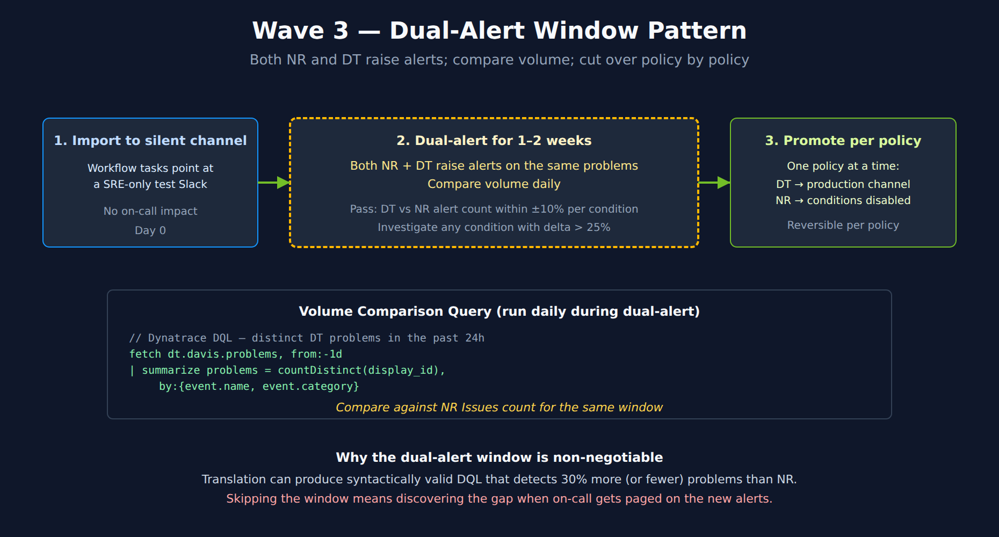

# NR2DT-05: Step 5 — Migrate Dashboards & Alerts

> **Series:** NR2DT — New Relic to Dynatrace Migration Steps | **Notebook:** 5 of 10 | **Created:** April 2026 | **Last Updated:** 10/05/2026

## Overview

**Goal of this step:** import dashboards (Wave 1, low risk) and alerts (Wave 3, HIGH risk). Dashboards land first as read-only signal; alerts go through a 1–2 week dual-alert window before NR alerts are silenced.

Procedural — see **NRLC-03** (Dashboard Migration) and **NRLC-04** (Alert & Workflow Migration) for component depth.

---

## Table of Contents

1. [Wave 0 — Apply Foundations](#wave0)
2. [Wave 1 — Dashboards](#wave1)
3. [Wave 3 — Alerts (Dual-Alert)](#wave3)
4. [Step Exit Criteria](#gate)

---

## Prerequisites

| Requirement | Details |
|-------------|----------|
| **Audience** | Migration lead + assigned engineer for this step |
| **Completed** | NR2DT-04 — Translate |
| **Format** | Procedural step — use as a runbook; defer to NRLC for depth |
| **NRLC deep dives** | NRLC-03, NRLC-04 |

<a id="wave0"></a>
## 1. Wave 0 — Apply Foundations

Phase-1 Terraform from Step 3 lands first.

```bash
cd terraform
terraform apply -target=module.buckets -target=module.host_groups \
    -target=module.iam_groups -target=module.openpipeline_enrichments
```

**Wait ~45 minutes** for OpenPipeline enrichment propagation on EKS clusters before Wave 2 Terraform applies any routing rules.

**Validate W0:**

```
fetch logs, from:-15m
| summarize records = count(), by:{dt.system.bucket}
```

Every active bucket should show ingest. If anything lands in `default_logs` for a routed source, Wave 0 isn't done.

<a id="wave1"></a>
## 2. Wave 1 — Dashboards

Dashboards are low-risk because they're read-only — users can compare visualizations side-by-side during the parallel run.

```bash
# Preview: export + transform + diff against the live tenant — imports NOTHING
python3 migrate.py migrate --dry-run --diff --components dashboards --output ./run-dashboards

# Import: the same command without --dry-run (and without --diff)
python3 migrate.py migrate --components dashboards --output ./run-dashboards
```

> **Never run `migrate` without `--dry-run`, `--export-only` or `--import-only` unless you intend to import.** `--diff` and `--report` do not make a run read-only: both run *after* the import phase, so `migrate --diff` without `--dry-run` imports first and then diffs the objects it has just created.

Review the preview's diff table (`CREATE` / `UPDATE` / `CONFLICT` / `ORPHAN`) before importing. The import run writes `./run-dashboards/rollback-manifest.json` — keep it; NR2DT-09 rolls back from it. Use a separate `--output` directory per run, because each full run overwrites the manifest in its directory. (`--import-only --input ./run-dashboards --components dashboards` imports exactly the previewed `transformed/dynatrace_config.json` instead, but writes **no** rollback manifest. `--import-only` without `--input` stops with an error.)

> <sub>**Sources:** [migrate.py @ 78cbfce (tool repo, GitHub)](https://github.com/timstewart-dynatrace/NewRelic-to-Dynatrace-Migration-Utilities/blob/78cbfcec7cab6564103fbd6c23b915b46599dc56/migrate.py), read 10/05/2026.</sub>

**W1 — Dashboard parity:**

Sample 10–20% of dashboards. Open each NR dashboard and the corresponding DT document side-by-side. Acceptable diff:

- Visual layout: minor variations OK
- Data values: ±5% on count widgets
- Time-series shape: matches

Document any dashboard with > 5% delta in `wave1-issues.md` for follow-up.

<a id="wave3"></a>
## 3. Wave 3 — Alerts (Dual-Alert)

**HIGH RISK.** Follow this exactly.

### Step 1: Import to silent test channels

Set `DYNATRACE_DETECTOR_ACTOR` first (NR2DT-00 §2.3) — without it the anomaly detectors fail to import.

Preview, then import (see Wave 1 for why `--dry-run` comes first):

```bash
python3 migrate.py migrate --dry-run --diff --components alerts,notification_channels --output ./run-alerts
python3 migrate.py migrate --components alerts,notification_channels --output ./run-alerts
```

Component names are the ones `python3 migrate.py migrate --list-components` prints. `notifications` is not one, and the tool skips an unknown name without an error. (`alerts` also pulls in `notification_channels` as a dependency.)

Routing in this step goes to a **silent test Slack channel** (or equivalent). Update Workflow tasks to point at the test channel before enabling.

### Step 2: Run dual-alert for 1–2 weeks

Both NR and DT raise alerts. Compare volume daily:

```dql
// One record per problem: count distinct problems, not problem updates
fetch dt.davis.problems, from:-1d
| summarize problems = countDistinct(display_id), by:{event.name, event.category}
| sort problems desc
```

Count problems from `dt.davis.problems`, not from `fetch events | filter event.kind == "DAVIS_PROBLEM"`. The `events` form returns one record per problem *update*: over the same 24 h on the validation tenant (10/05/2026) it returned 15,738 records for 465 distinct problems — about 34× the real number, which would make the ±10% comparison meaningless.

DT problem count should match NR alert count within ±10% per condition. Investigate any condition with > 25% delta.

### Step 3: Promote per policy

**One policy at a time.** When a policy's dual-alert volume aligns:

1. Update its Workflow tasks to point at the production channel (re-enter secrets in DT credentials vault)
2. Disable all of that policy's conditions in NR — a New Relic policy has no on/off state of its own: *"You can't disable a policy directly. However, you can disable all of the policy's conditions."*
3. Move to the next policy

Don't batch — sequential cutover lets you reverse one policy without affecting others.

> <sub>**Sources:** [Create, edit, or find an alert policy (New Relic docs)](https://docs.newrelic.com/docs/alerts/organize-alerts/create-edit-or-find-alert-policy/), read 10/05/2026.</sub>




<!-- MARKDOWN_TABLE_ALTERNATIVE
| Phase | Action |
|-------|--------|
| 1 | Import to silent test channel (Day 0) |
| 2 | Dual-alert for 1–2 weeks; compare volume daily |
| 3 | Promote per policy (one at a time); disable the NR policy's conditions |

Volume query: `fetch dt.davis.problems, from:-1d` — `countDistinct(display_id)` by `event.name`, `event.category`.

Pass criteria: DT vs NR alert count within ±10% per condition.
For environments where SVG doesn't render
-->

<a id="gate"></a>
## 4. Step Exit Criteria

**S5 — Dashboards + Alerts Migrated**

- [ ] All Wave 0 Foundations applied; W0 validated
- [ ] All dashboards migrated; W1 visual-diff sample passed
- [ ] All alert policies migrated; dual-alert window completed (≥ 1 week)
- [ ] W3 dual-alert volume aligned within ±10%
- [ ] All notification secrets re-entered in DT credentials vault
- [ ] NR conditions disabled for migrated policies only (NR ingest still on)

**Next step:** **NR2DT-06 — Migrate Synthetics, SLOs, Workloads**.

---

<sub>*This notebook was AI-generated from community-submitted and publicly available sources, including the open-source [NewRelic-to-Dynatrace-Migration-Utilities](https://github.com/timstewart-dynatrace/NewRelic-to-Dynatrace-Migration-Utilities), [nrql-engine](https://github.com/timstewart-dynatrace/nrql-engine), and [nrql-translator](https://github.com/timstewart-dynatrace/nrql-translator) projects. This notebook series is not officially supported by Dynatrace or New Relic. Always verify information against the official [Dynatrace documentation](https://docs.dynatrace.com/docs) and [New Relic documentation](https://docs.newrelic.com).*</sub>
