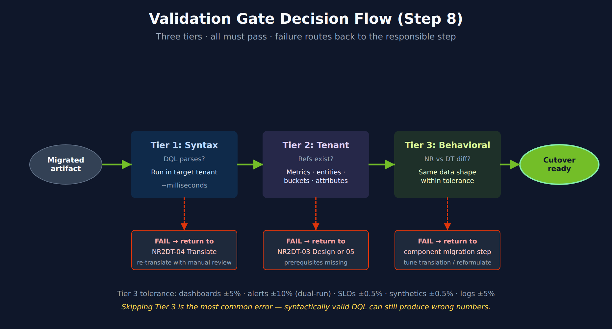

# NR2DT-08: Step 8 — Validate

> **Series:** NR2DT — New Relic to Dynatrace Migration Steps | **Notebook:** 8 of 10 | **Created:** April 2026 | **Last Updated:** 10/05/2026

## Overview

**Goal of this step:** run the three-tier validation across every migrated artifact. Syntax, tenant, and behavioral checks must all pass before cutover.

Procedural — see **NRLC-08** (Validation, Diff & Rollback) for the validation theory and tooling depth.

---

## Table of Contents

1. [Three-Tier Validation Pass](#tiers)
2. [Diff Against Live Config](#diff)
3. [Generate the Quality Report](#report)
4. [Step Exit Criteria](#gate)

---

## Prerequisites

| Requirement | Details |
|-------------|----------|
| **Audience** | Migration lead + assigned engineer for this step |
| **Completed** | NR2DT-07 — Migrate Logs, Tags & Drops |
| **Format** | Procedural step — use as a runbook; defer to NRLC for depth |
| **NRLC deep dives** | NRLC-08 (Validation deep dive) |

<a id="tiers"></a>
## 1. Three-Tier Validation Pass

There is no single `validate` subcommand, and only part of this pass is automated by `migrate.py`. Each tier below says what the tool does and what you check yourself.

### Tier 1 — Syntax

Every final DQL query parses against the target tenant. `compile --file` does not live-validate and has no auto-fixer (NR2DT-04 §5), so run the final DQL from `translated-queries.csv` in the tenant — in a notebook, or with `dtctl verify query` — and check single queries with:

```bash
python3 migrate.py compile --validate "<NRQL>"
```

### Tier 2 — Tenant

Confirm referenced metrics, entities, buckets, and OpenPipeline enrichment attributes exist in the target tenant. **No `migrate.py` subcommand checks this.** `preflight` checks something narrower — that the Settings 2.0, Document API and Automation API are reachable with the token's scopes:

```bash
python3 migrate.py preflight
```

Check references by running the migrated queries in the tenant — a reference that does not exist usually returns zero rows rather than an error, so prove each data object with a known-good query first — and look fields and entity types up in the semantic dictionary (`fetch dt.semantic_dictionary.fields`, `fetch dt.semantic_dictionary.models`). NR2DT-00 §5 has the bucket, host and `dt.security_context` checks.

Common Tier 2 failures:

- Migrated alert references a metric the tenant doesn't ingest
- DQL filter on `environment` attribute that no enrichment rule produces
- Synthetic location `AWS_US_EAST_1` not enabled in this tenant

### Tier 3 — Output Parity (Behavioral)

Compare NR vs. DT outputs across the dual-run window. **The tool provides no NR-vs-DT output comparison.** For each artifact, capture the NR value with NRQL and the DT value with DQL over the same window, and compare them against the tolerances below. (`migrate.py audit --baseline` is a different check — post-import configuration drift — and belongs in §2.)

> <sub>**Sources:** [migrate.py @ 78cbfce (tool repo, GitHub)](https://github.com/timstewart-dynatrace/NewRelic-to-Dynatrace-Migration-Utilities/blob/78cbfcec7cab6564103fbd6c23b915b46599dc56/migrate.py), read 10/05/2026.</sub>

Tolerance per artifact:

| Artifact | Tolerance |
|---------|-----------|
| Dashboards | ±5% |
| Alerts (dual-run volume) | ±10% |
| SLOs | ±0.5% |
| Synthetics | ±0.5% |
| Log volumes | ±5% |




<!-- MARKDOWN_TABLE_ALTERNATIVE
| Tier | Pass / Fail Action |
|------|--------------------|
| 1 Syntax | Fail → return to NR2DT-04 (re-translate) |
| 2 Tenant | Fail → return to NR2DT-03 (design) or 05+ (prerequisites) |
| 3 Behavioral | Fail → return to component migration step (tune translation) |
For environments where SVG doesn't render
-->

<a id="diff"></a>
## 2. Diff Against Live Config

Confirm no drift since import — once per run directory:

```bash
python3 migrate.py audit --baseline ./run-dashboards/transformed/dynatrace_config.json --output ./drift-dashboards.json
```

`audit` is read-only. It compares the transformed baseline with the live tenant, reports `RENAMED` / `DELETED` / `MODIFIED` / `EXTRA` drift, and exits 1 when it finds any. Do not use `migrate --diff --components all` for this: `all` is not a component name, and `migrate` without `--dry-run` imports before it diffs.

Investigate each drift entry — someone manually changed a migrated artifact in DT. Decide whether the change should be incorporated into the migration source-of-truth (Terraform), reverted, or accepted.

<a id="report"></a>
## 3. Generate the Quality Report

```bash
python3 migrate.py migrate --dry-run --report --output ./validation-run
```

`--dry-run` keeps this from importing everything a second time. `--output` is a directory; the report is written to `./validation-run/reports/conversion-report.json` and `.html`. It is an NRQL→DQL conversion report — a confidence summary and per-query detail — not a migration quality report. Assemble the rest of the cutover pack yourself:

- Per-component pass/fail from the three tiers in §1
- Failed translations (with reasons) from NR2DT-04
- Manual-review queue (APM conditions, scripted browsers, deferred queries)
- The `rollback-manifest.json` from each run directory (NR2DT-09)
- Recommended next actions

Attach the pack to the cutover change-management ticket.

> <sub>**Sources:** [migrate.py @ 78cbfce (tool repo, GitHub)](https://github.com/timstewart-dynatrace/NewRelic-to-Dynatrace-Migration-Utilities/blob/78cbfcec7cab6564103fbd6c23b915b46599dc56/migrate.py), read 10/05/2026.</sub>

<a id="gate"></a>
## 4. Step Exit Criteria

**S8 — Cutover Ready**

- [ ] Tier 1 (syntax) — all components pass
- [ ] Tier 2 (tenant) — all references resolve
- [ ] Tier 3 (behavioral / output parity) — all artifacts within tolerance
- [ ] Diff report shows no unexpected drift
- [ ] Quality report attached to cutover ticket
- [ ] Stakeholders briefed on remaining manual-review items

**Next step:** **NR2DT-09 — Cutover, Rollback & Decommission**.

---

<sub>*This notebook was AI-generated from community-submitted and publicly available sources, including the open-source [NewRelic-to-Dynatrace-Migration-Utilities](https://github.com/timstewart-dynatrace/NewRelic-to-Dynatrace-Migration-Utilities), [nrql-engine](https://github.com/timstewart-dynatrace/nrql-engine), and [nrql-translator](https://github.com/timstewart-dynatrace/nrql-translator) projects. This notebook series is not officially supported by Dynatrace or New Relic. Always verify information against the official [Dynatrace documentation](https://docs.dynatrace.com/docs) and [New Relic documentation](https://docs.newrelic.com).*</sub>
