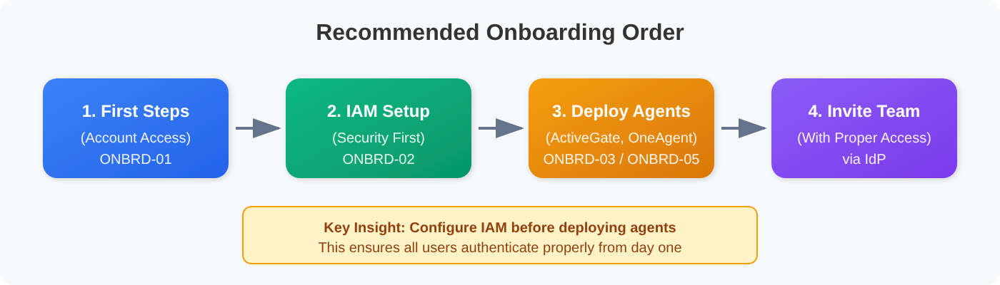
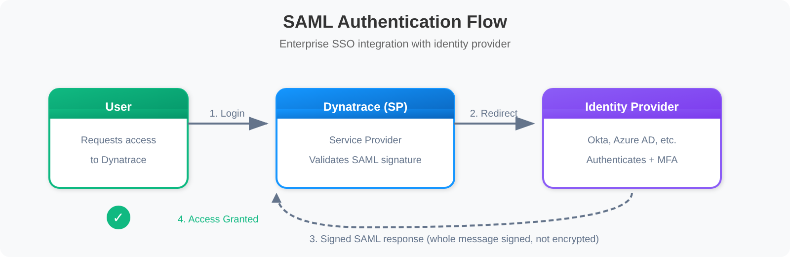
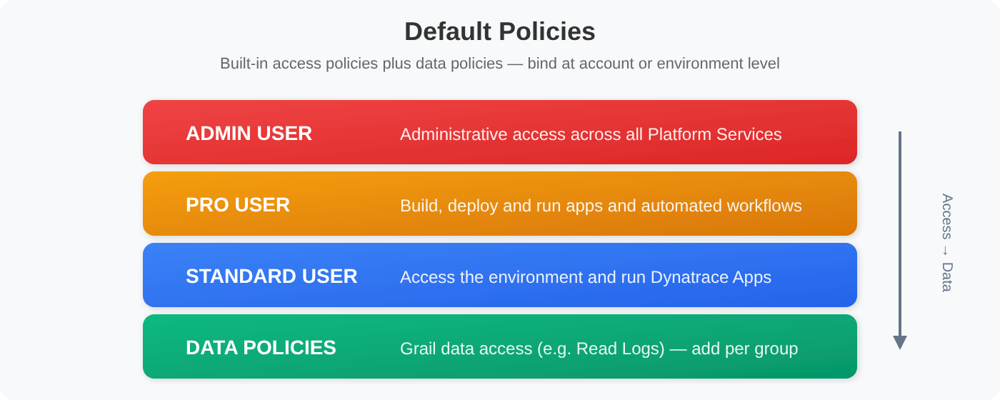
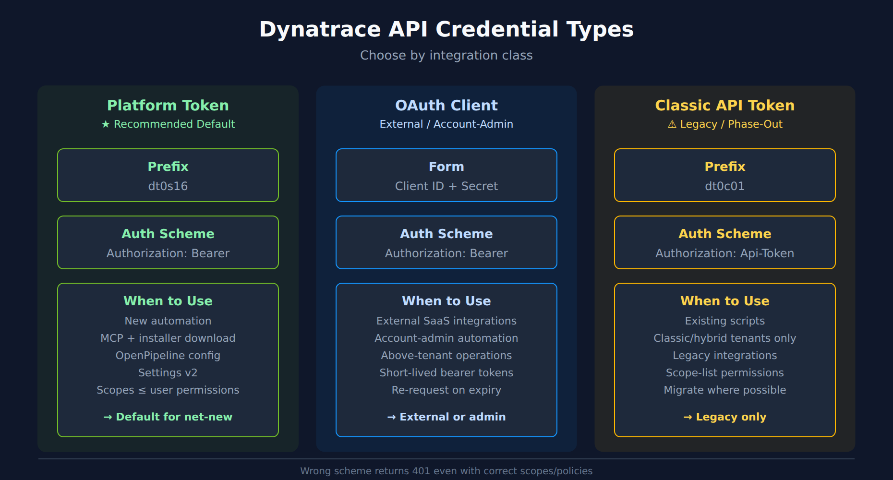

# ONBRD-02: IAM and Authentication

> **Series:** ONBRD — Dynatrace Onboarding | **Notebook:** 2 of 10 | **Created:** December 2025 | **Last Updated:** 10/02/2026

## Setting Up Secure Access
Before inviting your team, configure authentication and permissions properly. This notebook covers SAML/SSO setup, API tokens, and the modern permission model.

---

## Table of Contents

1. [Why IAM First?](#why-iam-first)
2. [Authentication Options](#authentication-options)
3. [Configuring SAML SSO](#configuring-saml-sso)
4. [User Groups and Permissions](#user-groups-and-permissions)
5. [API Token and OAuth Management](#api-token-and-oauth-management)
6. [Verification Queries](#verification-queries)
7. [Next Steps](#next-steps)

---

## Prerequisites

- Account owner or admin access
- Identity provider details (for SSO)
- Understanding of your organization's access requirements

<a id="why-iam-first"></a>
## 1. Why IAM First?
Setting up IAM before deploying OneAgent or inviting users ensures:

| Benefit | Why It Matters |
|---------|----------------|
| **Consistent access** | Users authenticate the same way from day one |
| **Proper permissions** | No accidental admin access for viewers |
| **Audit trail** | All access tied to corporate identity |
| **Offboarding** | With SAML, a disabled IdP account can't sign in; with SAML + SCIM, users are also removed when deprovisioned in the IdP |
| **Compliance** | Meet security requirements from the start |


<!-- MARKDOWN_TABLE_ALTERNATIVE
| Step | Description |
|------|-------------|
| 1. First Steps | Account access (ONBRD-01) |
| 2. IAM Setup | Security configuration (ONBRD-02) |
| 3. Deploy Agents | ActiveGate if needed (ONBRD-03), then OneAgent (ONBRD-05) |
| 4. Invite Team | Users join with proper access via IdP |
-->

> <sub>**Sources:** [Enterprise identity management (DT docs)](https://docs.dynatrace.com/docs/manage/identity-access-management/use-cases/access-enterprises-iam) — *"Users are removed immediately when deprovisioned in the IdP"* (SAML + SCIM).</sub>

<a id="authentication-options"></a>
## 2. Authentication Options
Dynatrace manages users either in its own user database or through an IdP using the federation protocols **SAML** and **SCIM**:

| Method | Description | Best For |
|--------|-------------|----------|
| **Local Users** | Built-in user accounts | Small teams, testing, the non-federated fallback account |
| **SAML 2.0** | Delegated authentication (SSO) through your IdP | Most organizations |
| **SCIM** (with SAML) | Automated provisioning and deprovisioning of users and groups from your IdP | Dynatrace's recommended enterprise approach for most organizations |

### Authentication Flow


<!-- MARKDOWN_TABLE_ALTERNATIVE
| Step | Description |
|------|-------------|
| 1. Login | User requests access to Dynatrace |
| 2. Redirect | Dynatrace redirects to Identity Provider |
| 3. Auth + MFA | User authenticates with IdP |
| 4. SAML Response | IdP sends a signed SAML response (entire message signed; assertion **not** encrypted) |
| 5. Access Granted | User is logged in |
-->

### Common Identity Providers

- **Azure Active Directory (Entra ID)** - Microsoft environments
- **Okta** - Cloud-native identity
- **OneLogin** - Enterprise identity
- **PingFederate** - On-premises/hybrid
- **Google Workspace** - Google-centric organizations

> <sub>**Sources:** [Identity management (DT docs)](https://docs.dynatrace.com/docs/manage/identity-access-management/user-and-group-management) — *"an IdP with the supported federation protocols SAML and SCIM"*; [Enterprise identity management (DT docs)](https://docs.dynatrace.com/docs/manage/identity-access-management/use-cases/access-enterprises-iam) — *"This is the recommended enterprise approach for most organizations."*; [SAML (DT docs)](https://docs.dynatrace.com/docs/manage/identity-access-management/user-and-group-management/access-saml) — *"No assertion encryption."*</sub>

<a id="configuring-saml-sso"></a>
## 3. Configuring SAML SSO

Dynatrace documents four steps, in this order: create a fallback user account, verify your domain, configure SAML, test.

### Step 1: Create a Fallback User Account

**Location:** Account Management → Identity & access management → User management → **Invite user**

Invite a **non-federated** user — an email address on a *different* domain from the one you are federating — and add it to a group with the **View and manage users and groups** permission. This account is how you get back in if the SAML configuration locks you out.

### Step 2: Verify Domain Ownership

**Location:** Account Management → Identity & access management → **Domain verification**

1. Add the domain (for example `mycompanyname.com`); add every domain your users sign in with
2. Copy the TXT resource record and add it to the domain's DNS
3. Select **Actions → Verify** (DNS propagation can take minutes, occasionally up to 24 hours)

### Step 3: Configure SAML

**Location:** Account Management → Identity & access management → **SAML configuration** → **New configuration**

1. Choose the **federation type** (Global, Account, or Environment)
2. Download the Dynatrace **SP metadata** (Entity ID, Assertion Consumer Service URL, Logout URL) and register it in your IdP
3. In your IdP, configure the Dynatrace application so that:
   - The **entire SAML message is signed** — signing only the assertion is rejected with `400 Bad Request`
   - The assertion is **not encrypted**
   - The NameID format is `urn:oasis:names:tc:SAML:1.1:nameid-format:emailAddress` (the user's email comes from the NameID)
4. Upload the IdP metadata XML to Dynatrace
5. *(Optional)* Map attributes: first name, last name, and the federated group/role attribute
6. Select the domains, activate the configuration (**Enable SSO**), and complete it

### Step 4: Test SSO

1. Open a new browser instance and a new incognito/private window
2. For Account or Environment federation, go to your tenant URL first (`https://{tenant-id}.apps.dynatrace.com`) — that is how Dynatrace SSO gets the context; sign-in is routed by your email domain
3. Complete IdP authentication
4. Verify you land in Dynatrace with the correct permissions, and that you can still see **User management** and **Group management**

> **Warning:** If sign-in breaks, use the fallback account from Step 1 to fix or disable the configuration. SAML sessions time out after 1 hour; that timeout is not configurable.

> <sub>**Sources:** [SAML (DT docs)](https://docs.dynatrace.com/docs/manage/identity-access-management/user-and-group-management/access-saml) — *"The entire SAML message must be signed (signing only SAML assertions is insufficient and generates a 400 Bad Request response)."*; *"Your fallback account must be a non-federated user account belonging to a group that has View and manage users and groups permission and isn't covered by the federated sign-in."*; *"To test an Account or Environment federation, go to the tenant URL first"*.</sub>

<a id="user-groups-and-permissions"></a>
## 4. User Groups and Permissions
### Permission Model

Dynatrace uses policy-based access control. Its default policies come in two types — **access policies** (built-in user roles) and **data policies** (access to Grail data) — and you assign them to groups at the account level (all environments) or for an individual environment:


<!-- MARKDOWN_TABLE_ALTERNATIVE
| Default policy | Type | Access |
|-------|------|--------|
| Admin User | Access | Administrative access across all Platform Services |
| Pro User | Access | Build, deploy and run apps and automated workflows |
| Standard User | Access | Access the environment and run Dynatrace Apps |
| Data policies (e.g. Read Logs) | Data | Access to Grail data — add per group |
-->

### Recommended Groups

A suggested starting mapping (adapt it to your organization):

| Group | Default policies | Use Case |
|-------|------|----------|
| **Platform Admins** | Admin User | Platform team, IAM management |
| **SRE Team** | Pro User + data policies | Workflow setup, monitoring config |
| **Developers** | Standard User + scoped data policies | Problem response, dashboards |
| **Stakeholders** | Standard User + read-only data policy | Reports, read-only access |

### Creating Groups

**Location:** Account Management → Identity & access management → Group management

1. Click "Create group"
2. Name the group (e.g., "SRE-Team")
3. Add a description
4. Assign policies (permissions)
5. Optionally link to IdP groups for automatic membership

### Scoping Access with Policies

The modern platform uses **policies** to control what users can access:

| Policy Type | Purpose |
|-------------|--------|
| **Access policies** | Feature-level access (Admin User, Pro User, Standard User, or your own) |
| **Data policies** | Access to Grail data, scoped by bucket / table / `storage:dt.security_context` conditions. (Segments filter views; they don't grant access.) |

Either type is bound at the **account** level (all environments) or the **environment** level.

### Parameterized Policies (Strongly Recommended)

Prefer **one parameterized policy bound to multiple groups via binding parameters** over many copies of the same policy with hardcoded scope values:

```text
ALLOW storage:buckets:read WHERE storage:table-name = "logs";
ALLOW storage:logs:read WHERE storage:dt.security_context = "${bindParam:team}";
```

The first statement is not optional: a table permission alone returns no records. `storage:buckets:read` is *"Required additionally to a table permission."*

Parameters are written as `${bindParam:<name>}` — Dynatrace's policy templating rule is *"Policy parameters should be prefixed with bindParam: and enclosed in ${...}."* ([Policy templating (DT docs)](https://docs.dynatrace.com/docs/manage/identity-access-management/permission-management/manage-user-permissions-policies/advanced/iam-policy-templating)). Bind the policy to `team-payments`, `team-checkout`, `team-fraud`, etc., varying only the `team` parameter — one policy, N bindings. The parameter shape is load-bearing: design once, change rarely.

The **`dt.security_context`** field is the standardized boundary for Gen3 IAM scoping across both data and configurations. Without it, cross-entity-type policies cannot be written. Decide your `dt.security_context` value space before tagging anything (covered in **ONBRD-06**).

### Where to Go Deeper

- **IAM-04 / IAM-05** — Designing effective policies and boundary conditions
- **IAM-10: Templated Policy-Group Assignments** — binding one templated policy to many groups with `bindParam` values
- **IAM-11 (WORKSHOP)** — Hands-on policy and persona design
- **IAM-99** — IAM best-practice summary and DQL reference
- **FAQ-02** — Tagging sources, standards, and strategy (`dt.security_context` design)
- **ORGNZ-06 / ORGNZ-07** — Security context for data and configuration scoping

> **Note:** For data filtering, use **Segments + `dt.security_context`** (covered in ONBRD-06) rather than the legacy Management Zones. Segments narrow what a user sees; access itself is enforced by IAM policies.

> <sub>**Sources:**</sub>
> - <sub>[Default policies (DT docs)](https://docs.dynatrace.com/docs/manage/identity-access-management/permission-management/default-policies) — *"You can assign policies to groups via the user group details either on the account level, which includes all environments in that account, or on the individual environment level."*</sub>
> - <sub>[IAM policy statements (DT docs)](https://docs.dynatrace.com/docs/manage/identity-access-management/permission-management/manage-user-permissions-policies/advanced/iam-policystatements) — *"Grants permission to read records from Grail buckets. Required additionally to a table permission."*</sub>
> - <sub>[Segments visibility (DT docs)](https://docs.dynatrace.com/docs/manage/segments/concepts/segments-concepts-visibility) — *"All queries, with or without segments, always respect data access permissions enforced by IAM policies."*</sub>

<a id="api-token-and-oauth-management"></a>
## 5. API Token and OAuth Management

The modern platform supports three credential types — pick based on the integration:


<!-- MARKDOWN_TABLE_ALTERNATIVE
| Token Type | Prefix | Auth Scheme | When to Use |
|------------|--------|-------------|-------------|
| Platform Token (recommended default) | dt0s16 | Authorization: Bearer | New automation, MCP + installer download, OpenPipeline, Settings v2; scopes bounded by user permissions |
| OAuth Client | client ID + secret | Authorization: Bearer | External SaaS integrations, account-admin automation; short-lived bearer tokens, re-request on expiry |
| Classic API Token (legacy phase-out) | dt0c01 | Authorization: Api-Token | Existing scripts; classic/hybrid tenants only; migrate to Platform Token |
For environments where SVG doesn't render
-->

| Credential | Prefix / Form | When to Use |
|------------|---------------|-------------|
| **Platform Token** *(recommended default for new automation)* | `dt0s16` | New automation, MCP integrations, OpenPipeline configuration, Settings v2, installer downloads |
| **OAuth 2.0 Client** | client ID + secret | External SaaS integrations, account-admin automation |
| **Classic API Token** *(legacy phase-out)* | `dt0c01` | Existing scripts on classic/hybrid environments; migrate to Platform Token where possible |

> **Workflows don't use a token.** Every workflow task runs as the workflow's **actor** (a user or service user; by default the workflow's creator) — grant permissions to the actor, not a token.

### Platform Tokens (Recommended Default)

Platform Tokens are the standard for new automation — in Latest Dynatrace they replace classic access tokens. They:

- Carry the **scopes you select** at creation, and only work within the permissions of the user (or service user) they are issued for — *"A platform token will only work within the limits of the assigned user's permissions."* ([Platform tokens (DT docs)](https://docs.dynatrace.com/docs/manage/identity-access-management/access-tokens-and-oauth-clients/platform-tokens))
- Are bound to a single user identity (or service identity) for traceability
- Should be the default unless you have a specific reason to choose OAuth or Classic

**Location:** **My platform tokens** (`myaccount.dynatrace.com/platformTokens`) for your own tokens; admins: **Account Management → Identity & access management → Platform tokens**

```bash
# Authorization scheme by token prefix:
#   dt0s16           →  Authorization: Bearer <token>  (dt0s01 is a separate SCIM account token, not a Platform Token)
#   dt0c01           →  Authorization: Api-Token <token>
# Wrong scheme returns 401 even with correct scopes/policies.
```

### OAuth 2.0 Clients

Use for **external system integrations** or **account-admin automation** that operates above the tenant level.

**Location:** Account Management → Identity & access management → OAuth clients

1. Create an OAuth client
2. Use client credentials flow to obtain bearer tokens
3. Bearer tokens are short-lived (the documented example response has `"expires_in": 300`, in seconds) — request a new one with the client credentials when it expires

### Classic API Tokens (Legacy)

Classic access tokens exist only on classic and hybrid environments — *"Classic access tokens don't exist in latest environments"* — so existing scripts that use them need a migration plan. Migrate to Platform Tokens during routine refresh cycles. Classic tokens use the `Api-Token` Authorization scheme (not `Bearer`).

**Location:** the **Access Tokens** app in your environment → **Generate new token** (not Account Management)

| Common Use | Classic scope | Platform-token scope |
|------------|---------------|----------------------|
| **OneAgent Installer Download** | `InstallerDownload` | `fleet-management:oneagents:download` |
| **ActiveGate Installer Download** | `InstallerDownload` | `fleet-management:activegates:download` |
| **Metric Ingestion** | `metrics.ingest` | — |
| **Log Ingestion** | `logs.ingest` | — |

### Token Best Practices

| Practice | Why |
|----------|-----|
| **Minimal scope / least-privilege policy** | Limit blast radius if compromised |
| **Descriptive names** | Know what each token is for |
| **Expiration dates** | Force rotation, reduce risk |
| **Separate tokens per use** | Revoke one without affecting others |
| **Never commit to code** | Use environment variables or secrets managers |
| **Prefer Platform Tokens for new work** | Aligned with the Gen3 IAM model |

### Where to Go Deeper

- **IAM series** — Token management, lifecycle, audit patterns

> <sub>**Sources:**</sub>
> - <sub>[Upgrade from access tokens classic (DT docs)](https://docs.dynatrace.com/docs/platform/upgrade/set-up-your-environment/upgrade-from-access-tokens-classic) — *"In Latest Dynatrace , this model is replaced with platform tokens"*</sub>
> - <sub>[Download latest OneAgent installer (DT docs)](https://docs.dynatrace.com/docs/dynatrace-api/environment-api/deployment/oneagent/download-oneagent-latest) — *"Platform Token / OAuth: Required scope: fleet-management:oneagents:download"*</sub>
> - <sub>[Download latest ActiveGate installer (DT docs)](https://docs.dynatrace.com/docs/dynatrace-api/environment-api/deployment/activegate/download-activegate-latest) — *"Platform Token / OAuth: Required scope: fleet-management:activegates:download"*</sub>
> - <sub>[Workflow security (DT docs)](https://docs.dynatrace.com/docs/analyze-explore-automate/workflows/security) — *"By default, the actor is the creator of the workflow."*</sub>
> - <sub>[OAuth clients (DT docs)](https://docs.dynatrace.com/docs/manage/identity-access-management/access-tokens-and-oauth-clients/oauth-clients), [API authentication — token prefixes (DT docs)](https://docs.dynatrace.com/docs/dynatrace-api/basics/dynatrace-api-authentication)</sub>

<a id="verification-queries"></a>
## 6. Verification Queries
After configuring IAM, these queries confirm that people are signing in to this environment. They read environment audit events in `dt.system.events`.

> **What they can't show:** SSO configuration, group and permission changes are recorded in the separate **Account Management audit log** (Account Management UI, or the Account Audits API with the `account-audit-logs-read` scope) — *"Neither v2/auditlogs nor dt.system.events captures it."* ([Upgrade from audit logs classic (DT docs)](https://docs.dynatrace.com/docs/platform/upgrade/set-up-your-environment/upgrade-from-audit-logs-classic)). Use the manual checklist below to confirm SSO itself.

```dql
// Environment sign-ins (platform gateway audit events)
// Data object corrected 09/24/2026. The Dynatrace audit trail is NOT in `logs`: the former
// `fetch logs | filter matchesPhrase(log.source, "audit")` matched nothing, or matched an
// unrelated file-based audit log (a database .aud file on the validation tenant). Environment
// audit records are structured events in `dt.system.events` with event.kind == "AUDIT_EVENT".
fetch dt.system.events, from:-24h
| filter event.kind == "AUDIT_EVENT"
| filter event.type == "LOGIN"
| fields timestamp, user.id, event.outcome, authentication.type, origin.type
| sort timestamp desc
| limit 50
```

```dql
// Sign-in outcomes over the last 7 days (audit events, not application logs)
fetch dt.system.events, from:-7d
| filter event.kind == "AUDIT_EVENT"
| filter event.type == "LOGIN"
| summarize {events = count(), users = countDistinct(user.id)}, by:{event.type, event.outcome}
| sort events desc
```

### Manual Verification Checklist

| Item | How to Verify |
|------|---------------|
| **SSO working** | Login via IdP in incognito window |
| **Groups created** | Check Account Management → Identity & access management → Group management |
| **Permissions assigned** | Test with a viewer account |
| **Fallback account** | The non-federated fallback user can still sign in |
| **API tokens** | Installer-download token ready (platform token with `fleet-management:oneagents:download`, or classic `InstallerDownload` on classic/hybrid tenants) |

<a id="next-steps"></a>
## 7. Next Steps

With IAM configured, you're ready to:

1. **ONBRD-03: Deploying ActiveGate** — Set up network routing (if needed for restricted networks)
2. **ONBRD-04: Cloud & SaaS Integrations** — Connect AWS / Azure / GCP and SaaS sources
3. **ONBRD-05: Deploying OneAgent** — Start collecting infrastructure and application data
4. **ONBRD-06: Organizing Your Environment** — Set up tags, segments, and `dt.security_context`
5. Invite team members via your IdP
6. Create additional Platform Tokens or OAuth clients as needed

### IAM Tasks Before Moving On

- [ ] SAML/SSO configured and tested
- [ ] Non-federated fallback account created and documented
- [ ] User groups created for major roles
- [ ] Parameterized policy shape decided; group → policy bindings drafted
- [ ] `dt.security_context` value space planned (deeper in ONBRD-06 / FAQ-02)
- [ ] Platform Token issued for migration / automation tooling
- [ ] Installer-download token issued (platform token with `fleet-management:oneagents:download`, or classic `InstallerDownload` on classic/hybrid tenants)
- [ ] Token naming conventions established

### Where to Go Deeper

- **IAM series** (15 notebooks) — full IAM administration depth
- **FAQ-02** — Tagging sources, standards, and strategy
- **ORGNZ series** — Bucket strategy, segments, security context

---

## Summary

In this notebook, you learned:

- Why IAM should be configured before deploying agents
- Authentication options (Local, SAML, SCIM)
- How to configure SAML SSO
- Default policies (Admin User, Pro User, Standard User, data policies), group structure, and parameterized policies
- The three credential types (Platform Token, OAuth, Classic API Token) and when to use each
- `dt.security_context` as the standardized boundary field for Gen3 IAM
- How to verify IAM configuration

---

## References

- [Identity and access management (DT docs)](https://docs.dynatrace.com/docs/manage/identity-access-management)
- [Platform tokens (DT docs)](https://docs.dynatrace.com/docs/manage/identity-access-management/access-tokens-and-oauth-clients/platform-tokens)
- [Policy templating (DT docs)](https://docs.dynatrace.com/docs/manage/identity-access-management/permission-management/manage-user-permissions-policies/advanced/iam-policy-templating) — the `${bindParam:...}` syntax quoted in section 4
- [SAML (DT docs)](https://docs.dynatrace.com/docs/manage/identity-access-management/user-and-group-management/access-saml) — fallback account, domain verification, IdP requirements
- [SAML configurations (DT docs)](https://docs.dynatrace.com/docs/manage/identity-access-management/user-and-group-management/access-saml/saml-configurations)
- [Enterprise identity management — SAML and SCIM (DT docs)](https://docs.dynatrace.com/docs/manage/identity-access-management/use-cases/access-enterprises-iam)
- [Default policies (DT docs)](https://docs.dynatrace.com/docs/manage/identity-access-management/permission-management/default-policies)
- [Identity management — SSO and federation (DT docs)](https://docs.dynatrace.com/docs/manage/identity-access-management/user-and-group-management)
- [Access tokens classic (DT docs)](https://docs.dynatrace.com/docs/manage/identity-access-management/access-tokens-and-oauth-clients/access-tokens)
- [OAuth clients (DT docs)](https://docs.dynatrace.com/docs/manage/identity-access-management/access-tokens-and-oauth-clients/oauth-clients)

---

<sub>*This notebook was AI-generated from community-submitted and publicly available sources. This notebook series is not officially supported by Dynatrace. Always verify information against official Dynatrace documentation.*</sub>
