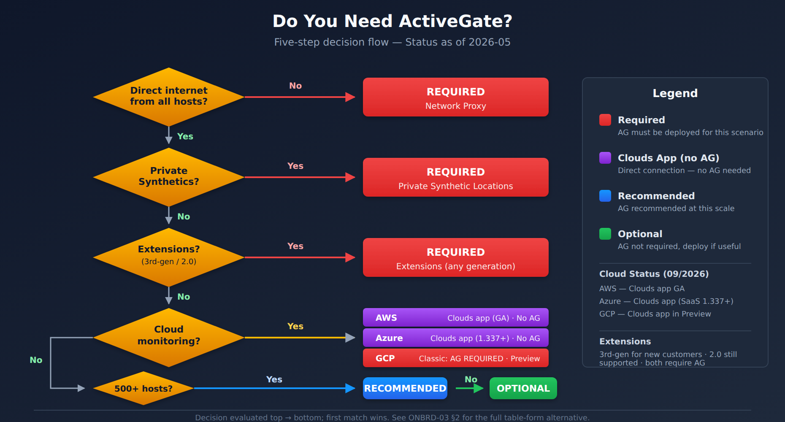

# ONBRD-03: Deploying ActiveGate

> **Series:** ONBRD — Dynatrace Onboarding | **Notebook:** 3 of 10 | **Created:** December 2025 | **Last Updated:** 07/30/2026

## Your Network Gateway to Dynatrace
ActiveGate is a lightweight component that routes traffic between your infrastructure and Dynatrace. This notebook covers when you need ActiveGate, how many to deploy, where to place them, and installation steps - including comprehensive Kubernetes deployment options.

---

## Table of Contents

1. [What is ActiveGate?](#what-is-activegate)
2. [When Do You Need ActiveGate?](#when-do-you-need-activegate)
3. [How Many ActiveGates?](#how-many-activegates)
4. [Where to Deploy?](#where-to-deploy)
5. [Generating Tokens](#generating-tokens)
6. [Installation Methods](#installation-methods)
7. [Kubernetes Deployment (Detailed)](#6a-kubernetes-deployment-detailed)
8. [Verifying Deployment](#verifying-deployment)
9. [Troubleshooting](#troubleshooting)
10. [Next Steps](#next-steps)

---

## Prerequisites

- Admin access to Dynatrace environment
- Network architecture diagram (know your zones)
- Server for ActiveGate (Linux, Windows, or Kubernetes cluster)
- Outbound HTTPS (443) to Dynatrace SaaS

<a id="what-is-activegate"></a>
## 1. What is ActiveGate?
ActiveGate is a proxy and routing component that connects your environment to Dynatrace.

| Component | Purpose |
|-----------|--------|
| **Environment ActiveGate** | Routes OneAgent traffic, runs extensions, executes synthetics |
| **Cluster ActiveGate** | Dynatrace Managed only - cluster communication |

> **Note:** This notebook covers Environment ActiveGate for Dynatrace SaaS.


<!-- MARKDOWN_TABLE_ALTERNATIVE
| Zone | Component | Connection |
|------|-----------|------------|
| DMZ | ActiveGate | → Dynatrace SaaS (443) |
| Internal | OneAgents | → ActiveGate (9999) |
| Restricted | OneAgents | → ActiveGate (9999) |
| Cloud | Extensions | → ActiveGate (9999) |
-->

### ActiveGate Capabilities

| Capability | Description |
|------------|-------------|
| **Traffic Routing** | Proxies OneAgent data to Dynatrace |
| **Extensions 2.0** | Runs Python-based extensions locally |
| **Synthetic Monitoring** | Private synthetic locations |
| **Cloud Integrations** | AWS, Azure, GCP metric collection (or use Clouds app for direct connections) |
| **Kubernetes API** | Cluster monitoring via API |
| **Log Ingest** | Generic log ingest endpoint |

> **OneAgent Attribute Enrichment (1.331+):** OneAgent can enrich all telemetry (metrics, spans, logs, events) with primary fields (`dt.security_context`, `dt.cost.costcenter`) and primary tags (`primary_tags.environment`, `primary_tags.team`) at the source. More efficient than auto-tags — feeds directly into OpenPipeline routing, bucket assignment, and Grail permissions. Configure via `oneagentctl --set-host-tag` or `--set-host-tag` at install time. See [docs](https://docs.dynatrace.com/docs/ingest-from/dynatrace-oneagent/oneagent-attribute-enrichment).

### Dynatrace Version Support Policy

| Component | Standard Support | Enterprise Support |
|-----------|-----------------|-------------------|
| **OneAgent** | 9 months | 12 months |
| **ActiveGate** | 9 months | 12 months |
| **Dynatrace Operator** | Independent release cycle — check [release notes](https://docs.dynatrace.com/docs/whats-new) |

### Technology Support Tiers

| Tier | Meaning |
|------|---------|
| **Full Support** | All monitoring features maintained, bugs fixed, enhancements delivered |
| **Early Adopter** | Newly introduced — functional but may lack full feature parity; feedback welcome |
| **End of Life (EOL)** | No updates, fixes, or enhancements; monitoring may still work but issues won't be addressed |

### Third-Party Technology EOL Policy

Dynatrace continues to support monitoring a third-party technology for **6 months beyond the vendor's end-of-life date**. End-of-support announcements are published 6 months in advance.

> **Reference:** [Technology Support Model](https://docs.dynatrace.com/docs/ingest-from/technology-support/support-model-and-issues) | [End-of-Support Announcements](https://docs.dynatrace.com/docs/whats-new/technology/end-of-support-news) | [Support Policy](https://www.dynatrace.com/company/trust-center/support-policy/)

<a id="when-do-you-need-activegate"></a>
## 2. When Do You Need ActiveGate?
### Required Scenarios

| Scenario | Why ActiveGate is Required |
|----------|---------------------------|
| **Network-restricted hosts** | OneAgents can't reach internet directly |
| **Private synthetic monitors** | Test internal applications |
| **Extensions 2.0** | Custom data sources (SNMP, databases, etc.) |
| **AWS / Azure / GCP monitoring** | See Clouds app status below — AG still required for GCP and for environments without Clouds app |
| **VMware monitoring** | vCenter integration |
| **Kubernetes full-stack** | Cluster API access for events, metrics |

> **Update — Clouds App (status as of 2026-05):** The **Clouds app** supports direct cloud connections **without ActiveGate** — but coverage varies per cloud:
>
> | Cloud | Clouds-app Status | AG Required? |
> |-------|-------------------|--------------|
> | **AWS** | GA — direct connection supported | No (when using Clouds app) |
> | **Azure** | Preview — direct connection supported | No (when using Clouds app preview) |
> | **GCP** | Not yet available in Clouds app | **Yes — AG-based polling** |
>
> ActiveGate is still required for **Extensions 2.0**, **private synthetic locations**, **GCP monitoring**, and any environment without Clouds app access. See [Clouds app documentation](https://docs.dynatrace.com/docs/platform-modules/infrastructure-monitoring/cloud-platform-monitoring) and the **CLOUD series** for per-provider deep dives.

### Optional but Recommended

| Scenario | Benefit |
|----------|--------|
| **Large deployments (500+ hosts)** | Reduces outbound connections |
| **Multiple network zones** | Centralized routing per zone |
| **Bandwidth optimization** | Compresses and batches data |
| **Security compliance** | Single egress point for audit |

### Decision Tree


<!-- MARKDOWN_TABLE_ALTERNATIVE
| Question | Yes → | No → |
|----------|-------|------|
| Can all hosts reach Dynatrace directly? | AG optional | AG required |
| Need private synthetic monitoring? | AG required | Continue |
| Using Extensions 2.0? | AG required | Continue |
| Monitoring AWS (Clouds app GA)? | AG optional | AG required |
| Monitoring Azure (Clouds app preview)? | AG optional | AG required |
| Monitoring GCP? | AG required (Clouds app not yet available) | Continue |
| More than 500 hosts? | AG recommended | AG optional |
-->

<a id="how-many-activegates"></a>
## 3. How Many ActiveGates?
### Sizing Guidelines

> **FAQ-10 owns the ActiveGate sizing decision.** *FAQ-10: How do I size and scale ActiveGates?* carries the current published per-shape capacity tables, the 50% CPU / 80% memory headroom rule, the survivor-capacity HA math for a multi-node zone, and the `dt.sfm.active_gate.*` saturation signals to watch once the fleet is running. Treat the table below as an order-of-magnitude sanity check while you plan the deployment — size the actual machines against FAQ-10 and the official requirements page.

Dynatrace publishes estimated host counts per reference instance shape, with the guidance that a steady-state ActiveGate *"should not exceed 50% CPU and 80% memory"*:

| Reference shape | Architecture | vCPU | RAM | Estimated hosts routed |
|-----------------|--------------|------|-----|------------------------|
| c6i.large | x86-64 | 2 | 3.75 GiB | ~800 |
| c6i.xlarge | x86-64 | 4 | 7.5 GiB | ~1,800 |
| c6i.2xlarge | x86-64 | 8 | 15 GiB | ~2,500 |
| c7g.large | ARM64 | 2 | 3.75 GiB | ~1,300 |
| c7g.xlarge | ARM64 | 4 | 7.5 GiB | ~2,700 |
| c7g.2xlarge | ARM64 | 8 | 15 GiB | ~5,500 |

The reference points are AWS instance shapes — for on-premises VMs, map by vCPU/RAM rather than looking for the instance name. "Estimated hosts routed" assumes typical per-host data volume; hosts pushing heavy log volume through the ActiveGate consume capacity faster. Note also that ARM64 routes materially more hosts per vCPU than x86-64 at the same shape, which is worth knowing *before* you standardize on an instance family.

### Detailed Hardware Requirements

#### Minimum System Requirements

| Component | Minimum | Recommended |
|-----------|---------|-------------|
| **CPU** | 2 cores (x64) | 4+ cores |
| **RAM** | 2 GB | 4+ GB |
| **Disk Space** | 2 GB | 10+ GB (for logs/cache) |
| **Disk Type** | HDD | SSD (for extensions) |
| **Network** | 100 Mbps | 1 Gbps |

#### Operating System Support

The routing/monitoring ActiveGate matrix changes every few sprints, so **the official requirements pages are the authority** — re-check them before you provision, not just when something breaks: [Linux ActiveGate hardware and system requirements](https://docs.dynatrace.com/docs/ingest-from/dynatrace-activegate/installation/linux/linux-activegate-hardware-and-system-requirements) and [Windows ActiveGate hardware and system requirements](https://docs.dynatrace.com/docs/ingest-from/dynatrace-activegate/installation/windows/windows-activegate-hardware-and-system-requirements).

Currently listed for routing/monitoring ActiveGates (verified 07/30/2026, ActiveGate 1.343):

| OS | Supported Versions |
|----|-------------------|
| **Red Hat Enterprise Linux** | 8.10, 9.4, 9.6, 9.7, 9.8, 10.0, 10.1, 10.2 |
| **Oracle Linux** | 8.10, 9.7, 9.8, 10.1, 10.2 |
| **Rocky Linux** | 8.10, 9.7, 9.8, 10.1, 10.2 |
| **Ubuntu** | 16.04, 18.04, 20.04, 22.04, 24.04, 26.04 (x86-64); 20.04, 22.04, 24.04, 26.04 (ARM64 / s390) |
| **Amazon Linux** | 2, 2023 |
| **SUSE Linux Enterprise Server** | 15.7 |
| **Windows Server** | 2016, 2019, 2022, 2025 |

**Added in ActiveGate 1.343:** Oracle Linux 9.8 and 10.2, Rocky Linux 9.8 and 10.2. ActiveGate 1.343 was published 07/15/2026 with a staged fleet rollout from 07/28/2026 — the ActiveGates already running in your environment carry whatever version they last updated to, so check the version of the specific ActiveGate before assuming a newly added OS is installable on it.

> **On CentOS and Debian:** neither CentOS Linux, CentOS Stream, nor Debian appears on the current routing/monitoring ActiveGate matrix (verified 07/30/2026). Earlier revisions of this notebook combined "RHEL/CentOS" into a single row, which reads as an endorsement of CentOS that the requirements page does not make — and CentOS Linux is end-of-life upstream regardless of what Dynatrace supports. If you are planning ActiveGates on CentOS Stream or Debian, check the requirements page directly before provisioning rather than inferring support from the RHEL row.

#### Support Ending — Do Not Provision New ActiveGates on These

Dynatrace de-supports an OS version *"at least 6 months after its end of life (EOL), to give you enough time to upgrade your environment."* The announced removals below all fall inside the next six months:

| OS version | ActiveGate support ends |
|------------|------------------------|
| Red Hat Enterprise Linux 9.4 | **11/01/2026** |
| Ubuntu 16.04 | **11/01/2026** |
| Red Hat Enterprise Linux 9.7, 10.1 | **12/01/2026** |
| Oracle Linux 9.7, 10.1 | **12/01/2026** |
| Rocky Linux 9.7, 10.1 | **12/01/2026** |
| Amazon Linux 2 | **01/01/2027** |

**Existing ActiveGates on these versions keep working right up to the date** — nothing stops the moment the announcement lands. What ends is Dynatrace's commitment to fix issues and ship new ActiveGate versions for that OS. Two practical consequences for an onboarding plan:

- **Do not provision new ActiveGates on any version in this table.** Amazon Linux 2 and RHEL 9.4 were the obvious defaults a year ago and are now the wrong starting point — pick Amazon Linux 2023, RHEL 9.8/10.2, Oracle Linux 9.8/10.2, or Rocky Linux 9.8/10.2 instead.
- **Fold the OS upgrade into the next ActiveGate update window** rather than scheduling it as separate work. The update mechanics, auto-update behavior, and how to schedule those windows are covered in *FAQ-05: Managing ActiveGate updates on Dynatrace SaaS*.

> **Reference:** [End-of-support announcements (DT docs)](https://docs.dynatrace.com/docs/whats-new/technology/end-of-support-news) — the dates and the 6-month policy statement above are quoted from this page, verified 07/30/2026.

#### Memory Sizing by Workload

| Workload Type | Base Memory | Additional per Feature |
|---------------|-------------|----------------------|
| **Routing Only** | 2 GB | - |
| **+ Extensions 2.0** | 2 GB | +1-2 GB per active extension |
| **+ Synthetic** | 2 GB | +1 GB per 10 monitors |
| **+ Cloud Integration** | 2 GB | +512 MB per cloud account |
| **+ Log Ingest** | 2 GB | +2 GB for high volume |

#### Disk Space Sizing

| Purpose | Space Required |
|---------|---------------|
| **Base Installation** | 1.5 GB |
| **Log Files (default)** | 1-5 GB (rotated) |
| **Extension Cache** | 500 MB - 2 GB |
| **Synthetic Cache** | 500 MB - 1 GB |
| **Temporary Files** | 1 GB |
| **Recommended Total** | 10-20 GB |

> **Best Practice:** Mount `/opt/dynatrace` on a dedicated partition with at least 20 GB for production deployments.

### High Availability

For production environments, deploy **at least 2 ActiveGates per network zone**:

| Deployment | ActiveGates | Purpose |
|------------|-------------|--------|
| **Minimum HA** | 2 per zone | Failover capability |
| **Recommended** | 2-3 per zone | Load distribution + failover |
| **Large scale** | N+1 per zone | Capacity + redundancy |

> **Key Point:** OneAgents automatically load-balance across available ActiveGates and failover if one becomes unavailable.

### Example Deployment

| Network Zone | Hosts | ActiveGates | Shape class per AG | vCPU each | RAM each |
|--------------|-------|-------------|--------------------|-----------|----------|
| Production DMZ | 200 | 2 | c6i.large (~800 hosts) | 2 | 3.75 GiB |
| Production Internal | 800 | 2 | c6i.xlarge (~1,800 hosts) | 4 | 7.5 GiB |
| Development | 150 | 1 | c6i.large (~800 hosts) | 2 | 3.75 GiB |
| **Total** | **1,150** | **5** | | **14 vCPU** | **26.25 GiB** |

Note why Production Internal is sized at c6i.xlarge for only 800 hosts across two nodes: each node must be able to carry the **whole** zone when its partner is down, so the survivor's capacity — not the average load — sets the shape. FAQ-10 works that survivor-capacity math out properly, including for zones larger than two nodes.

<a id="where-to-deploy"></a>
## 4. Where to Deploy?
### Network Zone Strategy

Deploy ActiveGates based on network segmentation:


<!-- MARKDOWN_TABLE_ALTERNATIVE
| Zone Type | ActiveGate Location | OneAgent Connection |
|-----------|--------------------|-----------------|
| DMZ | In DMZ with internet access | Internal hosts → DMZ AG |
| Internal | Internal segment | Internal hosts → Internal AG |
| Cloud VPC | Within VPC | Cloud workloads → VPC AG |
| Air-gapped | Edge with controlled egress | Isolated hosts → Edge AG |
-->

### Placement Rules

| Rule | Description |
|------|-------------|
| **Same network zone** | AG should be in same zone as OneAgents it serves |
| **Outbound access** | AG needs HTTPS to `*.dynatrace.com` |
| **Inbound from agents** | OneAgents connect to AG on port 9999 |
| **Low latency** | Place AG close to monitored workloads |

### Cloud-Specific Guidance

| Cloud | Recommendation |
|-------|---------------|
| **AWS** | Deploy in management VPC or shared services subnet |
| **Azure** | Hub VNet with peering to spoke VNets |
| **GCP** | Shared VPC host project |
| **Kubernetes** | Deploy as StatefulSet or standalone VM outside cluster |

<a id="generating-tokens"></a>
## 5. Generating Tokens
ActiveGate requires a PaaS token for installation.

**Location:** Settings → Integration → Platform as a Service

Or use the API token approach:

### Required Token Scopes

| Scope | API Name | Purpose |
|-------|----------|--------|
| **PaaS integration - Installer download** | `InstallerDownload` | Download ActiveGate installer |

### Additional Scopes by Use Case

| Use Case | Additional Scopes |
|----------|------------------|
| **AWS Monitoring** | `aws.supportedServicesRead` |
| **Azure Monitoring** | `azure.supportedServicesRead` |
| **Extensions 2.0** | `extensions.read`, `extensions.write` |
| **Synthetic Private Location** | `syntheticLocations.write` |

### Token Naming Convention

Use descriptive names:
- `prod-activegate-dmz`
- `aws-activegate-useast1`
- `k8s-activegate-cluster1`

<a id="installation-methods"></a>
## 6. Installation Methods
### Linux Installation

```bash
# Download the installer
wget -O Dynatrace-ActiveGate.sh \
  "https://{tenant-id}.live.dynatrace.com/api/v1/deployment/installer/gateway/unix/latest?Api-Token={paas-token}"

# Make executable and run
chmod +x Dynatrace-ActiveGate.sh
sudo ./Dynatrace-ActiveGate.sh
```

### Windows Installation

```powershell
# Download the installer
Invoke-WebRequest -Uri "https://{tenant-id}.live.dynatrace.com/api/v1/deployment/installer/gateway/windows/latest?Api-Token={paas-token}" -OutFile Dynatrace-ActiveGate.exe

# Run the installer
.\Dynatrace-ActiveGate.exe
```

> **Deprecation note (SaaS 1.343, July 2026):** the classic ActiveGate deployment API used above (`/api/v1/deployment/installer/gateway/...` with a PaaS/`Api-Token`) is **deprecated** in favor of the Latest Dynatrace deployment REST API, which supports **platform tokens** with fine-grained OAuth scopes and adds a REST endpoint for public component-image URIs. Its GA/enabled-by-default status arrives with the staged SaaS 1.343 tenant rollout (from mid-July 2026) — verify availability in your tenant. The classic endpoints continue to work during the deprecation period — plan new automation against the platform API and migrate existing scripts on your next maintenance touch.

### Container Deployment (Docker/Podman)

```bash
docker run -d --name dynatrace-activegate \
  -e DT_TENANT="{tenant-id}" \
  -e DT_API_TOKEN="{paas-token}" \
  -p 9999:9999 \
  dynatrace/dynatrace-activegate:latest
```

### Installation Parameters

| Parameter | Purpose | Example |
|-----------|---------|--------|
| `--set-network-zone` | Assign to network zone | `--set-network-zone=dmz` |
| `--set-group` | Group for management | `--set-group=production` |
| `--enable-synthetic` | Enable synthetic capability | `--enable-synthetic` |

<a id="6a-kubernetes-deployment-detailed"></a>
## 6a. Kubernetes Deployment (Detailed)
Deploying ActiveGate in Kubernetes requires careful consideration of where, how, and when to use containerized ActiveGates vs. traditional VM deployments.

### When to Deploy ActiveGate in Kubernetes

| Scenario | Deploy in K8s? | Reasoning |
|----------|----------------|-----------|
| **Cluster-only monitoring** | ✅ Yes | Co-located with workloads, simplifies networking |
| **Routing for in-cluster OneAgents** | ✅ Yes | Lower latency, no external hops |
| **Extensions 2.0 for K8s resources** | ✅ Yes | Direct access to cluster APIs |
| **Multi-cluster routing** | ⚠️ Consider | May need external AG for cross-cluster |
| **Private synthetic monitoring** | ❌ Usually VM | Synthetic requires stable network, not pod restarts |
| **Routing for external hosts** | ❌ VM preferred | External hosts need stable, routable IP |
| **Air-gapped environments** | ❌ VM preferred | Often need dedicated proxy tier |

### When NOT to Deploy in Kubernetes

| Scenario | Why VM is Better |
|----------|------------------|
| **Routing for VMs/bare metal** | VMs need stable IPs, not pod IPs |
| **Private synthetic locations** | Synthetic tests sensitive to pod restarts |
| **Extensions polling external systems** | External systems may not allow K8s egress IPs |
| **Compliance requiring dedicated hosts** | Some compliance requires dedicated hardware |

### Deployment Architecture


<!-- MARKDOWN_TABLE_ALTERNATIVE
| Component | Location | Purpose |
|-----------|----------|---------|
| ActiveGate StatefulSet | dynatrace namespace | Routing, extensions |
| Headless Service | dynatrace namespace | Pod DNS discovery |
| LoadBalancer Service | dynatrace namespace | External access (optional) |
| PVC (optional) | dynatrace namespace | Persistent logs/cache |
| ConfigMap | dynatrace namespace | Custom configuration |
| Secret | dynatrace namespace | API tokens |
-->

### Kubernetes Hardware Requirements

| Deployment Size | CPU Request | CPU Limit | Memory Request | Memory Limit |
|-----------------|-------------|-----------|----------------|--------------|
| **Small** (≤500 agents) | 500m | 2000m | 1Gi | 2Gi |
| **Medium** (500-1500) | 1000m | 4000m | 2Gi | 4Gi |
| **Large** (1500-3000) | 2000m | 8000m | 4Gi | 8Gi |
| **Extra Large** (3000+) | 4000m | 16000m | 8Gi | 16Gi |

### Method 1: Dynatrace Operator (Recommended)

The Dynatrace Operator manages ActiveGate lifecycle automatically.

> **Important:** Use `apiVersion: dynatrace.com/v1beta6` for new DynaKubes (`v1beta5` remains accepted). Operator **1.9.0** removed `v1beta3` from the CRD (*"Applying DynaKube resources using this version will fail"*), and Operator **1.10.0** (July 15, 2026) deprecates `v1beta4` — check `kubectl get dynakube -A -o jsonpath='{.items[*].apiVersion}'` before upgrading the Operator. v1beta6 adds OTLP exporter configuration.

```yaml
# dynakube.yaml - ActiveGate via Operator
apiVersion: dynatrace.com/v1beta5
kind: DynaKube
metadata:
  name: dynakube
  namespace: dynatrace
spec:
  apiUrl: https://{tenant-id}.live.dynatrace.com/api
  
  # ActiveGate configuration
  activeGate:
    # Capabilities to enable
    capabilities:
      - routing           # Route OneAgent traffic
      - kubernetes-monitoring  # K8s API monitoring
      - dynatrace-api     # Proxy Dynatrace API calls
    
    # Resource sizing
    resources:
      requests:
        cpu: "500m"
        memory: "1Gi"
      limits:
        cpu: "2000m"
        memory: "2Gi"
    
    # Number of replicas (HA)
    replicas: 2
    
    # Tolerations for dedicated nodes
    tolerations:
      - key: "dedicated"
        operator: "Equal"
        value: "dynatrace"
        effect: "NoSchedule"
    
    # Node selector (optional)
    nodeSelector:
      node-type: monitoring
    
    # Custom properties
    customProperties:
      value: |
        [connectivity]
        networkZone=kubernetes
    
    # Labels
    labels:
      app.kubernetes.io/component: activegate
```

**Install with Operator:**

```bash
# Create namespace
kubectl create namespace dynatrace

# Create secret with tokens — apiToken (with PaaS scopes) is sufficient for the Operator;
# the separate paasToken secret field is deprecated as of Operator 1.10.0 (still accepted).
# From Operator 1.10.0 a Platform Token is also accepted in place of the classic access token.
kubectl -n dynatrace create secret generic dynakube \
  --from-literal=apiToken=<your-api-token>

# Install Dynatrace Operator via Helm
helm repo add dynatrace https://raw.githubusercontent.com/Dynatrace/dynatrace-operator/main/config/helm/repos/stable
helm repo update

helm install dynatrace-operator dynatrace/dynatrace-operator \
  --namespace dynatrace \
  --set installCRD=true

# Apply DynaKube configuration
kubectl apply -f dynakube.yaml
```

### Method 2: Helm Chart (Standalone)

For more control, use the standalone ActiveGate Helm chart:

```bash
# Add Dynatrace Helm repo
helm repo add dynatrace https://raw.githubusercontent.com/Dynatrace/dynatrace-operator/main/config/helm/repos/stable
helm repo update

# Create values file
cat > activegate-values.yaml << 'EOF'
apiUrl: "https://{tenant-id}.live.dynatrace.com/api"

activeGate:
  replicas: 2
  
  capabilities:
    - routing
    - kubernetes-monitoring
  
  resources:
    requests:
      cpu: 500m
      memory: 1Gi
    limits:
      cpu: 2
      memory: 2Gi
  
  # Persistent storage for logs
  persistence:
    enabled: true
    size: 10Gi
    storageClassName: gp3
  
  # Service configuration
  service:
    type: ClusterIP  # or LoadBalancer for external access
  
  # Environment variables
  env:
    - name: DT_NETWORK_ZONE
      value: "kubernetes"

# Token from existing secret
existingSecret: dynatrace-tokens
EOF

# Install
helm install activegate dynatrace/dynatrace-activegate \
  --namespace dynatrace \
  --values activegate-values.yaml
```

### Method 3: Raw Kubernetes Manifests

For complete control, use raw manifests:

```yaml
# activegate-namespace.yaml
apiVersion: v1
kind: Namespace
metadata:
  name: dynatrace
---
# activegate-secret.yaml
apiVersion: v1
kind: Secret
metadata:
  name: dynatrace-tokens
  namespace: dynatrace
type: Opaque
stringData:
  apiToken: "<your-api-token>"
  paasToken: "<your-paas-token>"
---
# activegate-configmap.yaml
apiVersion: v1
kind: ConfigMap
metadata:
  name: activegate-config
  namespace: dynatrace
data:
  custom.properties: |
    [connectivity]
    networkZone=kubernetes
    
    [collector]
    MaxIncomingConnections=2000
---
# activegate-statefulset.yaml
apiVersion: apps/v1
kind: StatefulSet
metadata:
  name: activegate
  namespace: dynatrace
  labels:
    app: activegate
spec:
  serviceName: activegate
  replicas: 2
  selector:
    matchLabels:
      app: activegate
  template:
    metadata:
      labels:
        app: activegate
    spec:
      serviceAccountName: dynatrace-activegate
      containers:
        - name: activegate
          image: dynatrace/dynatrace-activegate:latest
          imagePullPolicy: Always
          env:
            - name: DT_TENANT
              value: "{tenant-id}"
            - name: DT_API_TOKEN
              valueFrom:
                secretKeyRef:
                  name: dynatrace-tokens
                  key: paasToken
            - name: DT_CAPABILITIES
              value: "routing,kubernetes_monitoring"
          ports:
            - containerPort: 9999
              name: ag-https
          resources:
            requests:
              cpu: "500m"
              memory: "1Gi"
            limits:
              cpu: "2000m"
              memory: "2Gi"
          volumeMounts:
            - name: config
              mountPath: /var/lib/dynatrace/gateway/config/custom.properties
              subPath: custom.properties
            - name: ag-data
              mountPath: /var/lib/dynatrace/gateway
          livenessProbe:
            httpGet:
              path: /rest/health
              port: 9999
              scheme: HTTPS
            initialDelaySeconds: 30
            periodSeconds: 15
          readinessProbe:
            httpGet:
              path: /rest/health
              port: 9999
              scheme: HTTPS
            initialDelaySeconds: 30
            periodSeconds: 5
      volumes:
        - name: config
          configMap:
            name: activegate-config
  volumeClaimTemplates:
    - metadata:
        name: ag-data
      spec:
        accessModes: ["ReadWriteOnce"]
        storageClassName: gp3
        resources:
          requests:
            storage: 10Gi
---
# activegate-service.yaml
apiVersion: v1
kind: Service
metadata:
  name: activegate
  namespace: dynatrace
spec:
  type: ClusterIP  # Change to LoadBalancer for external access
  selector:
    app: activegate
  ports:
    - port: 443
      targetPort: 9999
      name: https
---
# Headless service for StatefulSet DNS
apiVersion: v1
kind: Service
metadata:
  name: activegate-headless
  namespace: dynatrace
spec:
  clusterIP: None
  selector:
    app: activegate
  ports:
    - port: 9999
      name: ag-https
```

### Exposing ActiveGate for External Access

If external hosts need to route through the K8s ActiveGate:

```yaml
# Option 1: LoadBalancer Service
apiVersion: v1
kind: Service
metadata:
  name: activegate-external
  namespace: dynatrace
  annotations:
    # AWS NLB
    service.beta.kubernetes.io/aws-load-balancer-type: "nlb"
    service.beta.kubernetes.io/aws-load-balancer-scheme: "internal"
spec:
  type: LoadBalancer
  selector:
    app: activegate
  ports:
    - port: 443
      targetPort: 9999
---
# Option 2: Ingress (with TLS passthrough)
apiVersion: networking.k8s.io/v1
kind: Ingress
metadata:
  name: activegate-ingress
  namespace: dynatrace
  annotations:
    nginx.ingress.kubernetes.io/ssl-passthrough: "true"
    nginx.ingress.kubernetes.io/backend-protocol: "HTTPS"
spec:
  ingressClassName: nginx
  rules:
    - host: activegate.internal.example.com
      http:
        paths:
          - path: /
            pathType: Prefix
            backend:
              service:
                name: activegate
                port:
                  number: 443
```

### Platform-Specific Configurations

#### Amazon EKS

```yaml
# EKS-specific annotations
apiVersion: v1
kind: Service
metadata:
  name: activegate
  namespace: dynatrace
  annotations:
    service.beta.kubernetes.io/aws-load-balancer-type: "nlb"
    service.beta.kubernetes.io/aws-load-balancer-internal: "true"
    service.beta.kubernetes.io/aws-load-balancer-cross-zone-load-balancing-enabled: "true"
spec:
  type: LoadBalancer
  # ...
```

#### Azure AKS

```yaml
# AKS-specific annotations
apiVersion: v1
kind: Service
metadata:
  name: activegate
  namespace: dynatrace
  annotations:
    service.beta.kubernetes.io/azure-load-balancer-internal: "true"
spec:
  type: LoadBalancer
  # ...
```

#### Google GKE

```yaml
# GKE-specific annotations  
apiVersion: v1
kind: Service
metadata:
  name: activegate
  namespace: dynatrace
  annotations:
    cloud.google.com/load-balancer-type: "Internal"
spec:
  type: LoadBalancer
  # ...
```

### High Availability in Kubernetes

| Configuration | Setting |
|---------------|---------|
| **Replicas** | 2-3 for production |
| **Pod Anti-Affinity** | Spread across nodes |
| **PodDisruptionBudget** | minAvailable: 1 |
| **Resource Requests** | Guarantee scheduling |

```yaml
# Pod Anti-Affinity for HA
spec:
  affinity:
    podAntiAffinity:
      requiredDuringSchedulingIgnoredDuringExecution:
        - labelSelector:
            matchLabels:
              app: activegate
          topologyKey: kubernetes.io/hostname
---
# PodDisruptionBudget
apiVersion: policy/v1
kind: PodDisruptionBudget
metadata:
  name: activegate-pdb
  namespace: dynatrace
spec:
  minAvailable: 1
  selector:
    matchLabels:
      app: activegate
```

<a id="verifying-deployment"></a>
## 7. Verifying Deployment
After installation, verify ActiveGate is connected and healthy. ActiveGates surface in Grail as the **`ACTIVEGATE` Smartscape node**, so the queries below work directly in a notebook — no REST call needed.

> **A note on the classic path (ActiveGate 1.343, July 2026):** ActiveGate 1.343 deprecates the classic `GET /api/v2/activeGates` endpoints in favor of this Smartscape node. Separately, ActiveGates have **never** been reachable through DQL `fetch` — there is no `dt.entity.active_gate` entity type in any spelling. Worth knowing precisely how that fails: `fetch dt.entity.active_gate` does not error — it returns **zero rows**, which is indistinguishable from "this environment has no ActiveGates." Treat an empty result from a classic entity fetch as a signal to check the entity type exists at all. `smartscapeNodes "ACTIVEGATE"` is the DQL path. The classic **Entities API v2** selector (`GET /api/v2/entities?entitySelector=type("ENVIRONMENT_ACTIVE_GATE")`) is a different surface from DQL and may still respond during the deprecation period — use it if you need a REST fallback for a tenant that has not yet received 1.343, and migrate the automation on your next maintenance touch.

```dql
// ActiveGate inventory - every ActiveGate reporting to this environment,
// with its group, network zone, enabled modules, and host OS.
// Live-verified 07/30/2026. Costs nothing: Smartscape nodes scan 0 bytes of Grail.
smartscapeNodes "ACTIVEGATE"
| fields name, dt.active_gate.id, dt.active_gate.version, dt.active_gate.group.name,
         dt.network_zone.id, is_containerized, os.type, os.version, modules
| sort name asc
```

```dql
// ActiveGate version spread - find the laggards before an update window.
// More than one row means the fleet is not uniform; sort ascending puts the
// oldest version first. Cross-check the OS end-of-support table in section 3
// against the os.version values from the inventory query above.
smartscapeNodes "ACTIVEGATE"
| summarize {activegates = count(), names = collectDistinct(name)},
    by:{dt.active_gate.version}
| sort dt.active_gate.version asc
```

```dql
// ActiveGate count per group and network zone - the HA check.
// Any row showing 1 is a single point of failure for that zone; production
// zones should show 2 or more (see High Availability in section 3).
smartscapeNodes "ACTIVEGATE"
| summarize activegates = count(), by:{dt.active_gate.group.name, dt.network_zone.id}
| sort activegates desc
```

### Verification via UI

**Location:** Deployment status → ActiveGates

Check for:
- ✅ Status: Connected
- ✅ Version: Latest or recent
- ✅ Modules: Expected capabilities enabled

### Verification Commands

**Linux:**
```bash
# Check service status
sudo systemctl status dynatracegateway

# Check connectivity
curl -k https://localhost:9999/communication/health

# View logs
sudo tail -100 /var/log/dynatrace/gateway/gateway.log
```

**Windows:**
```powershell
# Check service status
Get-Service -Name "Dynatrace ActiveGate"

# Check connectivity
Invoke-WebRequest -Uri "https://localhost:9999/communication/health" -SkipCertificateCheck
```

<a id="troubleshooting"></a>
## 8. Troubleshooting
### Common Issues

| Issue | Cause | Solution |
|-------|-------|----------|
| **Not appearing in UI** | Network blocked | Check firewall for 443 outbound |
| **Shows disconnected** | Service stopped | Restart dynatracegateway service |
| **OneAgents not routing** | Wrong network zone | Verify zone configuration |
| **High memory usage** | Too many agents | Add another AG or increase RAM |
| **Certificate errors** | Self-signed cert issue | Trust Dynatrace CA or use custom cert |

### Network Verification

```bash
# Test outbound to Dynatrace
curl -v https://{tenant-id}.live.dynatrace.com/communication/health

# Test ActiveGate is listening
netstat -tlnp | grep 9999

# Test from OneAgent host
curl -k https://{activegate-ip}:9999/communication/health
```

### Log Locations

| OS | Log Path |
|----|----------|
| **Linux** | `/var/log/dynatrace/gateway/` |
| **Windows** | `C:\ProgramData\dynatrace\gateway\log\` |

<a id="next-steps"></a>
## 9. Next Steps

With ActiveGate deployed:

1. **ONBRD-04: Cloud & SaaS Integrations** — Connect AWS / Azure / GCP through your AG (or skip AG via the Clouds app where supported)
2. **ONBRD-05: Deploying OneAgent** — Now deploy agents that route through ActiveGate
3. Configure network zones if using multiple ActiveGates
4. Enable additional modules (synthetic, extensions) as needed
5. Set up monitoring for ActiveGate itself

### Where to Go Deeper

- **K8S series** (15 notebooks) — Cluster monitoring, DynaKube depth, GitOps for K8s deployments
- **CLOUD series** (9 notebooks) — Per-cloud integration deep dives (AWS, Azure, GCP)
- **AUTOM series** — Configuration automation for ActiveGate deployment at scale

### Deployment Checklist

#### Traditional (VM/Bare Metal)
- [ ] ActiveGate deployed in each required network zone
- [ ] At least 2 per zone for HA (production)
- [ ] Status shows "Connected" in Dynatrace
- [ ] Firewall rules configured (443 out, 9999 in)
- [ ] Network zones configured (if applicable)
- [ ] Sizing appropriate for expected OneAgent count

#### Kubernetes
- [ ] Dynatrace Operator installed (recommended)
- [ ] DynaKube CR applied with activeGate configuration
- [ ] Replicas set to 2+ for production HA
- [ ] Resource requests/limits configured
- [ ] PodDisruptionBudget created
- [ ] Pod anti-affinity configured for spread across nodes
- [ ] Service type appropriate (ClusterIP vs LoadBalancer)

---

## Summary

In this notebook, you learned:

- What ActiveGate does and its capabilities
- When ActiveGate is required vs. optional
- Hardware requirements, the published per-shape capacity figures, and why FAQ-10 owns the sizing decision
- Which operating systems are currently supported, and which ones lose support inside the next six months
- Where to place ActiveGates in your network
- Installation methods for Linux, Windows, and containers
- **Kubernetes deployment** using Operator, Helm, or raw manifests
- Platform-specific configurations for EKS, AKS, and GKE
- How to verify successful deployment with `smartscapeNodes "ACTIVEGATE"` inventory, version, and HA queries

---

## References

### General
- [ActiveGate Overview](https://docs.dynatrace.com/docs/ingest-from/dynatrace-activegate)
- [ActiveGate Installation](https://docs.dynatrace.com/docs/ingest-from/dynatrace-activegate/installation)
- [Network Zones](https://docs.dynatrace.com/docs/manage/network-zones)
- [Linux ActiveGate hardware and system requirements](https://docs.dynatrace.com/docs/ingest-from/dynatrace-activegate/installation/linux/linux-activegate-hardware-and-system-requirements)
- [Windows ActiveGate hardware and system requirements](https://docs.dynatrace.com/docs/ingest-from/dynatrace-activegate/installation/windows/windows-activegate-hardware-and-system-requirements)
- [End-of-support announcements](https://docs.dynatrace.com/docs/whats-new/technology/end-of-support-news)
- [Private Synthetic Locations](https://docs.dynatrace.com/docs/platform-modules/digital-experience/synthetic-monitoring/private-synthetic-locations)
- [Clouds App](https://docs.dynatrace.com/docs/platform-modules/infrastructure-monitoring/cloud-platform-monitoring)

### Kubernetes
- [Dynatrace Operator](https://docs.dynatrace.com/docs/setup-and-configuration/setup-on-k8s/installation)
- [Dynatrace Operator GitHub](https://github.com/Dynatrace/dynatrace-operator)
- [ActiveGate on Kubernetes](https://docs.dynatrace.com/docs/setup-and-configuration/setup-on-k8s/guides/operation/activegate)
- [DynaKube Custom Resource](https://docs.dynatrace.com/docs/setup-and-configuration/setup-on-k8s/reference/dynakube)
- [Helm Chart Repository](https://github.com/Dynatrace/dynatrace-operator/tree/main/config/helm)

---

<sub>*This notebook was AI-generated from community-submitted and publicly available sources. This notebook series is not officially supported by Dynatrace. Always verify information against official Dynatrace documentation.*</sub>
