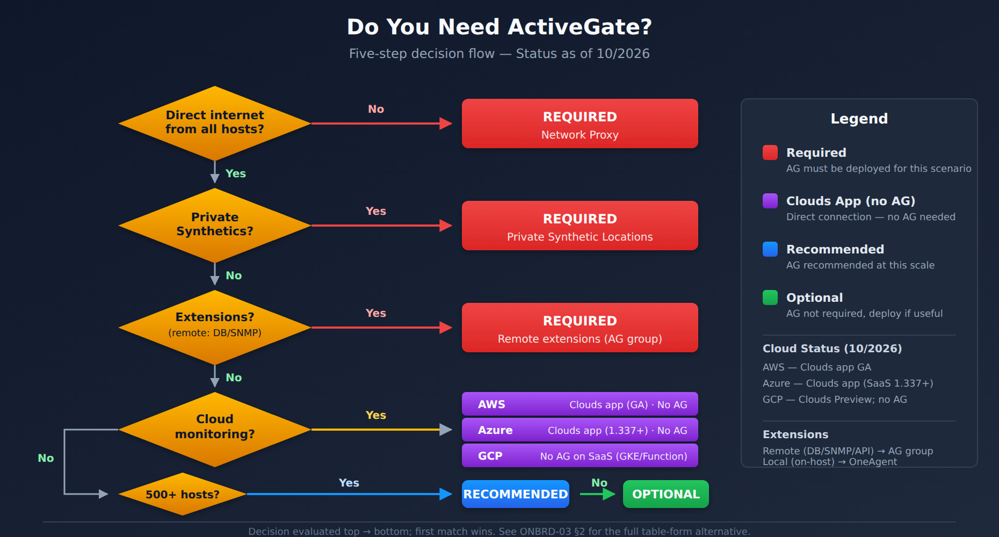
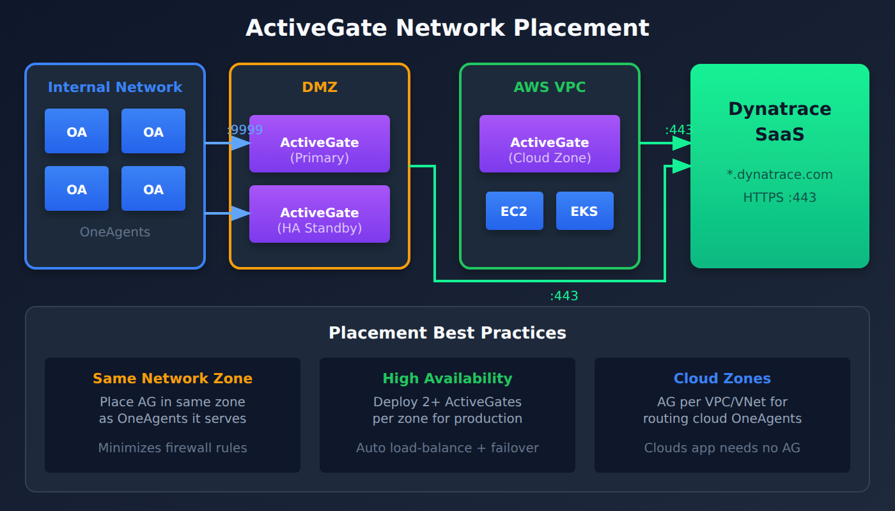

# ONBRD-03: Deploying ActiveGate

> **Series:** ONBRD — Dynatrace Onboarding | **Notebook:** 3 of 10 | **Created:** December 2025 | **Last Updated:** 10/02/2026

## Your Network Gateway to Dynatrace
ActiveGate is a lightweight component that routes traffic between your infrastructure and Dynatrace. This notebook covers when you need ActiveGate, how many to deploy, where to place them, and installation steps - including comprehensive Kubernetes deployment options.

---

## Table of Contents

1. [What is ActiveGate?](#what-is-activegate)
2. [When Do You Need ActiveGate?](#when-do-you-need-activegate)
3. [How Many ActiveGates?](#how-many-activegates)
4. [Where to Deploy?](#where-to-deploy)
5. [Generating Tokens](#generating-tokens)
6. [Installation Methods](#installation-methods)
7. [Kubernetes Deployment (Detailed)](#kubernetes-deployment-detailed)
8. [Verifying Deployment](#verifying-deployment)
9. [Troubleshooting](#troubleshooting)
10. [Next Steps](#next-steps)

---

## Prerequisites

- Admin access to Dynatrace environment
- Network architecture diagram (know your zones)
- Server for ActiveGate (Linux, Windows, or Kubernetes cluster)
- Outbound HTTPS (443) to Dynatrace SaaS

<a id="what-is-activegate"></a>
## 1. What is ActiveGate?
ActiveGate is a proxy and routing component that connects your environment to Dynatrace.

| Component | Purpose |
|-----------|--------|
| **Environment ActiveGate** | Routes OneAgent traffic and runs extensions; private synthetic monitors run on a *separate* Synthetic-enabled ActiveGate |
| **Cluster ActiveGate** | Dynatrace Managed only - cluster communication |

> **Note:** This notebook covers Environment ActiveGate for Dynatrace SaaS.


<!-- MARKDOWN_TABLE_ALTERNATIVE
| Zone | Component | Connection |
|------|-----------|------------|
| DMZ | ActiveGate | → Dynatrace SaaS (443) |
| Internal | OneAgents | → ActiveGate (9999) |
| Restricted | OneAgents | → ActiveGate (9999) |
| Cloud | Extensions | → ActiveGate (9999) |
-->

### ActiveGate Capabilities

| Capability | Description |
|------------|-------------|
| **Traffic Routing** | Proxies OneAgent data to Dynatrace |
| **Extensions 2.0** | Runs Python-based extensions locally |
| **Synthetic Monitoring** | Private synthetic locations — on a dedicated Synthetic-enabled ActiveGate only (see the note below) |
| **Cloud Integrations** | Classic AWS / Azure metric polling (or use the Clouds app for direct connections); the GCP integration needs no ActiveGate on SaaS |
| **Kubernetes API** | Cluster monitoring via API |
| **Log Ingest** | Generic log ingest endpoint |

> **Synthetic ActiveGates do nothing else.** *"A clean ActiveGate installation for the purpose of synthetic monitoring disables all other ActiveGate features, including communication with OneAgents."* Plan private synthetic locations on their own ActiveGates, installed from the **Install ActiveGate** wizard in **Discovery & Coverage** with **Purpose → Synthetic**, and never count them toward routing capacity. ([Install a Synthetic-enabled ActiveGate (DT docs)](https://docs.dynatrace.com/docs/observe/digital-experience/synthetic/synthetic-app/private-locations/active-gate-for-private-locations-install))

> **OneAgent Attribute Enrichment (OneAgent 1.333+):** OneAgent can enrich all telemetry (metrics, spans, logs, events) with primary fields (`dt.security_context`, `dt.cost.costcenter`) and primary tags (`primary_tags.environment`, `primary_tags.team`) at the source. More efficient than auto-tags — feeds directly into OpenPipeline routing, bucket assignment, and Grail permissions. Configure via the installer's `--set-host-tag` at install time, or `oneagentctl --set-host-tag … --restart-service` afterwards (set parameters apply only after a OneAgent restart). See [docs](https://docs.dynatrace.com/docs/ingest-from/dynatrace-oneagent/oneagent-attribute-enrichment).

### Dynatrace Version Support Policy

| Component | Standard Support | Enterprise Support |
|-----------|-----------------|-------------------|
| **OneAgent** | 9 months | 12 months |
| **ActiveGate** | 9 months | 12 months |
| **Dynatrace Operator** | Independent release cycle — check [release notes](https://docs.dynatrace.com/docs/whats-new) |

> **Version floor (1.347 release notes).** The OneAgent 1.347 and ActiveGate 1.347 release notes (published 10/01/2026; staged rollout from 09/30/2026) list the oldest supported version as **1.329** (Standard Support) and **1.323** (Enterprise Success and Support) — the floor moves with every release, so re-read it from the current release notes rather than from this table. Separately, **SaaS 1.347** (staged tenant rollout) *rejects* connections from **OneAgent 1.241 and earlier** once it reaches your tenant — those hosts stop reporting rather than merely falling out of support. See **FAQ-04: Managing OneAgent updates on Dynatrace SaaS**. Sources: [OneAgent 1.347 (DT docs)](https://docs.dynatrace.com/docs/whats-new/oneagent/sprint-347), [ActiveGate 1.347 (DT docs)](https://docs.dynatrace.com/docs/whats-new/activegate/sprint-347), [SaaS 1.347 (DT docs)](https://docs.dynatrace.com/docs/whats-new/saas/sprint-347) — *"Starting with this release, Dynatrace rejects connections from OneAgent versions 1.241 and earlier."*

### Technology Support Levels

Dynatrace defines two support levels for third-party technologies:

| Level | Meaning (quoted) |
|-------|------------------|
| **Supported** | *"We provide support for any problems directly caused by Dynatrace."* |
| **Limited support** | *"Dynatrace provides support for a limited set of functionality for a particular technology."* |

### Third-Party Technology EOL Policy

*"Dynatrace typically supports technologies and their versions six months longer than the vendor to give you enough time to upgrade your environment."* *"End of support announcements are provided six months in advance."* Treat the six months as the usual pattern, not a guarantee — read the announcement for the technology you run.

> **Reference:** [Technology support (DT docs)](https://docs.dynatrace.com/docs/ingest-from/technology-support) | [End-of-support announcements (DT docs)](https://docs.dynatrace.com/docs/whats-new/technology/end-of-support-news) | [Support Policy](https://www.dynatrace.com/company/trust-center/support-policy/)

<a id="when-do-you-need-activegate"></a>
## 2. When Do You Need ActiveGate?
### Required Scenarios

| Scenario | Why ActiveGate is Required |
|----------|---------------------------|
| **Network-restricted hosts** | OneAgents can't reach internet directly |
| **Private synthetic monitors** | Test internal applications |
| **Remote extensions** | Extensions that poll remote sources (SNMP, databases, APIs) run from an ActiveGate group; local extensions run on OneAgent |
| **AWS / Azure classic integration** | See Clouds app status below — classic polling runs through an ActiveGate (on SaaS hosted on AWS, Dynatrace provides one for the built-in AWS services); GCP needs none on SaaS |
| **VMware monitoring** | vCenter integration |
| **Kubernetes full-stack** | Cluster API access for events, metrics |

> **Update — Clouds App (status as of 10/2026):** The **Clouds app** supports direct cloud connections **without ActiveGate** — but coverage varies per cloud:
>
> | Cloud | Clouds-app Status | AG Required? |
> |-------|-------------------|--------------|
> | **AWS** | GA — direct connection supported | No (when using Clouds app) |
> | **Azure** | Direct connection (SaaS 1.337+) — *"no need to deploy ActiveGate compute resources for metric polling"* | No (when using Clouds app) |
> | **GCP** | Clouds connection listed as **Preview** on the setup page; SaaS 1.348 (pre-release, rollout planned from 09/22/2026) announces it with *"no need to deploy ActiveGate compute resources for metric polling within your Google Cloud environment"* — verify it has reached your tenant | **No.** The classic integration (`dynatrace-gcp-monitor`, deployed on GKE or as a Cloud Function) sends straight to your environment URL on SaaS and remains the working path until the Clouds connection reaches you |
>
> ActiveGate is still required for **remote extensions**, **private synthetic locations**, and classic AWS / Azure polling where the Clouds app is not used. On SaaS, the GCP collector's *"dynatraceUrl"* is *"your environment URL"*; an ActiveGate appears there only as a Managed log-ingest option. See [Clouds app documentation](https://docs.dynatrace.com/docs/observe/infrastructure-observability/cloud-platform-monitoring), [Azure Cloud Platform Monitoring (DT docs)](https://docs.dynatrace.com/docs/ingest-from/microsoft-azure-services/azure-onboarding), [Set up Dynatrace on Google Cloud (DT docs)](https://docs.dynatrace.com/docs/ingest-from/google-cloud-platform) and the **CLOUD series** for per-provider deep dives.
>
> <sub>**Sources:** [Set up the Dynatrace GCP integration on GKE (DT docs)](https://docs.dynatrace.com/docs/ingest-from/google-cloud-platform/gcp-integrations/gcp-guide/deploy-k8) — *"For Managed deployments: You can use an existing ActiveGate for log ingestion."*, [SaaS 1.348 (DT docs)](https://docs.dynatrace.com/docs/whats-new/saas/sprint-348), [AWS CloudWatch metrics (DT docs)](https://docs.dynatrace.com/docs/ingest-from/amazon-web-services/integrate-with-aws/cloudwatch-metrics) — *"An ActiveGate capable of monitoring your AWS account for classic (built-in) supported services is already provided and available within the Dynatrace AWS account (only for SaaS environments hosted on AWS)."*, [Extensions (DT docs)](https://docs.dynatrace.com/docs/ingest-from/extensions) — *"Run extensions locally on the monitored host to collect data from local data sources with the Extension Execution Controller."*</sub>

### Optional but Recommended

| Scenario | Benefit |
|----------|--------|
| **Large deployments (500+ hosts)** | Reduces outbound connections |
| **Multiple network zones** | Centralized routing per zone |
| **Bandwidth optimization** | Compresses and batches data |
| **Security compliance** | Single egress point for audit |

### Decision Tree


<!-- MARKDOWN_TABLE_ALTERNATIVE
| Question | Yes → | No → |
|----------|-------|------|
| Can all hosts reach Dynatrace directly? | AG optional | AG required |
| Need private synthetic monitoring? | AG required | Continue |
| Using remote extensions (DB / SNMP / API)? | AG required (local extensions run on OneAgent) | Continue |
| Monitoring AWS (Clouds app GA)? | AG optional | AG required |
| Monitoring Azure (Clouds app, SaaS 1.337+)? | AG optional | AG required |
| Monitoring GCP? | No AG on SaaS — the classic collector runs on GKE or Cloud Functions; the Clouds connection (Preview) needs none | Continue |
| More than 500 hosts? | AG recommended | AG optional |
-->

<a id="how-many-activegates"></a>
## 3. How Many ActiveGates?
### Sizing Guidelines

> **FAQ-10 owns the ActiveGate sizing decision.** *FAQ-10: How do I size and scale ActiveGates?* carries the current published per-shape capacity tables, the 50% CPU / 80% memory headroom rule, the survivor-capacity HA math for a multi-node zone, and the `dt.sfm.active_gate.*` saturation signals to watch once the fleet is running. Treat the table below as an order-of-magnitude sanity check while you plan the deployment — size the actual machines against FAQ-10 and the official requirements page.

Dynatrace publishes estimated host counts per reference instance shape, with the guidance that a steady-state ActiveGate *"should not exceed 50% CPU and 80% memory"*:

| Reference shape | Architecture | vCPU | RAM | Estimated hosts routed |
|-----------------|--------------|------|-----|------------------------|
| c6i.large | x86-64 | 2 | 3.75 GiB | ~800 |
| c6i.xlarge | x86-64 | 4 | 7.5 GiB | ~1,800 |
| c6i.2xlarge | x86-64 | 8 | 15 GiB | ~2,500 |
| c7g.large | ARM64 | 2 | 3.75 GiB | ~1,300 |
| c7g.xlarge | ARM64 | 4 | 7.5 GiB | ~2,700 |
| c7g.2xlarge | ARM64 | 8 | 15 GiB | ~5,500 |

The reference points are AWS instance shapes — for on-premises VMs, map by vCPU/RAM rather than looking for the instance name. "Estimated hosts routed" assumes typical per-host data volume; hosts pushing heavy log volume through the ActiveGate consume capacity faster. Note also that ARM64 routes materially more hosts per vCPU than x86-64 at the same shape, which is worth knowing *before* you standardize on an instance family.

### Detailed Hardware Requirements

#### Minimum System Requirements (Linux)

| Component | Documented requirement |
|-----------|------------------------|
| **CPU** | 1 dual core processor (more for large environments) |
| **RAM** | 2 GB (4 GB recommended) |
| **Disk** | 4 GB for installation, configuration and logs, plus 4 GB for cached OneAgent / ActiveGate installers and container images |

> <sub>**Sources:** [Linux ActiveGate hardware and system requirements (DT docs)](https://docs.dynatrace.com/docs/ingest-from/dynatrace-activegate/installation/linux/linux-activegate-hardware-and-system-requirements) — *"2 GB RAM (4 GB recommended). 1 dual core processor."*</sub>

#### Operating System Support

The routing/monitoring ActiveGate matrix changes every few sprints, so **the official requirements pages are the authority** — re-check them before you provision, not just when something breaks: [Linux ActiveGate hardware and system requirements](https://docs.dynatrace.com/docs/ingest-from/dynatrace-activegate/installation/linux/linux-activegate-hardware-and-system-requirements) and [Windows ActiveGate hardware and system requirements](https://docs.dynatrace.com/docs/ingest-from/dynatrace-activegate/installation/windows/windows-activegate-hardware-and-system-requirements).

Currently listed for routing/monitoring ActiveGates (verified 07/30/2026, ActiveGate 1.343):

| OS | Supported Versions |
|----|-------------------|
| **Red Hat Enterprise Linux** | 8.10, 9.4, 9.6, 9.7, 9.8, 10.0, 10.1, 10.2 |
| **Oracle Linux** | 8.10, 9.7, 9.8, 10.1, 10.2 |
| **Rocky Linux** | 8.10, 9.7, 9.8, 10.1, 10.2 |
| **Ubuntu** | 16.04, 18.04, 20.04, 22.04, 24.04, 26.04 (x86-64); 20.04, 22.04, 24.04, 26.04 (ARM64 / s390) |
| **Amazon Linux** | 2, 2023 |
| **SUSE Linux Enterprise Server** | 15.7 |
| **Windows Server** | 2016, 2019, 2022, 2025 |

**Added in ActiveGate 1.343:** Oracle Linux 9.8 and 10.2, Rocky Linux 9.8 and 10.2. ActiveGate 1.343 was published 07/15/2026 with a staged fleet rollout from 07/28/2026 — the ActiveGates already running in your environment carry whatever version they last updated to, so check the version of the specific ActiveGate before assuming a newly added OS is installable on it.

> **On CentOS and Debian:** neither CentOS Linux, CentOS Stream, nor Debian appears on the current routing/monitoring ActiveGate matrix (verified 07/30/2026). Earlier revisions of this notebook combined "RHEL/CentOS" into a single row, which reads as an endorsement of CentOS that the requirements page does not make — and CentOS Linux is end-of-life upstream regardless of what Dynatrace supports. If you are planning ActiveGates on CentOS Stream or Debian, check the requirements page directly before provisioning rather than inferring support from the RHEL row.

#### Support Ending — Do Not Provision New ActiveGates on These

Dynatrace de-supports an OS version *"at least 6 months after its end of life (EOL), to give you enough time to upgrade your environment."* The announced removals below all fall inside the next six months:

| OS version | ActiveGate support ends |
|------------|------------------------|
| Red Hat Enterprise Linux 9.4 | **11/01/2026** |
| Ubuntu 16.04 | **11/01/2026** |
| Red Hat Enterprise Linux 9.7, 10.1 | **12/01/2026** |
| Oracle Linux 9.7, 10.1 | **12/01/2026** |
| Rocky Linux 9.7, 10.1 | **12/01/2026** |
| Amazon Linux 2 | **01/01/2027** |

**Existing ActiveGates on these versions keep working right up to the date** — nothing stops the moment the announcement lands. What ends is Dynatrace's commitment to fix issues and ship new ActiveGate versions for that OS. Two practical consequences for an onboarding plan:

- **Do not provision new ActiveGates on any version in this table.** Amazon Linux 2 and RHEL 9.4 were the obvious defaults a year ago and are now the wrong starting point — pick Amazon Linux 2023, RHEL 9.8/10.2, Oracle Linux 9.8/10.2, or Rocky Linux 9.8/10.2 instead. Oracle Linux and Rocky Linux 9.8 and 10.2 are themselves already announced for de-support from **06/01/2027** (ActiveGate 1.347 release notes: *"The following operating systems will no longer be supported starting 01 June 2027"*), so on those distributions plan the move to the next listed minor version.
- **Fold the OS upgrade into the next ActiveGate update window** rather than scheduling it as separate work. The update mechanics, auto-update behavior, and how to schedule those windows are covered in *FAQ-05: Managing ActiveGate updates on Dynatrace SaaS*.

> **Reference:** [End-of-support announcements (DT docs)](https://docs.dynatrace.com/docs/whats-new/technology/end-of-support-news) — the dates and the 6-month policy statement above are quoted from this page, verified 07/30/2026; the dates also match [ActiveGate 1.347 (DT docs)](https://docs.dynatrace.com/docs/whats-new/activegate/sprint-347), read 10/02/2026.

#### Disk Space per Directory (Linux defaults)

Most of the space an ActiveGate needs sits under `/var`, not under `/opt/dynatrace`:

| Directory (default) | Contents | Space |
|---------------------|----------|-------|
| `/opt/dynatrace` | ActiveGate and autoupdater executables and libraries | 600 MB |
| `/opt/dynatrace/remotepluginmodule` | Extensions executables (Environment ActiveGate) | 2 GB |
| `/var/lib/dynatrace` | Configuration | 2 MB |
| `/var/lib/dynatrace/packages` | Auto-update installer downloads | 600 MB |
| `/var/log/dynatrace` | ActiveGate and autoupdater logs | 1.2 GB |
| `/var/tmp/dynatrace/gateway` | Temporary files | 4 GB (including 3 GB for cached OneAgent installers and container images) |

> **Partitioning:** if you give ActiveGate dedicated volumes, size `/var/tmp/dynatrace`, `/var/log/dynatrace` and `/var/lib/dynatrace` per the requirements page — those are the directories that hold logs, caches and update packages. A large `/opt/dynatrace` partition alone leaves them on the root volume.
>
> <sub>**Sources:** [Linux ActiveGate hardware and system requirements (DT docs)](https://docs.dynatrace.com/docs/ingest-from/dynatrace-activegate/installation/linux/linux-activegate-hardware-and-system-requirements) — *"ActiveGate temporary files default: /var/tmp/dynatrace/gateway"*. Memory and CPU sizing beyond the minimums: FAQ-10.</sub>

### High Availability

For production environments, deploy **at least 2 ActiveGates per network zone**:

| Deployment | ActiveGates | Purpose |
|------------|-------------|--------|
| **Minimum HA** | 2 per zone | Failover capability |
| **Recommended** | 2-3 per zone | Load distribution + failover |
| **Large scale** | N+1 per zone | Capacity + redundancy |

> **Key Point:** OneAgents automatically load-balance across available ActiveGates and failover if one becomes unavailable.

### Example Deployment

| Network Zone | Hosts | ActiveGates | Shape class per AG | vCPU each | RAM each |
|--------------|-------|-------------|--------------------|-----------|----------|
| Production DMZ | 200 | 2 | c6i.large (~800 hosts) | 2 | 3.75 GiB |
| Production Internal | 800 | 2 | c6i.xlarge (~1,800 hosts) | 4 | 7.5 GiB |
| Development | 150 | 1 | c6i.large (~800 hosts) | 2 | 3.75 GiB |
| **Total** | **1,150** | **5** | | **14 vCPU** | **26.25 GiB** |

Note why Production Internal is sized at c6i.xlarge for only 800 hosts across two nodes: each node must be able to carry the **whole** zone when its partner is down, so the survivor's capacity — not the average load — sets the shape. FAQ-10 works that survivor-capacity math out properly, including for zones larger than two nodes.

<a id="where-to-deploy"></a>
## 4. Where to Deploy?
### Network Zone Strategy

Deploy ActiveGates based on network segmentation:


<!-- MARKDOWN_TABLE_ALTERNATIVE
| Zone Type | ActiveGate Location | OneAgent Connection |
|-----------|--------------------|-----------------|
| DMZ | In DMZ with internet access | Internal hosts → DMZ AG |
| Internal | Internal segment | Internal hosts → Internal AG |
| Cloud VPC | Within VPC | Cloud workloads → VPC AG |
| Air-gapped | Edge with controlled egress | Isolated hosts → Edge AG |
-->

### Placement Rules

| Rule | Description |
|------|-------------|
| **Same network zone** | AG should be in same zone as OneAgents it serves |
| **Outbound access** | AG needs HTTPS to `*.dynatrace.com` |
| **Inbound from agents** | OneAgents connect to AG on port 9999 |
| **Low latency** | Place AG close to monitored workloads |

### Cloud-Specific Guidance

| Cloud | Recommendation |
|-------|---------------|
| **AWS** | Deploy in management VPC or shared services subnet |
| **Azure** | Hub VNet with peering to spoke VNets |
| **GCP** | Shared VPC host project |
| **Kubernetes** | Deploy as StatefulSet or standalone VM outside cluster |

<a id="generating-tokens"></a>
## 5. Generating Tokens
Downloading the ActiveGate installer needs one of two token types, depending on your environment. *"Classic access tokens don't exist in latest environments"*; environments migrating to Latest Dynatrace have both, and SaaS 1.343 says *"We recommend platform tokens over classic API tokens for new integrations."*

| Environment | Token | Required scope | Request header |
|-------------|-------|----------------|----------------|
| **Latest Dynatrace** (platform tokens only) | Platform token (**My platform tokens**) or OAuth client | `fleet-management:activegates:download` | `Authorization: Bearer <token>` |
| **Classic or hybrid** (classic access tokens still exist) | Access token (**Access Tokens** app → **Generate new token**) | `InstallerDownload` (*PaaS integration - Installer download*) | `Authorization: Api-Token <token>` |

No further scopes are needed to install an ActiveGate. Scopes for the APIs you call later (extensions, synthetic locations) belong on the tokens that call them. The **Install ActiveGate** wizard in **Discovery & Coverage** can also generate an installer token for you.

### Token Naming Convention

Use descriptive names:
- `prod-activegate-dmz`
- `aws-activegate-useast1`
- `k8s-activegate-cluster1`

> <sub>**Sources:** [Deployment API - Download latest ActiveGate (DT docs)](https://docs.dynatrace.com/docs/dynatrace-api/environment-api/deployment/activegate/download-activegate-latest) — *"Platform Token / OAuth: Required scope: fleet-management:activegates:download"*, [Upgrade from access tokens classic (DT docs)](https://docs.dynatrace.com/docs/platform/upgrade/set-up-your-environment/upgrade-from-access-tokens-classic), [SaaS 1.343 (DT docs)](https://docs.dynatrace.com/docs/whats-new/saas/sprint-343).</sub>

<a id="installation-methods"></a>
## 6. Installation Methods
### Linux Installation

```bash
# Download the installer (platform token; for a classic access token use
# --header="Authorization: Api-Token {token}" instead)
wget -O Dynatrace-ActiveGate.sh \
  --header="Authorization: Bearer {platform-token}" \
  "https://{tenant-id}.live.dynatrace.com/api/v1/deployment/installer/gateway/unix/latest"

# Make executable and run
chmod +x Dynatrace-ActiveGate.sh
sudo ./Dynatrace-ActiveGate.sh
```

### Windows Installation

```powershell
# Download the installer (classic access token: "Api-Token {token}" instead of "Bearer ...")
Invoke-WebRequest -Uri "https://{tenant-id}.live.dynatrace.com/api/v1/deployment/installer/gateway/windows/latest" `
  -Headers @{ Authorization = "Bearer {platform-token}" } -OutFile Dynatrace-ActiveGate.exe

# Run the installer
.\Dynatrace-ActiveGate.exe
```

> **Deprecation note (SaaS 1.343, July 2026):** the classic ActiveGate deployment API used above (`/api/v1/deployment/installer/gateway/...`) is **deprecated** in favor of the Latest Dynatrace deployment REST API, which supports **platform tokens** with fine-grained OAuth scopes and adds a REST endpoint for public component-image URIs. Its GA/enabled-by-default status arrives with the staged SaaS 1.343 tenant rollout (from mid-July 2026) — verify availability in your tenant. The classic endpoints continue to work during the deprecation period — plan new automation against the platform API and migrate existing scripts on your next maintenance touch.

### Container Deployment

Dynatrace documents a containerized ActiveGate only *"using a StatefulSet on Kubernetes/OpenShift"* — see [ActiveGate container image (DT docs)](https://docs.dynatrace.com/docs/ingest-from/dynatrace-activegate/activegate-in-container) and section 7 below. A standalone `docker run` / Podman ActiveGate is not a documented deployment; use the Linux or Windows installer on a VM instead.

### Installation Parameters

| Parameter | Purpose | Example |
|-----------|---------|--------|
| `--set-network-zone` | Assign to network zone | `--set-network-zone=dmz` |
| `--set-group` | Group for management | `--set-group=production` |

Synthetic is not an installer flag on a routing ActiveGate: install a separate Synthetic-enabled ActiveGate from the **Install ActiveGate** wizard (**Purpose → Synthetic**) — see the note in section 1.

> <sub>**Sources:** [Deployment API - Download latest ActiveGate (DT docs)](https://docs.dynatrace.com/docs/dynatrace-api/environment-api/deployment/activegate/download-activegate-latest) — *"GET SaaS https://{your-environment-id}.live.dynatrace.com/api/v1/deployment/installer/gateway/{osType}/latest"*, [Customize ActiveGate installation on Linux (DT docs)](https://docs.dynatrace.com/docs/ingest-from/dynatrace-activegate/installation/linux/linux-customize-installation-for-activegate).</sub>

<a id="kubernetes-deployment-detailed"></a>
## 7. Kubernetes Deployment (Detailed)
Deploying ActiveGate in Kubernetes requires careful consideration of where, how, and when to use containerized ActiveGates vs. traditional VM deployments.

### When to Deploy ActiveGate in Kubernetes

| Scenario | Deploy in K8s? | Reasoning |
|----------|----------------|-----------|
| **Cluster-only monitoring** | ✅ Yes | Co-located with workloads, simplifies networking |
| **Routing for in-cluster OneAgents** | ✅ Yes | Lower latency, no external hops |
| **Extensions 2.0 for K8s resources** | ✅ Yes | Direct access to cluster APIs |
| **Multi-cluster routing** | ⚠️ Consider | May need external AG for cross-cluster |
| **Private synthetic monitoring** | ❌ Usually VM | Synthetic requires stable network, not pod restarts |
| **Routing for external hosts** | ❌ VM preferred | External hosts need stable, routable IP |
| **Air-gapped environments** | ❌ VM preferred | Often need dedicated proxy tier |

### When NOT to Deploy in Kubernetes

| Scenario | Why VM is Better |
|----------|------------------|
| **Routing for VMs/bare metal** | VMs need stable IPs, not pod IPs |
| **Private synthetic locations** | Synthetic tests sensitive to pod restarts |
| **Extensions polling external systems** | External systems may not allow K8s egress IPs |
| **Compliance requiring dedicated hosts** | Some compliance requires dedicated hardware |

### Deployment Architecture


<!-- MARKDOWN_TABLE_ALTERNATIVE
| Component | Location | Purpose |
|-----------|----------|---------|
| ActiveGate StatefulSet | dynatrace namespace | Routing, extensions |
| Headless Service | dynatrace namespace | Pod DNS discovery |
| LoadBalancer Service | dynatrace namespace | External access (optional) |
| PVC (optional) | dynatrace namespace | Persistent logs/cache |
| ConfigMap | dynatrace namespace | Custom configuration |
| Secret | dynatrace namespace | API tokens |
-->

### Kubernetes ActiveGate Sizing

Dynatrace recommends *"two sets of ActiveGates for production deployments"*: one for Kubernetes platform monitoring (including Prometheus and KSPM), one for OneAgent traffic routing and telemetry ingest. Both are sized by cluster size — pods first, nodes second:

| Cluster size | Pods | Nodes |
|--------------|------|-------|
| **Small** | <1,000 | Up to 25 |
| **Medium** | 1,000–5,000 | Up to 100 |
| **Large** | 5,000–20,000 | Up to 500 |

**Kubernetes platform monitoring ActiveGate**

| Cluster size | CPU request | CPU limit | Memory request | Memory limit |
|--------------|-------------|-----------|----------------|--------------|
| **Small** | 200m | 1000m | 6 GiB | 6 GiB |
| **Medium** | 1000m | 2000m | 10 GiB | 10 GiB |
| **Large** | 2000m | 4000m | 12 GiB | 12 GiB |

**OneAgent traffic routing ActiveGate**

| Cluster size | CPU request | CPU limit | Memory request | Memory limit | Replicas |
|--------------|-------------|-----------|----------------|--------------|----------|
| **Small** | 250m | 1000m | 2 GiB | 2 GiB | 3 |
| **Medium** | 500m | 2000m | 4 GiB | 4 GiB | 3 |
| **Large** | 1000m | 4000m | 6 GiB | 6 GiB | 6 |

Platform monitoring needs far more memory than routing — budget for it before you put both jobs on one ActiveGate. The guide's advice on limits: *"Use CPU limits only if required by policy."* Log ingest through the ActiveGate adds replicas; the guide covers that case.

> <sub>**Sources:** [Size Dynatrace ActiveGates in Kubernetes (DT docs)](https://docs.dynatrace.com/docs/ingest-from/setup-on-k8s/guides/deployment-and-configuration/resource-management/ag-resource-limits) — *"One set should cover Kubernetes platform monitoring, including any Prometheus integration and Kubernetes Security Posture Management (KSPM) functionalities."*</sub>

### Method 1: Dynatrace Operator (Recommended)

The Dynatrace Operator manages ActiveGate lifecycle automatically.

> **Important:** Use `apiVersion: dynatrace.com/v1beta6` for new DynaKubes (`v1beta5` is still served by Operator 1.11.0 but marked deprecated in its CRD; Operator 1.10.0 deprecated `v1beta4`). Operator **1.9.0** removed `v1beta3` from the CRD (*"Applying DynaKube resources using this version will fail"*) and deprecated `v1beta4`; Operator **1.10.0** (July 15, 2026) stopped serving `v1beta4`; and Operator **1.11.0** (released 10/01/2026) removes it from the CRD — *"Applying DynaKube resources that still use v1beta4 will fail."* Check `kubectl get dynakube -A -o jsonpath='{.items[*].apiVersion}'` before upgrading the Operator, and move any `v1beta4` DynaKube to `v1beta6` first. The example below uses `v1beta6` (validated against the Operator 1.11.0 CRD). v1beta6 adds OTLP exporter configuration.
>
> <sub>**Sources:** [Operator 1.9.0 release notes (DT docs)](https://docs.dynatrace.com/docs/whats-new/dynatrace-operator/dto-fix-1-9-0), [Operator 1.11.0 release notes (DT docs)](https://docs.dynatrace.com/docs/whats-new/dynatrace-operator/dto-fix-1-11-0) — *"The v1beta4 version has been removed from the DynaKube CRD."* `served` / `deprecated` per version read from the DynaKube CRD in each release's `kubernetes.yaml` ([Operator releases (Dynatrace GitHub)](https://github.com/Dynatrace/dynatrace-operator/releases)), 10/02/2026.</sub>

The example follows the sizing guide's two-set layout for Operator versions earlier than 1.11.0 (the version pinned below): one DynaKube for platform monitoring, one for routing, both sized for a small cluster.

```yaml
# dynakube-activegates.yaml - two ActiveGate sets via the Operator (small cluster)
apiVersion: dynatrace.com/v1beta6
kind: DynaKube
metadata:
  name: k8s-monitoring
  namespace: dynatrace
spec:
  apiUrl: https://{tenant-id}.live.dynatrace.com/api
  tokens: dynakube              # secret created below
  networkZone: kubernetes       # network zone for the ActiveGate (and OneAgent) pods

  activeGate:
    capabilities:
      - kubernetes-monitoring   # K8s API monitoring
    resources:
      requests:
        cpu: "200m"
        memory: "6Gi"
      limits:
        memory: "6Gi"           # add a CPU limit (1000m) only if policy requires one

    # Tolerations and node selector for dedicated monitoring nodes (optional)
    tolerations:
      - key: "dedicated"
        operator: "Equal"
        value: "dynatrace"
        effect: "NoSchedule"
    nodeSelector:
      node-type: monitoring
---
apiVersion: dynatrace.com/v1beta6
kind: DynaKube
metadata:
  name: agents
  namespace: dynatrace
spec:
  apiUrl: https://{tenant-id}.live.dynatrace.com/api
  tokens: dynakube
  networkZone: kubernetes
  # add your oneAgent: section here (see ONBRD-05)

  activeGate:
    capabilities:
      - routing                 # route OneAgent traffic
    resources:
      requests:
        cpu: "250m"
        memory: "2Gi"
      limits:
        memory: "2Gi"
    replicas: 3

    # Labels
    labels:
      app.kubernetes.io/component: activegate
```

> **Operator 1.11.0+:** the sizing guide shows a single DynaKube instead, with platform monitoring under `spec.kubernetesMonitoring` — *".spec.kubernetesMonitoring is mutually exclusive with the kubernetes-monitoring capability in .spec.activeGate"*. The `dynatrace-api` capability is left out here: the DynaKube reference marks it *"A custom certificate is required for this capability"* (`tlsSecretName`). `spec.networkZone` *"Sets a network zone for the OneAgent and ActiveGate Pods."*
>
> <sub>**Sources:** [DynaKube parameters (DT docs)](https://docs.dynatrace.com/docs/ingest-from/setup-on-k8s/reference/dynakube-parameters), [Size Dynatrace ActiveGates in Kubernetes (DT docs)](https://docs.dynatrace.com/docs/ingest-from/setup-on-k8s/guides/deployment-and-configuration/resource-management/ag-resource-limits).</sub>

**Install with Operator:**

```bash
# Create namespace
kubectl create namespace dynatrace

# Create secret with tokens. On Latest Dynatrace, the Operator docs ("Tokens and permissions")
# direct you to two PLATFORM tokens (Operator token + Data Ingest token) on a dedicated service user;
# existing classic access tokens continue to be accepted. Classic path shown here:
# apiToken = the Operator token. Create it in Access Tokens from the "Kubernetes: Dynatrace
# Operator" template: an ActiveGate DynaKube needs activeGateTokenManagement.create on top of
# InstallerDownload (see ONBRD-05 section 5) - an installer-only token is not enough.
# the separate paasToken secret field is deprecated as of Operator 1.10.0 (still accepted).
# From Operator 1.10.0 a Platform Token is also accepted in place of the classic access token.
kubectl -n dynatrace create secret generic dynakube \
  --from-literal=apiToken=<your-api-token>

# Install Dynatrace Operator from the OCI registry, pinned to the version you validated
helm upgrade dynatrace-operator oci://public.ecr.aws/dynatrace/dynatrace-operator \
  --version 1.10.2 \
  --namespace dynatrace \
  --install --atomic \
  --set installCRD=true

# Apply DynaKube configuration
kubectl apply -f dynakube-activegates.yaml
```

> **Install from the OCI registry.** The Operator 1.11.0 release notes direct Helm installs to `oci://public.ecr.aws/dynatrace/dynatrace-operator`: the legacy `dynatrace/helm-charts` repository is archived, and *"If you can't use OCI, point your Helm repository to dynatrace/dynatrace-operator instead"* (`helm repo add dynatrace https://raw.githubusercontent.com/Dynatrace/dynatrace-operator/main/config/helm/repos/stable`). `1.10.2` is the version validated across these notebooks; Operator **1.11.0** (released 10/01/2026) is the newest — validate it on a non-production cluster before moving the pin.
>
> <sub>**Sources:** [Operator 1.11.0 release notes (DT docs)](https://docs.dynatrace.com/docs/whats-new/dynatrace-operator/dto-fix-1-11-0) — *"The Helm repository located in dynatrace/helm-charts is archived and no longer receives updates."*</sub>

### Method 2: Hand-Managed StatefulSet (Documented Container Image)

The Operator (Method 1) is the only Helm-based path: the Dynatrace Helm repository publishes the `dynatrace-operator` chart, not a standalone ActiveGate chart.

If you must run ActiveGate without the Operator, follow [ActiveGate container image (DT docs)](https://docs.dynatrace.com/docs/ingest-from/dynatrace-activegate/activegate-in-container) exactly rather than adapting a generic manifest. The documented StatefulSet takes `DT_TENANT`, `DT_SERVER`, `DT_ID_SEED_NAMESPACE`, `DT_ID_SEED_K8S_CLUSTER_ID`, `DT_CAPABILITIES` and `DT_DEPLOYMENT_METADATA`, mounts an **authentication token** at `/var/lib/dynatrace/secrets/tokens`, pulls the image from a documented registry, and uses `/rest/state` (liveness) and `/rest/health` (readiness) probes. There is no `DT_API_TOKEN` variable, and none of this is needed on the Operator path.

The Service, LoadBalancer, PodDisruptionBudget and anti-affinity snippets below are generic Kubernetes — adjust their `selector` labels to match the labels on your ActiveGate pods.

### Exposing ActiveGate for External Access

If external hosts need to route through the K8s ActiveGate:

```yaml
# Option 1: LoadBalancer Service
apiVersion: v1
kind: Service
metadata:
  name: activegate-external
  namespace: dynatrace
  annotations:
    # AWS NLB
    service.beta.kubernetes.io/aws-load-balancer-type: "nlb"
    service.beta.kubernetes.io/aws-load-balancer-scheme: "internal"
spec:
  type: LoadBalancer
  selector:
    app: activegate
  ports:
    - port: 443
      targetPort: 9999
---
# Option 2: Ingress (with TLS passthrough)
apiVersion: networking.k8s.io/v1
kind: Ingress
metadata:
  name: activegate-ingress
  namespace: dynatrace
  annotations:
    nginx.ingress.kubernetes.io/ssl-passthrough: "true"
    nginx.ingress.kubernetes.io/backend-protocol: "HTTPS"
spec:
  ingressClassName: nginx
  rules:
    - host: activegate.internal.example.com
      http:
        paths:
          - path: /
            pathType: Prefix
            backend:
              service:
                name: activegate
                port:
                  number: 443
```

### Platform-Specific Configurations

#### Amazon EKS

```yaml
# EKS-specific annotations
apiVersion: v1
kind: Service
metadata:
  name: activegate
  namespace: dynatrace
  annotations:
    service.beta.kubernetes.io/aws-load-balancer-type: "nlb"
    service.beta.kubernetes.io/aws-load-balancer-internal: "true"
    service.beta.kubernetes.io/aws-load-balancer-cross-zone-load-balancing-enabled: "true"
spec:
  type: LoadBalancer
  # ...
```

#### Azure AKS

```yaml
# AKS-specific annotations
apiVersion: v1
kind: Service
metadata:
  name: activegate
  namespace: dynatrace
  annotations:
    service.beta.kubernetes.io/azure-load-balancer-internal: "true"
spec:
  type: LoadBalancer
  # ...
```

#### Google GKE

```yaml
# GKE-specific annotations  
apiVersion: v1
kind: Service
metadata:
  name: activegate
  namespace: dynatrace
  annotations:
    cloud.google.com/load-balancer-type: "Internal"
spec:
  type: LoadBalancer
  # ...
```

### High Availability in Kubernetes

| Configuration | Setting |
|---------------|---------|
| **Replicas** | Routing ActiveGate: 3 (small/medium cluster), 6 (large), per the sizing guide |
| **Pod Anti-Affinity** | Spread across nodes |
| **PodDisruptionBudget** | minAvailable: 1 |
| **Resource Requests** | Guarantee scheduling |

```yaml
# Pod Anti-Affinity for HA
spec:
  affinity:
    podAntiAffinity:
      requiredDuringSchedulingIgnoredDuringExecution:
        - labelSelector:
            matchLabels:
              app: activegate
          topologyKey: kubernetes.io/hostname
---
# PodDisruptionBudget
apiVersion: policy/v1
kind: PodDisruptionBudget
metadata:
  name: activegate-pdb
  namespace: dynatrace
spec:
  minAvailable: 1
  selector:
    matchLabels:
      app: activegate
```

<a id="verifying-deployment"></a>
## 8. Verifying Deployment
After installation, verify ActiveGate is connected and healthy. ActiveGates surface in Grail as the **`ACTIVEGATE` Smartscape node**, so the queries below work directly in a notebook — no REST call needed.

> **A note on the classic path (ActiveGate 1.343, July 2026):** ActiveGate 1.343 deprecates the classic `GET /api/v2/activeGates` endpoints in favor of this Smartscape node. Separately, ActiveGates have **never** been reachable through DQL `fetch` — there is no `dt.entity.active_gate` entity type in any spelling. Worth knowing precisely how that fails: `fetch dt.entity.active_gate` does not error — it returns **zero rows**, which is indistinguishable from "this environment has no ActiveGates." Treat an empty result from a classic entity fetch as a signal to check the entity type exists at all. `smartscapeNodes "ACTIVEGATE"` is the DQL path. The classic **Entities API v2** selector (`GET /api/v2/entities?entitySelector=type("ENVIRONMENT_ACTIVE_GATE")`) is a different surface from DQL and may still respond during the deprecation period — use it if you need a REST fallback for a tenant that has not yet received 1.343, and migrate the automation on your next maintenance touch.

```dql
// ActiveGate inventory - every ActiveGate reporting to this environment,
// with its group, network zone, enabled modules, and host OS.
// Live-verified 07/30/2026. Costs nothing: Smartscape nodes scan 0 bytes of Grail.
smartscapeNodes "ACTIVEGATE"
| fields name, dt.active_gate.id, dt.active_gate.version, dt.active_gate.group.name,
         dt.network_zone.id, is_containerized, os.type, os.version, modules
| sort name asc
```

```dql
// ActiveGate version spread - find the laggards before an update window.
// More than one row means the fleet is not uniform; sort ascending puts the
// oldest version first. Cross-check the OS end-of-support table in section 3
// against the os.version values from the inventory query above.
// ids is listed because names can repeat: two ActiveGate pods in different
// clusters can share a pod name (e.g. dynakube-activegate-0).
smartscapeNodes "ACTIVEGATE"
| summarize {activegates = count(), names = collectDistinct(name), ids = collectDistinct(dt.active_gate.id)},
    by:{dt.active_gate.version}
| sort dt.active_gate.version asc
```

```dql
// ActiveGate count per group and network zone - the HA check.
// Any row showing 1 is a single point of failure for that zone; production
// zones should show 2 or more (see High Availability in section 3).
smartscapeNodes "ACTIVEGATE"
| summarize activegates = count(), by:{dt.active_gate.group.name, dt.network_zone.id}
| sort activegates desc
```

### Verification via UI

**Location:** **Fleet Management** → ActiveGates (SaaS 1.343+: *"You can now monitor and manage your ActiveGates in the new Fleet Management."*); on older tenants, **Deployment status → ActiveGates**

Check for:
- ✅ Status: Connected
- ✅ Version: Latest or recent
- ✅ Modules: Expected capabilities enabled

### Verification Commands

**Linux:**
```bash
# Check service status
sudo systemctl status dynatracegateway

# Check connectivity
curl -k https://localhost:9999/rest/health   # expect: RUNNING

# View logs
sudo tail -100 /var/log/dynatrace/gateway/gateway.log
```

**Windows:**
```powershell
# Check service status
Get-Service -Name "Dynatrace Gateway"

# Check connectivity
Invoke-WebRequest -Uri "https://localhost:9999/rest/health" -SkipCertificateCheck
```

> <sub>**Sources:** [ActiveGate default installation settings for Windows (DT docs)](https://docs.dynatrace.com/docs/ingest-from/dynatrace-activegate/installation/windows/windows-default-settings) — *"ActiveGate Dynatrace Gateway The main ActiveGate service."*, [SaaS 1.343 (DT docs)](https://docs.dynatrace.com/docs/whats-new/saas/sprint-343).</sub>

<a id="troubleshooting"></a>
## 9. Troubleshooting
### Common Issues

| Issue | Cause | Solution |
|-------|-------|----------|
| **Not appearing in UI** | Network blocked | Check firewall for 443 outbound |
| **Shows disconnected** | Service stopped | Restart dynatracegateway service |
| **OneAgents not routing** | Wrong network zone | Verify zone configuration |
| **High memory usage** | Too many agents | Add another AG or increase RAM |
| **Certificate errors** | Self-signed cert issue | Trust Dynatrace CA or use custom cert |

### Network Verification

```bash
# Test outbound to Dynatrace
curl -v https://{tenant-id}.live.dynatrace.com/rest/health   # expect: RUNNING

# Test ActiveGate is listening
netstat -tlnp | grep 9999

# Test from OneAgent host
curl -k https://{activegate-ip}:9999/rest/health
```

### Log Locations

| OS | Log Path |
|----|----------|
| **Linux** | `/var/log/dynatrace/gateway/` |
| **Windows** | `C:\ProgramData\dynatrace\gateway\log\` |

<a id="next-steps"></a>
## 10. Next Steps

With ActiveGate deployed:

1. **ONBRD-04: Cloud & SaaS Integrations** — Connect AWS / Azure (Clouds app, or classic polling through your AG) and GCP (no AG on SaaS), and assign remote extensions to an AG group
2. **ONBRD-05: Deploying OneAgent** — Now deploy agents that route through ActiveGate
3. Configure network zones if using multiple ActiveGates
4. Enable additional modules (synthetic, extensions) as needed
5. Set up monitoring for ActiveGate itself

### Where to Go Deeper

- **K8S series** (15 notebooks) — Cluster monitoring, DynaKube depth, GitOps for K8s deployments
- **CLOUD series** (9 notebooks) — Per-cloud integration deep dives (AWS, Azure, GCP)
- **AUTOM series** — Configuration automation for ActiveGate deployment at scale

### Deployment Checklist

#### Traditional (VM/Bare Metal)
- [ ] ActiveGate deployed in each required network zone
- [ ] At least 2 per zone for HA (production)
- [ ] Status shows "Connected" in Dynatrace
- [ ] Firewall rules configured (443 out, 9999 in)
- [ ] Network zones configured (if applicable)
- [ ] Sizing appropriate for expected OneAgent count

#### Kubernetes
- [ ] Dynatrace Operator installed (recommended)
- [ ] DynaKube CR applied with activeGate configuration
- [ ] Separate platform-monitoring and routing ActiveGates for production
- [ ] Replicas and resource requests/limits set per the K8s ActiveGate sizing guide
- [ ] PodDisruptionBudget created
- [ ] Pod anti-affinity configured for spread across nodes
- [ ] Service type appropriate (ClusterIP vs LoadBalancer)

---

## Summary

In this notebook, you learned:

- What ActiveGate does and its capabilities
- When ActiveGate is required vs. optional
- Hardware requirements, the published per-shape capacity figures, and why FAQ-10 owns the sizing decision
- Which operating systems are currently supported, and which ones lose support inside the next six months
- Where to place ActiveGates in your network
- Installation methods for Linux and Windows, and why a containerized ActiveGate means a Kubernetes/OpenShift StatefulSet
- **Kubernetes deployment** using the Operator, or the documented hand-managed StatefulSet
- Platform-specific configurations for EKS, AKS, and GKE
- How to verify successful deployment with `smartscapeNodes "ACTIVEGATE"` inventory, version, and HA queries

---

## References

### General
- [ActiveGate Overview](https://docs.dynatrace.com/docs/ingest-from/dynatrace-activegate)
- [ActiveGate Installation](https://docs.dynatrace.com/docs/ingest-from/dynatrace-activegate/installation)
- [Network Zones](https://docs.dynatrace.com/docs/manage/network-zones)
- [Linux ActiveGate hardware and system requirements](https://docs.dynatrace.com/docs/ingest-from/dynatrace-activegate/installation/linux/linux-activegate-hardware-and-system-requirements)
- [Windows ActiveGate hardware and system requirements](https://docs.dynatrace.com/docs/ingest-from/dynatrace-activegate/installation/windows/windows-activegate-hardware-and-system-requirements)
- [End-of-support announcements](https://docs.dynatrace.com/docs/whats-new/technology/end-of-support-news)
- [Private Synthetic Locations](https://docs.dynatrace.com/docs/observe/digital-experience/synthetic-monitoring/private-synthetic-locations)
- [Clouds App](https://docs.dynatrace.com/docs/observe/infrastructure-observability/cloud-platform-monitoring)

### Kubernetes
- [Dynatrace Operator](https://docs.dynatrace.com/docs/ingest-from/setup-on-k8s/deployment)
- [Dynatrace Operator GitHub](https://github.com/Dynatrace/dynatrace-operator)
- [DynaKube parameters — ActiveGate configuration (DT docs)](https://docs.dynatrace.com/docs/ingest-from/setup-on-k8s/reference/dynakube-parameters)
- [DynaKube parameters (DT docs)](https://docs.dynatrace.com/docs/ingest-from/setup-on-k8s/reference/dynakube-parameters)
- [ActiveGate container image (DT docs)](https://docs.dynatrace.com/docs/ingest-from/dynatrace-activegate/activegate-in-container)
- [Tokens and permissions (DT docs)](https://docs.dynatrace.com/docs/ingest-from/setup-on-k8s/deployment/tokens-permissions)
- [Size Dynatrace ActiveGates in Kubernetes (DT docs)](https://docs.dynatrace.com/docs/ingest-from/setup-on-k8s/guides/deployment-and-configuration/resource-management/ag-resource-limits)
- [Helm Chart Repository](https://github.com/Dynatrace/dynatrace-operator/tree/main/config/helm)

---

<sub>*This notebook was AI-generated from community-submitted and publicly available sources. This notebook series is not officially supported by Dynatrace. Always verify information against official Dynatrace documentation.*</sub>
