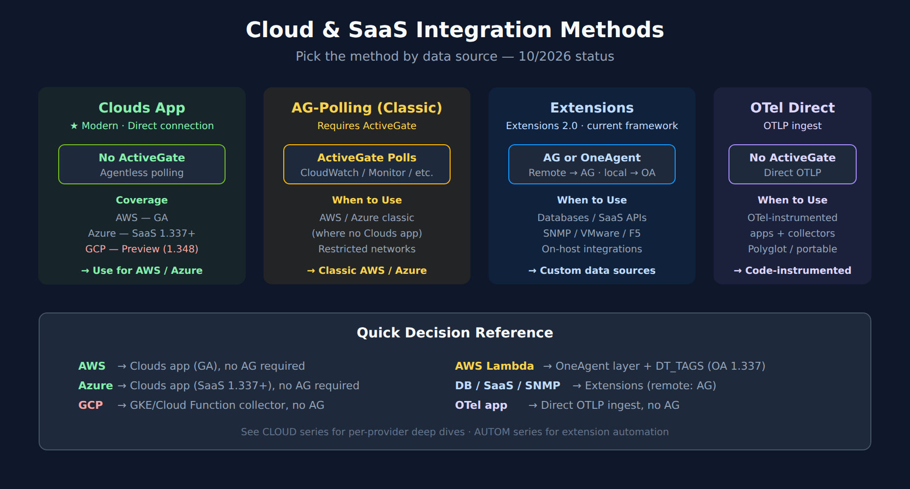
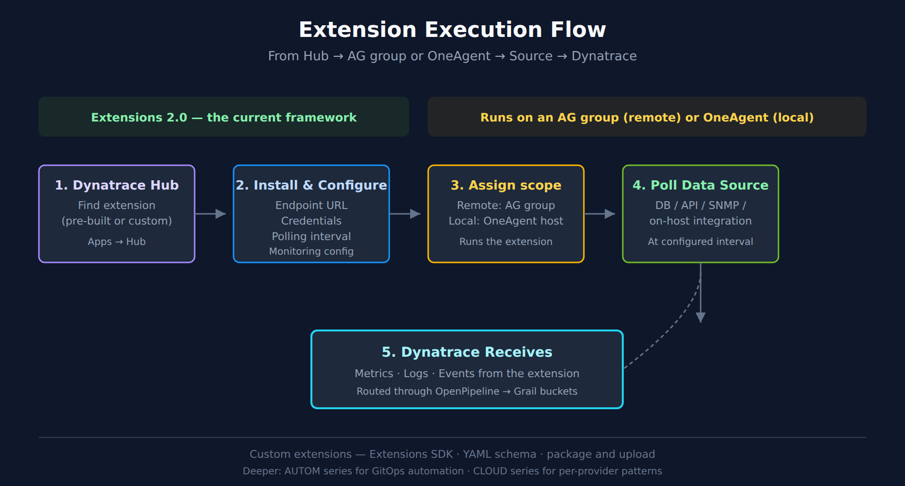

# ONBRD-04: Cloud & SaaS Integrations

> **Series:** ONBRD — Dynatrace Onboarding | **Notebook:** 4 of 10 | **Created:** January 2026 | **Last Updated:** 10/02/2026

## Extending Visibility Beyond OneAgent
While OneAgent provides deep application and infrastructure monitoring, many organizations need visibility into cloud services and SaaS platforms that can't run an agent. This notebook covers how to integrate AWS, Azure, GCP, and third-party SaaS tools into Dynatrace.

---

## Table of Contents

1. [Integration Overview](#integration-overview)
2. [AWS Integration](#aws-integration)
3. [Azure Integration](#azure-integration)
4. [GCP Integration](#gcp-integration)
5. [Extensions Framework](#extensions-20-framework)
6. [Dynatrace Hub](#dynatrace-hub)
7. [Common SaaS Integrations](#common-saas-integrations)
8. [Verifying Integrations](#verifying-integrations)
9. [Next Steps](#next-steps)

---

## Prerequisites

- Dynatrace environment with admin access
- **ActiveGate** deployed where required — remote extensions and classic AWS / Azure polling run through an AG; AWS (Clouds app GA) and Azure (Clouds app, SaaS 1.337+) connections and the GCP integration on SaaS need none
- Cloud provider admin access (for AWS/Azure/GCP)
- API credentials for SaaS platforms

<a id="integration-overview"></a>
## 1. Integration Overview

Dynatrace offers multiple integration methods depending on the data source:


<!-- MARKDOWN_TABLE_ALTERNATIVE
| Method | When to Use | Requires AG? |
|--------|-------------|--------------|
| Clouds App | AWS (GA) / Azure (SaaS 1.337+) — direct connection; GCP in Preview (SaaS 1.348) | No |
| AG-Polling (Classic) | AWS/Azure without Clouds app; restricted networks | Yes |
| Extensions 2.0 | Custom data sources, SaaS APIs, SNMP, on-host integrations | Remote: AG group; local: OneAgent |
| OTel Direct | OTel-instrumented apps and collectors | No (OTLP) |
For environments where SVG doesn't render
-->

| Method | Use Case | Requires ActiveGate? |
|--------|----------|---------------------|
| **Clouds App (recommended where supported)** | AWS (GA), Azure (SaaS 1.337+); GCP listed as **Preview** and announced in SaaS 1.348 (pre-release, staged rollout) — verify it has reached your tenant | No (direct connection) |
| **Cloud Integrations (Classic)** | AWS / Azure where the Clouds app is not used (ActiveGate polling); GCP through the `dynatrace-gcp-monitor` collector on GKE or Cloud Functions | AWS / Azure: Yes — on SaaS hosted on AWS, Dynatrace provides one for the built-in AWS services · GCP: No on SaaS |
| **Extensions 2.0** *(current framework)* | Custom data sources, SaaS APIs, on-host integrations | Remote extensions: an ActiveGate group · local (on-host) extensions: OneAgent |
| **OpenTelemetry** | OTel-instrumented apps | No (direct OTLP ingest) |
| **Log Ingest** | External log sources | Optional (AG can route) |
| **Metrics Ingest** | Custom metrics via API | No |

### Decision Rule (Quick Reference)

| Source | Default Method (10/2026) |
|--------|--------------------------|
| **AWS** | Clouds app (GA) — direct connection |
| **Azure** | Clouds app — direct connection (SaaS 1.337+); *"no need to deploy ActiveGate compute resources for metric polling"* ([Azure Cloud Platform Monitoring (DT docs)](https://docs.dynatrace.com/docs/ingest-from/microsoft-azure-services/azure-onboarding)) |
| **GCP** | Classic `dynatrace-gcp-monitor` (GKE or Cloud Function, no AG on SaaS) until the Clouds connection reaches your tenant; then evaluate it |
| **AWS Lambda** | Clouds app for CloudWatch metrics; OneAgent Lambda layer for traces and logs, with `DT_TAGS` primary fields (OneAgent 1.337+) |
| **Custom DB / SaaS / SNMP** | Extensions 2.0 — remote extensions on an AG group |
| **OTel-instrumented app** | OTLP ingest direct to Dynatrace |

### Why Integrate Before OneAgent?

| Benefit | Description |
|---------|-------------|
| **Infrastructure context** | See cloud resources before deploying agents |
| **Dependency mapping** | Understand managed services (RDS, Lambda, etc.) |
| **Complete topology** | Smartscape includes cloud services from day one |

> <sub>**Sources:** [SaaS 1.348 (DT docs)](https://docs.dynatrace.com/docs/whats-new/saas/sprint-348) — *"There’s no need to deploy ActiveGate compute resources for metric polling within your Google Cloud environment."*, [OneAgent 1.337 (DT docs)](https://docs.dynatrace.com/docs/whats-new/oneagent/sprint-337) — *"Primary fields set via DT_TAGS are now added to logs and spans in AWS Lambda deployments of OneAgent."*, [Extensions (DT docs)](https://docs.dynatrace.com/docs/ingest-from/extensions) — *"Run extensions remotely from an ActiveGate group to collect data from remote technologies and cloud environments."*</sub>

> **Where to go deeper:** the **CLOUD series** (9 notebooks) covers per-provider deep dives (AWS, Azure, GCP). The **AUTOM series** covers GitOps/Terraform automation for extension deployment at scale.

<a id="aws-integration"></a>
## 2. AWS Integration
The AWS integration pulls metrics from CloudWatch and discovers AWS resources.

**Default path — Clouds app.** Create the AWS connection in **Clouds**. *"All AWS connection creation methods are powered by CloudFormation as Infrastructure-as-Code (IaC) engine"*, so Dynatrace generates the stack that creates the access role, and the connection is *"fully managed by Dynatrace SaaS—no need to deploy ActiveGate compute resources for metric polling within your AWS environment."* See [AWS Cloud Platform Monitoring (DT docs)](https://docs.dynatrace.com/docs/ingest-from/amazon-web-services/aws-onboarding).

### Supported Services

| Category | Services |
|----------|----------|
| **Compute** | EC2, Lambda, ECS, EKS, Fargate |
| **Database** | RDS, DynamoDB, ElastiCache, DocumentDB |
| **Storage** | S3, EBS, EFS |
| **Networking** | ELB, ALB, NLB, API Gateway, CloudFront |
| **Messaging** | SQS, SNS, Kinesis, MSK |
| **Other** | Step Functions, Secrets Manager, and more |

### Classic Integration (Settings → Cloud and virtualization → AWS)

Use the classic integration only where the Clouds app is not used.

| Authentication | When |
|----------------|------|
| **IAM Role (role-based)** | All new credentials outside AWS GovCloud and China |
| **Access Key** | AWS GovCloud and China partitions only — *"Key-based authentication is allowed only for AWS GovCloud and China partitions."* |

On SaaS hosted on AWS, the classic integration needs no ActiveGate of your own for the built-in services; *"to monitor specific non-default AWS cloud services or if your AWS account exceeds 2,000 AWS resources, you must install and configure an Environment ActiveGate."*

### IAM Role Setup (classic)

1. Create an IAM role with CloudWatch read permissions
2. Add trust relationship for Dynatrace's AWS account
3. Configure in Dynatrace: Settings → Cloud and virtualization → AWS

**IAM policy:** the first seven actions below are the ones the docs list as *"Permissions required for AWS monitoring integration"*. The rest are examples of service-specific permissions — take the complete per-service list from [AWS CloudWatch metrics (DT docs)](https://docs.dynatrace.com/docs/ingest-from/amazon-web-services/integrate-with-aws/cloudwatch-metrics) rather than this sample.

```json
{
  "Version": "2012-10-17",
  "Statement": [
    {
      "Effect": "Allow",
      "Action": [
        "cloudwatch:GetMetricData",
        "cloudwatch:GetMetricStatistics",
        "cloudwatch:ListMetrics",
        "sts:GetCallerIdentity",
        "tag:GetResources",
        "tag:GetTagKeys",
        "ec2:DescribeAvailabilityZones",
        "tag:GetTagValues",
        "ec2:DescribeInstances",
        "ec2:DescribeVolumes",
        "rds:DescribeDBInstances",
        "lambda:ListFunctions",
        "lambda:GetFunction"
      ],
      "Resource": "*"
    }
  ]
}
```

### Configuration Location

**Path:** Settings → Cloud and virtualization → AWS

| Setting | Recommendation |
|---------|----------------|
| **Services to monitor** | Start with core services, expand as needed |
| **Regions** | Only regions where you have resources |
| **Resource tags** | Use tags to filter monitored resources |

> <sub>**Sources:** [AWS Cloud Platform Monitoring (DT docs)](https://docs.dynatrace.com/docs/ingest-from/amazon-web-services/aws-onboarding), [AWS CloudWatch metrics (DT docs)](https://docs.dynatrace.com/docs/ingest-from/amazon-web-services/integrate-with-aws/cloudwatch-metrics) — *"Key-based authorization is no longer available for new credentials."*; the seven required actions are listed under *"Permissions required for AWS monitoring integration"*.</sub>

<a id="azure-integration"></a>
## 3. Azure Integration
The Azure integration uses Azure Monitor to collect metrics and discover resources.

**Default path — Clouds app.** *"Onboard your Azure subscriptions and turn them into native Dynatrace Azure connections, managing them from a dedicated Clouds app"* — add the Azure connection in **Clouds**, following [Azure Cloud Platform Monitoring (DT docs)](https://docs.dynatrace.com/docs/ingest-from/microsoft-azure-services/azure-onboarding). No ActiveGate is needed for metric polling.

### Supported Services

| Category | Services |
|----------|----------|
| **Compute** | Virtual Machines, App Service, Functions, AKS |
| **Database** | SQL Database, Cosmos DB, Redis Cache |
| **Storage** | Blob, Files, Queues, Tables |
| **Networking** | Load Balancer, Application Gateway, VNet |
| **Messaging** | Service Bus, Event Hubs, Event Grid |

### Classic Integration via App Registration

Use only where the Clouds app is not used:

1. Create an App Registration in Microsoft Entra ID (formerly Azure AD)
2. Grant **Reader** role on subscriptions to monitor
3. Create a client secret
4. Configure in Dynatrace with:
   - Tenant ID
   - Client ID
   - Client Secret
   - Subscription IDs

**Configuration Location:** Settings → Cloud and virtualization → Azure

<a id="gcp-integration"></a>
## 4. GCP Integration

The GCP integration uses Cloud Monitoring (formerly Stackdriver) APIs.

> **Status note (10/2026):** Dynatrace's GCP setup page lists **GCP Cloud Platform Monitoring (Preview)**: *"Connect your Google Cloud accounts to Dynatrace and manage the newly created GCP connections entirely from Clouds."* SaaS 1.348 (pre-release; rollout planned from 09/22/2026) announces the new Clouds experience for Google Cloud: *"There’s no need to deploy ActiveGate compute resources for metric polling within your Google Cloud environment."* Verify it has reached your tenant before planning around it. Until it does, the classic integration below is the working path. Review the **CLOUD series** for per-provider detail.

### Supported Services

| Category | Services |
|----------|----------|
| **Compute** | Compute Engine, GKE, Cloud Run, Cloud Functions |
| **Database** | Cloud SQL, Cloud Spanner, Firestore, Bigtable |
| **Storage** | Cloud Storage |
| **Networking** | Load Balancing, Cloud CDN |
| **Messaging** | Pub/Sub |

### Classic Integration: `dynatrace-gcp-monitor`

The classic integration is a collector you deploy inside Google Cloud. On SaaS it sends straight to your environment, so it needs **no ActiveGate**:

1. Deploy `dynatrace-gcp-monitor` with Helm on a GKE cluster — a new GKE Autopilot cluster is the recommended option — or deploy the metric integration as a Google Cloud Function.
2. Create the custom GCP role the setup page defines for the deployment (it covers GKE, Pub/Sub and related permissions, not just a read-only monitoring role).
3. Create a Dynatrace token from the **GCP Services Monitoring** template (the setup page creates it in **Access Tokens**).
4. Set `dynatraceUrl` to your environment: *"For SaaS log/metric ingestion, it's your environment URL ( https://<your-environment-id>.live.dynatrace.com )."*

An ActiveGate appears in the classic setup only as a Managed option: *"For Managed deployments: You can use an existing ActiveGate for log ingestion."*

> <sub>**Sources:** [Set up Dynatrace on Google Cloud (DT docs)](https://docs.dynatrace.com/docs/ingest-from/google-cloud-platform), [SaaS 1.348 (DT docs)](https://docs.dynatrace.com/docs/whats-new/saas/sprint-348), [Google Cloud monitoring guide (DT docs)](https://docs.dynatrace.com/docs/ingest-from/google-cloud-platform/gcp-integrations/gcp-guide), [Set up the Dynatrace GCP integration on GKE (DT docs)](https://docs.dynatrace.com/docs/ingest-from/google-cloud-platform/gcp-integrations/gcp-guide/deploy-k8) — *"Under Template , select GCP Services Monitoring ."*</sub>

<a id="extensions-20-framework"></a>
## 5. Extensions Framework

Extensions are Dynatrace's framework for integrating any data source — databases, SaaS platforms, network devices, on-host integrations, and more.

> **Recommendation for new customers:** build on **Extensions 2.0** — the current extensions framework. Extensions Framework 1.0 reached end of support on 2025-03-31 (Python EF1.0: 2024-10-31); JMX and PMI EF1.0 are deprecated (SaaS 1.347 adds an in-product banner) and reach end of support on SaaS on **07/01/2027** — *"As of July 1, 2027, all Extension Framework 1.0 JMX and PMI extensions will be out of support for SaaS Environments."* Migrate them to the Extensions 2.0 JMX / PMI extensions ([EF1 JMX and PMI extensions end of support (DT docs)](https://docs.dynatrace.com/docs/ingest-from/extensions/end-of-support/jmx-pmi-ef1-deprecation)). Recent Dynatrace doc pages say simply "Extensions" and mean Extensions 2.0.


<!-- MARKDOWN_TABLE_ALTERNATIVE
| Step | Component | Action |
|------|-----------|--------|
| 1 | Dynatrace Hub | Find extension (pre-built or custom) |
| 2 | Monitoring Config | Set endpoint, credentials, polling interval |
| 3 | ActiveGate group or OneAgent | Remote extension: assigned AG group runs it · local extension: OneAgent runs it on the host |
| 4 | Data Source | Extension polls DB / API / SNMP (remote) or a local source at the configured interval |
| 5 | Dynatrace | Metrics / logs / events arrive via OpenPipeline → Grail |
For environments where SVG doesn't render
-->

### How Extensions Work

| Component | Role |
|-----------|------|
| **Extension Package** | Code + metadata defining what to collect |
| **ActiveGate group / OneAgent** | Runs the extension — remotely from an ActiveGate group, or locally on the monitored host through OneAgent's Extension Execution Controller |
| **Monitoring Configuration** | Instance-specific settings (endpoints, credentials) |
| **Dynatrace** | Receives metrics, logs, events from the extension |

### Extension Categories

| Category | Examples |
|----------|----------|
| **Database** | Oracle, SQL Server, PostgreSQL, MongoDB, Redis, Cassandra, MariaDB, DB2, HANA |
| **On-host integrations** | NGINX, HAProxy, Kafka, RabbitMQ, Elasticsearch, Memcached, Couchbase, Consul, Apache, etcd, Varnish, Zookeeper |
| **Infrastructure** | VMware, SNMP devices, F5, NetApp |
| **SaaS** | Salesforce, ServiceNow, Jira, Confluent |
| **Custom** | Any REST API, custom protocols |

### Installing an Extension

1. **Find the extension** in Dynatrace Hub
2. **Install** to your environment
3. **Configure** with endpoint and credentials
4. **Assign** it — a remote extension to an ActiveGate group, a local extension to the hosts it should run on
5. **Verify** data is flowing

### Monitoring Configuration

Each extension defines its own monitoring-configuration schema — the endpoint, credential and interval fields differ per extension — so there is no generic YAML to copy. Configure it from the extension's page in Hub, or through the Extensions 2.0 API: `POST /api/v2/extensions/{extensionName}/monitoringConfigurations` with a body of the documented shape, where `value` follows that extension's schema:

```json
[
  {
    "scope": "HOST-D3A3C5A146830A79",
    "value": { }
  }
]
```

`scope` sets where the configuration runs (the example above is a host, as in the API reference); remote extensions run from the ActiveGate group you select. The API needs `extensions:configurations:write` (platform token) or `extensionConfigurations.write` (classic access token).

> <sub>**Sources:** [Extensions (DT docs)](https://docs.dynatrace.com/docs/ingest-from/extensions) — *"Run extensions locally on the monitored host to collect data from local data sources with the Extension Execution Controller."*, [Extensions 2.0 API - POST a monitoring configuration (DT docs)](https://docs.dynatrace.com/docs/dynatrace-api/environment-api/extensions-20/monitoring-configurations/post-monitoring-configuration) — *"Platform Token / OAuth: Required scope: extensions:configurations:write"*</sub>

### Creating Custom Extensions

For SaaS platforms without a pre-built extension, you can build a custom extension:

1. Use the Extensions 2.0 SDK
2. Define metrics schema in YAML
3. Write the polling logic
4. Package and upload to Dynatrace

**SDK Documentation:** [Extensions Development](https://docs.dynatrace.com/docs/ingest-from/extensions)

<a id="dynatrace-hub"></a>
## 6. Dynatrace Hub
The Dynatrace Hub is your marketplace for extensions, integrations, and apps.

### Accessing the Hub

**Path:** Apps → Dynatrace Hub

Or use quick search: **Cmd+K** → "Hub"

### Hub Categories

| Category | Examples |
|----------|----------|
| **Cloud** | AWS, Azure, GCP, Kubernetes |
| **Database** | Oracle, SQL Server, PostgreSQL |
| **Infrastructure** | VMware, SNMP, NetApp |
| **Messaging** | Kafka, RabbitMQ, IBM MQ |
| **Observability** | OpenTelemetry, Prometheus |
| **Security** | Snyk, SonarQube |
| **ITSM** | ServiceNow, Jira, PagerDuty |

### Installing from Hub

1. Search for the integration you need
2. Click **Install** or **Add to environment**
3. Follow the configuration wizard
4. Verify data appears in Dynatrace

<a id="common-saas-integrations"></a>
## 7. Common SaaS Integrations
The methods below are typical starting points; Hub listings change, so confirm each platform's current listing in Hub before you plan.

### Messaging Platforms

| Platform | Integration Method | Key Metrics |
|----------|-------------------|-------------|
| **Confluent Cloud** | Extensions 2.0 | Consumer lag, throughput, partitions |
| **Amazon MSK** | AWS Integration | Broker metrics, topic metrics |
| **RabbitMQ** | Extensions 2.0 | Queue depth, message rates |

### CRM & Business Apps

| Platform | Integration Method | Key Metrics |
|----------|-------------------|-------------|
| **Salesforce** | Extensions 2.0 / API | API calls, response times, limits |
| **ServiceNow** | Extensions 2.0 | Incident metrics, workflow times |

### DevOps Tools

| Platform | Integration Method | Key Metrics |
|----------|-------------------|-------------|
| **GitHub** | Webhooks | Deployment events, commit info |
| **GitLab** | Webhooks | Pipeline events, deployments |
| **ArgoCD** | Extensions 2.0 | Sync status, app health |

### Database-as-a-Service

| Platform | Integration Method | Key Metrics |
|----------|-------------------|-------------|
| **MongoDB Atlas** | Extensions 2.0 | Connections, ops/sec, replication lag |
| **AWS DocumentDB** | AWS Integration | CloudWatch metrics |
| **Snowflake** | Snowflake integration in the Data Observability app (guided setup wizard); the Snowflake extension is deprecated | Query performance, warehouse usage |

> **The Snowflake extension is deprecated.** Its documentation page says: *"The Snowflake extension is deprecated and has been replaced with the new Snowflake integration."* The replacement is the Data Observability app, which *"connects your Snowflake account with Dynatrace through a guided setup wizard."* Start new Snowflake monitoring there. Keep existing extension-based Snowflake configurations running until the integration is in place rather than tearing them down first. (A separate DSOA installation wizard in Business Observability arrived with SaaS 1.345.)
>
> <sub>**Sources:** [Snowflake extension (DT docs)](https://docs.dynatrace.com/docs/observe/infrastructure-observability/databases/extensions/snowflake), [Data Observability app (DT docs)](https://docs.dynatrace.com/docs/observe/data-observability/data-observability-app), [SaaS 1.345 (DT docs)](https://docs.dynatrace.com/docs/whats-new/saas/sprint-345) — *"Introduced a Dynatrace Snowflake Observability Agent (DSOA) installation wizard that streamlines the setup process within Business Observability."*</sub>
>
> **Do not confuse this with the Snowflake *data connector*.** The connector installed from the Hub and configured under **Settings > Connections** powers Snowflake *workflow actions* (Execute Statement, Store Statement Result) — see the WFLOW series for that path. It is a different surface, serves a different purpose, and is unaffected by this change.

<a id="verifying-integrations"></a>
## 8. Verifying Integrations
After configuring integrations, verify data is flowing into Dynatrace.

```dql
// Check for AWS Lambda functions (modern Smartscape topology query)
smartscapeNodes "AWS_LAMBDA_FUNCTION"
| fields name, id
| limit 20

// Legacy alternative (deprecated dt.entity.* — still works on hybrid tenants):
// fetch dt.entity.aws_lambda_function
// | fields entity.name, id
// | limit 20

```

```dql
// Check for Azure VMs (modern Smartscape topology query)
// Azure node types follow AZURE_<RESOURCE_PROVIDER>_<TYPE> - "AZURE_VM" is not a node type and returns nothing.
smartscapeNodes "AZURE_MICROSOFT_COMPUTE_VIRTUALMACHINES"
| fields name, id
| limit 20

// Legacy alternative (deprecated dt.entity.* — still works on hybrid tenants):
// fetch dt.entity.azure_vm
// | fields entity.name, id
// | limit 20

```

```dql
// Check for cloud-sourced metrics
//
// The `dt.cloud.aws.*` metric namespace DOES NOT EXIST in any spelling (verified 08/12/2026).
// AWS CloudWatch metrics are published as cloud.aws.<service>.<CloudWatchName>.By.<Dimension> —
// the CloudWatch name keeps its PascalCase and the split dimension is part of the key. A
// timeseries against a missing key returns an EMPTY result rather than an error, so this cell
// silently drew nothing. Enumerate with:
//   metrics | filter startsWith(metric.key, "cloud.aws") | fields metric.key | sort metric.key asc
timeseries avgDuration = avg(cloud.aws.lambda.Duration.By.FunctionName), from:-24h, by:{FunctionName}
| fieldsAdd avg_duration_ms = arrayAvg(avgDuration)
| fields FunctionName, avg_duration_ms
| sort avg_duration_ms desc
| limit 10

// Or browse available cloud metrics in the Dynatrace Metrics browser:
// Observe & Explore → Metrics → search for "cloud" or "aws" / "azure" / "gcp"
```

```dql
// Check Extensions 2.0 status - one row per extension, status and ActiveGate group.
// dt.extension.status: OK = collecting; UNASSIGNED = the configuration is not bound to a
// running ActiveGate group or host; DATASOURCE_UNSUPPORTED = the data source on that
// host/endpoint is not supported. No dt.active_gate.group.name = a local extension
// running on OneAgent. datapoints = minutes reported in the window.
timeseries s = count(dt.sfm.extension.status), from:-24h,
    by:{dt.extension.name, dt.extension.status, dt.active_gate.group.name}
| fieldsAdd datapoints = arraySum(s)
| fields dt.extension.name, dt.extension.status, dt.active_gate.group.name, datapoints
| sort dt.extension.status asc, dt.extension.name asc
| limit 50

```

### Troubleshooting Integration Issues

| Issue | Common Cause | Solution |
|-------|--------------|----------|
| **No data appearing** | Credentials invalid | Verify IAM role/service account |
| **Partial data** | Permissions incomplete | Check required permissions list |
| **Delayed data** | Polling interval | Cloud metrics arrive on the provider's publishing and polling cadence — compare against the provider console before treating it as a fault |
| **Extension not running** | Not assigned, or AG / host issue | Run the status query above — `UNASSIGNED` means no running AG group or host is bound; then check AG logs |
| **Metrics but no entities** | Tag configuration | Ensure resources are tagged correctly |

<a id="next-steps"></a>
## 9. Next Steps

With cloud and SaaS integrations configured:

1. **ONBRD-05: Deploying OneAgent** — Add deep application monitoring
2. **ONBRD-06: Organizing Your Environment** — Tag and segment integrated resources; design `dt.security_context`
3. Explore the topology in Smartscape to see cloud services
4. Create dashboards combining cloud metrics with application data

### Where to Go Deeper

- **CLOUD series** (9 notebooks) — Per-provider integration deep dives (AWS, Azure, GCP)
- **AUTOM series** (14 notebooks) — GitOps / Terraform / Monaco automation for extension deployment
- **OPLOGS / OPMIG / OPIPE** — OpenPipeline routing for ingested cloud and SaaS data
- **OTEL series** — OpenTelemetry as the alternative ingest path

### Integration Checklist

- [ ] AWS / Azure / GCP integration configured (Clouds app for AWS/Azure; `dynatrace-gcp-monitor` for GCP — no AG on SaaS — until the Clouds connection reaches your tenant)
- [ ] Required cloud permissions granted
- [ ] ActiveGate group assigned for remote extensions
- [ ] Extensions 2.0 evaluated for custom integrations; any remaining EF1.0 extensions (JMX / PMI: end of support on SaaS 07/01/2027) identified for migration
- [ ] Key SaaS platforms identified for integration
- [ ] Extensions installed from Hub
- [ ] Data verified flowing into Dynatrace

---

## Summary

In this notebook, you learned:

- The integration method matrix (Clouds app / AG polling / Extensions / OTel / Ingest APIs)
- Per-provider status (AWS GA, Azure direct connection since SaaS 1.337, GCP Clouds connection in Preview; classic GCP needs no AG on SaaS)
- AWS, Azure, and GCP setup paths
- Extensions 2.0 as the current extensions framework
- Dynatrace Hub for discovery
- Common SaaS integration patterns
- DQL queries to verify integrations are landing in topology, and to check extension status

---

## References

- [Cloud Platforms](https://docs.dynatrace.com/docs/observe/infrastructure-observability/cloud-platform-monitoring)
- [Clouds App](https://docs.dynatrace.com/docs/observe/infrastructure-observability/cloud-platform-monitoring)
- [AWS Monitoring](https://docs.dynatrace.com/docs/observe/infrastructure-observability/cloud-platform-monitoring/aws-monitoring)
- [Azure Monitoring](https://docs.dynatrace.com/docs/observe/infrastructure-observability/cloud-platform-monitoring/azure-monitoring)
- [Azure Cloud Platform Monitoring (DT docs)](https://docs.dynatrace.com/docs/ingest-from/microsoft-azure-services/azure-onboarding) — the no-ActiveGate quote above
- [What's new in Dynatrace SaaS 1.337 (DT docs)](https://docs.dynatrace.com/docs/whats-new/saas/sprint-337)
- [Set up Dynatrace on Google Cloud (DT docs)](https://docs.dynatrace.com/docs/ingest-from/google-cloud-platform)
- [Set up the Dynatrace GCP integration on GKE (DT docs)](https://docs.dynatrace.com/docs/ingest-from/google-cloud-platform/gcp-integrations/gcp-guide/deploy-k8)
- [AWS CloudWatch metrics (DT docs)](https://docs.dynatrace.com/docs/ingest-from/amazon-web-services/integrate-with-aws/cloudwatch-metrics)
- [Extensions Framework](https://docs.dynatrace.com/docs/ingest-from/extensions)
- [Dynatrace Hub](https://docs.dynatrace.com/docs/manage/hub)

---

<sub>*This notebook was AI-generated from community-submitted and publicly available sources. This notebook series is not officially supported by Dynatrace. Always verify information against official Dynatrace documentation.*</sub>
