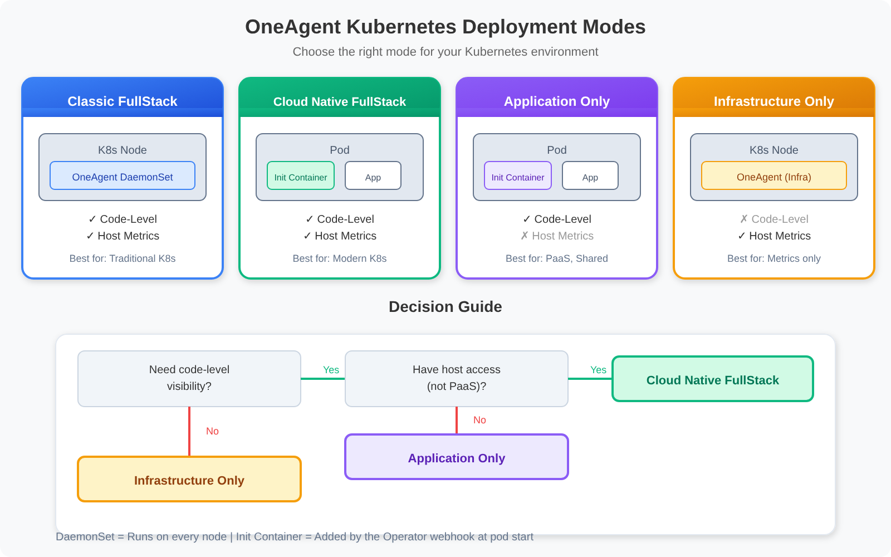

# ONBRD-05: Deploying OneAgent

> **Series:** ONBRD — Dynatrace Onboarding | **Notebook:** 5 of 10 | **Created:** December 2025 | **Last Updated:** 10/02/2026

## Getting Data Into Dynatrace
OneAgent is the foundation of Dynatrace monitoring. This notebook covers deployment strategies, installation methods, and verification steps to ensure your infrastructure is reporting data.

---

## Table of Contents

1. [What is OneAgent?](#what-is-oneagent)
2. [Deployment Strategy](#deployment-strategy)
3. [Generating a Deployment Token](#generating-a-deployment-token)
4. [Installation Methods](#installation-methods)
5. [Kubernetes Deployment](#kubernetes-deployment)
6. [Verifying Deployment](#verifying-deployment)
7. [Troubleshooting](#troubleshooting)
8. [Next Steps](#next-steps)

---

## Prerequisites

- Admin access to Dynatrace environment
- API token with `InstallerDownload` scope (created in ONBRD-02)
- Root/admin access to target hosts
- Network access from hosts to Dynatrace (port 443) or ActiveGate (ONBRD-03)
- Cloud integrations configured (ONBRD-04) for full context

<a id="what-is-oneagent"></a>
## 1. What is OneAgent?
OneAgent is Dynatrace's unified monitoring agent that:

| Capability | Description |
|------------|-------------|
| **Auto-discovery** | Automatically detects hosts, processes, services |
| **Full-stack** | Infrastructure, application, and user experience |
| **Zero configuration** | Works immediately after installation |
| **Distributed tracing** | End-to-end transaction visibility |
| **Log collection** | Collects and forwards log data |


<!-- MARKDOWN_TABLE_ALTERNATIVE
| Component | Location | Function |
|-----------|----------|----------|
| OneAgent | Host | Unified monitoring agent |
| Process Monitoring | Inside OneAgent | Monitors each running process |
| Infrastructure Monitoring | Inside OneAgent | CPU, Memory, Disk metrics |
| Log Collection | Inside OneAgent | Collects application logs |
| Dynatrace Cluster | Cloud | Analysis, storage, alerting |
-->

<a id="deployment-strategy"></a>
## 2. Deployment Strategy
### Phased Rollout (Recommended)

Don't deploy everywhere at once. Use a phased approach:


<!-- MARKDOWN_TABLE_ALTERNATIVE
| Phase | Window | Scope | Validation Focus |
|-------|--------|-------|------------------|
| 1 Pilot | Week 1–2 | 2–5 non-critical hosts | Hosts appear; Smartscape populates; primary tags emit |
| 2 Expand | Week 3–4 | One application tier or team | Service baseline; DPS pattern; alerting volume sane |
| 3 Production | Week 5+ | Full production fleet | Workflows alerting live; SLOs/Davis tuned; IAM scoping confirmed |
For environments where SVG doesn't render
-->

| Phase | Scope | Purpose |
|-------|-------|--------|
| **Pilot** | 2-5 non-critical hosts | Validate installation, network, discovery |
| **Expand** | One application tier | Test service detection, tracing |
| **Production** | Full environment | Complete coverage |

### Deployment Methods by Environment

| Environment | Recommended Method |
|-------------|-------------------|
| **Bare metal/VMs** | Direct install or package manager |
| **Kubernetes** | Dynatrace Operator |
| **OpenShift** | Dynatrace Operator |
| **AWS ECS** | Task definition sidecar |
| **Azure** | VM Extension or AKS Operator |
| **GCP** | Direct install or GKE Operator |

### Network Requirements

OneAgent needs outbound HTTPS (443) to:
- `*.apps.dynatrace.com` (SaaS)

If direct access isn't possible, OneAgents connect through **ActiveGate** (see ONBRD-03).

<a id="generating-a-deployment-token"></a>
## 3. Generating a Deployment Token
You need an API token with installer download permissions.

**Location:** the **Access Tokens** app in your environment → **Generate new token** (not Account Management)

### Required Scope

| Scope | API Name | Purpose |
|-------|----------|--------|
| **PaaS integration - Installer download** | `InstallerDownload` | Download OneAgent installer |

### Token Naming Convention

Use descriptive names:
- `prod-oneagent-deployment`
- `dev-installer-token`
- `k8s-operator-token`

> **Important:** Copy the token immediately after creation. It won't be shown again.

<a id="installation-methods"></a>
## 4. Installation Methods
### Linux (Direct Download)

```bash
# Download the installer
wget -O Dynatrace-OneAgent.sh \
  "https://{tenant-id}.apps.dynatrace.com/api/v1/deployment/installer/agent/unix/default/latest?Api-Token={token}&arch=x86&flavor=default"

# Run the installer
sudo /bin/sh Dynatrace-OneAgent.sh
```

### Linux (One-liner)

```bash
wget -O Dynatrace-OneAgent.sh "https://{tenant-id}.apps.dynatrace.com/api/v1/deployment/installer/agent/unix/default/latest?Api-Token={token}" && sudo /bin/sh Dynatrace-OneAgent.sh
```

### Windows (PowerShell)

```powershell
# Download the installer
Invoke-WebRequest -Uri "https://{tenant-id}.apps.dynatrace.com/api/v1/deployment/installer/agent/windows/default/latest?Api-Token={token}" -OutFile Dynatrace-OneAgent.exe

# Run the installer
.\Dynatrace-OneAgent.exe
```

> **OneAgent 1.337 Windows network insight (Npcap):** *"OneAgent on Windows now requires Npcap to provide network metrics generated by Network Agent. Winpcap is no longer supported."* Plan an Npcap install / redistribution into your Windows golden image when rolling out OneAgent on hosts that need network insight. Source: [What's new in OneAgent 1.337 (DT docs)](https://docs.dynatrace.com/docs/whats-new/oneagent/sprint-337).

### Setting Primary Tags at Install Time (Sprint 1.337+)

Set `dt.security_context`, environment, team, cost-center, and other primary tags at OneAgent install time using `oneagentctl --set-host-tag`. Primary tags are *"identified by the reserved primary_tags. prefix"* ([Primary Grail fields and tags enrichment through OneAgent (DT docs)](https://docs.dynatrace.com/docs/ingest-from/dynatrace-oneagent/oneagent-attribute-enrichment)), so write it out in every key. Primary tags emit at the source on every signal (metrics, spans, logs, events) and feed directly into OpenPipeline routing, bucket assignment, and IAM scoping — more efficient than view-time auto-tagging.

```bash
# Set primary tags after install (Linux)
# The primary_tags. prefix must be written explicitly - without it you set a classic host tag
sudo /opt/dynatrace/oneagent/agent/tools/oneagentctl --set-host-tag="primary_tags.environment=prod"
sudo /opt/dynatrace/oneagent/agent/tools/oneagentctl --set-host-tag="primary_tags.team=payments"
sudo /opt/dynatrace/oneagent/agent/tools/oneagentctl --set-host-tag="dt.security_context=team-payments"

# Set host group at install time (preferred — avoid renaming later)
sudo /bin/sh Dynatrace-OneAgent.sh --set-host-group=prod-app-payments
```

Decide your primary-tag and host-group taxonomy *before* the first install — retrofitting breaks history-based thresholds, IAM scoping, and any automation keyed on those values. See **FAQ-01 (host group naming strategy)** and **FAQ-02 (tagging sources, standards, strategy)** for the canonical guidance.

### Configuration Management

For Ansible, Puppet, Chef, or other tools, see:
- [Ansible Collection](https://docs.dynatrace.com/docs/ingest-from/dynatrace-oneagent/installation-and-operation/linux/installation/install-oneagent-on-linux)
- [Puppet Module](https://forge.puppet.com/modules/dynatrace/dynatrace_oneagent)
- [Chef Cookbook](https://supermarket.chef.io/cookbooks/dynatrace)

<a id="kubernetes-deployment"></a>
## 5. Kubernetes Deployment
For Kubernetes environments, use the Dynatrace Operator—the recommended approach for deploying and managing OneAgent in containerized environments.

### OneAgent Deployment Modes

The Dynatrace Operator supports multiple deployment modes. Choose based on your requirements:


<!-- MARKDOWN_TABLE_ALTERNATIVE
| Mode | Description | Use Case |
|------|-------------|----------|
| Cloud Native FullStack | Init container injection | Kubernetes-native, automatic (recommended) |
| Application Only | Init container injection, no host monitoring | PaaS, no host access |
| Host Monitoring | Host metrics only | When code-level not needed |
-->

| Mode | Deployment | Code-Level | Host Metrics | Best For |
|------|------------|------------|--------------|----------|
| **Cloud Native FullStack** | Init container; code modules via image volume (Operator 1.11.0+), CSI driver or ephemeral volume | Yes | Yes | Modern K8s (recommended) |
| **Application Only** | Init container; same code-module delivery options as Cloud Native FullStack | Yes | No | PaaS, shared nodes, OpenShift |

Both code-level modes inject the same way: the Operator's webhook mutates each new pod in a monitored namespace and adds an init container that delivers the OneAgent code modules. Nothing runs alongside the application as a sidecar. Application Only simply has no OneAgent on the node, so there are no host metrics.

> <sub>**Sources:** [Dynatrace Operator components (DT docs)](https://docs.dynatrace.com/docs/ingest-from/setup-on-k8s/how-it-works/components/dynatrace-operator) — the webhook *"Attaches Init container to download (in case no CSI driver is used) and configure the code modules on Pod startup."*</sub>
| **Host Monitoring** | DaemonSet | No | Yes | When code-level monitoring not needed |

> **Note:** Classic FullStack mode is **not recommended for new deployments**. Dynatrace recommends Cloud Native FullStack for all Kubernetes environments.

### Deployment Method: Helm vs Manifests

| Method | Pros | Cons | Best For |
|--------|------|------|----------|
| **Helm Charts** | Version management, easy upgrades, values override | Requires Helm | Production, GitOps |
| **Manifest Files** | Simple, no dependencies | Manual version tracking | Air-gapped, constrained environments |

### Prerequisites

- `kubectl` access to cluster
- API token with required scopes
- Cluster admin permissions

### Tokens for Kubernetes

On **Latest Dynatrace**, the Operator documentation now directs you to two **platform tokens** — an Operator token and a Data Ingest token — on a dedicated service user: *"For each Kubernetes cluster, Dynatrace Operator uses two platform tokens associated with a dedicated service user"* ([Platform tokens for Dynatrace Operator (DT docs)](https://docs.dynatrace.com/docs/ingest-from/setup-on-k8s/deployment/tokens-permissions/tokens-permissions)). Existing classic access tokens keep working — the Operator 1.10.0 notes say *"No immediate action is required and existing access tokens continue to be accepted."* See [Tokens and permissions (DT docs)](https://docs.dynatrace.com/docs/ingest-from/setup-on-k8s/deployment/tokens-permissions) for the platform-token scopes, and [Dynatrace Operator 1.10.0 (DT docs)](https://docs.dynatrace.com/docs/whats-new/dynatrace-operator/dto-fix-1-10-0).

#### Classic access-token scopes (Dynatrace Classic, or until you move to platform tokens)

| Scope | Purpose |
|-------|---------|
| `InstallerDownload` | Download OneAgent |
| `entities.read` | Read topology |
| `settings.read` | Read configuration |
| `settings.write` | Write configuration |
| `DataExport` | Export data (optional) |
| `activeGateTokenManagement.create` | Create ActiveGate token (API v2) |

### Installation Option 1: Helm (Recommended)

```bash
# Create namespace and secret
kubectl create namespace dynatrace
kubectl -n dynatrace create secret generic dynakube --from-literal="apiToken=<API_TOKEN>" --from-literal="dataIngestToken=<DATA_INGEST_TOKEN>"

# Install from the OCI registry, pinned to the version you validated
helm upgrade dynatrace-operator oci://public.ecr.aws/dynatrace/dynatrace-operator \
  --version 1.10.2 \
  --namespace dynatrace \
  --install --atomic \
  --set installCRD=true
```

> **Install from the OCI registry.** The Operator 1.11.0 release notes direct Helm installs to `oci://public.ecr.aws/dynatrace/dynatrace-operator`: the legacy `dynatrace/helm-charts` repository is archived, and *"If you can't use OCI, point your Helm repository to dynatrace/dynatrace-operator instead"* (`helm repo add dynatrace https://raw.githubusercontent.com/Dynatrace/dynatrace-operator/main/config/helm/repos/stable`). `1.10.2` is the version validated across these notebooks; Operator **1.11.0** (released 10/01/2026) is the newest — validate it on a non-production cluster before moving the pin.
>
> <sub>**Sources:** [Operator 1.11.0 release notes (DT docs)](https://docs.dynatrace.com/docs/whats-new/dynatrace-operator/dto-fix-1-11-0) — *"The Helm repository located in dynatrace/helm-charts is archived and no longer receives updates."*</sub>

### Installation Option 2: Manifest Files

1. **Navigate to Kubernetes monitoring**
   - Infrastructure → Kubernetes → Add cluster

2. **Follow the wizard**
   - Select your distribution
   - Choose observability options
   - Download dynakube.yaml

3. **Apply to cluster**
   ```bash
   kubectl apply -f https://github.com/Dynatrace/dynatrace-operator/releases/download/v1.10.2/kubernetes.yaml
   kubectl apply -f dynakube.yaml
   ```

   > **Pin a version you have validated.** The URL above is pinned rather than tracking a moving `latest` on purpose — a manifest install is the path you reach for precisely when you need reproducibility (air-gapped, GitOps, change-controlled clusters). `1.10.2` (published 07/30/2026) is the version validated across these notebooks. **Skip `1.10.0`:** its own release notes advise waiting for `1.10.1`, and GitHub now marks the `v1.10.0` release a prerelease — the machine-readable trace of that advice. Its [release notes (DT docs)](https://docs.dynatrace.com/docs/whats-new/dynatrace-operator/dto-fix-1-10-2) published on 07/30/2026 and carry four fixes — a Kubernetes workload/namespace **tagging-precedence regression** (from 1.10.2 only the first matching rule for a key applies, a behavior change as well as a fix), `dynatrace-webhook` `CrashLoopBackOff` on **gVisor** runtime-class nodes, injected pods hanging on the OneAgent-binary download (timeout raised to 15 minutes), and metadata-enrichment rules that could not be applied now being logged rather than silently ignored. `1.10.1` remains a working pin until you move — estates adopt on their own schedule. **Operator 1.11.0** (released 10/01/2026) is the newest release: it removes the `v1beta4` DynaKube API from the CRD (below) and adds image-volume code-module injection, and its notes set the upgrade floor at *"Minimum operator version required for direct upgrade: 1.6.0"* — validate it before moving the pin. **On OpenShift, read the 1.10.2 Known Issue before pinning either**: the `RuntimeDefault` seccomp profile applied since 1.9.0 can collide with SecurityContextConstraints — see FAQ-13. Whatever you pin, validate it in a non-production cluster before it reaches the rest of the fleet, and check the [Dynatrace Operator releases](https://github.com/Dynatrace/dynatrace-operator/releases) page for the version current when you read this.

4. **Verify deployment**
   ```bash
   kubectl get pods -n dynatrace
   ```

### DynaKube Custom Resource Configuration

The DynaKube CR is the primary configuration for the Dynatrace Operator. Here are examples for each deployment mode:

> **Important:** Use `apiVersion: dynatrace.com/v1beta6` for new DynaKubes (`v1beta5` is still served, but flagged deprecated from Operator 1.10.0). Operator **1.9.0** removed `v1beta3` from the CRD (*"Applying DynaKube resources using this version will fail"*) and deprecated `v1beta4`; Operator **1.10.0** (July 15, 2026) stopped serving `v1beta4`; and Operator **1.11.0** (released 10/01/2026) removes it from the CRD — *"Applying DynaKube resources that still use v1beta4 will fail."* Check `kubectl get dynakube -A -o jsonpath='{.items[*].apiVersion}'` before upgrading the Operator, and move any `v1beta4` DynaKube to `v1beta6` first. The examples below still use `v1beta5`, which 1.11.0 continues to serve. v1beta6 adds OTLP exporter configuration.
>
> <sub>**Sources:** [Operator 1.9.0 release notes (DT docs)](https://docs.dynatrace.com/docs/whats-new/dynatrace-operator/dto-fix-1-9-0), [Operator 1.11.0 release notes (DT docs)](https://docs.dynatrace.com/docs/whats-new/dynatrace-operator/dto-fix-1-11-0) — *"The v1beta4 version has been removed from the DynaKube CRD."* `served` / `deprecated` per version read from the DynaKube CRD in each release's `kubernetes.yaml` ([Operator releases (Dynatrace GitHub)](https://github.com/Dynatrace/dynatrace-operator/releases)), 10/02/2026.</sub>

**Cloud Native FullStack (Recommended for most K8s):**

```yaml
apiVersion: dynatrace.com/v1beta5
kind: DynaKube
metadata:
  name: dynakube
  namespace: dynatrace
spec:
  apiUrl: https://{tenant-id}.live.dynatrace.com/api

  # Cloud Native FullStack - automatic init container injection
  oneAgent:
    cloudNativeFullStack:
      tolerations:
        - effect: NoSchedule
          key: node-role.kubernetes.io/master
          operator: Exists
      args:
        - --set-host-group=my-k8s-cluster

  # ActiveGate for Kubernetes API monitoring
  activeGate:
    capabilities:
      - kubernetes-monitoring
      - routing
      - dynatrace-api
```

**Application Only (for PaaS or shared nodes):**

```yaml
apiVersion: dynatrace.com/v1beta5
kind: DynaKube
metadata:
  name: dynakube
  namespace: dynatrace
spec:
  apiUrl: https://{tenant-id}.live.dynatrace.com/api

  # Application Only - init-container injection, no host monitoring
  oneAgent:
    applicationMonitoring: {}
```

> `useCSIDriver` is not a `v1beta5` field — the DynaKube parameters reference lists it only for the retired `v1beta1`/`v1beta2` APIs. Through Operator 1.10.x, whether code modules come from the CSI driver is decided when the Operator is installed (CSI or *Without CSI driver* variant), and that remains the working path on those versions.
>
> **Operator 1.11.0+ (released 10/01/2026): image volumes.** Dynatrace now recommends image volume-based code-module injection, which *"replaces the CSI driver as the recommended approach"*: each node pulls the code-modules image once and shares it with every instrumented pod, with no CSI DaemonSet. Turn it on per DynaKube with the annotation `feature.dynatrace.com/mount-code-modules-via-image-volume: "true"` (mutually exclusive with `feature.dynatrace.com/node-image-pull`). It needs **Kubernetes 1.35+** and **containerd 2.2+ or CRI-O 1.33+**, and *"Image volume injection is not compatible with the Dynatrace built-in tenant registry."* Try it on one workload first with the pod annotation `oneagent.dynatrace.com/volume-type: "image"`; *"A full migration requires a rolling restart of all injected workloads."* Clusters that do not meet those requirements stay on the CSI driver or ephemeral volumes. K8S-12 § 2 compares the three delivery modes.
>
> <sub>**Sources:**</sub>
> - <sub>[DynaKube parameters (DT docs)](https://docs.dynatrace.com/docs/ingest-from/setup-on-k8s/reference/dynakube-parameters) — *"DynaKube API version v1beta2 is no longer available with Dynatrace Operator version 1.7.0"*</sub>
> - <sub>[Application observability setup (DT docs)](https://docs.dynatrace.com/docs/ingest-from/setup-on-k8s/deployment/application-observability) — *"CSI driver is optional (see step 2). If enabled, it gets deployed as DaemonSet and results in a CSI driver pod on each node."*</sub>
> - <sub>[Operator 1.11.0 release notes (DT docs)](https://docs.dynatrace.com/docs/whats-new/dynatrace-operator/dto-fix-1-11-0)</sub>
> - <sub>[Use image volumes for code modules injection (DT docs)](https://docs.dynatrace.com/docs/ingest-from/setup-on-k8s/guides/deployment-and-configuration/use-image-volumes) — requirements, both annotations, and the registry limit</sub>
> - <sub>[Migrate to image volumes (DT docs)](https://docs.dynatrace.com/docs/ingest-from/setup-on-k8s/guides/migration/migrate-to-image-volume)</sub>

**Host Monitoring (host metrics only):**

```yaml
apiVersion: dynatrace.com/v1beta5
kind: DynaKube
metadata:
  name: dynakube
  namespace: dynatrace
spec:
  apiUrl: https://{tenant-id}.live.dynatrace.com/api

  # Host monitoring only - no code-level visibility
  oneAgent:
    hostMonitoring: {}
```

### Air-Gapped / Private Registry Deployment

For environments without internet access, host images in a private registry:

```yaml
apiVersion: dynatrace.com/v1beta5
kind: DynaKube
metadata:
  name: dynakube
  namespace: dynatrace
spec:
  apiUrl: https://{tenant-id}.live.dynatrace.com/api

  # Custom image locations for air-gapped environments
  oneAgent:
    cloudNativeFullStack:
      image: my-registry.example.com/dynatrace/oneagent:latest

  activeGate:
    capabilities:
      - kubernetes-monitoring
    image: my-registry.example.com/dynatrace/dynatrace-activegate:latest
```

**Image Mirroring Script:**
```bash
# Mirror required images to private registry
# public.ecr.aws is the documented registry for Dynatrace component images.
# Pin the Operator to the version you validated above - not :latest.
IMAGES=(
  "public.ecr.aws/dynatrace/dynatrace-operator:v1.10.2"
  "public.ecr.aws/dynatrace/dynatrace-oneagent:latest"
  "public.ecr.aws/dynatrace/dynatrace-activegate:latest"
)

for img in "${IMAGES[@]}"; do
  docker pull $img
  docker tag $img my-registry.example.com/${img#*/}
  docker push my-registry.example.com/${img#*/}
done
```

### Kubernetes Metadata and Dynatrace Tags

Dynatrace can leverage Kubernetes labels and annotations for observability:

| Feature | Behavior | Limitations |
|---------|----------|-------------|
| **Pod labels** | Appear as `[Kubernetes]` context tags on processes | Requires OneAgent code module injection |
| **Annotations** | Available as custom metadata at Process level | Requires view RBAC permissions |
| **Namespace labels** | Available via Primary Grail tags | Does not enrich K8s metrics or events |

**Requirements:**
- Service accounts need `view` access via rolebinding/clusterrolebinding
- Labels are read via Kubernetes REST API at deployment time
- Not all entities receive automatic tags (namespaces, pods, workloads have limited support)

For more control, configure automatic tagging rules: **Settings → Automatically applied tags**

### Multi-Tenant / Namespace Isolation

For large clusters with multiple teams, use namespace selectors:

```yaml
apiVersion: dynatrace.com/v1beta5
kind: DynaKube
metadata:
  name: team-a-dynakube
  namespace: dynatrace
spec:
  apiUrl: https://team-a-tenant.live.dynatrace.com/api

  oneAgent:
    cloudNativeFullStack:
      namespaceSelector:
        matchLabels:
          dynatrace-tenant: team-a
```

This allows different teams/tenants to monitor different namespaces within the same cluster.

> <sub>**Sources:** [Dynatrace Operator 1.9.0 release notes (DT docs)](https://docs.dynatrace.com/docs/whats-new/dynatrace-operator/dto-fix-1-9-0) — the `v1beta3` CRD removal quoted above.</sub>

<a id="verifying-deployment"></a>
## 6. Verifying Deployment
After installation, verify OneAgent is reporting data.

```dql
// Check all hosts with OneAgent
fetch dt.entity.host
| fields entity.name, state
| filter state == "RUNNING"
| sort entity.name
| limit 50

// Smartscape note (dt.entity.* is deprecated but still functional): this query uses the
// classic-only field state, which has NO Smartscape node equivalent
// (Smartscape expresses liveness via node lifetime, not a state field). Keep the classic
// query above for state detail. For monitoring mode, do not use monitoringMode — it is
// empty on Kubernetes and Fargate hosts; read billing events instead (see the billing query in this section).
// Other fields do map: entity.name -> name.
```

```dql
// Check hosts by monitoring mode — read from billing, not from monitoringMode.
// monitoringMode on dt.entity.host is empty for Kubernetes and Fargate hosts, even when
// they are billed Full-Stack. A host billed for more than one capability (for example
// Full-Stack and Code Monitoring) is counted in each row, so do not add the rows up.
fetch dt.system.events, from:-24h
| filter event.kind == "BILLING_USAGE_EVENT" and isNotNull(dt.entity.host)
| summarize {hosts = countDistinctExact(dt.entity.host)}, by:{billed_as = event.type}
| sort hosts desc
```

```dql
// Check hosts by monitoring state - useful for verifying deployment
fetch dt.entity.host
| summarize host_count = count(), by: {state}
| sort host_count desc

// Smartscape note (dt.entity.* is deprecated but still functional): this query uses the
// classic-only field state, which has NO Smartscape node equivalent
// (Smartscape expresses liveness via node lifetime, not a state field). Keep the classic
// query above for state detail. For monitoring mode, do not use monitoringMode — it is
// empty on Kubernetes and Fargate hosts; read billing events instead (see the billing query in this section).
// Other fields do map: entity.name -> name.
```

```dql
// Check discovered services
fetch dt.entity.service
| fields entity.name, serviceType
| summarize service_count = count(), by: {serviceType}
| sort service_count desc

// Smartscape equivalent (dt.entity.* is deprecated but still functional):
//   smartscapeNodes "SERVICE"
//   | fields name, dt.service.sdv1_type
//   | summarize service_count = count(), by: {dt.service.sdv1_type}
//   | sort service_count desc
// Caveat: Smartscape reflects CURRENT live topology and can report fewer entities
// than the classic entity store; for a pre-migration discovery inventory keep the
// classic query above.
// Field maps: serviceType -> dt.service.sdv1_type; entity.name -> name.
```

```dql
// Check for processes discovered
fetch dt.entity.process_group
| fields entity.name
| sort entity.name
| limit 50

// Smartscape note (dt.entity.* is deprecated but still functional): Smartscape models
// individual processes, not process GROUPS — smartscapeNodes "PROCESS" is a different
// granularity (process instances), so its results are not comparable to a process-group
// query. Keep the classic dt.entity.process_group query above.
```

### Host Verification Commands

**Linux:**
```bash
# Check OneAgent status
sudo systemctl status oneagent

# Check connection to Dynatrace
sudo /opt/dynatrace/oneagent/agent/tools/oneagent-connection-check

# Check OneAgent logs
sudo tail -100 /var/log/dynatrace/oneagent/oneagent.log
```

**Windows:**
```powershell
# Check service status
Get-Service -Name "Dynatrace OneAgent"

# Check connection
& "C:\Program Files\dynatrace\oneagent\agent\tools\oneagent-connection-check.exe"
```

### What You'll See on Modern Tenants

Once OneAgent is reporting and services appear in the verification queries above, **Enhanced Endpoints for SDv1** (Dynatrace v1.329+) shapes what shows up under each service:

| Tenant creation date | Default state | What you do |
|---|---|---|
| v1.333 or later | **Always on, not configurable** | Nothing — each service automatically exposes individual endpoints with `dt.service.request.*` metrics |
| v1.330 – v1.332 | On by default (toggleable) | Verify the toggle hasn't been disabled |
| v1.329 or earlier | Off by default | Enable at *Settings → Process and contextualize → Services → Service detection v1* if you want per-endpoint metrics |

**Why it matters during onboarding:** before Enhanced Endpoints, only manually marked "key requests" emitted individual metrics — everything else collapsed into a single `NON_KEY_REQUESTS` bucket. Now every detected endpoint is named and tracked automatically, which materially changes what's visible on day one.

**Services not affected:** external services, background activity, queue listeners, key-value stores — these never get per-endpoint metrics regardless of the setting.

> <sub>**Sources:** [Enhanced endpoints for SDv1 (DT docs)](https://docs.dynatrace.com/docs/observe/application-observability/services/service-detection/service-detection-v1/enhanced-endpoints-sdv1).</sub>

<a id="troubleshooting"></a>
## 7. Troubleshooting
### Common Issues

| Issue | Cause | Solution |
|-------|-------|----------|
| **Host not appearing** | Network blocked | Check firewall rules for 443 |
| **Host showing but no data** | Agent not running | Restart OneAgent service |
| **Services not discovered** | Processes not restarted | Restart monitored applications |
| **Old OneAgent version** | Auto-update disabled | Enable auto-update or manual upgrade |
| **Host stopped reporting after a SaaS update** | OneAgent 1.241 or earlier — SaaS 1.347 (staged tenant rollout) rejects these connections once it reaches your tenant | Upgrade the agent; inventory with `fetch dt.entity.host \| fields entity.name, installerVersion \| sort installerVersion asc` — see **FAQ-04: Managing OneAgent updates on Dynatrace SaaS** |
| **Connection errors** | Proxy required | Configure ActiveGate or proxy |

### Network Verification

```bash
# Test connectivity to Dynatrace
curl -v https://{tenant-id}.apps.dynatrace.com/api/v1/time

# Check DNS resolution
nslookup {tenant-id}.apps.dynatrace.com

# Test with OpenSSL
openssl s_client -connect {tenant-id}.apps.dynatrace.com:443
```

### Process Restart Requirement

OneAgent injects into running processes. After initial installation:

- **New processes** - Automatically monitored
- **Existing processes** - Restart required for full monitoring

For deep code-level visibility, restart:
- Application servers (Tomcat, JBoss, etc.)
- Web servers (Apache, Nginx, IIS)
- .NET/Java applications
- Node.js applications

<a id="next-steps"></a>
## 8. Next Steps

With OneAgent deployed and verified:

1. **ONBRD-06: Organizing Your Environment** — Set up tags, segments, naming conventions, and `dt.security_context`
2. Wait 15-30 minutes for full topology discovery
3. Check Smartscape for service dependencies
4. Plan broader rollout based on pilot results

### Where to Go Deeper

- **K8S series** (15 notebooks) — Cluster monitoring, DynaKube depth, GitOps for K8s deployments
- **FAQ-01** — Host group naming strategy (decide before first install)
- **FAQ-02** — Tagging sources, standards, and strategy (primary tags vs auto-tags vs cloud tags)

### Deployment Checklist

- [ ] Pilot hosts deployed (2-5 hosts)
- [ ] Hosts appearing in Dynatrace
- [ ] OneAgent status "RUNNING" on all hosts
- [ ] Services being discovered
- [ ] Connection check passing
- [ ] Smartscape showing topology
- [ ] Host groups set at install time (not retrofitted later)
- [ ] Primary tags (environment, team, `dt.security_context`) emitted at source
- [ ] Windows hosts: Npcap install path planned (required from OneAgent 1.337)

---

## Summary

In this notebook, you learned:

- What OneAgent does and how it works
- Phased deployment strategy
- How to generate deployment tokens
- Installation methods for Linux, Windows, and Kubernetes
- Setting primary tags and host groups at install time (sprint-1.337+ pattern)
- Windows Npcap requirement (OneAgent 1.337)
- How to verify successful deployment
- Common troubleshooting steps

---

## References

- [OneAgent Overview](https://docs.dynatrace.com/docs/ingest-from/dynatrace-oneagent)
- [Linux Installation](https://docs.dynatrace.com/docs/ingest-from/dynatrace-oneagent/installation-and-operation/linux/installation/install-oneagent-on-linux)
- [Windows Installation](https://docs.dynatrace.com/docs/ingest-from/dynatrace-oneagent/installation-and-operation/windows/installation/install-oneagent-on-windows)
- [Kubernetes Operator](https://docs.dynatrace.com/docs/ingest-from/setup-on-k8s)
- [Deployment API](https://docs.dynatrace.com/docs/dynatrace-api/environment-api/deployment)
- [OneAgent Attribute Enrichment](https://docs.dynatrace.com/docs/ingest-from/dynatrace-oneagent/oneagent-attribute-enrichment)
- [What's new in Dynatrace SaaS 1.347 (DT docs)](https://docs.dynatrace.com/docs/whats-new/saas/sprint-347) — *"Starting with this release, Dynatrace rejects connections from OneAgent versions 1.241 and earlier."*

---

<sub>*This notebook was AI-generated from community-submitted and publicly available sources. This notebook series is not officially supported by Dynatrace. Always verify information against official Dynatrace documentation.*</sub>
