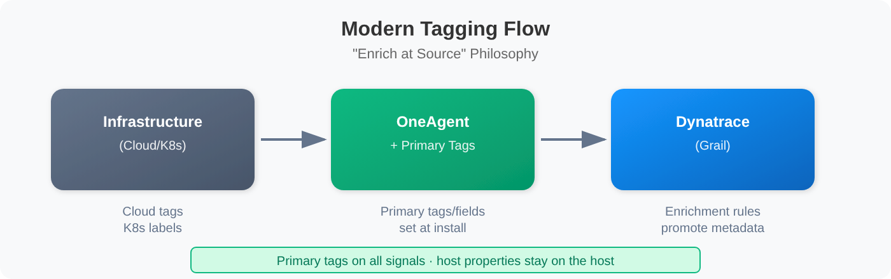

# ONBRD-06: Organizing Your Environment

> **Series:** ONBRD — Dynatrace Onboarding | **Notebook:** 6 of 10 | **Created:** December 2025 | **Last Updated:** 10/02/2026

## Tags, Segments, and Naming Conventions
As your Dynatrace environment grows, organization becomes critical. This notebook covers how to structure your environment with tags, segments, and naming conventions for maintainability and access control.

---

## Table of Contents

1. [Why Organization Matters](#why-organization-matters)
2. [Modern Organization Building Blocks](#modern-organization-building-blocks)
3. [Tagging with Host Properties and Cloud Tags](#tagging-with-host-properties-and-cloud-tags)
4. [Segments for Data Filtering](#segments-for-data-filtering)
5. [Naming Conventions](#naming-conventions)
6. [Querying by Tags and Properties](#querying-by-tags-and-properties)
7. [Next Steps](#next-steps)

---

## Prerequisites

- Admin or Configurator access to Dynatrace
- Entities discovered (hosts, services)
- Understanding of your organizational structure

### OneAgent Attribute Enrichment (OneAgent 1.333+)

> **Requires:** OneAgent version **1.333** or later

OneAgent can enrich **all telemetry signals** (metrics, spans, logs, events, entities) with custom metadata at the source — before data reaches the Dynatrace platform. This is more efficient than server-side tagging (auto-tags) because enrichment happens on the host and propagates to all Smartscape nodes.

**Primary Fields** (standardized from Semantic Dictionary):
- `dt.security_context` — data governance and access control
- `dt.cost.costcenter` — cost allocation
- `dt.cost.product` — product attribution

**Primary Tags** (custom key-value pairs):
- `primary_tags.environment` — environment identification (production, staging, etc.)
- `primary_tags.team` — team ownership
- `primary_tags.business_unit` — organizational unit

**Configuration:**

```bash
# Set during OneAgent installation
Dynatrace-OneAgent-Linux.sh --set-host-tag="primary_tags.environment=production" --set-host-tag="dt.security_context=confidential"

# Set on existing agents via oneagentctl
oneagentctl --set-host-tag="primary_tags.environment=production"
oneagentctl --set-host-tag="dt.cost.costcenter=12345"

# Per-process via environment variable (overrides host-level)
DT_TAGS="primary_tags.team=platform primary_tags.environment=production"
```

**Benefits over auto-tagging:**
| Aspect | Auto-Tags (Server-Side) | Attribute Enrichment (Agent-Side) |
|--------|------------------------|----------------------------------|
| When applied | After data arrives at platform | At the source, before transmission |
| Scope | Entity tags only | All signals: metrics, spans, logs, events, entities |
| Grail integration | Limited | Full — feeds OpenPipeline routing, bucket assignment, permissions |
| Cost allocation | Not supported | `dt.cost.costcenter`, `dt.cost.product` fields |
| Security context | Not supported | `dt.security_context` for data governance |

> **See:** [Primary Grail fields and tags enrichment through OneAgent](https://docs.dynatrace.com/docs/ingest-from/dynatrace-oneagent/oneagent-attribute-enrichment)

> **Version Support Policy:** OneAgent and ActiveGate versions are supported for **9 months (Standard)** or **12 months (Enterprise)**. Third-party technologies are supported for 6 months beyond vendor EOL. See [Support Policy](https://www.dynatrace.com/company/trust-center/support-policy/).

<a id="why-organization-matters"></a>
## 1. Why Organization Matters
Without organization, Dynatrace environments become difficult to manage:

| Problem | Impact |
|---------|--------|
| **No structure** | Can't find entities quickly |
| **No ownership** | Don't know who to contact |
| **No access control** | Everyone sees everything |
| **No filtering** | Dashboards show irrelevant data |
| **No grouping** | Can't compare similar systems |

### Modern Organization Building Blocks


<!-- MARKDOWN_TABLE_ALTERNATIVE
| Layer | Purpose |
|-------|---------|
| Policies & Permissions | Access control via IAM |
| Segments | DQL-based data filtering |
| Tags | Flexible grouping, set at source |
| Naming Conventions | Consistency, discoverability |
| Entities | Hosts, services, processes |
-->

> **Note:** The modern Dynatrace platform uses **Segments** for data filtering and **Policies** for access control. This replaces the legacy Management Zones approach.

<a id="modern-organization-building-blocks"></a>
## 2. Modern Organization Building Blocks

The modern Dynatrace platform (Gen3/Grail) uses a "tag at source" approach rather than rule-based auto-tagging:

### Tag Sources

| Source | How It Works | Best For |
|--------|--------------|----------|
| **Primary tags / primary fields** | Set at OneAgent install or with `oneagentctl --set-host-tag` (OneAgent 1.333+) | Environment, team, security context, cost allocation — on all signals |
| **Host Properties** | Set with `--set-host-property`; stay on the host node unless an ingest enrichment rule promotes them | Host-level metadata |
| **Cloud Provider Tags** | Promoted onto signals by ingest enrichment rules (OneAgent / ActiveGate 1.343+; cloud rule types rolling out) | Cloud resource organization |
| **Kubernetes Labels** | Promoted onto signals by ingest enrichment rules (Dynatrace Operator 1.10+ with `metadataEnrichment`) | Container workload organization |
| **OpenTelemetry Attributes** | Set in instrumentation | Custom service attributes |

### The "Enrich at Source" Philosophy


<!-- MARKDOWN_TABLE_ALTERNATIVE
| Stage | Description |
|-------|-------------|
| Infrastructure | Cloud tags, K8s labels |
| OneAgent | Primary tags / primary fields set at install |
| Dynatrace (Grail) | Ingest enrichment rules promote metadata to primary fields and tags |
| Result | Primary tags on all signals; host properties stay on the host |
-->

### Why "Tag at Source"?

| Benefit | Description |
|---------|-------------|
| **Consistent** | Primary tags and fields land on metrics, logs, spans, events, and entities |
| **Scalable** | No processing overhead to apply rules |
| **Traceable** | Tags come from the source of truth |
| **Real-time** | No delay waiting for rule evaluation |

<a id="tagging-with-host-properties-and-cloud-tags"></a>
## 3. Tagging with Host Properties and Cloud Tags
### Host Properties (OneAgent)

Set custom properties during OneAgent installation or via configuration:

**During Installation:**
```bash
# Linux
sudo /bin/sh Dynatrace-OneAgent.sh \
  --set-host-property=env=production \
  --set-host-property=team=platform \
  --set-host-property=tier=backend

# Windows
.\Dynatrace-OneAgent.exe --set-host-property=env=production --set-host-property=team=checkout
```

**After Installation:**

Change properties with `oneagentctl` (OneAgent 1.189+), or centrally with Remote configuration management:

```bash
./oneagentctl --set-host-property=env=production --set-host-property=team=platform
```

The `hostcustomproperties.conf` file applies only to OneAgent 1.187 and earlier.

> **Where host properties land:** a host property is metadata on the HOST node — on Smartscape it appears in the `host.custom.metadata` record — not a field on logs, spans, or metrics. To filter signals by a value, set it as a primary tag instead (`--set-host-tag="primary_tags.<key>=<value>"`, see Prerequisites above) or promote the property with a Host/Process property [ingest enrichment rule (DT docs)](https://docs.dynatrace.com/docs/manage/tags/tags-central-enrichment).

### Recommended Property Categories

| Category | Example Properties | Purpose |
|----------|-------------------|--------|
| **Environment** | `env=prod`, `env=staging`, `env=dev` | Distinguish environments |
| **Owner** | `team=platform`, `team=checkout` | Identify responsible team |
| **Application** | `app=ecommerce`, `app=mobile-api` | Group by application |
| **Cost Center** | `cost-center=marketing` | Financial allocation |
| **Tier** | `tier=frontend`, `tier=backend` | Architecture layer |

### Cloud Provider Tags

Cloud tags reach your telemetry through **ingest enrichment rules** (OneAgent / ActiveGate 1.343+). Cloud rule types are rolling out and may not yet be visible in your tenant — until a rule exists, the raw provider tags are visible on the HOST node (for example a `tags:azure` record on an Azure VM) but are not fields on logs, spans, or metrics.

| Cloud | Tag Source | Attribute Written to Telemetry by a Rule |
|-------|-----------|-----------|
| **AWS** | AWS resource tags | `aws.tags.<key>` |
| **Azure** | Azure resource tags | `azure.tags.<key>` |
| **GCP** | Google Cloud labels / tags | `gcp.labels.<key>` / `gcp.tags.<key>` |

**AWS Tag Example:**
With an AWS tag rule for the key `Environment`, an EC2 instance tagged `Environment=Production` contributes `aws.tags.Environment` to its telemetry. A rule can instead write the value straight to a primary field such as Security context or Cost center.

### Kubernetes Labels

Namespace and workload names are set on Kubernetes telemetry. Labels reach signals only through ingest enrichment rules (Dynatrace Operator 1.10+ with `metadataEnrichment` enabled in the DynaKube). Namespace-label rules are available now; workload and pod rule types are rolling out.

| K8s Metadata | DQL Field |
|--------------|-----------|
| Namespace | `k8s.namespace.name` |
| Deployment | `k8s.deployment.name` |
| Namespace labels | `k8s.namespace.label.<key>` (enrichment rule) |
| Workload labels | `k8s.workload.label.<key>` (enrichment rule) |
| Pod labels | `k8s.pod.label.<key>` (enrichment rule) |

<a id="segments-for-data-filtering"></a>
## 4. Segments for Data Filtering
Segments provide reusable filters that create focused views of your data.

**Location:** the segment selector in any app → **Manage segments**

### What are Segments?

Segments are reusable filters built from per-data-type **includes** that:
- Filter data in Notebooks, Dashboards, and Apps
- Can be applied as default context
- Are shareable across the organization

### Creating a Segment

1. Open the segment selector in any app → **Manage segments** → **Segment**
2. Name your segment (e.g., "Production Environment") and add a description
3. Add an **include**: choose a data type — or **All data types** — and a filter condition, for example:
   ```text
   primary_tags.environment = production
   ```
4. Select **Run query** to preview matching data
5. Save

> **Includes decide what a segment returns.** Querying a data type that no include references returns **empty results** while the segment is applied — use *All data types* when one condition should apply everywhere.

### Segment Use Cases

| Use Case | Include Condition | Purpose |
|----------|---------------|---------|
| **Environment** | `primary_tags.environment = production` | Focus on production |
| **Team** | `primary_tags.team = checkout` | Team-specific view |
| **Kubernetes stack** | `k8s.cluster.name = gke-klu` | Cluster-group focus |
| **Region** | `aws.region = us-east-1` | Geographic filtering |

> **Conditions need fields that exist on the data.** `primary_tags.*` matches only data enriched at source (see Prerequisites above). Host properties set with `--set-host-property` are not fields on signals, so they cannot drive a segment until an enrichment rule promotes them.

### Segments vs Legacy Management Zones

| Feature | Segments | Management Zones (Legacy) |
|---------|----------|---------------------------|
| **Filter basis** | Per-data-type include conditions | Rule-based matching |
| **Data types** | All Grail data | Entities only |
| **Flexibility** | Highly flexible | Limited rule types |
| **Access control** | Use Policies + `dt.security_context` instead | Built-in |
| **Modern platform** | ✅ Recommended | ⚠️ Dynatrace Classic concept — e.g. API 1.337 deprecated the `managementZone` property on calculated service metrics |

> **Where to go deeper:** the **ORGNZ series** (11 notebooks) covers segments, buckets, and `dt.security_context` design in depth. The **IAM series** (especially IAM-04, IAM-05, IAM-11 WORKSHOP) covers how policies use `dt.security_context` to scope access. **MZ2POL** (11 notebooks) covers Management Zone → Policy migration if you have legacy MZs to retire.

### Segment Best Practices

| Practice | Why |
|----------|-----|
| **Use primary tags / `dt.security_context`** | Consistent filtering; aligns with IAM scoping |
| **Name clearly** | `Prod-Checkout-Team` not `Segment1` |
| **Document purpose** | Add description |
| **Test filters** | Verify expected data |

<a id="naming-conventions"></a>
## 5. Naming Conventions
Consistent naming makes entities discoverable and filtering effective.

### Host Naming

Set meaningful host names that encode key information:

| Pattern | Example | Components |
|---------|---------|------------|
| `{env}-{tier}-{seq}` | `prod-web-01` | Environment, tier, sequence |
| `{region}-{app}-{role}` | `us-east-ecom-api` | Region, app, role |
| `{team}-{service}-{id}` | `checkout-cart-a1b2` | Team, service, unique ID |

### Host Naming via OneAgent

You can set a custom display name during installation:

```bash
sudo /bin/sh Dynatrace-OneAgent.sh --set-host-name="prod-web-01"
```

### Naming Principles

| Principle | Good | Bad |
|-----------|------|-----|
| **Descriptive** | `payment-service` | `svc-001` |
| **Consistent** | `prod-web-01`, `prod-web-02` | `prod-web-01`, `Web Server 2` |
| **Parseable** | `us-east-prod-checkout` | `USEastProdCheckout` |
| **Unique** | Include environment/region | Generic names |

### Property Naming Standards

For host properties, use consistent naming:

| Standard | Example | Why |
|----------|---------|-----|
| **Lowercase** | `env=prod` not `ENV=PROD` | Consistency |
| **Hyphen separated** | `cost-center=eng` | Readability |
| **Short keys** | `env` not `environment` | Query simplicity |
| **Consistent values** | Always `prod` not sometimes `production` | Filtering works |

<a id="querying-by-tags-and-properties"></a>
## 6. Querying by Tags and Properties
Use primary fields, primary tags, and host properties in DQL queries to filter and group data. The first two queries read tag data directly; the rest filter on names and built-in dimensions.

```dql
// Log volume by security context (a primary field set at source)
fetch logs, from: now() - 1h
| filter isNotNull(dt.security_context)
| summarize log_count = count(), by: {dt.security_context}
| sort log_count desc
| limit 20
// Same pattern for a primary tag set at install, e.g.:
//   | filter primary_tags.environment == "production"
```

```dql
// Host group and host properties on HOST nodes
// (host properties live in the host.custom.metadata record, not on signals)
smartscapeNodes "HOST", from:-7d
| fields name, dt.host_group.id, host.custom.metadata
| sort name
| limit 20
// Filter on one property, e.g.:  | filter host.custom.metadata[env] == "production"
```

```dql
// Find hosts by name pattern
fetch dt.entity.host
| filter contains(entity.name, "prod")
| fields entity.name
| limit 20

// Smartscape equivalent (dt.entity.* is deprecated but still functional):
//   smartscapeNodes "HOST"
//   | filter contains(name, "prod")
//   | fields name
//   | limit 20
// Caveat: Smartscape can report fewer entities than the classic entity store, and
// both return only entities seen in the query timeframe (default 2 h) - for a
// discovery inventory add a timeframe such as from:-7d to either query.
// Field maps: entity.name -> name.
```

```dql
// Count hosts by operating system type
fetch dt.entity.host
| summarize host_count = count(), by: {osType}
| sort host_count desc

// Smartscape equivalent (dt.entity.* is deprecated but still functional):
//   smartscapeNodes "HOST"
//   | summarize host_count = count(), by: {os.type}
//   | sort host_count desc
// Caveat: Smartscape can report fewer entities than the classic entity store, and
// both return only entities seen in the query timeframe (default 2 h) - for a
// discovery inventory add a timeframe such as from:-7d to either query.
// Field maps: osType -> os.type (LINUX -> OS_TYPE_LINUX).
```

```dql
// Find services by name pattern
fetch dt.entity.service
| filter contains(entity.name, "checkout")
| fields entity.name, serviceType
| limit 20

// Smartscape equivalent (dt.entity.* is deprecated but still functional):
//   smartscapeNodes "SERVICE"
//   | filter contains(name, "checkout")
//   | fields name, dt.service.sdv1_type
//   | limit 20
// Caveat: Smartscape can report fewer entities than the classic entity store, and
// both return only entities seen in the query timeframe (default 2 h) - for a
// discovery inventory add a timeframe such as from:-7d to either query.
// Field maps: serviceType -> dt.service.sdv1_type (SDv1 services only - null when
// dt.service_detection.version == 2; group by dt.service_detection.version to see
// which model applies); entity.name -> name.
```

```dql
// Log volume by Kubernetes namespace
fetch logs, from: now() - 1h
| filter isNotNull(k8s.namespace.name)
| summarize log_count = count(), by: {k8s.namespace.name}
| sort log_count desc
| limit 20
```

```dql
// Query spans by service name pattern
// dt.service.name is set on every span, whatever the ingest source
fetch spans, from: now() - 1h
| filter span.kind == "server"
| filter contains(dt.service.name, "payment")
| summarize request_count = count(), by: {dt.service.name}
| sort request_count desc
| limit 20
```

```dql
// Find hosts by name pattern for environment identification
fetch dt.entity.host
| filter not(contains(entity.name, "prod"))
      and not(contains(entity.name, "staging"))
      and not(contains(entity.name, "dev"))
| fields entity.name
| limit 20

// Smartscape equivalent (dt.entity.* is deprecated but still functional):
//   smartscapeNodes "HOST"
//   | filter not(contains(name, "prod"))
//         and not(contains(name, "staging"))
//         and not(contains(name, "dev"))
//   | fields name
//   | limit 20
// Caveat: Smartscape can report fewer entities than the classic entity store, and
// both return only entities seen in the query timeframe (default 2 h) - for a
// discovery inventory add a timeframe such as from:-7d to either query.
// Field maps: entity.name -> name.
```

<a id="next-steps"></a>
## 7. Next Steps

With organization in place:

1. **ONBRD-07: Understanding Your Data** — Explore what Dynatrace discovered
2. Define primary tags (and any host properties) for your environment
3. Create segments for team-specific views
4. Document your naming conventions
5. Decide your `dt.security_context` value space (and bind IAM policies to it)

### Where to Go Deeper

- **ORGNZ series** (11 notebooks) — Bucket strategy, segments, security context, the full data-organization model
- **FAQ-01** — Host group naming strategy
- **FAQ-02** — Tagging sources, standards, and strategy (primary tags vs cloud tags vs auto-tags)
- **IAM series** (especially IAM-04, IAM-05, IAM-11 WORKSHOP) — Policy design that consumes `dt.security_context`
- **MZ2POL series** (11 notebooks) — Management Zone → Policy migration for legacy MZ retirement

### Organization Checklist

- [ ] Host property strategy documented
- [ ] Primary tags / primary fields set at OneAgent install (`--set-host-tag="primary_tags.…"`, OneAgent 1.333+, see ONBRD-05)
- [ ] Cloud tags verified (if using cloud providers; see FAQ-02 for cloud-tag normalization)
- [ ] `dt.security_context` value space decided
- [ ] Segments created for common filters
- [ ] Naming conventions established (FAQ-01 for host groups)
- [ ] Access control configured via Policies (see ONBRD-02 + IAM series)

---

## Summary

In this notebook, you learned:

- Why organization matters for scalability
- The modern "tag at source" approach (primary fields + primary tags via OneAgent)
- Where host properties, cloud tags, and K8s labels land — and how ingest enrichment rules promote them onto signals
- How to create and use Segments built from per-data-type includes
- Naming convention best practices
- How `dt.security_context` standardizes the boundary field for Gen3 IAM
- How to query by properties and attributes

---

## References

- [Host Properties](https://docs.dynatrace.com/docs/ingest-from/dynatrace-oneagent/installation-and-operation/linux/installation/customize-oneagent-installation-on-linux)
- [Segments](https://docs.dynatrace.com/docs/manage/segments)
- [Cloud platform monitoring (DT docs)](https://docs.dynatrace.com/docs/observe/infrastructure-observability/cloud-platform-monitoring)
- [Kubernetes Labels](https://docs.dynatrace.com/docs/ingest-from/setup-on-k8s)
- [DQL Reference](https://docs.dynatrace.com/docs/platform/grail/dynatrace-query-language)
- [OneAgent Attribute Enrichment](https://docs.dynatrace.com/docs/ingest-from/dynatrace-oneagent/oneagent-attribute-enrichment)
- [Configure ingest enrichment rules (DT docs)](https://docs.dynatrace.com/docs/manage/tags/tags-central-enrichment) — *"Cloud rule types are rolling out and may not yet be visible in your environment."*
- [Define tags and metadata for hosts (DT docs)](https://docs.dynatrace.com/docs/observe/infrastructure-observability/hosts/configuration/define-tags-and-metadata-for-hosts)
- [OneAgent configuration via command-line interface (DT docs)](https://docs.dynatrace.com/docs/ingest-from/dynatrace-oneagent/oneagent-configuration-via-command-line-interface) — *"For versions earlier than 1.189, use a host metadata configuration file."*
- [Include data in segments (DT docs)](https://docs.dynatrace.com/docs/manage/segments/concepts/segments-concepts-includes) — *"Querying for data not explicitly referenced by any include of the selected segment, will lead to empty results."*
- [Segments for Kubernetes clusters (DT docs)](https://docs.dynatrace.com/docs/manage/segments/use-cases/segments-use-cases-kubernetes-clusters)
- [Dynatrace API 1.337 (DT docs)](https://docs.dynatrace.com/docs/whats-new/dynatrace-api/sprint-337)

---

<sub>*This notebook was AI-generated from community-submitted and publicly available sources. This notebook series is not officially supported by Dynatrace. Always verify information against official Dynatrace documentation.*</sub>
