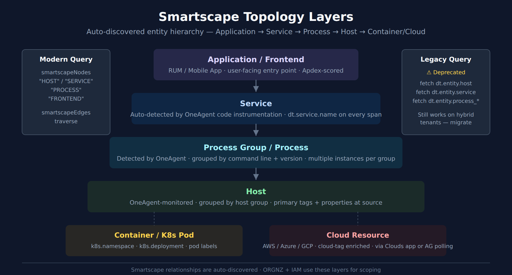

# ONBRD-07: Understanding Your Data

> **Series:** ONBRD — Dynatrace Onboarding | **Notebook:** 7 of 10 | **Created:** December 2025 | **Last Updated:** 10/02/2026

## Exploring What Dynatrace Discovered
With OneAgent deployed, Dynatrace has automatically discovered your infrastructure, processes, and services. This notebook helps you understand what's been found and how to explore your data.

---

## Table of Contents

1. [The Dynatrace Data Model](#the-dynatrace-data-model)
2. [Entities and Relationships](#entities-and-relationships)
3. [Exploring Topology](#exploring-topology)
4. [Data Types in Grail](#data-types-in-grail)
5. [Discovery Queries](#discovery-queries)
6. [Next Steps](#next-steps)

---

## Prerequisites

- OneAgent deployed on at least one host (ONBRD-05)
- Environment organized with tags (ONBRD-06)
- 15-30 minutes elapsed since deployment for full discovery
- DQL query permissions

<a id="the-dynatrace-data-model"></a>
## 1. The Dynatrace Data Model
Dynatrace organizes data into a unified model:


<!-- MARKDOWN_TABLE_ALTERNATIVE
| Data Type | Description | Example |
|-----------|-------------|---------|
| Entities | Monitored components | Host, Service, Process |
| Metrics | Numeric measurements | CPU usage, response time |
| Logs | Textual event records | Application log entry |
| Spans | Trace operations | HTTP request, DB query |
| Events | Point-in-time occurrences | Deployment, config change |
| Problems | DAVIS-detected issues | Service slowdown |
| Bizevents | Business transactions | Order placed, payment |
| Security | Vulnerabilities/attacks | CVE detection |
-->

### Key Concepts

| Concept | Description | Example |
|---------|-------------|--------|
| **Entity** | Any monitored component | Host, Service, Process |
| **Metric** | Numeric measurement over time | CPU usage, response time |
| **Log** | Textual event record | Application log entry |
| **Span** | Single operation in a trace | HTTP request, DB query |
| **Event** | Point-in-time occurrence | Deployment, config change |
| **Problem** | DAVIS-detected issue | Service slowdown |

<a id="entities-and-relationships"></a>
## 2. Entities and Relationships
Dynatrace automatically discovers and relates entities:


<!-- MARKDOWN_TABLE_ALTERNATIVE
| Entity Type | DQL Name | What It Represents |
|-------------|----------|--------------------|
| Application | dt.entity.application | Frontend application |
| Service | dt.entity.service | Logical backend service |
| Process Group | dt.entity.process_group | Set of identical processes |
| Host | dt.entity.host | Physical or virtual machine |
| K8s Cluster | dt.entity.kubernetes_cluster | Kubernetes cluster |
-->

### Common Entity Types

| Entity Type | DQL Name | What It Represents |
|-------------|----------|--------------------|
| **Host** | `dt.entity.host` | Physical or virtual machine |
| **Process Group** | `dt.entity.process_group` | Set of identical processes |
| **Service** | `dt.entity.service` | Logical backend service |
| **Application** | `dt.entity.application` | Frontend application |
| **K8s Cluster** | `dt.entity.kubernetes_cluster` | Kubernetes cluster |
| **K8s Namespace** | `dt.entity.cloud_application_namespace` | K8s namespace |
| **K8s Workload** | `dt.entity.cloud_application` | Deployment, DaemonSet, etc. |

<a id="exploring-topology"></a>
## 3. Exploring Topology
The topology view shows the visual representation of your environment.

**Location:** Infrastructure app → Hosts → Select any host → Dependencies

### Understanding Topology Layers


<!-- MARKDOWN_TABLE_ALTERNATIVE
| Layer | What It Is | Modern Query |
|-------|------------|--------------|
| Application / Frontend | RUM web and mobile frontends; user-facing entry point | smartscapeNodes "FRONTEND" (frontend.type == "web" / "mobile") |
| Service | Auto-detected by OneAgent code instrumentation; service.name | smartscapeNodes "SERVICE" |
| Process Group / Process | Detected processes, grouped by command line + version | smartscapeNodes "PROCESS" (process instances — there is no process-group node) |
| Host | OneAgent-monitored; grouped by host group | smartscapeNodes "HOST" |
| Container / K8s Pod | k8s.namespace · k8s.deployment · pod labels | smartscapeNodes for K8s entity types |
| Cloud Resource | AWS/Azure/GCP; cloud-tag enriched | smartscapeNodes for cloud entity types |
Legacy fetch dt.entity.* still works on hybrid tenants but is deprecated
For environments where SVG doesn't render
-->

| Layer | Shows | Use Case |
|-------|-------|----------|
| **Applications** | Frontend apps, user sessions | User experience |
| **Services** | Backend services, APIs | Service dependencies |
| **Processes** | Running processes | Process mapping |
| **Hosts** | Servers, VMs, containers | Infrastructure view |

### Reading Topology Views

- **Nodes** = Entities
- **Lines** = Relationships (calls, runs on)
- **Line thickness** = Traffic volume
- **Colors** = Health status (green/yellow/red)

### Navigation Tips

- Click any entity to see details
- Use filters to focus on specific services
- Hover over connections to see traffic metrics
- Use the Services app for service-to-service dependencies

<a id="data-types-in-grail"></a>
## 4. Data Types in Grail
Grail stores different data types — each queried via a specific DQL command. Each built-in bucket has a documented default retention; custom buckets are configurable.

| Data Type | DQL Fetch / Command | Typical Use |
|-----------|---------------------|-------------|
| **Logs** | `fetch logs` | Troubleshooting, audit, compliance |
| **Spans** | `fetch spans` | Distributed tracing |
| **Metrics** | `timeseries` *(not `fetch`)* | Performance monitoring, SLOs |
| **Events** | `fetch events` | Change tracking, infra events |
| **Bizevents** | `fetch bizevents` | Business transactions, conversion funnels |
| **Davis problems** | `fetch dt.davis.problems` | Detected incidents (uses `event.status` / `event.end` fields) |
| **Davis events** | `fetch dt.davis.events` | Raw signals that feed problem detection (kind = `DAVIS_EVENT`) |
| **Security events** | `fetch security.events` | Vulnerabilities, security signals |
| **RUM sessions** | `fetch user.sessions` | RUM sessions (New RUM) |
| **RUM individual events** | `fetch user.events` | Page views, clicks, requests, errors |
| **RUM session replays** | `fetch user.replays` | Recorded session replays |
| **Entities (topology)** | `smartscapeNodes "<TYPE>"` *(modern)* / `fetch dt.entity.<type>` *(legacy)* | Topology queries; `dt.entity.*` is deprecated, prefer `smartscapeNodes` for new queries |

### Data Retention

Retention is **bucket-scoped**. Each built-in bucket ships with a documented default retention, and custom buckets can be set from 1 day to 10 years. Inspect your tenant's bucket retention with:

```dql
// List configured Grail buckets and their retention (use Bucket Management UI for full detail)
fetch dt.system.buckets
| fields name, display_name, dt.system.table, retention_days
| sort name asc
```

Documented defaults for the built-in buckets (confirm against the query above):

| Data Type | Built-in Bucket | Default Retention |
|-----------|-----------------|-------------------|
| Logs | `default_logs` | 35 days |
| Spans | `default_spans` | 10 days (distributed tracing on Grail is configurable from 10 days to 10 years) |
| Metrics | `default_metrics` | 15 months at 1-minute granularity (Metrics Classic: 5 years) |
| Events / Bizevents | `default_events` / `default_bizevents` | 35 days |
| Davis problems and events | `default_davis_events` | 14 months per the data-retention page; the bucket's own display name reads "Davis events and problems (15 months)" — check yours with the query |
| Security events | `default_securityevents_builtin` / `default_securityevents` | 3 years (Dynatrace-generated) / 1 year (third-party) |
| Self-monitoring and billing events | `dt_system_events` | 1 year |

> <sub>**Sources:** [How to organize your data stored in Grail (DT docs)](https://docs.dynatrace.com/docs/platform/grail/organize-data) — *"default_logs logs 35 days default_metrics metrics 15 months default_spans spans 10 days"*, [Data retention periods (DT docs)](https://docs.dynatrace.com/docs/manage/data-privacy-and-security/data-privacy/data-retention-periods) — *"Davis problems and events 14 months"*.</sub>

> **Where to go deeper:**
> - **ORGNZ-02 / ORGNZ-99** — Grail bucket strategy and retention design
> - **OPLOGS series** — Log processing in OpenPipeline
> - **OPMIG series** — Classic Logs → OpenPipeline migration
> - **OPIPE series** — OpenPipeline beyond logs (spans, metrics, events, bizevents)
> - **SPANS series** — Distributed tracing and span analysis

<a id="discovery-queries"></a>
## 5. Discovery Queries
Use these queries to understand what Dynatrace has discovered in your environment.

### Infrastructure Discovery

```dql
// Count all entity types in your environment. from:-7d also counts entities that
// have not reported in the last 2 h; without it only the default timeframe counts.
fetch dt.entity.host, from:-7d | summarize hosts = count()
// Run separately for other types:
// fetch dt.entity.service, from:-7d | summarize services = count()
// fetch dt.entity.process_group, from:-7d | summarize process_groups = count()

// Smartscape equivalent (dt.entity.* is deprecated but still functional):
//   smartscapeNodes "HOST", from:-7d | summarize hosts = count()
// Caveat: Smartscape can report fewer entities than the classic entity store; both
// return only entities seen in the query timeframe, so keep the from:-7d.
```

```dql
// List all hosts with key details
fetch dt.entity.host
| fields entity.name, 
         state, 
         osType,
         cpuCores,
         physicalMemory
| sort entity.name
| limit 100

// Smartscape note (dt.entity.* is deprecated but still functional): this query uses the
// classic-only field state, which has NO Smartscape node equivalent
// (Smartscape expresses liveness via node lifetime, not a state field). Keep the classic
// query above for state detail. For monitoring mode, do not use monitoringMode — it is
// empty on Kubernetes and Fargate hosts; read billing events instead (ONBRD-05 § 6).
// Other fields do map: osType -> os.type (LINUX -> OS_TYPE_LINUX); cpuCores -> cores; physicalMemory -> host.physical.memory; entity.name -> name.
```

```dql
// Group hosts by OS type
fetch dt.entity.host
| summarize count = count(), by: {osType}
| sort count desc

// Smartscape equivalent (dt.entity.* is deprecated but still functional):
//   smartscapeNodes "HOST"
//   | summarize count = count(), by: {os.type}
//   | sort count desc
// Caveat: Smartscape can report fewer entities than the classic entity store, and
// both return only entities seen in the query timeframe (default 2 h) - for a
// discovery inventory add a timeframe such as from:-7d to either query.
// Field maps: osType -> os.type (LINUX -> OS_TYPE_LINUX).
```

### Service Discovery

```dql
// List all discovered services
fetch dt.entity.service
| fields entity.name, serviceType
| sort entity.name
| limit 100

// Smartscape equivalent (dt.entity.* is deprecated but still functional):
//   smartscapeNodes "SERVICE"
//   | fields name, dt.service.sdv1_type
//   | sort name
//   | limit 100
// Caveat: Smartscape can report fewer entities than the classic entity store, and
// both return only entities seen in the query timeframe (default 2 h) - for a
// discovery inventory add a timeframe such as from:-7d to either query.
// Field maps: serviceType -> dt.service.sdv1_type (SDv1 services only - null when
// dt.service_detection.version == 2; group by dt.service_detection.version to see
// which model applies); entity.name -> name.
```

```dql
// Group services by type
fetch dt.entity.service
| summarize count = count(), by: {serviceType}
| sort count desc

// Smartscape equivalent (dt.entity.* is deprecated but still functional):
//   smartscapeNodes "SERVICE"
//   | summarize count = count(), by: {dt.service.sdv1_type}
//   | sort count desc
// Caveat: Smartscape can report fewer entities than the classic entity store, and
// both return only entities seen in the query timeframe (default 2 h) - for a
// discovery inventory add a timeframe such as from:-7d to either query.
// Field maps: serviceType -> dt.service.sdv1_type (SDv1 services only - null when
// dt.service_detection.version == 2; group by dt.service_detection.version to see
// which model applies).
```

```dql
// Find services with recent traffic (spans)
// dt.service.name is set on every span, whatever the ingest source
fetch spans, from: now() - 1h
| filter span.kind == "server"
| summarize request_count = count(), by: {dt.service.name}
| sort request_count desc
| limit 20
```

### Process Discovery

```dql
// List process groups
fetch dt.entity.process_group
| fields entity.name
| sort entity.name
| limit 50

// Smartscape note (dt.entity.* is deprecated but still functional): Smartscape models
// individual processes, not process GROUPS — smartscapeNodes "PROCESS" is a different
// granularity (process instances), so its results are not comparable to a process-group
// query. Keep the classic dt.entity.process_group query above.
```

```dql
// Count process groups
fetch dt.entity.process_group
| summarize count = count()

// Smartscape note (dt.entity.* is deprecated but still functional): Smartscape models
// individual processes, not process GROUPS — smartscapeNodes "PROCESS" is a different
// granularity (process instances), so its results are not comparable to a process-group
// query. Keep the classic dt.entity.process_group query above.
```

### Log Discovery

#### Coverage: what was discovered vs. ingested

> **Coverage vs. volume — the log-module self-monitoring events.** During onboarding, confirm not just *what volume* is arriving but *what OneAgent discovered and whether each source is actually being ingested*. The log module emits a `log_source.status` event per discovered source into `dt.system.events`, carrying `log.source.file_status` and `log.source.ingest_status` — so it reveals sources OneAgent **detected but is not ingesting**, which a `fetch logs` count cannot show (no stored records means nothing to count). It scans events, not raw logs; reading them requires `storage:system:read` on `dt.system.events`.
>
> The log module emits these self-monitoring (SFM) events **by default** — the feature is generally available from **OneAgent 1.339+ and SaaS 1.340+**, and is adjusted through the `builtin:logmonitoring.log-sfm-settings` settings schema. The same events feed the ready-made *Log ingest overview* dashboard. Hosts on older agents send none, so confirm the stream is flowing before relying on it. See **FAQ-08** (Recommended Approach) for the full file-status × ingest-status coverage matrix and the `fetch logs` fallback.
>
> <sub>**Sources:** [Monitor log source health with SFM events (DT docs)](https://docs.dynatrace.com/docs/analyze-explore-automate/logs/lma-log-ingestion/lma-log-ingestion-via-oa/lma-log-agent-sfm) — *"generally available and turned on by default in OneAgent version 1.339+ and SaaS version 1.340+"*, [Assign permissions in Grail (DT docs)](https://docs.dynatrace.com/docs/platform/grail/organize-data/assign-permissions-in-grail).</sub>

```dql
// Log-source coverage from the OneAgent log-module self-monitoring events.
// Unlike `fetch logs` (which sees only sources that produced records), this
// surfaces sources OneAgent DETECTED but is NOT ingesting. Scans events, not raw logs.
fetch dt.system.events, from: now() - 24h
| filter event.provider == "Log Module" and event.type == "log_source.status"
| dedup event.id, sort:{ timestamp desc }
| filter event.status == "Active"
| fieldsAdd coverage =
    if(log.source.file_status == "FILE_STATUS_OK" and log.source.ingest_status == "Ingested", "Available | Ingesting", else:
    if(log.source.file_status == "FILE_STATUS_OK" and log.source.ingest_status == "Not ingested", "Available | NOT ingesting", else:
    if(log.source.ingest_status == "Partially ingested", "Partial ingestion",
    else: "Unsupported or issue")))
| summarize sources = count(), by:{coverage}
| sort sources desc
```

```dql
// Check log volume by source
fetch logs, from: now() - 1h
| summarize log_count = count(), by: {log.source}
| sort log_count desc
| limit 20
```

```dql
// Check log volume by severity
fetch logs, from: now() - 1h
| summarize log_count = count(), by: {loglevel}
| sort log_count desc
```

```dql
// Sample recent logs
fetch logs, from: now() - 15m
| fields timestamp, loglevel, log.source, content
| sort timestamp desc
| limit 25
```

### Kubernetes Discovery (if applicable)

```dql
// List Kubernetes clusters
fetch dt.entity.kubernetes_cluster
| fields entity.name
| sort entity.name

// Smartscape equivalent (dt.entity.* is deprecated but still functional):
//   smartscapeNodes "K8S_CLUSTER"
//   | fields name
//   | sort name
// Caveat: Smartscape can report fewer entities than the classic entity store, and
// both return only entities seen in the query timeframe (default 2 h) - for a
// discovery inventory add a timeframe such as from:-7d to either query.
// Field maps: entity.name -> name.
```

```dql
// List namespaces
fetch dt.entity.cloud_application_namespace
| fields entity.name
| sort entity.name
| limit 50

// Smartscape equivalent (dt.entity.* is deprecated but still functional):
//   smartscapeNodes "K8S_NAMESPACE"
//   | fields name
//   | sort name
//   | limit 50
// Caveat: Smartscape can report fewer entities than the classic entity store, and
// both return only entities seen in the query timeframe (default 2 h) - for a
// discovery inventory add a timeframe such as from:-7d to either query.
// Field maps: entity.name -> name.
```

```dql
// List workloads (deployments, etc.)
fetch dt.entity.cloud_application
| fields entity.name
| sort entity.name
| limit 50

// Smartscape equivalent (dt.entity.* is deprecated but still functional):
//   smartscapeNodes {"K8S_DEPLOYMENT", "K8S_DAEMONSET", "K8S_STATEFULSET", "K8S_CRONJOB"}
//   | fields name, type
//   | sort name
//   | limit 50
// (classic cloud_application spans all of these kinds; add "K8S_JOB" to include Jobs)
// Caveat: Smartscape can report fewer entities than the classic entity store, and
// both return only entities seen in the query timeframe (default 2 h) - for a
// discovery inventory add a timeframe such as from:-7d to either query.
// Field maps: entity.name -> name.
```

### Problems Discovery

```dql
// Check for recent problems
fetch dt.davis.problems, from: now() - 7d
| fields timestamp, display_id, event.name, event.status, affected_entity_types
| sort timestamp desc
| limit 20
```

```dql
// Problem summary by status
fetch dt.davis.problems, from: now() - 30d
| summarize problem_count = count(), by: {event.status}
| sort problem_count desc
```

<a id="next-steps"></a>
## 6. Next Steps

Now that you understand your data:

1. **ONBRD-08: Your First Queries** — Learn DQL fundamentals
2. Explore topology for dependency visualization
3. Review any detected problems
4. Plan which additional hosts to instrument

### Where to Go Deeper

- **ORGNZ-02 / ORGNZ-99** — Grail bucket strategy
- **OPLOGS / OPMIG / OPIPE** — Log and OpenPipeline depth
- **SPANS series** — Distributed tracing depth
- **AIOPS series** — Davis problems, RCA, anomaly detection deep dives
- **K8S series** — Kubernetes monitoring depth

### Discovery Checklist

- [ ] Hosts discovered and showing data
- [ ] Services detected and mapped
- [ ] Process groups visible
- [ ] Topology showing relationships
- [ ] Log ingestion working (if applicable)
- [ ] Kubernetes entities visible (if applicable)
- [ ] Bucket retention reviewed against expected data class

---

## Summary

In this notebook, you learned:

- The Dynatrace data model (entities, metrics, logs, spans, events, bizevents, security, RUM)
- How entities relate to each other
- How to navigate topology views
- Different data types stored in Grail and their DQL fetch commands
- That `dt.davis.problems` uses `event.status` / `event.end` fields (not `status` / `end_time`)
- Discovery queries for infrastructure, services, and logs
- That each built-in bucket has a documented default retention, and how to check yours

---

## References

- [Smartscape on Grail (DT docs)](https://docs.dynatrace.com/docs/platform/grail/smartscape-on-grail)
- [Service entity in Smartscape (DT docs)](https://docs.dynatrace.com/docs/observe/application-observability/services/services-smartscape)
- [Grail Data Model](https://docs.dynatrace.com/docs/platform/grail)
- [Smartscape core entities (DT docs)](https://docs.dynatrace.com/docs/semantic-dictionary/model/smartscape/core)
- [Davis Problems App](https://docs.dynatrace.com/docs/dynatrace-intelligence/problems-app)
- [How to organize your data stored in Grail (DT docs)](https://docs.dynatrace.com/docs/platform/grail/organize-data)
- [Data retention periods (DT docs)](https://docs.dynatrace.com/docs/manage/data-privacy-and-security/data-privacy/data-retention-periods)
- [Monitor log source health with SFM events (DT docs)](https://docs.dynatrace.com/docs/analyze-explore-automate/logs/lma-log-ingestion/lma-log-ingestion-via-oa/lma-log-agent-sfm)

---

<sub>*This notebook was AI-generated from community-submitted and publicly available sources. This notebook series is not officially supported by Dynatrace. Always verify information against official Dynatrace documentation.*</sub>
