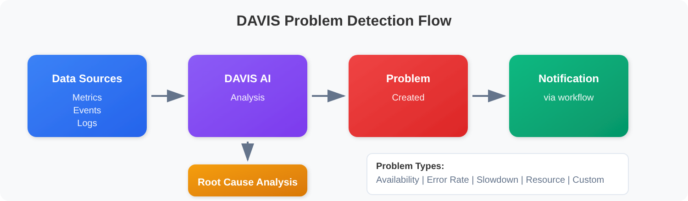
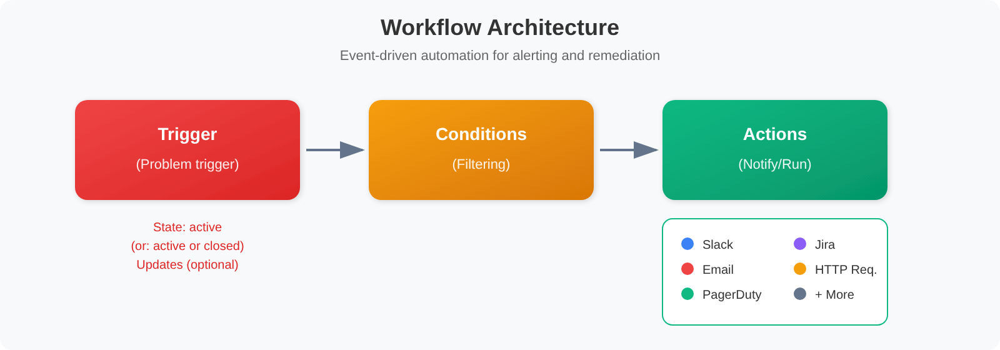

# ONBRD-09: Setting Up Alerts

> **Series:** ONBRD — Dynatrace Onboarding | **Notebook:** 9 of 10 | **Created:** December 2025 | **Last Updated:** 10/02/2026

## Getting Notified When Things Go Wrong
Dynatrace's DAVIS AI automatically detects problems, but you need to configure where those alerts go. This notebook covers the Workflows app for modern alerting and notification routing.

---

## Table of Contents

1. [How DAVIS Problem Detection Works](#how-davis-problem-detection-works)
2. [Modern Alerting with Workflows](#modern-alerting-with-workflows)
3. [Creating Your First Workflow](#creating-your-first-workflow)
4. [Notification Actions](#notification-actions)
5. [Routing Alerts to Teams](#routing-alerts-to-teams)
6. [Custom Metric Alerts: Detect, Then Route](#custom-metric-alerts)
7. [Next Steps](#next-steps)

---

## Prerequisites

- IAM permissions for Workflows: `automation:workflows:read`, `automation:workflows:write` and `automation:workflows:run` (write can be limited to simple workflows with `automation:workflow-type = "SIMPLE"`), plus `storage:events:read` for the Problem trigger and the queries below
- Permission to create connections under **Settings → Connections** (each connector setup page lists its settings schema)
- DQL fundamentals (ONBRD-08)
- Access to notification target (email, Slack, PagerDuty, etc.)

<a id="how-davis-problem-detection-works"></a>
## 1. How DAVIS Problem Detection Works
DAVIS AI continuously monitors your environment and creates **problems** when anomalies are detected:


<!-- MARKDOWN_TABLE_ALTERNATIVE
| Stage | Description |
|-------|-------------|
| Data Sources | Metrics, Events, Logs |
| DAVIS AI | Analysis, anomaly detection and root cause analysis |
| Problem Created | Issue identified and correlated |
| Notification | Sent by a workflow, ideally after root cause analysis completes |
-->

### Problem Types

| Type | Trigger | Example |
|------|---------|--------|
| **Availability** | Service/process unavailable | Database crashed |
| **Error rate** | Error rate increases | 500 errors spike |
| **Slowdown** | Response time degradation | Latency increase |
| **Resource** | CPU, memory, disk issues | Disk full |
| **Custom** | Metric thresholds breached | Custom alert |

<a id="modern-alerting-with-workflows"></a>
## 2. Modern Alerting with Workflows
The Workflows app is the modern platform's approach to alerting and automation.

**Location:** the **Workflows** app

### What are Workflows?

Workflows are event-driven automations that can:
- React to DAVIS problems
- Send notifications to various channels
- Execute remediation actions
- Run on schedules


<!-- MARKDOWN_TABLE_ALTERNATIVE
| Stage | Description |
|-------|-------------|
| Trigger | Problem trigger (problem state: active / active or closed / closed; optional Updates) |
| Conditions | Filtering logic |
| Actions | Slack, Email, PagerDuty, Jira, HTTP Request, etc. |
-->

### Workflow vs Legacy Alerting Profiles

| Feature | Workflows | Alerting Profiles (Legacy) |
|---------|-----------|---------------------------|
| **Trigger types** | Events, schedules, manual | detected problems only |
| **Filtering** | DQL matchers on the problem | Rule-based |
| **Actions** | 20+ built-in actions | Fixed notifications |
| **Automation** | Full automation capability | Notification only |
| **Modern platform** | Recommended | Dynatrace Classic — supported, not deprecated |

> **On the status of alerting profiles.** The upgrade guide answers this directly: *"They continue to work and are not being removed on a published schedule, but they'll not receive new capabilities."* The alerting-profiles page states *"Problem notification is a Dynatrace Classic concept."* and steers new work elsewhere: *"Use simple workflows to send notifications about problems."* Treat that as *build new alerting on workflows*, not as *your existing profiles are about to stop working*.
>
> One caveat does bite: an alerting profile scoped by a **Management Zone** is only as durable as that zone. The MZ filter has no successor in the alerting model, so teams retiring Management Zones must rebuild those profiles as problem-triggered workflows first. See MZ2POL-01 §5.

> <sub>**Sources:** [Problem alerting profiles (DT docs)](https://docs.dynatrace.com/docs/analyze-explore-automate/notifications-and-alerting/alerting-profiles) — the two quotes above, [Upgrade guide: alert notifications (DT docs)](https://docs.dynatrace.com/docs/platform/upgrade/keep-problems-and-alerting-working/upgrade-guide-alert-notification) — *"A workflow's Problem trigger filters problems directly with DQL matchers on the problem."* and *"They continue to work and are not being removed on a published schedule, but they'll not receive new capabilities."*</sub>

<a id="creating-your-first-workflow"></a>
## 3. Creating Your First Workflow
### Step 1: Choose a Simple or a Standard Workflow

Open the **Workflows** app and create a workflow. For notifications, the upgrade guide points to a **simple workflow**: *"Use a simple workflow whenever the destination accepts the problem record as-is."*

| | Simple workflow | Standard workflow |
|---|---|---|
| **Structure** | One trigger, one task | Multiple tasks, branching, loops |
| **Workflow-hour consumption** | None | Billed as Automation Workflow |
| **Fits** | Send problem data as-is to one channel | Enrich, transform, branch, orchestrate |

Simple is not free: *"each task execution counts as one AppEngine function invocation, and is billed as Automation Workflow."* Choose a standard workflow when the message needs conditional logic or enrichment, or when one filter must fan out to several destinations.

### Step 2: Configure the Problem Trigger

1. Select the **Problem trigger**. It *"starts a workflow when a problem opens, changes, or resolves."*
2. Set **Problem state**:
   - **active** (the default) starts when the problem opens
   - **active or closed** starts when it opens and again when it closes, so responders also hear about the resolution
   - **closed** starts only when it closes
3. Under **Advanced options**:
   - **Wait for root cause analysis**: *"Recommended: Enable this to avoid triggering on incomplete problem data."*
   - **Minimum duration**: *"Postpones the trigger until the problem has been open for at least the configured duration."* Values run from 5 minutes to one week, and *"A problem that is closed before ever reaching the configured threshold doesn't produce a trigger"*, which makes this the main control for short-lived noise.
   - **Updates**: re-triggers when selected problem fields, such as severity, change. *"Without Updates enabled, the trigger starts once per state transition and does not start again as the problem evolves."*

### Step 3: Filter Which Problems Start It

Use the trigger's own fields first: **Event category**, **Severity**, and the **Affected entities** tag filter. Anything more goes in **Additional custom filter query**, which takes a *"DQL matcher expression to further refine which problems start the trigger"*: DQL matcher syntax on the problem record, not JavaScript.

```text
// Example: skip problems that fall inside a maintenance window
maintenance.is_under_maintenance == false
```

> **Select categories in Event category, not in the custom filter.** The two are combined: *"These are AND conditions, not alternatives."* A custom filter that names a category the Event category selection excludes produces *"zero executions, no error, a workflow that looks correctly configured, and never runs."* Keep the custom filter category-agnostic. Then select **Query past events** in the trigger: zero matches in every window in a busy environment almost always means the two contradict each other.

To limit it to production, use the trigger's **Affected entities** tag filter (for example an `environment:production` tag). Do not match on entity IDs: an ID such as `CLOUD_APPLICATION-EADC52AF343668DE` carries no environment or application name — none of 3,210 problems on a validation tenant had `prod` in an affected-entity ID (09/24/2026).

### Step 4: Add the Action

1. Add a task to the trigger
2. Pick the action: Slack **Send message**, **Send email**, PagerDuty **Send event**, **HTTP Request**, and so on (see §4)
3. Configure the action parameters, then *"Run the workflow manually against a real problem record before activating it."*

### Basic Workflow Example

```text
Workflow type: simple
Trigger:       Problem trigger, problem state = active or closed
               Event category = Error
               Wait for root cause analysis = on, Minimum duration = 5 min
Action:        Slack Connector, Send message to #alerts
```

### Workflow Settings

| Setting | Description |
|---------|-------------|
| **Name** | Descriptive workflow name |
| **Description** | What this workflow does |
| **Owner** | The user (or group) that owns the workflow; a new workflow is private to its creator |
| **Actor** | The user whose permissions the tasks run with. *"We highly recommend using service users as actors for all workflows that are worked on collaboratively and serve a production grade use case."* |
| **State** | Enabled/Disabled |

> <sub>**Sources:** [Event triggers for workflows (DT docs)](https://docs.dynatrace.com/docs/analyze-explore-automate/workflows/build/trigger/event-trigger) — the Problem trigger options and quotes in Steps 2–3; [Upgrade guide: alert notifications (DT docs)](https://docs.dynatrace.com/docs/platform/upgrade/keep-problems-and-alerting-working/upgrade-guide-alert-notification) — simple vs standard workflows, the AND rule, the maintenance-window filter and the manual test run; [Manage workflow permissions (DT docs)](https://docs.dynatrace.com/docs/analyze-explore-automate/workflows/security) — Owner and Actor.</sub>

<a id="notification-actions"></a>
## 4. Notification Actions
Notifications go through **Workflows Connectors**. The third-party connectors install from Dynatrace Hub; Email and HTTP Request are built in.

### Common Notification Connectors

| Connector → action | Use Case |
|--------|----------|
| **Email** → *Send email* | Basic notifications |
| **Slack Connector** → *Send message* | Team channels |
| **Microsoft Teams Connector** | Team channels |
| **PagerDuty Connector** → *Send event* or *Create an incident* | On-call paging |
| **ServiceNow Connector** | Incident tickets |
| **Jira Connector** | Issue tracking |
| **HTTP Request** | Generic webhooks and tools without a connector (Trello, VictorOps, xMatters) |
| **Jira Service Management Connector** or **HTTP Request** | Opsgenie replacement: *"Opsgenie is being retired by Atlassian and replaced by Jira Service Management (JSM)."* |

### Setting Up Slack Notifications

There is no in-product OAuth flow. You create a Slack app and hand its bot token to a Dynatrace connection:

1. Install **Slack Connector** from Dynatrace Hub.
2. Allow the outbound call: **Settings → General → External requests** → *New host pattern* for Slack's API domain.
3. In the Workflows app, **Settings → Authorization settings**, grant the permissions the setup guide lists.
4. In Slack, create an app **From an app manifest** (the setup guide provides the manifest JSON, including a minimal one for plain notifications), install it to the workspace, and copy its OAuth token from **Features → OAuth & Permissions**.
5. In Dynatrace, go to **Settings → Connections → Slack** → *Connection*, and paste the token in **Bot token**.
6. In the workflow, add the Slack **Send message** action, pick the connection and channel, and write the message.

### Message Templates

Use Jinja2 templates for dynamic messages:

```
🚨 *Problem Detected*
*Title:* {{ event()["event.name"] }}
*Category:* {{ event()["event.category"] }}
*Status:* {{ event()["event.status"] }}
*Link:* {{ problem_link() }}
```

> **Template fields come from the problem record.** The Problem trigger's `event()` is the `dt.davis.problems` record — run `fetch dt.davis.problems, from:-24h | limit 1` to see every field a template can read. It has no `title` or `problem_url` field (0 of 3,209 problem records on a validation tenant, 09/24/2026): the title is `event.name`, the kind of problem is `event.category`, and the link is `{{ problem_link() }}`, which *"evaluates correctly in workflows with Davis problem event triggers only."* ([Jinja expressions for Workflows (DT docs)](https://docs.dynatrace.com/docs/analyze-explore-automate/workflows/reference), [Event triggers for workflows (DT docs)](https://docs.dynatrace.com/docs/analyze-explore-automate/workflows/build/trigger/event-trigger))

### Setting Up Email Notifications

1. In the Workflows app, **Settings → Authorization settings**, grant `email:emails:send`
2. Add the **Send email** action to the workflow
3. Configure:
   - Recipients in To, Cc and Bcc: *"the number of email addresses is restricted to 10 per field"*
   - Subject (can use templates)
   - Message: Markdown-style formatting (bold, lists, links) only. *"It doesn't offer support for HTML."*

Mail is sent from `no-reply@apps.dynatrace.com`, and *"Trial environments are prohibited to send emails with Email."*

### Setting Up PagerDuty

1. Install **PagerDuty Connector** from Dynatrace Hub.
2. For the **Send event** action (Events API v2, which triggers, acknowledges and resolves incidents), create an Events connection: **Settings → Connections → PagerDuty** → *Events API* tab, with the PagerDuty service's **routing key**. *"The Send event action uses the PagerDuty Events API v2 and requires a separate Events connection configured with a routing key."*
3. For **Create an incident** and the other actions, create a connection under **Settings → Connections → Connectors → PagerDuty** with a PagerDuty **API key**.
4. Add the action to the workflow and map Dynatrace severity to PagerDuty severity.

> <sub>**Sources:** [Upgrade guide: alert notifications (DT docs)](https://docs.dynatrace.com/docs/platform/upgrade/keep-problems-and-alerting-working/upgrade-guide-alert-notification) — the connector mapping, including *"Custom integration (generic webhook) HTTP Request"*; [Connectors and actions (DT docs)](https://docs.dynatrace.com/docs/analyze-explore-automate/workflows/default-workflow-actions/actions); [Set up Slack Connector (DT docs)](https://docs.dynatrace.com/docs/analyze-explore-automate/workflows/default-workflow-actions/actions/slack/automation-workflows-slack-setup); [Email (DT docs)](https://docs.dynatrace.com/docs/analyze-explore-automate/workflows/default-workflow-actions/actions/email); [Set up PagerDuty Connector (DT docs)](https://docs.dynatrace.com/docs/analyze-explore-automate/workflows/default-workflow-actions/actions/pagerduty/pagerduty-workflows-setup).</sub>

<a id="routing-alerts-to-teams"></a>
## 5. Routing Alerts to Teams
Use workflow conditions to route alerts to the right teams.

### Strategy: Condition-Based Routing


<!-- MARKDOWN_TABLE_ALTERNATIVE
| Filter | Destination |
|--------|-------------|
| Contains "checkout" | #alerts-checkout |
| Contains "payment" | #alerts-payments |
-->

### Routing by Entity Name

Entity IDs never contain names, so match on `affected_entity_names`. In a DQL matcher, `matchesValue` *"works with multi-value attributes (matching any value), and supports wildcards"* ([DQL matcher in OpenPipeline (DT docs)](https://docs.dynatrace.com/docs/platform/openpipeline/reference/dql/dql-matcher-in-openpipeline)). On a validation tenant (09/24/2026) `matchesValue(affected_entity_names, "*payment*")` matched 268 problems; searching the entity IDs for `payment` matched none.

```text
// Additional custom filter query — route checkout team alerts
matchesValue(affected_entity_names, "*checkout*")
```

### Routing by Problem Category

Select the category in the trigger's **Event category** field, not in the custom filter (see §3): one workflow with the availability category selected routes to SRE, another with the slowdown category routes to the app team. In the problem record these are `event.category == "AVAILABILITY"` and `"SLOWDOWN"`, which is what to use when you query problems in a notebook.

### Example Multi-Team Setup

| Team | Workflow | Condition | Channel |
|------|----------|-----------|---------|
| Checkout | `checkout-alerts` | Entity contains "checkout" | Slack #alerts-checkout |
| Payments | `payments-alerts` | Entity contains "payment" | PagerDuty Payments |
| Platform | `critical-alerts` | Event category: availability | PagerDuty Platform |

### Creating Team-Specific Workflows

1. Create one workflow per routing need. The upgrade guide's rule is *"Consolidate by destination, not by filter"*, but *"Split workflows when teams need isolation, even if the destination is identical."*
2. Use trigger fields and the custom filter to select problems
3. Send to appropriate channel
4. Include relevant context in message

<a id="custom-metric-alerts"></a>
## 6. Custom Metric Alerts: Detect, Then Route
A workflow routes problems; it does not create them. An alert on a metric threshold needs two pieces: a **custom alert** (anomaly detector) that evaluates the metric and raises a problem, and a workflow that routes that problem.

### When to Use Custom Metric Alerts

| Scenario | Configuration |
|----------|---------------|
| **Disk > 90%** | Static threshold |
| **Queue depth spike** | Deviation from baseline |
| **Business metric** | Custom metric threshold |
| **SLO breach** | SLO burn rate (SLO-04) |

### Step A: Create the Custom Alert

Create a custom alert on the metric and pick its analyzer:

- **Static threshold**: alert when the value exceeds X
- **Auto-adaptive baseline**: alert on deviations from normal
- **Seasonal baseline**: account for time-based variations

> **Where a custom alert is created (SaaS 1.344).** *"Starting with Dynatrace version 1.344, custom alerts have moved to Settings. Because Anomaly Detection is deprecated, we highly recommend that you use Settings to access your existing configurations and create new ones."* SaaS 1.344 rolls out to tenants in stages, so check your tenant's version first. On earlier versions the **Anomaly Detection** app is where custom alerts are created. AIOPS-02 and ALERT-02 cover choosing and building detectors.

### Step B: Route the Problems It Raises

Create a workflow with the **Problem trigger** and select the custom-alert category in **Event category** (problems from custom alerts carry `event.category == "CUSTOM_ALERT"`). Narrow it further with the custom filter, for example on `event.name`.

### Example: High CPU Alert

Built-in resource detection already raises CPU problems, so routing them needs only Step B:

1. Create a workflow with the Problem trigger
2. Select the resource-contention category in **Event category**, and put only the non-category part in **Additional custom filter query**:
   ```text
   matchesPhrase(event.name, "CPU")
   ```
   In the problem record the category is `RESOURCE_CONTENTION` (there is no `RESOURCE` category) and the problem title is `event.name`. On a validation tenant (7 days to 09/24/2026), `event.category == "RESOURCE_CONTENTION" and matchesPhrase(event.name, "CPU")` matched 1,385 of 1,464 resource-contention problems; `event.category == "RESOURCE"` matched none.
3. Add the Slack notification action

> <sub>**Sources:** [Anomaly Detection (DT docs)](https://docs.dynatrace.com/docs/dynatrace-intelligence/anomaly-detection/anomaly-detection-app) — the SaaS 1.344 quote; [Upgrade guide: alert notifications (DT docs)](https://docs.dynatrace.com/docs/platform/upgrade/keep-problems-and-alerting-working/upgrade-guide-alert-notification) — selecting categories in Event category.</sub>

```dql
// Recent problems
fetch dt.davis.problems, from: now() - 24h
| fields timestamp, display_id, event.name, event.status, affected_entity_types
| sort timestamp desc
| limit 20
```

```dql
// Problem count by status
fetch dt.davis.problems, from: now() - 7d
| summarize count = count(), by: {event.status}
| sort count desc
```

```dql
// Problems opened per day
// timestamp is the record's last update; bucket on event.start to count by opening day
fetch dt.davis.problems, from: now() - 7d
| filter event.start >= now() - 7d
| fieldsAdd day = bin(event.start, 24h)
| summarize problem_count = count(), by: {day}
| sort day desc
```

```dql
// Active problems right now
fetch dt.davis.problems, from: now() - 30d
| filter event.status == "ACTIVE"
| fields timestamp, display_id, event.name, affected_entity_types
| sort timestamp desc
```

```dql
// Problem duration analysis
fetch dt.davis.problems, from: now() - 7d
| filter event.status == "CLOSED"
| filter isNotNull(event.start) and isNotNull(event.end)
| fieldsAdd duration_minutes = (event.end - event.start) / 1m
| summarize {
    avg_duration = avg(duration_minutes),
    max_duration = max(duration_minutes),
    problem_count = count()
  }
```

### Alert Testing Checklist

After configuring workflows:

1. **Test notification delivery** - Run the workflow manually against a real problem record before activating it
2. **Verify routing** - Confirm correct channels receive alerts
3. **Check formatting** - Review message content
4. **Validate conditions** - Ensure filters work as expected
5. **Test resolution** - Confirm close notifications work

### Workflow Execution History

For a standard workflow, open it in the Workflows app and select **Executions** to see each run's status, error details and action outputs.

For a simple workflow that page is not available: *"Execution logs for simple workflows are visible only for a limited time, and the Executions page does not display their history."* Every execution is also recorded in Grail, which works for both types. The query below counts runs by final state; each execution also writes a `RUNNING` record when it starts, so leaving the state filter out counts every run twice. It needs `storage:system:read`.

> <sub>**Sources:** [Upgrade guide: alert notifications (DT docs)](https://docs.dynatrace.com/docs/platform/upgrade/keep-problems-and-alerting-working/upgrade-guide-alert-notification) — the simple-workflow caveat and the execution-event query this is based on.</sub>

```dql
// Workflow runs by final state (last 7 days)
fetch dt.system.events, from: now() - 7d
| filter event.kind == "WORKFLOW_EVENT" and event.type == "WORKFLOW_EXECUTION"
| filter in(dt.automation_engine.state, {"SUCCESS", "ERROR"})
| summarize runs = count(), by: {dt.automation_engine.workflow.title, dt.automation_engine.state}
| sort runs desc
```

<a id="next-steps"></a>
## 7. Next Steps

With alerting configured:

1. **ONBRD-10: Building Dashboards** — Visualize your data
2. Fine-tune workflow conditions based on alert volume
3. Set up escalation paths with multiple workflows
4. Document on-call procedures

### Where to Go Deeper

- **AIOPS series** (8 notebooks) — Davis AI in depth: Causal/Predictive/Generative, anomaly detection mechanisms (static / auto-adaptive / seasonal / multi-dimensional baseline / novelty/forecast), Davis problems & RCA, Davis CoPilot / Dynatrace Assist, AI models, integrations & agentic workflows
- **WFLOW series** (12 notebooks) — Workflows depth: triggers, actions, AI tasks, scheduled workflows, MCP server integration
- **ALERT series** (5 notebooks) — Alerting strategy and design: end-to-end architecture, choosing detection, routing and cost, ServiceNow integration
- **SLO series** (6 notebooks) — Service level objectives and burn-rate alerting

### Alerting Checklist

- [ ] Slack/Email connection configured
- [ ] First workflow created and tested
- [ ] Team-specific workflows configured
- [ ] Test notifications sent successfully
- [ ] Critical path to on-call established
- [ ] Escalation procedures documented
- [ ] Davis sensitivity defaults reviewed

---

## Summary

In this notebook, you learned:

- How DAVIS problem detection works
- How to create workflows for alerting
- How to configure notification actions
- How to route alerts to teams using conditions
- How a custom alert raises the problem a workflow routes
- How to monitor workflow effectiveness
- That `dt.davis.problems` uses `event.status` / `event.end` fields, and durations should use `/ 1m` (duration arithmetic), not `/ 60000000000` (nanosecond constants)

---

## References

- [Root cause analysis (DT docs)](https://docs.dynatrace.com/docs/dynatrace-intelligence/root-cause-analysis)
- [Workflows (DT docs)](https://docs.dynatrace.com/docs/analyze-explore-automate/workflows)
- [Event triggers for workflows (DT docs)](https://docs.dynatrace.com/docs/analyze-explore-automate/workflows/build/trigger/event-trigger)
- [Upgrade guide: alert notifications (DT docs)](https://docs.dynatrace.com/docs/platform/upgrade/keep-problems-and-alerting-working/upgrade-guide-alert-notification)
- [Connectors and actions (DT docs)](https://docs.dynatrace.com/docs/analyze-explore-automate/workflows/default-workflow-actions/actions)
- [Slack Connector (DT docs)](https://docs.dynatrace.com/docs/analyze-explore-automate/workflows/default-workflow-actions/actions/slack)
- [Set up Slack Connector (DT docs)](https://docs.dynatrace.com/docs/analyze-explore-automate/workflows/default-workflow-actions/actions/slack/automation-workflows-slack-setup)
- [PagerDuty Connector (DT docs)](https://docs.dynatrace.com/docs/analyze-explore-automate/workflows/default-workflow-actions/actions/pagerduty)
- [Set up PagerDuty Connector (DT docs)](https://docs.dynatrace.com/docs/analyze-explore-automate/workflows/default-workflow-actions/actions/pagerduty/pagerduty-workflows-setup)
- [Email (DT docs)](https://docs.dynatrace.com/docs/analyze-explore-automate/workflows/default-workflow-actions/actions/email)
- [Manage workflow permissions (DT docs)](https://docs.dynatrace.com/docs/analyze-explore-automate/workflows/security)

---

<sub>*This notebook was AI-generated from community-submitted and publicly available sources. This notebook series is not officially supported by Dynatrace. Always verify information against official Dynatrace documentation.*</sub>
