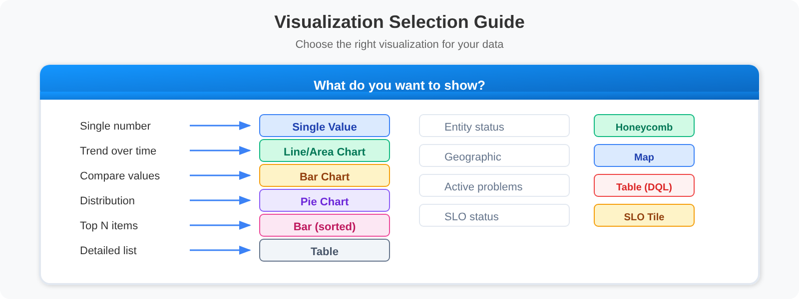

# ONBRD-10: Building Dashboards

> **Series:** ONBRD — Dynatrace Onboarding | **Notebook:** 10 of 10 | **Created:** December 2025 | **Last Updated:** 10/02/2026

## Visualizing Your Data
Dashboards provide at-a-glance visibility into your environment's health and performance. This notebook covers dashboard creation, common visualization patterns, and sharing with your team.

---

## Table of Contents

1. [Dashboards vs Notebooks](#dashboards-vs-notebooks)
2. [Creating Your First Dashboard](#creating-your-first-dashboard)
3. [Tile and Visualization Types](#common-tile-types)
4. [Dashboard Patterns](#dashboard-patterns)
5. [Useful Queries for Dashboards](#useful-queries-for-dashboards)
6. [Sharing and Permissions](#sharing-and-permissions)
7. [Next Steps](#next-steps)

---

## Prerequisites

- Viewer access or higher
- Familiarity with DQL (ONBRD-08)
- Data in your environment to visualize

<a id="dashboards-vs-notebooks"></a>
## 1. Dashboards vs Notebooks
Dynatrace offers two visualization tools:

| Feature | Dashboard | Notebook |
|---------|-----------|----------|
| **Purpose** | Monitoring at a glance | Interactive analysis |
| **Layout** | Fixed grid tiles | Sequential document |
| **Auto-refresh** | Yes | Manual |
| **Interactivity** | Click-through links | Query editing |
| **Sharing** | Wall displays, reports | Investigation documentation |
| **Best for** | NOC screens, status pages | Troubleshooting, exploration |

This notebook uses **Dashboards**, the Latest Dynatrace app. Dashboards Classic is the older surface, and Dynatrace's advice for it is: *"If you're still using classic dashboards, we encourage you to upgrade your dashboards and benefit from all the latest dashboarding possibilities made available by the Dashboards app in the latest Dynatrace."* Classic tiles such as **Host health** and **Service health** do not exist in the Dashboards app; their job is done with DQL tiles (§5).

> <sub>**Sources:** [Dashboards Classic (DT docs)](https://docs.dynatrace.com/docs/analyze-explore-automate/dashboards-classic).</sub>

### When to Use Each

| Scenario | Use |
|----------|-----|
| Team status display | Dashboard |
| Incident investigation | Notebook |
| Executive summary | Dashboard |
| Root cause analysis | Notebook |
| SLA reporting | Dashboard |
| Ad-hoc queries | Notebook |

<a id="creating-your-first-dashboard"></a>
## 2. Creating Your First Dashboard
**Location:** the **Dashboards** app → create a dashboard

### Dashboard Creation Steps

1. Click "Create dashboard"
2. Name your dashboard (e.g., "Production Overview")
3. Add tiles by clicking "+" or dragging
4. Configure each tile
5. Arrange and resize as needed
6. Save

### Dashboard Settings

| Setting | Description |
|---------|-------------|
| **Name** | Dashboard title |
| **Time frame** | Default time range |
| **Segment** | Default filter scope |
| **Variables** | *"Configure variable filters to monitor different resources within a single dashboard."* |
| **Refresh rate** | Auto-refresh interval. *"When you open a dashboard for the first time, the refresh rate is set to Off (no automatic refresh)."* A rate you pick is remembered the next time you open the dashboard |
| **Owner** | Dashboard owner |
| **Sharing** | Who can view/edit (§6) |

> <sub>**Sources:** [Dashboards (DT docs)](https://docs.dynatrace.com/docs/analyze-explore-automate/dashboards-and-notebooks/dashboards-new).</sub>

<a id="common-tile-types"></a>
## 3. Tile and Visualization Types
### Tiles

| Tile Type | Use Case |
|-----------|----------|
| **Query** | A DQL query against Grail, shown with any visualization below |
| **Explore** | Point-and-click data exploration, no DQL needed |
| **Code** | Data returned by code run as a Dynatrace function |
| **Markdown** | Documentation, links |
| **Image** | Logos, diagrams |
| **Service-Level Objective** | SLO status |
| **Variables** | Filters that drive the other tiles |

### Visualizations for Query and Explore Tiles

| Visualization | Use Case |
|-----------|----------|
| **Single value** | Key metrics (request count, error rate) |
| **Line / Area / Band chart** | Time series data |
| **Bar / Categorical chart** | Comparisons and ranked top-N (sort and `limit` in the query) |
| **Table / Record list** | Lists and details, including active problems from `dt.davis.problems` |
| **Pie / Donut** | Distribution |
| **Honeycomb** | Entity health grid |
| **Meter bar / Gauge** | Value against a range |
| **Maps** (choropleth, dot, connection, bubble) | Geographic data |

There is no "top list" visualization: a ranked list is a bar or categorical chart (or a table) over a query that ends in `sort … | limit N`.

### Visualization Types


<!-- MARKDOWN_TABLE_ALTERNATIVE
| Show This | Use This Visualization |
|-----------|---------------|
| Single number | Single Value |
| Trend over time | Line/Area Chart |
| Compare values | Bar Chart |
| Distribution | Pie Chart |
| Top N items | Bar chart, sorted and limited |
| Detailed list | Table |
| Entity status | Honeycomb |
| Geographic | Map |
| Active problems | Table on a `dt.davis.problems` query |
| SLO status | Service-Level Objective tile |
-->

> <sub>**Sources:** [Dashboards (DT docs)](https://docs.dynatrace.com/docs/analyze-explore-automate/dashboards-and-notebooks/dashboards-new) — tile types; [Edit visualizations (DT docs)](https://docs.dynatrace.com/docs/analyze-explore-automate/dashboards-and-notebooks/edit-visualizations) — the visualization list.</sub>

<a id="dashboard-patterns"></a>
## 4. Dashboard Patterns

<!-- MARKDOWN_TABLE_ALTERNATIVE
| Pattern | Use Case |
|---------|----------|
| Executive Summary | High-level KPIs, problems, service health |
| Service Dashboard | Request metrics, endpoints, dependencies |
| Infrastructure Health | Host counts, CPU/memory, top consumers |
-->

### Pattern: Executive Summary

Key elements:
- **KPI row**: Uptime, Errors, Avg Response, Active Problems
- **Trend chart**: Response time over 24h
- **Problem list**: Current issues
- **Service health**: Status indicators for key services

### Pattern: Service Dashboard

Key elements:
- **KPI row**: Requests, Error Rate, P95 Response, Apdex
- **Timeline**: Request rate and errors over time
- **Top endpoints**: Most called API endpoints
- **Dependencies**: Downstream service health

### Pattern: Infrastructure Dashboard

Key elements:
- **KPI row**: Host count, Avg CPU, Avg Memory, Disk Alerts
- **Honeycomb views**: Visual host health for CPU and memory
- **Top consumers**: Hosts using most resources

<a id="useful-queries-for-dashboards"></a>
## 5. Useful Queries for Dashboards
These queries work well as dashboard tiles. Each sets its own timeframe with `from:`, and *"If the timeframe is defined in the query itself, the dropdown list is disabled."* Remove `from:` when the tile should follow the dashboard timeframe.

> <sub>**Sources:** [Dashboards (DT docs)](https://docs.dynatrace.com/docs/analyze-explore-automate/dashboards-and-notebooks/dashboards-new).</sub>

### Service Health Queries

The service tiles read the service request metrics `dt.service.request.count` and `dt.service.request.failure_count` rather than counting spans. Counting `span.kind == "server"` spans with `span.status_code == "error"` gives a different and misleading number. A service request is its request root span, which is not always a server span, and *"a request counts as failed only when failure detection marks it as such."* On a validation tenant (1 hour, 10/02/2026) the span version read an error rate of 0.35 % (407 of 115,103 server spans); the service metrics read 4.61 % (4,807 failures in 104,191 requests).

> <sub>**Sources:** [Service-related concepts (DT docs)](https://docs.dynatrace.com/docs/observe/application-observability/services/services-concepts).</sub>

```dql
// Total request count (Single Value tile)
timeseries requests = sum(dt.service.request.count, scalar: true), from: now() - 1h
```

```dql
// Error rate percentage (Single Value tile)
timeseries {
    requests = sum(dt.service.request.count, scalar: true),
    failures = sum(dt.service.request.failure_count, scalar: true)
  }, from: now() - 1h
| fieldsAdd error_rate = round(100.0 * failures / requests, decimals: 2)
```

```dql
// Top services by request count (Bar chart tile)
timeseries requests = sum(dt.service.request.count, scalar: true), by: {dt.service.name}, from: now() - 1h
| sort requests desc
| limit 10
```

```dql
// Service error rates (Table tile)
timeseries {
    requests = sum(dt.service.request.count, scalar: true),
    failures = sum(dt.service.request.failure_count, scalar: true)
  }, by: {dt.service.name}, from: now() - 1h
| fieldsAdd error_rate = round(100.0 * failures / requests, decimals: 2)
| sort error_rate desc
| limit 15
```

### Infrastructure Queries

```dql
// Host count (Single Value tile)
fetch dt.entity.host
| filter state == "RUNNING"
| summarize host_count = count()

// Smartscape note (dt.entity.* is deprecated but still functional): this query uses the
// classic-only field state, which has NO Smartscape node equivalent
// (Smartscape expresses liveness via node lifetime, not a state field). Keep the classic
// query above for state detail. For monitoring mode, do not use monitoringMode — it is
// empty on Kubernetes and Fargate hosts; read billing events instead (ONBRD-05 § 6).
```

```dql
// Hosts by OS type (Pie Chart tile)
fetch dt.entity.host
| summarize count = count(), by: {osType}
| sort count desc

// Smartscape equivalent (dt.entity.* is deprecated but still functional):
//   smartscapeNodes "HOST"
//   | summarize count = count(), by: {os.type}
//   | sort count desc
// Caveat: Smartscape reflects CURRENT live topology and can report fewer entities
// than the classic entity store; for a pre-migration discovery inventory keep the
// classic query above.
// Field maps: osType -> os.type (LINUX -> OS_TYPE_LINUX).
```

```dql
// Host inventory (Table tile)
fetch dt.entity.host
| fields name = entity.name, os = osType, state, cpuCores
| sort name
| limit 25

// Smartscape note (dt.entity.* is deprecated but still functional): this query uses the
// classic-only field state, which has NO Smartscape node equivalent
// (Smartscape expresses liveness via node lifetime, not a state field). Keep the classic
// query above for state detail. For monitoring mode, do not use monitoringMode — it is
// empty on Kubernetes and Fargate hosts; read billing events instead (ONBRD-05 § 6).
// Other fields do map: osType -> os.type (LINUX -> OS_TYPE_LINUX); cpuCores -> cores; entity.name -> name.
```

### Log Queries

Filter error logs on `status`, not `loglevel`. `loglevel` is the source's own severity, while *"for each log event, a status attribute is created with a value that is a sum of loglevel values"*, and the levels `SEVERE`, `ERROR`, `CRITICAL`, `ALERT`, `FATAL` and `EMERGENCY` all map to `status == "ERROR"`. Java applications log `SEVERE`, so `loglevel == "ERROR"` misses them. On a validation tenant (1 hour, 10/02/2026) `status == "ERROR"` returned 118,086 records and `loglevel == "ERROR"` 63,551; most of the difference was 54,535 `SEVERE` records.

> <sub>**Sources:** [Automatic log enrichment (DT docs)](https://docs.dynatrace.com/docs/analyze-explore-automate/logs/lma-log-ingestion/lma-log-ingestion-via-api/lma-log-data-transformation).</sub>

```dql
// Error log count (Single Value tile)
// status groups SEVERE, ERROR, CRITICAL, ALERT, FATAL and EMERGENCY; loglevel is the raw source value
fetch logs, from: now() - 1h
| filter status == "ERROR"
| summarize error_count = count()
```

```dql
// Log volume by severity (Pie Chart tile)
fetch logs, from: now() - 1h
| summarize count = count(), by: {loglevel}
| sort count desc
```

```dql
// Recent errors (Table tile)
fetch logs, from: now() - 1h
| filter status == "ERROR"
| fields timestamp, loglevel, log.source, content
| sort timestamp desc
| limit 10
```

### Problem Queries

```dql
// Active problem count (Single Value tile)
fetch dt.davis.problems, from: now() - 30d
| filter event.status == "ACTIVE"
| summarize active_problems = count()
```

```dql
// Problems by status (Pie Chart tile)
fetch dt.davis.problems, from: now() - 7d
| summarize problem_count = count(), by: {event.status}
```

```dql
// Recent problem list (Table tile)
fetch dt.davis.problems, from: now() - 24h
| fields timestamp, display_id, event.name, event.status
| sort timestamp desc
| limit 10
```

<a id="sharing-and-permissions"></a>
## 6. Sharing and Permissions
### Sharing Options

| Sharing Level | Who Can Access |
|---------------|----------------|
| **Private** | Only you, the owner |
| **Specific users or groups** | Named users and groups, each with *Can view* or *Can edit* |
| **Access for all** | *"let everyone in your Dynatrace environment view the document"* (view-only) |
| **Share link** | Anyone in the environment who has the link, with the permission chosen when the link was created |

A share link can be forwarded: *"anyone in your Dynatrace environment could use it, and they would have the same permissions (Can edit or Can view) that you selected when you created the link."* Use it for view access, not edit.

### Segment Filtering

Dashboards can be filtered using segments:
- Set a default segment in dashboard settings
- Viewers can switch segments if they have access
- Data respects viewer's permissions

### One Dashboard, Several Views

The Dashboards documentation describes no saved presets. To give one dashboard several views, use **Variables** (viewer-selectable filters such as service, cluster or environment) and a **Default segment**. The documentation's rule of thumb: use segments for filters you reuse across dashboards, and variables *"if you need more control over how a filter is applied"*.

### Exporting Dashboards

| Format | Use Case |
|--------|----------|
| **JSON** (*Download*) | Backup, migration: *"Download writes the dashboard to a JSON file that you can import"* |

> **Edited or generated JSON can stop displaying (SaaS 1.346, staged rollout from 08/25/2026).** *"Starting with Dynatrace version 1.346, Dynatrace applies stricter validation rules to dashboards and won't display dashboards that fail validation until you fix them."* It *"will mainly affect dashboards created or modified via the API or external AI tools."* Import edited or generated JSON into a test environment first and confirm it displays (DASH-07). Tenants not yet on 1.346 still display such dashboards.

> <sub>**Sources:** [Share documents (DT docs)](https://docs.dynatrace.com/docs/discover-dynatrace/get-started/dynatrace-ui/share); [Dashboards (DT docs)](https://docs.dynatrace.com/docs/analyze-explore-automate/dashboards-and-notebooks/dashboards-new) — segments, variables and Download; [SaaS 1.346 (DT docs)](https://docs.dynatrace.com/docs/whats-new/saas/sprint-346).</sub>

<a id="next-steps"></a>
## 7. Next Steps

Congratulations! You've completed the onboarding series.

### What You've Learned

| Notebook | Key Topics |
|----------|------------|
| **ONBRD-01** | Tenant access, navigation |
| **ONBRD-02** | IAM, SAML, Platform Tokens, parameterized policies |
| **ONBRD-03** | ActiveGate deployment |
| **ONBRD-04** | Cloud & SaaS integrations |
| **ONBRD-05** | OneAgent deployment, primary tags at source |
| **ONBRD-06** | Tags, segments, naming conventions, `dt.security_context` |
| **ONBRD-07** | Data model, topology |
| **ONBRD-08** | DQL fundamentals |
| **ONBRD-09** | Workflows alerting |
| **ONBRD-10** | Dashboard creation |

### Where to Go Next — by Topic

| Goal | Topic Series |
|------|--------------|
| **Dashboard strategy + executive reporting** | DASH series (8 notebooks) |
| **Davis AI / anomaly detection / RCA** | AIOPS series (8 notebooks) |
| **Workflow automation + AI tasks** | WFLOW series (12 notebooks) |
| **Alerting strategy and design** | ALERT series (5 notebooks) |
| **Service level objectives** | SLO series (6 notebooks) |
| **Deepen DQL — spans / logs / OpenPipeline** | SPANS, OPLOGS, OPMIG, OPIPE |
| **Synthetic monitoring** | SYNTH series |
| **Web RUM / Mobile RUM** | WEBRUM, MOBL |
| **Business events & funnel analysis** | BIZEV series |
| **Database monitoring** | DBMON series |
| **Cloud integration deep dives** | CLOUD series |
| **Kubernetes monitoring** | K8S series |
| **OpenTelemetry integration** | OTEL series |
| **IAM administration depth** | IAM series |
| **Configuration automation / GitOps** | AUTOM series |
| **Access control modernization** | MZ2POL series (Management Zones → Policies) |
| **Migration playbooks** | NRLC + NR2DT (New Relic), SL2DT (Sumo), S2D (Splunk), M2S (Managed → SaaS) |
| **Platform maturity / adoption** | ADOPT series |
| **Official training** | Dynatrace University |
| **Community** | community.dynatrace.com |

### Dashboard Checklist

- [ ] First dashboard created (using **Dashboards (new)**, not legacy Classic Dashboards)
- [ ] Key metrics visualized
- [ ] Problem overview included
- [ ] SLO / SLI tile evaluated for service-health views
- [ ] Dashboard shared with team
- [ ] Segment filter set

---

## Summary

In this notebook, you learned:

- Difference between Dashboards (new) and Classic Dashboards
- Difference between dashboards and notebooks
- How to create and configure dashboards
- Tile and visualization types and when to use them
- Dashboard patterns for different use cases
- DQL queries that work well in dashboards, including why service tiles read the service metrics and error-log tiles filter on `status`
- That `dt.davis.problems` queries use `event.status` (`ACTIVE` / `CLOSED`), not `status` (`OPEN`)
- How to share dashboards with your team

---

## References

- [Dashboards (DT docs)](https://docs.dynatrace.com/docs/analyze-explore-automate/dashboards-and-notebooks/dashboards-new)
- [Dashboards and notebooks (DT docs)](https://docs.dynatrace.com/docs/analyze-explore-automate/dashboards-and-notebooks)
- [Edit visualizations (DT docs)](https://docs.dynatrace.com/docs/analyze-explore-automate/dashboards-and-notebooks/edit-visualizations)
- [Share documents (DT docs)](https://docs.dynatrace.com/docs/discover-dynatrace/get-started/dynatrace-ui/share)
- [Dashboards Classic (DT docs)](https://docs.dynatrace.com/docs/analyze-explore-automate/dashboards-classic)
- [Notebooks (DT docs)](https://docs.dynatrace.com/docs/analyze-explore-automate/dashboards-and-notebooks/notebooks)
- [Dynatrace Query Language (DT docs)](https://docs.dynatrace.com/docs/platform/grail/dynatrace-query-language)
- [Dynatrace Community](https://community.dynatrace.com/)

---

<sub>*This notebook was AI-generated from community-submitted and publicly available sources. This notebook series is not officially supported by Dynatrace. Always verify information against official Dynatrace documentation.*</sub>
