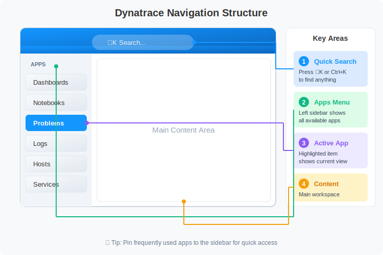

# Getting Started: Your First Steps in Dynatrace

> **Series:** ONBRD | **Notebook:** 1 of 10 | **Created:** December 2025

## Finding Your Way Around

Welcome to Dynatrace. This notebook helps you get oriented in your new environment—where to find things, how to navigate, and what to do first.

---

## Table of Contents

1. Accessing Your Environment
2. Understanding the Navigation
3. Key Areas to Know
4. Your Environment ID and URLs
5. Checking What's Already There
6. Next Steps

---

## Prerequisites

- Access credentials for your Dynatrace tenant
- A modern web browser (Chrome, Firefox, Edge, Safari)

## 1. Accessing Your Environment

Your Dynatrace environment is accessed via a URL specific to your tenant:

```
https://{tenant-id}.apps.dynatrace.com
```

### Finding Your Tenant ID

Your tenant ID is the first part of your Dynatrace URL. For example:
- URL: `https://abc12345.apps.dynatrace.com`
- Tenant ID: `abc12345`

**Write down your tenant ID**—you'll need it for API tokens, OneAgent deployment, and integrations.

### First Login

1. Navigate to your tenant URL
2. Enter your credentials (local user or SSO)
3. Complete any MFA requirements
4. You'll land on the default home screen

> **Note:** If your organization is setting up SAML/SSO, see **ONBRD-02: IAM and Authentication** before inviting additional users.

## 2. Understanding the Navigation

Dynatrace uses a left-hand navigation menu organized by function. The platform is built around **Apps**—each capability is an app you can launch.


<!-- MARKDOWN_TABLE_ALTERNATIVE
| Area | Description |
|------|-------------|
| Search (Cmd+K) | Quick access to anything |
| Apps Menu | Platform capabilities (Dashboards, Notebooks, Problems, etc.) |
| Main Content | Workspace for analysis and monitoring |
| Settings | Configuration options |
| Account Management | Users, tokens, permissions |
-->

### Quick Search

Press **Cmd+K** (Mac) or **Ctrl+K** (Windows/Linux) to open the quick search. Type anything:
- Entity names (hosts, services)
- App names
- Keywords like "logs" or "problems"

### The App Launcher

Click the grid icon to see all available apps. You can:
- Pin frequently used apps to your sidebar
- Discover new apps in the Dynatrace Hub
- Install apps from the Hub to extend functionality

## 3. Key Areas to Know

### Hosts App

The Hosts app shows all monitored infrastructure:
- Host health and resource utilization
- Running processes and services
- Host properties and metadata

### Problems App

DAVIS AI automatically detects problems and correlates related events. This is where you'll see:
- Active issues requiring attention
- Root cause analysis
- Affected entities
- Problem timeline and resolution

### Logs & Events App

Explore all log data ingested into Dynatrace:
- Full-text search across logs
- Filter by source, severity, content
- Correlate logs with traces and metrics

### Notebooks App

Interactive analysis environment (you're using one now!):
- Write and execute DQL queries
- Document investigations
- Share findings with your team

### Workflows App

Automation and alerting for the modern platform:
- Create automated responses to problems
- Configure notifications (Slack, email, PagerDuty, etc.)
- Build custom automation logic

## 4. Your Environment ID and URLs

Several URLs are important to bookmark:

| Purpose | URL Pattern |
|---------|-------------|
| **Main UI** | `https://{tenant-id}.apps.dynatrace.com` |
| **Platform API** | `https://{tenant-id}.apps.dynatrace.com/platform/` |
| **OAuth Clients** | Account Management → OAuth clients |

### API Access

The modern Dynatrace platform uses OAuth 2.0 for API authentication:

1. Create an OAuth client in Account Management
2. Use the client credentials flow to obtain tokens
3. Include the bearer token in API requests

For OneAgent deployment, you'll still use API tokens (covered in ONBRD-04).

## 5. Checking What's Already There

Before deploying OneAgent, check if any data is already flowing. Run these queries to see what exists in your environment.

```dql
// Count entities by type - see what's been discovered
fetch dt.entity.host
| summarize host_count = count()
```

```dql
// List all discovered hosts
fetch dt.entity.host
| fields entity.name, state, monitoringMode
| sort entity.name
| limit 50
```

```dql
// Check for any services
fetch dt.entity.service
| fields entity.name, serviceType
| sort entity.name
| limit 50
```

```dql
// Check for recent log data
fetch logs, from: now() - 1h
| summarize log_count = count()
```

```dql
// Check for recent problems
fetch dt.davis.problems, from: now() - 7d
| fields timestamp, display_id, title, status
| sort timestamp desc
| limit 10
```

### Interpreting Results

| Result | What It Means | Next Step |
|--------|--------------|----------|
| **Hosts found** | OneAgent or cloud integration active | Explore the Hosts app |
| **No hosts** | No monitoring deployed yet | Deploy OneAgent (ONBRD-04) |
| **Services found** | Application-level monitoring working | Review service mapping |
| **Logs found** | Log ingestion configured | Explore Logs & Events app |
| **Problems found** | DAVIS is detecting issues | Review problem details |

## 6. Next Steps

Now that you're oriented in the Dynatrace UI, proceed based on your priorities:

### Recommended Path

1. **ONBRD-02: IAM and Authentication** - Set up SAML/SSO and user permissions before inviting your team
2. **ONBRD-03: Deploying ActiveGate** - Set up network routing (if needed)
3. **ONBRD-04: Deploying OneAgent** - Start getting infrastructure data
4. **ONBRD-05: Organizing Your Environment** - Set up tags, segments, and naming conventions

### Migrating from Another Platform?

If you're migrating from New Relic, Datadog, or another APM tool, consult your organization's internal migration guide (private) for:

- Concept mapping from your previous platform to Dynatrace
- Query translation guidance (e.g., NRQL → DQL)
- Integration patterns for your existing tools
- A recommended learning path that interleaves ONBRD fundamentals with migration-specific content

### Key Tasks Before Moving On

- [ ] Bookmark your tenant URL
- [ ] Note your tenant ID
- [ ] Explore the App Launcher
- [ ] Open the Hosts app (even if empty)
- [ ] Find Account Management for tokens and users

---

## Summary

In this notebook, you learned:

- How to access your Dynatrace environment
- The app-based navigation structure
- Key apps: Hosts, Problems, Logs & Events, Notebooks, Workflows
- Important URLs for your tenant
- How to check what data already exists

---

## References

- [Get Started with Dynatrace](https://docs.dynatrace.com/docs/discover-dynatrace/get-started)
- [Navigate the Dynatrace Platform](https://docs.dynatrace.com/docs/discover-dynatrace/get-started/dynatrace-ui)
- [Dynatrace Community - Start with Dynatrace](https://community.dynatrace.com/t5/Start-with-Dynatrace/bd-p/GetStarted)
