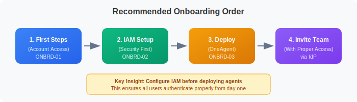
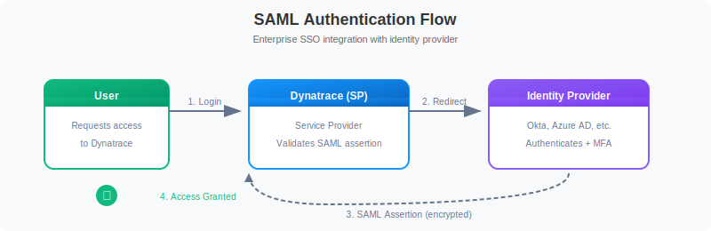
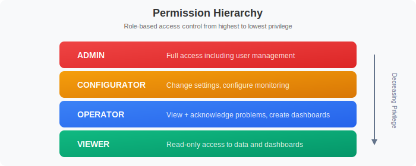

# IAM and Authentication

> **Series:** ONBRD | **Notebook:** 2 of 10 | **Created:** December 2025

## Setting Up Secure Access

Before inviting your team, configure authentication and permissions properly. This notebook covers SAML/SSO setup, API tokens, and the modern permission model.

---

## Table of Contents

1. Authentication Options
2. SAML/SSO Configuration
3. API Tokens
4. Permission Model
5. Creating Groups and Policies
6. Next Steps

---

## Prerequisites

- Account owner or admin access
- Identity provider details (for SSO)
- Understanding of your organization's access requirements

## 1. Why IAM First?

Setting up IAM before deploying OneAgent or inviting users ensures:

| Benefit | Why It Matters |
|---------|----------------|
| **Consistent access** | Users authenticate the same way from day one |
| **Proper permissions** | No accidental admin access for viewers |
| **Audit trail** | All access tied to corporate identity |
| **Offboarding** | Disabling IdP account revokes Dynatrace access |
| **Compliance** | Meet security requirements from the start |


<!-- MARKDOWN_TABLE_ALTERNATIVE
| Step | Description |
|------|-------------|
| 1. First Steps | Account access (ONBRD-01) |
| 2. IAM Setup | Security configuration (ONBRD-02) |
| 3. Deploy ActiveGate | Network routing (ONBRD-03) |
| 4. Deploy OneAgent | Start monitoring (ONBRD-04) |
| 5. Invite Team | Users join with proper access via IdP |
-->

## 2. Authentication Options

Dynatrace supports multiple authentication methods:

| Method | Description | Best For |
|--------|-------------|----------|
| **Local Users** | Built-in user accounts | Small teams, testing, break-glass accounts |
| **SAML 2.0** | Enterprise SSO integration | Most organizations |
| **OIDC** | OpenID Connect integration | Modern identity providers |

### Authentication Flow


<!-- MARKDOWN_TABLE_ALTERNATIVE
| Step | Description |
|------|-------------|
| 1. Login | User requests access to Dynatrace |
| 2. Redirect | Dynatrace redirects to Identity Provider |
| 3. Auth + MFA | User authenticates with IdP |
| 4. SAML Assertion | IdP sends encrypted assertion to Dynatrace |
| 5. Access Granted | User is logged in |
-->

### Common Identity Providers

- **Azure Active Directory (Entra ID)** - Microsoft environments
- **Okta** - Cloud-native identity
- **OneLogin** - Enterprise identity
- **PingFederate** - On-premises/hybrid
- **Google Workspace** - Google-centric organizations

## 3. Configuring SAML SSO

### Step 1: Access Account Management

**Location:** Account Management → Identity & access management → Single sign-on

You'll need these values for your IdP configuration:

| Field | Description |
|-------|-------------|
| **Entity ID** | Unique identifier for Dynatrace |
| **ACS URL** | Assertion Consumer Service URL |
| **Relay State** | Where users land after login |

### Step 2: Configure Your Identity Provider

In your IdP, create a new SAML application with:

1. **ACS URL** from Dynatrace
2. **Entity ID** from Dynatrace
3. **Name ID Format:** Email address (recommended)
4. **Required Attributes:**
   - `email` - User's email address
   - `firstName` - User's first name
   - `lastName` - User's last name

### Step 3: Configure Dynatrace

**Location:** Account Management → Identity & access management → Single sign-on

1. Upload or paste the IdP metadata XML
2. Or manually configure:
   - **IdP Entity ID** - From your IdP
   - **SSO URL** - Login endpoint
   - **Certificate** - IdP signing certificate
3. Configure attribute mappings
4. Save and test

### Step 4: Test SSO

Before enabling SSO for all users:

1. Open an incognito/private browser window
2. Navigate to your tenant URL (`https://{tenant-id}.apps.dynatrace.com`)
3. Select "Sign in with SSO"
4. Complete IdP authentication
5. Verify you land in Dynatrace with correct permissions

> **Warning:** Keep at least one local admin account as a break-glass option in case SSO fails.

## 4. User Groups and Permissions

### Permission Model

Dynatrace uses a policy-based access control model with the following permission levels:


<!-- MARKDOWN_TABLE_ALTERNATIVE
| Level | Access |
|-------|--------|
| Admin | Full access including user management |
| Configurator | Change settings, configure monitoring |
| Operator | View + acknowledge problems, create dashboards |
| Viewer | Read-only access to data and dashboards |
-->

### Recommended Groups

| Group | Role | Use Case |
|-------|------|----------|
| **Platform Admins** | Admin | Platform team, IAM management |
| **SRE Team** | Configurator | Workflow setup, monitoring config |
| **Developers** | Operator | Problem response, dashboards |
| **Stakeholders** | Viewer | Reports, read-only access |

### Creating Groups

**Location:** Account Management → Identity & access management → Groups

1. Click "Create group"
2. Name the group (e.g., "SRE-Team")
3. Add a description
4. Assign policies (permissions)
5. Optionally link to IdP groups for automatic membership

### Scoping Access with Policies

The modern platform uses **policies** to control what users can access:

| Policy Type | Purpose |
|-------------|--------|
| **Environment policies** | Access to specific environments |
| **Account policies** | Account-level management |
| **Data policies** | Access to specific data (via segments) |

> **Note:** For data filtering, use **Segments** (covered in ONBRD-05) rather than the legacy Management Zones.

## 5. API Token and OAuth Management

The modern platform supports two authentication methods for API access:

### API Tokens (for OneAgent, legacy integrations)

**Location:** Account Management → Access tokens

| Purpose | Required Scopes |
|---------|----------------|
| **OneAgent Deployment** | `InstallerDownload` |
| **Metric Ingestion** | `metrics.ingest` |
| **Log Ingestion** | `logs.ingest` |
| **Read Entities** | `entities.read` |

### OAuth 2.0 Clients (recommended for new integrations)

**Location:** Account Management → OAuth clients

OAuth 2.0 is the modern authentication method:

1. Create an OAuth client
2. Use client credentials flow to obtain bearer tokens
3. Tokens are short-lived and automatically rotated

### Token Best Practices

| Practice | Why |
|----------|-----|
| **Minimal scope** | Limit blast radius if compromised |
| **Descriptive names** | Know what each token is for |
| **Expiration dates** | Force rotation, reduce risk |
| **Separate tokens per use** | Revoke one without affecting others |
| **Never commit to code** | Use environment variables or secrets managers |
| **Prefer OAuth for new work** | Modern, short-lived tokens |

### Creating an API Token

1. Go to Account Management → Access tokens
2. Click "Generate new token"
3. Enter a descriptive name (e.g., "prod-oneagent-deployment")
4. Select required scopes
5. Set expiration (consider 90-365 days)
6. Click "Generate token"
7. **Copy the token immediately** - it won't be shown again

## 6. Verification Queries

After configuring IAM, verify your setup with these queries.

```dql
// Check recent audit log entries for user access
fetch logs, from: now() - 24h
| filter matchesPhrase(log.source, "audit")
| fields timestamp, content
| sort timestamp desc
| limit 50
```

```dql
// Check for authentication events (if audit logs enabled)
fetch logs, from: now() - 7d
| filter matchesPhrase(content, "login") or matchesPhrase(content, "authentication")
| fields timestamp, content
| sort timestamp desc
| limit 25
```

### Manual Verification Checklist

| Item | How to Verify |
|------|---------------|
| **SSO working** | Login via IdP in incognito window |
| **Groups created** | Check Account Management → Groups |
| **Permissions assigned** | Test with a viewer account |
| **Break-glass account** | Local admin login still works |
| **API tokens** | OneAgent deployment token ready |

## 7. Next Steps

With IAM configured, you're ready to:

1. **ONBRD-03: Deploying ActiveGate** - Set up network routing (if needed for restricted networks)
2. **ONBRD-04: Deploying OneAgent** - Start collecting infrastructure data
3. Invite team members via your IdP
4. Create additional API tokens or OAuth clients as needed

### IAM Tasks Before Moving On

- [ ] SAML/SSO configured and tested
- [ ] Break-glass local admin account documented
- [ ] User groups created for major roles
- [ ] OneAgent deployment token generated
- [ ] Token naming conventions established

---

## Summary

In this notebook, you learned:

- Why IAM should be configured before deploying agents
- Authentication options (Local, SAML, OIDC)
- How to configure SAML SSO
- Permission levels and group structure
- API token and OAuth best practices
- How to verify IAM configuration

---

## References

- [Identity and Access Management](https://docs.dynatrace.com/docs/manage/identity-access-management)
- [SAML Configuration](https://docs.dynatrace.com/docs/manage/identity-access-management/single-sign-on/saml-configuration)
- [OIDC Configuration](https://docs.dynatrace.com/docs/manage/identity-access-management/single-sign-on/configure-oidc)
- [Access Tokens](https://docs.dynatrace.com/docs/manage/access-control/access-tokens)
- [OAuth Clients](https://docs.dynatrace.com/docs/manage/identity-access-management/oauth-clients)
