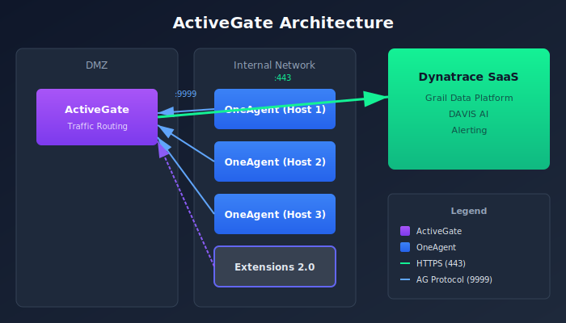
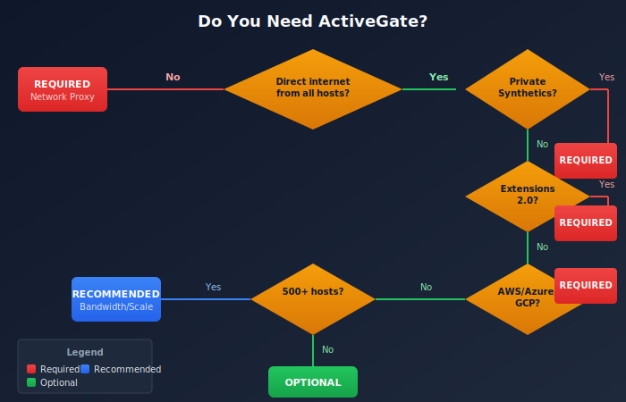
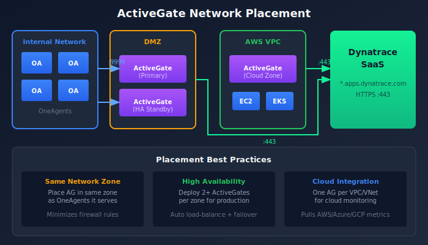
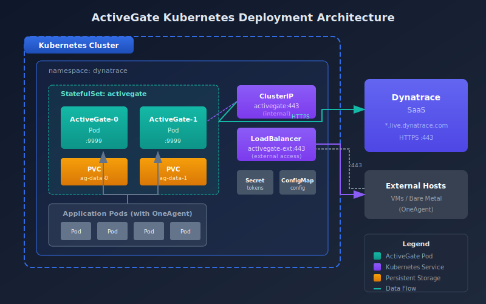

# Deploying ActiveGate

> **Series:** ONBRD | **Notebook:** 3 of 10 | **Created:** December 2025

## Your Network Gateway to Dynatrace

ActiveGate is a lightweight component that routes traffic between your infrastructure and Dynatrace. This notebook covers when you need ActiveGate, how many to deploy, where to place them, and installation steps - including comprehensive Kubernetes deployment options.

---

## Table of Contents

1. What is ActiveGate?
2. When Do You Need ActiveGate?
3. How Many ActiveGates? (Hardware Requirements)
4. Where to Deploy?
5. Generating Tokens
6. Installation Methods (Linux/Windows/Container)
6a. Kubernetes Deployment (Detailed)
7. Verifying Deployment
8. Troubleshooting
9. Next Steps

---

## Prerequisites

- Admin access to Dynatrace environment
- Network architecture diagram (know your zones)
- Server for ActiveGate (Linux, Windows, or Kubernetes cluster)
- Outbound HTTPS (443) to Dynatrace SaaS

## 1. What is ActiveGate?

ActiveGate is a proxy and routing component that connects your environment to Dynatrace.

| Component | Purpose |
|-----------|--------|
| **Environment ActiveGate** | Routes OneAgent traffic, runs extensions, executes synthetics |
| **Cluster ActiveGate** | Dynatrace Managed only - cluster communication |

> **Note:** This notebook covers Environment ActiveGate for Dynatrace SaaS.


<!-- MARKDOWN_TABLE_ALTERNATIVE
| Zone | Component | Connection |
|------|-----------|------------|
| DMZ | ActiveGate | → Dynatrace SaaS (443) |
| Internal | OneAgents | → ActiveGate (9999) |
| Restricted | OneAgents | → ActiveGate (9999) |
| Cloud | Extensions | → ActiveGate (9999) |
-->

### ActiveGate Capabilities

| Capability | Description |
|------------|-------------|
| **Traffic Routing** | Proxies OneAgent data to Dynatrace |
| **Extensions 2.0** | Runs Python-based extensions locally |
| **Synthetic Monitoring** | Private synthetic locations |
| **Cloud Integrations** | AWS, Azure, GCP metric collection |
| **Kubernetes API** | Cluster monitoring via API |
| **Log Ingest** | Generic log ingest endpoint |

## 2. When Do You Need ActiveGate?

### Required Scenarios

| Scenario | Why ActiveGate is Required |
|----------|---------------------------|
| **Network-restricted hosts** | OneAgents can't reach internet directly |
| **Private synthetic monitors** | Test internal applications |
| **Extensions 2.0** | Custom data sources (SNMP, databases, etc.) |
| **AWS/Azure/GCP monitoring** | Pull cloud metrics via API |
| **VMware monitoring** | vCenter integration |
| **Kubernetes full-stack** | Cluster API access for events, metrics |

### Optional but Recommended

| Scenario | Benefit |
|----------|--------|
| **Large deployments (500+ hosts)** | Reduces outbound connections |
| **Multiple network zones** | Centralized routing per zone |
| **Bandwidth optimization** | Compresses and batches data |
| **Security compliance** | Single egress point for audit |

### Decision Tree


<!-- MARKDOWN_TABLE_ALTERNATIVE
| Question | Yes → | No → |
|----------|-------|------|
| Can all hosts reach Dynatrace directly? | AG optional | AG required |
| Need private synthetic monitoring? | AG required | Continue |
| Using Extensions 2.0? | AG required | Continue |
| Monitoring AWS/Azure/GCP? | AG required | Continue |
| More than 500 hosts? | AG recommended | AG optional |
-->

## 3. How Many ActiveGates?

### Sizing Guidelines

| ActiveGate Size | OneAgents Supported | Memory | CPU |
|-----------------|---------------------|--------|-----|
| **Small** | Up to 500 | 2 GB | 2 cores |
| **Medium** | 500-1,500 | 4 GB | 4 cores |
| **Large** | 1,500-3,000 | 8 GB | 8 cores |
| **Extra Large** | 3,000-5,000 | 16 GB | 16 cores |

### Detailed Hardware Requirements

#### Minimum System Requirements

| Component | Minimum | Recommended |
|-----------|---------|-------------|
| **CPU** | 2 cores (x64) | 4+ cores |
| **RAM** | 2 GB | 4+ GB |
| **Disk Space** | 2 GB | 10+ GB (for logs/cache) |
| **Disk Type** | HDD | SSD (for extensions) |
| **Network** | 100 Mbps | 1 Gbps |

#### Operating System Support

| OS | Supported Versions |
|----|-------------------|
| **RHEL/CentOS** | 7.x, 8.x, 9.x |
| **Ubuntu** | 18.04, 20.04, 22.04, 24.04 LTS |
| **Debian** | 10, 11, 12 |
| **Amazon Linux** | 2, 2023 |
| **SUSE** | 12 SP5, 15 SPx |
| **Windows Server** | 2016, 2019, 2022 |

#### Memory Sizing by Workload

| Workload Type | Base Memory | Additional per Feature |
|---------------|-------------|----------------------|
| **Routing Only** | 2 GB | - |
| **+ Extensions 2.0** | 2 GB | +1-2 GB per active extension |
| **+ Synthetic** | 2 GB | +1 GB per 10 monitors |
| **+ Cloud Integration** | 2 GB | +512 MB per cloud account |
| **+ Log Ingest** | 2 GB | +2 GB for high volume |

#### Disk Space Sizing

| Purpose | Space Required |
|---------|---------------|
| **Base Installation** | 1.5 GB |
| **Log Files (default)** | 1-5 GB (rotated) |
| **Extension Cache** | 500 MB - 2 GB |
| **Synthetic Cache** | 500 MB - 1 GB |
| **Temporary Files** | 1 GB |
| **Recommended Total** | 10-20 GB |

> **Best Practice:** Mount `/opt/dynatrace` on a dedicated partition with at least 20 GB for production deployments.

### High Availability

For production environments, deploy **at least 2 ActiveGates per network zone**:

| Deployment | ActiveGates | Purpose |
|------------|-------------|--------|
| **Minimum HA** | 2 per zone | Failover capability |
| **Recommended** | 2-3 per zone | Load distribution + failover |
| **Large scale** | N+1 per zone | Capacity + redundancy |

> **Key Point:** OneAgents automatically load-balance across available ActiveGates and failover if one becomes unavailable.

### Example Deployment

| Network Zone | Hosts | ActiveGates | Sizing | Memory | CPU |
|--------------|-------|-------------|--------|--------|-----|
| Production DMZ | 200 | 2 | Small | 2 GB each | 2 cores |
| Production Internal | 800 | 2 | Medium | 4 GB each | 4 cores |
| Development | 150 | 1 | Small | 2 GB | 2 cores |
| **Total** | **1,150** | **5** | | **14 GB** | **14 cores** |

## 4. Where to Deploy?

### Network Zone Strategy

Deploy ActiveGates based on network segmentation:


<!-- MARKDOWN_TABLE_ALTERNATIVE
| Zone Type | ActiveGate Location | OneAgent Connection |
|-----------|--------------------|-----------------|
| DMZ | In DMZ with internet access | Internal hosts → DMZ AG |
| Internal | Internal segment | Internal hosts → Internal AG |
| Cloud VPC | Within VPC | Cloud workloads → VPC AG |
| Air-gapped | Edge with controlled egress | Isolated hosts → Edge AG |
-->

### Placement Rules

| Rule | Description |
|------|-------------|
| **Same network zone** | AG should be in same zone as OneAgents it serves |
| **Outbound access** | AG needs HTTPS to `*.dynatrace.com` |
| **Inbound from agents** | OneAgents connect to AG on port 9999 |
| **Low latency** | Place AG close to monitored workloads |

### Cloud-Specific Guidance

| Cloud | Recommendation |
|-------|---------------|
| **AWS** | Deploy in management VPC or shared services subnet |
| **Azure** | Hub VNet with peering to spoke VNets |
| **GCP** | Shared VPC host project |
| **Kubernetes** | Deploy as StatefulSet or standalone VM outside cluster |

## 5. Generating Tokens

ActiveGate requires a PaaS token for installation.

**Location:** Settings → Integration → Platform as a Service

Or use the API token approach:

### Required Token Scopes

| Scope | API Name | Purpose |
|-------|----------|--------|
| **PaaS integration - Installer download** | `InstallerDownload` | Download ActiveGate installer |

### Additional Scopes by Use Case

| Use Case | Additional Scopes |
|----------|------------------|
| **AWS Monitoring** | `aws.supportedServicesRead` |
| **Azure Monitoring** | `azure.supportedServicesRead` |
| **Extensions 2.0** | `extensions.read`, `extensions.write` |
| **Synthetic Private Location** | `syntheticLocations.write` |

### Token Naming Convention

Use descriptive names:
- `prod-activegate-dmz`
- `aws-activegate-useast1`
- `k8s-activegate-cluster1`

## 6. Installation Methods

### Linux Installation

```bash
# Download the installer
wget -O Dynatrace-ActiveGate.sh \
  "https://{tenant-id}.live.dynatrace.com/api/v1/deployment/installer/gateway/unix/latest?Api-Token={paas-token}"

# Make executable and run
chmod +x Dynatrace-ActiveGate.sh
sudo ./Dynatrace-ActiveGate.sh
```

### Windows Installation

```powershell
# Download the installer
Invoke-WebRequest -Uri "https://{tenant-id}.live.dynatrace.com/api/v1/deployment/installer/gateway/windows/latest?Api-Token={paas-token}" -OutFile Dynatrace-ActiveGate.exe

# Run the installer
.\Dynatrace-ActiveGate.exe
```

### Container Deployment (Docker/Podman)

```bash
docker run -d --name dynatrace-activegate \
  -e DT_TENANT="{tenant-id}" \
  -e DT_API_TOKEN="{paas-token}" \
  -p 9999:9999 \
  dynatrace/activegate:latest
```

### Installation Parameters

| Parameter | Purpose | Example |
|-----------|---------|--------|
| `--set-network-zone` | Assign to network zone | `--set-network-zone=dmz` |
| `--set-group` | Group for management | `--set-group=production` |
| `--enable-synthetic` | Enable synthetic capability | `--enable-synthetic` |

## 6a. Kubernetes Deployment (Detailed)

Deploying ActiveGate in Kubernetes requires careful consideration of where, how, and when to use containerized ActiveGates vs. traditional VM deployments.

### When to Deploy ActiveGate in Kubernetes

| Scenario | Deploy in K8s? | Reasoning |
|----------|----------------|-----------|
| **Cluster-only monitoring** | ✅ Yes | Co-located with workloads, simplifies networking |
| **Routing for in-cluster OneAgents** | ✅ Yes | Lower latency, no external hops |
| **Extensions 2.0 for K8s resources** | ✅ Yes | Direct access to cluster APIs |
| **Multi-cluster routing** | ⚠️ Consider | May need external AG for cross-cluster |
| **Private synthetic monitoring** | ❌ Usually VM | Synthetic requires stable network, not pod restarts |
| **Routing for external hosts** | ❌ VM preferred | External hosts need stable, routable IP |
| **Air-gapped environments** | ❌ VM preferred | Often need dedicated proxy tier |

### When NOT to Deploy in Kubernetes

| Scenario | Why VM is Better |
|----------|------------------|
| **Routing for VMs/bare metal** | VMs need stable IPs, not pod IPs |
| **Private synthetic locations** | Synthetic tests sensitive to pod restarts |
| **Extensions polling external systems** | External systems may not allow K8s egress IPs |
| **Compliance requiring dedicated hosts** | Some compliance requires dedicated hardware |

### Deployment Architecture


<!-- MARKDOWN_TABLE_ALTERNATIVE
| Component | Location | Purpose |
|-----------|----------|---------|
| ActiveGate StatefulSet | dynatrace namespace | Routing, extensions |
| Headless Service | dynatrace namespace | Pod DNS discovery |
| LoadBalancer Service | dynatrace namespace | External access (optional) |
| PVC (optional) | dynatrace namespace | Persistent logs/cache |
| ConfigMap | dynatrace namespace | Custom configuration |
| Secret | dynatrace namespace | API tokens |
-->

### Kubernetes Hardware Requirements

| Deployment Size | CPU Request | CPU Limit | Memory Request | Memory Limit |
|-----------------|-------------|-----------|----------------|--------------|
| **Small** (≤500 agents) | 500m | 2000m | 1Gi | 2Gi |
| **Medium** (500-1500) | 1000m | 4000m | 2Gi | 4Gi |
| **Large** (1500-3000) | 2000m | 8000m | 4Gi | 8Gi |
| **Extra Large** (3000+) | 4000m | 16000m | 8Gi | 16Gi |

### Method 1: Dynatrace Operator (Recommended)

The Dynatrace Operator manages ActiveGate lifecycle automatically.

```yaml
# dynakube.yaml - ActiveGate via Operator
apiVersion: dynatrace.com/v1beta2
kind: DynaKube
metadata:
  name: dynakube
  namespace: dynatrace
spec:
  apiUrl: https://{tenant-id}.live.dynatrace.com/api
  
  # ActiveGate configuration
  activeGate:
    # Capabilities to enable
    capabilities:
      - routing           # Route OneAgent traffic
      - kubernetes-monitoring  # K8s API monitoring
      - dynatrace-api     # Proxy Dynatrace API calls
    
    # Resource sizing
    resources:
      requests:
        cpu: "500m"
        memory: "1Gi"
      limits:
        cpu: "2000m"
        memory: "2Gi"
    
    # Number of replicas (HA)
    replicas: 2
    
    # Tolerations for dedicated nodes
    tolerations:
      - key: "dedicated"
        operator: "Equal"
        value: "dynatrace"
        effect: "NoSchedule"
    
    # Node selector (optional)
    nodeSelector:
      node-type: monitoring
    
    # Custom properties
    customProperties:
      value: |
        [connectivity]
        networkZone=kubernetes
    
    # Labels
    labels:
      app.kubernetes.io/component: activegate
```

**Install with Operator:**

```bash
# Create namespace
kubectl create namespace dynatrace

# Create secret with tokens
kubectl -n dynatrace create secret generic dynakube \
  --from-literal=apiToken=dt0c01.XXXXXXXX \
  --from-literal=paasToken=dt0c01.YYYYYYYY

# Install Dynatrace Operator via Helm
helm repo add dynatrace https://raw.githubusercontent.com/Dynatrace/dynatrace-operator/main/config/helm/repos/stable
helm repo update

helm install dynatrace-operator dynatrace/dynatrace-operator \
  --namespace dynatrace \
  --set installCRD=true

# Apply DynaKube configuration
kubectl apply -f dynakube.yaml
```

### Method 2: Helm Chart (Standalone)

For more control, use the standalone ActiveGate Helm chart:

```bash
# Add Dynatrace Helm repo
helm repo add dynatrace https://raw.githubusercontent.com/Dynatrace/dynatrace-operator/main/config/helm/repos/stable
helm repo update

# Create values file
cat > activegate-values.yaml << 'EOF'
apiUrl: "https://{tenant-id}.live.dynatrace.com/api"

activeGate:
  replicas: 2
  
  capabilities:
    - routing
    - kubernetes-monitoring
  
  resources:
    requests:
      cpu: 500m
      memory: 1Gi
    limits:
      cpu: 2
      memory: 2Gi
  
  # Persistent storage for logs
  persistence:
    enabled: true
    size: 10Gi
    storageClassName: gp3
  
  # Service configuration
  service:
    type: ClusterIP  # or LoadBalancer for external access
  
  # Environment variables
  env:
    - name: DT_NETWORK_ZONE
      value: "kubernetes"

# Token from existing secret
existingSecret: dynatrace-tokens
EOF

# Install
helm install activegate dynatrace/dynatrace-activegate \
  --namespace dynatrace \
  --values activegate-values.yaml
```

### Method 3: Raw Kubernetes Manifests

For complete control, use raw manifests:

```yaml
# activegate-namespace.yaml
apiVersion: v1
kind: Namespace
metadata:
  name: dynatrace
---
# activegate-secret.yaml
apiVersion: v1
kind: Secret
metadata:
  name: dynatrace-tokens
  namespace: dynatrace
type: Opaque
stringData:
  apiToken: "dt0c01.XXXXXXXXXXXXXXXX"
  paasToken: "dt0c01.YYYYYYYYYYYYYYYY"
---
# activegate-configmap.yaml
apiVersion: v1
kind: ConfigMap
metadata:
  name: activegate-config
  namespace: dynatrace
data:
  custom.properties: |
    [connectivity]
    networkZone=kubernetes
    
    [collector]
    MaxIncomingConnections=2000
---
# activegate-statefulset.yaml
apiVersion: apps/v1
kind: StatefulSet
metadata:
  name: activegate
  namespace: dynatrace
  labels:
    app: activegate
spec:
  serviceName: activegate
  replicas: 2
  selector:
    matchLabels:
      app: activegate
  template:
    metadata:
      labels:
        app: activegate
    spec:
      serviceAccountName: dynatrace-activegate
      containers:
        - name: activegate
          image: dynatrace/activegate:latest
          imagePullPolicy: Always
          env:
            - name: DT_TENANT
              value: "{tenant-id}"
            - name: DT_API_TOKEN
              valueFrom:
                secretKeyRef:
                  name: dynatrace-tokens
                  key: paasToken
            - name: DT_CAPABILITIES
              value: "routing,kubernetes_monitoring"
          ports:
            - containerPort: 9999
              name: ag-https
          resources:
            requests:
              cpu: "500m"
              memory: "1Gi"
            limits:
              cpu: "2000m"
              memory: "2Gi"
          volumeMounts:
            - name: config
              mountPath: /var/lib/dynatrace/gateway/config/custom.properties
              subPath: custom.properties
            - name: ag-data
              mountPath: /var/lib/dynatrace/gateway
          livenessProbe:
            httpGet:
              path: /rest/health
              port: 9999
              scheme: HTTPS
            initialDelaySeconds: 30
            periodSeconds: 15
          readinessProbe:
            httpGet:
              path: /rest/health
              port: 9999
              scheme: HTTPS
            initialDelaySeconds: 30
            periodSeconds: 5
      volumes:
        - name: config
          configMap:
            name: activegate-config
  volumeClaimTemplates:
    - metadata:
        name: ag-data
      spec:
        accessModes: ["ReadWriteOnce"]
        storageClassName: gp3
        resources:
          requests:
            storage: 10Gi
---
# activegate-service.yaml
apiVersion: v1
kind: Service
metadata:
  name: activegate
  namespace: dynatrace
spec:
  type: ClusterIP  # Change to LoadBalancer for external access
  selector:
    app: activegate
  ports:
    - port: 443
      targetPort: 9999
      name: https
---
# Headless service for StatefulSet DNS
apiVersion: v1
kind: Service
metadata:
  name: activegate-headless
  namespace: dynatrace
spec:
  clusterIP: None
  selector:
    app: activegate
  ports:
    - port: 9999
      name: ag-https
```

### Exposing ActiveGate for External Access

If external hosts need to route through the K8s ActiveGate:

```yaml
# Option 1: LoadBalancer Service
apiVersion: v1
kind: Service
metadata:
  name: activegate-external
  namespace: dynatrace
  annotations:
    # AWS NLB
    service.beta.kubernetes.io/aws-load-balancer-type: "nlb"
    service.beta.kubernetes.io/aws-load-balancer-scheme: "internal"
spec:
  type: LoadBalancer
  selector:
    app: activegate
  ports:
    - port: 443
      targetPort: 9999
---
# Option 2: Ingress (with TLS passthrough)
apiVersion: networking.k8s.io/v1
kind: Ingress
metadata:
  name: activegate-ingress
  namespace: dynatrace
  annotations:
    nginx.ingress.kubernetes.io/ssl-passthrough: "true"
    nginx.ingress.kubernetes.io/backend-protocol: "HTTPS"
spec:
  ingressClassName: nginx
  rules:
    - host: activegate.internal.example.com
      http:
        paths:
          - path: /
            pathType: Prefix
            backend:
              service:
                name: activegate
                port:
                  number: 443
```

### Platform-Specific Configurations

#### Amazon EKS

```yaml
# EKS-specific annotations
apiVersion: v1
kind: Service
metadata:
  name: activegate
  namespace: dynatrace
  annotations:
    service.beta.kubernetes.io/aws-load-balancer-type: "nlb"
    service.beta.kubernetes.io/aws-load-balancer-internal: "true"
    service.beta.kubernetes.io/aws-load-balancer-cross-zone-load-balancing-enabled: "true"
spec:
  type: LoadBalancer
  # ...
```

#### Azure AKS

```yaml
# AKS-specific annotations
apiVersion: v1
kind: Service
metadata:
  name: activegate
  namespace: dynatrace
  annotations:
    service.beta.kubernetes.io/azure-load-balancer-internal: "true"
spec:
  type: LoadBalancer
  # ...
```

#### Google GKE

```yaml
# GKE-specific annotations  
apiVersion: v1
kind: Service
metadata:
  name: activegate
  namespace: dynatrace
  annotations:
    cloud.google.com/load-balancer-type: "Internal"
spec:
  type: LoadBalancer
  # ...
```

### High Availability in Kubernetes

| Configuration | Setting |
|---------------|---------|
| **Replicas** | 2-3 for production |
| **Pod Anti-Affinity** | Spread across nodes |
| **PodDisruptionBudget** | minAvailable: 1 |
| **Resource Requests** | Guarantee scheduling |

```yaml
# Pod Anti-Affinity for HA
spec:
  affinity:
    podAntiAffinity:
      requiredDuringSchedulingIgnoredDuringExecution:
        - labelSelector:
            matchLabels:
              app: activegate
          topologyKey: kubernetes.io/hostname
---
# PodDisruptionBudget
apiVersion: policy/v1
kind: PodDisruptionBudget
metadata:
  name: activegate-pdb
  namespace: dynatrace
spec:
  minAvailable: 1
  selector:
    matchLabels:
      app: activegate
```

## 7. Verifying Deployment

After installation, verify ActiveGate is connected and healthy.

```dql
// List all ActiveGates and their status
fetch dt.entity.active_gate
| fields entity.name, state
| sort entity.name
```

```dql
// Check ActiveGate versions
fetch dt.entity.active_gate
| fields entity.name, state
| sort entity.name
```

```dql
// Count ActiveGates 
fetch dt.entity.active_gate
| summarize ag_count = count()
```

### Verification via UI

**Location:** Deployment status → ActiveGates

Check for:
- ✅ Status: Connected
- ✅ Version: Latest or recent
- ✅ Modules: Expected capabilities enabled

### Verification Commands

**Linux:**
```bash
# Check service status
sudo systemctl status dynatracegateway

# Check connectivity
curl -k https://localhost:9999/communication/health

# View logs
sudo tail -100 /var/log/dynatrace/gateway/gateway.log
```

**Windows:**
```powershell
# Check service status
Get-Service -Name "Dynatrace ActiveGate"

# Check connectivity
Invoke-WebRequest -Uri "https://localhost:9999/communication/health" -SkipCertificateCheck
```

## 8. Troubleshooting

### Common Issues

| Issue | Cause | Solution |
|-------|-------|----------|
| **Not appearing in UI** | Network blocked | Check firewall for 443 outbound |
| **Shows disconnected** | Service stopped | Restart dynatracegateway service |
| **OneAgents not routing** | Wrong network zone | Verify zone configuration |
| **High memory usage** | Too many agents | Add another AG or increase RAM |
| **Certificate errors** | Self-signed cert issue | Trust Dynatrace CA or use custom cert |

### Network Verification

```bash
# Test outbound to Dynatrace
curl -v https://{tenant-id}.live.dynatrace.com/communication/health

# Test ActiveGate is listening
netstat -tlnp | grep 9999

# Test from OneAgent host
curl -k https://{activegate-ip}:9999/communication/health
```

### Log Locations

| OS | Log Path |
|----|----------|
| **Linux** | `/var/log/dynatrace/gateway/` |
| **Windows** | `C:\ProgramData\dynatrace\gateway\log\` |

## 9. Next Steps

With ActiveGate deployed:

1. **ONBRD-04: Deploying OneAgent** - Now deploy agents that route through ActiveGate
2. Configure network zones if using multiple ActiveGates
3. Enable additional modules (synthetic, extensions) as needed
4. Set up monitoring for ActiveGate itself

### Deployment Checklist

#### Traditional (VM/Bare Metal)
- [ ] ActiveGate deployed in each required network zone
- [ ] At least 2 per zone for HA (production)
- [ ] Status shows "Connected" in Dynatrace
- [ ] Firewall rules configured (443 out, 9999 in)
- [ ] Network zones configured (if applicable)
- [ ] Sizing appropriate for expected OneAgent count

#### Kubernetes
- [ ] Dynatrace Operator installed (recommended)
- [ ] DynaKube CR applied with activeGate configuration
- [ ] Replicas set to 2+ for production HA
- [ ] Resource requests/limits configured
- [ ] PodDisruptionBudget created
- [ ] Pod anti-affinity configured for spread across nodes
- [ ] Service type appropriate (ClusterIP vs LoadBalancer)

---

## Summary

In this notebook, you learned:

- What ActiveGate does and its capabilities
- When ActiveGate is required vs. optional
- Hardware requirements and sizing guidelines
- How to size and plan ActiveGate deployment
- Where to place ActiveGates in your network
- Installation methods for Linux, Windows, and containers
- **Kubernetes deployment** using Operator, Helm, or raw manifests
- Platform-specific configurations for EKS, AKS, and GKE
- How to verify successful deployment

---

## References

### General
- [ActiveGate Overview](https://docs.dynatrace.com/docs/setup-and-configuration/dynatrace-activegate)
- [ActiveGate Installation](https://docs.dynatrace.com/docs/setup-and-configuration/dynatrace-activegate/installation)
- [Network Zones](https://docs.dynatrace.com/docs/manage/network-zones)
- [ActiveGate Sizing](https://docs.dynatrace.com/docs/setup-and-configuration/dynatrace-activegate/activegate-sizing)
- [Private Synthetic Locations](https://docs.dynatrace.com/docs/platform-modules/digital-experience/synthetic-monitoring/private-synthetic-locations)

### Kubernetes
- [Dynatrace Operator](https://docs.dynatrace.com/docs/setup-and-configuration/setup-on-k8s/installation)
- [Dynatrace Operator GitHub](https://github.com/Dynatrace/dynatrace-operator)
- [ActiveGate on Kubernetes](https://docs.dynatrace.com/docs/setup-and-configuration/setup-on-k8s/guides/operation/activegate)
- [DynaKube Custom Resource](https://docs.dynatrace.com/docs/setup-and-configuration/setup-on-k8s/reference/dynakube)
- [Helm Chart Repository](https://github.com/Dynatrace/dynatrace-operator/tree/main/config/helm)
