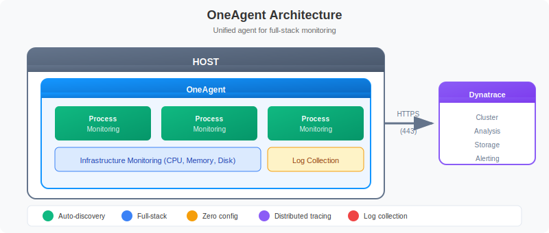

# Deploying OneAgent

> **Series:** ONBRD | **Notebook:** 5 of 10 | **Created:** December 2025

## Getting Data Into Dynatrace

OneAgent is the foundation of Dynatrace monitoring. This notebook covers deployment strategies, installation methods, and verification steps to ensure your infrastructure is reporting data.

---

## Table of Contents

1. What is OneAgent?
2. Deployment Strategy
3. Generating a Deployment Token
4. Installation Methods
5. Kubernetes Deployment
6. Verifying Deployment
7. Troubleshooting
8. Next Steps

---

## Prerequisites

- Admin access to Dynatrace environment
- API token with `InstallerDownload` scope (created in ONBRD-02)
- Root/admin access to target hosts
- Network access from hosts to Dynatrace (port 443) or ActiveGate (ONBRD-03)
- Cloud integrations configured (ONBRD-04) for full context

## 1. What is OneAgent?

OneAgent is Dynatrace's unified monitoring agent that:

| Capability | Description |
|------------|-------------|
| **Auto-discovery** | Automatically detects hosts, processes, services |
| **Full-stack** | Infrastructure, application, and user experience |
| **Zero configuration** | Works immediately after installation |
| **Distributed tracing** | End-to-end transaction visibility |
| **Log collection** | Collects and forwards log data |


<!-- MARKDOWN_TABLE_ALTERNATIVE
| Component | Location | Function |
|-----------|----------|----------|
| OneAgent | Host | Unified monitoring agent |
| Process Monitoring | Inside OneAgent | Monitors each running process |
| Infrastructure Monitoring | Inside OneAgent | CPU, Memory, Disk metrics |
| Log Collection | Inside OneAgent | Collects application logs |
| Dynatrace Cluster | Cloud | Analysis, storage, alerting |
-->

## 2. Deployment Strategy

### Phased Rollout (Recommended)

Don't deploy everywhere at once. Use a phased approach:

| Phase | Scope | Purpose |
|-------|-------|--------|
| **Pilot** | 2-5 non-critical hosts | Validate installation, network, discovery |
| **Expand** | One application tier | Test service detection, tracing |
| **Production** | Full environment | Complete coverage |

### Deployment Methods by Environment

| Environment | Recommended Method |
|-------------|-------------------|
| **Bare metal/VMs** | Direct install or package manager |
| **Kubernetes** | Dynatrace Operator |
| **OpenShift** | Dynatrace Operator |
| **AWS ECS** | Task definition sidecar |
| **Azure** | VM Extension or AKS Operator |
| **GCP** | Direct install or GKE Operator |

### Network Requirements

OneAgent needs outbound HTTPS (443) to:
- `*.apps.dynatrace.com` (SaaS)

If direct access isn't possible, OneAgents connect through **ActiveGate** (see ONBRD-03).

## 3. Generating a Deployment Token

You need an API token with installer download permissions.

**Location:** Account Management → Access tokens → Generate new token

### Required Scope

| Scope | API Name | Purpose |
|-------|----------|--------|
| **PaaS integration - Installer download** | `InstallerDownload` | Download OneAgent installer |

### Token Naming Convention

Use descriptive names:
- `prod-oneagent-deployment`
- `dev-installer-token`
- `k8s-operator-token`

> **Important:** Copy the token immediately after creation. It won't be shown again.

## 4. Installation Methods

### Linux (Direct Download)

```bash
# Download the installer
wget -O Dynatrace-OneAgent.sh \
  "https://{tenant-id}.apps.dynatrace.com/api/v1/deployment/installer/agent/unix/default/latest?Api-Token={token}&arch=x86&flavor=default"

# Run the installer
sudo /bin/sh Dynatrace-OneAgent.sh
```

### Linux (One-liner)

```bash
wget -O Dynatrace-OneAgent.sh "https://{tenant-id}.apps.dynatrace.com/api/v1/deployment/installer/agent/unix/default/latest?Api-Token={token}" && sudo /bin/sh Dynatrace-OneAgent.sh
```

### Windows (PowerShell)

```powershell
# Download the installer
Invoke-WebRequest -Uri "https://{tenant-id}.apps.dynatrace.com/api/v1/deployment/installer/agent/windows/default/latest?Api-Token={token}" -OutFile Dynatrace-OneAgent.exe

# Run the installer
.\Dynatrace-OneAgent.exe
```

### Configuration Management

For Ansible, Puppet, Chef, or other tools, see:
- [Ansible Collection](https://docs.dynatrace.com/docs/setup-and-configuration/dynatrace-oneagent/installation-and-operation/linux/installation/install-oneagent-on-linux#expand--oneagent-deployment-automation-with-ansible--2)
- [Puppet Module](https://forge.puppet.com/modules/dynatrace/dynatrace_oneagent)
- [Chef Cookbook](https://supermarket.chef.io/cookbooks/dynatrace)

## 5. Kubernetes Deployment

For Kubernetes environments, use the Dynatrace Operator.

### Prerequisites

- `kubectl` access to cluster
- API token with required scopes
- Cluster admin permissions

### Required Token Scopes for Kubernetes

| Scope | Purpose |
|-------|---------|
| `InstallerDownload` | Download OneAgent |
| `entities.read` | Read topology |
| `settings.read` | Read configuration |
| `settings.write` | Write configuration |
| `DataExport` | Export data (optional) |

### Installation Steps

1. **Navigate to Kubernetes monitoring**
   - Infrastructure → Kubernetes → Add cluster

2. **Follow the wizard**
   - Select your distribution
   - Choose observability options
   - Download dynakube.yaml

3. **Apply to cluster**
   ```bash
   kubectl apply -f https://github.com/Dynatrace/dynatrace-operator/releases/download/v1.3.2/kubernetes.yaml
   kubectl apply -f dynakube.yaml
   ```

4. **Verify deployment**
   ```bash
   kubectl get pods -n dynatrace
   ```

## 6. Verifying Deployment

After installation, verify OneAgent is reporting data.

```dql
// Check all hosts with OneAgent
fetch dt.entity.host
| fields entity.name, state, monitoringMode
| filter state == "RUNNING"
| sort entity.name
| limit 50
```

```dql
// Check hosts by monitoring state
fetch dt.entity.host
| summarize host_count = count(), by: {state, monitoringMode}
| sort host_count desc
```

```dql
// Check hosts by monitoring state - useful for verifying deployment
fetch dt.entity.host
| fields entity.name, state, monitoringMode
| summarize host_count = count(), by: {state}
| sort host_count desc
```

```dql
// Check discovered services
fetch dt.entity.service
| fields entity.name, serviceType
| summarize service_count = count(), by: {serviceType}
| sort service_count desc
```

```dql
// Check for processes discovered
fetch dt.entity.process_group
| fields entity.name
| sort entity.name
| limit 50
```

### Host Verification Commands

**Linux:**
```bash
# Check OneAgent status
sudo systemctl status oneagent

# Check connection to Dynatrace
sudo /opt/dynatrace/oneagent/agent/tools/oneagent-connection-check

# Check OneAgent logs
sudo tail -100 /var/log/dynatrace/oneagent/oneagent.log
```

**Windows:**
```powershell
# Check service status
Get-Service -Name "Dynatrace OneAgent"

# Check connection
& "C:\Program Files\dynatrace\oneagent\agent\tools\oneagent-connection-check.exe"
```

## 7. Troubleshooting

### Common Issues

| Issue | Cause | Solution |
|-------|-------|----------|
| **Host not appearing** | Network blocked | Check firewall rules for 443 |
| **Host showing but no data** | Agent not running | Restart OneAgent service |
| **Services not discovered** | Processes not restarted | Restart monitored applications |
| **Old OneAgent version** | Auto-update disabled | Enable auto-update or manual upgrade |
| **Connection errors** | Proxy required | Configure ActiveGate or proxy |

### Network Verification

```bash
# Test connectivity to Dynatrace
curl -v https://{tenant-id}.apps.dynatrace.com/api/v1/time

# Check DNS resolution
nslookup {tenant-id}.apps.dynatrace.com

# Test with OpenSSL
openssl s_client -connect {tenant-id}.apps.dynatrace.com:443
```

### Process Restart Requirement

OneAgent injects into running processes. After initial installation:

- **New processes** - Automatically monitored
- **Existing processes** - Restart required for full monitoring

For deep code-level visibility, restart:
- Application servers (Tomcat, JBoss, etc.)
- Web servers (Apache, Nginx, IIS)
- .NET/Java applications
- Node.js applications

## 8. Next Steps

With OneAgent deployed and verified:

1. **ONBRD-06: Organizing Your Environment** - Set up tags, segments, and naming conventions
2. Wait 15-30 minutes for full topology discovery
3. Check Smartscape for service dependencies
4. Plan broader rollout based on pilot results

### Deployment Checklist

- [ ] Pilot hosts deployed (2-5 hosts)
- [ ] Hosts appearing in Dynatrace
- [ ] OneAgent status "RUNNING" on all hosts
- [ ] Services being discovered
- [ ] Connection check passing
- [ ] Smartscape showing topology

---

## Summary

In this notebook, you learned:

- What OneAgent does and how it works
- Phased deployment strategy
- How to generate deployment tokens
- Installation methods for Linux, Windows, and Kubernetes
- How to verify successful deployment
- Common troubleshooting steps

---

## References

- [OneAgent Overview](https://docs.dynatrace.com/docs/setup-and-configuration/dynatrace-oneagent)
- [Linux Installation](https://docs.dynatrace.com/docs/setup-and-configuration/dynatrace-oneagent/installation-and-operation/linux/installation/install-oneagent-on-linux)
- [Windows Installation](https://docs.dynatrace.com/docs/setup-and-configuration/dynatrace-oneagent/installation-and-operation/windows/installation/install-oneagent-on-windows)
- [Kubernetes Operator](https://docs.dynatrace.com/docs/ingest-from/setup-on-k8s)
- [Deployment API](https://docs.dynatrace.com/docs/dynatrace-api/environment-api/deployment)
