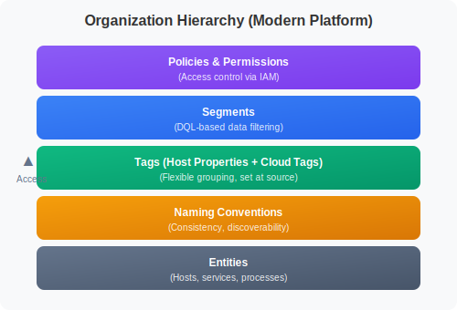

# Organizing Your Environment

> **Series:** ONBRD | **Notebook:** 6 of 10 | **Created:** December 2025

## Tags, Segments, and Naming Conventions

As your Dynatrace environment grows, organization becomes critical. This notebook covers how to structure your environment with tags, segments, and naming conventions for maintainability and access control.

---

## Table of Contents

1. Why Organization Matters
2. Modern Organization Building Blocks
3. Tagging with Host Properties and Cloud Tags
4. Segments for Data Filtering
5. Naming Conventions
6. Querying by Tags and Properties
7. Next Steps

---

## Prerequisites

- Admin or Configurator access to Dynatrace
- Entities discovered (hosts, services)
- Understanding of your organizational structure

## 1. Why Organization Matters

Without organization, Dynatrace environments become difficult to manage:

| Problem | Impact |
|---------|--------|
| **No structure** | Can't find entities quickly |
| **No ownership** | Don't know who to contact |
| **No access control** | Everyone sees everything |
| **No filtering** | Dashboards show irrelevant data |
| **No grouping** | Can't compare similar systems |

### Modern Organization Building Blocks


<!-- MARKDOWN_TABLE_ALTERNATIVE
| Layer | Purpose |
|-------|---------|
| Policies & Permissions | Access control via IAM |
| Segments | DQL-based data filtering |
| Tags | Flexible grouping, set at source |
| Naming Conventions | Consistency, discoverability |
| Entities | Hosts, services, processes |
-->

> **Note:** The modern Dynatrace platform uses **Segments** for data filtering and **Policies** for access control. This replaces the legacy Management Zones approach.

## 2. Modern Organization Building Blocks

The modern Dynatrace platform (Gen3/Grail) uses a "tag at source" approach rather than rule-based auto-tagging:

### Tag Sources

| Source | How It Works | Best For |
|--------|--------------|----------|
| **Host Properties** | Set via OneAgent configuration | Environment, team, tier metadata |
| **Cloud Provider Tags** | Automatically imported from AWS/Azure/GCP | Cloud resource organization |
| **Kubernetes Labels** | Imported from K8s metadata | Container workload organization |
| **OpenTelemetry Attributes** | Set in instrumentation | Custom service attributes |

### The "Enrich at Source" Philosophy


<!-- MARKDOWN_TABLE_ALTERNATIVE
| Stage | Description |
|-------|-------------|
| Infrastructure | Cloud tags, K8s labels |
| OneAgent | Host properties passed through |
| Dynatrace (Grail) | Queryable attributes |
-->

### Why "Tag at Source"?

| Benefit | Description |
|---------|-------------|
| **Consistent** | Same tags on metrics, logs, spans, and entities |
| **Scalable** | No processing overhead to apply rules |
| **Traceable** | Tags come from the source of truth |
| **Real-time** | No delay waiting for rule evaluation |

## 3. Tagging with Host Properties and Cloud Tags

### Host Properties (OneAgent)

Set custom properties during OneAgent installation or via configuration:

**During Installation:**
```bash
# Linux
sudo /bin/sh Dynatrace-OneAgent.sh \
  --set-host-property=env=production \
  --set-host-property=team=platform \
  --set-host-property=tier=backend

# Windows
.\Dynatrace-OneAgent.exe --set-host-property=env=production --set-host-property=team=checkout
```

**Via Configuration File:**
```
# /var/lib/dynatrace/oneagent/agent/config/hostcustomproperties.conf
env=production
team=platform
cost-center=engineering
```

### Recommended Property Categories

| Category | Example Properties | Purpose |
|----------|-------------------|--------|
| **Environment** | `env=prod`, `env=staging`, `env=dev` | Distinguish environments |
| **Owner** | `team=platform`, `team=checkout` | Identify responsible team |
| **Application** | `app=ecommerce`, `app=mobile-api` | Group by application |
| **Cost Center** | `cost-center=marketing` | Financial allocation |
| **Tier** | `tier=frontend`, `tier=backend` | Architecture layer |

### Cloud Provider Tags

Cloud tags are automatically imported when using cloud integrations:

| Cloud | Tag Format | DQL Field |
|-------|-----------|-----------|
| **AWS** | AWS resource tags | `aws.tag.*` |
| **Azure** | Azure resource tags | `azure.tag.*` |
| **GCP** | GCP labels | `gcp.label.*` |

**AWS Tag Example:**
If your EC2 instance has tag `Environment=Production`, it appears as `aws.tag.Environment` in Dynatrace.

### Kubernetes Labels

K8s labels are automatically available for container workloads:

| K8s Metadata | DQL Field |
|--------------|-----------|
| Namespace | `k8s.namespace.name` |
| Deployment | `k8s.deployment.name` |
| Pod labels | `k8s.pod.labels.*` |
| Node labels | `k8s.node.labels.*` |

## 4. Segments for Data Filtering

Segments provide DQL-based filtering to create focused views of your data.

**Location:** Observe and explore → Segments

### What are Segments?

Segments are reusable DQL filters that:
- Filter data in Notebooks, Dashboards, and Apps
- Can be applied as default context
- Are shareable across the organization

### Creating a Segment

1. Go to Observe and explore → Segments
2. Click "Create segment"
3. Define your DQL filter:
   ```dql
   dt.entity.host.properties.env == "production"
   ```
4. Name your segment (e.g., "Production Environment")
5. Save

### Segment Use Cases

| Use Case | Segment Filter | Purpose |
|----------|---------------|---------|
| **Environment** | `properties.env == "prod"` | Focus on production |
| **Team** | `properties.team == "checkout"` | Team-specific view |
| **Application** | `service.name contains "payment"` | Application focus |
| **Region** | `aws.tag.Region == "us-east-1"` | Geographic filtering |

### Segments vs Legacy Management Zones

| Feature | Segments | Management Zones (Legacy) |
|---------|----------|---------------------------|
| **Filter basis** | DQL expressions | Rule-based matching |
| **Data types** | All Grail data | Entities only |
| **Flexibility** | Highly flexible | Limited rule types |
| **Access control** | Use Policies instead | Built-in |
| **Modern platform** | ✅ Recommended | ⚠️ Being deprecated |

### Segment Best Practices

| Practice | Why |
|----------|-----|
| **Use host properties** | Consistent filtering |
| **Name clearly** | `Prod-Checkout-Team` not `Segment1` |
| **Document purpose** | Add description |
| **Test filters** | Verify expected data |

## 5. Naming Conventions

Consistent naming makes entities discoverable and filtering effective.

### Host Naming

Set meaningful host names that encode key information:

| Pattern | Example | Components |
|---------|---------|------------|
| `{env}-{tier}-{seq}` | `prod-web-01` | Environment, tier, sequence |
| `{region}-{app}-{role}` | `us-east-ecom-api` | Region, app, role |
| `{team}-{service}-{id}` | `checkout-cart-a1b2` | Team, service, unique ID |

### Host Naming via OneAgent

You can set a custom display name during installation:

```bash
sudo /bin/sh Dynatrace-OneAgent.sh --set-host-name="prod-web-01"
```

### Naming Principles

| Principle | Good | Bad |
|-----------|------|-----|
| **Descriptive** | `payment-service` | `svc-001` |
| **Consistent** | `prod-web-01`, `prod-web-02` | `prod-web-01`, `Web Server 2` |
| **Parseable** | `us-east-prod-checkout` | `USEastProdCheckout` |
| **Unique** | Include environment/region | Generic names |

### Property Naming Standards

For host properties, use consistent naming:

| Standard | Example | Why |
|----------|---------|-----|
| **Lowercase** | `env=prod` not `ENV=PROD` | Consistency |
| **Hyphen separated** | `cost-center=eng` | Readability |
| **Short keys** | `env` not `environment` | Query simplicity |
| **Consistent values** | Always `prod` not sometimes `production` | Filtering works |

## 6. Querying by Tags and Properties

Use host properties and cloud tags in DQL queries to filter and group data.

```dql
// Find hosts by name pattern
fetch dt.entity.host
| filter contains(entity.name, "prod")
| fields entity.name
| limit 20
```

```dql
// Count hosts by operating system type
fetch dt.entity.host
| summarize host_count = count(), by: {osType}
| sort host_count desc
```

```dql
// Find services by name pattern
fetch dt.entity.service
| filter contains(entity.name, "checkout")
| fields entity.name, serviceType
| limit 20
```

```dql
// Query logs filtered by host group (Kubernetes)
fetch logs, from: now() - 1h
| filter isNotNull(k8s.namespace.name)
| summarize log_count = count(), by: {k8s.namespace.name}
| sort log_count desc
| limit 20
```

```dql
// Query spans by service name pattern
fetch spans, from: now() - 1h
| filter span.kind == "server"
| filter contains(service.name, "payment")
| summarize request_count = count(), by: {service.name}
| sort request_count desc
| limit 20
```

```dql
// Find hosts by name pattern for environment identification
fetch dt.entity.host
| filter not(contains(entity.name, "prod"))
      and not(contains(entity.name, "staging"))
      and not(contains(entity.name, "dev"))
| fields entity.name
| limit 20
```

## 7. Next Steps

With organization in place:

1. **ONBRD-07: Understanding Your Data** - Explore what Dynatrace discovered
2. Define host properties for your environment
3. Create segments for team-specific views
4. Document your naming conventions

### Organization Checklist

- [ ] Host property strategy documented
- [ ] Properties set on OneAgent installations
- [ ] Cloud tags verified (if using cloud providers)
- [ ] Segments created for common filters
- [ ] Naming conventions established
- [ ] Access control configured via Policies (see ONBRD-02)

---

## Summary

In this notebook, you learned:

- Why organization matters for scalability
- The modern "tag at source" approach
- How to use host properties and cloud tags
- How to create and use Segments for filtering
- Naming convention best practices
- How to query by properties and attributes

---

## References

- [Host Properties](https://docs.dynatrace.com/docs/setup-and-configuration/dynatrace-oneagent/installation-and-operation/linux/installation/customize-oneagent-installation-on-linux)
- [Segments](https://docs.dynatrace.com/docs/observe-and-explore/segments)
- [Cloud Tags](https://docs.dynatrace.com/docs/setup-and-configuration/setup-on-cloud-platforms)
- [Kubernetes Labels](https://docs.dynatrace.com/docs/ingest-from/setup-on-k8s)
- [DQL Reference](https://docs.dynatrace.com/docs/platform/grail/dynatrace-query-language)
