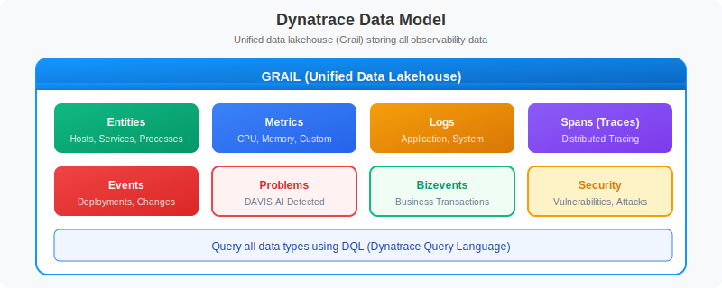
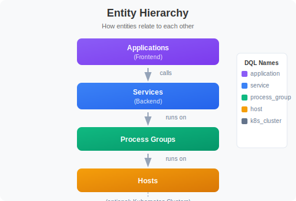

# Understanding Your Data

> **Series:** ONBRD | **Notebook:** 7 of 10 | **Created:** December 2025

## Exploring What Dynatrace Discovered

With OneAgent deployed, Dynatrace has automatically discovered your infrastructure, processes, and services. This notebook helps you understand what's been found and how to explore your data.

---

## Table of Contents

1. The Dynatrace Data Model
2. Entities and Relationships
3. Exploring Smartscape
4. Data Types in Grail
5. Discovery Queries
6. Next Steps

---

## Prerequisites

- OneAgent deployed on at least one host (ONBRD-05)
- Environment organized with tags (ONBRD-06)
- 15-30 minutes elapsed since deployment for full discovery
- DQL query permissions

## 1. The Dynatrace Data Model

Dynatrace organizes data into a unified model:


<!-- MARKDOWN_TABLE_ALTERNATIVE
| Data Type | Description | Example |
|-----------|-------------|---------|
| Entities | Monitored components | Host, Service, Process |
| Metrics | Numeric measurements | CPU usage, response time |
| Logs | Textual event records | Application log entry |
| Spans | Trace operations | HTTP request, DB query |
| Events | Point-in-time occurrences | Deployment, config change |
| Problems | DAVIS-detected issues | Service slowdown |
| Bizevents | Business transactions | Order placed, payment |
| Security | Vulnerabilities/attacks | CVE detection |
-->

### Key Concepts

| Concept | Description | Example |
|---------|-------------|--------|
| **Entity** | Any monitored component | Host, Service, Process |
| **Metric** | Numeric measurement over time | CPU usage, response time |
| **Log** | Textual event record | Application log entry |
| **Span** | Single operation in a trace | HTTP request, DB query |
| **Event** | Point-in-time occurrence | Deployment, config change |
| **Problem** | DAVIS-detected issue | Service slowdown |

## 2. Entities and Relationships

Dynatrace automatically discovers and relates entities:


<!-- MARKDOWN_TABLE_ALTERNATIVE
| Entity Type | DQL Name | What It Represents |
|-------------|----------|--------------------|
| Application | dt.entity.application | Frontend application |
| Service | dt.entity.service | Logical backend service |
| Process Group | dt.entity.process_group | Set of identical processes |
| Host | dt.entity.host | Physical or virtual machine |
| K8s Cluster | dt.entity.kubernetes_cluster | Kubernetes cluster |
-->

### Common Entity Types

| Entity Type | DQL Name | What It Represents |
|-------------|----------|--------------------|
| **Host** | `dt.entity.host` | Physical or virtual machine |
| **Process Group** | `dt.entity.process_group` | Set of identical processes |
| **Service** | `dt.entity.service` | Logical backend service |
| **Application** | `dt.entity.application` | Frontend application |
| **K8s Cluster** | `dt.entity.kubernetes_cluster` | Kubernetes cluster |
| **K8s Namespace** | `dt.entity.cloud_application_namespace` | K8s namespace |
| **K8s Workload** | `dt.entity.cloud_application` | Deployment, DaemonSet, etc. |

## 3. Exploring Topology

The topology view shows the visual representation of your environment.

**Location:** Infrastructure app → Hosts → Select any host → Dependencies

### Understanding Topology Layers

| Layer | Shows | Use Case |
|-------|-------|----------|
| **Applications** | Frontend apps, user sessions | User experience |
| **Services** | Backend services, APIs | Service dependencies |
| **Processes** | Running processes | Process mapping |
| **Hosts** | Servers, VMs, containers | Infrastructure view |

### Reading Topology Views

- **Nodes** = Entities
- **Lines** = Relationships (calls, runs on)
- **Line thickness** = Traffic volume
- **Colors** = Health status (green/yellow/red)

### Navigation Tips

- Click any entity to see details
- Use filters to focus on specific services
- Hover over connections to see traffic metrics
- Use the Services app for service-to-service dependencies

## 4. Data Types in Grail

Grail stores different data types with different retention and query patterns.

| Data Type | DQL Fetch | Typical Use |
|-----------|-----------|-------------|
| **Logs** | `fetch logs` | Troubleshooting, audit |
| **Spans** | `fetch spans` | Distributed tracing |
| **Metrics** | `timeseries` | Performance monitoring |
| **Events** | `fetch events` | Change tracking |
| **Problems** | `fetch dt.davis.problems` | Incident management |
| **Entities** | `fetch dt.entity.*` | Topology queries |
| **Bizevents** | `fetch bizevents` | Business transactions |

### Data Retention

Default retention varies by data type and license:

| Data Type | Typical Retention |
|-----------|-------------------|
| Metrics | 5 years (aggregated) |
| Logs | 35 days (configurable) |
| Spans | 35 days |
| Events | 35 days |
| Entity state | Real-time |

## 5. Discovery Queries

Use these queries to understand what Dynatrace has discovered in your environment.

### Infrastructure Discovery

```dql
// Count all entity types in your environment
fetch dt.entity.host | summarize hosts = count()
// Run separately for other types:
// fetch dt.entity.service | summarize services = count()
// fetch dt.entity.process_group | summarize process_groups = count()
```

```dql
// List all hosts with key details
fetch dt.entity.host
| fields entity.name, 
         state, 
         monitoringMode, 
         osType,
         cpuCores,
         physicalMemory
| sort entity.name
| limit 100
```

```dql
// Group hosts by OS type
fetch dt.entity.host
| summarize count = count(), by: {osType}
| sort count desc
```

### Service Discovery

```dql
// List all discovered services
fetch dt.entity.service
| fields entity.name, serviceType
| sort entity.name
| limit 100
```

```dql
// Group services by type
fetch dt.entity.service
| summarize count = count(), by: {serviceType}
| sort count desc
```

```dql
// Find services with recent traffic (spans)
fetch spans, from: now() - 1h
| filter span.kind == "server"
| summarize request_count = count(), by: {service.name}
| sort request_count desc
| limit 20
```

### Process Discovery

```dql
// List process groups
fetch dt.entity.process_group
| fields entity.name
| sort entity.name
| limit 50
```

```dql
// Count process groups
fetch dt.entity.process_group
| summarize count = count()
```

### Log Discovery

```dql
// Check log volume by source
fetch logs, from: now() - 1h
| summarize log_count = count(), by: {log.source}
| sort log_count desc
| limit 20
```

```dql
// Check log volume by severity
fetch logs, from: now() - 1h
| summarize log_count = count(), by: {loglevel}
| sort log_count desc
```

```dql
// Sample recent logs
fetch logs, from: now() - 15m
| fields timestamp, loglevel, log.source, content
| sort timestamp desc
| limit 25
```

### Kubernetes Discovery (if applicable)

```dql
// List Kubernetes clusters
fetch dt.entity.kubernetes_cluster
| fields entity.name
| sort entity.name
```

```dql
// List namespaces
fetch dt.entity.cloud_application_namespace
| fields entity.name
| sort entity.name
| limit 50
```

```dql
// List workloads (deployments, etc.)
fetch dt.entity.cloud_application
| fields entity.name
| sort entity.name
| limit 50
```

### Problems Discovery

```dql
// Check for recent problems
fetch dt.davis.problems, from: now() - 7d
| fields timestamp, display_id, title, status, affected_entity_types
| sort timestamp desc
| limit 20
```

```dql
// Problem summary by status
fetch dt.davis.problems, from: now() - 30d
| summarize problem_count = count(), by: {status}
| sort problem_count desc
```

## 6. Next Steps

Now that you understand your data:

1. **ONBRD-08: Your First Queries** - Learn DQL fundamentals
2. Explore topology for dependency visualization
3. Review any detected problems
4. Plan which additional hosts to instrument

### Discovery Checklist

- [ ] Hosts discovered and showing data
- [ ] Services detected and mapped
- [ ] Process groups visible
- [ ] Topology showing relationships
- [ ] Log ingestion working (if applicable)
- [ ] Kubernetes entities visible (if applicable)

---

## Summary

In this notebook, you learned:

- The Dynatrace data model (entities, metrics, logs, spans)
- How entities relate to each other
- How to navigate topology views
- Different data types stored in Grail
- Discovery queries for infrastructure, services, and logs

---

## References

- [Entities](https://docs.dynatrace.com/docs/discover-dynatrace/explore-data/entities)
- [Topology and Dependencies](https://docs.dynatrace.com/docs/observe-and-explore/services/service-analysis/service-flow)
- [Grail Data Model](https://docs.dynatrace.com/docs/platform/grail)
- [Entity Types Reference](https://docs.dynatrace.com/docs/discover-dynatrace/references/entity-types)
