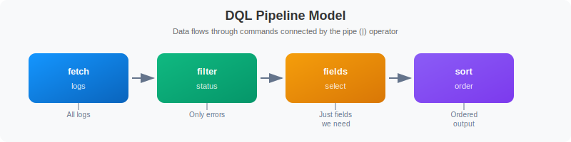

# Your First Queries

> **Series:** ONBRD | **Notebook:** 8 of 10 | **Created:** December 2025

## Learning DQL Fundamentals

Dynatrace Query Language (DQL) is how you access data in Grail. This notebook introduces the core concepts and patterns you'll use daily.

---

## Table of Contents

1. DQL Basics
2. The Pipeline Model
3. Fetching Data
4. Filtering
5. Selecting Fields
6. Aggregating with Summarize
7. Sorting and Limiting
8. Time Ranges
9. Common Patterns
10. Next Steps

---

## Prerequisites

- Dynatrace environment with data (ONBRD-05, ONBRD-06, ONBRD-07)
- DQL query permissions
- Access to Notebooks or the DQL query interface

## 1. DQL Basics

DQL is a **pipeline-based query language**—not SQL. Data flows through a series of commands connected by the pipe (`|`) operator.


<!-- MARKDOWN_TABLE_ALTERNATIVE
| Stage | Command | Result |
|-------|---------|--------|
| 1 | fetch logs | All logs |
| 2 | filter status | Only errors |
| 3 | fields select | Just fields we need |
| 4 | sort order | Ordered output |
-->

### DQL vs SQL

| DQL | SQL | Note |
|-----|-----|------|
| `fetch logs` | `SELECT * FROM logs` | Start with data source |
| `\| filter x == "y"` | `WHERE x = 'y'` | Use `==`, double quotes |
| `\| fields a, b` | `SELECT a, b` | Field selection after fetch |
| `\| summarize count()` | `SELECT COUNT(*)` | Aggregation command |
| `by: {field}` | `GROUP BY field` | Grouping syntax |
| `{"a", "b"}` | `('a', 'b')` | Array syntax (curly braces) |

## 2. The Pipeline Model

Each command in the pipeline operates on the output of the previous command:

```dql
fetch logs                        // 1. Get all logs
| filter loglevel == "error"     // 2. Keep only errors
| filter timestamp > now() - 1h  // 3. Last hour only
| fields timestamp, content      // 4. Select columns
| sort timestamp desc            // 5. Order by time
| limit 100                      // 6. Take first 100
```

### Order Matters

- **Filter early** - Reduces data before expensive operations
- **Select fields** - Reduces memory usage
- **Aggregate** - Summarize before sorting
- **Sort** - Order the final results
- **Limit** - Control output size

## 3. Fetching Data

Every DQL query starts with a `fetch` command specifying the data source.

```dql
// Fetch logs (most common)
fetch logs
| limit 10
```

```dql
// Fetch spans (distributed traces)
fetch spans
| limit 10
```

```dql
// Fetch entity data (hosts)
fetch dt.entity.host
| limit 10
```

```dql
// Fetch problems
fetch dt.davis.problems
| limit 10
```

### Common Data Sources

| Source | Description |
|--------|-------------|
| `logs` | Log records |
| `spans` | Distributed trace spans |
| `events` | System events |
| `bizevents` | Business events |
| `dt.entity.host` | Host entities |
| `dt.entity.service` | Service entities |
| `dt.entity.process_group` | Process group entities |
| `dt.davis.problems` | Detected problems |

## 4. Filtering

Use `filter` to narrow results. Filter as early as possible for performance.

```dql
// Filter by equality
fetch logs
| filter loglevel == "error"
| limit 20
```

```dql
// Filter with multiple conditions (AND)
fetch logs
| filter loglevel == "error"
| filter timestamp > now() - 1h
| limit 20
```

```dql
// Filter with OR condition
fetch logs
| filter loglevel == "error" or loglevel == "warn"
| limit 20
```

```dql
// Filter using IN for multiple values
fetch logs
| filter in(loglevel, {"error", "warn", "fatal"})
| limit 20
```

```dql
// Filter with string matching
fetch logs
| filter contains(content, "timeout")
| limit 20
```

### Filter Operators

| Operator | Example | Description |
|----------|---------|-------------|
| `==` | `field == "value"` | Equals |
| `!=` | `field != "value"` | Not equals |
| `>`, `<` | `count > 10` | Greater/less than |
| `>=`, `<=` | `count >= 10` | Greater/less or equal |
| `and`, `or` | `a == 1 and b == 2` | Logical operators |
| `in()` | `in(field, {"a", "b"})` | Value in set |
| `contains()` | `contains(field, "text")` | Substring match |
| `isNull()` | `isNull(field)` | Field is null |
| `isNotNull()` | `isNotNull(field)` | Field is not null |

## 5. Selecting Fields

Use `fields` to select specific columns. This improves readability and performance.

```dql
// Select specific fields from logs
fetch logs
| fields timestamp, loglevel, log.source, content
| limit 20
```

```dql
// Create calculated fields
fetch spans
| fields span.name, 
         duration,
         duration_ms = duration / 1000000.0
| limit 20
```

```dql
// Rename fields with aliases
fetch dt.entity.host
| fields name = entity.name,
         status = state,
         os = osType
| limit 20
```

### fieldsAdd vs fields

| Command | Effect |
|---------|--------|
| `fields` | Keeps only specified fields |
| `fieldsAdd` | Adds new fields, keeps all existing |

```dql
// fieldsAdd keeps existing fields and adds new ones
fetch spans
| fieldsAdd duration_ms = duration / 1000000.0
| fields span.name, duration, duration_ms
| limit 10
```

## 6. Aggregating with Summarize

Use `summarize` to aggregate data. Combine with `by:` for grouping.

```dql
// Simple count
fetch logs, from: now() - 1h
| summarize total_logs = count()
```

```dql
// Count by group
fetch logs, from: now() - 1h
| summarize log_count = count(), by: {loglevel}
| sort log_count desc
```

```dql
// Multiple aggregations
fetch spans, from: now() - 1h
| filter span.kind == "server"
| summarize 
    request_count = count(),
    avg_duration = avg(duration),
    max_duration = max(duration),
    by: {service.name}
| sort request_count desc
| limit 20
```

```dql
// Conditional counting
fetch spans, from: now() - 1h
| filter span.kind == "server"
| summarize
    total = count(),
    errors = countIf(span.status_code == "error"),
    by: {service.name}
| fieldsAdd error_rate = 100.0 * errors / total
| sort error_rate desc
| limit 20
```

### Common Aggregation Functions

| Function | Description |
|----------|-------------|
| `count()` | Count records |
| `countIf(condition)` | Count where condition is true |
| `sum(field)` | Sum values |
| `avg(field)` | Average value |
| `min(field)` | Minimum value |
| `max(field)` | Maximum value |
| `percentile(field, 95)` | 95th percentile |

## 7. Sorting and Limiting

Control output order and size.

```dql
// Sort descending (newest first)
fetch logs, from: now() - 1h
| fields timestamp, loglevel, content
| sort timestamp desc
| limit 20
```

```dql
// Sort by multiple fields
fetch spans, from: now() - 1h
| filter span.kind == "server"
| summarize request_count = count(), by: {service.name}
| sort request_count desc
| limit 10
```

```dql
// Find slowest spans
fetch spans, from: now() - 1h
| fields span.name, service.name, duration
| sort duration desc
| limit 10
```

## 8. Time Ranges

Control the time range for your queries.

```dql
// Last hour (using from: parameter)
fetch logs, from: now() - 1h
| summarize count()
```

```dql
// Specific time range
fetch logs, from: now() - 24h, to: now() - 12h
| summarize count()
```

```dql
// Last 7 days
fetch dt.davis.problems, from: now() - 7d
| summarize problem_count = count(), by: {status}
```

### Time Units

| Unit | Example | Description |
|------|---------|-------------|
| `s` | `now() - 30s` | Seconds |
| `m` | `now() - 15m` | Minutes |
| `h` | `now() - 2h` | Hours |
| `d` | `now() - 7d` | Days |

## 9. Common Patterns

Here are patterns you'll use frequently.

### Error Investigation

```dql
// Find error logs with context
fetch logs, from: now() - 1h
| filter loglevel == "error"
| fields timestamp, log.source, content
| sort timestamp desc
| limit 50
```

### Service Performance

```dql
// Service response time summary
fetch spans, from: now() - 1h
| filter span.kind == "server"
| summarize
    requests = count(),
    avg_ms = avg(duration) / 1000000.0,
    p95_ms = percentile(duration, 95) / 1000000.0,
    by: {service.name}
| sort requests desc
| limit 20
```

### Log Volume Analysis

```dql
// Log volume by source and severity
fetch logs, from: now() - 1h
| summarize log_count = count(), by: {log.source, loglevel}
| sort log_count desc
| limit 30
```

### Entity Inventory

```dql
// Host inventory with details
fetch dt.entity.host
| fields 
    name = entity.name,
    state,
    os = osType,
    cores = cpuCores
| sort name
| limit 50
```

## 10. Next Steps

With DQL fundamentals covered:

1. **ONBRD-09: Setting Up Alerts** - Configure alerting and notifications
2. Practice with your own data
3. Explore the DQL documentation for advanced functions
4. Try creating queries in Notebooks

### DQL Checklist

- [ ] Understand the pipeline model
- [ ] Can fetch different data types
- [ ] Can filter with conditions
- [ ] Can select and calculate fields
- [ ] Can aggregate with summarize
- [ ] Can sort and limit results
- [ ] Can specify time ranges

---

## Summary

In this notebook, you learned:

- DQL uses a pipeline model (not SQL)
- `fetch` starts every query
- `filter` narrows results
- `fields` selects and calculates columns
- `summarize` aggregates data
- `sort` and `limit` control output
- Time ranges with `from:` and `to:`

---

## References

- [DQL Reference](https://docs.dynatrace.com/docs/platform/grail/dynatrace-query-language)
- [DQL Functions](https://docs.dynatrace.com/docs/platform/grail/dynatrace-query-language/functions)
- [DQL Commands](https://docs.dynatrace.com/docs/platform/grail/dynatrace-query-language/commands)
- [DQL Examples](https://docs.dynatrace.com/docs/platform/grail/dynatrace-query-language/dql-examples)
