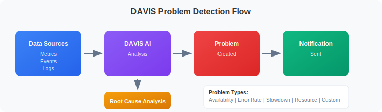
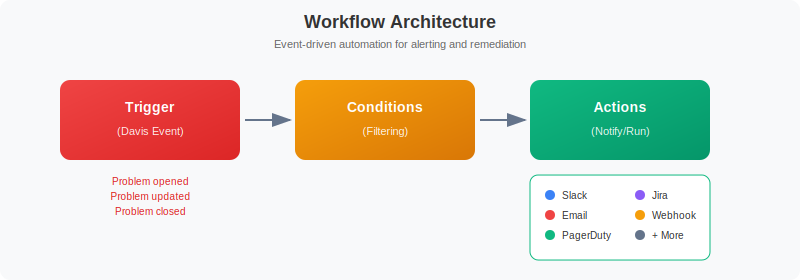
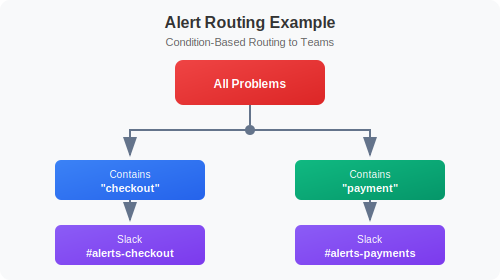

# Setting Up Alerts

> **Series:** ONBRD | **Notebook:** 9 of 10 | **Created:** December 2025

## Getting Notified When Things Go Wrong

Dynatrace's DAVIS AI automatically detects problems, but you need to configure where those alerts go. This notebook covers the Workflows app for modern alerting and notification routing.

---

## Table of Contents

1. How DAVIS Problem Detection Works
2. Modern Alerting with Workflows
3. Creating Your First Workflow
4. Notification Actions
5. Routing Alerts to Teams
6. Custom Metric Alerts
7. Monitoring Your Alerts
8. Next Steps

---

## Prerequisites

- Configurator or Admin access
- DQL fundamentals (ONBRD-08)
- Access to notification target (email, Slack, PagerDuty, etc.)

## 1. How DAVIS Problem Detection Works

DAVIS AI continuously monitors your environment and creates **problems** when anomalies are detected:


<!-- MARKDOWN_TABLE_ALTERNATIVE
| Stage | Description |
|-------|-------------|
| Data Sources | Metrics, Events, Logs |
| DAVIS AI | Analysis and anomaly detection |
| Problem Created | Issue identified |
| Notification Sent | Teams alerted |
| Root Cause Analysis | Automatic correlation |
-->

### Problem Types

| Type | Trigger | Example |
|------|---------|--------|
| **Availability** | Service/process unavailable | Database crashed |
| **Error rate** | Error rate increases | 500 errors spike |
| **Slowdown** | Response time degradation | Latency increase |
| **Resource** | CPU, memory, disk issues | Disk full |
| **Custom** | Metric thresholds breached | Custom alert |

## 2. Modern Alerting with Workflows

The Workflows app is the modern platform's approach to alerting and automation.

**Location:** Automate → Workflows

### What are Workflows?

Workflows are event-driven automations that can:
- React to DAVIS problems
- Send notifications to various channels
- Execute remediation actions
- Run on schedules


<!-- MARKDOWN_TABLE_ALTERNATIVE
| Stage | Description |
|-------|-------------|
| Trigger | Davis Event (problem opened/updated/closed) |
| Conditions | Filtering logic |
| Actions | Slack, Email, PagerDuty, Jira, Webhook, etc. |
-->

### Workflow vs Legacy Alerting Profiles

| Feature | Workflows | Alerting Profiles (Legacy) |
|---------|-----------|---------------------------|
| **Trigger types** | Events, schedules, manual | Davis problems only |
| **Filtering** | JavaScript expressions | Rule-based |
| **Actions** | 20+ built-in actions | Fixed notifications |
| **Automation** | Full automation capability | Notification only |
| **Modern platform** | Recommended | Being deprecated |

## 3. Creating Your First Workflow

### Step 1: Open the Workflows App

**Location:** Automate → Workflows → Create workflow

### Step 2: Configure the Trigger

1. Click "Add trigger"
2. Select "Davis problem" trigger
3. Configure trigger options:
   - **Problem opens** - When a new problem is detected
   - **Problem updates** - When problem details change
   - **Problem closes** - When a problem is resolved

### Step 3: Add Conditions (Optional)

Filter which problems trigger the workflow:

```javascript
// Example: Only production problems
event["event.category"] == "AVAILABILITY" 
  && event["affected_entity_ids"].some(id => id.includes("prod"))
```

### Step 4: Add Actions

1. Click "+" to add an action
2. Select action type (Slack, Email, PagerDuty, etc.)
3. Configure the action parameters

### Basic Workflow Example

```
Trigger: Davis problem opens
Condition: event["event.category"] == "ERROR"
Action: Send Slack message to #alerts channel
```

### Workflow Settings

| Setting | Description |
|---------|-------------|
| **Name** | Descriptive workflow name |
| **Description** | What this workflow does |
| **Owner** | User or service account |
| **State** | Enabled/Disabled |

## 4. Notification Actions

Workflows support multiple notification channels.

### Built-in Notification Actions

| Action | Use Case |
|--------|----------|
| **Send email** | Basic notifications |
| **Send Slack message** | Team channels |
| **Send Microsoft Teams message** | Team channels |
| **Create PagerDuty incident** | On-call paging |
| **Create ServiceNow incident** | Incident tickets |
| **Create Jira issue** | Issue tracking |
| **Send webhook** | Custom integrations |
| **Create OpsGenie alert** | Alert management |

### Setting Up Slack Notifications

1. First, connect Slack to Dynatrace:
   - Go to Settings → Integration → Slack
   - Follow the OAuth flow to connect your workspace

2. In your workflow, add a Slack action:
   - Select channel
   - Configure message template
   - Use variables for dynamic content

### Message Templates

Use Jinja2 templates for dynamic messages:

```
🚨 *Problem Detected*
*Title:* {{ event["title"] }}
*Severity:* {{ event["event.category"] }}
*Status:* {{ event["event.status"] }}
*Link:* {{ event["problem_url"] }}
```

### Setting Up Email Notifications

1. Add "Send email" action to workflow
2. Configure:
   - Recipients (to, cc, bcc)
   - Subject line (can use templates)
   - Body content (HTML or plain text)

### Setting Up PagerDuty

1. Go to Settings → Integration → PagerDuty
2. Configure your PagerDuty integration key
3. Add "Create PagerDuty incident" action to workflow
4. Map severity levels appropriately

## 5. Routing Alerts to Teams

Use workflow conditions to route alerts to the right teams.

### Strategy: Condition-Based Routing


<!-- MARKDOWN_TABLE_ALTERNATIVE
| Filter | Destination |
|--------|-------------|
| Contains "checkout" | #alerts-checkout |
| Contains "payment" | #alerts-payments |
-->

### Routing by Entity Name

```javascript
// Route checkout team alerts
event["affected_entity_ids"].some(id => 
  id.toLowerCase().includes("checkout")
)
```

### Routing by Problem Category

```javascript
// Route availability issues to SRE
event["event.category"] == "AVAILABILITY"

// Route performance issues to app team
event["event.category"] == "SLOWDOWN"
```

### Example Multi-Team Setup

| Team | Workflow | Condition | Channel |
|------|----------|-----------|---------|
| Checkout | `checkout-alerts` | Entity contains "checkout" | Slack #alerts-checkout |
| Payments | `payments-alerts` | Entity contains "payment" | PagerDuty Payments |
| Platform | `critical-alerts` | Category == "AVAILABILITY" | PagerDuty Platform |

### Creating Team-Specific Workflows

1. Create one workflow per team/routing need
2. Use conditions to filter problems
3. Send to appropriate channel
4. Include relevant context in message

## 6. Custom Metric Alerts

Create alerts based on specific metric thresholds using the Davis analyzer in Workflows.

### When to Use Custom Metric Alerts

| Scenario | Configuration |
|----------|---------------|
| **Disk > 90%** | Static threshold |
| **Queue depth spike** | Deviation from baseline |
| **Business metric** | Custom metric threshold |
| **SLO breach** | SLO burn rate |

### Creating a Metric-Based Workflow

1. Go to Automate → Workflows
2. Create new workflow
3. Add trigger: "Davis problem" 
4. Add condition to filter for metric events
5. Add notification action

### Using Davis Analyzers

Davis analyzers can detect anomalies in metrics:

- **Static threshold** - Alert when value exceeds X
- **Auto-adaptive baseline** - Alert on deviations from normal
- **Seasonal patterns** - Account for time-based variations

### Example: High CPU Alert

1. Create workflow with Davis problem trigger
2. Add condition:
   ```javascript
   event["title"].includes("CPU") && 
   event["event.category"] == "RESOURCE"
   ```
3. Add Slack notification action

```dql
// Recent problems
fetch dt.davis.problems, from: now() - 24h
| fields timestamp, display_id, title, status, affected_entity_types
| sort timestamp desc
| limit 20
```

```dql
// Problem count by status
fetch dt.davis.problems, from: now() - 7d
| summarize count = count(), by: {status}
| sort count desc
```

```dql
// Problems by day
fetch dt.davis.problems, from: now() - 7d
| fieldsAdd day = bin(timestamp, 1d)
| summarize problem_count = count(), by: {day}
| sort day desc
```

```dql
// Active problems right now
fetch dt.davis.problems, from: now() - 30d
| filter status == "OPEN"
| fields timestamp, display_id, title, affected_entity_types
| sort timestamp desc
```

```dql
// Problem duration analysis
fetch dt.davis.problems, from: now() - 7d
| filter status == "CLOSED"
| filter isNotNull(end_time)
| fieldsAdd duration_minutes = (end_time - timestamp) / 60000000000
| summarize
    avg_duration = avg(duration_minutes),
    max_duration = max(duration_minutes),
    problem_count = count()
```

### Alert Testing Checklist

After configuring workflows:

1. **Test notification delivery** - Use workflow test feature
2. **Verify routing** - Confirm correct channels receive alerts
3. **Check formatting** - Review message content
4. **Validate conditions** - Ensure filters work as expected
5. **Test resolution** - Confirm close notifications work

### Workflow Execution History

View workflow runs in:
- Automate → Workflows → Select workflow → Executions

Check for:
- Successful runs
- Failed runs with error details
- Action outputs

## 8. Next Steps

With alerting configured:

1. **ONBRD-10: Building Dashboards** - Visualize your data
2. Fine-tune workflow conditions based on alert volume
3. Set up escalation paths with multiple workflows
4. Document on-call procedures

### Alerting Checklist

- [ ] Slack/Email integration configured
- [ ] First workflow created and tested
- [ ] Team-specific workflows configured
- [ ] Test notifications sent successfully
- [ ] Critical path to on-call established
- [ ] Escalation procedures documented

---

## Summary

In this notebook, you learned:

- How DAVIS problem detection works
- How to create workflows for alerting
- How to configure notification actions
- How to route alerts to teams using conditions
- How to create custom metric alerts
- How to monitor workflow effectiveness

---

## References

- [Problem Detection](https://docs.dynatrace.com/docs/platform/davis-ai/basics/problem-detection)
- [Workflows](https://docs.dynatrace.com/docs/platform-modules/automations/workflows)
- [Workflow Actions](https://docs.dynatrace.com/docs/platform-modules/automations/workflows/actions)
- [Slack Integration](https://docs.dynatrace.com/docs/platform-modules/automations/workflows/actions/slack)
- [PagerDuty Integration](https://docs.dynatrace.com/docs/platform-modules/automations/workflows/actions/pagerduty)
