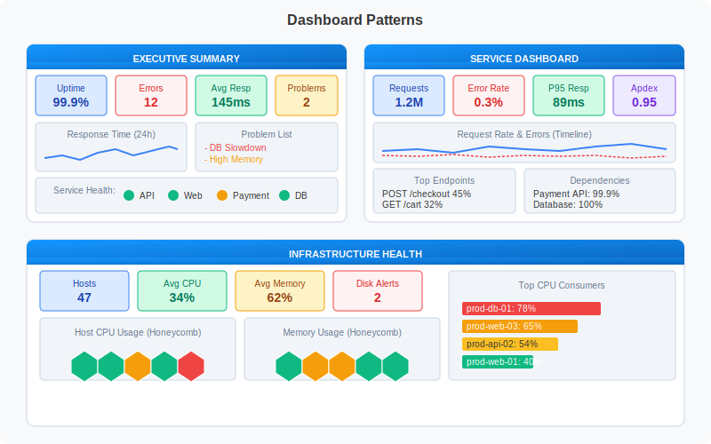

# Building Dashboards

> **Series:** ONBRD | **Notebook:** 10 of 10 | **Created:** December 2025

## Visualizing Your Data

Dashboards provide at-a-glance visibility into your environment's health and performance. This notebook covers dashboard creation, common visualization patterns, and sharing with your team.

---

## Table of Contents

1. Dashboards vs Notebooks
2. Creating Your First Dashboard
3. Common Tile Types
4. Dashboard Patterns
5. Useful Queries for Dashboards
6. Sharing and Permissions
7. Next Steps

---

## Prerequisites

- Viewer access or higher
- Familiarity with DQL (ONBRD-08)
- Data in your environment to visualize

## 1. Dashboards vs Notebooks

Dynatrace offers two visualization tools:

| Feature | Dashboard | Notebook |
|---------|-----------|----------|
| **Purpose** | Monitoring at a glance | Interactive analysis |
| **Layout** | Fixed grid tiles | Sequential document |
| **Auto-refresh** | Yes | Manual |
| **Interactivity** | Click-through links | Query editing |
| **Sharing** | Wall displays, reports | Investigation documentation |
| **Best for** | NOC screens, status pages | Troubleshooting, exploration |

### When to Use Each

| Scenario | Use |
|----------|-----|
| Team status display | Dashboard |
| Incident investigation | Notebook |
| Executive summary | Dashboard |
| Root cause analysis | Notebook |
| SLA reporting | Dashboard |
| Ad-hoc queries | Notebook |

## 2. Creating Your First Dashboard

**Location:** Observe and explore → Dashboards → Create dashboard

### Dashboard Creation Steps

1. Click "Create dashboard"
2. Name your dashboard (e.g., "Production Overview")
3. Add tiles by clicking "+" or dragging
4. Configure each tile
5. Arrange and resize as needed
6. Save

### Dashboard Settings

| Setting | Description |
|---------|-------------|
| **Name** | Dashboard title |
| **Time frame** | Default time range |
| **Segment** | Default filter scope |
| **Refresh rate** | Auto-refresh interval |
| **Owner** | Dashboard owner |
| **Sharing** | Who can view/edit |

## 3. Common Tile Types

### Data Tiles

| Tile Type | Use Case |
|-----------|----------|
| **Single value** | Key metrics (uptime, error count) |
| **Graph** | Time series data |
| **Table** | Lists and details |
| **Top list** | Ranked entities |
| **Pie chart** | Distribution |
| **Honeycomb** | Entity health grid |

### Content Tiles

| Tile Type | Use Case |
|-----------|----------|
| **Markdown** | Documentation, links |
| **Problems** | Active problem list |
| **Host health** | Infrastructure status |
| **Service health** | Service status |
| **SLO** | Service level objectives |

### Visualization Types


<!-- MARKDOWN_TABLE_ALTERNATIVE
| Show This | Use This Tile |
|-----------|---------------|
| Single number | Single Value |
| Trend over time | Line/Area Chart |
| Compare values | Bar Chart |
| Distribution | Pie Chart |
| Top N items | Top List |
| Detailed list | Table |
| Entity status | Honeycomb |
| Geographic | Map |
-->

## 4. Dashboard Patterns


<!-- MARKDOWN_TABLE_ALTERNATIVE
| Pattern | Use Case |
|---------|----------|
| Executive Summary | High-level KPIs, problems, service health |
| Service Dashboard | Request metrics, endpoints, dependencies |
| Infrastructure Health | Host counts, CPU/memory, top consumers |
-->

### Pattern: Executive Summary

Key elements:
- **KPI row**: Uptime, Errors, Avg Response, Active Problems
- **Trend chart**: Response time over 24h
- **Problem list**: Current issues
- **Service health**: Status indicators for key services

### Pattern: Service Dashboard

Key elements:
- **KPI row**: Requests, Error Rate, P95 Response, Apdex
- **Timeline**: Request rate and errors over time
- **Top endpoints**: Most called API endpoints
- **Dependencies**: Downstream service health

### Pattern: Infrastructure Dashboard

Key elements:
- **KPI row**: Host count, Avg CPU, Avg Memory, Disk Alerts
- **Honeycomb views**: Visual host health for CPU and memory
- **Top consumers**: Hosts using most resources

## 5. Useful Queries for Dashboards

These queries work well as dashboard tiles.

### Service Health Queries

```dql
// Total request count (Single Value tile)
fetch spans, from: now() - 1h
| filter span.kind == "server"
| summarize request_count = count()
```

```dql
// Error rate percentage (Single Value tile)
fetch spans, from: now() - 1h
| filter span.kind == "server"
| summarize 
    total = count(),
    errors = countIf(span.status_code == "error")
| fieldsAdd error_rate = round(100.0 * errors / total, decimals: 2)
```

```dql
// Top services by request count (Top List tile)
fetch spans, from: now() - 1h
| filter span.kind == "server"
| summarize requests = count(), by: {service.name}
| sort requests desc
| limit 10
```

```dql
// Service error rates (Table tile)
fetch spans, from: now() - 1h
| filter span.kind == "server"
| summarize
    requests = count(),
    errors = countIf(span.status_code == "error"),
    by: {service.name}
| fieldsAdd error_rate = round(100.0 * errors / requests, decimals: 2)
| sort error_rate desc
| limit 15
```

### Infrastructure Queries

```dql
// Host count (Single Value tile)
fetch dt.entity.host
| filter state == "RUNNING"
| summarize host_count = count()
```

```dql
// Hosts by OS type (Pie Chart tile)
fetch dt.entity.host
| summarize count = count(), by: {osType}
| sort count desc
```

```dql
// Host inventory (Table tile)
fetch dt.entity.host
| fields name = entity.name, os = osType, state, cpuCores
| sort name
| limit 25
```

### Log Queries

```dql
// Error log count (Single Value tile)
fetch logs, from: now() - 1h
| filter loglevel == "error"
| summarize error_count = count()
```

```dql
// Log volume by severity (Pie Chart tile)
fetch logs, from: now() - 1h
| summarize count = count(), by: {loglevel}
| sort count desc
```

```dql
// Recent errors (Table tile)
fetch logs, from: now() - 1h
| filter loglevel == "error"
| fields timestamp, log.source, content
| sort timestamp desc
| limit 10
```

### Problem Queries

```dql
// Active problem count (Single Value tile)
fetch dt.davis.problems, from: now() - 30d
| filter status == "OPEN"
| summarize active_problems = count()
```

```dql
// Problems by status (Pie Chart tile)
fetch dt.davis.problems, from: now() - 7d
| summarize count = count(), by: {status}
```

```dql
// Recent problem list (Table tile)
fetch dt.davis.problems, from: now() - 24h
| fields timestamp, display_id, title, status
| sort timestamp desc
| limit 10
```

## 6. Sharing and Permissions

### Sharing Options

| Sharing Level | Who Can Access |
|---------------|----------------|
| **Private** | Only you |
| **Shared with specific users** | Named users |
| **Shared with groups** | User groups |
| **Public** | Anyone with environment access |

### Segment Filtering

Dashboards can be filtered using segments:
- Set a default segment in dashboard settings
- Viewers can switch segments if they have access
- Data respects viewer's permissions

### Dashboard Presets

Create presets for common views:
1. Set segment filter
2. Set time range
3. Save as preset with descriptive name

### Exporting Dashboards

| Format | Use Case |
|--------|----------|
| **PDF** | Reporting, documentation |
| **JSON** | Backup, migration |
| **Link** | Sharing (respects permissions) |

## 7. Next Steps

Congratulations! You've completed the onboarding series.

### What You've Learned

| Notebook | Key Topics |
|----------|------------|
| **ONBRD-01** | Tenant access, navigation |
| **ONBRD-02** | IAM, SAML, permissions |
| **ONBRD-03** | ActiveGate deployment |
| **ONBRD-04** | Cloud & SaaS integrations |
| **ONBRD-05** | OneAgent deployment |
| **ONBRD-06** | Tags, segments, naming conventions |
| **ONBRD-07** | Data model, topology |
| **ONBRD-08** | DQL fundamentals |
| **ONBRD-09** | Workflows alerting |
| **ONBRD-10** | Dashboard creation |

### Where to Go Next

| Goal | Resources |
|------|----------|
| **Deepen DQL skills** | SPANS series, OPLOGS series |
| **Log management** | OPMIG series (OpenPipeline migration) |
| **Synthetic monitoring** | SYNTH series |
| **Access control migration** | MZ2POL series |
| **Platform migration** | Internal migration guide (private) |
| **Official training** | Dynatrace University |
| **Community** | community.dynatrace.com |

### Dashboard Checklist

- [ ] First dashboard created
- [ ] Key metrics visualized
- [ ] Problem overview included
- [ ] Dashboard shared with team
- [ ] Segment filter set

---

## Summary

In this notebook, you learned:

- Difference between dashboards and notebooks
- How to create and configure dashboards
- Common tile types and when to use them
- Dashboard patterns for different use cases
- DQL queries that work well in dashboards
- How to share dashboards with your team

---

## References

- [Dashboards](https://docs.dynatrace.com/docs/observe-and-explore/dashboards)
- [Notebooks](https://docs.dynatrace.com/docs/observe-and-explore/dashboards-and-notebooks/notebooks)
- [DQL Examples](https://docs.dynatrace.com/docs/platform/grail/dynatrace-query-language/dql-examples)
- [Dashboard Sharing](https://docs.dynatrace.com/docs/observe-and-explore/dashboards/dashboard-sharing)
- [Dynatrace Community](https://community.dynatrace.com/)
