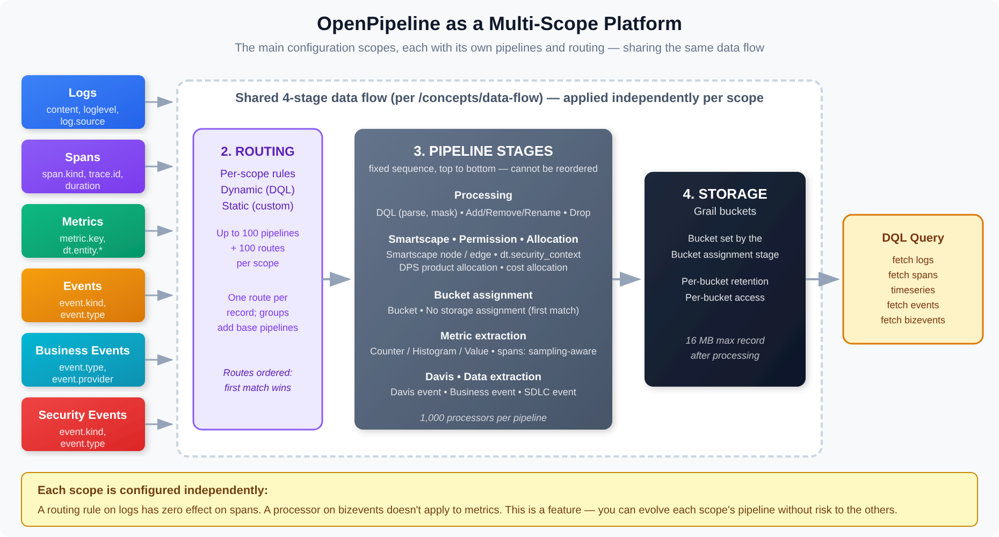

# OPIPE-01: OpenPipeline as a Multi-Scope Platform

> **Series:** OPIPE — OpenPipeline Beyond Logs | **Notebook:** 1 of 6 | **Created:** March 2026 | **Last Updated:** 10/02/2026

## Beyond Logs: Processing Spans, Metrics, and Events at Ingestion

OpenPipeline is often introduced as a log processing framework — and logs are indeed the most common entry point. But OpenPipeline operates on many **configuration scopes** — logs, spans, metrics, events, business events, security events and more — each with its own pipelines, routing rules, and extraction capabilities. This notebook builds intuition for how the platform works across all scopes and why pipeline design matters.

> **Companion Series**
> - **OPLOGS** — Deep-dive into log processing: **OPLOGS-01: OpenPipeline Fundamentals**
> - **OPMIG** — Migrating from classic logs? Start with **OPMIG-01: Why Migrate**
> - **SPANS** — Querying and analyzing distributed traces: **SPANS-01: Fundamentals**

---

## Table of Contents

1. [The OpenPipeline Scopes](#openpipeline-scopes)
2. [Shared Architecture Across Scopes](#shared-architecture-across-scopes)
3. [The Default Pipeline Anti-Pattern](#the-default-pipeline-anti-pattern)
4. [Pipeline Design Principles](#pipeline-design-principles)
5. [Matching Conditions: Conditional Logic Within a Pipeline](#matching-conditions)
6. [Security Context Across Scopes](#security-context-across-scopes)
7. [Ingestion-Time vs. Query-Time Processing](#ingestion-time-vs-query-time-processing)
8. [Summary](#summary)
9. [Next Steps](#next-steps)
10. [References](#references)

---

## Prerequisites

| Requirement | Details |
|-------------|----------|
| **Dynatrace Environment** | SaaS with Grail enabled |
| **Permissions** | `storage:logs:read`, `storage:spans:read`, `storage:metrics:read`, `storage:events:read`, `storage:bizevents:read` |
| **Recommended** | Familiarity with **OPLOGS-01** (log pipeline basics) |

### OneAgent 1.333+: Primary Fields/Tags as Routing Keys

From **OneAgent 1.333**, OneAgent can enrich telemetry at the source with standardized **primary fields** and customer-defined **primary tags** as top-level attributes — an OpenPipeline-relevant change, because those attributes are present before routing. The agent version is what matters here, not the tenant version: verify the OneAgent version on the hosts concerned (details and configuration in [OneAgent Attribute Enrichment](#shared-architecture-across-scopes) below).

**Primary fields** (Semantic Dictionary-defined):

| Field | Purpose |
|---|---|
| `dt.security_context` | ABAC scope for IAM policies; also drives bucket-routing decisions |
| `dt.cost.costcenter` | Cost allocation tag; routes spend to org units |
| `dt.cost.product` | Product-line attribution for cost rollups |

**Primary tags** (customer-defined): set during OneAgent install via `oneagentctl --set-host-tag="primary_tags.<key>=<value>"` — the `primary_tags.` prefix must be written explicitly (it is never added automatically); e.g., `primary_tags.team`, `primary_tags.env`, `primary_tags.app`, `primary_tags.data_classification`. Land as `primary_tags.<key>` on every signal, up to 20 primary tags per host or process — beyond 20, *"OneAgent doesn't emit any warning and does not enrich data with the excess tags."*

**Pipeline implication for cross-scope design:**

1. **Routing rules** can dispatch on primary fields directly without parse processors. A route's matching condition is DQL, and a route sends records to a **pipeline**, not to a bucket:

   | Route matcher (DQL) | Target pipeline |
   |---|---|
   | `dt.cost.costcenter == "cc-1234"` | `finance-logs` |
   | `matchesValue(dt.security_context, "*pci*")` | `pci-audit` (whose Bucket assignment stage picks the 365-day bucket) |

   The bucket is chosen later, by the target pipeline's **Bucket assignment** stage. Write substring tests as `matchesValue(field, "*text*")`, not `contains()`: OpenPipeline matchers accept only a subset of DQL functions, and a condition written with `contains()` or `in()` is rejected with the verifier error `The function contains() isn't enabled.` `matchesValue` is case-insensitive and also matches any element when `dt.security_context` holds an array value (see the array rule in §6).

2. **Cross-scope consistency:** because primary fields/tags appear on logs, spans, metrics, AND business events, queries that join across scopes (OPIPE-06 cross-scope design patterns) can correlate without scope-specific lookup tables.

3. **Non-OneAgent sources** (raw syslog, third-party log shippers, OTLP-via-collector) still need OpenPipeline `enrichment` processors to surface the same fields. Document this split in your standard.

> **Update (June 2026) — primary tags are now formally documented.** Dynatrace published a dedicated [Primary tags (DT docs)](https://docs.dynatrace.com/docs/manage/tags/primary-tags) page that canonicalizes the model. Two points matter for pipeline design: (1) **OpenPipeline itself is a documented primary-tag source** — `primary_tags.*` values can be *"derived or transformed from any incoming field at ingest-processing time"*, which closes the non-OneAgent-sources gap in point 3 above: instead of generic enrichment processors producing ad-hoc fields, derive proper `primary_tags.<key>` values so downstream routing and bucket assignment treat agent and agentless data identically. (2) The other documented sources are OneAgent, Kubernetes annotations (`metadata.dynatrace.com/primary_tags.<key>`), cloud-provider tags, OpenTelemetry resource attributes, and host or process metadata. Primary tags are "available before data enters the processing pipeline," which is exactly what makes them usable in routing conditions like the examples above.

**SaaS 1.337 added recommended-field suggestions to extraction processors.** Per the release notes, extraction processors *"now supply a recommended set of fields to be extracted, which helps avoid misconfiguration and exposing sensitive data"*, and the recommendations cover permission- and cost-relevant fields, Smartscape identifiers, and Grail primary tags.

> <sub>**Sources:** [Primary Grail fields and tags enrichment through OneAgent (DT docs)](https://docs.dynatrace.com/docs/ingest-from/dynatrace-oneagent/oneagent-attribute-enrichment), [SaaS 1.337 release notes (DT docs)](https://docs.dynatrace.com/docs/whats-new/saas/sprint-337).</sub>

---

<a id="openpipeline-scopes"></a>
## 1. The OpenPipeline Scopes

OpenPipeline processes data through independent **configuration scopes** — logs, spans, metrics, generic events, Davis events and problems, SDLC events, business events, security events, system events (limited support), Smartscape events (limited support), user events, and user sessions. Each scope has its own set of pipelines, routing rules, processors, and storage targets. They share the same architecture but operate on different data types. This series covers the six you will configure most:

| Scope | Data Object | Primary Use Case | Key Fields |
|-------|------------|------------------|------------|
| **Logs** | `logs` | Application and infrastructure log records | `content`, `loglevel`, `log.source` |
| **Spans** | `spans` | Distributed trace spans from services | `span.kind`, `trace.id`, `duration` |
| **Metrics** | `timeseries` | Time-series measurements from agents and extensions | `metric.key`, `dt.entity.*` |
| **Events** | `events` | Lifecycle and configuration change events | `event.kind`, `event.type` |
| **Business Events** | `bizevents` | Business transactions and user actions | `event.type`, `event.provider` |
| **Security Events** | `security.events` | Vulnerability, detection, and compliance findings | `event.kind`, `event.type` |

> <sub>**Sources:** [OpenPipeline data flow (DT docs)](https://docs.dynatrace.com/docs/platform/openpipeline/concepts/data-flow) — configuration scope list.</sub>

### What This Means in Practice

Each scope is configured **independently** in the Dynatrace UI under **OpenPipeline** settings. A processing rule you create for logs has no effect on spans. A routing rule for business events does not apply to metrics. This independence is a feature — it means you can evolve each scope's pipeline at its own pace without risk to other data types.

### Discovering Your Active Scopes

The following queries show what data is flowing through each scope in your environment.

```dql
// Log pipelines: volume by pipeline and bucket
fetch logs, from:-1h
| summarize log_count = count(), by:{dt.openpipeline.pipelines, dt.system.bucket}
| sort log_count desc
```

```dql
// Span pipelines: volume by pipeline and bucket
fetch spans, from:-1h
| summarize span_count = count(), by:{dt.openpipeline.pipelines, dt.system.bucket}
| sort span_count desc
```

```dql
// Business event pipelines: volume by provider and type
fetch bizevents, from:-1h
| summarize event_count = count(), by:{event.provider, event.type}
| sort event_count desc
```

<a id="shared-architecture-across-scopes"></a>
## 2. Shared Architecture Across Scopes

### Sprint 1.345 (August 2026): Temporary Fields (`dt.temp*`)

A field whose name is prefixed **`dt.temp`** lives for the duration of pipeline processing and is **discarded before the record is written to Grail**. That closes a long-standing gap in the extraction pattern this series teaches: previously, an intermediate value needed for metric, event, or bizevent extraction had to be written onto the record — where it persisted, consumed storage, and changed the shape of the stored data for every downstream consumer.

| Property | Behaviour |
|---|---|
| Lifetime | Available across all processing stages; dropped at storage |
| Persistence | Never written to Grail — invisible to `fetch` |
| Cost | Not persisted, so it adds nothing to stored volume or retention |
| Enablement | None — the `dt.temp` prefix alone marks the field temporary |
| Scope support | Every scope with a Processing stage |

Use it for intermediate calculations feeding extraction. Do **not** use it for enrichment you intend to query later — the field will not be there. SaaS 1.345 released 08/11/2026 with a **staged tenant rollout**; verify availability in your tenant before relying on the prefix, and note that a `dt.temp` field written on a tenant that does not yet support the semantics would simply persist as an ordinary attribute.



<!-- MARKDOWN_TABLE_ALTERNATIVE
| Scope | Key fields | Shared data flow |
|-------|------------|---------------------|
| Logs | content, loglevel, log.source | Ingest → Routing → Pipeline stages → Storage |
| Spans | span.kind, trace.id, duration | Ingest → Routing → Pipeline stages → Storage |
| Metrics | metric.key, dt.entity.* | Ingest → Routing → Pipeline stages → Storage |
| Events | event.kind, event.type | Ingest → Routing → Pipeline stages → Storage |
| Business Events | event.type, event.provider | Ingest → Routing → Pipeline stages → Storage |
| Security Events | event.kind, event.type | Ingest → Routing → Pipeline stages → Storage |

Pipeline stages, in fixed order: Processing (DQL, add/remove/rename fields, drop record) → Smartscape node / edge → Permission (dt.security_context) → Product allocation → Cost allocation → Bucket assignment (bucket or no storage, first match) → Metric extraction (spans: sampling-aware) → Davis → Data extraction (business event, SDLC event).
Limits per scope: 100 pipelines and 100 routes; 1,000 processors per pipeline; 16 MB maximum record size after processing. One route matches per record; pipeline groups add base pipelines around a member pipeline.
-->

Every scope follows the same **data flow** (Ingest → Routing → Processing → Storage), with optional pre-processing on custom sources. Inside a pipeline, processing is not one step: it runs as a **fixed sequence of stages**, of which the stage named *Processing* is only the first. The flow is identical in concept across scopes — only the data types and available processors differ.

| Stage | Purpose | Logs Example | Spans Example |
|-------|---------|-------------|---------------|
| **1. Ingest** | Receive records from a built-in / ready-made / custom source | OneAgent log ingest | OTLP span ingest |
| **2. Routing** | Direct data to the right pipeline (dynamic DQL match or static for custom sources) | Match by `log.source` or `k8s.namespace.name` | Match by `span.kind` or `service.name` |
| **3. Pipeline** | A fixed sequence of stages: **Processing** (DQL, add / remove / rename fields, drop record, GeoIP and inline lookup) → **Smartscape node** → **Smartscape edge** → **Permission** (security context) → **Product allocation** → **Cost allocation** → **Bucket assignment** → **Metric extraction** → **Davis** → **Data extraction** | Mask credit card numbers, drop debug, parse JSON (Processing); extract error-rate metrics (Metric extraction) | Mask PII, drop health-check spans (Processing); sampling-aware RED metrics (Metric extraction) |
| **4. Storage** | Persist to the Grail bucket chosen in the Bucket assignment stage (or skip with No storage assignment) | Send to `app_logs` bucket | Send to `trace_data` bucket |

> **Stage order is fixed.** Per *Processing in OpenPipeline*, *"The sequence of stages is fixed for all pipelines and cannot be modified."* Masking, parsing, and dropping happen in the first stage (Processing); Metric extraction, Davis, and Data extraction run **after** Bucket assignment. Within a stage, processors run in the order you list them, and each stage executes either all matching processors or only the first match.
>
> <sub>**Sources:** [Processing in OpenPipeline (DT docs)](https://docs.dynatrace.com/docs/platform/openpipeline/concepts/processing) — stage table, in execution order; [OpenPipeline limits (DT docs)](https://docs.dynatrace.com/docs/platform/openpipeline/reference/limits) — per-scope, per-pipeline and record-size limits in the diagram.</sub>

### Sprint 1.346 (August 2026): `dt.bindplane.*` Is a Reserved Namespace

Verbatim: *"The `dt.bindplane.*` namespace is now reserved exclusively for Bindplane. Dynatrace uses it to populate fields such as `dt.bindplane.project`, `dt.bindplane.fleet`, and `dt.bindplane.configuration"* — to keep those fields populated consistently.

The practical rule for pipeline authors is the same one that governs every `dt.*` namespace: **do not write into it from a processor.** If a processing rule of yours adds or overwrites a `dt.bindplane.*` field, move it to a namespace you own before the reservation takes effect, or the platform-populated value and yours will contend. This is worth a grep of your existing pipelines rather than an assumption — the namespace was not reserved before, so nothing stopped a rule from using it.

SaaS 1.346 released 08/25/2026 with a **staged tenant rollout** from the same date; verify against your own tenant.

### The Key Insight

If you understand how to build a log pipeline (route to a pipeline → mask, drop, and transform in Processing → set permissions and cost allocation → assign a bucket → extract metrics and events), you already understand how to build a span pipeline or an event pipeline. The concepts transfer directly — only the field names and processor options change.

### Processors Available Per Scope

Not every processor is available in every scope. The following table shows key differences (refresh against [Processing in OpenPipeline (DT docs)](https://docs.dynatrace.com/docs/platform/openpipeline/concepts/processing) for the current list):

| Processor | Logs | Spans | Metrics | Events | Bizevents |
|-----------|------|-------|---------|--------|-----------|
| DPL parsing | Yes | Yes | — | Yes | Yes |
| Field enrichment (Add / Remove / Rename / DQL) | Yes | Yes | Yes | Yes | Yes |
| Metric extraction (Counter / Value / Histogram Preview) | Yes | Yes (sampling-aware variants) | — | Yes | Yes |
| Smartscape node / edge | Yes | Yes | Yes | Yes | Yes |
| Event extraction (Business / SDLC event in Data extraction; Davis event in Davis) | Yes | Yes | — | Yes | Yes |
| Masking (DQL processor, Processing stage) | Yes | Yes | Yes | Yes | Yes |
| Inline lookup (Processing stage) | Yes | Yes | Yes | Yes | Yes |
| GeoIP lookup (Processing stage, Early Access) | Yes | Yes | Yes | Yes | Yes |
| Drop record | Yes | Yes | Yes | Yes | Yes |
| Bucket assignment / No storage assignment | Yes | Yes | — | Yes | Yes |
| Set dt.security_context | Yes | Yes | Yes | Yes | Yes |
| DPS Cost Allocation (Cost Center / Product) | Yes | Yes | Yes | — | — |

### OneAgent Attribute Enrichment (OneAgent 1.333+)

> **Requires:** OneAgent version **1.333** or later

OneAgent can enrich **all telemetry signals** (metrics, spans, logs, events, entities) with custom metadata at the source — before data reaches the Dynatrace platform. This is more efficient than server-side tagging (auto-tags) because enrichment happens on the host and propagates to all Smartscape nodes.

**Primary Fields** (standardized from Semantic Dictionary):
- `dt.security_context` — data governance and access control
- `dt.cost.costcenter` — cost allocation
- `dt.cost.product` — product attribution

**Primary Tags** (custom key-value pairs):
- `primary_tags.environment` — environment identification (production, staging, etc.)
- `primary_tags.team` — team ownership
- `primary_tags.business_unit` — organizational unit

**Configuration:**

```bash
# Set during OneAgent installation
Dynatrace-OneAgent-Linux.sh --set-host-tag="primary_tags.environment=production" --set-host-tag="dt.security_context=confidential"

# Set on existing agents via oneagentctl
oneagentctl --set-host-tag="primary_tags.environment=production"
oneagentctl --set-host-tag="dt.cost.costcenter=12345"

# Per-process via environment variable (overrides host-level)
DT_TAGS="primary_tags.team=platform primary_tags.environment=production"
```

**Benefits over auto-tagging:**
| Aspect | Auto-Tags (Server-Side) | Attribute Enrichment (Agent-Side) |
|--------|------------------------|----------------------------------|
| When applied | After data arrives at platform | At the source, before transmission |
| Scope | Entity tags only | All signals: metrics, spans, logs, events, entities |
| Grail integration | Limited | Full — feeds OpenPipeline routing, bucket assignment, permissions |
| Cost allocation | Not supported | `dt.cost.costcenter`, `dt.cost.product` fields |
| Security context | Not supported | `dt.security_context` for data governance |

> **See:** [Primary Grail fields and tags enrichment through OneAgent (DT docs)](https://docs.dynatrace.com/docs/ingest-from/dynatrace-oneagent/oneagent-attribute-enrichment)

<a id="the-default-pipeline-anti-pattern"></a>
## 3. The Default Pipeline Anti-Pattern

Every OpenPipeline scope has a built-in **Default Pipeline** — for logs and business events, only where the Classic pipeline is not available. It is a catch-all: any data that does not match a custom pipeline's routing rules flows through the default pipeline and lands in the default bucket (e.g., `default_logs`, `default_spans`).

This is convenient for getting started. It becomes a serious problem at scale — Dynatrace's own guidance is to *"limit the use of the default pipeline to monitoring unassigned incoming data"*.

> <sub>**Sources:** [Processing in OpenPipeline (DT docs)](https://docs.dynatrace.com/docs/platform/openpipeline/concepts/processing) — *"It's not available for log and business event configuration scopes where the Classic pipeline is available."*</sub>

### Why "Everything in Default" Fails

| Problem | Impact |
|---------|--------|
| **Query performance** | Every DQL query against the default bucket scans ALL data — application logs mixed with infrastructure noise, health checks mixed with business transactions. `fetch` reads at most 500 GB of uncompressed data by default (`scanLimitGBytes`), and an undifferentiated bucket reaches that sooner. |
| **Cost** | No differentiated retention. You pay to store debug-level container stdout at the same retention tier as critical security audit logs. |
| **Security** | No `dt.security_context` separation. Without dedicated pipelines, you cannot apply IAM policies to restrict who sees which data. Finance team logs are visible to infrastructure engineers and vice versa. |
| **Blast radius** | A misconfigured processing rule (bad parsing regex, aggressive drop filter) in the default pipeline affects ALL data flowing through it. One mistake breaks everything. |
| **No metric extraction** | You cannot extract targeted metrics from specific log patterns when everything is in one undifferentiated stream. Metric extraction rules become overly complex or extract noise. |
| **Debugging** | When something goes wrong, you cannot tell which data source caused the issue. Pipeline-level monitoring (`dt.openpipeline.pipelines`) shows a single pipeline name for everything. |

### The Telltale Signs

Run the following queries to check if your environment has this problem.

```dql
// Check: What percentage of logs land in the default bucket?
fetch logs, from:-1h
| summarize total = count(),
    default_count = countIf(dt.system.bucket == "default_logs")
| fieldsAdd default_pct = round(toDouble(default_count) / toDouble(total) * 100, decimals: 1)
| fieldsAdd assessment = if(default_pct > 80, then: "CRITICAL: Most data in default bucket",
    else: if(default_pct > 50, then: "WARNING: Majority in default bucket",
    else: "OK: Data is distributed across buckets"))
```

```dql
// Check: How many distinct pipelines are processing your logs?
fetch logs, from:-1h
| summarize pipeline_count = countDistinct(dt.openpipeline.pipelines),
    bucket_count = countDistinct(dt.system.bucket),
    source_count = countDistinct(dt.openpipeline.source)
| fieldsAdd assessment = if(pipeline_count <= 1, then: "CRITICAL: Only default pipeline in use",
    else: if(pipeline_count < 3, then: "WARNING: Very few pipelines configured",
    else: "OK: Multiple pipelines configured"))
```

```dql
// Visualize: Volume distribution across buckets (are they balanced?)
//
// The grand total must be computed BEFORE the rows are split apart. After a grouped
// summarize, log_count is a scalar per row — not an array — so arraySum(log_count) is
// a type mismatch. The query still returns ok:true and rows, and every pct_of_total
// reads null, with only a DATATYPE_MISMATCH warning to signal it. Collect the rows
// into one array, total them there, then expand back to one row per bucket.
fetch logs, from:-1h
| summarize log_count = count(), by:{dt.system.bucket}
| summarize rows = collectArray(record(bucket = dt.system.bucket, log_count = log_count)),
            grand_total = sum(log_count)
| expand rows
| fieldsAdd bucket = rows[bucket], log_count = rows[log_count]
| fieldsAdd pct_of_total = round(100.0 * log_count / grand_total, decimals: 1)
| fields bucket, log_count, pct_of_total
| sort log_count desc
```

```dql
// Same check for spans: are they all in default_spans?
fetch spans, from:-1h
| summarize total = count(),
    default_count = countIf(dt.system.bucket == "default_spans")
| fieldsAdd default_pct = round(toDouble(default_count) / toDouble(total) * 100, decimals: 1)
| fieldsAdd assessment = if(default_pct > 80, then: "CRITICAL: Most spans in default bucket",
    else: if(default_pct > 50, then: "WARNING: Majority in default bucket",
    else: "OK: Spans are distributed across buckets"))
```

<a id="pipeline-design-principles"></a>
## 4. Pipeline Design Principles

The goal is to move from "everything in default" to a **purpose-driven pipeline architecture**. Here are the principles:

### Principle 1: One Pipeline Per Source Type

Create separate pipelines based on the nature of the data, not the team that owns it.

| Pipeline | Routing Condition | Target Bucket | Retention |
|----------|-------------------|---------------|-----------|
| `kubernetes-infra` | `k8s.namespace.name` exists AND `log.source == "Container Output"` | `k8s_infra_logs` | 14 days |
| `application-logs` | `log.source == "Log file"` AND `k8s.namespace.name` matches app namespaces | `app_logs` | 35 days |
| `security-audit` | `matchesValue(log.source, "*audit*")` or another source-identifying field (`AUDIT` is not a log level) | `security_audit` | 365 days |
| `api-ingestion` | `dt.openpipeline.source == "/api/v2/logs/ingest"` | `external_logs` | 35 days |
| Default route | Everything else (catch-all) — for logs, the Classic pipeline where it is available | `default_logs` | 35 days (built-in bucket) |

### Principle 2: Filter Early, Extract Targeted

Each pipeline should drop noise **before** storage and extract **only** the metrics relevant to that data type:

- **kubernetes-infra pipeline**: Drop health check logs, extract pod restart counts
- **application-logs pipeline**: Drop DEBUG in production, extract error rates by service
- **security-audit pipeline**: Never drop, never sample — extract compliance event counts

### Principle 3: Differentiate Retention

Different data has different value over time:

| Data Type | Suggested Retention | Rationale |
|-----------|--------------------|-----------|
| Debug/container stdout | 7-14 days | High volume, short-term troubleshooting |
| Application logs | 35 days | Standard operational window |
| Security/audit logs | 365+ days | Compliance requirements (SOC 2, HIPAA) |
| Business events | 90-365 days | Trend analysis, quarterly reporting |

### Principle 4: Route Ordering Matters

Pipeline routing rules are evaluated **in order — first match wins**: *"If no route matches the record, the record is routed via the Default route."* Place specific rules before general ones:

1. Security audit logs (most specific, highest value)
2. Application logs by namespace
3. Kubernetes infrastructure
4. API-ingested external logs
5. Default route (catch-all for anything unmatched)

### Applying This to Spans

The same principles apply to the spans scope. `service.name` is an OpenTelemetry attribute and is absent on OneAgent spans, which carry `dt.service.name` instead — match on whichever your spans actually have (OPIPE-02 §1):

| Pipeline | Routing Condition | Target Bucket |
|----------|-------------------|---------------|
| `frontend-traces` | `span.kind == "server"` AND `service.name` matches frontend services | `frontend_spans` |
| `backend-traces` | `span.kind == "server"` AND `service.name` matches backend services | `backend_spans` |
| `database-spans` | `span.kind == "client"` AND `db.system` exists | `db_spans` |
| Default Pipeline | Everything else | `default_spans` |

```dql
// Inventory: What log sources exist and how much volume do they produce?
// Use this to plan your pipeline routing rules
fetch logs, from:-24h
| summarize {log_count = count(), unique_hosts = countDistinct(dt.entity.host)},
    by:{dt.openpipeline.source, log.source}
| sort log_count desc
| limit 20
```

```dql
// Inventory: Kubernetes namespace volume (for pipeline routing decisions)
fetch logs, from:-24h
| filter isNotNull(k8s.namespace.name)
| summarize log_count = count(), by:{k8s.namespace.name}
| sort log_count desc
| limit 20
```

```dql
// Inventory: Span volume by service (for span pipeline routing decisions)
fetch spans, from:-24h
| summarize span_count = count(), by:{dt.service.name, span.kind}
| sort span_count desc
| limit 20
```

<a id="matching-conditions"></a>
## 5. Matching Conditions: Conditional Logic Within a Pipeline

Sections 3 and 4 explained why you need separate pipelines and how to design them. But what happens when a single pipeline receives data from several sources that need **different processing logic** — without justifying an entirely new pipeline?

The answer is the **matching condition** every processor carries.

### How Conditional Processing Works

There is no grouping construct for processors inside a stage. Each processor has its own matcher: *"it defines the target of a processor via a DQL statement and narrows down the available data to the specific set you want to process."* On the DQL processor the matching condition is a required field.

| Behavior | Detail |
|----------|--------|
| **Matching** | Each processor's matching condition is a DQL statement. Only records that satisfy it are processed; the rest pass through unchanged. |
| **Order** | Processors run in the order listed: *"each processor output becomes the input for the next one."* A field one processor adds is available to the matchers of the processors after it. |
| **All matches vs. first match** | The stage decides. Processing, Smartscape, Metric extraction, Davis and Data extraction run **every** matching processor; Permission, Product allocation, Cost allocation and Bucket assignment run only the **first** match. |
| **"Every record"** | A matcher of `true` applies the processor to all records. |
| **Matcher language** | A subset of DQL — `matchesValue`, `matchesPhrase`, `isNull`, `isNotNull`, comparisons and boolean logic. `contains()` and `in()` are rejected (see the References note). |

> **SaaS 1.344+:** OpenPipeline matchers support **Duration**-type record fields, with the operators `=`, `!=`, `>`, `>=`, `<`, and `<=` ([rollout from 07/29/2026](https://docs.dynatrace.com/docs/whats-new/saas/sprint-344)). On a tenant that has not yet reached 1.344, match on an equivalent **numeric** field instead (for example a millisecond-valued field carried alongside the record rather than the duration field itself).

> <sub>**Sources:** [Processing in OpenPipeline (DT docs)](https://docs.dynatrace.com/docs/platform/openpipeline/concepts/processing) — processor anatomy and the per-stage "All matches" / "First match only" column, [Processing stage (DT docs)](https://docs.dynatrace.com/docs/platform/openpipeline/concepts/processing-stage) — *"Set a specific matching condition on each processor to narrow down the records it applies to."*, [DQL matcher in OpenPipeline (DT docs)](https://docs.dynatrace.com/docs/platform/openpipeline/reference/dql/dql-matcher-in-openpipeline) — *"true — the processor (DQL query) will be applied to all records"*.</sub>

### Parse Once, Match on the Result

Because there is no shared group matcher, a condition used by several processors is repeated on each one. Keep it cheap and keep it in one place: parse the distinguishing value once, early in the Processing stage, into a field, and let later processors match on that field. Dynatrace's own guidance: *"Parse it once and store the extracted values in fields for downstream processors to reuse."* If the field is only needed during processing, name it `dt.temp.*` (SaaS 1.345+, §2) so it is not stored.

### Example: Multi-Format Log Pipeline

A single `application-logs` pipeline receives logs from Java, Node.js and Python services. Each has a different format, but they all go to the same `app_logs` bucket with 35-day retention. One pipeline, with each processor scoped by its own matcher:

| Stage | Processor | Matching condition | What it does |
|-------|-----------|--------------------|--------------|
| Processing | DQL | `matchesValue(k8s.container.name, "java-*")` | Parse log4j format, extract exception class, add `app.framework = "java"` |
| Processing | DQL | `matchesValue(k8s.container.name, "node-*")` | Parse JSON structured logs, extract request ID, add `app.framework = "nodejs"` |
| Processing | DQL | `matchesValue(k8s.container.name, "python-*")` | Parse Python logging format, extract traceback, add `app.framework = "python"` |
| Processing | Drop record | `loglevel == "DEBUG"` | Drop debug records from every source |
| Permission | Security context | `true` | Set `dt.security_context = "app-team"` |
| Bucket assignment | Bucket assignment | `true` | `app_logs` |

Three parsing paths, one pipeline, one bucket. The alternative — three pipelines with three routes — triples the configuration surface for data whose lifecycle is identical.

### Example: Span Enrichment by Service Category

In the Spans scope, a single pipeline processes server and client spans but needs different enrichment by category:

| Processor matching condition | Processing |
|------------------------------|------------|
| `matchesValue(http.route, "/api/*")` | Add `span.category = "api"`, extract API version from path |
| `isNotNull(db.system)` | Add `span.category = "database"`, normalize the statement to remove parameters |
| `span.kind == "producer" or span.kind == "consumer"` | Add `span.category = "messaging"`, extract queue name |

### Matching Conditions, Pipelines, or Pipeline Groups?

| Scenario | Use |
|----------|-----|
| Same bucket, retention and owner; different parsing per source | **Matching conditions** on processors in one pipeline |
| Only the destination bucket differs | **Bucket assignment** processors with conditions in one pipeline (first match wins) |
| Different retention, security context, or data lifecycle | **Separate pipelines**, each with its own route |
| Different teams own the configuration | **Separate pipelines** — *"By adding custom pipelines per team, you can manage them via owner-based access control."* |
| A central team must enforce the same stages (for example masking) on many teams' pipelines | **Pipeline groups** — a composition of base pipelines that *"can restrict or mandate stages"* for its member pipelines |
| Blast-radius isolation | **Separate pipelines** — a bad processor in one pipeline cannot affect another |

> <sub>**Sources:** [Processing in OpenPipeline (DT docs)](https://docs.dynatrace.com/docs/platform/openpipeline/concepts/processing) — custom pipelines and owner-based access control, [Pipeline groups (DT docs)](https://docs.dynatrace.com/docs/platform/openpipeline/concepts/pipeline-groups) — compositions, base and member pipelines.</sub>

### Common Mistakes

| Mistake | Problem | Fix |
|---------|---------|-----|
| Re-parsing `content` in every processor's matcher or definition | Slower processing; complex DQL processors can be disabled | Parse once into a field; match on the field |
| Overlapping matchers in an all-matches stage without intent | A record processed by several processors may get conflicting field values | Make matchers mutually exclusive, or order them so the last write is the one you want |
| Overlapping matchers in a first-match stage (Permission, cost/product allocation, Bucket assignment) | Only the first processor fires; later, more specific ones never run | List the most specific condition first |
| One pipeline per destination bucket when only the destination differs | Pipeline proliferation for data that is otherwise processed identically | Use conditional **Bucket assignment** processors (first match wins) inside one pipeline |
| Dozens of source-specific processors in one pipeline | As hard to reason about as separate pipelines, without the ownership boundary | Split into separate pipelines when the sources have different owners or lifecycles |

<a id="security-context-across-scopes"></a>
## 6. Security Context Across Scopes

The `dt.security_context` field controls **who can see which data** through IAM policies. It is the mechanism that makes pipeline separation actionable from a governance perspective.

### How Security Context Works

When data flows through an OpenPipeline, you can enrich it with a `dt.security_context` value. IAM policies then use this value to restrict query access:

```
Data Ingestion → OpenPipeline adds dt.security_context → Grail stores it → IAM policy enforces access
```

For a complete deep-dive on security context patterns, values, and IAM policy syntax, see **ORGNZ-06: Security Context**.

### Security Context by Scope

| Scope | How to Set `dt.security_context` | Notes |
|-------|--------------------------------|-------|
| **Logs** | OpenPipeline **Permission** stage | Most common — set based on `k8s.namespace.name`, `log.source`, or parsed fields |
| **Spans** | OpenPipeline **Permission** stage | Set based on `service.name` or span attributes |
| **Metrics** | OpenPipeline **Permission** stage **or** extension configuration | See "Extension Metrics" below |
| **Events** | OpenPipeline **Permission** stage | Set based on `event.type` or other event fields |
| **Business Events** | OpenPipeline **Permission** stage | Set based on `event.provider` or business unit |
| **All signals from a host** | `dt.security_context` host tag (`oneagentctl --set-host-tag`) | *"used to automatically determine the security context for all logs, spans, metrics, and events that are sent from this host"* |
| **Entities** | **Settings > Topology model > Grail Security Context**, host tag, or an extraction rule for generic types | Controls access to **entities only** — data sent from an entity does not inherit the entity's security context |

### Extension Metrics and Security Context

Metrics ingested via **Extensions 2.0** carry a `dt.security_context` only if something sets it. A common gap is to deploy extensions for database, cloud, or infrastructure metrics and assume the security context of the monitored entity carries over. It does not: an IAM policy that filters entities *"will not filter related metrics, logs, or traces"*.

There are two approaches:

**Approach 1: Set it in the extension configuration**

Dynatrace documents setting `dt.security_context` *"per extension configuration"*. The extension then sends it as a dimension on every data point, for example `postgres.activity.idle,port=5432,dt.security_context="TeamA",…`. One configuration per team gives each team's metrics their own context. To restrict access to the extension's **entities** as well, add an extraction rule that maps the same dimension onto the generic entity type.

**Approach 2: OpenPipeline Permission stage on the Metrics scope**

When the extension configuration cannot carry it, set `dt.security_context` in the **Metrics** scope's Permission stage, matching on the metric key or on dimensions that identify the source:

| Matching condition | Security context value | Use case |
|--------------------|------------------------|----------|
| `matchesValue(metric.key, "postgres.*")` | `"database-team"` | A database extension's metrics |
| `matchesValue(metric.key, "aws.*")` | `"cloud-team"` | Cloud integration metrics |

Extension metric keys are whatever the extension defines (`postgres.*`, `sql-server.*`, …) — check the real keys with `metrics | filter startsWith(metric.key, "postgres")` before writing the matcher.

> <sub>**Sources:** [Grant access to entities with security context (DT docs)](https://docs.dynatrace.com/docs/manage/identity-access-management/use-cases/access-security-context) — *"Logs, spans, metrics, and events powered by Grail that are sent from an entity do not inherit the management zones of that entity."*, [Processing in OpenPipeline (DT docs)](https://docs.dynatrace.com/docs/platform/openpipeline/concepts/processing) — Permission stage.</sub>

> **Structured context design:** For organisations with transversal teams (database, networking, OS) that need cross-application access, a flat context value (e.g., `"checkout"`) does not scale. Encoding `comp:<component>/bu:<business-unit>/app:<application>` into the context string, then using `MATCH('comp:db*')` in the IAM policy, enables precise transversal access without a per-application context per team. The dimension needed for transversal slicing should come first in the string for compatibility with Classic entity `startsWith` matching. See **IAM-04: Policy Authoring** for the complete design pattern and **IAM-05: Boundary Design** for boundary examples.

> **Critical:** When `dt.security_context` holds an array value, IAM policies must use the `MATCH` operator — not `=`, `STARTSWITH`, or `IN`. Array comparison with equality operators always returns false. See **ORGNZ-06** for the full rules.

```dql
// Check: Do your logs have security context assigned?
fetch logs, from:-1h
| summarize total = count(),
    with_context = countIf(isNotNull(dt.security_context)),
    without_context = countIf(isNull(dt.security_context))
| fieldsAdd coverage_pct = round(toDouble(with_context) / toDouble(total) * 100, decimals: 1)
```

```dql
// Check: Do your spans have security context assigned?
fetch spans, from:-1h
| summarize total = count(),
    with_context = countIf(isNotNull(dt.security_context)),
    without_context = countIf(isNull(dt.security_context))
| fieldsAdd coverage_pct = round(toDouble(with_context) / toDouble(total) * 100, decimals: 1)
```

<a id="ingestion-time-vs-query-time-processing"></a>
## 7. Ingestion-Time vs. Query-Time Processing

A critical design decision: should you process data in OpenPipeline (at ingestion) or in DQL (at query time)? The answer depends on what you are trying to achieve.

### When to Process at Ingestion (OpenPipeline)

| Use Case | Why Ingestion Time |
|----------|-----------|
| **Drop noise** | Data you never want to see should never be stored. Dropping debug logs, health check spans, or synthetic test events saves cost permanently. |
| **Mask sensitive data** | PII must be redacted before storage for compliance. You cannot "un-store" data. |
| **Add security context** | `dt.security_context` must be set at ingestion — it cannot be added retroactively. |
| **Extract metrics** | Converting log patterns or span attributes into metrics happens at ingestion. You cannot create metrics from historical data. |
| **Route to buckets** | Bucket assignment is permanent at ingestion time. You cannot move data between buckets after storage. |

### When to Process at Query Time (DQL)

| Use Case | Why Query Time |
|----------|-----------|
| **Exploratory analysis** | When you do not yet know what you are looking for, keep the raw data and query flexibly. |
| **Changing requirements** | If the transformation logic changes frequently, DQL queries are easier to update than pipeline configurations. |
| **Ad-hoc parsing** | One-time investigations benefit from DQL `parse` rather than permanent pipeline processors. |
| **Complex joins** | Correlating across multiple data sources is a query-time operation. |
| **Aggregation and visualization** | Dashboard queries, trend analysis, and statistical aggregations belong in DQL. |

### A Third Surface: At-Source Enrichment on OneAgent (OneAgent 1.343)

The choice above is about *where inside Dynatrace* processing happens. OneAgent 1.343 adds a placement surface **upstream of both**: OneAgent ingests enrichment configuration directly and applies tags and metadata conditionally using [**DQL matcher functions**](https://docs.dynatrace.com/docs/whats-new/oneagent/sprint-343) (equality, phrase, and existence checks) at the point of capture — before the record reaches OpenPipeline.

| Surface | Runs | Use it for |
|---------|------|-----------|
| **OneAgent enrichment** (1.343+) | At the source, before ingest | Attributes only knowable on the host — process, container, or host-local metadata you would otherwise reconstruct downstream |
| **OpenPipeline** | At ingestion | Everything in the first table above: drop, mask, security context, metric extraction, bucket routing |
| **DQL** | At query time | Everything in the second table above: exploration, ad-hoc parsing, joins, aggregation |

Rollout is **per agent fleet, not per tenant** — **verify the OneAgent version on the hosts concerned**; the tenant version is not the agent version, and fleets commonly lag by more than one sprint. On OneAgent 1.342 and earlier the two-surface model above is the whole picture.

> **Enriching at the source does not displace OpenPipeline.** Security context, bucket routing, and masking remain OpenPipeline responsibilities — the gain is that a field is already present *when* OpenPipeline evaluates its matchers, so pipeline logic that would otherwise derive it can just match on it.

### The Decision Framework

Ask these questions in order:

1. **Is the data sensitive?** → Mask at ingestion. No exceptions.
2. **Is the data noise?** → Drop at ingestion. Do not pay to store it.
3. **Does it need access control?** → Add security context at ingestion.
4. **Do you need a metric from it?** → Extract at ingestion.
5. **Everything else?** → Store raw, process at query time.

---

<a id="summary"></a>
## Summary

In this notebook you learned:

- **Configuration scopes** — OpenPipeline processes logs, spans, metrics, events, business events, security events, and more, each independently
- **Shared architecture** — All scopes follow the same flow (ingest → routing → pipeline → storage); inside the pipeline a fixed sequence of stages runs Processing (mask, drop, transform) first and Bucket assignment before Metric extraction, Davis, and Data extraction
- **The default pipeline anti-pattern** — Sending everything through the default pipeline causes query performance, cost, security, and blast radius problems
- **Pipeline design principles** — One pipeline per source type, filter early, differentiate retention, order routing rules from specific to general
- **Matching conditions** — Conditional logic within a pipeline: every processor carries its own DQL matcher, so one pipeline can handle several data formats. Use matchers for different processing, separate pipelines for a different lifecycle or owner, and pipeline groups for centrally mandated stages.
- **Security context across scopes** — `dt.security_context` must be set at ingestion; data does not inherit an entity's security context, so extension metrics need it set in the extension configuration or the Permission stage
- **Ingestion vs. query time** — Process at ingestion for permanent actions (drop, mask, route, extract); process at query time for flexible analysis

---

<a id="next-steps"></a>
## Next Steps

Continue to **OPIPE-02: Span Processing & Enrichment** to configure OpenPipeline for distributed traces — filtering noisy spans, enriching attributes, and routing traces to dedicated buckets.

---

<a id="references"></a>
## References

- [OpenPipeline (DT docs)](https://docs.dynatrace.com/docs/platform/openpipeline)
- [What's new in Dynatrace SaaS 1.346 (DT docs)](https://docs.dynatrace.com/docs/whats-new/saas/sprint-346) — the `dt.bindplane.*` namespace reservation quoted in §2
- [Processing in OpenPipeline (DT docs)](https://docs.dynatrace.com/docs/platform/openpipeline/concepts/processing)
- [OpenPipeline data flow (DT docs)](https://docs.dynatrace.com/docs/platform/openpipeline/concepts/data-flow)
- [Metric extraction stage (DT docs)](https://docs.dynatrace.com/docs/platform/openpipeline/concepts/extraction/metric-extraction)
- [Davis stage (DT docs)](https://docs.dynatrace.com/docs/platform/openpipeline/concepts/extraction/davis-stage)
- [Data extraction stage (DT docs)](https://docs.dynatrace.com/docs/platform/openpipeline/concepts/extraction/data-extraction)
- [Primary Grail fields and tags (DT docs)](https://docs.dynatrace.com/docs/manage/tags/primary-tags)
- [OpenPipeline ingest sources (DT docs)](https://docs.dynatrace.com/docs/platform/openpipeline/reference/api-ingestion-reference)
- [OpenPipeline pipeline groups (DT docs)](https://docs.dynatrace.com/docs/platform/openpipeline/concepts/pipeline-groups)
- [DQL matcher in OpenPipeline (DT docs)](https://docs.dynatrace.com/docs/platform/openpipeline/reference/dql/dql-matcher-in-openpipeline) — `matchesValue`: *"Accepts wildcard * at the beginning or at the end of the value"*; the page documents `matchesPhrase`, `matchesValue`, `isNull` and `isNotNull`, and `contains()` / `in()` are rejected by the matcher verifier
- [Use Grail buckets to partition data (DT docs)](https://docs.dynatrace.com/docs/platform/grail/organize-data/partition-data)
- [Security context for access control (DT docs)](https://docs.dynatrace.com/docs/manage/identity-access-management/use-cases/access-security-context)
- [SaaS 1.344 release notes (DT docs)](https://docs.dynatrace.com/docs/whats-new/saas/sprint-344)
- [OneAgent 1.343 release notes (DT docs)](https://docs.dynatrace.com/docs/whats-new/oneagent/sprint-343)

---

<sub>*This notebook was AI-generated from community-submitted and publicly available sources. This notebook series is not officially supported by Dynatrace. Always verify information against official Dynatrace documentation.*</sub>
