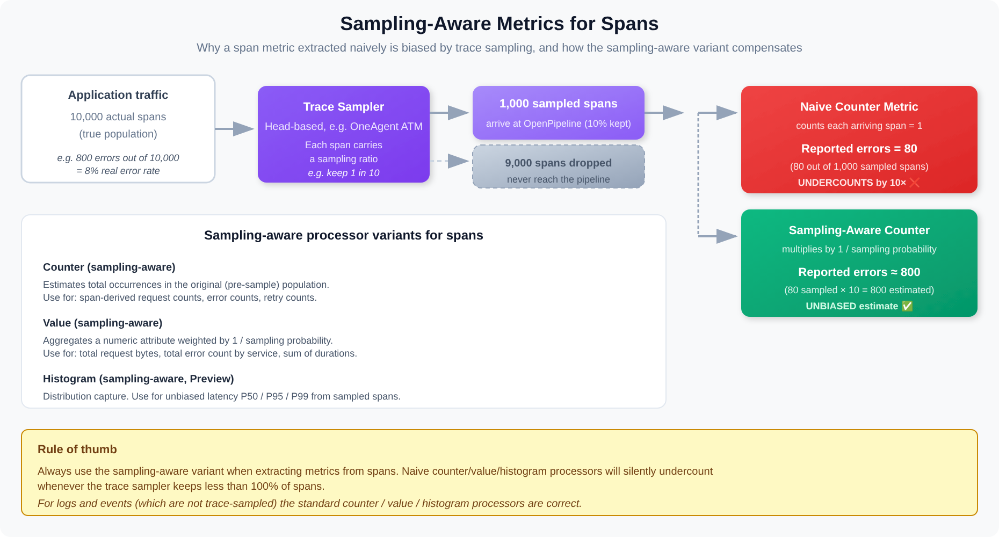

# OPIPE-03: Sampling-Aware Metrics

> **Series:** OPIPE — OpenPipeline Beyond Logs | **Notebook:** 3 of 6 | **Created:** March 2026 | **Last Updated:** 10/02/2026

## Extracting Accurate Metrics from Sampled Trace Data

When distributed tracing uses sampling (head sampling, tail sampling, or adaptive sampling), only a fraction of spans are stored. Extracting metrics from these sampled spans requires special handling — a naive `count()` on sampled data gives you a fraction of reality, not the truth.

This notebook explains what sampling-aware metrics are, why they matter, and how to configure OpenPipeline to extract accurate RED metrics (Rate, Errors, Duration) from sampled span data.

For log-derived metrics (which are not affected by sampling), see **OPMIG-07: Metric & Event Extraction**.

---

## Table of Contents

1. [The Sampling Problem](#the-sampling-problem)
2. [What Makes a Metric Sampling-Aware](#what-makes-a-metric-sampling-aware)
3. [RED Metrics from Spans](#red-metrics-from-spans)
4. [Configuring Metric Extraction in OpenPipeline](#configuring-metric-extraction)
5. [Comparing Standard vs. Sampling-Aware Metrics](#comparing-metrics)
6. [Cardinality Considerations](#cardinality-considerations)
7. [Summary](#summary)
8. [Next Steps](#next-steps)
9. [References](#references)

---

## Prerequisites

| Requirement | Details |
|-------------|----------|
| **Dynatrace Environment** | SaaS with Grail and distributed tracing |
| **Permissions** | `storage:spans:read`, `storage:metrics:read`; `settings:objects:write` on `builtin:openpipeline.spans.pipelines` to configure extraction (OpenPipeline configuration is stored as Settings objects) |
| **Data** | Active span data from instrumented services |
| **Recommended** | **OPIPE-02** (span processing) and **SPANS-01** (fundamentals) |

<a id="the-sampling-problem"></a>
## 1. The Sampling Problem



<!-- MARKDOWN_TABLE_ALTERNATIVE
| Path | What happens | Reported errors (10K real, 800 errors, 10% sample) |
|------|--------------|----------------------------------------------------|
| Trace sampler keeps 10% | 1,000 spans reach OpenPipeline | — |
| Naive counter | Counts each arriving span = 1 | 80 (undercounts by 10×) |
| Sampling-aware counter | Multiplies by 1 / sampling probability | ~800 (unbiased estimate) |
-->

### Why Sampling Exists

Distributed tracing generates enormous volumes of data. A single user request can produce dozens of spans across multiple services. At scale — thousands of requests per second — storing every span is prohibitively expensive.

Sampling solves this by retaining a representative subset:

| Sampling Type | How It Works | Trade-off |
|---------------|-------------|----------|
| **Head sampling** | Decision at trace start (e.g., keep 10% of traces) | Simple but misses rare errors |
| **Tail sampling** | Decision after trace completes (keep errors, slow traces) | Captures important traces, needs collector buffer |
| **Adaptive sampling** | Adjusts rate based on traffic volume | Balances cost and coverage dynamically |

### The Metric Accuracy Problem

When you extract metrics from sampled spans, the raw numbers are wrong:

| Reality | 10% Head Sampling | Naive Metric |
|---------|-------------------|-------------|
| 10,000 requests/min | 1,000 spans stored | `count() = 1,000` (10x under-reported) |
| 500 errors/min | ~50 error spans stored | `countIf(error) = 50` (10x under-reported) |
| Avg latency 200ms | ~1,000 spans sampled | `avg(duration) = ~200ms` (approximately correct) |

**Key insight**: Counts and rates are severely affected by sampling. Averages and percentiles stay approximately correct **when every request had the same chance of being kept** — the sample is then representative. This distinction drives how sampling-aware metrics work.

> **When the sample is not representative.** Two common cases break the "averages are fine" rule. **Tail sampling** keeps errors and slow traces on purpose, so averages, percentiles and error *rates* computed from the kept spans are biased toward the bad cases. **Adaptive Traffic Management** samples different request types at different rates, so an average or ratio that pools request types without weighting by each span's multiplicity over-represents the rarely-sampled ones. In both cases, weight by multiplicity (next cells) or compute per request type.

```dql
// Check: Is trace sampling in effect, and from which mechanism?
//
// `dt.system.sampling_ratio` is NOT the trace sampler — it is the query's own read
// sampling (`fetch ..., samplingRatio:`), so it reads 1 unless you set samplingRatio.
// Verified 10/02/2026: `samplingRatio:10` turns it into 10 on every span.
// The trace-sampling fields are:
//   supportability.atm_sampling_ratio  agent-side Adaptive Traffic Management, denominator
//                                      (16 means 1 in 16 kept) — experimental
//   supportability.alr_sampling_ratio  cluster-side Adaptive Load Reduction, denominator
//                                      — experimental, only set while ALR is active
//   sampling.threshold                 W3C trace-state threshold used by the documented
//                                      extrapolation formula (next cell)
// and `aggregation.count` (stable) is the number of spans OneAgent aggregated into one.
fetch spans, from:-1h
| summarize {
    spans = count(),
    with_threshold = countIf(isNotNull(sampling.threshold)),
    aggregated = countIf(isNotNull(aggregation.count))
  }, by:{dt.service.name, supportability.atm_sampling_ratio, supportability.alr_sampling_ratio}
| sort spans desc
| limit 20
```

```dql
// Stored spans vs. extrapolated spans, using the multiplicity formula from
// "Advanced Tracing Analytics powered by Grail" (DT docs). A factor of 1.0 means
// nothing was sampled or aggregated away; 16.0 means each stored span stands for 16.
fetch spans, from:-1h
| fieldsAdd sampling.probability = (power(2, 56) - coalesce(sampling.threshold, 0)) * power(2, -56)
| fieldsAdd sampling.multiplicity = 1 / sampling.probability
| fieldsAdd multiplicity = coalesce(sampling.multiplicity, 1) * coalesce(aggregation.count, 1) * dt.system.sampling_ratio
| summarize {stored_spans = count(), extrapolated_spans = sum(multiplicity)}
| fieldsAdd factor = round(extrapolated_spans / stored_spans, decimals: 2)
```

<a id="what-makes-a-metric-sampling-aware"></a>
## 2. What Makes a Metric Sampling-Aware

A **sampling-aware metric** adjusts its calculation based on the sampling rate that was applied to the source data. Instead of counting raw spans, it compensates for the sampling ratio to produce values that reflect the actual traffic.

### How It Works

Each sampled span carries metadata about the sampling decision — typically a sampling ratio or probability. When OpenPipeline extracts a metric, it can use this information.

> **OpenTelemetry caveat.** The method depends on that metadata being present. Per the Metric extraction stage docs, *"Note that OpenTelemetry spans don't typically expose sampling rate metadata, making extrapolation less effective."* Check whether your OTel spans carry `sampling.threshold` (cells above) before trusting extrapolated counts from them.
>
> <sub>**Sources:** [Metric extraction stage (DT docs)](https://docs.dynatrace.com/docs/platform/openpipeline/concepts/extraction/metric-extraction).</sub>

| Metric Type | Standard Extraction | Sampling-Aware Extraction |
|-------------|--------------------|--------------------------|
| **Request count** | `count()` → 1,000 | each span weighted by 1 / sampling probability → 10,000 |
| **Error count** | `countIf(error)` → 50 | `countIf(error)` weighted → 500 |
| **Error rate** | 50/1,000 = 5% | 500/10,000 = 5% (same — ratio cancels out) |
| **Avg duration** | `avg(duration)` → 200ms | `avg(duration)` → 200ms (same — sample is representative) |
| **P95 duration** | `percentile(duration, 95)` → 800ms | `percentile(duration, 95)` → ~800ms (approximately same) |

### When Sampling-Awareness Matters

| Metric | Sampling-Aware Needed? | Why |
|--------|----------------------|-----|
| Request rate (throughput) | **Yes** | Absolute counts are under-reported |
| Error rate (ratio) | No, if sampling is uniform | Representative only when every request had the same chance of being kept — not under tail sampling |
| Error count (absolute) | **Yes** | Absolute counts are under-reported |
| Average latency | No, if sampling is uniform | Sample mean approximates population mean under uniform sampling |
| P95/P99 latency | Partially | Approximation degrades at extreme percentiles with aggressive sampling |
| Throughput for SLO | **Yes** | SLO calculations need accurate request volume |

<a id="red-metrics-from-spans"></a>
## 3. RED Metrics from Spans

The **RED method** (Rate, Errors, Duration) is the standard framework for service-level metrics. OpenPipeline can extract all three from span data.

### Rate (Request Throughput)

Measures how many requests a service handles per unit of time.

- **Source**: Server spans (`span.kind == "server"`)
- **Aggregation**: Count, weighted by sampling ratio
- **Dimensions**: `service.name`, `http.route`, `k8s.namespace.name`
- **Sampling-aware**: **Yes** — must compensate for sampling to get true request rate

### Errors (Failure Rate)

Measures the proportion of requests that fail.

- **Source**: Server spans where `http.response.status_code >= 500` or `span.status_code == "error"`
- **Aggregation**: Count of errors / count of total requests
- **Dimensions**: `service.name`, `http.route`, `http.response.status_code`
- **Sampling-aware**: Error rate (ratio) is naturally sampling-tolerant; absolute error count is not

> **The failure field is `span.status_code`, and it is lowercase.** `otel.status_code` does not exist in Grail — it has no row in `dt.semantic_dictionary.fields` — and the value is `"error"`, not the SDK's uppercase `ERROR`. Both mistakes return **zero rows without an error**, which on a sampling notebook is doubly dangerous: a zero error count reads as "sampling is discarding my errors" and sends you tuning the sampler instead of fixing the field name.
>
> A third trap compounds it: **`span.status_code` is null on successful spans** (`"ok"` is written vanishingly rarely). So `countIf(span.status_code != "error")` counts almost nothing — derive successes as **`total - errors`**. A sampling-compensation factor applied to a zero is still zero, so this error survives every downstream correction.

### Duration (Latency)

Measures how long requests take to complete.

- **Source**: Server spans, `duration` field
- **Aggregation**: Average, P50, P95, P99
- **Dimensions**: `service.name`, `http.route`
- **Sampling-aware**: No — duration distributions from sampled data are statistically representative

```dql
// RED: Request rate by service (from stored spans)
fetch spans, from:-1h
| filter span.kind == "server"
| makeTimeseries request_count = count(), by:{dt.service.name}, interval:5m
```

```dql
// RED: Error rate by service
// Counts both HTTP 5xx and spans the instrumentation marked failed.
// span.status_code is the real field (not otel.status_code) and its value is
// lowercase "error"; it is null on successful spans, so successes = total - errors.
fetch spans, from:-1h
| filter span.kind == "server"
| summarize {
    total = count(),
    errors = countIf(http.response.status_code >= 500 or span.status_code == "error")
  }, by:{dt.service.name}
| fieldsAdd successes = total - errors
| fieldsAdd error_rate_pct = round(100.0 * errors / total, decimals: 2)
| sort error_rate_pct desc
```

```dql
// RED: Duration percentiles by service
fetch spans, from:-1h
| filter span.kind == "server"
| summarize {p50 = percentile(duration, 50), p95 = percentile(duration, 95), p99 = percentile(duration, 99)},
    by:{dt.service.name}
| sort p95 desc
| limit 15
```

<a id="configuring-metric-extraction"></a>
## 4. Configuring Metric Extraction in OpenPipeline

Metric extraction from spans is configured in the **Spans scope** of OpenPipeline, in the **Metric extraction** stage — which runs after the Processing and Bucket assignment stages.

### Configuration Steps

1. **Navigate** to OpenPipeline > Spans > select your pipeline > Metric extraction
2. **Add a metric extraction processor** with:
   - **Metric key**: The name of the metric to create (e.g., `span.request_count`)
   - **Processor**: *Sampling aware counter metric* (request and error counts), *Sampling aware histogram metric* or *Sampling aware value metric* (duration — set **Measurement: Duration**), or the plain *Counter* / *Histogram* / *Value* metric processors for non-span scopes
   - **Condition**: Which spans to extract from (e.g., `span.kind == "server"`)
   - **Dimensions**: Fields to carry as metric dimensions (e.g., `service.name`, `http.route`)

### Example: RED Metric Extraction Rules

| Metric Key | Processor | Condition | Dimensions | Sampling-Aware |
|-----------|-------------|-----------|------------|----------------|
| `span.request_count` | Sampling aware counter | `span.kind == "server"` | `service.name`, `http.route` | Yes |
| `span.error_count` | Sampling aware counter | `span.kind == "server"` AND `http.response.status_code >= 500` | `service.name`, `http.route`, `http.response.status_code` | Yes |
| `span.duration` | Sampling aware histogram | `span.kind == "server"` | `service.name`, `http.route` | Yes (Measurement: Duration) |

Selecting **Duration** as the measurement turns on the sampling options for you: per the docs, *"Duration pre-sets field extraction to the span duration and enables all sampling options automatically."* Percentiles from sampled spans stay representative either way; what the sampling-aware variant adds is correct extrapolated counts and sums.

> <sub>**Sources:** [Metric extraction stage (DT docs)](https://docs.dynatrace.com/docs/platform/openpipeline/concepts/extraction/metric-extraction).</sub>

### Dimension Selection: Less Is More

Every dimension you add multiplies the number of metric data points (cardinality). Choose dimensions carefully:

| Dimension | Cardinality Impact | Include? |
|-----------|-------------------|----------|
| `service.name` | Low (tens) | Always |
| `http.route` | Medium (hundreds) | Usually |
| `http.response.status_code` | Low (5-10 values) | For error metrics |
| `k8s.namespace.name` | Low (tens) | If multi-tenant |
| `span.name` | High (thousands) | Rarely — too granular |
| `trace.id` | Extreme (unique per trace) | **Never** — destroys metric performance |

Cardinality management is covered in depth in **OPIPE-04: Cardinality Management**.

<a id="comparing-metrics"></a>
## 5. Comparing Standard vs. Sampling-Aware Metrics

After configuring metric extraction, validate that sampling-aware metrics produce accurate results by comparing them against known baselines.

```dql
// Compare: stored server spans vs. the extrapolated count, per service.
// If sampling or aggregation is active, extrapolated_count is larger than stored_spans.
fetch spans, from:-1h
| filter span.kind == "server"
| fieldsAdd sampling.probability = (power(2, 56) - coalesce(sampling.threshold, 0)) * power(2, -56)
| fieldsAdd multiplicity = (1 / sampling.probability) * coalesce(aggregation.count, 1) * dt.system.sampling_ratio
| summarize {stored_spans = count(), extrapolated_count = sum(multiplicity)}, by:{dt.service.name}
| sort extrapolated_count desc
| limit 10
```

```dql
// Built-in service request count metric, for comparison with the extrapolated count above.
// It is not a sampling-free ground truth: per the Adaptive Traffic Management FAQ, service
// metrics "are based on captured traces", and low-frequency requests can be under-captured.
timeseries request_count = sum(dt.service.request.count), from:-1h, by:{dt.entity.service}
| fieldsAdd total_requests = arraySum(request_count)
| sort total_requests desc
| limit 10
```

<a id="cardinality-considerations"></a>
## 6. Cardinality Considerations

Metric extraction creates new metric data points. The total number of data points (cardinality) is the product of all dimension values:

```
Cardinality = unique(service.name) x unique(http.route) x unique(status_code) x ...
```

**Example**: 50 services x 200 routes x 5 status codes = **50,000 time series**

### Cardinality Guardrails

In community practice, these bands are a useful rule of thumb — verify against your own tenant's query performance:

| Guideline | Threshold |
|-----------|----------|
| Acceptable | < 10,000 time series per metric |
| Caution | 10,000 - 100,000 time series |
| Danger | > 100,000 time series |

The documented limits are different in kind: Metrics Classic enforces a 1 million per-metric dimension limit, and for Grail the docs state that *"Dynatrace therefore may restrict or reject metric configurations"* that use volatile dimensions such as timestamps or unique IDs.

> <sub>**Sources:** [Metric limits (DT docs)](https://docs.dynatrace.com/docs/analyze-explore-automate/metrics/limits).</sub>

### Reducing Cardinality Before Extraction

Use the **Processing** stage, which runs before Metric extraction, to normalize high-cardinality fields:

- Replace URL paths with route patterns: `/users/12345/orders` → `/users/{id}/orders`
- Group status codes: `200`, `201`, `204` → `2xx`
- Remove query parameters from `http.url`

Full cardinality management strategies are covered in **OPIPE-04: Cardinality Management**.

---

<a id="summary"></a>
## Summary

In this notebook you learned:

- **The sampling problem** — Counts are under-reported on sampled data; averages and ratios are approximately correct
- **Sampling-aware metrics** — Compensate for sampling ratio to produce accurate throughput and error counts
- **RED metrics from spans** — Rate (request count), Errors (failure rate), Duration (latency percentiles)
- **Metric extraction configuration** — The Metric extraction stage, its sampling-aware processors, conditions, and dimensions
- **Cardinality awareness** — Every dimension multiplies data points; choose dimensions deliberately

---

<a id="next-steps"></a>
## Next Steps

Continue to **OPIPE-04: Cardinality Management** for strategies to control dimension explosion across all OpenPipeline scopes — span attributes, log fields, and metric dimensions.

---

<a id="references"></a>
## References

- [Extract metrics from spans and distributed traces (DT docs)](https://docs.dynatrace.com/docs/platform/openpipeline/use-cases/tutorial-extract-metrics-from-spans)
- [Adaptive Traffic Management with DPS (DT docs)](https://docs.dynatrace.com/docs/ingest-from/dynatrace-oneagent/adaptive-traffic-management/adaptive-traffic-management-saas-dps) — *"Yes, in a few cases, as service monitoring metrics are based on captured traces."*
- [Advanced Tracing Analytics powered by Grail (DT docs)](https://docs.dynatrace.com/docs/observe/application-observability/distributed-tracing/advanced-tracing-analytics) — the multiplicity formula used in cells 3 and 11
- [Metric extraction stage (DT docs)](https://docs.dynatrace.com/docs/platform/openpipeline/concepts/extraction/metric-extraction)
- [The RED Method (Grafana)](https://grafana.com/blog/the-red-method-how-to-instrument-your-services/)
- [Metric limits and cardinality (DT docs)](https://docs.dynatrace.com/docs/analyze-explore-automate/metrics/limits)

---

<sub>*This notebook was AI-generated from community-submitted and publicly available sources. This notebook series is not officially supported by Dynatrace. Always verify information against official Dynatrace documentation.*</sub>
