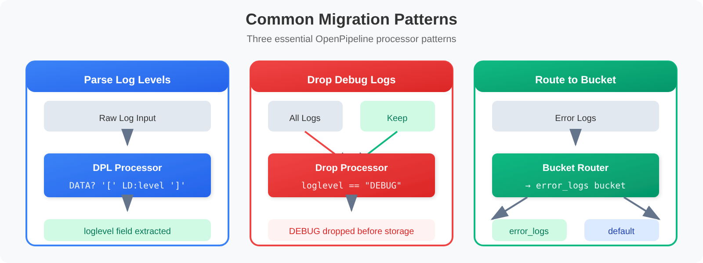

# OPLOGS-02: Migration to OpenPipeline

> **Series:** OPLOGS — OpenPipeline Logs | **Notebook:** 2 of 8 | **Created:** December 2025 | **Last Updated:** 10/02/2026

## Planning and Executing Your Log Migration
This notebook guides you through assessing your current log environment and planning migration to OpenPipeline v2.0.

---

## Table of Contents

1. [Migration Assessment](#migration-assessment)
2. [Migration Paths](#migration-paths)
3. [Planning Your OpenPipeline Configuration](#planning-your-openpipeline-configuration)
4. [Migration Validation](#migration-validation)
5. [Common Migration Patterns](#common-migration-patterns)
6. [Migration Checklist](#migration-checklist)
7. [📝 Summary](#summary)
8. [➡️ Next Steps](#next-steps)
9. [📚 References](#references)

---


## Prerequisites

- ✅ Access to a Dynatrace environment with log data
- ✅ Completed OPLOGS-01 fundamentals
- ✅ Knowledge of your current log sources and volumes

<a id="migration-assessment"></a>
## 1. Migration Assessment
Before migrating, you need to understand your current log landscape.

### Key Questions to Answer:

1. **What log sources do I have?** (OneAgent, API, OTLP)
2. **What is my log volume?** (records/hour, GB/day)
3. **Which logs need parsing?** (unstructured content)
4. **What sensitive data exists?** (PII, credentials)
5. **What can be dropped?** (debug, health checks)

```dql
// Assessment Query 1: Log sources inventory
fetch logs, from: now() - 24h
| summarize {
    log_count = count(),
    unique_hosts = countDistinct(dt.entity.host)
  }, by: {dt.openpipeline.source, log.source}
| sort log_count desc
| limit 20
```

```dql
// Assessment Query 2: Log volume by hour (capacity planning)
fetch logs, from: now() - 24h
| makeTimeseries {log_count = count()}, interval: 1h
```

```dql
// Assessment Query 3: Log level distribution
// status groups levels (SEVERE/CRITICAL/FATAL… → ERROR; DEBUG/TRACE/NOTICE → INFO),
// so DEBUG/TRACE are split out of info to keep each record in exactly one bucket
fetch logs, from: now() - 24h
| summarize {
    total = count(),
    errors = countIf(status == "ERROR"),
    warnings = countIf(status == "WARN"),
    info = countIf(status == "INFO" AND NOT in(loglevel, {"DEBUG", "TRACE"})),
    debug = countIf(in(loglevel, {"DEBUG", "TRACE"})),
    none = countIf(status == "NONE")
  }
| fieldsAdd debug_pct = round((toDouble(debug) / toDouble(total)) * 100, decimals: 1)
| fieldsAdd none_pct = round((toDouble(none) / toDouble(total)) * 100, decimals: 1)
```

```dql
// Assessment Query 4: Identify logs that need parsing (loglevel = NONE)
fetch logs, from: now() - 1h
| filter loglevel == "NONE" OR status == "NONE"
| fieldsAdd content_preview = substring(content, from: 0, to: 80)
| summarize {count = count()}, by: {content_preview, dt.openpipeline.source}
| sort count desc
| limit 15
```

```dql
// Assessment Query 5: Potential drop candidates (health checks, heartbeats)
fetch logs, from: now() - 24h
| summarize {
    total = count(),
    health_checks = countIf(matchesPhrase(content, "health") OR matchesPhrase(content, "healthcheck")),
    heartbeats = countIf(matchesPhrase(content, "heartbeat")),
    debug_logs = countIf(loglevel == "DEBUG" OR status == "DEBUG")
  }
| fieldsAdd droppable = health_checks + heartbeats + debug_logs
| fieldsAdd savings_pct = round((toDouble(droppable) / toDouble(total)) * 100, decimals: 1)
```

<a id="migration-paths"></a>
## 2. Migration Paths

### The one thing every path has in common

Log records keep arriving through the same ingest sources (OneAgent, `/api/v2/logs/ingest`, OTLP) whichever path you take. What changes is **where they are processed**. Until a dynamic route sends a record to one of your pipelines, it falls through to the default route — and on a tenant where the classic pipeline exists, that means the classic processing rules:

> *"Data that doesn't match falls back to the default route and continues to be processed by the classic pipeline until you turn off the rules."*

So the migration is: build pipelines, add routes for each data set, compare the output with the classic rules, then turn the classic rules off. Records the classic pipeline processed carry the pipeline id `logs:default` — the query below measures how much is still on it. `dt.openpipeline.source` and `dt.openpipeline.pipelines` are populated for classic records too, so an `isNotNull()` check on them proves nothing.

### Path A: OneAgent

1. Add dynamic routes for the OneAgent data sets (for example by `k8s.namespace.name` or `log.source`) to your pipelines
2. Move each data set's classic processing rules into its pipeline
3. Watch the `logs:default` share fall to zero for those sources

### Path B: Log Ingest API

1. Keep using the `/api/v2/logs/ingest` endpoint — no client change
2. Route the API data sets (`dt.openpipeline.source == "/api/v2/logs/ingest"`) to your pipelines
3. Move their processing rules

### Path C: OTLP

1. Point OTLP exporters at `/api/v2/otlp/v1/logs`
2. Route by `dt.openpipeline.source == "/api/v2/otlp/v1/logs"` (or resource attributes) to your pipelines
3. Configure OTLP-specific processing there

OPMIG-09 covers the full classic-pipeline cut-over, including the business-events scope.

> <sub>**Sources:** [Upgrade from classic pipeline to OpenPipeline (DT docs)](https://docs.dynatrace.com/docs/platform/upgrade/upgrade-your-data-pipeline/migration-classic-pipeline) — the quote above, and the `in(dt.openpipeline.pipelines, "logs:default")` filter for records the classic pipeline processed.</sub>

```dql
// How much log volume is still processed by the classic pipeline, by ingest source.
// Classic records carry the pipeline id "logs:default"; dt.openpipeline.* is populated
// for them too, so isNotNull(dt.openpipeline.pipelines) cannot tell the paths apart.
fetch logs, from: now() - 1h
| summarize {total = count(), classic = countIf(in(dt.openpipeline.pipelines, "logs:default"))}, by: {dt.openpipeline.source}
| fieldsAdd classic_pct = round(100.0 * toDouble(classic) / toDouble(total), decimals: 1)
| sort total desc
```

<a id="planning-your-openpipeline-configuration"></a>
## 3. Planning Your OpenPipeline Configuration
### Pipeline Strategy

| Use Case | Pipeline Configuration |
|----------|------------------------|
| **Unmatched data** | Falls to the default route — the classic pipeline (`logs:default`) where it exists; watch its share |
| **Custom Parsing** | Create pipeline with DPL parse rules |
| **PII Masking** | Masking processors first in the Processing stage (there is no separate masking stage) |
| **Cost Reduction** | Add drop rules for noise |
| **Custom Routing** | Route to specific buckets |

### Bucket Strategy

| Log Type | Bucket | Retention |
|----------|--------|----------|
| Production Errors | `prod_errors` | 90 days |
| Application Logs | `default_logs` | 35 days |
| Debug/Verbose | Drop or 7 days | Minimal |
| Audit/Compliance | `audit_logs` | 365+ days |

```dql
// Analyze current bucket usage
fetch logs, from: now() - 24h
| summarize {
    log_count = count(),
    error_count = countIf(loglevel == "ERROR" OR status == "ERROR")
  }, by: {dt.system.bucket}
| fieldsAdd error_rate = round((toDouble(error_count) / toDouble(log_count)) * 100, decimals: 2)
| sort log_count desc
```

<a id="migration-validation"></a>
## 4. Migration Validation
After configuring OpenPipeline, validate that:

1. ✅ All expected log sources are present
2. ✅ Log counts are consistent
3. ✅ Parsing rules extract expected fields
4. ✅ Masking rules are applied correctly
5. ✅ Routing sends logs to correct buckets

```dql
// Validation Query 1: Confirm all sources are flowing, and none is left on the classic pipeline
fetch logs, from: now() - 1h
| summarize {
    total = count(),
    classic = countIf(in(dt.openpipeline.pipelines, "logs:default")),
    has_bucket = countIf(isNotNull(dt.system.bucket))
  }
| fieldsAdd openpipeline_pct = round((toDouble(total - classic) / toDouble(total)) * 100, decimals: 1)
```

```dql
// Validation Query 2: Check log volume consistency (compare hours)
fetch logs, from: now() - 4h
| makeTimeseries {log_count = count()}, by: {dt.openpipeline.source}, interval: 1h
```

```dql
// Validation Query 3: Verify entity context is preserved
fetch logs, from: now() - 1h
| summarize {
    total = count(),
    with_host = countIf(isNotNull(dt.entity.host)),
    with_process = countIf(isNotNull(dt.entity.process_group)),
    with_k8s_cluster = countIf(isNotNull(dt.entity.kubernetes_cluster)),
    with_k8s_namespace = countIf(isNotNull(k8s.namespace.name))
  }
```

<a id="common-migration-patterns"></a>
## 5. Common Migration Patterns


<!-- MARKDOWN_TABLE_ALTERNATIVE
| Pattern | Processor | Matcher | Action |
|---------|-----------|---------|--------|
| **Parse Log Levels** | DQL | `loglevel == "NONE"` | Extract level from `[LEVEL]` anywhere in content (`DATA? '[' LD:level ']'`) |
| **Drop Debug Logs** | Drop | `loglevel == "DEBUG"` | Remove debug logs before storage |
| **Route Errors** | Bucket assignment | `status == "ERROR"` | Send to `error_logs` bucket (90d retention) |
-->

### Pattern 1: Parse Log Levels from Content

When logs have `loglevel = NONE`, configure a DQL processor to extract the level from content patterns like `[INFO]` or `[ERROR]`.

**Processor Configuration:**
- **Type:** DQL
- **Matcher:** `loglevel == "NONE"`
- **Statement:**

```dql
// DATA? lets the bracket sit anywhere: "2026-10-02 12:00:01 [ERROR] ..." as well as "[ERROR] ..."
parse content, "DATA? '[' LD:parsed_level ']'"
| fieldsAdd loglevel = if(in(upper(parsed_level), {"EMERGENCY", "ALERT", "CRITICAL", "SEVERE", "ERROR", "FATAL", "WARN", "NOTICE", "INFO", "DEBUG", "TRACE"}), upper(parsed_level), else: loglevel)
| fieldsRemove parsed_level
```

> `parse` matches from the start of the field, so without `DATA?` the pattern only fires on lines that *begin* with `[`. It takes the **first** bracketed token; only values from the supported loglevel list are accepted — anything else (a thread name, a bracketed timestamp) leaves the record unchanged. Measure the parse rate at query time (the next cell) before deploying: ingest-time parsing is forward-only.

### Pattern 2: Drop Debug Logs

Reduce storage costs by dropping DEBUG-level logs before storage.

**Processor Configuration:**
- **Type:** Drop
- **Matcher:** `loglevel == "DEBUG"`

### Pattern 3: Route Errors to Dedicated Bucket

Send error logs to a dedicated bucket with longer retention for compliance.

**Bucket Routing Configuration:**
- **Matcher:** `status == "ERROR"` — `status` groups SEVERE, CRITICAL, FATAL… with ERROR; `loglevel == "ERROR"` would miss them
- **Bucket:** `error_logs`
- **Retention:** 90 days

```dql
// Simulate parsing log levels from content
fetch logs, from: now() - 1h
| filter loglevel == "NONE" OR status == "NONE"
| parse content, "DATA? '[' LD:parsed_level ']'"
| fieldsAdd parsed_level = upper(parsed_level)
| filter in(parsed_level, {"EMERGENCY", "ALERT", "CRITICAL", "SEVERE", "ERROR", "FATAL", "WARN", "NOTICE", "INFO", "DEBUG", "TRACE"})
| fields timestamp, content, parsed_level
| limit 10
```

```dql
// Identify logs that would be dropped (DEBUG + health checks)
fetch logs, from: now() - 24h
| filter loglevel == "DEBUG" 
     OR matchesPhrase(content, "healthcheck") 
     OR matchesPhrase(content, "health check")
| summarize {would_drop = count()}, by: {dt.openpipeline.source}
| sort would_drop desc
```

<a id="migration-checklist"></a>
## 6. Migration Checklist
### Pre-Migration
- [ ] Document current log sources and volumes
- [ ] Identify logs requiring custom parsing
- [ ] List sensitive data patterns to mask
- [ ] Define drop rules for noise reduction
- [ ] Plan bucket strategy and retention

### During Migration
- [ ] Configure OpenPipeline settings
- [ ] Create custom pipelines as needed
- [ ] Set up masking rules
- [ ] Configure bucket routing
- [ ] Test with sample data

### Post-Migration
- [ ] Validate all log sources flowing
- [ ] Verify volume consistency
- [ ] Confirm parsing rules working
- [ ] Test masking is applied
- [ ] Update dashboards and alerts
- [ ] Update saved queries to use new fields

---

<a id="summary"></a>
## 📝 Summary
In this notebook, you learned:

✅ **Assessment queries** to understand your current log environment  
✅ **Migration paths** for OneAgent, API, and OTLP sources  
✅ **Pipeline planning** strategies for processing and routing  
✅ **Validation queries** to confirm successful migration  
✅ **Common patterns** for parsing, dropping, and routing  

---

<a id="next-steps"></a>
## ➡️ Next Steps
Continue to **OPLOGS-03: OpenPipeline Processing** to configure parsing, enrichment, extraction and bucket routing.

---

<a id="references"></a>
## 📚 References
- [OpenPipeline (DT docs)](https://docs.dynatrace.com/docs/platform/openpipeline)
- [Log Monitoring API v2 - POST ingest logs (DT docs)](https://docs.dynatrace.com/docs/dynatrace-api/environment-api/log-monitoring-v2/post-ingest-logs)
- [Ingest OTLP logs (DT docs)](https://docs.dynatrace.com/docs/ingest-from/opentelemetry/otlp-api/ingest-logs)

---

<sub>*This notebook was AI-generated from community-submitted and publicly available sources. This notebook series is not officially supported by Dynatrace. Always verify information against official Dynatrace documentation.*</sub>
