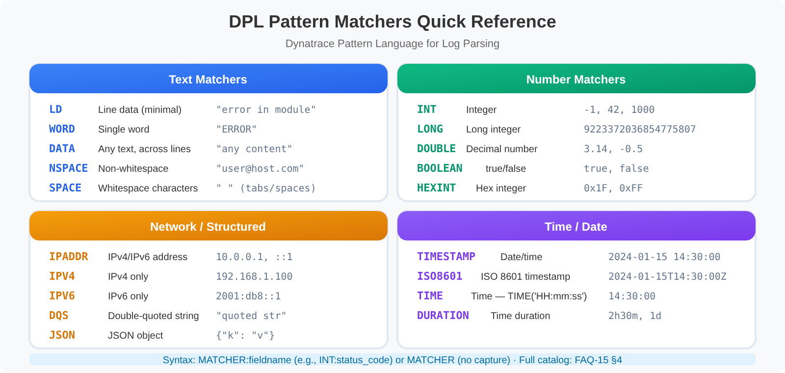

# OPLOGS-03: OpenPipeline Processing

> **Series:** OPLOGS — OpenPipeline Logs | **Notebook:** 3 of 8 | **Created:** December 2025 | **Last Updated:** 09/24/2026

## Configuring Pipeline Stages for Log Transformation
This notebook covers OpenPipeline processing stages: parsing, enrichment, metric extraction, event generation, bucket routing, and filtering.

---

## Table of Contents

1. [Enrichment at the Source](#enrichment-at-the-source)
2. [Parsing & Field Extraction](#parsing-field-extraction)
3. [Metric Extraction from Logs](#metric-extraction-from-logs)
4. [Attribute Creation & Enrichment](#attribute-creation-enrichment)
5. [Event Generation from Logs](#event-generation-from-logs)
6. [Bucket Routing](#bucket-routing)
7. [Filtering (Drop Record)](#filtering-sampling)
8. [Complete Pipeline Example](#complete-pipeline-example)
9. [📝 Summary](#summary)
10. [➡️ Next Steps](#next-steps)
11. [📚 References](#references)

---


## Prerequisites

- ✅ Access to a Dynatrace environment with log data
- ✅ OpenPipeline configuration permissions
- ✅ Completed OPLOGS-01 and OPLOGS-02


<a id="enrichment-at-the-source"></a>
## 1. Enrichment at the Source

> **OneAgent Attribute Enrichment (OneAgent 1.333+):** OneAgent can enrich all telemetry (metrics, spans, logs, events) with primary fields (`dt.security_context`, `dt.cost.costcenter`) and primary tags (`primary_tags.environment`, `primary_tags.team`) at the source — feeding directly into OpenPipeline routing, bucket assignment, and Grail permissions. Set them at install time with `--set-host-tag`, on existing hosts with `oneagentctl --set-host-tag`, or per process with `DT_TAGS`. See [Primary Grail fields and tags enrichment through OneAgent (DT docs)](https://docs.dynatrace.com/docs/ingest-from/dynatrace-oneagent/oneagent-attribute-enrichment).

<a id="parsing-field-extraction"></a>
## 2. Parsing & Field Extraction
Parsing extracts structured fields from unstructured log content **at ingestion time**.

### DPL (Dynatrace Pattern Language) Matchers



<!-- MARKDOWN_TABLE_ALTERNATIVE
DPL Pattern Matchers Quick Reference:

Text Matchers:
- LD: Line data (minimal - stops at the next delimiter) - "error in module"
- WORD: Single word - "ERROR"
- DATA: Any text, across lines - "any content"
- NSPACE: Non-whitespace - "user@host.com"
- SPACE: Whitespace characters - tabs/spaces

Number Matchers:
- INT: Integer - -1, 42, 1000
- LONG: Long integer - 9223372036854775807
- DOUBLE: Decimal number - 3.14, -0.5
- BOOLEAN: true/false
- HEXINT: Hex integer - 0x1F, 0xFF

Network / Structured:
- IPADDR: IPv4/IPv6 address - 10.0.0.1, ::1
- IPV4: IPv4 only - 192.168.1.100
- IPV6: IPv6 only - 2001:db8::1
- DQS: Double-quoted string - "quoted str"
- JSON: JSON object - {"k": "v"}

Time / Date:
- TIMESTAMP: Date/time (default yyyy-MM-dd HH:mm:ss) - 2024-01-15 14:30:00
- ISO8601: ISO 8601 timestamp - 2024-01-15T14:30:00Z
- TIME: Time, e.g. TIME('HH:mm:ss') - 14:30:00
- DURATION: Time duration - 2h30m, 1d

Syntax: MATCHER:fieldname (e.g., INT:status_code) or MATCHER (no capture). Full catalog: FAQ-15 section 4.
-->

| Matcher | Description | Example Match |
|---------|-------------|---------------|
| `LD` | Line data (to delimiter) | Any text |
| `INT` | Integer | `42`, `-17` |
| `DOUBLE` | Decimal number | `3.14`, `-0.5` |
| `IPADDR` | IP address | `192.168.1.1` |
| `WORD` | Word characters | `hello123` |
| `TIMESTAMP` | Date/time | Various formats |
| `JSON` | JSON object/array | `{"key": "value"}` |

### OpenPipeline Parse Processor

```yaml
# Parse HTTP access logs
processors:
  - name: parse-http-logs
    type: dql
    source: content
    dql: |
      parse content, "IPADDR:client_ip SPACE LD SPACE '[' TIMESTAMP:request_time ']' 
                      SPACE '\"' LD:method SPACE LD:path SPACE LD '\"' 
                      SPACE INT:status SPACE INT:bytes"
```

```dql
// Discover log patterns for parsing design
fetch logs, from: now() - 1h
| fieldsAdd content_preview = substring(content, from: 0, to: 100)
| summarize {count = count()}, by: {content_preview}
| sort count desc
| limit 20
```

```dql
// Test parse pattern before configuring in OpenPipeline
fetch logs, from: now() - 1h
| filter contains(content, "GET") OR contains(content, "POST")
| parse content, "LD:method SPACE '/' LD:path SPACE INT:status_code"
| filter isNotNull(status_code)
| summarize {count = count()}, by: {method, status_code}
| sort count desc
| limit 15
```

```dql
// Verify fields already extracted by OpenPipeline
fetch logs, from: now() - 1h
| summarize {
    has_loglevel = countIf(isNotNull(loglevel)),
    has_status = countIf(isNotNull(status)),
    has_trace_id = countIf(isNotNull(trace_id)),
    has_span_id = countIf(isNotNull(span_id))
  }
```

<a id="metric-extraction-from-logs"></a>
## 3. Metric Extraction from Logs
**Extract metrics with dimensions** from log data at ingestion time. This is powerful for:
- Creating SLIs from log patterns
- Building dashboards without log queries
- Enabling metric-based alerting

### OpenPipeline Metric Extraction

```yaml
# Extract request duration metric from logs
processors:
  - name: extract-request-metric
    type: metric
    enabled: true
    condition: contains(content, "duration=")
    metricKey: log.request.duration
    dimensions:
      - service: k8s.namespace.name
      - method: extracted_method
      - status: extracted_status
    value: extracted_duration_ms
```

### Common Metric Extraction Patterns

| Log Pattern | Metric | Dimensions |
|-------------|--------|------------|
| Request completed | `log.request.count` | service, method, status |
| Response time | `log.response.duration` | endpoint, status_code |
| Error occurred | `log.error.count` | error_type, service |
| Queue depth | `log.queue.size` | queue_name |

### SaaS 1.337 (April 2026): Recommended Fields for Extraction Processors

When you configure an extraction processor (metric, Davis event, business event or SDLC event), OpenPipeline suggests the fields to extract. Per the SaaS 1.337 release note: *"Recommendations automatically cover all permission- and cost-relevant fields or dimensions, with support for all Smartscape identifiers and Grail primary tags."* — so dimensions such as `dt.security_context`, `dt.cost.costcenter`, `dt.smartscape.*` and `primary_tags.*` are offered by default. Existing processors are unchanged.

> <sub>**Sources:** [SaaS 1.337 (DT docs)](https://docs.dynatrace.com/docs/whats-new/saas/sprint-337)</sub>

---

```dql
// Identify logs with numeric values for metric extraction
fetch logs, from: now() - 1h
| filter contains(content, "duration") 
        OR contains(content, "latency") 
        OR contains(content, "time=")
        OR contains(content, "ms")
| fieldsAdd content_preview = substring(content, from: 0, to: 120)
| summarize {count = count()}, by: {content_preview}
| sort count desc
| limit 15
```

```dql
// Simulate metric extraction: count by dimensions
// status == "ERROR" covers every error-class level (ERROR, SEVERE, CRITICAL, FATAL, …);
// loglevel == "ERROR" alone misses SEVERE and the rest
fetch logs, from: now() - 1h
| filter isNotNull(k8s.namespace.name)
| summarize {
    request_count = count(),
    error_count = countIf(status == "ERROR")
  }, by: {k8s.namespace.name, k8s.workload.name}
| fieldsAdd error_rate = round((error_count * 100.0) / request_count, decimals: 2)
| sort error_count desc
| limit 15
```

```dql
// Preview: What dimensions would be valuable?
fetch logs, from: now() - 1h
| summarize {
    unique_namespaces = countDistinct(k8s.namespace.name),
    unique_workloads = countDistinct(k8s.workload.name),
    unique_pods = countDistinct(k8s.pod.name),
    unique_hosts = countDistinct(dt.entity.host),
    unique_sources = countDistinct(dt.openpipeline.source)
  }
```

<a id="attribute-creation-enrichment"></a>
## 4. Attribute Creation & Enrichment

### Sprint 1.345 (August 2026): Inline Lookup Processor

Enrichment that previously needed a DQL `if()` ladder — or an external system — can now be expressed as a **lookup table defined inside the processor**. The **Inline lookup** processor maps an existing attribute to a new or updated value with no external connection.

| Fits | Example |
|---|---|
| Code → description | HTTP or application error code to a human-readable meaning |
| Identifier → ownership | App ID to business unit or cost centre |
| Attribute → security context | Existing attribute to a `dt.security_context` value |

It is available in the **Processing** stage across every scope — logs, spans, metrics, business events, security events, user events and sessions, and the Davis/SDLC event pipelines — not logs alone. SaaS 1.345 released 08/11/2026 with a **staged tenant rollout**; verify the processor is present in your pipeline editor before designing against it. The `if()`-ladder pattern shown below remains correct and keeps working, and is still the better fit when the mapping is computed rather than enumerated.

Add **computed attributes** to logs for enhanced analysis and filtering.

### OpenPipeline Field Processor

```yaml
# Add computed attributes
processors:
  - name: enrich-environment
    type: fieldsAdd
    fields:
      - name: environment
        value: |
          if(contains(k8s.namespace.name, "prod"), "production",
          else: if(contains(k8s.namespace.name, "staging"), "staging",
          else: "development"))
      
      - name: severity_score
        value: |
          if(loglevel == "ERROR", 3,
          else: if(loglevel == "WARN", 2,
          else: 1))
      
      - name: team_owner
        value: |
          if(contains(k8s.namespace.name, "payment"), "platform-team",
          else: if(contains(k8s.namespace.name, "frontend"), "web-team",
          else: "unknown"))
```

### Common Attribute Patterns

| Attribute | Source | Use Case |
|-----------|--------|----------|
| `environment` | namespace name | Filter prod vs dev |
| `team_owner` | namespace/labels | Route alerts |
| `severity_score` | loglevel | Prioritization |
| `log_category` | content patterns | Classification |

```dql
// Preview attribute creation logic
fetch logs, from: now() - 1h
| filter isNotNull(k8s.namespace.name)
| fieldsAdd environment = if(contains(k8s.namespace.name, "prod"), "production",
                          else: if(contains(k8s.namespace.name, "staging"), "staging",
                          else: "development"))
| fieldsAdd severity_score = if(loglevel == "ERROR", 3,
                             else: if(loglevel == "WARN", 2,
                             else: 1))
| summarize {count = count()}, by: {environment, severity_score, loglevel}
| sort environment asc, severity_score desc
```

```dql
// Categorize logs by content patterns
fetch logs, from: now() - 1h
| fieldsAdd log_category = if(contains(content, "Exception") OR contains(content, "Error"), "exception",
                           else: if(contains(content, "request") OR contains(content, "response"), "http",
                           else: if(contains(content, "database") OR contains(content, "query"), "database",
                           else: if(contains(content, "auth") OR contains(content, "login"), "security",
                           else: "general"))))
| summarize {count = count()}, by: {log_category, loglevel}
| sort count desc
```

```dql
// Identify namespaces for team ownership mapping
fetch logs, from: now() - 1h
| filter isNotNull(k8s.namespace.name)
| summarize {log_count = count()}, by: {k8s.namespace.name}
| sort log_count desc
| limit 20
```

<a id="event-generation-from-logs"></a>
## 5. Event Generation from Logs
Create **business events** from specific log patterns. Events flow to Grail and can trigger workflows.

### OpenPipeline Event Processor

```yaml
# Generate events from critical log patterns
processors:
  - name: generate-payment-events
    type: bizevents
    enabled: true
    condition: contains(content, "payment") AND contains(content, "completed")
    eventType: com.example.payment.completed
    attributes:
      - payment_id: extracted_payment_id
      - amount: extracted_amount
      - currency: extracted_currency
      - customer_id: extracted_customer

  - name: generate-error-events
    type: bizevents  
    enabled: true
    condition: loglevel == "ERROR" AND contains(content, "critical")
    eventType: com.example.critical.error
    attributes:
      - error_type: extracted_error_type
      - service: k8s.namespace.name
```

### Event Use Cases

| Log Pattern | Event Type | Purpose |
|-------------|------------|----------|
| Order completed | `order.completed` | Business analytics |
| User signup | `user.registered` | Funnel tracking |
| Deployment | `deployment.completed` | Change tracking |
| Critical error | `error.critical` | Workflow trigger — **not** a problem; see below |

### Business events do not open problems

Both processors above are `type: bizevents`, and that determines what the output can do. A business event lands in Grail, is queryable, and can trigger a workflow — but it **never raises a Davis problem** and never enters problem correlation. The `error.critical` row above is the one to watch: a critical-error business event is a perfectly good workflow trigger, and it is not an incident. Nothing in the Problems app will show it, and no on-call escalation built on problem triggers will see it.

That distinction decides which processor you want:

| You want | Extract as | Opens a problem? | Correlation key applies? |
|---|---|---|---|
| Analytics, funnels, KPIs, a workflow hook | **Business event** (`bizevents`) | No | No — not part of this path |
| An alert that participates in incident response | **Davis event** | Yes | **Yes** — `dt.smartscape_source.id` is mandatory |

If you need the second, the Davis-event extraction path has one hard prerequisite: the event must be attributable to a Smartscape entity. Events sharing a `dt.smartscape_source.id` merge into a single problem; an event that leaves it unset is attributed to the environment entity instead, so **every** extraction across the tenant names that same entity and collapses into one problem — which, for a per-record processor firing at log volume, produces a permanently-open problem that names nothing you can act on. Since extraction can only read fields already on the record, that means the source stream must be entity-enriched first (§4 above, and the OneAgent attribute-enrichment note in this notebook's prerequisites). OPMIG-07 covers the Davis-event extraction configuration and carries a coverage query for checking the source stream; AIOPS-03 §1 covers the correlation rules.

> <sub>**Sources:** [Avoid overalerting (DT docs)](https://docs.dynatrace.com/docs/dynatrace-intelligence/use-cases/avoid-overalerting). **Derived:** the two-row processor-choice table maps the documented correlation requirement onto the bizevents-vs-Davis-event split this section configures.</sub>

```dql
// Discover patterns suitable for event generation
fetch logs, from: now() - 1h
| filter contains(content, "completed") 
        OR contains(content, "success")
        OR contains(content, "failed")
        OR contains(content, "created")
| fieldsAdd content_preview = substring(content, from: 0, to: 100)
| summarize {count = count()}, by: {content_preview}
| sort count desc
| limit 20
```

```dql
// Check existing bizevents (if any generated)
fetch bizevents, from: now() - 24h
| summarize {count = count()}, by: {event.type}
| sort count desc
| limit 15
```

```dql
// Preview: Logs that would become critical error events
fetch logs, from: now() - 1h
| filter loglevel == "ERROR"
| filter contains(content, "critical") 
        OR contains(content, "fatal")
        OR contains(content, "severe")
| fieldsAdd content_preview = substring(content, from: 0, to: 100)
| fields timestamp, k8s.namespace.name, content_preview
| sort timestamp desc
| limit 20
```

<a id="bucket-routing"></a>
## 6. Bucket Routing
Route logs to **appropriate buckets** based on content, source, or computed attributes.

### Why Bucket Routing Matters

| Bucket | Logs | Retention | Cost Impact |
|--------|------|-----------|-------------|
| `default_logs` | Standard | 35 days | Baseline |
| `debug_logs` | DEBUG/TRACE | 7 days | 80% savings |
| `audit_logs` | Security/compliance | 365 days | Compliance |
| `error_logs` | Errors only | 90 days | Investigation |

### OpenPipeline Route Processor

```yaml
# Route logs to appropriate buckets
processors:
  - name: route-debug-logs
    type: route
    condition: loglevel == "DEBUG" OR loglevel == "TRACE"
    bucket: debug_logs
    
  - name: route-audit-logs
    type: route
    condition: contains(content, "audit") OR contains(content, "security")
    bucket: audit_logs
    
  - name: route-error-logs
    type: route
    condition: loglevel == "ERROR" OR loglevel == "FATAL"
    bucket: error_logs
```

```dql
// Current bucket distribution
fetch logs, from: now() - 1h
| summarize {count = count()}, by: {dt.system.bucket}
| sort count desc
```

```dql
// Preview routing decisions
fetch logs, from: now() - 1h
| fieldsAdd target_bucket = if(loglevel == "DEBUG" OR loglevel == "TRACE", "debug_logs",
                            else: if(loglevel == "ERROR" OR loglevel == "FATAL", "error_logs",
                            else: if(contains(content, "audit") OR contains(content, "security"), "audit_logs",
                            else: "default_logs")))
| summarize {count = count()}, by: {target_bucket, loglevel}
| sort count desc
```

```dql
// Estimate storage savings from routing
fetch logs, from: now() - 24h
| fieldsAdd content_bytes = stringLength(content)
| summarize {
    total_logs = count(),
    total_mb = sum(content_bytes) / 1048576.0,
    debug_logs = countIf(loglevel == "DEBUG" OR loglevel == "TRACE"),
    debug_mb = sum(if(loglevel == "DEBUG" OR loglevel == "TRACE", content_bytes, else: 0)) / 1048576.0
  }
| fieldsAdd debug_pct = round((debug_logs * 100.0) / total_logs, decimals: 1)
| fieldsAdd savings_7d_vs_35d = round(debug_mb * 0.8, decimals: 2)
```

<a id="filtering-sampling"></a>
## 7. Filtering (Drop Record)
Reduce log volume by **dropping** low-value records at ingestion.

### OpenPipeline Filter Processor

```yaml
# Drop noisy, low-value logs
processors:
  - name: drop-health-checks
    type: filter
    condition: contains(content, "health") AND loglevel == "INFO"
    action: drop
    
  - name: drop-heartbeats
    type: filter
    condition: contains(content, "heartbeat") OR contains(content, "keepalive")
    action: drop
```

> **There is no log-sampling processor.** None appears in the complete processor list in *Processing in OpenPipeline*, and a matcher cannot sample — `random()` is rejected in OpenPipeline matchers. To drop DEBUG records outright, use a **Drop record** processor (`loglevel == "DEBUG"`) in the Processing stage. To keep metric extraction from DEBUG records while not storing them, use a **No storage assignment** processor in the Bucket assignment stage instead: *"The record continues through all pipeline stages, including metric extraction, and is not stored only at the end."*
>
> <sub>**Sources:** [Processing in OpenPipeline (DT docs)](https://docs.dynatrace.com/docs/platform/openpipeline/concepts/processing) — *"The following table lists alphabetically all available processors in a pipeline."*, [OpenPipeline processing examples (DT docs)](https://docs.dynatrace.com/docs/platform/openpipeline/use-cases/processing-examples)</sub>

```dql
// Identify candidates for filtering (high volume, low value)
fetch logs, from: now() - 1h
| filter contains(content, "health")
        OR contains(content, "heartbeat")
        OR contains(content, "alive")
        OR contains(content, "ready")
| summarize {count = count()}, by: {k8s.namespace.name, loglevel}
| sort count desc
| limit 15
```

```dql
// Calculate potential savings from filtering health checks
fetch logs, from: now() - 24h
| summarize {
    total_logs = count(),
    health_logs = countIf(contains(content, "health") OR contains(content, "heartbeat")),
    debug_logs = countIf(loglevel == "DEBUG")
  }
| fieldsAdd health_pct = round((health_logs * 100.0) / total_logs, decimals: 1)
| fieldsAdd debug_pct = round((debug_logs * 100.0) / total_logs, decimals: 1)
| fieldsAdd potential_reduction = round(((health_logs + debug_logs * 0.9) * 100.0) / total_logs, decimals: 1)
```

<a id="complete-pipeline-example"></a>
## 8. Complete Pipeline Example
Here's a comprehensive OpenPipeline configuration:

```yaml
# Complete OpenPipeline configuration for logs
name: production-log-pipeline
enabled: true

processors:
  # 1. FILTER - Remove unwanted logs first
  - name: drop-health-checks
    type: filter
    condition: contains(content, "health") AND loglevel == "INFO"
    action: drop

  # 2. PARSE - Extract structured fields
  - name: parse-http-logs
    type: dql
    condition: contains(content, "HTTP")
    dql: parse content, "LD:method SPACE '/' LD:path SPACE INT:status SPACE INT:duration_ms"

  # 3. ENRICH - Add computed attributes
  - name: add-environment
    type: fieldsAdd
    fields:
      - name: environment
        value: if(contains(k8s.namespace.name, "prod"), "production", else: "non-prod")

  # 4. MASK - Protect sensitive data (DQL processor; the pattern is DPL, not regex)
  - name: mask-emails
    type: dql
    dql: fieldsAdd content = replacePattern(content, "[A-Za-z0-9._%+-]+ '@' [A-Za-z0-9.-]+", "[EMAIL-MASKED]")

  # 5. EXTRACT METRICS - Create dimensional metrics
  - name: extract-request-count
    type: metric
    metricKey: log.http.requests
    dimensions:
      - namespace: k8s.namespace.name
      - status: status

  # 6. GENERATE EVENTS - Create business events
  - name: generate-error-events
    type: bizevents
    condition: loglevel == "ERROR"
    eventType: com.app.error

  # 7. ROUTE - Send to appropriate bucket
  - name: route-debug
    type: route
    condition: loglevel == "DEBUG"
    bucket: debug_logs
```

```dql
// Verify current pipeline processing
fetch logs, from: now() - 1h
| summarize {
    total_logs = count(),
    with_pipeline = countIf(isNotNull(dt.openpipeline.pipelines)),
    unique_pipelines = countDistinct(dt.openpipeline.pipelines)
  }, by: {dt.openpipeline.source}
| sort total_logs desc
```

```dql
// Pipeline processing summary
fetch logs, from: now() - 1h
| summarize {count = count()}, by: {dt.openpipeline.pipelines, dt.system.bucket}
| sort count desc
```

---

<a id="summary"></a>
## 📝 Summary
In this notebook, you learned:

✅ **Parsing** - Extract structured fields at ingestion  
✅ **Metrics** - Create dimensional metrics from logs  
✅ **Attributes** - Add computed fields for analysis  
✅ **Events** - Generate business events from patterns  
✅ **Routing** - Direct logs to appropriate buckets  
✅ **Filtering** - Drop low-value logs (or skip storage with No storage assignment)  

### Key Takeaway

> **Process at ingestion, not at query time.** OpenPipeline processing is fundamental to cost optimization, data quality, and operational efficiency.

---

<a id="next-steps"></a>
## ➡️ Next Steps
Continue to **OPLOGS-04: Buckets & Data Governance** to learn about storage management and retention policies.

---

<a id="references"></a>
## 📚 References
- [OpenPipeline (DT docs)](https://docs.dynatrace.com/docs/platform/openpipeline)
- [Processing in OpenPipeline (DT docs)](https://docs.dynatrace.com/docs/platform/openpipeline/concepts/processing)
- [Parse log lines and extract a metric (DT docs)](https://docs.dynatrace.com/docs/platform/openpipeline/use-cases/tutorial-log-processing-pipeline)
- [Get business events from logs and spans (DT docs)](https://docs.dynatrace.com/docs/observe/business-observability/bo-events-capturing/bo-events-capturing-logs-and-spans)
- [Dynatrace Pattern Language (DT docs)](https://docs.dynatrace.com/docs/platform/grail/dynatrace-pattern-language)
- [OpenPipeline processing examples (DT docs)](https://docs.dynatrace.com/docs/platform/openpipeline/use-cases/processing-examples)

---

<sub>*This notebook was AI-generated from community-submitted and publicly available sources. This notebook series is not officially supported by Dynatrace. Always verify information against official Dynatrace documentation.*</sub>
