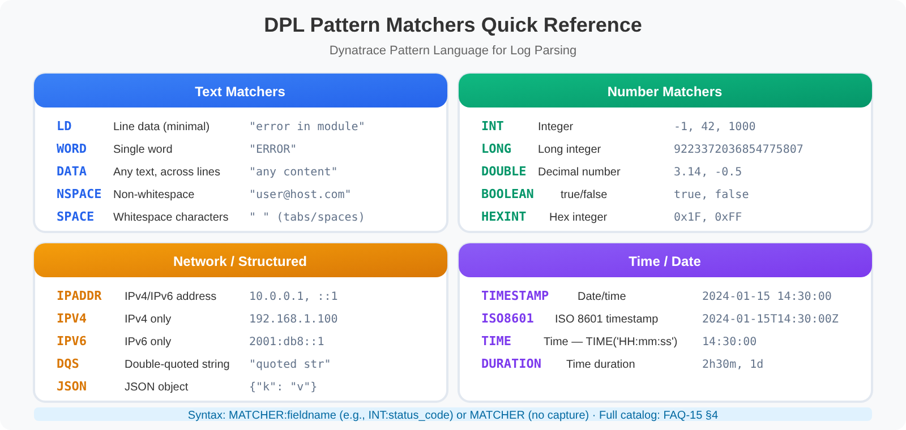

# OPLOGS-03: OpenPipeline Processing

> **Series:** OPLOGS — OpenPipeline Logs | **Notebook:** 3 of 8 | **Created:** December 2025 | **Last Updated:** 10/05/2026

## Configuring Pipeline Stages for Log Transformation
This notebook covers OpenPipeline processing stages: parsing, enrichment, metric extraction, event generation, bucket routing, and filtering.

---

## Table of Contents

1. [Enrichment at the Source](#enrichment-at-the-source)
2. [Parsing & Field Extraction](#parsing-field-extraction)
3. [Metric Extraction from Logs](#metric-extraction-from-logs)
4. [Attribute Creation & Enrichment](#attribute-creation-enrichment)
5. [Event Generation from Logs](#event-generation-from-logs)
6. [Bucket Routing](#bucket-routing)
7. [Filtering (Drop Record)](#filtering-sampling)
8. [Complete Pipeline Example](#complete-pipeline-example)
9. [📝 Summary](#summary)
10. [➡️ Next Steps](#next-steps)
11. [📚 References](#references)

---


## Prerequisites

- ✅ Access to a Dynatrace environment with log data
- ✅ OpenPipeline configuration permissions
- ✅ Completed OPLOGS-01 and OPLOGS-02


<a id="enrichment-at-the-source"></a>
## 1. Enrichment at the Source

> **OneAgent Attribute Enrichment (OneAgent 1.333+):** OneAgent can enrich all telemetry (metrics, spans, logs, events) with primary fields (`dt.security_context`, `dt.cost.costcenter`) and primary tags (`primary_tags.environment`, `primary_tags.team`) at the source — feeding directly into OpenPipeline routing, bucket assignment, and Grail permissions. Set them at install time with `--set-host-tag`, on existing hosts with `oneagentctl --set-host-tag`, or per process with `DT_TAGS`. See [Primary Grail fields and tags enrichment through OneAgent (DT docs)](https://docs.dynatrace.com/docs/ingest-from/dynatrace-oneagent/oneagent-attribute-enrichment).

<a id="parsing-field-extraction"></a>
## 2. Parsing & Field Extraction
Parsing extracts structured fields from unstructured log content **at ingestion time**.

### DPL (Dynatrace Pattern Language) Matchers



<!-- MARKDOWN_TABLE_ALTERNATIVE
DPL Pattern Matchers Quick Reference:

Text Matchers:
- LD: Line data (minimal - stops at the next delimiter) - "error in module"
- WORD: Single word - "ERROR"
- DATA: Any text, across lines - "any content"
- NSPACE: Non-whitespace - "user@host.com"
- SPACE: Whitespace characters - tabs/spaces

Number Matchers:
- INT: Integer - -1, 42, 1000
- LONG: Long integer - 9223372036854775807
- DOUBLE: Decimal number - 3.14, -0.5
- BOOLEAN: true/false
- HEXINT: Hex integer - 0x1F, 0xFF

Network / Structured:
- IPADDR: IPv4/IPv6 address - 10.0.0.1, ::1
- IPV4: IPv4 only - 192.168.1.100
- IPV6: IPv6 only - 2001:db8::1
- DQS: Double-quoted string - "quoted str"
- JSON: JSON object - {"k": "v"}

Time / Date:
- TIMESTAMP: Date/time (default yyyy-MM-dd HH:mm:ss) - 2024-01-15 14:30:00
- ISO8601: ISO 8601 timestamp - 2024-01-15T14:30:00Z
- TIME: Time, e.g. TIME('HH:mm:ss') - 14:30:00
- DURATION: Time duration (unit set by its configuration — `2h30m` is NOT parsed as two and a half hours; test with `data record(...)`)

Syntax: MATCHER:fieldname (e.g., INT:status_code) or MATCHER (no capture). Full catalog: FAQ-15 section 4.
-->

| Matcher | Description | Example Match |
|---------|-------------|---------------|
| `LD` | Line data (to delimiter) | Any text |
| `INT` | Integer | `42`, `-17` |
| `DOUBLE` | Decimal number | `3.14`, `-0.5` |
| `IPADDR` | IP address | `192.168.1.1` |
| `WORD` | Word characters | `hello123` |
| `TIMESTAMP` | Date/time | Various formats |
| `JSON` | JSON object/array | `{"key": "value"}` |

### OpenPipeline Parse Processor

A parse is a **DQL** processor in the pipeline's **Processing** stage. OpenPipeline has no processor configuration file; you add the processor in **Settings > Process and contextualize > OpenPipeline > Logs > Pipelines**:

| Field | Value |
|---|---|
| Processor | DQL |
| Name | `parse-http-logs` |
| Matching condition | `matchesValue(content, "*HTTP/1.1*")` |
| DQL processor definition | see below |

```dql
// Apache/Nginx common log format, e.g.
// 10.1.1.1 - frank [12/Dec/2024:10:30:45 +0000] "GET /api/users HTTP/1.1" 200 1234
parse content, "IPADDR:client_ip SPACE LD SPACE LD SPACE '[' TIMESTAMP('dd/MMM/yyyy:HH:mm:ss Z'):request_time ']' SPACE '\"' LD:method SPACE LD:path SPACE LD '\"' SPACE INT:status_code SPACE INT:bytes"
```

`TIMESTAMP` needs the format string when the log is not `yyyy-MM-dd HH:mm:ss`, and identity and user are two separate `LD` fields — without either, the whole parse returns null (verified with `data record(...)`, 10/02/2026).

```dql
// Discover log patterns for parsing design
fetch logs, from: now() - 1h
| fieldsAdd content_preview = substring(content, from: 0, to: 100)
| summarize {count = count()}, by: {content_preview}
| sort count desc
| limit 20
```

```dql
// Test parse pattern before configuring in OpenPipeline
// Expects lines that START with the method, e.g. "GET /api/users 200 45ms" — parse anchors at the start of the field
fetch logs, from: now() - 1h
| filter contains(content, "GET") OR contains(content, "POST")
| parse content, "LD:method SPACE '/' LD:path SPACE INT:status_code"
| filter isNotNull(status_code)
| summarize {count = count()}, by: {method, status_code}
| sort count desc
| limit 15
```

```dql
// Verify fields already extracted by OpenPipeline
fetch logs, from: now() - 1h
| summarize {
    has_loglevel = countIf(isNotNull(loglevel)),
    has_status = countIf(isNotNull(status)),
    has_trace_id = countIf(isNotNull(trace_id)),
    has_span_id = countIf(isNotNull(span_id))
  }
```

<a id="metric-extraction-from-logs"></a>
## 3. Metric Extraction from Logs
**Extract metrics with dimensions** from log data at ingestion time. This is powerful for:
- Creating SLIs from log patterns
- Building dashboards without log queries
- Enabling metric-based alerting

### OpenPipeline Metric Extraction

A **Value metric** processor in the **Metric extraction** stage. The fields it reads (`duration_ms`, `http.method`, `http.status_code`) must already exist — parse them in the Processing stage first.

| Field | Value |
|---|---|
| Processor | Value metric |
| Name | `extract-request-metric` |
| Matching condition | `isNotNull(duration_ms)` |
| Metric key | `log.request.duration` |
| Value | field `duration_ms` |
| Dimensions | `k8s.namespace.name`, `http.method`, `http.status_code` |

> **Write matching conditions without `contains()`.** OpenPipeline matchers accept only a subset of DQL, and `contains()` and `in()` are rejected there (the verifier error `The function contains() isn't enabled.`). Use `matchesValue(field, "*text*")` (case-insensitive substring) or `matchesPhrase(field, "text")` (whole words). The conditions in this notebook's configuration sketches are written that way. `contains()` is still fine inside a DQL processor statement and in queries.

### Common Metric Extraction Patterns

| Log Pattern | Metric | Dimensions |
|-------------|--------|------------|
| Request completed | `log.request.count` | service, method, status |
| Response time | `log.response.duration` | endpoint, status_code |
| Error occurred | `log.error.count` | error_type, service |
| Queue depth | `log.queue.size` | queue_name |

### SaaS 1.337 (April 2026): Recommended Fields for Extraction Processors

When you configure an extraction processor (metric, Davis event, business event or SDLC event), OpenPipeline suggests the fields to extract. Per the SaaS 1.337 release note: *"Recommendations automatically cover all permission- and cost-relevant fields or dimensions, with support for all Smartscape identifiers and Grail primary tags."* — so dimensions such as `dt.security_context`, `dt.cost.costcenter`, `dt.smartscape.*` and `primary_tags.*` are offered by default. Existing processors are unchanged.

> <sub>**Sources:** [SaaS 1.337 (DT docs)](https://docs.dynatrace.com/docs/whats-new/saas/sprint-337)</sub>

---

```dql
// Identify logs with numeric values for metric extraction
fetch logs, from: now() - 1h
| filter contains(content, "duration") 
        OR contains(content, "latency") 
        OR contains(content, "time=")
        OR contains(content, "ms")
| fieldsAdd content_preview = substring(content, from: 0, to: 120)
| summarize {count = count()}, by: {content_preview}
| sort count desc
| limit 15
```

```dql
// Simulate metric extraction: count by dimensions
// status == "ERROR" covers every error-class level (ERROR, SEVERE, CRITICAL, FATAL, …);
// loglevel == "ERROR" alone misses SEVERE and the rest
fetch logs, from: now() - 1h
| filter isNotNull(k8s.namespace.name)
| summarize {
    request_count = count(),
    error_count = countIf(status == "ERROR")
  }, by: {k8s.namespace.name, k8s.workload.name}
| fieldsAdd error_rate = round((error_count * 100.0) / request_count, decimals: 2)
| sort error_count desc
| limit 15
```

```dql
// Preview: What dimensions would be valuable?
fetch logs, from: now() - 1h
| summarize {
    unique_namespaces = countDistinct(k8s.namespace.name),
    unique_workloads = countDistinct(k8s.workload.name),
    unique_pods = countDistinct(k8s.pod.name),
    unique_hosts = countDistinct(dt.entity.host),
    unique_sources = countDistinct(dt.openpipeline.source)
  }
```

<a id="attribute-creation-enrichment"></a>
## 4. Attribute Creation & Enrichment

### Sprint 1.345 (August 2026): Inline Lookup Processor

Enrichment that previously needed a DQL `if()` ladder — or an external system — can now be expressed as a **lookup table defined inside the processor**. The **Inline lookup** processor maps an existing attribute to a new or updated value with no external connection.

| Fits | Example |
|---|---|
| Code → description | HTTP or application error code to a human-readable meaning |
| Identifier → ownership | App ID to business unit or cost centre |
| Attribute → security context | Existing attribute to a `dt.security_context` value |

It is available in the **Processing** stage across every scope — logs, spans, metrics, business events, security events, user events and sessions, and the Davis/SDLC event pipelines — not logs alone. SaaS 1.345 released 08/11/2026 with a **staged tenant rollout**; verify the processor is present in your pipeline editor before designing against it. The `if()`-ladder pattern shown below remains correct and keeps working, and is still the better fit when the mapping is computed rather than enumerated.

Add **computed attributes** to logs for enhanced analysis and filtering.

### OpenPipeline Field Processor

Computed attributes are a **DQL** processor in the Processing stage. Matching condition `true`; processor definition:

```dql
fieldsAdd environment = if(contains(k8s.namespace.name, "prod"), "production",
                        else: if(contains(k8s.namespace.name, "staging"), "staging",
                        else: "development"))
| fieldsAdd severity_score = if(status == "ERROR", 3,
                             else: if(status == "WARN", 2,
                             else: 1))
| fieldsAdd team_owner = if(contains(k8s.namespace.name, "payment"), "platform-team",
                         else: if(contains(k8s.namespace.name, "frontend"), "web-team",
                         else: "unknown"))
```

`contains()` is fine **inside** a DQL processor definition; it is only the matching condition that rejects it.

### Common Attribute Patterns

| Attribute | Source | Use Case |
|-----------|--------|----------|
| `environment` | namespace name | Filter prod vs dev |
| `team_owner` | namespace/labels | Route alerts |
| `severity_score` | loglevel | Prioritization |
| `log_category` | content patterns | Classification |

```dql
// Preview attribute creation logic
fetch logs, from: now() - 1h
| filter isNotNull(k8s.namespace.name)
| fieldsAdd environment = if(contains(k8s.namespace.name, "prod"), "production",
                          else: if(contains(k8s.namespace.name, "staging"), "staging",
                          else: "development"))
| fieldsAdd severity_score = if(loglevel == "ERROR", 3,
                             else: if(loglevel == "WARN", 2,
                             else: 1))
| summarize {count = count()}, by: {environment, severity_score, loglevel}
| sort environment asc, severity_score desc
```

```dql
// Categorize logs by content patterns
fetch logs, from: now() - 1h
| fieldsAdd log_category = if(contains(content, "Exception") OR contains(content, "Error"), "exception",
                           else: if(contains(content, "request") OR contains(content, "response"), "http",
                           else: if(contains(content, "database") OR contains(content, "query"), "database",
                           else: if(contains(content, "auth") OR contains(content, "login"), "security",
                           else: "general"))))
| summarize {count = count()}, by: {log_category, loglevel}
| sort count desc
```

```dql
// Identify namespaces for team ownership mapping
fetch logs, from: now() - 1h
| filter isNotNull(k8s.namespace.name)
| summarize {log_count = count()}, by: {k8s.namespace.name}
| sort log_count desc
| limit 20
```

<a id="event-generation-from-logs"></a>
## 5. Event Generation from Logs
Create **business events** from specific log patterns. Events flow to Grail and can trigger workflows.

### Business event processor (Data extraction stage)

Event generation is a **Business event** processor in the pipeline's **Data extraction** stage — there is no configuration file to write. In **Settings > Process and contextualize > OpenPipeline > Logs > Pipelines**, open the pipeline, go to **Data extraction**, and add one processor per event. Each takes a *Name*, a *Matching condition*, an *Event type* and an *Event provider* (each either a record field or a static string), and a *Field extraction* choice (all fields, only listed fields, or all except listed fields):

| Name | Matching condition | Event type (static) | Event provider (static) | Field extraction |
|------|--------------------|---------------------|-------------------------|------------------|
| `payment-completed` | `matchesValue(content, "*payment*") AND matchesValue(content, "*completed*")` | `com.example.payment.completed` | `payment-service` | Fields to extract: `payment_id`, `amount`, `currency`, `customer_id` |
| `critical-error` | `status == "ERROR" AND matchesValue(content, "*critical*")` | `com.example.critical.error` | `app-logs` | Fields to extract: `error_type`, `k8s.namespace.name` |

The fields you extract must already exist on the record when the Data extraction stage runs — parse `payment_id`, `amount` and the others in the **Processing** stage first (§2). Matching conditions accept only a subset of DQL: `contains()` and `in()` are rejected (the verifier error `The function contains() isn't enabled.`), so substring tests use `matchesValue(field, "*text*")`, which is case-insensitive. Both conditions above verify as valid logs matchers; the error condition uses `status == "ERROR"` so SEVERE, CRITICAL and FATAL records are included (see the error-count query in §3).

### Event Use Cases

| Log Pattern | Event Type | Processor | Purpose |
|-------------|------------|-----------|----------|
| Order completed | `order.completed` | Business event | Business analytics |
| User signup | `user.registered` | Business event | Funnel tracking |
| Deployment | `deployment` | **Software development lifecycle event** (same stage) | Change tracking — SDLC events, not business events, are the documented path for deployments, builds and releases |
| Critical error | `error.critical` | Business event | Workflow trigger — **not** a problem; see below |

### Business events do not open problems

Both processors above are **Business event** processors, and that determines what the output can do. A business event lands in Grail, is queryable, and can trigger a workflow — but it **never raises a Davis problem** and never enters problem correlation. The `error.critical` row above is the one to watch: a critical-error business event is a perfectly good workflow trigger, and it is not an incident. Nothing in the Problems app will show it, and no on-call escalation built on problem triggers will see it.

That distinction decides which processor you want:

| You want | Extract as | Opens a problem? | Correlation key applies? |
|---|---|---|---|
| Analytics, funnels, KPIs, a workflow hook | **Business event** (`bizevents`) | No | No — not part of this path |
| An alert that participates in incident response | **Davis event** | Yes | **Yes** — set `dt.smartscape_source.id` to a real entity |

If you need the second, the Davis-event extraction path has one hard prerequisite: the event must be attributable to a Smartscape entity. Events sharing a `dt.smartscape_source.id` merge into a single problem, and the docs ask for the field to be set to an existing Smartscape entity ID. They do not document where a Davis event lands when it is left unset — the one documented environment-entity fallback belongs to the Events API v2, for events posted without an `entitySelector`. On a validation tenant, most events without a `dt.smartscape_source.id` named the **environment** entity instead (re-checked 09/28/2026 over 1 day: 3,940 named the environment; 691 named no entity at all). Extractions that land on that one entity collapse into one problem — which, for a per-record processor firing at log volume, produces a permanently-open problem that names nothing you can act on. Since extraction can only read fields already on the record, that means the source stream must be entity-enriched first (§4 above, and the OneAgent attribute-enrichment note in this notebook's prerequisites). OPMIG-07 covers the Davis-event extraction configuration and carries a coverage query for checking the source stream; AIOPS-03 §1 covers the correlation rules.

> <sub>**Sources:** [Avoid overalerting (DT docs)](https://docs.dynatrace.com/docs/dynatrace-intelligence/use-cases/avoid-overalerting) — *"make sure to set the dt.smartscape_source.id field to an existing Smartscape entity ID, like a host or service entity ID rather than an arbitrary string"*, [Extraction stages (DT docs)](https://docs.dynatrace.com/docs/platform/openpipeline/concepts/extraction) — *"Generate Davis events for incident correlation."*, [Data extraction stage (DT docs)](https://docs.dynatrace.com/docs/platform/openpipeline/concepts/extraction/data-extraction) — *"The Business event processor extracts a business event and re-ingests it."* and, for SDLC events, *"used to track deployments, builds, and releases from CI/CD logs or generic events"*, [DQL matcher in OpenPipeline (DT docs)](https://docs.dynatrace.com/docs/platform/openpipeline/reference/dql/dql-matcher-in-openpipeline). **Derived:** the two-row processor-choice table maps that documented entity-ID guidance onto the bizevents-vs-Davis-event split this section configures; the environment-entity outcome above is a dated tenant observation, not a documented contract.</sub>

```dql
// Discover patterns suitable for event generation
fetch logs, from: now() - 1h
| filter contains(content, "completed") 
        OR contains(content, "success")
        OR contains(content, "failed")
        OR contains(content, "created")
| fieldsAdd content_preview = substring(content, from: 0, to: 100)
| summarize {count = count()}, by: {content_preview}
| sort count desc
| limit 20
```

```dql
// Check existing bizevents (if any generated)
fetch bizevents, from: now() - 24h
| summarize {count = count()}, by: {event.type}
| sort count desc
| limit 15
```

```dql
// Preview: Logs that would become critical error events
fetch logs, from: now() - 1h
// status == "ERROR" also counts SEVERE, CRITICAL and FATAL logs; loglevel == "ERROR" misses them
| filter status == "ERROR"
| filter contains(content, "critical") 
        OR contains(content, "fatal")
        OR contains(content, "severe")
| fieldsAdd content_preview = substring(content, from: 0, to: 100)
| fields timestamp, k8s.namespace.name, content_preview
| sort timestamp desc
| limit 20
```

<a id="bucket-routing"></a>
## 6. Bucket Routing
Route logs to **appropriate buckets** based on content, source, or computed attributes.

### Why Bucket Routing Matters

| Bucket | Logs | Retention | Cost Impact |
|--------|------|-----------|-------------|
| `default_logs` | Standard | 35 days | Baseline |
| `debug_logs` | DEBUG/TRACE | 7 days | Storage for that data ~80% lower (7 of 35 days) |
| `audit_logs` | Security/compliance | 365 days | Compliance |
| `error_logs` | Errors only | 90 days | Investigation |

### Bucket Assignment Processors

Buckets are chosen by **Bucket assignment** processors in the pipeline's **Bucket assignment** stage — *first match only*, so the order of the rows matters. (A *route* picks the pipeline; it does not pick the bucket.)

| # | Matching condition | Bucket |
|---|---|---|
| 1 | `loglevel == "DEBUG" OR loglevel == "TRACE"` | `debug_logs` |
| 2 | `matchesValue(content, "*audit*") OR matchesValue(content, "*security*")` | `audit_logs` |
| 3 | `status == "ERROR"` | `error_logs` |

`status == "ERROR"` covers SEVERE, CRITICAL, FATAL and the other error-class levels; `loglevel == "ERROR" OR loglevel == "FATAL"` would miss SEVERE. In community practice, records matching none of the rows land in the default bucket (`default_logs`) — confirm with the bucket query below.

```dql
// Current bucket distribution
fetch logs, from: now() - 1h
| summarize {count = count()}, by: {dt.system.bucket}
| sort count desc
```

```dql
// Preview routing decisions
fetch logs, from: now() - 1h
| fieldsAdd target_bucket = if(loglevel == "DEBUG" OR loglevel == "TRACE", "debug_logs",
                            else: if(contains(content, "audit") OR contains(content, "security"), "audit_logs",
                            else: if(status == "ERROR", "error_logs",
                            else: "default_logs")))
| summarize {count = count()}, by: {target_bucket, loglevel}
| sort count desc
```

```dql
// Estimate storage savings from routing
fetch logs, from: now() - 24h
| fieldsAdd content_bytes = stringLength(content)
| summarize {
    total_logs = count(),
    total_mb = sum(content_bytes) / 1048576.0,
    debug_logs = countIf(loglevel == "DEBUG" OR loglevel == "TRACE"),
    debug_mb = sum(if(loglevel == "DEBUG" OR loglevel == "TRACE", content_bytes, else: 0)) / 1048576.0
  }
| fieldsAdd debug_pct = round((debug_logs * 100.0) / total_logs, decimals: 1)
| fieldsAdd savings_7d_vs_35d = round(debug_mb * 0.8, decimals: 2)
```

<a id="filtering-sampling"></a>
## 7. Filtering (Drop Record)
Reduce log volume by **dropping** low-value records at ingestion.

### Drop Record Processors

Two **Drop record** processors in the Processing stage (the processor has a name and a matching condition — nothing else):

| Name | Matching condition |
|---|---|
| `drop-health-checks` | `matchesValue(content, "*health*") AND loglevel == "INFO"` |
| `drop-heartbeats` | `matchesValue(content, "*heartbeat*") OR matchesValue(content, "*keepalive*")` |

> **There is no log-sampling processor.** None appears in the complete processor list in *Processing in OpenPipeline*, and a matcher cannot sample — `random()` is rejected in OpenPipeline matchers. To drop DEBUG records outright, use a **Drop record** processor (`loglevel == "DEBUG"`) in the Processing stage. To keep metric extraction from DEBUG records while not storing them, use a **No storage assignment** processor in the Bucket assignment stage instead: *"The record continues through all pipeline stages, including metric extraction, and is not stored only at the end."*
>
> <sub>**Sources:** [Processing in OpenPipeline (DT docs)](https://docs.dynatrace.com/docs/platform/openpipeline/concepts/processing) — *"The following table lists alphabetically all available processors in a pipeline."*, [OpenPipeline processing examples (DT docs)](https://docs.dynatrace.com/docs/platform/openpipeline/use-cases/processing-examples)</sub>

```dql
// Identify candidates for filtering (high volume, low value)
fetch logs, from: now() - 1h
| filter contains(content, "health")
        OR contains(content, "heartbeat")
        OR contains(content, "alive")
        OR contains(content, "ready")
| summarize {count = count()}, by: {k8s.namespace.name, loglevel}
| sort count desc
| limit 15
```

```dql
// Calculate potential savings from filtering health checks
fetch logs, from: now() - 24h
| summarize {
    total_logs = count(),
    health_logs = countIf(contains(content, "health") OR contains(content, "heartbeat")),
    debug_logs = countIf(loglevel == "DEBUG")
  }
| fieldsAdd health_pct = round((health_logs * 100.0) / total_logs, decimals: 1)
| fieldsAdd debug_pct = round((debug_logs * 100.0) / total_logs, decimals: 1)
| fieldsAdd potential_reduction = round(((health_logs + debug_logs) * 100.0) / total_logs, decimals: 1)   // upper bound: a record can be both
```

<a id="complete-pipeline-example"></a>
## 8. Complete Pipeline Example
Here is one complete log pipeline, written as the processors you add in **Settings > Process and contextualize > OpenPipeline > Logs > Pipelines**. OpenPipeline has no importable pipeline file format of its own; each row is a processor, grouped by the stage it belongs to. Rows are listed in execution order, because *"The sequence of stages is fixed for all pipelines and cannot be modified."* Within a stage, processors run in the order you add them.

| # | Stage | Processor | Matching condition | Configuration |
|---|-------|-----------|--------------------|---------------|
| 1 | Processing | **Drop record** | `matchesValue(content, "*health*") AND loglevel == "INFO"` | — |
| 2 | Processing | **DQL** | `matchesValue(content, "*HTTP*")` | `parse content, "LD:method SPACE '/' LD:path SPACE INT:http.status_code SPACE INT:duration_ms"` — for lines that start with the method (`GET /api/users 200 45`); parse into `http.status_code`, not `status`, which is the log record's own status field |
| 3 | Processing | **DQL** | `true` | `fieldsAdd environment = if(contains(k8s.namespace.name, "prod"), "production", else: "non-prod")` |
| 4 | Processing | **DQL** (masking — the pattern is DPL, not regex) | `true` | `fieldsAdd content = replacePattern(content, "[A-Za-z0-9._%+-]+ '@' [A-Za-z0-9.-]+", "[EMAIL-MASKED]")` |
| 5 | Bucket assignment | **Bucket assignment** | `loglevel == "DEBUG"` | Bucket: `debug_logs` |
| 6 | Metric extraction | **Counter metric** | `isNotNull(http.status_code)` | Metric key `log.http.requests`; dimensions `k8s.namespace.name`, `http.status_code` |
| 7 | Data extraction | **Business event** | `status == "ERROR"` | Event type `com.app.error` (static); event provider `app-logs` (static) |

What the stage order means for this pipeline:

- **Drop record (1) removes the record for good.** *"Drops a record. The record isn't processed further and isn't stored."* Health checks it drops are not counted by the metric in row 6. To count them but not store them, drop nothing and use a **No storage assignment** processor in the Bucket assignment stage instead (§7).
- **Bucket assignment (5) runs before extraction (6, 7).** Records are extracted whichever bucket they go to.
- **`contains()` is fine inside a DQL processor (row 3) and rejected in a matching condition.** The processor statement verifies as valid, while the same function in a matcher fails with the verifier error `The function contains() isn't enabled.` Every matching condition above uses `matchesValue` / `isNotNull` / `==` and verifies as a valid logs matcher.
- **Routing is not bucket assignment.** A *route* sends records to a **pipeline**. The bucket is chosen inside that pipeline, by row 5.

> <sub>**Sources:**</sub>
> - <sub>[Processing in OpenPipeline (DT docs)](https://docs.dynatrace.com/docs/platform/openpipeline/concepts/processing) — *"The sequence of stages is fixed for all pipelines and cannot be modified."* and *"Drops a record. The record isn't processed further and isn't stored."*</sub>
> - <sub>[Metric extraction stage (DT docs)](https://docs.dynatrace.com/docs/platform/openpipeline/concepts/extraction/metric-extraction) — *"The Counter metric processor increments a counter by 1 for each matching record."*</sub>
> - <sub>[Data extraction stage (DT docs)](https://docs.dynatrace.com/docs/platform/openpipeline/concepts/extraction/data-extraction)</sub>
> - <sub>[DQL matcher in OpenPipeline (DT docs)](https://docs.dynatrace.com/docs/platform/openpipeline/reference/dql/dql-matcher-in-openpipeline)</sub>

```dql
// Verify current pipeline processing — and how much is still on the classic pipeline
// dt.openpipeline.pipelines is set on classic records too ("logs:default"), so isNotNull() proves nothing
fetch logs, from: now() - 1h
| summarize {
    total_logs = count(),
    classic = countIf(in(dt.openpipeline.pipelines, "logs:default")),
    unique_pipelines = countDistinct(dt.openpipeline.pipelines)
  }, by: {dt.openpipeline.source}
| sort total_logs desc
```

```dql
// Pipeline processing summary
fetch logs, from: now() - 1h
| summarize {count = count()}, by: {dt.openpipeline.pipelines, dt.system.bucket}
| sort count desc
```

---

<a id="summary"></a>
## 📝 Summary
In this notebook, you learned:

✅ **Parsing** - Extract structured fields at ingestion  
✅ **Metrics** - Create dimensional metrics from logs  
✅ **Attributes** - Add computed fields for analysis  
✅ **Events** - Generate business events from patterns  
✅ **Routing** - Direct logs to appropriate buckets  
✅ **Filtering** - Drop low-value logs (or skip storage with No storage assignment)  

### Key Takeaway

> **Process at ingestion, not at query time.** OpenPipeline processing is fundamental to cost optimization, data quality, and operational efficiency.

---

<a id="next-steps"></a>
## ➡️ Next Steps
Continue to **OPLOGS-04: Buckets & Data Governance** to learn about storage management and retention policies.

---

<a id="references"></a>
## 📚 References
- [OpenPipeline (DT docs)](https://docs.dynatrace.com/docs/platform/openpipeline)
- [Processing in OpenPipeline (DT docs)](https://docs.dynatrace.com/docs/platform/openpipeline/concepts/processing)
- [Parse log lines and extract a metric (DT docs)](https://docs.dynatrace.com/docs/platform/openpipeline/use-cases/tutorial-log-processing-pipeline)
- [Get business events from logs and spans (DT docs)](https://docs.dynatrace.com/docs/observe/business-observability/bo-events-capturing/bo-events-capturing-logs-and-spans)
- [Dynatrace Pattern Language (DT docs)](https://docs.dynatrace.com/docs/platform/grail/dynatrace-pattern-language)
- [OpenPipeline processing examples (DT docs)](https://docs.dynatrace.com/docs/platform/openpipeline/use-cases/processing-examples)

---

<sub>*This notebook was AI-generated from community-submitted and publicly available sources. This notebook series is not officially supported by Dynatrace. Always verify information against official Dynatrace documentation.*</sub>
