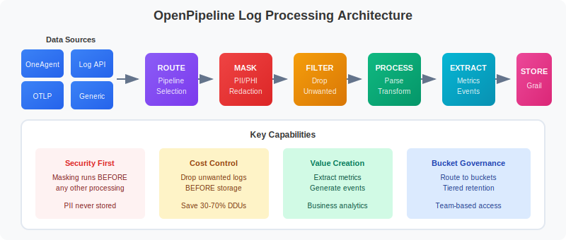

# 📋 OpenPipeline Fundamentals

> **Series:** OPLOGS | **Notebook:** 1 of 8 | **Created:** December 2025

## Understanding the Unified Data Ingestion Framework

This notebook introduces OpenPipeline, Dynatrace's unified data processing framework for logs, traces, metrics, and events.

---

## Table of Contents

1. What is OpenPipeline?
2. OpenPipeline Architecture
3. Exploring Your OpenPipeline Data
4. Key OpenPipeline Fields
5. Data Sources Explained
6. Pipeline Stages Overview
7. Environment Summary


## Prerequisites

- ✅ Access to a Dynatrace environment with log data
- ✅ DQL query permissions (viewer role minimum)
- ✅ Basic understanding of log management concepts


## 1. What is OpenPipeline?

**OpenPipeline** is Dynatrace's unified data ingestion and processing framework that replaces classic log ingestion. It provides:

- **Unified Processing**: Single framework for logs, metrics, traces, and business events
- **Real-time Transformation**: Parse, enrich, mask, and route data at ingestion
- **Grail Storage**: Direct integration with Dynatrace's data lakehouse
- **Flexible Routing**: Send data to different buckets with custom retention
- **Cost Control**: Drop unnecessary data before storage

### OpenPipeline vs Classic Log Ingestion

| Feature | Classic Logs | OpenPipeline v2.0 |
|---------|--------------|-------------------|
| Data Processing | Post-ingestion | At ingestion time |
| Storage | Log Storage v1 | Grail Data Lakehouse |
| Query Language | Limited | Full DQL Support |
| Retention | Global | Per-bucket configurable |
| Data Masking | Limited | Full regex support |
| Parsing | Basic | DPL (Dynatrace Pattern Language) |
| Custom Routing | No | Yes, by content/source |

## 2. OpenPipeline Architecture



<!-- MARKDOWN_TABLE_ALTERNATIVE
| Stage | Component | Function |
|-------|-----------|----------|
| **Data Sources** | OneAgent, Log Ingest API, OTLP, Generic Ingest | Ingestion entry points |
| **1. Routing** | Pipeline Selection | Route data to appropriate pipeline |
| **2. Masking** | PII Redaction | Protect sensitive data |
| **3. Filtering** | Drop Processor | Remove unwanted records |
| **4. Processing** | Parse & Enrich | Transform and add fields |
| **5. Extraction** | Metrics & Events | Extract business metrics |
| **6. Storage** | Bucket Assignment | Route to Grail buckets |
| **Output** | Grail | Logs, Spans, Metrics, Events storage |
-->

## 3. Exploring Your OpenPipeline Data

Let's start by discovering what data sources and pipelines are active in your environment.

```python
// Discover data sources feeding OpenPipeline
fetch logs, from: now() - 1h
| summarize {log_count = count()}, by: {dt.openpipeline.source}
| sort log_count desc
```

```python
// See which pipelines are processing your logs
fetch logs, from: now() - 1h
| summarize {log_count = count()}, by: {dt.openpipeline.pipelines}
| sort log_count desc
```

```python
// Check storage bucket distribution
fetch logs, from: now() - 1h
| summarize {log_count = count()}, by: {dt.system.bucket}
| sort log_count desc
```

## 4. Key OpenPipeline Fields

OpenPipeline adds metadata fields to every log record:

### Pipeline Metadata

| Field | Description | Example |
|-------|-------------|----------|
| `dt.openpipeline.source` | How the log was ingested | `oneagent`, `/api/v2/logs/ingest`, `/api/v2/otlp/v1/logs` |
| `dt.openpipeline.pipelines` | Pipeline(s) that processed the log | `["logs:pipeline_Default_Pipeline_2798"]` |
| `dt.system.bucket` | Storage bucket name | `default_logs`, `custom_logs` |

### Core Log Fields

| Field | Description |
|-------|-------------|
| `timestamp` | When the log was generated |
| `content` | The log message body |
| `loglevel` | Log severity (ERROR, WARN, INFO, DEBUG, NONE) |
| `status` | Status string (alternative to loglevel) |
| `log.source` | Source identifier (e.g., "Container Output") |
| `log.iostream` | Stream type (stdout, stderr) |

```python
// View a sample log record with all key fields
fetch logs, from: now() - 1h
| fields timestamp, content, loglevel, status, log.source, log.iostream,
         dt.openpipeline.source, dt.openpipeline.pipelines, dt.system.bucket
| limit 5
```

```python
// Analyze log levels in your environment
fetch logs, from: now() - 1h
| summarize {count = count()}, by: {loglevel}
| sort count desc
```

## 5. Data Sources Explained

### OneAgent (`oneagent`)
Logs collected automatically by Dynatrace OneAgent from:
- Container stdout/stderr
- Process log files
- System logs

### Log Ingest API (`/api/v2/logs/ingest`)
Logs sent directly via the Dynatrace API:
- Custom application logs
- Third-party integrations
- Cloud provider logs (AWS, Azure, GCP)

### OTLP (`/api/v2/otlp/v1/logs`)
OpenTelemetry Protocol logs:
- OpenTelemetry Collector
- Fluent Bit with OTLP output
- Custom OTLP exporters

```python
// Compare volume by data source
fetch logs, from: now() - 24h
| summarize {
    log_count = count(),
    unique_hosts = countDistinct(dt.entity.host)
  }, by: {dt.openpipeline.source}
| sort log_count desc
```

```python
// Logs per hour by source (trend analysis)
fetch logs, from: now() - 24h
| makeTimeseries {log_count = count()}, by: {dt.openpipeline.source}, interval: 1h
```

## 6. Pipeline Stages Overview

OpenPipeline processes data through ordered stages:

### Stage 1: Routing
- Matches incoming data to the appropriate pipeline
- Based on source, content, or metadata

### Stage 2: Masking (Security)
- Redacts sensitive data BEFORE processing
- Protects PII, credentials, secrets
- Applied early for security compliance

### Stage 3: Filtering
- Drops unwanted records
- Reduces storage costs
- Removes noise (debug logs, health checks)

### Stage 4: Processing
- Parses structured data from content
- Adds enrichment fields
- Transforms and normalizes data

### Stage 5: Extraction
- Creates metrics from log data
- Generates events and business events

### Stage 6: Storage
- Routes to appropriate Grail bucket
- Applies retention policies

## 7. Environment Summary

Let's get a complete picture of your OpenPipeline environment:

```python
// Complete environment summary
fetch logs, from: now() - 1h
| summarize {
    total_logs = count(),
    unique_sources = countDistinct(dt.openpipeline.source),
    unique_buckets = countDistinct(dt.system.bucket),
    unique_hosts = countDistinct(dt.entity.host),
    error_count = countIf(loglevel == "ERROR" OR status == "ERROR"),
    warn_count = countIf(loglevel == "WARN" OR status == "WARN")
  }
```

```python
// Top log sources by entity
fetch logs, from: now() - 1h
| filter isNotNull(dt.entity.host)
| summarize {log_count = count()}, by: {host.name, log.source}
| sort log_count desc
| limit 15
```

---

## 📝 Summary

In this notebook, you learned:

✅ **What OpenPipeline is** - Dynatrace's unified data processing framework  
✅ **Architecture** - Data flow from sources through processing to Grail  
✅ **Key fields** - `dt.openpipeline.source`, `dt.openpipeline.pipelines`, `dt.system.bucket`  
✅ **Data sources** - OneAgent, Log Ingest API, OTLP  
✅ **Pipeline stages** - Routing, Masking, Filtering, Processing, Extraction, Storage  

---

## ➡️ Next Steps

Continue to **OPLOGS-02: Migration Guide** to learn how to migrate from classic log ingestion to OpenPipeline v2.0.

---

## 📚 References

- [OpenPipeline Documentation](https://docs.dynatrace.com/docs/discover-dynatrace/platform/openpipeline)
- [Grail Data Lakehouse](https://docs.dynatrace.com/docs/platform/grail)
- [DQL Reference](https://docs.dynatrace.com/docs/platform/grail/dynatrace-query-language)
