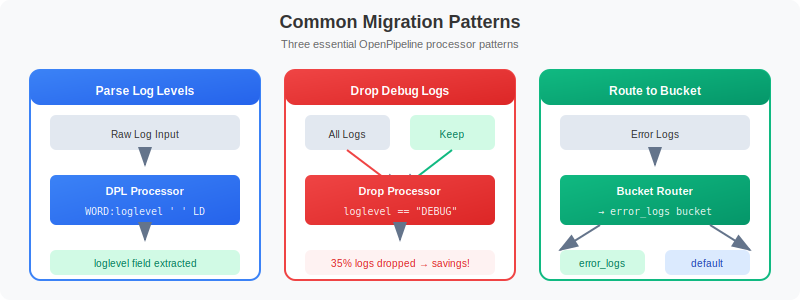

# 🔄 Migration to OpenPipeline

> **Series:** OPLOGS | **Notebook:** 2 of 8 | **Created:** December 2025

## Planning and Executing Your Log Migration

This notebook guides you through assessing your current log environment and planning migration to OpenPipeline v2.0.

---

## Table of Contents

1. Migration Assessment
2. Migration Paths
3. Planning Your OpenPipeline Configuration
4. Migration Validation
5. Common Migration Patterns
6. Migration Checklist


## Prerequisites

- ✅ Access to a Dynatrace environment with log data
- ✅ Completed OPLOGS-01 fundamentals
- ✅ Knowledge of your current log sources and volumes


## 1. Migration Assessment

Before migrating, you need to understand your current log landscape.

### Key Questions to Answer:

1. **What log sources do I have?** (OneAgent, API, OTLP)
2. **What is my log volume?** (records/hour, GB/day)
3. **Which logs need parsing?** (unstructured content)
4. **What sensitive data exists?** (PII, credentials)
5. **What can be dropped?** (debug, health checks)

```python
// Assessment Query 1: Log sources inventory
fetch logs, from: now() - 24h
| summarize {
    log_count = count(),
    unique_hosts = countDistinct(dt.entity.host)
  }, by: {dt.openpipeline.source, log.source}
| sort log_count desc
| limit 20
```

```python
// Assessment Query 2: Log volume by hour (capacity planning)
fetch logs, from: now() - 24h
| makeTimeseries {log_count = count()}, interval: 1h
```

```python
// Assessment Query 3: Log level distribution
fetch logs, from: now() - 24h
| summarize {
    total = count(),
    errors = countIf(loglevel == "ERROR" OR status == "ERROR"),
    warnings = countIf(loglevel == "WARN" OR status == "WARN"),
    info = countIf(loglevel == "INFO" OR status == "INFO"),
    debug = countIf(loglevel == "DEBUG" OR status == "DEBUG"),
    none = countIf(loglevel == "NONE" OR status == "NONE")
  }
| fieldsAdd debug_pct = round((toDouble(debug) / toDouble(total)) * 100, decimals: 1)
| fieldsAdd none_pct = round((toDouble(none) / toDouble(total)) * 100, decimals: 1)
```

```python
// Assessment Query 4: Identify logs that need parsing (loglevel = NONE)
fetch logs, from: now() - 1h
| filter loglevel == "NONE" OR status == "NONE"
| fieldsAdd content_preview = substring(content, from: 0, to: 80)
| summarize {count = count()}, by: {content_preview, dt.openpipeline.source}
| sort count desc
| limit 15
```

```python
// Assessment Query 5: Potential drop candidates (health checks, heartbeats)
fetch logs, from: now() - 24h
| summarize {
    total = count(),
    health_checks = countIf(matchesPhrase(content, "health") OR matchesPhrase(content, "healthcheck")),
    heartbeats = countIf(matchesPhrase(content, "heartbeat")),
    debug_logs = countIf(loglevel == "DEBUG" OR status == "DEBUG")
  }
| fieldsAdd droppable = health_checks + heartbeats + debug_logs
| fieldsAdd savings_pct = round((toDouble(droppable) / toDouble(total)) * 100, decimals: 1)
```

## 2. Migration Paths

### Path A: Automatic Migration (Recommended)

If you're using OneAgent for log collection, most data automatically flows through OpenPipeline.

**Steps:**
1. Verify `dt.openpipeline.source` = `oneagent` in your logs
2. Configure custom pipelines for specific processing needs
3. Update queries to use OpenPipeline fields

### Path B: API Migration

If using the Log Ingest API:

**Steps:**
1. Continue using `/api/v2/logs/ingest` endpoint
2. Logs automatically route through OpenPipeline
3. Configure processing rules as needed

### Path C: OTLP Migration

For OpenTelemetry-based logging:

**Steps:**
1. Point OTLP exporters to `/api/v2/otlp/v1/logs`
2. Logs flow through OpenPipeline automatically
3. Configure pipelines for OTLP-specific processing

```python
// Check which data sources are already using OpenPipeline
fetch logs, from: now() - 1h
| filter isNotNull(dt.openpipeline.pipelines)
| summarize {count = count()}, by: {dt.openpipeline.source}
| sort count desc
```

## 3. Planning Your OpenPipeline Configuration

### Pipeline Strategy

| Use Case | Pipeline Configuration |
|----------|------------------------|
| **Default Processing** | Use built-in Default Pipeline |
| **Custom Parsing** | Create pipeline with DPL parse rules |
| **PII Masking** | Add masking stage before processing |
| **Cost Reduction** | Add drop rules for noise |
| **Custom Routing** | Route to specific buckets |

### Bucket Strategy

| Log Type | Bucket | Retention |
|----------|--------|----------|
| Production Errors | `prod_errors` | 90 days |
| Application Logs | `default_logs` | 35 days |
| Debug/Verbose | Drop or 7 days | Minimal |
| Audit/Compliance | `audit_logs` | 365+ days |

```python
// Analyze current bucket usage
fetch logs, from: now() - 24h
| summarize {
    log_count = count(),
    error_count = countIf(loglevel == "ERROR" OR status == "ERROR")
  }, by: {dt.system.bucket}
| fieldsAdd error_rate = round((toDouble(error_count) / toDouble(log_count)) * 100, decimals: 2)
| sort log_count desc
```

## 4. Migration Validation

After configuring OpenPipeline, validate that:

1. ✅ All expected log sources are present
2. ✅ Log counts are consistent
3. ✅ Parsing rules extract expected fields
4. ✅ Masking rules are applied correctly
5. ✅ Routing sends logs to correct buckets

```python
// Validation Query 1: Confirm all sources are flowing
fetch logs, from: now() - 1h
| summarize {
    total = count(),
    has_pipeline = countIf(isNotNull(dt.openpipeline.pipelines)),
    has_source = countIf(isNotNull(dt.openpipeline.source)),
    has_bucket = countIf(isNotNull(dt.system.bucket))
  }
| fieldsAdd pipeline_coverage = round((toDouble(has_pipeline) / toDouble(total)) * 100, decimals: 1)
```

```python
// Validation Query 2: Check log volume consistency (compare hours)
fetch logs, from: now() - 4h
| makeTimeseries {log_count = count()}, by: {dt.openpipeline.source}, interval: 1h
```

```python
// Validation Query 3: Verify entity context is preserved
fetch logs, from: now() - 1h
| summarize {
    total = count(),
    with_host = countIf(isNotNull(dt.entity.host)),
    with_process = countIf(isNotNull(dt.entity.process_group)),
    with_k8s_cluster = countIf(isNotNull(dt.entity.kubernetes_cluster)),
    with_k8s_namespace = countIf(isNotNull(k8s.namespace.name))
  }
```

## 5. Common Migration Patterns



<!-- MARKDOWN_TABLE_ALTERNATIVE
| Pattern | Processor | Matcher | Action |
|---------|-----------|---------|--------|
| **Parse Log Levels** | DQL | `loglevel == "NONE"` | Extract level from `[LEVEL]` in content |
| **Drop Debug Logs** | Drop | `loglevel == "DEBUG"` | Remove debug logs before storage |
| **Route Errors** | Bucket Rule | `loglevel == "ERROR"` | Send to `error_logs` bucket (90d retention) |
-->

### Pattern 1: Parse Log Levels from Content

When logs have `loglevel = NONE`, configure a DQL processor to extract the level from content patterns like `[INFO]` or `[ERROR]`.

**Processor Configuration:**
- **Type:** DQL
- **Matcher:** `loglevel == "NONE"`
- **Statement:** `parse content, "'[' LD:parsed_level ']'" | fieldsAdd loglevel = parsed_level`

### Pattern 2: Drop Debug Logs

Reduce storage costs by dropping DEBUG-level logs before storage.

**Processor Configuration:**
- **Type:** Drop
- **Matcher:** `loglevel == "DEBUG"`

### Pattern 3: Route Errors to Dedicated Bucket

Send error logs to a dedicated bucket with longer retention for compliance.

**Bucket Routing Configuration:**
- **Matcher:** `loglevel == "ERROR"`
- **Bucket:** `error_logs`
- **Retention:** 90 days

```python
// Simulate parsing log levels from content
fetch logs, from: now() - 1h
| filter loglevel == "NONE" OR status == "NONE"
| parse content, "'[' LD:parsed_level ']'"
| filter isNotNull(parsed_level)
| fields timestamp, content, parsed_level
| limit 10
```

```python
// Identify logs that would be dropped (DEBUG + health checks)
fetch logs, from: now() - 24h
| filter loglevel == "DEBUG" 
     OR matchesPhrase(content, "healthcheck") 
     OR matchesPhrase(content, "health check")
| summarize {would_drop = count()}, by: {dt.openpipeline.source}
| sort would_drop desc
```

## 6. Migration Checklist

### Pre-Migration
- [ ] Document current log sources and volumes
- [ ] Identify logs requiring custom parsing
- [ ] List sensitive data patterns to mask
- [ ] Define drop rules for noise reduction
- [ ] Plan bucket strategy and retention

### During Migration
- [ ] Configure OpenPipeline settings
- [ ] Create custom pipelines as needed
- [ ] Set up masking rules
- [ ] Configure bucket routing
- [ ] Test with sample data

### Post-Migration
- [ ] Validate all log sources flowing
- [ ] Verify volume consistency
- [ ] Confirm parsing rules working
- [ ] Test masking is applied
- [ ] Update dashboards and alerts
- [ ] Update saved queries to use new fields

---

## 📝 Summary

In this notebook, you learned:

✅ **Assessment queries** to understand your current log environment  
✅ **Migration paths** for OneAgent, API, and OTLP sources  
✅ **Pipeline planning** strategies for processing and routing  
✅ **Validation queries** to confirm successful migration  
✅ **Common patterns** for parsing, dropping, and routing  

---

## ➡️ Next Steps

Continue to **OPLOGS-03: Querying & Parsing** to learn DQL syntax and DPL parsing patterns.

---

## 📚 References

- [OpenPipeline Documentation](https://docs.dynatrace.com/docs/discover-dynatrace/platform/openpipeline)
- [Log Ingest API](https://docs.dynatrace.com/docs/dynatrace-api/environment-api/log-monitoring-v2/post-ingest-logs)
- [OTLP Log Ingestion](https://docs.dynatrace.com/docs/extend-dynatrace/opentelemetry/getting-started/logs)
