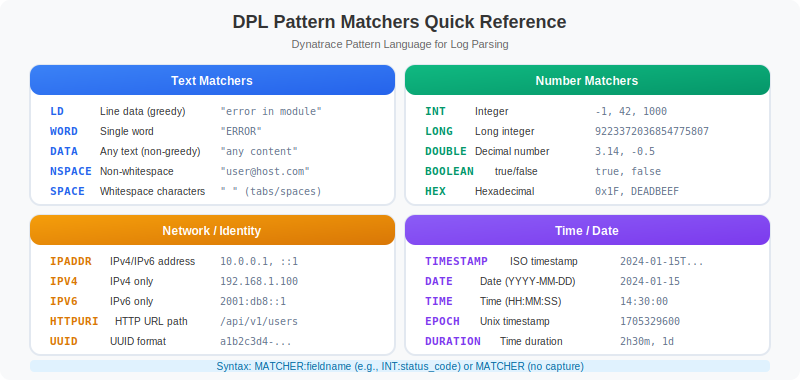

# 🔧 OpenPipeline Processing

> **Series:** OPLOGS | **Notebook:** 3 of 8 | **Created:** December 2025

## Configuring Pipeline Stages for Log Transformation

This notebook covers OpenPipeline processing stages: parsing, enrichment, metric extraction, event generation, bucket routing, and filtering.

---

## Table of Contents

1. Parsing & Field Extraction
2. Metric Extraction from Logs
3. Attribute Creation & Enrichment
4. Event Generation from Logs
5. Bucket Routing
6. Filtering & Sampling
7. Complete Pipeline Example


## Prerequisites

- ✅ Access to a Dynatrace environment with log data
- ✅ OpenPipeline configuration permissions
- ✅ Completed OPLOGS-01 and OPLOGS-02


## 2. Parsing & Field Extraction

Parsing extracts structured fields from unstructured log content **at ingestion time**.

### DPL (Dynatrace Pattern Language) Matchers



<!-- MARKDOWN_TABLE_ALTERNATIVE
DPL Matchers Reference:

Basic Matchers:
- LD: Line data (to delimiter) - matches any text
- INT: Integer - matches 42, -17
- DOUBLE: Decimal number - matches 3.14, -0.5
- WORD: Word characters - matches hello123

Specialized Matchers:
- IPADDR: IP address - matches 192.168.1.1
- TIMESTAMP: Date/time - various formats
- JSON: JSON object/array - matches {"key": "value"}
- SPACE: Whitespace - spaces, tabs
-->

| Matcher | Description | Example Match |
|---------|-------------|---------------|
| `LD` | Line data (to delimiter) | Any text |
| `INT` | Integer | `42`, `-17` |
| `DOUBLE` | Decimal number | `3.14`, `-0.5` |
| `IPADDR` | IP address | `192.168.1.1` |
| `WORD` | Word characters | `hello123` |
| `TIMESTAMP` | Date/time | Various formats |
| `JSON` | JSON object/array | `{"key": "value"}` |

### OpenPipeline Parse Processor

```yaml
# Parse HTTP access logs
processors:
  - name: parse-http-logs
    type: dql
    source: content
    dql: |
      parse content, "IPADDR:client_ip SPACE LD SPACE '[' TIMESTAMP:request_time ']' 
                      SPACE '\"' LD:method SPACE LD:path SPACE LD '\"' 
                      SPACE INT:status SPACE INT:bytes"
```

```python
// Discover log patterns for parsing design
fetch logs, from: now() - 1h
| fieldsAdd content_preview = substring(content, from: 0, to: 100)
| summarize {count = count()}, by: {content_preview}
| sort count desc
| limit 20
```

```python
// Test parse pattern before configuring in OpenPipeline
fetch logs, from: now() - 1h
| filter contains(content, "GET") OR contains(content, "POST")
| parse content, "LD:method SPACE '/' LD:path SPACE INT:status_code"
| filter isNotNull(status_code)
| summarize {count = count()}, by: {method, status_code}
| sort count desc
| limit 15
```

```python
// Verify fields already extracted by OpenPipeline
fetch logs, from: now() - 1h
| limit 100
| summarize {
    has_loglevel = countIf(isNotNull(loglevel)),
    has_status = countIf(isNotNull(status)),
    has_trace_id = countIf(isNotNull(trace_id)),
    has_span_id = countIf(isNotNull(span_id))
  }
```

## 3. Metric Extraction from Logs

**Extract metrics with dimensions** from log data at ingestion time. This is powerful for:
- Creating SLIs from log patterns
- Building dashboards without log queries
- Enabling metric-based alerting

### OpenPipeline Metric Extraction

```yaml
# Extract request duration metric from logs
processors:
  - name: extract-request-metric
    type: metric
    enabled: true
    condition: contains(content, "duration=")
    metricKey: log.request.duration
    dimensions:
      - service: k8s.namespace.name
      - method: extracted_method
      - status: extracted_status
    value: extracted_duration_ms
```

### Common Metric Extraction Patterns

| Log Pattern | Metric | Dimensions |
|-------------|--------|------------|
| Request completed | `log.request.count` | service, method, status |
| Response time | `log.response.duration` | endpoint, status_code |
| Error occurred | `log.error.count` | error_type, service |
| Queue depth | `log.queue.size` | queue_name |

```python
// Identify logs with numeric values for metric extraction
fetch logs, from: now() - 1h
| filter contains(content, "duration") 
        OR contains(content, "latency") 
        OR contains(content, "time=")
        OR contains(content, "ms")
| fieldsAdd content_preview = substring(content, from: 0, to: 120)
| summarize {count = count()}, by: {content_preview}
| sort count desc
| limit 15
```

```python
// Simulate metric extraction: count by dimensions
fetch logs, from: now() - 1h
| filter isNotNull(k8s.namespace.name)
| summarize {
    request_count = count(),
    error_count = countIf(loglevel == "ERROR")
  }, by: {k8s.namespace.name, k8s.workload.name}
| fieldsAdd error_rate = round((error_count * 100.0) / request_count, decimals: 2)
| sort error_count desc
| limit 15
```

```python
// Preview: What dimensions would be valuable?
fetch logs, from: now() - 1h
| summarize {
    unique_namespaces = countDistinct(k8s.namespace.name),
    unique_workloads = countDistinct(k8s.workload.name),
    unique_pods = countDistinct(k8s.pod.name),
    unique_hosts = countDistinct(dt.entity.host),
    unique_sources = countDistinct(dt.openpipeline.source)
  }
```

## 4. Attribute Creation & Enrichment

Add **computed attributes** to logs for enhanced analysis and filtering.

### OpenPipeline Field Processor

```yaml
# Add computed attributes
processors:
  - name: enrich-environment
    type: fieldsAdd
    fields:
      - name: environment
        value: |
          if(contains(k8s.namespace.name, "prod"), "production",
          else: if(contains(k8s.namespace.name, "staging"), "staging",
          else: "development"))
      
      - name: severity_score
        value: |
          if(loglevel == "ERROR", 3,
          else: if(loglevel == "WARN", 2,
          else: 1))
      
      - name: team_owner
        value: |
          if(contains(k8s.namespace.name, "payment"), "platform-team",
          else: if(contains(k8s.namespace.name, "frontend"), "web-team",
          else: "unknown"))
```

### Common Attribute Patterns

| Attribute | Source | Use Case |
|-----------|--------|----------|
| `environment` | namespace name | Filter prod vs dev |
| `team_owner` | namespace/labels | Route alerts |
| `severity_score` | loglevel | Prioritization |
| `log_category` | content patterns | Classification |

```python
// Preview attribute creation logic
fetch logs, from: now() - 1h
| filter isNotNull(k8s.namespace.name)
| fieldsAdd environment = if(contains(k8s.namespace.name, "prod"), "production",
                          else: if(contains(k8s.namespace.name, "staging"), "staging",
                          else: "development"))
| fieldsAdd severity_score = if(loglevel == "ERROR", 3,
                             else: if(loglevel == "WARN", 2,
                             else: 1))
| summarize {count = count()}, by: {environment, severity_score, loglevel}
| sort environment asc, severity_score desc
```

```python
// Categorize logs by content patterns
fetch logs, from: now() - 1h
| fieldsAdd log_category = if(contains(content, "Exception") OR contains(content, "Error"), "exception",
                           else: if(contains(content, "request") OR contains(content, "response"), "http",
                           else: if(contains(content, "database") OR contains(content, "query"), "database",
                           else: if(contains(content, "auth") OR contains(content, "login"), "security",
                           else: "general"))))
| summarize {count = count()}, by: {log_category, loglevel}
| sort count desc
```

```python
// Identify namespaces for team ownership mapping
fetch logs, from: now() - 1h
| filter isNotNull(k8s.namespace.name)
| summarize {log_count = count()}, by: {k8s.namespace.name}
| sort log_count desc
| limit 20
```

## 5. Event Generation from Logs

Create **business events** from specific log patterns. Events flow to Grail and can trigger workflows.

### OpenPipeline Event Processor

```yaml
# Generate events from critical log patterns
processors:
  - name: generate-payment-events
    type: bizevents
    enabled: true
    condition: contains(content, "payment") AND contains(content, "completed")
    eventType: com.example.payment.completed
    attributes:
      - payment_id: extracted_payment_id
      - amount: extracted_amount
      - currency: extracted_currency
      - customer_id: extracted_customer

  - name: generate-error-events
    type: bizevents  
    enabled: true
    condition: loglevel == "ERROR" AND contains(content, "critical")
    eventType: com.example.critical.error
    attributes:
      - error_type: extracted_error_type
      - service: k8s.namespace.name
```

### Event Use Cases

| Log Pattern | Event Type | Purpose |
|-------------|------------|----------|
| Order completed | `order.completed` | Business analytics |
| User signup | `user.registered` | Funnel tracking |
| Deployment | `deployment.completed` | Change tracking |
| Critical error | `error.critical` | Incident trigger |

```python
// Discover patterns suitable for event generation
fetch logs, from: now() - 1h
| filter contains(content, "completed") 
        OR contains(content, "success")
        OR contains(content, "failed")
        OR contains(content, "created")
| fieldsAdd content_preview = substring(content, from: 0, to: 100)
| summarize {count = count()}, by: {content_preview}
| sort count desc
| limit 20
```

```python
// Check existing bizevents (if any generated)
fetch bizevents, from: now() - 24h
| summarize {count = count()}, by: {event.type}
| sort count desc
| limit 15
```

```python
// Preview: Logs that would become critical error events
fetch logs, from: now() - 1h
| filter loglevel == "ERROR"
| filter contains(content, "critical") 
        OR contains(content, "fatal")
        OR contains(content, "severe")
| fieldsAdd content_preview = substring(content, from: 0, to: 100)
| fields timestamp, k8s.namespace.name, content_preview
| sort timestamp desc
| limit 20
```

## 6. Bucket Routing

Route logs to **appropriate buckets** based on content, source, or computed attributes.

### Why Bucket Routing Matters

| Bucket | Logs | Retention | Cost Impact |
|--------|------|-----------|-------------|
| `default_logs` | Standard | 35 days | Baseline |
| `debug_logs` | DEBUG/TRACE | 7 days | 80% savings |
| `audit_logs` | Security/compliance | 365 days | Compliance |
| `error_logs` | Errors only | 90 days | Investigation |

### OpenPipeline Route Processor

```yaml
# Route logs to appropriate buckets
processors:
  - name: route-debug-logs
    type: route
    condition: loglevel == "DEBUG" OR loglevel == "TRACE"
    bucket: debug_logs
    
  - name: route-audit-logs
    type: route
    condition: contains(content, "audit") OR contains(content, "security")
    bucket: audit_logs
    
  - name: route-error-logs
    type: route
    condition: loglevel == "ERROR" OR loglevel == "FATAL"
    bucket: error_logs
```

```python
// Current bucket distribution
fetch logs, from: now() - 1h
| summarize {count = count()}, by: {dt.system.bucket}
| sort count desc
```

```python
// Preview routing decisions
fetch logs, from: now() - 1h
| fieldsAdd target_bucket = if(loglevel == "DEBUG" OR loglevel == "TRACE", "debug_logs",
                            else: if(loglevel == "ERROR" OR loglevel == "FATAL", "error_logs",
                            else: if(contains(content, "audit") OR contains(content, "security"), "audit_logs",
                            else: "default_logs")))
| summarize {count = count()}, by: {target_bucket, loglevel}
| sort count desc
```

```python
// Estimate storage savings from routing
fetch logs, from: now() - 24h
| fieldsAdd content_bytes = stringLength(content)
| summarize {
    total_logs = count(),
    total_mb = sum(content_bytes) / 1048576.0,
    debug_logs = countIf(loglevel == "DEBUG" OR loglevel == "TRACE"),
    debug_mb = sum(if(loglevel == "DEBUG" OR loglevel == "TRACE", content_bytes, else: 0)) / 1048576.0
  }
| fieldsAdd debug_pct = round((debug_logs * 100.0) / total_logs, decimals: 1)
| fieldsAdd savings_7d_vs_35d = round(debug_mb * 0.8, decimals: 2)
```

## 7. Filtering & Sampling

Reduce log volume by **filtering** or **sampling** at ingestion.

### OpenPipeline Filter Processor

```yaml
# Drop noisy, low-value logs
processors:
  - name: drop-health-checks
    type: filter
    condition: contains(content, "health") AND loglevel == "INFO"
    action: drop
    
  - name: drop-heartbeats
    type: filter
    condition: contains(content, "heartbeat") OR contains(content, "keepalive")
    action: drop
    
  - name: sample-debug-logs
    type: sample
    condition: loglevel == "DEBUG"
    rate: 0.1  # Keep only 10% of DEBUG logs
```

```python
// Identify candidates for filtering (high volume, low value)
fetch logs, from: now() - 1h
| filter contains(content, "health")
        OR contains(content, "heartbeat")
        OR contains(content, "alive")
        OR contains(content, "ready")
| summarize {count = count()}, by: {k8s.namespace.name, loglevel}
| sort count desc
| limit 15
```

```python
// Calculate potential savings from filtering health checks
fetch logs, from: now() - 24h
| summarize {
    total_logs = count(),
    health_logs = countIf(contains(content, "health") OR contains(content, "heartbeat")),
    debug_logs = countIf(loglevel == "DEBUG")
  }
| fieldsAdd health_pct = round((health_logs * 100.0) / total_logs, decimals: 1)
| fieldsAdd debug_pct = round((debug_logs * 100.0) / total_logs, decimals: 1)
| fieldsAdd potential_reduction = round(((health_logs + debug_logs * 0.9) * 100.0) / total_logs, decimals: 1)
```

## 8. Complete Pipeline Example

Here's a comprehensive OpenPipeline configuration:

```yaml
# Complete OpenPipeline configuration for logs
name: production-log-pipeline
enabled: true

processors:
  # 1. FILTER - Remove unwanted logs first
  - name: drop-health-checks
    type: filter
    condition: contains(content, "health") AND loglevel == "INFO"
    action: drop

  # 2. PARSE - Extract structured fields
  - name: parse-http-logs
    type: dql
    condition: contains(content, "HTTP")
    dql: parse content, "LD:method SPACE '/' LD:path SPACE INT:status SPACE INT:duration_ms"

  # 3. ENRICH - Add computed attributes
  - name: add-environment
    type: fieldsAdd
    fields:
      - name: environment
        value: if(contains(k8s.namespace.name, "prod"), "production", else: "non-prod")

  # 4. MASK - Protect sensitive data
  - name: mask-emails
    type: mask
    field: content
    pattern: "[A-Za-z0-9._%+-]+@[A-Za-z0-9.-]+\\.[A-Za-z]{2,}"
    replacement: "[EMAIL-MASKED]"

  # 5. EXTRACT METRICS - Create dimensional metrics
  - name: extract-request-count
    type: metric
    metricKey: log.http.requests
    dimensions:
      - namespace: k8s.namespace.name
      - status: status

  # 6. GENERATE EVENTS - Create business events
  - name: generate-error-events
    type: bizevents
    condition: loglevel == "ERROR"
    eventType: com.app.error

  # 7. ROUTE - Send to appropriate bucket
  - name: route-debug
    type: route
    condition: loglevel == "DEBUG"
    bucket: debug_logs
```

```python
// Verify current pipeline processing
fetch logs, from: now() - 1h
| summarize {
    total_logs = count(),
    with_pipeline = countIf(isNotNull(dt.openpipeline.pipelines)),
    unique_pipelines = countDistinct(dt.openpipeline.pipelines)
  }, by: {dt.openpipeline.source}
| sort total_logs desc
```

```python
// Pipeline processing summary
fetch logs, from: now() - 1h
| summarize {count = count()}, by: {dt.openpipeline.pipelines, dt.system.bucket}
| sort count desc
```

---

## 📝 Summary

In this notebook, you learned:

✅ **Parsing** - Extract structured fields at ingestion  
✅ **Metrics** - Create dimensional metrics from logs  
✅ **Attributes** - Add computed fields for analysis  
✅ **Events** - Generate business events from patterns  
✅ **Routing** - Direct logs to appropriate buckets  
✅ **Filtering** - Drop/sample low-value logs  

### Key Takeaway

> **Process at ingestion, not at query time.** OpenPipeline processing is fundamental to cost optimization, data quality, and operational efficiency.

---

## ➡️ Next Steps

Continue to **OPLOGS-04: Buckets & Data Governance** to learn about storage management and retention policies.

---

## 📚 References

- [OpenPipeline Overview](https://docs.dynatrace.com/docs/platform/openpipeline)
- [OpenPipeline Processors](https://docs.dynatrace.com/docs/platform/openpipeline/configuration/processors)
- [Metric Extraction](https://docs.dynatrace.com/docs/platform/openpipeline/use-cases/log-processing/extract-metrics)
- [Event Generation](https://docs.dynatrace.com/docs/platform/openpipeline/use-cases/log-processing/create-business-events)
- [DPL Pattern Language](https://docs.dynatrace.com/docs/platform/grail/dynatrace-pattern-language)
