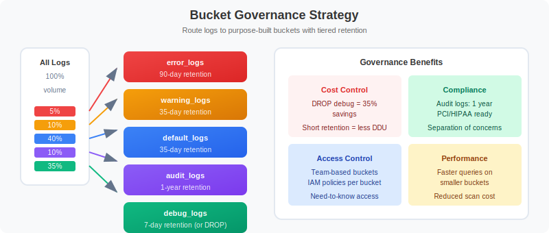

# 🗄️ Buckets & Data Governance

> **Series:** OPLOGS | **Notebook:** 4 of 8 | **Created:** December 2025

## Strategic Storage Management for OpenPipeline Logs

This notebook covers Grail bucket architecture, retention policies, routing configuration, access control, and cost optimization strategies.

---

## Table of Contents

1. Strategic Bucket Design
2. Retention Policies
3. Bucket Routing Configuration
4. Access Control & Data Governance
5. Query Optimization with Buckets
6. Cost Optimization Strategies
7. Bucket Management Best Practices


## Prerequisites

- ✅ Access to a Dynatrace environment with log data
- ✅ Understanding of OpenPipeline basics (OPLOGS-01 to OPLOGS-03)
- ✅ Admin access for bucket configuration (optional)


```python
// Discover all buckets with log data
fetch logs, from: now() - 24h
| summarize {log_count = count()}, by: {dt.system.bucket}
| sort log_count desc
```

```python
// Bucket volume analysis over time
fetch logs, from: now() - 7d
| makeTimeseries {count = count()}, by: {dt.system.bucket}, interval: 1d
| limit 100
```

```python
// Bucket composition by log level
fetch logs, from: now() - 24h
| summarize {count = count()}, by: {dt.system.bucket, loglevel}
| sort dt.system.bucket asc, count desc
```

## 2. Strategic Bucket Design

Design buckets based on **access patterns**, **retention requirements**, and **cost optimization**.



<!-- MARKDOWN_TABLE_ALTERNATIVE
Bucket Governance Strategy:

Bucket Types by Purpose:
1. default_logs - General purpose, 35 days, All teams
2. debug_logs - Development troubleshooting, 7 days, Dev teams
3. error_logs - Incident investigation, 90 days, SRE/Ops
4. audit_logs - Compliance, 365 days, Audit team
5. security_logs - Security operations, 180 days, SecOps
6. archive_logs - Long-term storage, 730 days, Compliance

Access Control:
- Team-based permissions
- Role-based access
- Bucket-level isolation
-->

### Recommended Bucket Strategy

| Bucket Name | Purpose | Retention | Access | Data Types |
|-------------|---------|-----------|--------|------------|
| `default_logs` | General purpose | 35 days | All teams | Standard logs |
| `debug_logs` | Development troubleshooting | 7 days | Dev teams | DEBUG, TRACE |
| `error_logs` | Incident investigation | 90 days | SRE/Ops | ERROR, FATAL |
| `audit_logs` | Compliance | 365 days | Audit team | Auth, access |
| `security_logs` | Security operations | 180 days | SecOps | Security events |
| `archive_logs` | Long-term storage | 730 days | Compliance | Critical events |

### Bucket Naming Convention

```
<purpose>_logs
<team>_<purpose>_logs
<environment>_<purpose>_logs
```

Examples:
- `platform_debug_logs`
- `prod_security_logs`
- `payment_audit_logs`

```python
// Analyze current log distribution for bucket planning
fetch logs, from: now() - 24h
| summarize {
    total = count(),
    debug = countIf(loglevel == "DEBUG" OR loglevel == "TRACE"),
    info = countIf(loglevel == "INFO" OR loglevel == "NOTICE"),
    warn = countIf(loglevel == "WARN" OR loglevel == "WARNING"),
    error = countIf(loglevel == "ERROR" OR loglevel == "FATAL")
  }
| fieldsAdd debug_pct = round((debug * 100.0) / total, decimals: 1)
| fieldsAdd info_pct = round((info * 100.0) / total, decimals: 1)
| fieldsAdd warn_pct = round((warn * 100.0) / total, decimals: 1)
| fieldsAdd error_pct = round((error * 100.0) / total, decimals: 1)
```

```python
// Identify audit/security logs for specialized bucket
fetch logs, from: now() - 24h
| filter contains(content, "auth")
        OR contains(content, "login")
        OR contains(content, "logout")
        OR contains(content, "permission")
        OR contains(content, "access")
| summarize {count = count()}, by: {k8s.namespace.name, loglevel}
| sort count desc
| limit 20
```

```python
// Volume by source - helps determine routing needs
fetch logs, from: now() - 24h
| summarize {count = count()}, by: {dt.openpipeline.source, dt.system.bucket}
| sort count desc
```

## 3. Retention Policies

### Retention Strategy Matrix

| Data Type | Min Retention | Recommended | Max | Rationale |
|-----------|---------------|-------------|-----|------------|
| DEBUG/TRACE | 3 days | 7 days | 14 days | High volume, temporary |
| INFO | 7 days | 35 days | 90 days | Standard operations |
| WARN | 14 days | 60 days | 180 days | Trend analysis |
| ERROR | 30 days | 90 days | 365 days | Incident investigation |
| Audit | 365 days | 365 days | 730 days | Compliance |
| Security | 90 days | 180 days | 365 days | SIEM/forensics |

### Retention Cost Impact

```
Storage Cost = Log Volume × Retention Days × Cost per GB-day

Example:
- 100 GB/day DEBUG logs × 35 days = 3,500 GB stored
- 100 GB/day DEBUG logs × 7 days  = 700 GB stored
- Savings: 80% reduction in DEBUG storage
```

```python
// Estimate storage by log level
fetch logs, from: now() - 24h
| fieldsAdd content_bytes = stringLength(content)
| summarize {
    log_count = count(),
    total_mb = round(sum(content_bytes) / 1048576.0, decimals: 2),
    avg_bytes = round(avg(content_bytes), decimals: 0)
  }, by: {loglevel}
| sort total_mb desc
```

```python
// Calculate retention cost comparison (DEBUG logs)
fetch logs, from: now() - 24h
| filter loglevel == "DEBUG" OR loglevel == "TRACE"
| fieldsAdd content_bytes = stringLength(content)
| summarize {daily_mb = round(sum(content_bytes) / 1048576.0, decimals: 2)}
| fieldsAdd retention_35d_gb = round(daily_mb * 35 / 1024, decimals: 2)
| fieldsAdd retention_7d_gb = round(daily_mb * 7 / 1024, decimals: 2)
| fieldsAdd savings_gb = round(retention_35d_gb - retention_7d_gb, decimals: 2)
| fieldsAdd savings_pct = round((savings_gb * 100) / retention_35d_gb, decimals: 1)
```

```python
// Retention planning: volume by bucket and loglevel
fetch logs, from: now() - 24h
| fieldsAdd content_bytes = stringLength(content)
| summarize {
    log_count = count(),
    daily_mb = round(sum(content_bytes) / 1048576.0, decimals: 2)
  }, by: {dt.system.bucket, loglevel}
| sort dt.system.bucket asc, daily_mb desc
```

## 4. Bucket Routing Configuration

Route logs to appropriate buckets using **OpenPipeline routing rules**.

### OpenPipeline Routing Rules

```yaml
# Route logs based on conditions
routes:
  # Route debug logs to short-retention bucket
  - name: debug-to-debug-bucket
    condition: loglevel == "DEBUG" OR loglevel == "TRACE"
    bucket: debug_logs
    
  # Route errors to extended-retention bucket
  - name: errors-to-error-bucket
    condition: loglevel == "ERROR" OR loglevel == "FATAL"
    bucket: error_logs
    
  # Route audit logs to compliance bucket
  - name: audit-to-audit-bucket
    condition: contains(content, "audit") OR contains(k8s.namespace.name, "security")
    bucket: audit_logs
    
  # Default catch-all
  - name: default-route
    condition: true
    bucket: default_logs
```

### Routing Priority

1. First matching rule wins
2. Order rules from specific to general
3. Always include a default catch-all

```python
// Preview routing decision logic
fetch logs, from: now() - 1h
| limit 1000
| fieldsAdd target_bucket = if(loglevel == "DEBUG" OR loglevel == "TRACE", "debug_logs",
                            else: if(loglevel == "ERROR" OR loglevel == "FATAL", "error_logs",
                            else: if(contains(content, "audit") OR contains(content, "security"), "audit_logs",
                            else: "default_logs")))
| summarize {count = count()}, by: {target_bucket, loglevel}
| sort target_bucket asc, count desc
```

```python
// Validate current routing effectiveness
fetch logs, from: now() - 24h
| summarize {
    total = count(),
    in_default = countIf(dt.system.bucket == "default_logs")
  }, by: {loglevel}
| fieldsAdd default_pct = round((in_default * 100.0) / total, decimals: 1)
| sort default_pct desc
```

```python
// Namespace-based routing analysis
fetch logs, from: now() - 24h
| filter isNotNull(k8s.namespace.name)
| fieldsAdd suggested_bucket = if(contains(k8s.namespace.name, "prod"), "prod_logs",
                               else: if(contains(k8s.namespace.name, "staging"), "staging_logs",
                               else: "dev_logs"))
| summarize {count = count()}, by: {k8s.namespace.name, suggested_bucket}
| sort count desc
| limit 20
```

## 5. Access Control & Data Governance

### Bucket-Level Access Control

| Bucket | Read Access | Write Access | Use Case |
|--------|-------------|--------------|----------|
| `default_logs` | All authenticated | OpenPipeline | General access |
| `debug_logs` | Dev teams | OpenPipeline | Development |
| `audit_logs` | Audit team only | OpenPipeline | Compliance |
| `security_logs` | SecOps only | OpenPipeline | Security ops |

### IAM Policy Integration

Configure in **Settings → Access tokens & IAM → Policies**

```json
{
  "name": "audit-log-readers",
  "statement": [
    {
      "effect": "ALLOW",
      "permissions": ["storage:logs:read"],
      "conditions": [
        {
          "bucket": ["audit_logs"]
        }
      ]
    }
  ]
}
```

```python
// Identify sensitive data patterns for access control planning
fetch logs, from: now() - 24h
| filter contains(content, "password")
        OR contains(content, "secret")
        OR contains(content, "token")
        OR contains(content, "api_key")
        OR contains(content, "credential")
| summarize {count = count()}, by: {dt.system.bucket, k8s.namespace.name}
| sort count desc
| limit 15
```

```python
// Data governance audit: bucket access patterns
fetch logs, from: now() - 24h
| summarize {
    total_logs = count(),
    unique_sources = countDistinct(dt.openpipeline.source)
  }, by: {dt.system.bucket}
| sort total_logs desc
```

## 6. Query Optimization with Buckets

### Target Specific Buckets

Querying specific buckets **reduces scan costs** and **improves performance**.

**✅ Efficient - targets specific bucket:**
```
fetch logs, bucket: "error_logs", from: now() - 7d
| filter loglevel == "ERROR"
| limit 100
```

**❌ Inefficient - scans all buckets:**
```
fetch logs, from: now() - 7d
| filter loglevel == "ERROR"
| limit 100
```

### Multi-Bucket Queries

```
// Query multiple specific buckets
fetch logs, bucket: {"prod_logs", "error_logs"}, from: now() - 24h
| filter loglevel == "ERROR"
```

```python
// Query specific bucket (efficient)
fetch logs, bucket: "default_logs", from: now() - 1h
| summarize {count = count()}, by: {loglevel}
| sort count desc
```

```python
// Compare bucket query efficiency
fetch logs, from: now() - 1h
| summarize {
    total_logs = count(),
    buckets_scanned = countDistinct(dt.system.bucket)
  }
```

```python
// Bucket-aware dashboarding: hourly volume by bucket
fetch logs, from: now() - 24h
| makeTimeseries {count = count()}, by: {dt.system.bucket}, interval: 1h
| limit 100
```

## 7. Cost Optimization Strategies

### Storage Cost Reduction Tactics

| Strategy | Savings | Implementation |
|----------|---------|----------------|
| Shorten DEBUG retention | 60-80% | Route to 7-day bucket |
| Drop health check logs | 10-30% | OpenPipeline filter |
| Sample verbose logs | 50-90% | Sampling processor |
| Compress long content | 20-40% | Field truncation |

### ROI Calculation

```
Current State:
- 100 GB/day total logs
- 35-day retention all buckets
- Total storage: 3,500 GB

Optimized State:
- 60 GB/day INFO/WARN (35d) = 2,100 GB
- 30 GB/day DEBUG (7d) = 210 GB  
- 10 GB/day ERROR (90d) = 900 GB
- Total storage: 3,210 GB

Savings: ~8% immediate, scales with volume
```

```python
// Calculate potential cost savings
fetch logs, from: now() - 24h
| fieldsAdd content_bytes = stringLength(content)
| summarize {
    daily_gb = round(sum(content_bytes) / 1073741824.0, decimals: 2),
    log_count = count()
  }, by: {loglevel}
| fieldsAdd current_35d_gb = round(daily_gb * 35, decimals: 1)
| fieldsAdd optimal_retention = if(loglevel == "DEBUG" OR loglevel == "TRACE", 7,
                                else: if(loglevel == "ERROR" OR loglevel == "FATAL", 90,
                                else: 35))
| fieldsAdd optimal_storage_gb = round(daily_gb * optimal_retention, decimals: 1)
| fieldsAdd savings_gb = round(current_35d_gb - optimal_storage_gb, decimals: 1)
| sort savings_gb desc
```

```python
// Identify high-volume low-value logs
fetch logs, from: now() - 24h
| filter loglevel == "DEBUG" OR loglevel == "INFO"
| fieldsAdd content_bytes = stringLength(content)
| summarize {
    log_count = count(),
    total_mb = round(sum(content_bytes) / 1048576.0, decimals: 2)
  }, by: {k8s.namespace.name, k8s.workload.name}
| sort total_mb desc
| limit 20
```

## 8. Bucket Management Best Practices

### ✅ Do's

1. **Start with clear bucket strategy** before configuring pipelines
2. **Name buckets descriptively** with purpose and team
3. **Set retention based on data value**, not convenience
4. **Review bucket distribution** weekly
5. **Query specific buckets** for performance
6. **Document bucket purposes** and access policies

### ❌ Don'ts

1. **Don't put everything in default bucket** - defeats purpose
2. **Don't set uniform retention** - wastes storage on low-value data
3. **Don't ignore bucket metrics** - monitor distribution
4. **Don't create too many buckets** - complexity overhead
5. **Don't skip access controls** - security risk

```python
// Weekly bucket health check query
fetch logs, from: now() - 7d
| summarize {
    total_logs = count(),
    unique_sources = countDistinct(dt.openpipeline.source),
    debug_pct = round((countIf(loglevel == "DEBUG") * 100.0) / count(), decimals: 1),
    error_pct = round((countIf(loglevel == "ERROR") * 100.0) / count(), decimals: 1)
  }, by: {dt.system.bucket}
| sort total_logs desc
```

```python
// Bucket routing effectiveness
fetch logs, from: now() - 24h
| summarize {count = count()}, by: {dt.system.bucket, dt.openpipeline.pipelines}
| sort count desc
```

---

## 📝 Summary

In this notebook, you learned:

✅ **Bucket Architecture** - How Grail organizes log storage  
✅ **Strategic Design** - Creating purpose-driven buckets  
✅ **Retention Policies** - Optimizing data lifecycle costs  
✅ **Routing Rules** - Directing logs to appropriate storage  
✅ **Access Control** - Implementing data governance  
✅ **Query Optimization** - Targeting buckets for efficiency  

### Key Takeaway

> **Buckets are foundational.** Design your bucket strategy first - it impacts security, cost, and every query you'll write.

---

## ➡️ Next Steps

Continue to **OPLOGS-05: Querying & Parsing** to learn advanced DQL techniques for log analysis.

---

## 📚 References

- [Grail Buckets](https://docs.dynatrace.com/docs/platform/grail/data-model/buckets)
- [Log Storage Configuration](https://docs.dynatrace.com/docs/manage/data-privacy-and-security/data-management/log-monitoring-data-storage)
- [Data Retention](https://docs.dynatrace.com/docs/manage/data-privacy-and-security/data-management/data-retention)
- [IAM Policies](https://docs.dynatrace.com/docs/manage/identity-access-management/permission-management/manage-user-permissions-policies)
