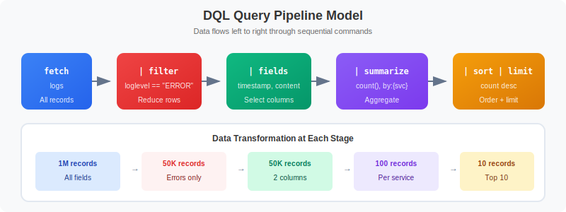

# 🔍 Querying & Parsing Logs

> **Series:** OPLOGS | **Notebook:** 5 of 8 | **Created:** December 2025

## DQL Fundamentals and DPL Pattern Matching

This notebook covers DQL query syntax, filtering, string matching, and DPL (Dynatrace Pattern Language) for extracting structured data from logs.

---

## Table of Contents

1. DQL Fundamentals
2. Filtering Logs
3. String Matching Functions
4. Field Selection and Transformation
5. DPL (Dynatrace Pattern Language) Parsing
6. Working with JSON Logs
7. Null Handling
8. Advanced Parsing Examples


## Prerequisites

- ✅ Access to a Dynatrace environment with log data
- ✅ Completed OPLOGS-01 through OPLOGS-04
- ✅ Basic understanding of regular expressions (helpful)


## 1. DQL Fundamentals

### Query Structure



<!-- MARKDOWN_TABLE_ALTERNATIVE
DQL Pipeline Model:

fetch logs, from: now() - 1h
↓
filter <condition>
↓
fields <field1>, <field2>
↓
sort <field> desc
↓
limit 100

Each stage processes data sequentially through the pipeline.
-->

```
fetch logs, from: now() - 1h          // Data source and time range
| filter <condition>                   // Filter records
| fields <field1>, <field2>           // Select fields
| sort <field> desc                   // Order results
| limit 100                           // Limit output
```

### 🚨 Critical DQL Rules (DQL ≠ SQL)

| ✅ DQL Syntax | ❌ SQL Syntax |
|---------------|---------------|
| `filter status == "ERROR"` | `WHERE status = 'ERROR'` |
| `in(field, {"a", "b"})` | `field IN ('a', 'b')` |
| `summarize {count = count()}` | `SELECT COUNT(*)` |
| `isNull(field)` | `field IS NULL` |

```python
// Basic log query - explore recent logs
fetch logs, from: now() - 1h
| fields timestamp, content, loglevel, dt.entity.host
| limit 10
```

```python
// Query with time range options
fetch logs, from: now() - 24h, to: now() - 12h
| summarize {count = count()}, by: {loglevel}
| sort count desc
```

## 2. Filtering Logs

### Comparison Operators

| Operator | Description | Example |
|----------|-------------|----------|
| `==` | Equals | `loglevel == "ERROR"` |
| `!=` | Not equals | `status != "NONE"` |
| `>`, `>=` | Greater than | `count > 100` |
| `<`, `<=` | Less than | `duration < 1000` |

### Logical Operators

| Operator | Description | Example |
|----------|-------------|----------|
| `AND` | Both conditions | `loglevel == "ERROR" AND isNotNull(host)` |
| `OR` | Either condition | `loglevel == "ERROR" OR loglevel == "WARN"` |
| `NOT` | Negate | `NOT contains(content, "health")` |

```python
// Filter by log level
fetch logs, from: now() - 1h
| filter loglevel == "ERROR"
| fields timestamp, content, dt.entity.host
| limit 20
```

```python
// Multiple conditions with AND/OR
fetch logs, from: now() - 1h
| filter (loglevel == "ERROR" OR loglevel == "WARN")
        AND isNotNull(dt.entity.host)
| summarize {count = count()}, by: {loglevel, dt.entity.host}
| sort count desc
| limit 15
```

```python
// Filter using in() for multiple values
fetch logs, from: now() - 1h
| filter in(loglevel, {"ERROR", "WARN", "INFO"})
| summarize {count = count()}, by: {loglevel}
| sort count desc
```

## 3. String Matching Functions

| Function | Description | Example |
|----------|-------------|----------|
| `contains(str, substr)` | Substring match | `contains(content, "error")` |
| `startsWith(str, prefix)` | Prefix match | `startsWith(content, "[ERROR]")` |
| `endsWith(str, suffix)` | Suffix match | `endsWith(content, "failed")` |
| `matchesPhrase(str, phrase)` | Word boundary match | `matchesPhrase(content, "connection refused")` |
| `matchesValue(str, pattern)` | Exact or wildcard match | `matchesValue(host, "web-*")` |

```python
// Search for specific content patterns
fetch logs, from: now() - 1h
| filter contains(content, "Exception")
| fieldsAdd content_preview = substring(content, from: 0, to: 100)
| fields timestamp, content_preview, dt.entity.host
| limit 15
```

```python
// Use matchesPhrase for word-boundary matching
fetch logs, from: now() - 1h
| filter matchesPhrase(content, "connection")
| fieldsAdd content_preview = substring(content, from: 0, to: 120)
| summarize {count = count()}, by: {content_preview}
| sort count desc
| limit 10
```

```python
// Exclude patterns with NOT
fetch logs, from: now() - 1h
| filter loglevel == "ERROR"
| filter NOT matchesPhrase(content, "health")
| filter NOT matchesPhrase(content, "heartbeat")
| fieldsAdd content_preview = substring(content, from: 0, to: 100)
| summarize {count = count()}, by: {content_preview}
| sort count desc
| limit 10
```

## 4. Field Selection and Transformation

### Field Commands

| Command | Description |
|---------|-------------|
| `fields` | Select specific fields only |
| `fieldsAdd` | Add computed fields |
| `fieldsRemove` | Remove fields |

```python
// Add computed fields
fetch logs, from: now() - 1h
| filter loglevel == "ERROR"
| fieldsAdd severity = if(contains(content, "critical"), "CRITICAL", 
                       else: if(contains(content, "fatal"), "FATAL",
                       else: "ERROR"))
| fieldsAdd content_length = stringLength(content)
| fields timestamp, severity, content_length, dt.entity.host
| limit 20
```

```python
// String manipulation functions
fetch logs, from: now() - 1h
| filter isNotNull(k8s.namespace.name)
| fieldsAdd pod_short = substring(k8s.pod.name, from: 0, to: 30)
| fields timestamp, k8s.namespace.name, pod_short, loglevel
| limit 10
```

## 5. DPL (Dynatrace Pattern Language) Parsing

DPL extracts structured data from unstructured log content.

### DPL Matchers

| Matcher | Description | Matches |
|---------|-------------|----------|
| `INT` | Integer | `42`, `-17` |
| `DOUBLE` | Decimal | `3.14`, `-0.5` |
| `IPADDR` | IP address | `192.168.1.1`, `::1` |
| `LD` | Line data (to delimiter) | Any text |
| `WORD` | Word characters | `hello`, `user123` |
| `SPACE` | Whitespace | spaces, tabs |
| `JSON` | JSON structure | `{"key": "value"}` |

### Pattern Syntax

| Syntax | Description |
|--------|-------------|
| `MATCHER:fieldname` | Extract to named field |
| `MATCHER` | Match but don't extract |
| `MATCHER?` | Optional matcher |
| `'literal'` | Match exact string |
| `(opt1\|opt2)` | Match alternatives |

```python
// Parse log level from content (e.g., "[ERROR] message")
fetch logs, from: now() - 1h
| filter startsWith(content, "[")
| parse content, "'[' LD:parsed_level ']'"
| filter isNotNull(parsed_level)
| summarize {count = count()}, by: {parsed_level}
| sort count desc
| limit 10
```

```python
// Parse HTTP-style logs
// Example: GET /api/users 200 45ms
fetch logs, from: now() - 1h
| filter contains(content, "GET") OR contains(content, "POST")
| parse content, "LD:method SPACE '/' LD:path SPACE INT:status_code"
| filter isNotNull(status_code)
| summarize {count = count()}, by: {method, status_code}
| sort count desc
| limit 15
```

```python
// Parse key-value pairs
// Example: "user=john action=login status=success"
fetch logs, from: now() - 1h
| parse content, "'user=' LD:username SPACE"
| filter isNotNull(username)
| summarize {count = count()}, by: {username}
| sort count desc
| limit 10
```

```python
// Parse IP addresses from logs
fetch logs, from: now() - 1h
| parse content, "IPADDR:client_ip"
| filter isNotNull(client_ip)
| summarize {count = count()}, by: {client_ip}
| sort count desc
| limit 15
```

## 6. Working with JSON Logs

Many applications emit JSON-formatted logs. DQL provides tools to work with JSON content.

```python
// Find JSON-formatted logs
fetch logs, from: now() - 1h
| filter startsWith(content, "{")
| fieldsAdd content_preview = substring(content, from: 0, to: 150)
| summarize {count = count()}, by: {content_preview}
| sort count desc
| limit 10
```

```python
// Parse JSON and extract fields
fetch logs, from: now() - 1h
| filter startsWith(content, "{")
| parse content, "JSON:json_data"
| filter isNotNull(json_data)
| fields timestamp, json_data
| limit 10
```

```python
// Access nested JSON fields
fetch logs, from: now() - 1h
| filter startsWith(content, "{")
| parse content, "JSON:json_data"
| filter isNotNull(json_data)
| fieldsAdd error_type = json_data[errorType]
| fieldsAdd status_val = json_data[status]
| filter isNotNull(status_val)
| summarize {count = count()}, by: {status_val, error_type}
| sort count desc
| limit 15
```

## 7. Null Handling

DQL uses three-valued logic. `NULL` comparisons require special functions.

| ❌ Wrong | ✅ Correct |
|----------|------------|
| `field == null` | `isNull(field)` |
| `field != null` | `isNotNull(field)` |

```python
// Check for null values
fetch logs, from: now() - 1h
| summarize {
    total = count(),
    with_host = countIf(isNotNull(dt.entity.host)),
    without_host = countIf(isNull(dt.entity.host)),
    with_namespace = countIf(isNotNull(k8s.namespace.name)),
    without_namespace = countIf(isNull(k8s.namespace.name))
  }
```

```python
// Use coalesce for default values
fetch logs, from: now() - 1h
| fieldsAdd effective_level = coalesce(loglevel, status, "UNKNOWN")
| summarize {count = count()}, by: {effective_level}
| sort count desc
```

## 8. Advanced Parsing Examples

```python
// Parse exception patterns
fetch logs, from: now() - 24h
| filter contains(content, "Exception") OR contains(content, "Error")
| parse content, "LD:exception_type 'Exception'"
| filter isNotNull(exception_type)
| summarize {count = count()}, by: {exception_type}
| sort count desc
| limit 15
```

```python
// Parse with optional fields
// Matches: "error code=123" or "error code=123 message=failed"
fetch logs, from: now() - 1h
| filter contains(content, "error")
| parse content, "'error' (SPACE 'code=' INT:error_code)? (SPACE 'message=' LD:error_msg)?"
| filter isNotNull(error_code)
| summarize {count = count()}, by: {error_code}
| sort count desc
| limit 10
```

```python
// Parse alternative formats
// Matches: "user=john", "username=john"
fetch logs, from: now() - 1h
| parse content, "('user='|'username=') LD:user_value"
| filter isNotNull(user_value)
| summarize {count = count()}, by: {user_value}
| sort count desc
| limit 10
```

---

## 📝 Summary

In this notebook, you learned:

✅ **DQL fundamentals** - Query structure and syntax rules  
✅ **Filtering** - Comparison operators, logical operators, in()  
✅ **String matching** - contains, matchesPhrase, startsWith  
✅ **Field manipulation** - fieldsAdd, computed fields  
✅ **DPL parsing** - Matchers (INT, LD, IPADDR, JSON)  
✅ **JSON handling** - Parsing and accessing nested fields  
✅ **Null handling** - isNull, isNotNull, coalesce  

---

## ➡️ Next Steps

Continue to **OPLOGS-06: Topology & Entity Context** to learn about entity context and relationships.

---

## 📚 References

- [DQL Reference](https://docs.dynatrace.com/docs/platform/grail/dynatrace-query-language)
- [DQL Functions](https://docs.dynatrace.com/docs/platform/grail/dynatrace-query-language/functions)
- [Dynatrace Pattern Language](https://docs.dynatrace.com/docs/discover-dynatrace/platform/grail/dynatrace-pattern-language)
- [DPL Architect Tool](https://docs.dynatrace.com/docs/discover-dynatrace/platform/grail/dynatrace-pattern-language/dpl-architect)
