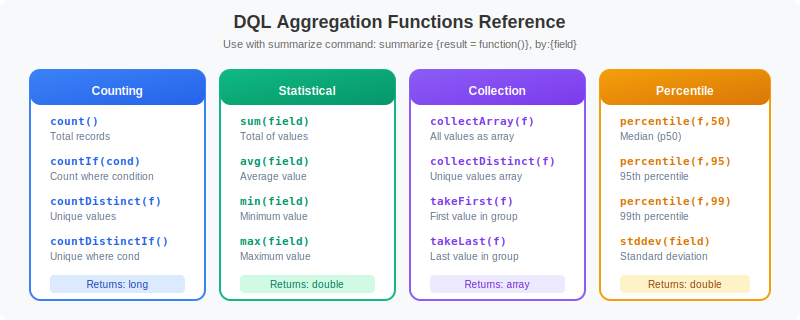

# 📊 Analytics & Dashboards

> **Series:** OPLOGS | **Notebook:** 7 of 8 | **Created:** December 2025

## Aggregation, Time Series, and Visualization Queries

This notebook covers aggregation functions, time series analysis, statistical patterns, and dashboard-ready queries for log analytics.

---

## Table of Contents

1. Aggregation Functions
2. Time Series Analysis
3. Statistical Analysis
4. Dashboard-Ready Queries
5. Trend Analysis
6. Log Pattern Analysis
7. Operational Dashboard Queries


## Prerequisites

- ✅ Access to a Dynatrace environment with log data
- ✅ Completed OPLOGS-01 through OPLOGS-06
- ✅ Familiarity with dashboard concepts


## 1. Aggregation Functions



<!-- MARKDOWN_TABLE_ALTERNATIVE
Aggregation Functions Reference:

Counting Functions:
- count() - Count all records
- countIf(condition) - Conditional count
- countDistinct(field) - Count unique values

Numeric Functions:
- sum(field) - Sum values
- avg(field) - Average
- min(field) - Minimum value
- max(field) - Maximum value

Collection Functions:
- takeFirst(field) - First value
- takeLast(field) - Last value
- collectDistinct(field) - Array of unique values

All aggregations must use named aliases for downstream operations.
-->

### Common Aggregation Functions

| Function | Description | Example |
|----------|-------------|---------|
| `count()` | Count records | `summarize {total = count()}` |
| `countIf(condition)` | Conditional count | `countIf(loglevel == "ERROR")` |
| `countDistinct(field)` | Unique values | `countDistinct(k8s.pod.name)` |
| `sum(field)` | Sum values | `sum(bytes)` |
| `avg(field)` | Average | `avg(response_time)` |
| `min(field)` | Minimum | `min(timestamp)` |
| `max(field)` | Maximum | `max(timestamp)` |
| `takeFirst(field)` | First value | `takeFirst(content)` |
| `takeLast(field)` | Last value | `takeLast(content)` |
| `collectDistinct(field)` | Array of unique values | `collectDistinct(loglevel)` |

### 🚨 Important: Named Aliases Required

```dql
// ✅ CORRECT - Named aliases
| summarize {count = count(), errors = countIf(...)}, by: {...}
| sort count desc

// ❌ WRONG - Anonymous aggregation can't be used in sort
| summarize count(), by: {...}
| sort count() desc  // ERROR!
```

```python
// Basic aggregations
fetch logs, from: now() - 1h
| summarize {
    total_logs = count(),
    unique_hosts = countDistinct(dt.entity.host),
    unique_namespaces = countDistinct(k8s.namespace.name),
    unique_pods = countDistinct(k8s.pod.name)
  }
```

```python
// Aggregations with grouping
fetch logs, from: now() - 1h
| summarize {
    total = count(),
    errors = countIf(loglevel == "ERROR"),
    warnings = countIf(loglevel == "WARN"),
    info = countIf(loglevel == "INFO")
  }, by: {k8s.namespace.name}
| sort total desc
| limit 15
```

```python
// Error rate calculation
fetch logs, from: now() - 1h
| summarize {
    total = count(),
    errors = countIf(loglevel == "ERROR")
  }, by: {k8s.namespace.name}
| filter total > 100  // Minimum sample size
| fieldsAdd error_rate_pct = round((errors * 100.0) / total, decimals: 2)
| sort error_rate_pct desc
| limit 15
```

## 2. Time Series Analysis

The `makeTimeseries` command creates time-bucketed data for trend visualization.

```python
// Log volume over time (5-minute buckets)
fetch logs, from: now() - 6h
| makeTimeseries {log_count = count()}, interval: 5m
```

```python
// Error trend over time
fetch logs, from: now() - 6h
| makeTimeseries {
    total = count(),
    errors = countIf(loglevel == "ERROR"),
    warnings = countIf(loglevel == "WARN")
  }, interval: 5m
```

```python
// Time series by dimension (namespace)
fetch logs, from: now() - 6h
| filter isNotNull(k8s.namespace.name)
| makeTimeseries {
    log_count = count()
  }, by: {k8s.namespace.name}, interval: 10m
```

```python
// Error rate time series by host
fetch logs, from: now() - 6h
| filter isNotNull(dt.entity.host)
| makeTimeseries {
    total = count(),
    errors = countIf(loglevel == "ERROR")
  }, by: {dt.entity.host}, interval: 15m
```

## 3. Statistical Analysis

```python
// Log volume statistics by source
fetch logs, from: now() - 24h
| summarize {
    total = count(),
    first_seen = min(timestamp),
    last_seen = max(timestamp)
  }, by: {dt.openpipeline.source}
| fieldsAdd duration_hours = (last_seen - first_seen) / 3600000000000
| fieldsAdd logs_per_hour = round(total / duration_hours, decimals: 0)
| sort total desc
```

```python
// Percentile analysis (if numeric field available)
fetch logs, from: now() - 1h
| fieldsAdd content_length = stringLength(content)
| summarize {
    avg_length = avg(content_length),
    min_length = min(content_length),
    max_length = max(content_length),
    total_logs = count()
  }, by: {k8s.namespace.name}
| sort avg_length desc
| limit 15
```

```python
// Hourly distribution analysis
fetch logs, from: now() - 24h
| fieldsAdd hour_bucket = bin(timestamp, 1h)
| summarize {log_count = count()}, by: {hour_bucket}
| sort hour_bucket asc
```

```python
// Daily distribution analysis
fetch logs, from: now() - 7d
| fieldsAdd day_bucket = bin(timestamp, 1d)
| summarize {
    log_count = count(),
    error_count = countIf(loglevel == "ERROR")
  }, by: {day_bucket}
| sort day_bucket asc
```

## 4. Dashboard-Ready Queries

These queries are optimized for dashboard tiles and visualizations.

```python
// Single Value: Total Logs (Last Hour)
fetch logs, from: now() - 1h
| summarize {total_logs = count()}
```

```python
// Single Value: Error Count (Last Hour)
fetch logs, from: now() - 1h
| filter loglevel == "ERROR"
| summarize {error_count = count()}
```

```python
// Pie Chart: Log Level Distribution
fetch logs, from: now() - 1h
| summarize {count = count()}, by: {loglevel}
| sort count desc
```

```python
// Bar Chart: Top Error Sources
fetch logs, from: now() - 1h
| filter loglevel == "ERROR"
| summarize {error_count = count()}, by: {k8s.namespace.name}
| sort error_count desc
| limit 10
```

```python
// Line Chart: Log Trend (6 Hours)
fetch logs, from: now() - 6h
| makeTimeseries {
    errors = countIf(loglevel == "ERROR"),
    warnings = countIf(loglevel == "WARN"),
    info = countIf(loglevel == "INFO")
  }, interval: 5m
```

```python
// Table: Top Error Messages
fetch logs, from: now() - 1h
| filter loglevel == "ERROR"
| fieldsAdd error_preview = substring(content, from: 0, to: 100)
| summarize {
    occurrences = count(),
    first_seen = min(timestamp),
    last_seen = max(timestamp)
  }, by: {error_preview, k8s.namespace.name}
| sort occurrences desc
| limit 20
```

```python
// Heat Map: Errors by Hour and Namespace
fetch logs, from: now() - 24h
| filter loglevel == "ERROR"
| fieldsAdd hour_bucket = bin(timestamp, 1h)
| summarize {error_count = count()}, by: {hour_bucket, k8s.namespace.name}
| sort hour_bucket asc
```

## 5. Trend Analysis

```python
// Compare current hour to previous hour
fetch logs, from: now() - 2h
| fieldsAdd period = if(timestamp > now() - 1h, "current", else: "previous")
| summarize {count = count()}, by: {period, loglevel}
| sort period asc, count desc
```

```python
// New error patterns (appeared in last hour)
fetch logs, from: now() - 1h
| filter loglevel == "ERROR"
| fieldsAdd error_sig = substring(content, from: 0, to: 80)
| summarize {
    count = count(),
    first_seen = min(timestamp)
  }, by: {error_sig, k8s.namespace.name}
| filter first_seen > now() - 30m  // First seen in last 30 minutes
| sort first_seen desc
| limit 15
```

```python
// Volume anomaly detection (compare to baseline)
fetch logs, from: now() - 6h
| fieldsAdd time_bucket = bin(timestamp, 15m)
| summarize {log_count = count()}, by: {time_bucket, k8s.namespace.name}
| sort time_bucket desc
| limit 100
```

## 6. Log Pattern Analysis

```python
// Top log patterns (by content prefix)
fetch logs, from: now() - 1h
| fieldsAdd pattern = substring(content, from: 0, to: 60)
| summarize {count = count()}, by: {pattern}
| sort count desc
| limit 25
```

```python
// Unique log levels and statuses
fetch logs, from: now() - 1h
| summarize {
    loglevels = collectDistinct(loglevel),
    statuses = collectDistinct(status),
    sources = collectDistinct(dt.openpipeline.source)
  }
```

```python
// Log diversity score (unique patterns per namespace)
fetch logs, from: now() - 1h
| fieldsAdd pattern = substring(content, from: 0, to: 50)
| summarize {
    total_logs = count(),
    unique_patterns = countDistinct(pattern)
  }, by: {k8s.namespace.name}
| fieldsAdd diversity_ratio = round((unique_patterns * 100.0) / total_logs, decimals: 2)
| sort diversity_ratio desc
| limit 15
```

## 7. Operational Dashboard Queries

```python
// Operations Summary (last 1h)
fetch logs, from: now() - 1h
| summarize {
    total_logs = count(),
    error_count = countIf(loglevel == "ERROR"),
    warn_count = countIf(loglevel == "WARN"),
    unique_hosts = countDistinct(dt.entity.host),
    unique_pods = countDistinct(k8s.pod.name)
  }
| fieldsAdd error_rate = round((error_count * 100.0) / total_logs, decimals: 2)
```

```python
// Health scorecard by namespace
fetch logs, from: now() - 1h
| filter isNotNull(k8s.namespace.name)
| summarize {
    total = count(),
    errors = countIf(loglevel == "ERROR"),
    warnings = countIf(loglevel == "WARN")
  }, by: {k8s.namespace.name}
| fieldsAdd error_rate = round((errors * 100.0) / total, decimals: 2)
| fieldsAdd health_status = if(error_rate > 10, "CRITICAL",
                            else: if(error_rate > 5, "WARNING",
                            else: "HEALTHY"))
| sort error_rate desc
```

```python
// Ingestion pipeline summary
fetch logs, from: now() - 1h
| summarize {
    log_count = count(),
    unique_pipelines = countDistinct(dt.openpipeline.pipelines)
  }, by: {dt.openpipeline.source, dt.system.bucket}
| sort log_count desc
```

---

## 📝 Summary

In this notebook, you learned:

✅ **Aggregation functions** - count, countIf, countDistinct, sum, avg  
✅ **Time series** - makeTimeseries with intervals  
✅ **Statistical analysis** - hourly/daily patterns, percentiles  
✅ **Dashboard queries** - Single values, charts, tables  
✅ **Trend analysis** - Period comparison, anomaly detection  
✅ **Pattern analysis** - Log clustering and diversity  

---

## ➡️ Next Steps

Continue to **OPLOGS-08: Security & Data Protection** for data protection patterns.

---

## 📚 References

- [DQL Aggregation Functions](https://docs.dynatrace.com/docs/platform/grail/dynatrace-query-language/functions/aggregation-functions)
- [DQL makeTimeseries](https://docs.dynatrace.com/docs/platform/grail/dynatrace-query-language/commands/makeTimeseries)
- [Dynatrace Dashboards](https://docs.dynatrace.com/docs/observe-and-explore/dashboards-and-notebooks/dashboards-new)
