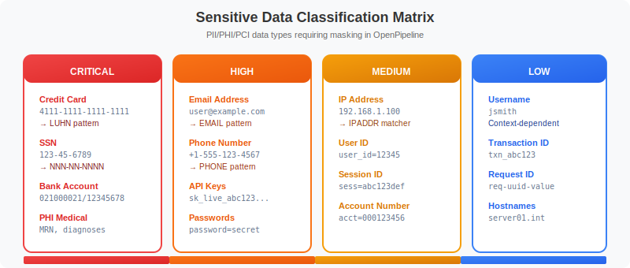
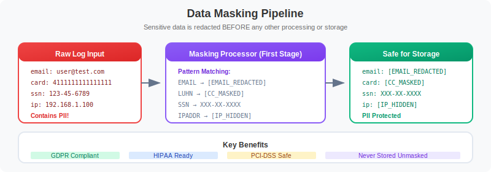

# 🔒 Security & Data Protection

> **Series:** OPLOGS | **Notebook:** 8 of 8 | **Created:** December 2025

## Sensitive Data Discovery, Masking, and Compliance

This notebook covers sensitive data discovery, OpenPipeline masking configuration, security event monitoring, and compliance reporting.

---

## Table of Contents

1. Sensitive Data Discovery
2. OpenPipeline Masking Configuration
3. IP Address Analysis
4. Security Event Monitoring
5. Audit Log Queries
6. Compliance Reporting
7. Masking Best Practices


## Prerequisites

- ✅ Access to a Dynatrace environment with log data
- ✅ Completed OPLOGS-01 through OPLOGS-07
- ✅ Understanding of data privacy requirements


## 1. Sensitive Data Discovery

Before implementing masking, discover what sensitive data exists in your logs.



<!-- MARKDOWN_TABLE_ALTERNATIVE
Sensitive Data Classification:

Critical Risk (Immediate Action Required):
- Credit cards: 4111-1111-1111-1111
- Social Security: 123-45-6789
- API keys: sk_live_abc123...

High Risk (Masking Required):
- JWT tokens: eyJhbG...
- Passwords: Any password field

Medium Risk (Consider Masking):
- Email addresses: user@domain.com
- Phone numbers: +1-555-123-4567

Low-Medium Risk (Context Dependent):
- IP addresses: 192.168.1.100

All sensitive data should be masked at ingestion using OpenPipeline.
-->

### Common Sensitive Data Patterns

| Data Type | Pattern Example | Risk Level |
|-----------|-----------------|------------|
| Email addresses | `user@domain.com` | Medium |
| Credit cards | `4111-1111-1111-1111` | **Critical** |
| Social Security | `123-45-6789` | **Critical** |
| API keys | `sk_live_abc123...` | **Critical** |
| IP addresses | `192.168.1.100` | Low-Medium |
| Phone numbers | `+1-555-123-4567` | Medium |
| JWT tokens | `eyJhbG...` | High |

```python
// Search for potential email addresses in logs
fetch logs, from: now() - 1h
| filter contains(content, "@")
| filter NOT contains(content, "@dynatrace")
| filter NOT contains(content, "@example")
| fieldsAdd content_preview = substring(content, from: 0, to: 150)
| summarize {count = count()}, by: {content_preview, k8s.namespace.name}
| sort count desc
| limit 20
```

```python
// Search for potential API keys or tokens
fetch logs, from: now() - 1h
| filter contains(content, "key=") 
        OR contains(content, "token=")
        OR contains(content, "api_key")
        OR contains(content, "apikey")
        OR contains(content, "secret")
| fieldsAdd content_preview = substring(content, from: 0, to: 120)
| summarize {count = count()}, by: {content_preview, k8s.namespace.name}
| sort count desc
| limit 20
```

```python
// Search for potential JWT tokens
fetch logs, from: now() - 1h
| filter contains(content, "eyJ")  // JWT typically starts with eyJ
| fieldsAdd content_preview = substring(content, from: 0, to: 100)
| summarize {count = count()}, by: {content_preview, k8s.namespace.name}
| sort count desc
| limit 15
```

```python
// Search for potential credit card patterns (16 digits)
fetch logs, from: now() - 1h
| filter contains(content, "card")
        OR contains(content, "payment")
        OR contains(content, "visa")
        OR contains(content, "mastercard")
| fieldsAdd content_preview = substring(content, from: 0, to: 120)
| summarize {count = count()}, by: {content_preview}
| sort count desc
| limit 15
```

```python
// Search for password-related entries (should never be logged!)
fetch logs, from: now() - 1h
| filter contains(content, "password")
        OR contains(content, "passwd")
        OR contains(content, "pwd=")
| fieldsAdd content_preview = substring(content, from: 0, to: 100)
| summarize {count = count()}, by: {content_preview, k8s.namespace.name}
| sort count desc
| limit 20
```

## 2. OpenPipeline Masking Configuration

OpenPipeline provides built-in masking processors to protect sensitive data at ingestion time.



<!-- MARKDOWN_TABLE_ALTERNATIVE
OpenPipeline Masking Flow:

Step 1: Identify Sensitive Data
- Discover PII, credentials, tokens in logs
- Define patterns and risk levels

Step 2: Configure Masking Processors
- Mask value: Replace with fixed pattern (***MASKED***)
- Hash value: One-way hash for correlation
- Remove field: Completely remove the field
- Pattern mask: Partial masking (****1234)

Step 3: Apply at Ingestion
- Masking occurs BEFORE storage in Grail
- Irreversible - original data never stored
- Applied in OpenPipeline processing stage

Step 4: Verify Masking
- Check for masked patterns in logs
- Validate sensitive data no longer visible
- Monitor masking effectiveness
-->

### Masking Processor Types

| Processor | Use Case |
|-----------|----------|
| **Mask value** | Replace with fixed pattern (e.g., `***MASKED***`) |
| **Hash value** | One-way hash for correlation without exposure |
| **Remove field** | Completely remove the field |
| **Pattern mask** | Partial masking (e.g., `****1234`) |

### Configuration Path

1. Settings → Log processing → OpenPipeline
2. Select or create pipeline
3. Add "Mask value" or "Hash value" processor
4. Configure field and pattern

### DPL Patterns for Masking

```
# Email pattern
[A-Za-z0-9._%+-]+@[A-Za-z0-9.-]+\.[A-Za-z]{2,}

# Credit card pattern
\b(?:\d[ -]*?){13,16}\b

# SSN pattern (US)
\b\d{3}-\d{2}-\d{4}\b

# IP address pattern
\b(?:\d{1,3}\.){3}\d{1,3}\b
```

```python
// Verify masking is working (look for masked patterns)
fetch logs, from: now() - 1h
| filter contains(content, "MASKED")
        OR contains(content, "***")
        OR contains(content, "[REDACTED]")
| fieldsAdd content_preview = substring(content, from: 0, to: 120)
| summarize {count = count()}, by: {content_preview}
| sort count desc
| limit 15
```

```python
// Check which pipelines are processing logs
fetch logs, from: now() - 1h
| summarize {count = count()}, by: {dt.openpipeline.pipelines}
| sort count desc
```

## 3. IP Address Analysis

IP addresses may require masking depending on your compliance requirements.

```python
// Find logs containing IP addresses
fetch logs, from: now() - 1h
| parse content, "IPADDR:ip_found"
| filter isNotNull(ip_found)
| summarize {count = count()}, by: {ip_found, k8s.namespace.name}
| sort count desc
| limit 20
```

```python
// Classify IP addresses (internal vs external)
fetch logs, from: now() - 1h
| parse content, "IPADDR:ip_found"
| filter isNotNull(ip_found)
| fieldsAdd ip_type = if(startsWith(ip_found, "10."), "RFC1918-10",
                     else: if(startsWith(ip_found, "192.168."), "RFC1918-192",
                     else: if(startsWith(ip_found, "172."), "RFC1918-172",
                     else: if(startsWith(ip_found, "127."), "LOOPBACK",
                     else: "EXTERNAL"))))
| summarize {count = count()}, by: {ip_type}
| sort count desc
```

## 4. Security Event Monitoring

Monitor logs for security-relevant events.

```python
// Authentication-related logs
fetch logs, from: now() - 1h
| filter contains(content, "login")
        OR contains(content, "auth")
        OR contains(content, "signin")
        OR contains(content, "logout")
| fieldsAdd content_preview = substring(content, from: 0, to: 100)
| summarize {count = count()}, by: {content_preview, k8s.namespace.name}
| sort count desc
| limit 20
```

```python
// Failed authentication attempts
fetch logs, from: now() - 1h
| filter (contains(content, "failed") OR contains(content, "denied") OR contains(content, "unauthorized"))
        AND (contains(content, "login") OR contains(content, "auth") OR contains(content, "access"))
| fieldsAdd content_preview = substring(content, from: 0, to: 120)
| summarize {count = count()}, by: {content_preview, k8s.namespace.name}
| sort count desc
| limit 20
```

```python
// Security-related errors over time
fetch logs, from: now() - 24h
| filter loglevel == "ERROR"
| filter contains(content, "security")
        OR contains(content, "unauthorized")
        OR contains(content, "forbidden")
        OR contains(content, "denied")
| makeTimeseries {security_errors = count()}, interval: 30m
```

```python
// Access pattern anomalies - hourly access distribution
fetch logs, from: now() - 24h
| filter contains(content, "access") OR contains(content, "request")
| fieldsAdd hour_bucket = bin(timestamp, 1h)
| summarize {access_count = count()}, by: {hour_bucket, k8s.namespace.name}
| sort hour_bucket asc
```

## 5. Audit Log Queries

Track administrative and configuration changes.

```python
// Administrative action logs
fetch logs, from: now() - 24h
| filter contains(content, "created")
        OR contains(content, "deleted")
        OR contains(content, "updated")
        OR contains(content, "modified")
| filter contains(content, "user") 
        OR contains(content, "admin")
        OR contains(content, "config")
| fieldsAdd content_preview = substring(content, from: 0, to: 100)
| summarize {
    count = count(),
    first_seen = min(timestamp),
    last_seen = max(timestamp)
  }, by: {content_preview, k8s.namespace.name}
| sort count desc
| limit 20
```

```python
// Configuration change events
fetch logs, from: now() - 24h
| filter contains(content, "config")
        OR contains(content, "setting")
        OR contains(content, "environment")
| filter contains(content, "change")
        OR contains(content, "update")
        OR contains(content, "reload")
| fieldsAdd content_preview = substring(content, from: 0, to: 120)
| summarize {count = count()}, by: {content_preview, k8s.namespace.name}
| sort count desc
| limit 15
```

```python
// Permission-related events
fetch logs, from: now() - 24h
| filter contains(content, "permission")
        OR contains(content, "role")
        OR contains(content, "privilege")
        OR contains(content, "rbac")
| fieldsAdd content_preview = substring(content, from: 0, to: 100)
| summarize {count = count()}, by: {content_preview, k8s.namespace.name}
| sort count desc
| limit 15
```

## 6. Compliance Reporting

```python
// Data access summary
fetch logs, from: now() - 24h
| filter contains(content, "access") OR contains(content, "read") OR contains(content, "view")
| summarize {
    total_accesses = count(),
    unique_sources = countDistinct(dt.openpipeline.source)
  }, by: {k8s.namespace.name}
| sort total_accesses desc
| limit 15
```

```python
// Log retention verification
fetch logs, from: now() - 7d
| summarize {
    earliest = min(timestamp),
    latest = max(timestamp),
    total_logs = count()
  }, by: {dt.system.bucket}
| fieldsAdd retention_days = (latest - earliest) / 86400000000000
```

```python
// Sensitive field exposure audit
fetch logs, from: now() - 1h
| summarize {
    total = count(),
    with_email_pattern = countIf(contains(content, "@")),
    with_key_pattern = countIf(contains(content, "key=") OR contains(content, "token=")),
    with_password_ref = countIf(contains(content, "password") OR contains(content, "passwd"))
  }
| fieldsAdd email_exposure_pct = round((with_email_pattern * 100.0) / total, decimals: 2)
| fieldsAdd key_exposure_pct = round((with_key_pattern * 100.0) / total, decimals: 2)
| fieldsAdd password_exposure_pct = round((with_password_ref * 100.0) / total, decimals: 2)
```

## 7. Masking Best Practices

### Do's ✅

1. **Mask at ingestion** - Use OpenPipeline processors to mask before storage
2. **Use hashing** - For fields that need correlation but not visibility
3. **Audit regularly** - Run discovery queries to find new sensitive data patterns
4. **Document patterns** - Keep a registry of masked data types and patterns
5. **Test in staging** - Verify masking works before production deployment

### Don'ts ❌

1. **Don't log passwords** - Ever, even "for debugging"
2. **Don't log full credit cards** - Maximum last 4 digits
3. **Don't rely on application masking alone** - OpenPipeline is your safety net
4. **Don't skip internal data** - Internal IP/usernames may still be sensitive
5. **Don't forget API keys** - Rotate if accidentally logged

### OpenPipeline Masking Configuration Example

```yaml
# OpenPipeline processor configuration
processors:
  - name: mask-emails
    type: mask
    field: content
    pattern: "[A-Za-z0-9._%+-]+@[A-Za-z0-9.-]+\\.[A-Za-z]{2,}"
    replacement: "[EMAIL-MASKED]"
    
  - name: mask-api-keys
    type: mask
    field: content
    pattern: "(api_key|apikey|key)=[A-Za-z0-9]{20,}"
    replacement: "$1=[KEY-MASKED]"
```

```python
// Security health summary
fetch logs, from: now() - 1h
| summarize {
    total_logs = count(),
    security_events = countIf(contains(content, "security") OR contains(content, "auth")),
    failed_events = countIf(contains(content, "failed") OR contains(content, "denied")),
    potential_pii = countIf(contains(content, "@") OR contains(content, "password"))
  }
| fieldsAdd security_event_rate = round((security_events * 100.0) / total_logs, decimals: 2)
| fieldsAdd failure_rate = round((failed_events * 100.0) / total_logs, decimals: 2)
| fieldsAdd pii_risk_rate = round((potential_pii * 100.0) / total_logs, decimals: 2)
```

---

## 📝 Summary

In this notebook, you learned:

✅ **Sensitive data discovery** - Finding PII, tokens, and credentials  
✅ **OpenPipeline masking** - Configuration and patterns  
✅ **IP address analysis** - Classification and masking needs  
✅ **Security monitoring** - Auth events, failures, anomalies  
✅ **Audit logging** - Admin actions, config changes  
✅ **Compliance reporting** - Data access and exposure audits  

---

## ➡️ Next Steps

Continue to **OPLOGS-07: Buckets & Cost Optimization** for storage management.

---

## 📚 References

- [OpenPipeline Data Masking](https://docs.dynatrace.com/docs/platform/openpipeline/use-cases/log-processing/mask-sensitive-data)
- [Log Security Best Practices](https://docs.dynatrace.com/docs/observe-and-explore/logs/log-management-and-analytics/lma-security)
- [GDPR and Compliance](https://docs.dynatrace.com/docs/manage/data-privacy-and-security)
