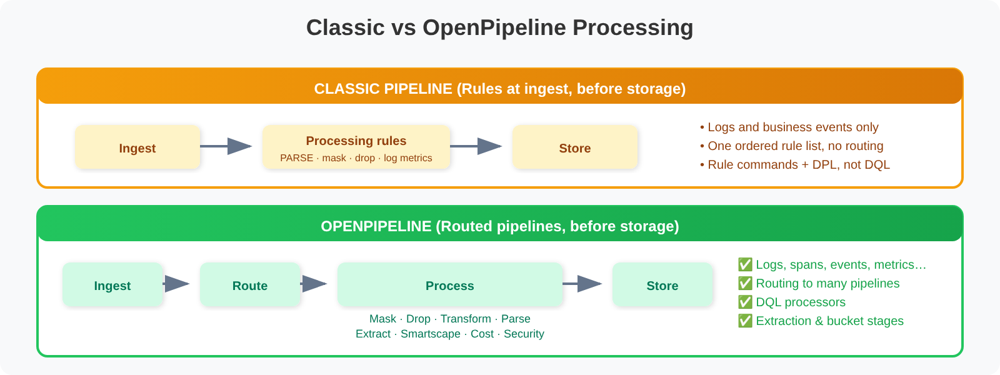

# OPMIG-01: OpenPipeline Migration Guide: Part 1

> **Series:** OPMIG — OpenPipeline Migration | **Notebook:** 1 of 10 | **Created:** December 2025 | **Last Updated:** 10/02/2026

## Introduction & Why Migrate from Classic to OpenPipeline v2.0

> 🆕 **New Addition (March 2026)**
>
> **Companion Series**
> - **OPLOGS** — Already migrated? Deep-dive into log processing with **OPLOGS-01: OpenPipeline Fundamentals**
> - **OPIPE** — Need spans, metrics, or event processing? See **OPIPE-01: OpenPipeline as a Multi-Scope Platform**

---

## Table of Contents

1. [What is OpenPipeline?](#what-is-openpipeline)
2. [Classic vs OpenPipeline: Key Differences](#classic-vs-openpipeline-key-differences)
3. [Benefits of Migrating](#benefits-of-migrating)
4. [OpenPipeline Configuration Scopes](#openpipeline-configuration-scopes)
5. [API Migration: Classic → OpenPipeline v2.0](#api-migration-classic-openpipeline-v20)
6. [Real-World Migration Scenarios](#real-world-migration-scenarios)
7. [Understanding Your Current State](#understanding-your-current-state)
8. [Migration Readiness Assessment](#migration-readiness-assessment)
9. [Migration Readiness Checklist](#migration-readiness-checklist)
10. [OpenPipeline Limits & Constraints](#openpipeline-limits-constraints)

---

## Learning Objectives

By the end of this notebook, you will:

- ✅ Understand what OpenPipeline is and why it replaces Classic log ingestion
- ✅ Learn the key architectural differences between Classic and OpenPipeline v2.0
- ✅ **Understand API endpoint compatibility and migration requirements**
- ✅ **Know OpenPipeline limits and constraints**
- ✅ Identify the benefits of migrating (cost, security, performance)
- ✅ **Review real-world migration scenarios**
- ✅ Assess your readiness to migrate

---

## Prerequisites

| Requirement | Details |
|-------------|---------|
| **Dynatrace Environment** | Dynatrace SaaS with Grail — OpenPipeline runs in the SaaS environment; Managed is not covered by this series |
| **Classic Log Ingestion** | Existing logs flowing via `/api/v2/logs/ingest` |
| **API Access** | `logs.read` and `logs.ingest` token scopes |
| **Knowledge** | Basic Dynatrace familiarity; no OpenPipeline experience required |

---

<a id="what-is-openpipeline"></a>
## What is OpenPipeline?
**OpenPipeline** is Dynatrace's unified data handling solution that seamlessly ingests and processes data from different sources, at any scale, and in any format.

> 💡 **Key Insight:** OpenPipeline is NOT just for logs! It's a comprehensive data processing framework that handles **logs, spans, metrics, events, business events, security events, and more**.

### OpenPipeline Architecture Overview


<!--MARKDOWN_TABLE_ALTERNATIVE
| Stage | Purpose | Components |
|-------|---------|------------|
| **INGEST** | Data entry | OneAgent, Log API, OTLP, Generic API |
| **ROUTING** | Pipeline selection | Matching conditions |
| **PROCESS** | Transformation | Masking, parsing, transform, drop |
| **EXTRACT** | Derived signals | Metrics, events, bizevents, attributes |
| **STORE** | Persistence | Grail buckets, retention, routing |
-->

### Core Capabilities

| Capability | Description |
|------------|-------------|
| **Unified Ingestion** | Single solution for logs, spans, metrics, events, and business events |
| **Dynamic Routing** | Route data to specific pipelines based on matching conditions |
| **Real-time Processing** | Transform, enrich, and mask data at ingestion time |
| **Metric Extraction** | Create metrics from any data source for long-term analytics |
| **Event Generation** | Generate custom events and business events from incoming data |
| **Bucket Management** | Control retention and cost with targeted storage routing |
| **Security & Compliance** | Mask sensitive data before storage |

---

<a id="classic-vs-openpipeline-key-differences"></a>
## Classic vs OpenPipeline: Key Differences
Understanding the fundamental differences helps you plan your migration effectively.

### Feature Comparison

| Feature | Classic pipeline | OpenPipeline |
|---------|------------------|--------------|
| **Data Types** | Logs and business events | Logs, spans, metrics, events, business events, and more |
| **Processing Location** | At ingest, before storage | At ingest, before storage |
| **Rule language** | Processing-rule commands (`PARSE`, `FIELDS_ADD`, `FILTER_OUT`, …) with DPL | DQL processors with DPL, plus no-code processors |
| **Routing** | One ordered list of rules, each with a matcher | Dynamic routing to many pipelines, pipeline groups |
| **Extraction** | Log metrics | Metric, Davis event, business event, SDLC event and Smartscape stages |
| **Data Masking** | At ingest (mask, drop or rename attributes in a rule) | At ingest (Processing-stage processors) |
| **Bucket Assignment** | — | Bucket assignment stage, or No storage assignment |
| **Ownership** | Shared settings | Owner-based access per custom pipeline |
| **Configuration** | Settings → Log Monitoring → processing rules | Settings → Process and contextualize → OpenPipeline |

Both pipelines process records **before** they are written to Grail. The move to OpenPipeline is not about *when* processing happens; it is about scope (every signal type, not just logs), language (DQL instead of rule commands), structure (routed pipelines with fixed stages instead of one rule list) and what you can extract.

> <sub>**Sources:** [Log processing with classic pipeline (DT docs)](https://docs.dynatrace.com/docs/analyze-explore-automate/logs/lma-classic-log-processing) — *"Log processing occurs as log data arrives in the Dynatrace SaaS environment and before it is written to disk (stored)."*; [Customize incoming log data with log processing rules (DT docs)](https://docs.dynatrace.com/docs/analyze-explore-automate/logs/lma-classic-log-processing/lma-log-processing-examples) — rule examples for *Drop a log event*, *Mask attributes* and log metrics; [Upgrade from classic pipeline to OpenPipeline (DT docs)](https://docs.dynatrace.com/docs/platform/upgrade/upgrade-your-data-pipeline/migration-classic-pipeline) — classic pipeline per configuration scope, *Logs or Business events*.</sub>

### Processing Stage Comparison



<!--MARKDOWN_TABLE_ALTERNATIVE
| Model | Flow | Key Difference |
|-------|------|----------------|
| **Classic pipeline** | Ingest → processing rules (PARSE, mask, drop, log metrics) → Store | Logs and business events only; one ordered rule list; rule commands + DPL, not DQL |
| **OpenPipeline** | Ingest → Route → pipeline (fixed stage sequence: Processing … Bucket assignment → Metric extraction → Davis → Data extraction) → Store | All signal types; routing to many pipelines; DQL processors; extraction and bucket stages — see OPMIG-02 § Understanding Processing Order for the full stage table |
-->

> ⚠️ **Important:** With OpenPipeline, as with the classic pipeline, data processing happens **before** storage — dropping unwanted data and masking sensitive information happen before anything is written to Grail. What OpenPipeline adds is the ability to do it per pipeline, for every signal type, and to send records to buckets with different retention (or to no storage at all).

---

<a id="benefits-of-migrating"></a>
## Benefits of Migrating
### 1. 💰 Cost Optimization

**Drop unwanted data before storage:**
- Filter out debug logs, health checks, and noise
- How much you save depends on how much of your volume is noise — the assessment queries in this notebook measure that for your own data before you commit to a number
- Route high-volume, low-value data to shorter retention buckets

### 2. 🔐 Security & Compliance

**Mask sensitive data at ingestion:**
- PII (Personal Identifiable Information) never touches storage
- Credit card numbers, SSNs, emails masked before persistence
- Meet GDPR, HIPAA, PCI-DSS requirements

### 3. 📊 Enhanced Analytics

**Extract metrics with dimensions:**
- Create custom metrics from any log pattern
- Build long-term trend dashboards
- Enable business KPI tracking from technical data

### 4. ⚡ Improved Query Performance

**Parse once, query fast:**
- Structured fields extracted at ingestion
- No runtime parsing overhead
- Faster dashboards and alerts

### 5. 🎯 Unified Data Processing

**Single solution for all data types:**
- Consistent processing for logs, spans, metrics, events
- Centralized configuration management
- Simplified operations and governance

### 6. 🔄 Real-time Enrichment

**Add context at ingestion:**
- Add environment tags (prod, staging, dev)
- Enrich with business context
- Standardize field names across sources

---

<a id="openpipeline-configuration-scopes"></a>
## OpenPipeline Configuration Scopes
OpenPipeline supports multiple **configuration scopes** - each handling a different data type:

| Configuration Scope | Data Type | Use Case |
|---------------------|-----------|----------|
| **Logs** | Log records | Application logs, system logs, audit logs |
| **Spans** | Distributed traces | Span processing, trace enrichment |
| **Metrics** | Time-series data | Metric ingestion and transformation |
| **Events** | Platform events | Generic events, detected events, SDLC events |
| **Business Events** | Business analytics | User journeys, transactions, conversions |
| **Security Events** | Security data | Vulnerability findings, compliance events |
| **System Events** | Infrastructure | System-level events and alerts |

### Ingest Sources per Scope

Each scope supports different ingest sources:

**Logs:**
- OneAgent log ingestion
- Generic log API (`/api/v2/logs/ingest`)
- OTLP logs
- Fluent integrations

**Spans:**
- OneAgent distributed tracing
- OTLP spans
- OpenTelemetry collectors

**Metrics:**
- OneAgent metrics
- OTLP metrics
- Metric ingestion API

> 💡 **Tip:** Access OpenPipeline configuration at: **Settings → Process and contextualize → OpenPipeline**

---

<a id="api-migration-classic-openpipeline-v20"></a>
## API Migration: Classic → OpenPipeline v2.0
### API Endpoint Compatibility

Good news: **The API endpoint remains the same!**

| Endpoint | Classic | OpenPipeline | Notes |
|----------|---------|--------------|-------|
| **Logs** | `/api/v2/logs/ingest` | `/api/v2/logs/ingest` | ✅ No change required |
| **OTLP Logs** | Not available | `/api/v2/otlp/v1/logs` | ✅ New endpoint |
| **Spans** | `/api/v2/otlp/v1/traces` | `/api/v2/otlp/v1/traces` | ✅ No change required |

> 💡 **Migration Tip:** You don't need to update your API calls! OpenPipeline automatically receives data sent to `/api/v2/logs/ingest`. The difference is in **how** the data is processed after ingestion.

### Ingestion Methods Comparison

| Method | Classic | OpenPipeline | `dt.openpipeline.source` Value |
|--------|---------|--------------|-------------------------------|
| **OneAgent** | ✅ Supported | ✅ Supported | `oneagent` |
| **Generic Log API** | ✅ Supported | ✅ Supported | `/api/v2/logs/ingest` |
| **OTLP Protocol** | ⚠️ Limited | ✅ Full support | `/api/v2/otlp/v1/logs` |
| **Fluent Bit** | ✅ Via API | ✅ Via API | the API path it sends to (usually `/api/v2/logs/ingest`) |
| **Fluentd** | ✅ Via API | ✅ Via API | the API path it sends to (usually `/api/v2/logs/ingest`) |
| **Logstash** | ✅ Via API | ✅ Via API | the API path it sends to (usually `/api/v2/logs/ingest`) |
| **Vector** | ✅ Via API | ✅ Via API | the API path it sends to (usually `/api/v2/logs/ingest`) |

For a built-in API source, `dt.openpipeline.source` holds the endpoint **path**, not a short name — a validation tenant showed `oneagent`, `/api/v2/otlp/v1/logs` and `/api/v2/logs/ingest` over 24 hours (09/28/2026). Run the *Analyze log volume by OpenPipeline source* query below to see your own values before writing a routing condition on this field.

> <sub>**Sources:** [Data flow (DT docs)](https://docs.dynatrace.com/docs/platform/openpipeline/concepts/data-flow) — ingest sources *"are defined by a name and a path (dt.openpipeline.source)"*.</sub>

### Required Token Permissions

| Scope | Classic | OpenPipeline | Notes |
|-------|---------|--------------|-------|
| `logs.ingest` | ✅ Required | ✅ Required | Same permission |
| `metrics.ingest` | N/A | ⚠️ Optional | Only if using metric extraction |
| `events.ingest` | N/A | ⚠️ Optional | Only if using event extraction |

### Migration Strategy for API Clients

| Scenario | Action Required |
|----------|------------------|
| **Using OneAgent** | ✅ No code changes | OpenPipeline handles automatically |
| **Using `/api/v2/logs/ingest`** | ✅ No code changes | Same endpoint works |
| **Using custom log shippers** | ⚠️ Optional | Add `log.source` field for routing |
| **Want to leverage new features** | ⚠️ Configure pipelines | Create OpenPipeline config in UI |

---

<a id="real-world-migration-scenarios"></a>
## Real-World Migration Scenarios

> These are **illustrative** scenarios, not customer case studies. The savings percentages assume the volume mix described in each challenge; measure your own mix with the assessment queries below before you plan to a number.
### Scenario 1: E-Commerce Platform

**Challenge:**
- 50M logs/day (70% debug logs)
- Payment logs contain credit card numbers
- Need to track order metrics from logs

**OpenPipeline Solution:**
1. **Drop debug logs** → Reduce volume by 70%
2. **Mask credit cards** → PCI-DSS compliance
3. **Extract payment metrics** → `order.amount`, `order.count`
4. **Route to tiered buckets** → High-value logs = 90 days, others = 7 days

**Result:** 70% cost savings, PCI compliance, new business metrics

### Scenario 2: Healthcare SaaS

**Challenge:**
- HIPAA compliance required
- Logs contain patient IDs, MRNs, SSNs
- Need audit trail for 7 years

**OpenPipeline Solution:**
1. **Mask all PHI fields** → Patient IDs, SSNs, MRNs
2. **Route audit logs** → Dedicated bucket with 2555-day retention
3. **Extract security events** → Failed auth attempts, data access
4. **Drop health checks** → Reduce noise

**Result:** HIPAA compliance, 7-year audit retention, 40% cost savings

### Scenario 3: FinTech Startup (ELK Migration)

**Challenge:**
- Migrating from ELK stack to Dynatrace
- Custom log formats (not JSON)
- Need APM + logs correlation

**OpenPipeline Solution:**
1. **Parse custom log formats** → DPL patterns for structured extraction
2. **Extract request IDs** → Correlate with traces
3. **Create SLI metrics** → Error rate, latency percentiles
4. **Unified observability** → Logs + APM in one platform

**Result:** ELK replacement, APM correlation, unified observability

### Scenario 4: Global Retailer (Multi-Region)

**Challenge:**
- Multi-region deployment (US, EU, APAC)
- GDPR compliance for EU customers
- 100+ microservices

**OpenPipeline Solution:**
1. **Environment-based routing** → prod/staging/dev to different buckets
2. **Mask PII for EU** → Email, IP addresses for EU region logs
3. **Service-level pipelines** → Dedicated processing per critical service
4. **Metric extraction** → Service-level SLIs

**Result:** Multi-region compliance, per-service observability, 50% cost reduction

---

---

<a id="understanding-your-current-state"></a>
## Understanding Your Current State
Before migrating, you need to understand your current log ingestion landscape. The following queries help you assess what you're working with.

```dql
// Identify your current log sources and volume
// This shows which sources are sending the most logs
fetch logs, from: now() - 7d
| summarize {log_count = count()}, by: {log.source}
| sort log_count desc
| limit 25
```

```dql
// Check which logs are already processed by OpenPipeline vs Classic
// This helps identify migration progress
fetch logs, from: now() - 24h
| fieldsAdd pipeline_type = if(isNotNull(dt.openpipeline.pipelines), "OpenPipeline", 
                            else: if(isNotNull(dt.openpipeline.source), "OpenPipeline", 
                            else: "Classic"))
| summarize {log_count = count()}, by: {pipeline_type}
| sort log_count desc
```

```dql
// Analyze log volume by OpenPipeline source
// Identify the ingestion methods being used
fetch logs, from: now() - 24h
| summarize {log_count = count()}, by: {dt.openpipeline.source}
| sort log_count desc
```

```dql
// Check current bucket distribution
// Understand where your logs are being stored
fetch logs, from: now() - 24h
| summarize {log_count = count()}, by: {dt.system.bucket}
| sort log_count desc
```

```dql
// Identify which pipelines are processing your logs
// Shows custom pipelines already configured
fetch logs, from: now() - 24h
| filter isNotNull(dt.openpipeline.pipelines)
| summarize {log_count = count()}, by: {dt.openpipeline.pipelines}
| sort log_count desc
```

---

<a id="migration-readiness-assessment"></a>
## Migration Readiness Assessment
Use these queries to assess your migration readiness and identify areas that need attention.

```dql
// Check parsing coverage - how many logs have structured data?
// Low coverage indicates need for parsing pipelines
fetch logs, from: now() - 24h
| fieldsAdd has_structured_data = isNotNull(loglevel) OR isNotNull(status)
| summarize {
    total = count(),
    structured = countIf(has_structured_data),
    unstructured = countIf(NOT has_structured_data)
  }
| fieldsAdd coverage_pct = round((toDouble(structured) / toDouble(total)) * 100, decimals: 1)
```

```dql
// Identify logs that could be dropped to save costs
// Debug logs and health checks are common candidates
fetch logs, from: now() - 24h
| summarize {
    total = count(),
    debug_logs = countIf(loglevel == "DEBUG" OR status == "DEBUG"),
    info_logs = countIf(loglevel == "INFO" OR status == "INFO"),
    health_checks = countIf(contains(toString(content), "health") OR contains(toString(content), "heartbeat")),
    metrics_endpoints = countIf(contains(toString(content), "/metrics") OR contains(toString(content), "/prometheus"))
  }
| fieldsAdd droppable = debug_logs + health_checks + metrics_endpoints
| fieldsAdd potential_savings_pct = round((toDouble(droppable) / toDouble(total)) * 100, decimals: 1)
```

```dql
// Find logs with potential PII that needs masking
// Look for common patterns that might contain sensitive data
fetch logs, from: now() - 1h
| filter contains(toString(content), "email") 
    OR contains(toString(content), "password") 
    OR contains(toString(content), "ssn")
    OR contains(toString(content), "credit")
    OR contains(toString(content), "@")
| summarize {potentially_sensitive = count()}, by: {log.source}
| sort potentially_sensitive desc
| limit 20
```

```dql
// Analyze log level distribution
// Helps identify noise reduction opportunities
fetch logs, from: now() - 24h
| summarize {log_count = count()}, by: {loglevel}
| sort log_count desc
```

```dql
// Check log volume trends over time
// Understand your ingestion patterns
fetch logs, from: now() - 7d
| makeTimeseries {log_count = count()}, interval: 1h
```

---

<a id="migration-readiness-checklist"></a>
## Migration Readiness Checklist
Based on your assessment queries, complete this checklist:

### Discovery Phase
- [ ] Identified all log sources (`log.source` values)
- [ ] Documented current log volume by source
- [ ] Identified which logs are already on OpenPipeline
- [ ] Analyzed current bucket usage

### Planning Phase
- [ ] Identified logs that can be dropped (debug, health checks)
- [ ] Identified logs requiring parsing (unstructured content)
- [ ] Identified logs with sensitive data requiring masking
- [ ] Planned bucket strategy (retention periods, cost tiers)

### Configuration Phase
- [ ] Created custom pipelines for each use case
- [ ] Configured dynamic routing rules
- [ ] Set up parsing processors (DQL/DPL)
- [ ] Configured masking for sensitive data
- [ ] Set up metric extraction where needed
- [ ] Configured bucket routing

### Validation Phase
- [ ] Tested pipelines with sample data
- [ ] Verified parsing produces expected fields
- [ ] Confirmed masking works correctly
- [ ] Validated metrics are being extracted
- [ ] Checked data appears in correct buckets

---

<a id="openpipeline-limits-constraints"></a>
## OpenPipeline Limits & Constraints
Before migrating, understand these key limits:

### Data Size Limits

| Limit | Value | What Happens if Exceeded |
|-------|-------|-------------------------|
| **Max record size (after processing)** | 16 MB | Record is **dropped** |
| **Working memory per record** | Limited — no figure published † | Record dropped once processing memory is exhausted |
| **Log attribute size** | 32 KB (4,096 characters per attribute in an event template) | Attribute is **truncated** |
| **Max field name length** | 255 characters † | Field creation fails |
| **Max string field length** | 32 KB † | Content truncated |

### Processing Limits

| Limit | Value | Impact |
|-------|-------|--------|
| **Max extractions per record** | 5 pipelines | Beyond 5, data extraction stops; the record is still processed and stored |
| **Max processors per pipeline** | 1,000 processors (100 in a base pipeline) | Cannot add more processors |
| **Max DQL processor script length** | 8,192 characters | Split into multiple processors |
| **Max DQL commands per processor** | 10 commands † | Split into multiple processors |
| **Max parse operations per processor** | 100 patterns † | Create multiple parse processors |
| **Processing timeout** | 30 seconds † | Record dropped if processing exceeds |

### Timestamp Constraints

| Data Type | Earliest accepted timestamp | Timestamp more than 10 min in the future |
|-----------|----------------|----------------------|
| **Logs** | Ingest time minus 24 hours — **older records are dropped** before processing. From **SaaS 1.348** (pre-release; staged tenant rollout planned from 09/22/2026) logs are accepted up to 72 hours in the past — verify the new window has reached your tenant before relying on it | **Adjusted** to ingest time + 10 min |
| **Spans** | 60 minutes past (end time) † | Not adjusted (the adjustment doesn't apply to spans) |
| **Events** | Ingest time minus 24 hours — older records are dropped | **Adjusted** to ingest time + 10 min |

> ⚠️ **Important:** Always send data with recent timestamps. Historical data imports require special considerations.

### Routing & Pipeline Limits

| Limit | Value | Notes |
|-------|-------|-------|
| **Max custom pipelines** | 100 | Per configuration scope (includes built-in and custom) |
| **Max dynamic routes** | 100 routes | Per configuration scope (per `/reference/limits`) |
| **Max conditions per route** | 10 conditions † | Use AND/OR to combine |
| **Processor matching condition length** | 4,096 characters | Settings API configurations; 1,500 for legacy configurations |

† Not stated on the *OpenPipeline limits* page (read 09/28/2026) — treat as community-reported and verify in your tenant before planning to it.

### Field Restrictions

**Read-Only Fields** (Cannot be modified in pipelines):
- `dt.ingest.*` - Ingestion metadata
- `dt.openpipeline.*` - Pipeline processing metadata
- `dt.retain.*` - Retention information
- `dt.system.*` - System metadata (including bucket)

**Entity Fields** (Added **after** Processing stage — examples from the documented list):
- `dt.entity.service`
- `dt.entity.kubernetes_cluster`, `dt.entity.kubernetes_node`, `dt.entity.kubernetes_service`
- `dt.entity.cloud_application`, `dt.entity.cloud_application_instance`
- `dt.source_entity`

OPMIG-02 carries the full list. `dt.entity.host` and `dt.entity.process_group` are **not** on it.

> 💡 **Design Tip:** The listed entity fields are NOT available during routing or processing. They're added automatically by Dynatrace after the Processing stage, so they can be used in the later stages — such as Bucket assignment and the extraction stages — but not in routing conditions or Processing-stage processors.

> <sub>**Sources:**</sub>
> - <sub>[OpenPipeline limits (DT docs)](https://docs.dynatrace.com/docs/platform/openpipeline/reference/limits) — *"The following fields are added after the Processing stage when Dynatrace runs its entity detection."*; *"If the timestamp is more than 10 minutes in the future, it's adjusted to the ingest server time plus 10 minutes."*; *"The maximum size of a record after processing is 16 MB."*; *"You can extract data on a single record in a maximum of five different pipelines"*</sub>
> - <sub>[What's new in SaaS 1.348 (DT docs)](https://docs.dynatrace.com/docs/whats-new/saas/sprint-348) — *"The log ingestion pipeline now accepts log records with timestamps up to 72 hours in the past, extended from the previous 24-hour limit."*</sub>

---

---

## Next Steps

Now that you understand OpenPipeline and have assessed your current state, continue with the migration series:

| Notebook | Focus Area |
|----------|------------|
| **OPMIG-02** | OpenPipeline Architecture & Key Concepts |
| **OPMIG-03** | Migration Assessment & Planning |
| **OPMIG-04** | Pipeline Configuration Fundamentals |
| **OPMIG-05** | Routing & Bucket Management |
| **OPMIG-06** | Processing, Parsing & Transformation |
| **OPMIG-07** | Metric & Event Extraction |
| **OPMIG-08** | Security, Masking & Compliance |
| **OPMIG-09** | Troubleshooting & Validation |

---

## References

- [OpenPipeline Documentation](https://docs.dynatrace.com/docs/platform/openpipeline)
- [OpenPipeline Limits](https://docs.dynatrace.com/docs/platform/openpipeline/reference/limits)
- [Processing Examples](https://docs.dynatrace.com/docs/platform/openpipeline/use-cases/processing-examples)
- [Log Processing Tutorial](https://docs.dynatrace.com/docs/platform/openpipeline/use-cases/tutorial-log-processing-pipeline)
- [Ingest API Reference](https://docs.dynatrace.com/docs/platform/openpipeline/reference/api-ingestion-reference)

---

<sub>*This notebook was AI-generated from community-submitted and publicly available sources. This notebook series is not officially supported by Dynatrace. Always verify information against official Dynatrace documentation.*</sub>
