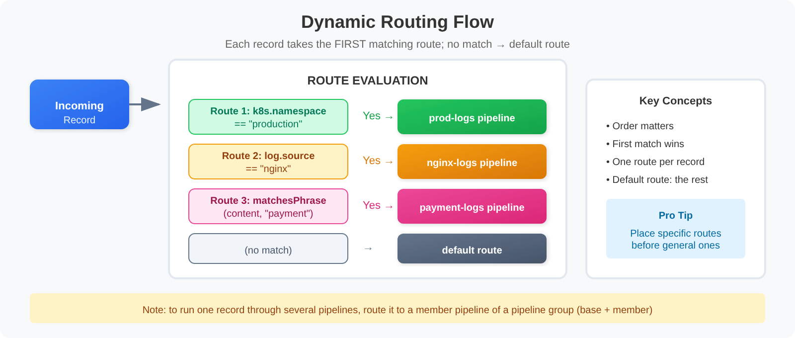

# OPMIG-04: OpenPipeline Migration Guide: Part 4

> **Series:** OPMIG — OpenPipeline Migration | **Notebook:** 4 of 10 | **Created:** December 2025 | **Last Updated:** 10/02/2026

## Pipeline Configuration Fundamentals
---

## Table of Contents

1. [Accessing OpenPipeline Settings - Detailed Guide](#accessing-openpipeline-settings-detailed-guide)
2. [Step-by-Step: Creating Your First Pipeline](#step-by-step-creating-your-first-pipeline)
3. [Complete Pipeline Examples](#complete-pipeline-examples)
4. [Understanding the Interface](#understanding-the-interface)
5. [Creating Your First Pipeline](#creating-your-first-pipeline)
6. [Configuring Processors](#configuring-processors)
7. [Setting Up Dynamic Routing](#setting-up-dynamic-routing)
8. [Testing Your Configuration](#testing-your-configuration)
9. [Configuration Best Practices](#configuration-best-practices)
10. [Verifying Pipeline Processing](#verifying-pipeline-processing)
11. [Complete Pipeline Example](#complete-pipeline-example)

---

## Learning Objectives

By the end of this notebook, you will:

- ✅ Navigate the OpenPipeline UI confidently
- ✅ **Follow step-by-step UI walkthrough**
- ✅ Create custom pipelines from scratch
- ✅ Configure processors with best practices
- ✅ Test configurations with sample data
- ✅ **Build complete end-to-end pipeline examples**
- ✅ **Configure pipelines via API/code**
- ✅ Verify pipeline processing with DQL

---

## Prerequisites

| Requirement | Details |
|-------------|---------|
| **Dynatrace Environment** | Dynatrace SaaS with Grail and OpenPipeline access — Managed is not covered by this series |
| **Permissions** | `settings:read` and `settings:write` (custom pipelines; built-in and ready-made pipelines are view-only with `settings:read`) |
| **API Access** | `logs.read` and `logs.ingest` token scopes |
| **Knowledge** | OPMIG-01 through OPMIG-03; basic understanding of log ingestion |

> <sub>**Sources:** [Processing in OpenPipeline (DT docs)](https://docs.dynatrace.com/docs/platform/openpipeline/concepts/processing) — pipeline *Types* table, *Permissions* row.</sub>

### SaaS 1.337: Certain Configuration API endpoints are deprecated

SaaS 1.337 deprecated certain Configuration API endpoints: *"Many Configuration API endpoints are now covered by the Settings endpoints in the Environment API v2."* The affected endpoints *"remain fully active"* and have no sunset date, but *"these endpoints may be removed in a future release"* — so point new automation at the Settings endpoints rather than the deprecated paths.

> <sub>**Sources:** [What's new in SaaS 1.337 (DT docs)](https://docs.dynatrace.com/docs/whats-new/saas/sprint-337) — *"Affected endpoints remain fully active. While we haven't set a sunset date, these endpoints may be removed in a future release."*</sub>

**Migration impact for OpenPipeline / log-monitoring config:**

| Legacy area | Settings v2 schema | Upgrade status |
|---|---|---|
| Log custom attributes | `builtin:logmonitoring.log-custom-attributes` | **Blocked at upgrade** |
| Log storage configuration | `builtin:logmonitoring.log-storage-settings` | Carries forward |
| Log dpp rules | `builtin:logmonitoring.log-dpp-rules` | **Blocked at upgrade** |
| Log timestamp configuration | `builtin:logmonitoring.timestamp-configuration` | Carries forward |

> **Settings v2 is the right destination for the API move, but not the end of the journey for these four schemas.** The sprint-1.337 guidance above is about *which API surface* to call — and on that axis it stands. On the separate upgrade axis, two of these four schemas are flagged **Blocked at upgrade** (the other two carry forward) by the ready-made *Check your upgrade readiness* dashboard: they stop answering once the tenant moves to the latest Dynatrace. Their real successor is an OpenPipeline processor, which is what the rest of this series builds.
>
> So: if you are moving automation off the Configuration API *today*, Settings v2 is the correct target and this table is the mapping. If you are planning the Gen3 migration, do not stop here — retarget these four onto OpenPipeline rather than rebuilding them as Settings v2 objects you will migrate again. See AUTOM-02's catalog for status and OPMIG §5–§7 for the pipeline equivalents.

If your migration tooling reaches into the Configuration API for any of these, switch to the Settings v2 endpoints in Environment API v2 (see **AUTOM-02 § Sprint 1.337** for general patterns and **AUTOM-04 (Terraform)** for `dynatrace_settings` resource usage).

---

---

<a id="accessing-openpipeline-settings-detailed-guide"></a>
## Accessing OpenPipeline Settings - Detailed Guide
### Navigation Path

**From Dynatrace Home:**
```
1. Click ☰ (hamburger menu) in top-left
2. Scroll to "Manage" section
3. Click "Settings"
4. In left sidebar, expand "Process and contextualize"
5. Click "OpenPipeline"
```

**Direct URL:**
```
https://{your-environment}.apps.dynatrace.com/ui/settings/openpipeline
```

### OpenPipeline UI Overview


<!-- MARKDOWN_TABLE_ALTERNATIVE
| UI Element | Purpose |
|------------|---------|
| Configuration scope dropdown | Select data type (Logs, Spans, Metrics, etc.) |
| Pipelines tab | View/create/edit pipelines |
| Dynamic routing tab | Configure routing rules |
| Ingest sources tab | Monitor data sources |
| + Pipeline button | Create new custom pipeline |
| Pipeline list | All pipelines for selected scope |
-->

### Configuration Scopes

The dropdown at the top lets you switch between data types:

| Scope | Icon | What It Handles |
|-------|------|----------------|
| **Logs** | 📋 | Log records from all sources |
| **Spans** | 🔗 | Distributed trace spans |
| **Metrics** | 📊 | Metric data ingestion |
| **Events** | ⚡ | Platform events |
| **Business Events** | 💼 | Business analytics events |
| **Security Events** | 🔐 | Security data |

> 💡 **Tip:** Each scope has its own separate set of pipelines. Start with **Logs** for your migration.

### Three Main Tabs

#### 1. Pipelines Tab
- View all pipelines for selected scope
- Create new pipelines
- Edit pipeline configuration
- Configure processing, extraction, storage

#### 2. Dynamic Routing Tab
- Create routing rules
- Map data to pipelines
- Set matching conditions
- Control route order

#### 3. Ingest Sources Tab
- View data sources
- See ingestion statistics
- Monitor source health
- Troubleshoot ingestion issues

---

<a id="step-by-step-creating-your-first-pipeline"></a>
## Step-by-Step: Creating Your First Pipeline
Let's walk through creating a complete pipeline for nginx access logs.

### Step 1: Create the Pipeline

**Actions:**
1. Go to OpenPipeline → Logs scope
2. Click **[+ Pipeline]** button (top-left)
3. Enter name: `nginx-access-logs`
4. Add description: `Process nginx access logs with parsing and metric extraction`
5. Click **Create**

**Result:** New empty pipeline appears in list

---

### Step 2: Configure Processing Stage

#### 2a. Add DQL Processor for Parsing

**Actions:**
1. Click on your `nginx-access-logs` pipeline
2. Go to **Processing** tab
3. Click **[+ Processor]** button
4. Select **DQL** from processor types

**Configuration:**
```
Name: Parse nginx access log

Matching condition:
log.source == "nginx" OR matchesPhrase(content, "GET") OR matchesPhrase(content, "POST")

Processor definition:
parse content, "IPADDR:client_ip SPACE '-' SPACE LD:user SPACE '[' LD:log_time ']' SPACE '\"' LD:method SPACE LD:path SPACE LD:protocol '\"' SPACE INT:status_code SPACE INT:bytes"
```

**Test with Sample Data:**
```json
{
  "content": "192.168.1.100 - - [12/Dec/2024:10:30:45 +0000] \"GET /api/users HTTP/1.1\" 200 1234",
  "log.source": "nginx"
}
```

5. Click **[Run sample data]**
6. Verify fields extracted: `client_ip`, `log_time`, `method`, `path`, `status_code`, `bytes` (the bracketed time goes into `log_time`, not `timestamp` — overwriting the record's `timestamp` with a string risks the record failing log schema validation)
7. Click **[Save]**

#### 2b. Add Enrichment Processor

**Actions:**
1. Click **[+ Processor]** again
2. Select **DQL**

**Configuration:**
```
Name: Add environment tags

Matching condition:
(leave empty to apply to all)

Processor definition:
fieldsAdd environment = "production"
| fieldsAdd service_type = "web-server"
| fieldsAdd response_category = if(status_code < 400, "success", 
                                else: if(status_code < 500, "client_error", 
                                else: "server_error"))
```

3. Click **[Save]**

---

### Step 3: Configure Metric Extraction

**Actions:**
1. Go to **Metric extraction** tab
2. Click **[+ Metric]**

**Configuration for Request Count:**
```
Metric type: Counter
Metric key: log.nginx.request_count

Dimensions:
  - method
  - status_code
  - environment

Matching condition:
isNotNull(status_code)
```

3. Click **[Save]**
4. Click **[+ Metric]** again for bytes metric

**Configuration for Response Size:**
```
Metric type: Value
Metric key: log.nginx.response_bytes
Value field: bytes

Dimensions:
  - method
  - path

Matching condition:
isNotNull(bytes)
```

5. Click **[Save]**

---

### Step 4: Configure Storage

**Actions:**
1. Go to the **Bucket assignment** stage
2. Add a **Bucket assignment** processor, give it a name and a matching condition (for example `true`)
3. In the **Storage** list, choose the bucket — for example a custom `web_logs` bucket with 14-day retention
4. Click **[Save]**

> 💡 **Tip:** Bucket assignment is *first match only* — the first processor whose condition matches decides the bucket. In community practice, records that match no bucket-assignment processor land in the scope's default bucket (`default_logs`); confirm where yours land with the bucket query in [Verifying Pipeline Processing](#verifying-pipeline-processing). To keep a record out of storage entirely (for example after extracting a metric), use **No storage assignment** instead.

---

### Step 5: Create Dynamic Routing

**Actions:**
1. Go to **Dynamic routing** tab (top of OpenPipeline page)
2. Click **[+ Dynamic route]**

**Configuration:**
```
Name: Route nginx logs

Matching condition:
log.source == "nginx" OR matchesValue(content, "*nginx*")

Pipeline: nginx-access-logs
```

3. Click **[Save]**

---

### Step 6: Test End-to-End

**Option 1: Send Test Log via API**
```bash
curl -i -X POST \
  "https://{your-environment}.live.dynatrace.com/api/v2/logs/ingest" \
  -H "Content-Type: application/json" \
  -H "Authorization: Api-Token {your-token}" \
  -d '{
    "content": "192.168.1.100 - - [12/Dec/2024:10:30:45 +0000] \"GET /api/users HTTP/1.1\" 200 1234",
    "log.source": "nginx"
  }'
```

**Option 2: Check with Existing Logs**

Wait 2-3 minutes for processing, then run verification query (see next section).

---

### Step 7: Verify Processing

See the validation queries in the next section to confirm:
- Logs are routed to your pipeline ✓
- Fields are parsed correctly ✓
- Metrics are being generated ✓

---

<a id="complete-pipeline-examples"></a>
## Complete Pipeline Examples
### Example 1: Application Logs with Error Tracking

**Use Case:** Java application logs with structured format

#### Pipeline: `java-app-logs`

**Processing Stage:**

**Processor 1: Parse Log Structure**
```dql
parse content, "'[' TIMESTAMP('yyyy-MM-dd HH:mm:ss'):log_time ']' SPACE '[' LD:level ']' SPACE '[' LD:thread ']' SPACE LD:class ' - ' DATA:message"
```

**Processor 2: Extract Request ID**
```dql
parse content, "LD? 'requestId=' NSPACE:request_id"
```

`parse` matches from the **start** of the field. A pattern that opens with `'requestId='` returns null on every line that does not *begin* with that text, and a trailing `LD` runs to the end of the line. `LD?` skips any prefix (or none); `NSPACE` stops at the next space.

**Processor 3: Classify Errors**
```dql
fieldsAdd error_type = if(contains(message, "NullPointerException"), "NPE",
                       else: if(contains(message, "SQLException"), "DB",
                       else: if(contains(message, "TimeoutException"), "Timeout",
                       else: "Other")))
| fieldsAdd severity = if(level == "ERROR", "critical",
                       else: if(level == "WARN", "warning",
                       else: "info"))
```

**Metric Extraction:**
- **Counter:** `log.java.error_count` (dimensions: error_type, class)
- **Counter:** `log.java.request_count` (dimensions: level, thread)

**Event Extraction:**
Davis stage → **Davis event** processor:
- **Event name:** `Error in {class}: {error_type}`
- **Event properties:** `event.type = CUSTOM_ALERT` (`event.type` is required)
- **Matching:** `level == "ERROR"`

**Storage:** `default_logs` (35 days)

---

### Example 2: Payment Service with PCI-DSS Compliance

**Use Case:** Financial logs requiring credit card masking

#### Pipeline: `payment-service-secure`

**Processing Stage (in order):**

**Processor 1: Mask Credit Cards (FIRST!)**
```dql
fieldsAdd content = replacePattern(content, "CREDITCARD", replacement: "[CC_REDACTED]")
```

**Processor 2: Mask CVV**
```dql
fieldsAdd content = replacePattern(content, "('cvv='|'cvc=') [0-9]{3,4}", replacement: "cvv=[REDACTED]")
```

**Processor 3: Parse Payment Data**
```dql
parse content, "LD? 'orderId=' INT:order_id"
| parse content, "LD? 'amount=' DOUBLE:amount"
| parse content, "LD? 'currency=' NSPACE:currency"
| parse content, "LD? 'status=' NSPACE:payment_status"
```

**Processor 4: Add Tags**
```dql
fieldsAdd service = "payment"
| fieldsAdd compliance = "pci-dss"
| fieldsAdd audit_required = true
```

**Metric Extraction:**
- **Value:** `log.payment.amount` (value: amount, dimensions: currency, payment_status)
- **Counter:** `log.payment.transaction_count` (dimensions: payment_status, currency)

**Business Event Extraction:**
- **Type:** `com.company.payment.processed`
- **Provider:** `payment-service`
- **Fields:** order_id, amount, currency, payment_status

**Storage:** `financial_logs` (90 days - compliance requirement)

---

### Example 3: Kubernetes Logs with Pod Context

**Use Case:** Container logs with K8s metadata

#### Pipeline: `kubernetes-app-logs`

**Processing Stage:**

**Processor 1: Drop System Logs**
```text
Processor type: Drop record
Matching condition: k8s.namespace.name == "kube-system" AND loglevel == "DEBUG"
```

**Processor 2: Parse JSON Logs**
```dql
parse content, "JSON:json_payload"
```

**Processor 3: Enrich with K8s Context**
```dql
fieldsAdd app = k8s.deployment.name
| fieldsAdd namespace = k8s.namespace.name
| fieldsAdd pod_name = k8s.pod.name
| fieldsAdd container = k8s.container.name
```

**Metric Extraction:**
- **Counter:** `log.k8s.pod_log_count` (dimensions: namespace, app, loglevel)

**Storage:** Route based on namespace:
- production namespace → `prod_logs` (35 days)
- staging namespace → `staging_logs` (14 days)
- dev namespace → `dev_logs` (7 days)

---

---

<a id="understanding-the-interface"></a>
## Understanding the Interface
### Pipeline Configuration Tabs

Each pipeline has these configuration sections:

| Stage | Purpose | Processors |
|-------|---------|------------|
| **Processing** | Transform, mask, drop and enrich records | DQL, Add/Remove/Rename fields, Drop record, Technology bundle, Inline lookup |
| **Smartscape node / edge** | Create topology from records | Smartscape node, Smartscape edge |
| **Permission** | Set `dt.security_context` | Set security context (first match only) |
| **Product / Cost allocation** | DPS cost allocation | First match only |
| **Bucket assignment** | Choose the Grail bucket | Bucket assignment, No storage assignment (first match only) |
| **Metric extraction** | Create metrics from records | Counter, Value, Histogram metric |
| **Davis** | Raise Davis events | Davis event |
| **Data extraction** | Create new records | Business event, SDLC event |

The stage order is fixed; only the processor order *within* a stage is yours (see OPMIG-02 § Understanding Processing Order).

> <sub>**Sources:** [Processing in OpenPipeline (DT docs)](https://docs.dynatrace.com/docs/platform/openpipeline/concepts/processing) — stage and processor table.</sub>

> **Two additions in SaaS 1.345 (August 2026 — staged tenant rollout).** The **Inline lookup** processor maps an attribute to a new value from a lookup table defined inside the processor, with no external system — useful for error-code descriptions, app-ID-to-cost-centre mapping, and deriving `dt.security_context`. Separately, any field named with the **`dt.temp`** prefix is available throughout processing but is **not persisted to Grail**, so intermediate values feeding metric/event/bizevent extraction no longer have to be stored on the record. Both apply across every scope with a Processing stage. Verify each has reached your tenant before designing against it.

### Processor Configuration Panel

When adding a processor, you configure:

1. **Name**: Descriptive name for the processor
2. **Matching condition**: When this processor runs
3. **Processor definition**: What the processor does
4. **Sample data**: Test data to validate


<!-- MARKDOWN_TABLE_ALTERNATIVE
| Field | Purpose | Example |
|-------|---------|---------|
| Name | Identify the processor | "Parse nginx access log" |
| Matching condition | When to apply | `log.source == "nginx"` |
| Processor definition | DQL/DPL code | `parse content, "IPADDR:client_ip ..."` |
| Sample data | Test input | `{"content": "192.168.1.1 - - ..."}` |
| Run sample data | Execute test | Validate parsing |
-->

---

<a id="creating-your-first-pipeline"></a>
## Creating Your First Pipeline
### Step-by-Step: Create a Log Processing Pipeline

**Example**: Create a pipeline for nginx access logs

#### Step 1: Navigate to OpenPipeline
```
Settings → Process and contextualize → OpenPipeline → Logs
```

#### Step 2: Create Pipeline
1. Click **+ Pipeline**
2. Enter name: `nginx-access-logs`
3. Click **Create**

#### Step 3: Add Processing (Parsing)
1. Go to **Processing** tab
2. Click **+ Processor** → **DQL**
3. Configure:
   - **Name**: `Parse nginx access log`
   - **Matching condition**: `matchesValue(content, "*HTTP*")`
   - **Processor definition**:
   ```
   parse content, "IPADDR:client_ip SPACE '-' SPACE LD:user SPACE '[' LD:log_time ']' SPACE '\"' LD:method SPACE LD:path SPACE LD:protocol '\"' SPACE INT:status_code SPACE INT:bytes"
   ```

#### Step 4: Test with Sample Data
1. Enter sample log:
   ```json
   {"content": "192.168.1.100 - - [12/Dec/2024:10:30:45 +0000] \"GET /api/users HTTP/1.1\" 200 1234"}
   ```
2. Click **Run sample data**
3. Verify extracted fields

#### Step 5: Save Pipeline
Click **Save** to store the configuration.

---

<a id="configuring-processors"></a>
## Configuring Processors
### DQL Processor Examples

The DQL processor is the most flexible. Here are common patterns:

#### Add Static Fields
```
fieldsAdd environment = "production"
| fieldsAdd application = "web-frontend"
```

#### Add Conditional Fields
```
fieldsAdd severity = if(loglevel == "ERROR", "critical", 
                     else: if(loglevel == "WARN", "warning", 
                     else: "normal"))
```

#### Parse with DPL Pattern
```
parse content, "LD? 'userId=' LD:user_id ','"
```

Start the pattern with `LD?` unless the field always begins with your literal — `parse` anchors at the start of the field and returns null otherwise.

#### Remove Sensitive Fields
```
fieldsRemove password, secret_key, api_token
```

#### Rename Fields for Standardization
```
fieldsRename old_field_name = standardized_name
```

### Drop Processor Examples

Drop processors remove records matching conditions:

| Matching Condition | Effect |
|---------------------|--------|
| `loglevel == "DEBUG"` | Drop all debug logs |
| `matchesValue(content, "*healthz*")` | Drop health check logs |
| `matchesValue(content, "*/metrics*")` | Drop Prometheus scrapes |
| `status == "TRACE"` | Drop trace-level logs |

> Matchers accept `matchesValue` (with `*` wildcards, any substring) and `matchesPhrase` (whole tokens); `contains()` is not enabled in a matching condition.

### Technology Bundle Processor

For common formats, add a **Technology bundle** processor instead of writing the pattern yourself. It *"matches records for the selected technology and processes them according to predefined context-sensitive processing statements."* The fields each bundle adds are defined by the bundle — run its preview on a sample record before you depend on them downstream.

> <sub>**Sources:** [Processing in OpenPipeline (DT docs)](https://docs.dynatrace.com/docs/platform/openpipeline/concepts/processing) — processor table, *Technology bundle*.</sub>

---

<a id="setting-up-dynamic-routing"></a>
## Setting Up Dynamic Routing
Dynamic routing sends data to specific pipelines based on matching conditions.

### Routing Configuration Steps

1. Go to **Dynamic routing** tab
2. Click **+ Dynamic route**
3. Configure:
   - **Name**: Descriptive route name
   - **Matching condition**: When to use this route
   - **Pipeline**: Target pipeline

### Matching Condition Examples

| Condition | Routes To |
|-----------|----------|
| `log.source == "nginx"` | nginx-logs pipeline |
| `k8s.namespace.name == "production"` | prod-logs pipeline |
| `matchesPhrase(content, "payment")` | payment-logs pipeline |
| `dt.openpipeline.source == "/api/v2/logs/ingest"` | api-ingested pipeline |
| `host.name == "web-server-01"` | specific host pipeline |

### Route Evaluation Order



<!-- MARKDOWN_TABLE_ALTERNATIVE
| Step | Condition | Result |
|------|-----------|--------|
| 1 | Route 1 matches? | → Pipeline A (if yes) |
| 2 | Route 2 matches? | → Pipeline B (if yes) |
| 3 | No match | → Default Pipeline |

Key: Routes are evaluated in order. First match wins.
-->

> 💡 **Tip:** Routes are evaluated in order. Place more specific routes first, general routes last.

---

<a id="testing-your-configuration"></a>
## Testing Your Configuration
### Using Sample Data in UI

Every processor supports sample data testing:

1. Enter JSON sample in **Sample data** field
2. Click **Run sample data**
3. Review output in preview panel
4. Adjust processor definition as needed

### Sample Data Format

```json
{
  "content": "Your log message here",
  "log.source": "your-source",
  "timestamp": "2024-12-12T10:30:00Z",
  "k8s.namespace.name": "production"
}
```

### Testing via API

Send test logs to validate end-to-end:

```bash
curl -i -X POST \
  "https://{your-environment}.live.dynatrace.com/api/v2/logs/ingest" \
  -H "Content-Type: application/json" \
  -H "Authorization: Api-Token {your-token}" \
  -d '{"content":"Test log message","log.source":"test-source"}'
```

Response `204` indicates successful ingestion.

---

<a id="configuration-best-practices"></a>
## Configuration Best Practices
### Pipeline Design Principles

| Principle | Recommendation |
|-----------|----------------|
| **Single Purpose** | One pipeline per use case (not one mega-pipeline) |
| **Specific Routing** | Use precise matching conditions |
| **Security First** | Add masking processors early in the chain |
| **Drop Early** | Remove unwanted data before processing |
| **Test Thoroughly** | Validate every processor with sample data |

### Processor Ordering

Within the **Processing stage**, order processors logically:

```text
1. Masking      → Protect sensitive data first
2. Drop         → Remove unwanted records
3. Parse        → Extract structured fields
4. Enrich       → Add context fields
5. Transform    → Compute derived values
```

Everything else — Smartscape, permission, cost allocation, bucket assignment, and metric/event extraction — runs in later stages whose order is fixed by the platform (see OPMIG-02 § Understanding Processing Order).

### Naming Conventions

| Type | Convention | Example |
|------|------------|----------|
| Pipeline | `{source}-{purpose}` | `nginx-access-logs` |
| Processor | `{action}-{target}` | `parse-request-line` |
| Route | `route-to-{pipeline}` | `route-to-nginx-logs` |

### Common Mistakes to Avoid

| Mistake | Problem | Solution |
|---------|---------|----------|
| Overly broad routing | Too many logs hit pipeline | Use specific conditions |
| No masking | Sensitive data stored | Add masking before processing |
| Complex conditions | Hard to maintain | Break into multiple pipelines |
| Untested patterns | Parsing fails on real data | Always test with samples |
| Assuming unmatched data is lost | It is not — the default route still stores it, unprocessed (classic pipeline for logs and business events) | Watch default-route volume with the query below and add routes for what lands there |

---

<a id="verifying-pipeline-processing"></a>
## Verifying Pipeline Processing
After configuring pipelines, verify they're working correctly with these queries.

```dql
// Verify logs are being processed by your new pipeline
// Replace 'your-pipeline-name' with your actual pipeline name
fetch logs, from: now() - 1h
| filter contains(toString(dt.openpipeline.pipelines), "your-pipeline-name")
| summarize {processed_count = count()}
| fieldsAdd status = if(processed_count > 0, "✅ Pipeline is processing logs", else: "⚠️ No logs processed yet")
```

```dql
// Check routing distribution across all pipelines
fetch logs, from: now() - 1h
| summarize {record_count = count()}, by: {dt.openpipeline.pipelines}
| sort record_count desc
```

```dql
// Verify parsing is extracting expected fields
// Check for a specific field that should be parsed
fetch logs, from: now() - 1h
| filter isNotNull(dt.openpipeline.pipelines)
| summarize {
    total = count(),
    with_loglevel = countIf(isNotNull(loglevel)),
    with_status = countIf(isNotNull(status))
  }, by: {dt.openpipeline.pipelines}
| fieldsAdd parsing_rate = round((toDouble(with_loglevel) / toDouble(total)) * 100, decimals: 1)
```

```dql
// Sample recent logs from your pipeline to inspect parsed fields
fetch logs, from: now() - 1h
| filter contains(toString(dt.openpipeline.pipelines), "your-pipeline-name")
| limit 10
```

```dql
// Check logs taking the default route (may need routing)
// For logs, the default route is the classic pipeline: pipeline id "logs:default".
// dt.openpipeline.pipelines is an array, so use in(), never ==.
fetch logs, from: now() - 1h
| filter in(dt.openpipeline.pipelines, "logs:default")
| summarize {unrouted = count()}, by: {log.source}
| sort unrouted desc
| limit 20
```

```dql
// Monitor pipeline processing over time
fetch logs, from: now() - 24h
| filter isNotNull(dt.openpipeline.pipelines)
| makeTimeseries {record_count = count()}, by: {dt.openpipeline.pipelines}, interval: 1h
```

```dql
// Verify bucket routing is working
fetch logs, from: now() - 1h
| filter isNotNull(dt.openpipeline.pipelines)
| summarize {record_count = count()}, by: {dt.openpipeline.pipelines, dt.system.bucket}
| sort record_count desc
```

---

<a id="complete-pipeline-example"></a>
## Complete Pipeline Example
Here's a complete example of a production pipeline configuration:

### Pipeline: `payment-service-logs`

**Routing Condition:**
```
k8s.namespace.name == "payments" OR log.source == "payment-service"
```

**Processors (in order):**

1. **Mask Credit Cards** (Masking)
   - Matching: `matchesPhrase(content, "card")`
   - Definition: `fieldsAdd content = replacePattern(content, "CREDITCARD", replacement: "****-****-****-****")` — `replacePattern` takes a DPL pattern, not a regular expression

2. **Drop Health Checks** (Drop)
   - Matching: `matchesValue(content, "*/health*") OR matchesValue(content, "*/ready*")`

3. **Parse Payment Logs** (DQL)
   - Matching: `matchesValue(content, "*transaction*")`
   - Definition: `parse content, "LD? 'transaction_id=' LD:transaction_id ',' SPACE? 'amount=' DOUBLE:amount ',' SPACE? 'status=' NSPACE:payment_status"`

4. **Add Environment Tag** (DQL)
   - Matching: (none - applies to all)
   - Definition: `fieldsAdd service = "payment-service", criticality = "high"`

**Metric Extraction:**
- Name: `payment_amount_by_status`
- Field: `amount`
- Dimensions: `payment_status`

**Storage:**
- Bucket: `financial_logs` (90-day retention)

---

## Next Steps

Now that you can create and configure pipelines, continue with:

| Notebook | Focus Area |
|----------|------------|
| **OPMIG-05** | Routing & Bucket Management |
| **OPMIG-06** | Processing, Parsing & Transformation |
| **OPMIG-07** | Metric & Event Extraction |
| **OPMIG-08** | Security, Masking & Compliance |

---

## References

- [Configure Processing Pipeline](https://docs.dynatrace.com/docs/platform/openpipeline/get-started/tutorial-configure-processing)
- [Processing Examples](https://docs.dynatrace.com/docs/platform/openpipeline/use-cases/processing-examples)
- [DQL Functions in OpenPipeline](https://docs.dynatrace.com/docs/platform/openpipeline/reference/dql/openpipeline-dql-functions)
- [Dynatrace Pattern Language](https://docs.dynatrace.com/docs/platform/grail/dynatrace-pattern-language)

---

<sub>*This notebook was AI-generated from community-submitted and publicly available sources. This notebook series is not officially supported by Dynatrace. Always verify information against official Dynatrace documentation.*</sub>
