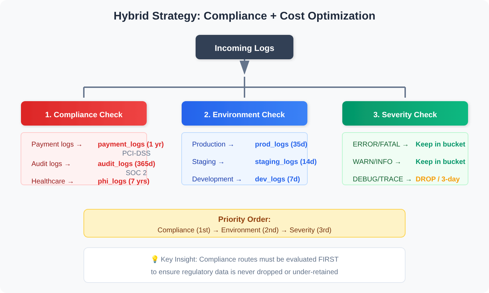
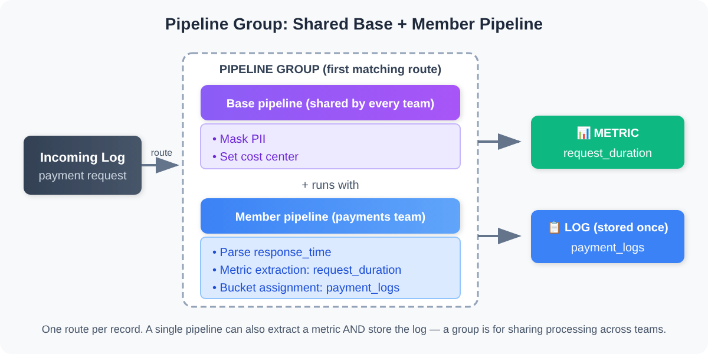

# OPMIG-05: Dynamic Routing & Bucket Management

> **Series:** OPMIG — OpenPipeline Migration | **Notebook:** 5 of 10 | **Created:** December 2025 | **Last Updated:** 10/02/2026

---

## Table of Contents

1. [Understanding Dynamic Routing](#understanding-dynamic-routing)
2. [Routing Strategies](#routing-strategies)
3. [Grail Buckets Explained](#grail-buckets-explained)
4. [Bucket Routing Configuration](#bucket-routing-configuration)
5. [Cost Optimization Patterns](#cost-optimization-patterns)
6. [Cost Optimization ROI Calculator ⭐ NEW](#cost-optimization-roi-calculator-new)
7. [Analyzing Your Bucket Usage](#analyzing-your-bucket-usage)
8. [Multi-Tier Bucket Strategies ⭐ NEW](#multi-tier-bucket-strategies-new)
9. [Multi-Pipeline Processing](#multi-pipeline-processing)
10. [Bucket Governance & Access Control ⭐ NEW](#bucket-governance-access-control-new)
11. [Best Practices](#best-practices)
12. [Routing Configuration Examples](#routing-configuration-examples)

---

## Learning Objectives

By completing this notebook, you will:

1. Master dynamic routing strategies for different migration scenarios
2. Design multi-tier bucket architectures for cost optimization
3. ⭐ **NEW:** Calculate ROI and TCO for bucket optimization strategies
4. ⭐ **NEW:** Implement 3-tier and 5-tier bucket governance models
5. ⭐ **NEW:** Apply compliance-driven retention strategies
6. Configure multi-pipeline processing patterns
7. Analyze bucket usage and identify optimization opportunities

---

## Prerequisites

| Requirement | Details |
|-------------|---------|
| **Dynatrace Environment** | Dynatrace SaaS with Grail and OpenPipeline access — Managed is not covered by this series |
| **Permissions** | `settings:read`, `settings:write` (OpenPipeline configuration), `storage:buckets:read` |
| **API Access** | `logs.read` token scope |
| **Knowledge** | OPMIG-01 through OPMIG-04; understanding of pipeline configuration |

---

<a id="understanding-dynamic-routing"></a>
## Understanding Dynamic Routing
Dynamic routing is the mechanism that directs incoming data to specific pipelines based on matching conditions.

### How Routing Works


<!--MARKDOWN_TABLE_ALTERNATIVE
| Route | Condition | Target Pipeline |
|-------|-----------|-----------------|
| Route 1 | k8s.namespace.name == "production" | prod-logs |
| Route 2 | log.source == "nginx" | nginx-logs |
| Route 3 | matchesPhrase(content, "payment") | payment-logs |
| Default route | (no match) | classic pipeline (logs, business events) / default pipeline |
-->

### Key Routing Concepts

| Concept | Description |
|---------|-------------|
| **Matching Condition** | DQL expression that evaluates to true/false |
| **Route Priority** | Routes are evaluated in order (top to bottom) — the **first matching route wins** |
| **One route per record** | A record that matches several routes still goes to only the first one |
| **Default route** | Catches all records not matching any route — for logs and business events, the classic pipeline |
| **More than one pipeline** | Route to a member pipeline of a **pipeline group**; the group's base pipelines run with it |

> <sub>**Sources:** [Data flow in OpenPipeline (DT docs)](https://docs.dynatrace.com/docs/platform/openpipeline/concepts/data-flow) — *"The route order is relevant—the position in the list establishes the order of execution."*; [Pipeline groups — multi-cloud ingest governance (DT docs)](https://docs.dynatrace.com/docs/platform/openpipeline/use-cases/pipeline-groups-multicloud) — *"Each record is routed to and processed by only one member pipeline, according to the first matching route."*</sub>

---

<a id="routing-strategies"></a>
## Routing Strategies
### Strategy 1: Source-Based Routing

Route based on data source or ingestion method:

| Condition | Target Pipeline | Use Case |
|-----------|-----------------|----------|
| `log.source == "nginx"` | nginx-logs | Web server logs |
| `log.source == "application"` | app-logs | Application logs |
| `dt.openpipeline.source == "/api/v2/otlp/v1/logs"` | otel-logs | OpenTelemetry (OTLP logs) |
| `dt.openpipeline.source == "/api/v2/logs/ingest"` | api-logs | API ingestion |

> For built-in API sources, `dt.openpipeline.source` holds the endpoint **path** (`oneagent` for OneAgent). Run OPMIG-02's *View data sources* query to see the values in your tenant before routing on this field.

### Strategy 2: Environment-Based Routing

Route based on environment or namespace:

| Condition | Target Pipeline | Bucket |
|-----------|-----------------|--------|
| `k8s.namespace.name == "production"` | prod-logs | default_logs (35d) |
| `k8s.namespace.name == "staging"` | staging-logs | dev_logs (7d) |
| `k8s.namespace.name == "development"` | dev-logs | dev_logs (7d) |

### Strategy 3: Content-Based Routing

Route based on log content patterns:

| Condition | Target Pipeline | Purpose |
|-----------|-----------------|----------|
| `matchesPhrase(content, "payment")` | payment-logs | Financial logs |
| `matchesPhrase(content, "security")` | security-logs | Security events |
| `matchesPhrase(content, "audit")` | audit-logs | Compliance logs |

> Routing matchers accept `matchesPhrase` (whole tokens or phrases) and `matchesValue` with `*` wildcards (any substring); `contains()` is not enabled in matchers.

### Strategy 4: Severity-Based Routing

Route based on log level for tiered retention:

| Condition | Target Pipeline | Bucket |
|-----------|-----------------|--------|
| `loglevel == "ERROR"` | error-logs | error_logs (90d) |
| `loglevel == "WARN"` | warning-logs | default_logs (35d) |
| `loglevel == "DEBUG"` | debug-logs | short_retention (3d) |

### Strategy 5: Hybrid Routing

Combine multiple criteria for precise routing:

```
k8s.namespace.name == "production" AND log.source == "payment-service"
```

---

<a id="grail-buckets-explained"></a>
## Grail Buckets Explained
Grail buckets are storage containers with configurable retention and access policies.

### Default Buckets

| Bucket | Data Type | Default Retention |
|--------|-----------|-------------------|
| `default_logs` | Log records | 35 days |
| `default_spans` | Span/trace data | 10 days |
| `default_bizevents` | Business events | 35 days |
| `default_events` | Platform events | 35 days |

Run `fetch dt.system.buckets | filter startsWith(name, "default_")` to see the built-in buckets and retention in your own tenant.

> <sub>**Sources:** [Organize data (DT docs)](https://docs.dynatrace.com/docs/platform/grail/organize-data) — built-in bucket table: `default_logs` 35 days, `default_spans` 10 days, `default_bizevents` 35 days, `default_events` 35 days.</sub>

### Custom Bucket Use Cases

| Use Case | Bucket Strategy | Retention |
|----------|-----------------|----------|
| **Compliance/Audit** | `audit_logs` | 365+ days |
| **Financial Data** | `financial_logs` | 90 days |
| **Security Events** | `security_logs` | 180 days |
| **Development Logs** | `dev_logs` | 7 days |
| **Debug/Trace** | `debug_logs` | 3 days |
| **High-Volume Noise** | `ephemeral_logs` | 1 day |

### Bucket Benefits

1. **Cost Optimization**: Shorter retention = lower storage costs
2. **Compliance**: Longer retention for audit requirements
3. **Performance**: Smaller buckets = faster queries
4. **Access Control**: Bucket-level permissions
5. **Data Isolation**: Separate buckets for different teams/purposes

---

<a id="bucket-routing-configuration"></a>
## Bucket Routing Configuration
### Configuring Bucket Routing in Pipeline

Each pipeline can route data to a specific bucket:

1. Open your pipeline in OpenPipeline settings
2. Go to the **Bucket assignment** stage and add a **Bucket assignment** processor
3. Give it a matching condition and choose the bucket from the **Storage** list
4. Save pipeline

### Bucket Routing Rules

| Rule | Behavior |
|------|----------|
| **First match only** | The first Bucket assignment processor whose condition matches decides the bucket |
| **No storage assignment** | The record runs through every later stage (metric, Davis, data extraction) and is then not stored |
| **No processor matched** | In community practice the record lands in the scope's default bucket (`default_logs`) — confirm with the bucket queries below |

> ⚠️ **Important:** A record is stored at most **once**, in one bucket. Bucket assignment is first-match-only, so order the processors from most specific to least specific.

### Creating Custom Buckets

Custom buckets are created via Grail settings:

```
Settings → Storage management → Bucket storage management → Bucket
```

Configure:
- **Name**: Descriptive bucket name
- **Table**: Data type (logs, spans, etc.)
- **Retention**: Days to retain data
- **Description**: Purpose of bucket

---

<a id="cost-optimization-patterns"></a>
## Cost Optimization Patterns
### Pattern 1: Tiered Retention by Severity


<!--MARKDOWN_TABLE_ALTERNATIVE
| Tier | Bucket | Retention | Volume | Impact |
|------|--------|-----------|--------|--------|
| Critical | error_logs | 90 days | ~5% | Higher cost, critical data |
| Standard | default_logs | 35 days | ~60% | Standard retention |
| Development | dev_logs | 7 days | ~35% | Short retention |
| Drop | none | 0 days | dropped | Zero cost |
-->

### Pattern 2: Environment-Based Retention

| Environment | Bucket | Retention | Cost Impact |
|-------------|--------|-----------|-------------|
| Production | `prod_logs` | 35 days | Standard |
| Staging | `staging_logs` | 14 days | -60% |
| Development | `dev_logs` | 7 days | -80% |
| Ephemeral/Test | `temp_logs` | 3 days | -90% |

### Pattern 3: Drop + Sample

For extremely high-volume, low-value logs:

1. Drop 90% of health checks
2. Sample 10% to a short-retention bucket
3. Keep statistical visibility without full storage cost

### Pattern 4: Metric Extraction + No Storage

For logs needed only for metrics:

1. Extract metrics (with dimensions) from logs in the **Metric extraction** stage
2. Assign the raw logs **No storage assignment** (Bucket assignment stage) so each record still runs through Metric extraction but is not stored
3. The metrics are kept for the metrics bucket's retention (`default_metrics`: 15 months); the raw logs are never written to a bucket

Do not use a **Drop record** processor for this — it runs in the Processing stage, before Metric extraction, so nothing would be extracted.

> <sub>**Sources:** [Processing in OpenPipeline (DT docs)](https://docs.dynatrace.com/docs/platform/openpipeline/concepts/processing) — Drop record: *"Drops a record. The record isn't processed further and isn't stored."*; No storage assignment: *"The record continues through all configured pipeline stages and isn't stored only at the end of the pipeline."*</sub>

---

<a id="cost-optimization-roi-calculator-new"></a>
## Cost Optimization ROI Calculator ⭐ NEW
Understanding the financial impact of bucket strategies is critical for migration planning. This section shows how to estimate the effect of a bucket strategy — the **arithmetic**, not a price list.

> ⚠️ **Placeholder rates — not Dynatrace prices.** Every rate below (the per-MB DDU rates and the $0.08 per DDU) is an illustrative input chosen to show the arithmetic. No Dynatrace page publishes these figures. Replace each one with the rates from your own contract before using any result. On a **Dynatrace Platform Subscription (DPS)**, log costs are billed per capability (Ingest & Process, Retain, Query) — see FINOPS-01 and your rate card. The relative result — storage cost scales with volume × retention days — holds whatever the rates are; the query below (*Estimate storage reduction from tiered retention*) computes it from your own data.

### Pricing Model (placeholder inputs)

> **Note:** DPS is the **Dynatrace Platform Subscription**. DDUs (**Davis data units**) are the classic-licensing unit for custom metrics, Log Monitoring and custom events. Check your license model to determine which applies.

Placeholder inputs used in the scenarios below:

| Component | Placeholder rate |
|-----------|----------------|
| **Log Ingestion** | 0.001 DDU per MB ingested |
| **Storage (per day)** | 0.0001 DDU per MB per day retained |
| **DQL Query** | 0.001 DDU per MB scanned |

**Placeholder DDU price:** $0.08 per DDU

### Cost Formula

```text
Monthly Cost = (Ingestion Cost) + (Storage Cost) + (Query Cost)

Where:
  Ingestion Cost = Volume (MB/day) × 30 days × Ingest rate × Price/DDU
  Storage Cost   = Volume (MB/day) × Retention (days) × Storage rate (per MB per day) × 30 days × Price/DDU
                   (steady state: Volume × Retention MB are held at any time, charged every day)
  Query Cost     = Query Volume (MB/month) × Query rate × Price/DDU
```

### Scenario 1: E-Commerce Platform - Tiered Retention

**Current State (No Optimization):**
```text
Volume:          100 GB/day (100,000 MB/day)
Breakdown:       - ERROR:  5% (5,000 MB/day)
                 - WARN:  10% (10,000 MB/day)
                 - INFO:  50% (50,000 MB/day)
                 - DEBUG: 35% (35,000 MB/day)
Retention:       35 days (default_logs)
DDU Price:       $0.08 per DDU (placeholder)
```

**Current Monthly Cost:**
```text
Ingestion:  100,000 MB/day × 30 days × 0.001 × $0.08 = $240/month
Storage:    100,000 MB/day × 35 days × 0.0001 × 30 days × $0.08 = $840/month
Query:      Estimate ~20% of monthly volume queried
            (100,000 × 30 × 0.2) × 0.001 × $0.08 = $48/month

TOTAL:      $1,128/month
```

**Optimized State (3-Tier + Drop):**
```text
Tier 1 (ERROR):     5,000 MB/day → error_logs (90 days)
Tier 2 (WARN/INFO): 60,000 MB/day → default_logs (35 days)
Tier 3 (DEBUG):     35,000 MB/day → DROPPED (0 days)
```

**Optimized Monthly Cost:**
```text
Ingestion (only non-dropped — assumes dropped records carry no ingest charge; check your rate card):
  65,000 MB/day × 30 days × 0.001 × $0.08 = $156/month

Storage:
  Tier 1: 5,000 × 90 × 0.0001 × 30 × $0.08 = $108/month
  Tier 2: 60,000 × 35 × 0.0001 × 30 × $0.08 = $504/month
  Total storage = $612/month

Query (20% of monthly volume):
  (5,000 × 30 × 0.2 + 60,000 × 30 × 0.2) × 0.001 × $0.08 = $31.20/month

TOTAL:      $799.20/month
```

**ROI Analysis:**
```text
Monthly Savings:     $1,128 - $799.20 = $328.80/month
Annual Savings:      $328.80 × 12 = $3,945.60/year
Savings Percentage:  29.1%
Implementation Time: 4-8 hours
Payback Period:      Immediate (operational change only)
```

### Scenario 2: SaaS Platform - Multi-Environment

Storage cost only, same placeholder rates:

**Current State:**
```text
Production:   50 GB/day × 35 days = $420/month
Staging:      30 GB/day × 35 days = $252/month
Development:  20 GB/day × 35 days = $168/month
TOTAL:        $840/month
```

**Optimized State:**
```text
Production:   50 GB/day × 35 days = $420/month (no change)
Staging:      30 GB/day × 14 days = $100.80/month (60% reduction)
Development:  20 GB/day × 7 days  = $33.60/month (80% reduction)
TOTAL:        $554.40/month
```

**ROI Analysis:**
```text
Monthly Savings:     $285.60/month
Annual Savings:      $3,427.20/year
Savings Percentage:  34%
```

### Scenario 3: Global Retailer - Compliance + Cost

**Requirements:**
- Payment logs: PCI DSS Requirement 10.5.1 — at least 12 months of audit log history, the most recent three months immediately available
- Audit logs: 365 days — SOC 2 sets no fixed period; a year matching the audit window is common practice
- Application logs: 35 days standard
- Debug logs: Drop immediately

**Volume Breakdown:**
```text
Payment logs:  10 GB/day (10% of total)
Audit logs:    5 GB/day  (5% of total)
App logs:      60 GB/day (60% of total)
Debug logs:    25 GB/day (25% of total)
TOTAL:         100 GB/day
```

**Cost Calculation:**
```text
Payment (365d): 10,000 × 365 × 0.0001 × 30 × $0.08 = $876/month
Audit (365d):   5,000 × 365 × 0.0001 × 30 × $0.08 = $438/month
App (35d):      60,000 × 35 × 0.0001 × 30 × $0.08 = $504/month
Debug (drop):   $0/month
Ingestion:      75,000 × 30 × 0.001 × $0.08 = $180/month

TOTAL:          $1,998/month
```

**vs. No Optimization (all 35 days):**
```text
Storage:   100,000 × 35 × 0.0001 × 30 × $0.08 = $840/month
Ingestion: 100,000 × 30 × 0.001 × $0.08       = $240/month
TOTAL:     $1,080/month (but non-compliant!)
```

**Key Insight:** Sometimes optimization increases cost but ensures compliance. The cost of non-compliance (fines, audits) far exceeds storage costs.

> <sub>**Sources:** [Record deletion in Grail via API (DT docs)](https://docs.dynatrace.com/docs/platform/grail/organize-data/record-deletion-in-grail) — DPS expansion, *"This must be enabled as a capability in your Dynatrace Platform Subscription (DPS)."*; [Davis data units (DT docs)](https://docs.dynatrace.com/docs/license/classic-licensing/davis-data-units) — *"Davis data units (DDU) provide a simple means of licensing certain capabilities (custom metrics, log monitoring, and custom events) on the Dynatrace platform."*</sub>

---

---

<a id="analyzing-your-bucket-usage"></a>
## Analyzing Your Bucket Usage
Use these queries to understand your current bucket utilization and plan optimization.

```dql
// Current bucket distribution for logs
// Shows where your logs are being stored
fetch logs, from: now() - 7d
| summarize {record_count = count()}, by: {dt.system.bucket}
| fieldsAdd daily_avg = round(record_count / 7, decimals: 0)
| sort record_count desc
```

```dql
// Bucket usage by log source
// Identify which sources are consuming bucket capacity
fetch logs, from: now() - 7d
| summarize {record_count = count()}, by: {dt.system.bucket, log.source}
| sort record_count desc
| limit 30
```

```dql
// Bucket usage by pipeline
// Shows which pipelines are routing to which buckets
fetch logs, from: now() - 7d
| filter isNotNull(dt.openpipeline.pipelines)
| summarize {record_count = count()}, by: {dt.openpipeline.pipelines, dt.system.bucket}
| sort record_count desc
```

```dql
// Bucket usage trend over time
fetch logs, from: now() - 7d
| makeTimeseries {record_count = count()}, by: {dt.system.bucket}, interval: 24h
```

```dql
// Identify logs that could move to shorter retention buckets
// Debug and trace logs are prime candidates
fetch logs, from: now() - 7d
| filter dt.system.bucket == "default_logs"
| summarize {
    total = count(),
    debug = countIf(loglevel == "DEBUG" OR status == "DEBUG"),
    trace = countIf(loglevel == "TRACE" OR status == "TRACE"),
    info = countIf(loglevel == "INFO" OR status == "INFO")
  }
| fieldsAdd debug_pct = round((toDouble(debug) / toDouble(total)) * 100, decimals: 2)
| fieldsAdd trace_pct = round((toDouble(trace) / toDouble(total)) * 100, decimals: 2)
| fieldsAdd optimization_potential = round((toDouble(debug + trace) / toDouble(total)) * 100, decimals: 2)
```

```dql
// Check span bucket distribution
// Spans also use buckets
fetch spans, from: now() - 7d
| summarize {span_count = count()}, by: {dt.system.bucket}
| sort span_count desc
```

```dql
// Estimate storage reduction from tiered retention
// Shows potential savings from routing to different buckets
fetch logs, from: now() - 7d
| summarize {
    total = count(),
    error_warn = countIf(loglevel == "ERROR" OR loglevel == "WARN"),
    info = countIf(loglevel == "INFO"),
    debug_trace = countIf(loglevel == "DEBUG" OR loglevel == "TRACE")
  }
| fieldsAdd tier1_90day = error_warn
| fieldsAdd tier2_35day = info
| fieldsAdd tier3_drop = debug_trace
| fieldsAdd current_cost_units = total * 35
| fieldsAdd optimized_cost_units = (tier1_90day * 90) + (tier2_35day * 35) + (tier3_drop * 0)
| fieldsAdd savings_pct = round((1.0 - (toDouble(optimized_cost_units) / toDouble(current_cost_units))) * 100, decimals: 1)
```

---

<a id="multi-tier-bucket-strategies-new"></a>
## Multi-Tier Bucket Strategies ⭐ NEW
Different organizations need different bucket architectures based on their scale, compliance requirements, and cost targets.

### 3-Tier Strategy (Small to Medium Organizations)

**Recommended for:** 10-500 GB/day, single or few environments

| Tier | Bucket Name | Retention | Use Case | Volume % |
|------|-------------|-----------|----------|----------|
| **Critical** | `critical_logs` | 90 days | Errors, security, audit | 10-15% |
| **Standard** | `default_logs` | 35 days | WARN, INFO, app logs | 60-70% |
| **Ephemeral** | `ephemeral_logs` | 7 days | DEBUG, health checks | 20-30% |

**Routing Configuration:**
```
Route 1 (Critical):
  Condition: loglevel == "ERROR" OR 
             matchesValue(log.source, "*security*") OR 
             matchesValue(log.source, "*audit*") OR
             matchesPhrase(content, "payment")
  Pipeline:  critical-logs
  Bucket:    critical_logs (90 days)

Route 2 (Ephemeral):
  Condition: loglevel == "DEBUG" OR 
             loglevel == "TRACE" OR
             matchesValue(content, "*/health*")
  Pipeline:  ephemeral-logs
  Bucket:    ephemeral_logs (7 days)

Route 3 (Standard, catch-all — last in the list):
  Condition: true
  Pipeline:  standard-logs
  Bucket:    default_logs (35 days)
```

**Expected savings:** depends on your level mix — run *Estimate storage reduction from tiered retention* above on your own data before committing to a number.

### 5-Tier Strategy (Enterprise Organizations)

**Recommended for:** 500+ GB/day, multiple environments, strict compliance

| Tier | Bucket Name | Retention | Use Case | Volume % |
|------|-------------|-----------|----------|----------|
| **Compliance** | `compliance_logs` | 365 days | SOC 2, GDPR, HIPAA audit trails | 3-5% |
| **Security** | `security_logs` | 180 days | Security events, attacks, vulns | 2-5% |
| **Production** | `prod_logs` | 90 days | Production errors, warnings | 10-15% |
| **Standard** | `default_logs` | 35 days | INFO logs, standard operations | 40-50% |
| **Development** | `dev_logs` | 7 days | Dev/staging, DEBUG, testing | 30-40% |

**Expected savings:** measure, as above — the volume percentages in the table are illustrative.

### Hybrid Strategy (Compliance + Cost)

**Best for:** Organizations with compliance requirements AND cost constraints



<!-- MARKDOWN_TABLE_ALTERNATIVE
| Priority | Check | Destinations |
|----------|-------|--------------|
| 1st | Compliance | Payment → payment_logs (1 yr, PCI-DSS), Audit → audit_logs (365d, SOC 2), Healthcare → phi_logs (7 yrs, HIPAA) |
| 2nd | Environment | Production → prod_logs (35d), Staging → staging_logs (14d), Development → dev_logs (7d) |
| 3rd | Severity | ERROR/FATAL → Keep, WARN/INFO → Keep, DEBUG/TRACE → DROP or 3-day bucket |
-->

**Key Principle:** Compliance routes must be FIRST to ensure regulatory data isn't accidentally dropped or under-retained.

---

---

<a id="multi-pipeline-processing"></a>
## Multi-Pipeline Processing
Routing sends each record to **one** route — the first that matches. To run a record through more than one pipeline, use a **pipeline group**: a route targets a *member* pipeline, and the group's *base* pipelines (shared processing such as masking, cost and permission assignment) run with it.

### Use Case: Shared Base + Team Member Pipeline



<!-- MARKDOWN_TABLE_ALTERNATIVE
| Pipeline | Purpose | Output |
|----------|---------|--------|
| Pipeline 1: metrics-extraction | Parse response_time, extract metric | 📊 Metric: request_duration |
| Pipeline 2: log-storage | Parse additional fields, route to bucket | 📋 Log: payment_logs |
| **Result** | Both outputs from single log | Metric ✓ + Log ✓ |
-->

You do **not** need two pipelines to extract a metric and store the log — one pipeline does both (Metric extraction and Bucket assignment are stages of the same pipeline). Use a group when several teams need the same baseline processing and their own additions on top.

### Configuring a Pipeline Group

1. Create the shared processing as a **base pipeline** and the team-specific processing as a **member pipeline**, both in one pipeline group
2. Route the data to the **member pipeline** with a dynamic route
3. The record is processed by the base pipelines and that member pipeline — overlapping *routes* do not do this; the second route never sees a record the first one matched

> ⚠️ **Limit:** Data extraction happens in at most 5 pipelines for one record (`dt.openpipeline.pipelines`). Beyond that, extraction stops; the record is still processed and persisted.

> <sub>**Sources:** [Pipeline groups — multi-cloud ingest governance (DT docs)](https://docs.dynatrace.com/docs/platform/openpipeline/use-cases/pipeline-groups-multicloud) — *"A record is processed by base pipelines and a member pipeline, according to the first matching route."*; [OpenPipeline limits (DT docs)](https://docs.dynatrace.com/docs/platform/openpipeline/reference/limits) — *"You can extract data on a single record in a maximum of five different pipelines"*.</sub>

```dql
// Identify records processed by multiple pipelines
fetch logs, from: now() - 1h
| filter isNotNull(dt.openpipeline.pipelines)
| filter arraySize(dt.openpipeline.pipelines) > 1
| summarize {multi_pipeline_count = count()}, by: {dt.openpipeline.pipelines}
| sort multi_pipeline_count desc
| limit 20
```

```dql
// Count of logs by number of pipelines processing them
fetch logs, from: now() - 1h
| filter isNotNull(dt.openpipeline.pipelines)
| fieldsAdd pipeline_count = arraySize(dt.openpipeline.pipelines)
| summarize {record_count = count()}, by: {pipeline_count}
| sort pipeline_count asc
```

---

<a id="bucket-governance-access-control-new"></a>
## Bucket Governance & Access Control ⭐ NEW
Proper bucket governance ensures compliance, security, and operational efficiency.

### Access Control Patterns

#### Pattern 1: Role-Based Bucket Access

People read log buckets; only the pipeline writes to them. Bucket access is therefore a **read** grant through an IAM policy, and the pattern is about *who can read which bucket*.

| Role | Bucket Access | Permissions |
|------|---------------|-------------|
| **Developers** | `dev_logs` | Read |
| | `staging_logs` | Read |
| | `prod_logs` | Read |
| **SRE/Platform** | All buckets | Read |
| **Security Team** | `security_logs` | Read |
| | `audit_logs` | Read |
| | `compliance_logs` | Read |
| **Auditors** | `audit_logs` | Read |
| | `compliance_logs` | Read |
| **Finance** | `payment_logs` | Read |

#### Pattern 2: Least Privilege by Environment

```
Development Team:
  - READ access to dev_logs
  - READ access to staging_logs
  - NO access to prod_logs

QA Team:
  - READ access to staging_logs
  - READ access to dev_logs
  - READ access to prod_logs (for troubleshooting only)

Production SRE:
  - READ access to prod_logs, error_logs, security_logs
  - READ access to all other buckets
```

### What a bucket can and cannot enforce

A Grail bucket is created *"with a specified name, table type (for example, logs, events, bizevents, or spans), and retention period"* — **one** retention period, 1 day to 10 years plus a week. Access is granted with IAM policies on the bucket. None of those is a minimum/maximum retention range, a write-once or immutability switch, or an encryption choice, so do not plan a compliance control around one. Requirements beyond retention and access (immutability, an access audit trail, encryption standards) are met at the platform or account level, or outside Dynatrace — confirm them with your Dynatrace account team and your compliance owner, not with a bucket setting.

| Bucket | Retention | Driven by |
|--------|-----------|-----------|
| `dev_logs` | 7–14 days | Cost |
| `staging_logs` | 14–30 days | Cost |
| `default_logs` | 35 days | Built-in default |
| `prod_logs` | 90 days | Operations |
| `audit_logs` | 365+ days | Your audit window |
| `payment_logs` | 365+ days | PCI DSS 10.5.1 |
| `phi_logs` | 2,190–2,555 days | HIPAA documentation retention |

Shortening a bucket's retention **deletes** the data older than the new period — *"Shortening the retention period on update requests will delete the data that is over the new period."*

### Compliance retention — what the standards say

#### SOC 2

SOC 2 does not prescribe a log-retention period. In community practice, audit logs are kept for at least the 12-month window a Type 2 report covers. Typical content:
- Authentication events (login, logout, MFA)
- Authorization changes (role assignments, permission changes)
- Data access (who accessed what, when)
- Configuration changes (pipeline edits, bucket changes)
- Security events (failed auth, suspicious activity)

```text
Bucket:     soc2_audit_logs
Retention:  365 days or longer (match your audit window)
Access:     IAM policy — security team + auditors only
```

#### PCI DSS

PCI DSS Requirement 10.5.1 requires **at least 12 months** of audit log history, with at least the most recent three months immediately available for analysis. A 90-day bucket does not meet it.
- Payment transaction logs (card numbers masked at ingest — OPMIG-08)
- Access to cardholder data environments
- Authentication to payment systems
- Database queries touching payment data

```text
Bucket:     pci_payment_logs
Retention:  365 days or longer
Processing: Mask card numbers and CVV in the Processing stage (OPMIG-08)
Access:     IAM policy — payment team + security + auditors
```

#### HIPAA

HIPAA requires covered entities to retain required documentation for six years (45 CFR §164.316(b)(2)); in community practice that period is applied to PHI access logs too, often rounded up to seven years.
- PHI access logs (who viewed which patient records)
- Authentication to healthcare systems
- Prescription and medical record changes
- Breach detection events

```text
Bucket:     hipaa_phi_logs
Retention:  2,190–2,555 days (6–7 years)
Processing: Mask patient IDs, SSNs, dates of birth; hash record numbers (OPMIG-08)
Access:     IAM policy — healthcare IT + compliance officers only
```

#### GDPR

**Special Considerations:**
- **Right to Erasure:** Logs with EU citizen PII must be deletable on request — Grail supports record deletion via API, which must be enabled as a capability in your DPS
- **Data Minimization:** Only collect necessary personal data
- **Retention Limits:** Cannot retain personal data longer than necessary

```text
Bucket:     eu_customer_logs
Retention:  90 days (balancing security and data minimization)
Processing: Mask email addresses, IP addresses; add customer_id_hash (for erasure lookup)
Erasure:    Record deletion API, driven by your erasure-request process
Residency:  Set by the tenant's hosting region — a bucket cannot change where data is stored
```

> <sub>**Sources:** [Organize data (DT docs)](https://docs.dynatrace.com/docs/platform/grail/organize-data) — *"Creates a new user-defined bucket with a specified name, table type (for example, logs, events, bizevents, or spans), and retention period."*, *"For custom buckets, the possible retention periods range from 1 day to 10 years, with an additional week."*, *"Shortening the retention period on update requests will delete the data that is over the new period."*; [Record deletion in Grail via API (DT docs)](https://docs.dynatrace.com/docs/platform/grail/organize-data/record-deletion-in-grail) — *"This must be enabled as a capability in your Dynatrace Platform Subscription (DPS)."* PCI DSS v4.0.1 Requirement 10.5.1 and 45 CFR §164.316(b)(2) are cited from the standards themselves.</sub>

### Bucket Naming Conventions

**Recommended Pattern:** `<environment>_<purpose>_logs`

Examples:
```
prod_app_logs
prod_error_logs
prod_security_logs
staging_app_logs
dev_debug_logs
compliance_audit_logs
compliance_soc2_logs
compliance_pci_logs
compliance_hipaa_logs
ephemeral_healthcheck_logs
```

**Benefits:**
- Clear ownership and purpose
- Easy to identify in DQL queries
- Simplifies access control rules
- Supports automated governance checks

### Bucket Lifecycle Management

**Quarterly Review Checklist:**
- [ ] Review bucket usage and growth trends
- [ ] Validate retention periods still match requirements
- [ ] Check for unused or abandoned buckets
- [ ] Audit access control list changes
- [ ] Verify compliance bucket configurations
- [ ] Analyze query patterns for optimization opportunities
- [ ] Review storage costs vs. budget

**Annual Compliance Audit:**
- [ ] Verify all compliance buckets meet regulatory retention
- [ ] Confirm masking/redaction rules are working
- [ ] Test data erasure procedures (GDPR)
- [ ] Review audit trail completeness
- [ ] Validate encryption standards
- [ ] Document bucket governance changes

---

---

<a id="best-practices"></a>
## Best Practices
### Routing Best Practices

| Practice | Description |
|----------|-------------|
| **Specific first** | Place specific routes before general ones |
| **Test conditions** | Validate matching conditions with sample data |
| **Avoid overlap** | Unless intentional multi-pipeline is needed |
| **Document routes** | Keep a map of route → pipeline → bucket |
| **Monitor the default route** | High default-route volume = missing routes |

### Bucket Best Practices

| Practice | Description |
|----------|-------------|
| **Meaningful names** | Use descriptive bucket names |
| **Match retention to value** | Critical data = longer retention |
| **Consider query patterns** | Frequently queried data in main bucket |
| **Plan for compliance** | Audit logs may need 365+ days |
| **Review regularly** | Re-evaluate bucket strategy quarterly |

### Cost Optimization Best Practices

| Practice | Impact |
|----------|--------|
| Drop DEBUG/TRACE | Volume reduction equal to your DEBUG/TRACE share — measure it with the queries above |
| Drop health checks | Varies widely by workload — measure before you plan to it |
| Short retention for dev | Storage for that data falls in proportion to retention (7 of 35 days ≈ 80% less) |
| Extract metrics, don't store logs | Metrics persist; assign the raw logs **No storage assignment** (a Drop record processor would run before extraction) |
| Sample high-volume noise | Keep visibility, reduce storage |

---

<a id="routing-configuration-examples"></a>
## Routing Configuration Examples
### Example 1: Environment-Based Routing

**Route 1: Production Logs**
```
Condition: k8s.namespace.name == "production" OR k8s.namespace.name == "prod"
Pipeline: production-logs
Bucket: production_logs (35 days)
```

**Route 2: Development Logs**
```
Condition: k8s.namespace.name == "development" OR k8s.namespace.name == "dev"
Pipeline: development-logs
Bucket: dev_logs (7 days)
```

### Example 2: Severity-Based Routing

**Route 1: Error Logs (high value)**
```
Condition: loglevel == "ERROR"
Pipeline: error-logs
Bucket: error_logs (90 days)
Processing: Parse stack traces, enrich with service info
```

**Route 2: Debug Logs (low value)**
```
Condition: loglevel == "DEBUG" OR loglevel == "TRACE"
Pipeline: debug-logs
Processing: DROP all (or route to 3-day bucket)
```

### Example 3: Compliance Routing

**Route 1: Audit Logs**
```
Condition: matchesValue(log.source, "*audit*") OR matchesPhrase(content, "authentication")
Pipeline: audit-logs
Bucket: audit_logs (365 days)
Processing: Mask PII, add compliance tags
```

---

## Next Steps

Now that you understand routing and buckets, continue with:

| Notebook | Focus Area |
|----------|------------|
| **OPMIG-06** | Processing, Parsing & Transformation |
| **OPMIG-07** | Metric & Event Extraction |
| **OPMIG-08** | Security, Masking & Compliance |
| **OPMIG-09** | Troubleshooting & Validation |

---

## References

- [OpenPipeline Data Flow](https://docs.dynatrace.com/docs/platform/openpipeline/concepts/data-flow)
- [organize-data (DT docs)](https://docs.dynatrace.com/docs/platform/grail/organize-data)
- [OpenPipeline Limits](https://docs.dynatrace.com/docs/platform/openpipeline/reference/limits)

---

<sub>*This notebook was AI-generated from community-submitted and publicly available sources. This notebook series is not officially supported by Dynatrace. Always verify information against official Dynatrace documentation.*</sub>
