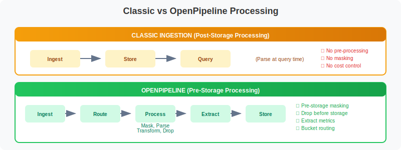

# OpenPipeline Migration Guide: Part 1

> **Series:** OPMIG | **Notebook:** 1 of 9 | **Created:** December 2025

## Introduction & Why Migrate from Classic to OpenPipeline v2.0

---

## Learning Objectives

By the end of this notebook, you will:

- ✅ Understand what OpenPipeline is and why it replaces Classic log ingestion
- ✅ Learn the key architectural differences between Classic and OpenPipeline v2.0
- ✅ **Understand API endpoint compatibility and migration requirements**
- ✅ **Know OpenPipeline limits and constraints**
- ✅ Identify the benefits of migrating (cost, security, performance)
- ✅ **Review real-world migration scenarios**
- ✅ Assess your readiness to migrate

---

---

## What is OpenPipeline?

**OpenPipeline** is Dynatrace's unified data handling solution that seamlessly ingests and processes data from different sources, at any scale, and in any format.

> 💡 **Key Insight:** OpenPipeline is NOT just for logs! It's a comprehensive data processing framework that handles **logs, spans, metrics, events, business events, security events, and more**.

### OpenPipeline Architecture Overview


<!--MARKDOWN_TABLE_ALTERNATIVE
| Stage | Purpose | Components |
|-------|---------|------------|
| **INGEST** | Data entry | OneAgent, Log API, OTLP, Generic API |
| **ROUTING** | Pipeline selection | Matching conditions |
| **PROCESS** | Transformation | Masking, parsing, transform, drop |
| **EXTRACT** | Derived signals | Metrics, events, bizevents, attributes |
| **STORE** | Persistence | Grail buckets, retention, routing |
-->

### Core Capabilities

| Capability | Description |
|------------|-------------|
| **Unified Ingestion** | Single solution for logs, spans, metrics, events, and business events |
| **Dynamic Routing** | Route data to specific pipelines based on matching conditions |
| **Real-time Processing** | Transform, enrich, and mask data at ingestion time |
| **Metric Extraction** | Create metrics from any data source for long-term analytics |
| **Event Generation** | Generate custom events and business events from incoming data |
| **Bucket Management** | Control retention and cost with targeted storage routing |
| **Security & Compliance** | Mask sensitive data before storage |

---

## Classic vs OpenPipeline: Key Differences

Understanding the fundamental differences helps you plan your migration effectively.

### Feature Comparison

| Feature | Classic Ingestion | OpenPipeline v2.0 |
|---------|-------------------|-------------------|
| **Data Types** | Logs only | Logs, Spans, Metrics, Events, Bizevents |
| **Processing Location** | Post-storage | Pre-storage (at ingestion) |
| **Parsing** | Limited built-in parsers | Full DQL + DPL (Dynatrace Pattern Language) |
| **Routing** | Basic log sources | Dynamic routing with matching conditions |
| **Metric Extraction** | Not available | Extract metrics with dimensions |
| **Event Generation** | Not available | Generate events and bizevents |
| **Data Masking** | Post-processing only | At ingestion (before storage) |
| **Cost Control** | Limited | Drop unwanted data before storage |
| **Bucket Routing** | Default only | Route to custom buckets per pipeline |
| **API Endpoints** | `/api/v2/logs/ingest` | Multiple endpoints per data type |
| **Configuration** | Settings → Logs | Settings → OpenPipeline |

### Processing Stage Comparison



<!--MARKDOWN_TABLE_ALTERNATIVE
| Model | Flow | Key Difference |
|-------|------|----------------|
| **Classic** | Ingest → Store → Query (parse at query time) | Post-storage processing |
| **OpenPipeline** | Ingest → Route → Process → Extract → Store | Pre-storage processing |
-->

> ⚠️ **Important:** With OpenPipeline, data processing happens **before** storage. This means you can reduce storage costs by dropping unwanted data and masking sensitive information before it's ever written to Grail.

---

## Benefits of Migrating

### 1. 💰 Cost Optimization

**Drop unwanted data before storage:**
- Filter out debug logs, health checks, and noise
- Reduce storage costs by 30-70% in typical deployments
- Route high-volume, low-value data to shorter retention buckets

### 2. 🔐 Security & Compliance

**Mask sensitive data at ingestion:**
- PII (Personal Identifiable Information) never touches storage
- Credit card numbers, SSNs, emails masked before persistence
- Meet GDPR, HIPAA, PCI-DSS requirements

### 3. 📊 Enhanced Analytics

**Extract metrics with dimensions:**
- Create custom metrics from any log pattern
- Build long-term trend dashboards
- Enable business KPI tracking from technical data

### 4. ⚡ Improved Query Performance

**Parse once, query fast:**
- Structured fields extracted at ingestion
- No runtime parsing overhead
- Faster dashboards and alerts

### 5. 🎯 Unified Data Processing

**Single solution for all data types:**
- Consistent processing for logs, spans, metrics, events
- Centralized configuration management
- Simplified operations and governance

### 6. 🔄 Real-time Enrichment

**Add context at ingestion:**
- Add environment tags (prod, staging, dev)
- Enrich with business context
- Standardize field names across sources

---

## OpenPipeline Configuration Scopes

OpenPipeline supports multiple **configuration scopes** - each handling a different data type:

| Configuration Scope | Data Type | Use Case |
|---------------------|-----------|----------|
| **Logs** | Log records | Application logs, system logs, audit logs |
| **Spans** | Distributed traces | Span processing, trace enrichment |
| **Metrics** | Time-series data | Metric ingestion and transformation |
| **Events** | Platform events | Generic events, Davis events, SDLC events |
| **Business Events** | Business analytics | User journeys, transactions, conversions |
| **Security Events** | Security data | Vulnerability findings, compliance events |
| **System Events** | Infrastructure | System-level events and alerts |

### Ingest Sources per Scope

Each scope supports different ingest sources:

**Logs:**
- OneAgent log ingestion
- Generic log API (`/api/v2/logs/ingest`)
- OTLP logs
- Fluent integrations

**Spans:**
- OneAgent distributed tracing
- OTLP spans
- OpenTelemetry collectors

**Metrics:**
- OneAgent metrics
- OTLP metrics
- Metric ingestion API

> 💡 **Tip:** Access OpenPipeline configuration at: **Settings → Process and contextualize → OpenPipeline**

---

## API Migration: Classic → OpenPipeline v2.0

### API Endpoint Compatibility

Good news: **The API endpoint remains the same!**

| Endpoint | Classic | OpenPipeline | Notes |
|----------|---------|--------------|-------|
| **Logs** | `/api/v2/logs/ingest` | `/api/v2/logs/ingest` | ✅ No change required |
| **OTLP Logs** | Not available | `/otlp/v1/logs` | ✅ New endpoint |
| **Spans** | `/api/v2/otlp/v1/traces` | `/api/v2/otlp/v1/traces` | ✅ No change required |

> 💡 **Migration Tip:** You don't need to update your API calls! OpenPipeline automatically receives data sent to `/api/v2/logs/ingest`. The difference is in **how** the data is processed after ingestion.

### Ingestion Methods Comparison

| Method | Classic | OpenPipeline | `dt.openpipeline.source` Value |
|--------|---------|--------------|-------------------------------|
| **OneAgent** | ✅ Supported | ✅ Supported | `oneagent` |
| **Generic Log API** | ✅ Supported | ✅ Supported | `generic` |
| **OTLP Protocol** | ⚠️ Limited | ✅ Full support | `otlp` |
| **Fluent Bit** | ✅ Via API | ✅ Via API | `generic` |
| **Fluentd** | ✅ Via API | ✅ Via API | `generic` |
| **Logstash** | ✅ Via API | ✅ Via API | `generic` |
| **Vector** | ✅ Via API | ✅ Via API | `generic` |

### Required Token Permissions

| Scope | Classic | OpenPipeline | Notes |
|-------|---------|--------------|-------|
| `logs.ingest` | ✅ Required | ✅ Required | Same permission |
| `metrics.ingest` | N/A | ⚠️ Optional | Only if using metric extraction |
| `events.ingest` | N/A | ⚠️ Optional | Only if using event extraction |

### Migration Strategy for API Clients

| Scenario | Action Required |
|----------|------------------|
| **Using OneAgent** | ✅ No code changes | OpenPipeline handles automatically |
| **Using `/api/v2/logs/ingest`** | ✅ No code changes | Same endpoint works |
| **Using custom log shippers** | ⚠️ Optional | Add `log.source` field for routing |
| **Want to leverage new features** | ⚠️ Configure pipelines | Create OpenPipeline config in UI |

---

## Real-World Migration Scenarios

### Scenario 1: E-Commerce Platform

**Challenge:**
- 50M logs/day (70% debug logs)
- Payment logs contain credit card numbers
- Need to track order metrics from logs

**OpenPipeline Solution:**
1. **Drop debug logs** → Reduce volume by 70%
2. **Mask credit cards** → PCI-DSS compliance
3. **Extract payment metrics** → `order.amount`, `order.count`
4. **Route to tiered buckets** → High-value logs = 90 days, others = 7 days

**Result:** 70% cost savings, PCI compliance, new business metrics

### Scenario 2: Healthcare SaaS

**Challenge:**
- HIPAA compliance required
- Logs contain patient IDs, MRNs, SSNs
- Need audit trail for 7 years

**OpenPipeline Solution:**
1. **Mask all PHI fields** → Patient IDs, SSNs, MRNs
2. **Route audit logs** → Dedicated bucket with 2555-day retention
3. **Extract security events** → Failed auth attempts, data access
4. **Drop health checks** → Reduce noise

**Result:** HIPAA compliance, 7-year audit retention, 40% cost savings

### Scenario 3: FinTech Startup (ELK Migration)

**Challenge:**
- Migrating from ELK stack to Dynatrace
- Custom log formats (not JSON)
- Need APM + logs correlation

**OpenPipeline Solution:**
1. **Parse custom log formats** → DPL patterns for structured extraction
2. **Extract request IDs** → Correlate with traces
3. **Create SLI metrics** → Error rate, latency percentiles
4. **Unified observability** → Logs + APM in one platform

**Result:** ELK replacement, APM correlation, unified observability

### Scenario 4: Global Retailer (Multi-Region)

**Challenge:**
- Multi-region deployment (US, EU, APAC)
- GDPR compliance for EU customers
- 100+ microservices

**OpenPipeline Solution:**
1. **Environment-based routing** → prod/staging/dev to different buckets
2. **Mask PII for EU** → Email, IP addresses for EU region logs
3. **Service-level pipelines** → Dedicated processing per critical service
4. **Metric extraction** → Service-level SLIs

**Result:** Multi-region compliance, per-service observability, 50% cost reduction

---

---

## Understanding Your Current State

Before migrating, you need to understand your current log ingestion landscape. The following queries help you assess what you're working with.

```python
// Identify your current log sources and volume
// This shows which sources are sending the most logs
fetch logs, from: now() - 7d
| summarize {log_count = count()}, by: {log.source}
| sort log_count desc
| limit 25
```

```python
// Check which logs are already processed by OpenPipeline vs Classic
// This helps identify migration progress
fetch logs, from: now() - 24h
| fieldsAdd pipeline_type = if(isNotNull(dt.openpipeline.pipelines), "OpenPipeline", 
                            else: if(isNotNull(dt.openpipeline.source), "OpenPipeline", 
                            else: "Classic"))
| summarize {log_count = count()}, by: {pipeline_type}
| sort log_count desc
```

```python
// Analyze log volume by OpenPipeline source
// Identify the ingestion methods being used
fetch logs, from: now() - 24h
| summarize {log_count = count()}, by: {dt.openpipeline.source}
| sort log_count desc
```

```python
// Check current bucket distribution
// Understand where your logs are being stored
fetch logs, from: now() - 24h
| summarize {log_count = count()}, by: {dt.system.bucket}
| sort log_count desc
```

```python
// Identify which pipelines are processing your logs
// Shows custom pipelines already configured
fetch logs, from: now() - 24h
| filter isNotNull(dt.openpipeline.pipelines)
| summarize {log_count = count()}, by: {dt.openpipeline.pipelines}
| sort log_count desc
```

---

## Migration Readiness Assessment

Use these queries to assess your migration readiness and identify areas that need attention.

```python
// Check parsing coverage - how many logs have structured data?
// Low coverage indicates need for parsing pipelines
fetch logs, from: now() - 24h
| fieldsAdd has_structured_data = isNotNull(loglevel) OR isNotNull(status)
| summarize {
    total = count(),
    structured = countIf(has_structured_data),
    unstructured = countIf(NOT has_structured_data)
  }
| fieldsAdd coverage_pct = round((toDouble(structured) / toDouble(total)) * 100, decimals: 1)
```

```python
// Identify logs that could be dropped to save costs
// Debug logs and health checks are common candidates
fetch logs, from: now() - 24h
| summarize {
    total = count(),
    debug_logs = countIf(loglevel == "DEBUG" OR status == "DEBUG"),
    info_logs = countIf(loglevel == "INFO" OR status == "INFO"),
    health_checks = countIf(contains(toString(content), "health") OR contains(toString(content), "heartbeat")),
    metrics_endpoints = countIf(contains(toString(content), "/metrics") OR contains(toString(content), "/prometheus"))
  }
| fieldsAdd droppable = debug_logs + health_checks + metrics_endpoints
| fieldsAdd potential_savings_pct = round((toDouble(droppable) / toDouble(total)) * 100, decimals: 1)
```

```python
// Find logs with potential PII that needs masking
// Look for common patterns that might contain sensitive data
fetch logs, from: now() - 1h
| filter contains(toString(content), "email") 
    OR contains(toString(content), "password") 
    OR contains(toString(content), "ssn")
    OR contains(toString(content), "credit")
    OR contains(toString(content), "@")
| summarize {potentially_sensitive = count()}, by: {log.source}
| sort potentially_sensitive desc
| limit 20
```

```python
// Analyze log level distribution
// Helps identify noise reduction opportunities
fetch logs, from: now() - 24h
| summarize {log_count = count()}, by: {loglevel}
| sort log_count desc
```

```python
// Check log volume trends over time
// Understand your ingestion patterns
fetch logs, from: now() - 7d
| makeTimeseries {log_count = count()}, interval: 1h
```

---

## Migration Readiness Checklist

Based on your assessment queries, complete this checklist:

### Discovery Phase
- [ ] Identified all log sources (`log.source` values)
- [ ] Documented current log volume by source
- [ ] Identified which logs are already on OpenPipeline
- [ ] Analyzed current bucket usage

### Planning Phase
- [ ] Identified logs that can be dropped (debug, health checks)
- [ ] Identified logs requiring parsing (unstructured content)
- [ ] Identified logs with sensitive data requiring masking
- [ ] Planned bucket strategy (retention periods, cost tiers)

### Configuration Phase
- [ ] Created custom pipelines for each use case
- [ ] Configured dynamic routing rules
- [ ] Set up parsing processors (DQL/DPL)
- [ ] Configured masking for sensitive data
- [ ] Set up metric extraction where needed
- [ ] Configured bucket routing

### Validation Phase
- [ ] Tested pipelines with sample data
- [ ] Verified parsing produces expected fields
- [ ] Confirmed masking works correctly
- [ ] Validated metrics are being extracted
- [ ] Checked data appears in correct buckets

---

## OpenPipeline Limits & Constraints

Before migrating, understand these key limits:

### Data Size Limits

| Limit | Value | What Happens if Exceeded |
|-------|-------|-------------------------|
| **Max record size (after processing)** | 16 MB | Record is **dropped** |
| **Working memory per record** | 16 MB | Processing fails, record dropped |
| **Log attribute size** | 32 KB | Attribute is **truncated** |
| **Max field name length** | 255 characters | Field creation fails |
| **Max string field length** | 4 KB | Content truncated |

### Processing Limits

| Limit | Value | Impact |
|-------|-------|--------|
| **Max extractions per record** | 5 pipelines | Record processed by max 5 pipelines |
| **Max processors per pipeline** | 50 processors | Cannot add more processors |
| **Max DQL commands per processor** | 10 commands | Split into multiple processors |
| **Max parse operations per processor** | 100 patterns | Create multiple parse processors |
| **Processing timeout** | 30 seconds | Record dropped if processing exceeds |

### Timestamp Constraints

| Data Type | Timestamp Range | Records Outside Range |
|-----------|----------------|----------------------|
| **Logs** | 24 hours past to 10 min future | **Dropped** |
| **Spans** | 2 hours past | **Dropped** |
| **Events** | 24 hours past to 10 min future | **Dropped** |

> ⚠️ **Important:** Always send data with recent timestamps. Historical data imports require special considerations.

### Routing & Pipeline Limits

| Limit | Value | Notes |
|-------|-------|-------|
| **Max custom pipelines** | 100 pipelines | Per environment |
| **Max dynamic routes** | 100 routes | Per configuration scope |
| **Max conditions per route** | 10 conditions | Use AND/OR to combine |

### Field Restrictions

**Read-Only Fields** (Cannot be modified in pipelines):
- `dt.ingest.*` - Ingestion metadata
- `dt.openpipeline.*` - Pipeline processing metadata
- `dt.retain.*` - Retention information
- `dt.system.*` - System metadata (including bucket)

**Entity Fields** (Added **after** Processing stage):
- `dt.entity.service`
- `dt.entity.host`
- `dt.entity.process_group`
- `dt.entity.kubernetes_cluster`

> 💡 **Design Tip:** Entity fields are NOT available during routing or processing. They're added automatically by Dynatrace before the Extraction stage.

---

---

## Next Steps

Now that you understand OpenPipeline and have assessed your current state, continue with the migration series:

| Notebook | Focus Area |
|----------|------------|
| **OPMIG-02** | OpenPipeline Architecture & Key Concepts |
| **OPMIG-03** | Migration Assessment & Planning |
| **OPMIG-04** | Pipeline Configuration Fundamentals |
| **OPMIG-05** | Routing & Bucket Management |
| **OPMIG-06** | Processing, Parsing & Transformation |
| **OPMIG-07** | Metric & Event Extraction |
| **OPMIG-08** | Security, Masking & Compliance |
| **OPMIG-09** | Troubleshooting & Validation |

---

## References

- [OpenPipeline Documentation](https://docs.dynatrace.com/docs/discover-dynatrace/platform/openpipeline)
- [OpenPipeline Limits](https://docs.dynatrace.com/docs/discover-dynatrace/platform/openpipeline/reference/limits)
- [Processing Examples](https://docs.dynatrace.com/docs/discover-dynatrace/platform/openpipeline/use-cases/processing-examples)
- [Log Processing Tutorial](https://docs.dynatrace.com/docs/discover-dynatrace/platform/openpipeline/use-cases/tutorial-log-processing-pipeline)
- [Ingest API Reference](https://docs.dynatrace.com/docs/discover-dynatrace/platform/openpipeline/reference/api-ingestion-reference)

---

*Last Updated: December 12, 2025*
