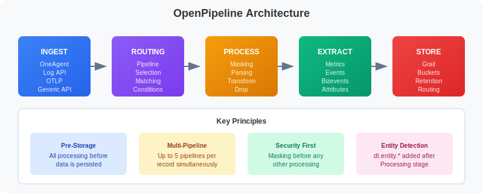
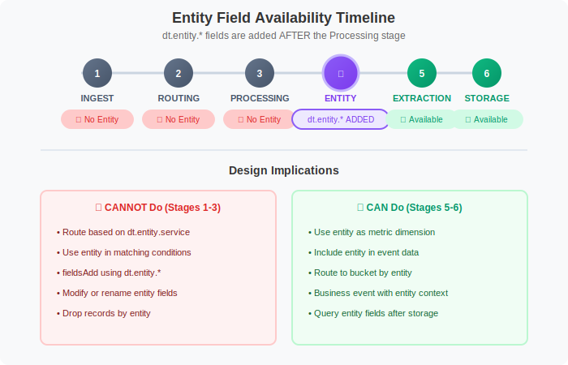

# OpenPipeline Migration Guide: Part 2

> **Series:** OPMIG | **Notebook:** 2 of 9 | **Created:** December 2025

## Architecture & Key Concepts

---

## Learning Objectives

By the end of this notebook, you will:

- ✅ Understand the complete OpenPipeline data flow architecture
- ✅ Learn detailed processing stage execution order
- ✅ Master DPL (Dynatrace Pattern Language) fundamentals
- ✅ **Know ALL OpenPipeline limits in comprehensive detail**
- ✅ Understand processor types and capabilities
- ✅ **Learn entity field availability timeline**
- ✅ Explore your pipeline configuration with DQL

---

---

## Data Flow Architecture

Understanding how data flows through OpenPipeline is essential for designing effective pipelines.

### Complete Data Flow



<!-- MARKDOWN_TABLE_ALTERNATIVE
| Stage | Components | Description |
|-------|------------|-------------|
| **Ingest Sources** | OneAgent, Generic API, OTLP, Custom | Data entry points |
| **Routing Stage** | Matching conditions, Pipeline selection | Route to appropriate pipeline(s) |
| **Processing Stage** | Masking, Filtering, Parsing, Transformation | Transform data before storage |
| **Extraction Stage** | Metrics, Events, Business Events | Create derived data |
| **Storage Stage** | Bucket routing, Retention policies | Persist to Grail |
-->

### Key Principles

1. **Pre-storage Processing**: All transformations happen BEFORE data is written to Grail
2. **Order Matters**: Processors execute in defined order within each stage
3. **Multi-pipeline Support**: A single record can be processed by up to 5 pipelines
4. **Entity Detection**: Entity fields (`dt.entity.*`) are added AFTER the Processing stage
5. **Immutable Storage**: Once stored, data cannot be modified (mask early!)

---

## Processing Stages in Detail

### Stage 1: Routing

The routing stage determines which pipeline(s) process each incoming record.

| Aspect | Description |
|--------|-------------|
| **Purpose** | Match incoming data to appropriate pipelines |
| **Timing** | First stage - before any processing |
| **Configuration** | Dynamic routing rules with matching conditions |
| **Fallback** | Unmatched data goes to default pipeline |

**Matching Condition Examples:**
```
k8s.namespace.name == "production"
log.source == "nginx"
contains(content, "payment")
dt.openpipeline.source == "oneagent"
```

### Stage 2: Processing

The processing stage transforms, enriches, and filters data.

**Sub-stages (in order):**

1. **Masking** - Redact sensitive data (applied FIRST for security)
2. **Filtering** - Drop unwanted records
3. **Processing** - Parse, transform, enrich

| Processor Type | Purpose | Example |
|----------------|---------|----------|
| **DQL** | Transform with DQL commands | `fieldsAdd`, `fieldsRemove`, `parse` |
| **Drop** | Remove matching records | Drop debug logs |
| **Technology Parser** | Apply built-in parsers | Apache, JSON, syslog |

### Stage 3: Extraction

The extraction stage creates derived data from processed records.

| Extraction Type | Output | Use Case |
|-----------------|--------|----------|
| **Value Metric** | Numeric metric with dimensions | Response times, counts |
| **Counter Metric** | Incrementing counter | Request counts, errors |
| **Event** | Platform event | Custom alerts, notifications |
| **Business Event** | Business analytics event | Transactions, user actions |

### Stage 4: Storage

The storage stage routes data to Grail buckets.

| Aspect | Description |
|--------|-------------|
| **Bucket Routing** | Direct data to specific buckets |
| **Retention** | Different retention periods per bucket |
| **Cost Control** | Route high-volume data to shorter retention |

---

## Pipeline Types

OpenPipeline supports three types of pipelines:

### 1. Default Pipeline

- **Purpose**: Handles data that doesn't match any custom pipeline
- **Configuration**: Minimal processing, default bucket
- **Modification**: Can add processors but cannot delete

### 2. Custom Pipelines

- **Purpose**: Targeted processing for specific data sources or patterns
- **Configuration**: Full control over all processing stages
- **Routing**: Requires matching conditions in dynamic routing

### 3. Built-in Pipelines

- **Purpose**: Pre-configured for common technologies
- **Examples**: Kubernetes logs, AWS logs, Azure logs
- **Modification**: Can extend but not fundamentally change

> 💡 **Best Practice:** Create focused pipelines for specific use cases rather than one large pipeline with complex conditionals.

---

## Processor Types

### DQL Processor

The DQL processor uses DQL commands to transform data. Available commands:

| Command | Purpose | Example |
|---------|---------|----------|
| `fieldsAdd` | Add new fields | `fieldsAdd environment = "prod"` |
| `fieldsRemove` | Remove fields | `fieldsRemove sensitive_field` |
| `fieldsRename` | Rename fields | `fieldsRename old_name = new_name` |
| `parse` | Extract with DPL patterns | `parse content, "LD:prefix INT:count"` |

**fieldsAdd Examples:**
```dql
// Static value
| fieldsAdd environment = "production"

// Conditional value
| fieldsAdd severity = if(loglevel == "ERROR", "critical", else: "normal")

// Computed value
| fieldsAdd message_length = stringLength(content)

// From existing field
| fieldsAdd short_host = substring(host.name, 0, 10)
```

### Drop Processor

Removes records matching specified conditions:

```
Matching Condition: loglevel == "DEBUG"
Result: All DEBUG logs are dropped before storage
```

### Technology Processors

Built-in parsers for common log formats:

| Technology | Parsed Fields |
|------------|---------------|
| Apache | client_ip, method, path, status, bytes |
| Nginx | Similar to Apache with nginx-specific fields |
| JSON | Flattens JSON structure to fields |
| Syslog | facility, severity, hostname, message |

---

## Dynatrace Pattern Language (DPL)

DPL is a powerful pattern matching language used in the `parse` command.

### Core Matchers

| Matcher | Description | Example Match |
|---------|-------------|---------------|
| `INT` | Integer number | `42`, `-17` |
| `LONG` | Long integer | `1234567890123` |
| `DOUBLE` | Decimal number | `3.14`, `-0.5` |
| `IPADDR` | IPv4 or IPv6 address | `192.168.1.1`, `::1` |
| `IPV4ADDR` | IPv4 address only | `10.0.0.1` |
| `IPV6ADDR` | IPv6 address only | `2001:db8::1` |
| `TIMESTAMP` | Timestamp with format | `2024-01-15T10:30:00Z` |
| `LD` | Line data (to delimiter) | Any text until delimiter |
| `DATA` | Any data (greedy) | Consumes remaining text |
| `SPACE` | Whitespace | Spaces, tabs |
| `NSPACE` | Non-whitespace | Any non-space chars |
| `WORD` | Word characters | `hello`, `user123` |
| `JSON` | JSON structure | `{"key": "value"}` |
| `EOL` | End of line | Line terminator |

### Pattern Syntax

| Element | Syntax | Description |
|---------|--------|-------------|
| Export to field | `MATCHER:fieldname` | Extract and name the field |
| Match only | `MATCHER` | Match but don't extract |
| Optional | `MATCHER?` | Matcher is optional |
| Literal | `'exact text'` | Match literal string |
| Alternatives | `('opt1'\|'opt2')` | Match either option |
| Quantifier | `MATCHER{2,5}` | Match 2-5 times |

### DPL Examples

```dql
// Extract IP and port from log
| parse content, "IPADDR:client_ip ':' INT:port"

// Extract user ID with flexible prefix
| parse content, "('user='|'userId='|'user_id=')LD:user_id"

// Parse Apache-style log
| parse content, "IPADDR:client_ip SPACE '-' SPACE LD:user SPACE '[' LD:timestamp ']"

// Extract JSON payload
| parse content, "LD JSON:payload"

// Parse with optional port
| parse content, "IPADDR:ip (':' INT:port)?"

// Extract error code
| parse content, "'error_code=' INT:error_code"
```

### Timestamp Format Patterns

| Symbol | Meaning | Example |
|--------|---------|----------|
| `yyyy` | Year (4 digits) | 2024 |
| `MM` | Month (01-12) | 01 |
| `dd` | Day (01-31) | 15 |
| `HH` | Hour 24h (00-23) | 14 |
| `mm` | Minute (00-59) | 30 |
| `ss` | Second (00-59) | 45 |
| `SSS` | Milliseconds | 123 |

---

## Complete OpenPipeline Limits Reference

This comprehensive reference contains ALL OpenPipeline limits you need to know for planning your migration.

### Data Size & Volume Limits

| Limit | Value | Behavior When Exceeded |
|-------|-------|------------------------|
| **Max record size (after processing)** | 16 MB | Record is **dropped**, logged in audit |
| **Max record size (before processing)** | 1 MB | Ingestion rejected with 413 error |
| **Working memory per record** | 16 MB | Processing fails, record dropped |
| **Log attribute size** | 32 KB | Attribute value **truncated** |
| **Max field name length** | 255 characters | Field creation fails |
| **Max string field length** | 4 KB | Content truncated |
| **Max array size** | 1000 elements | Array truncated |
| **Max nesting depth (JSON)** | 10 levels | Deeper levels flattened |

### Processing Limits

| Limit | Value | Impact |
|-------|-------|--------|
| **Max pipelines per record** | 5 | Up to 5 pipelines can process one record |
| **Max processors per pipeline** | 50 | Cannot add more processors to pipeline |
| **Max DQL commands per processor** | 10 commands | Split complex logic into multiple processors |
| **Max parse operations per processor** | 100 patterns | Create additional parse processors |
| **Max fields per record** | 1000 fields | Additional fields ignored |
| **Processing timeout per record** | 30 seconds | Record dropped if exceeded |
| **Max processor name length** | 100 characters | Validation error |

### Timestamp Constraints

| Data Type | Accepted Range | Records Outside Range |
|-----------|---------------|----------------------|
| **Logs** | 24 hours past to 10 minutes future | **Dropped** |
| **Spans** | 2 hours past | **Dropped** |
| **Events** | 24 hours past to 10 minutes future | **Dropped** |
| **Business Events** | 24 hours past to 10 minutes future | **Dropped** |
| **Metrics** | 1 hour past to 1 minute future | **Dropped** |

> ⚠️ **Critical:** Historical data imports require workarounds. Contact Dynatrace support for backfilling options.

### Pipeline & Routing Limits

| Limit | Value | Scope |
|-------|-------|-------|
| **Max custom pipelines** | 100 pipelines | Per configuration scope (logs, spans, etc.) |
| **Max dynamic routes** | 100 routes | Per configuration scope |
| **Max conditions per route** | 10 conditions | Combine with AND/OR operators |
| **Max pipeline name length** | 100 characters | Validation error |
| **Max route name length** | 100 characters | Validation error |

### Extraction Limits

| Limit | Value | Notes |
|-------|-------|-------|
| **Max metric extractions per pipeline** | 10 | Value + counter metrics combined |
| **Max event extractions per pipeline** | 5 | All event types combined |
| **Max bizevent extractions per pipeline** | 3 | Business events only |
| **Max dimensions per metric** | 10 dimensions | Keep cardinality low |
| **Metric key length** | 250 characters | Validation error |
| **Event type name length** | 100 characters | Validation error |

### DQL & DPL Limits

| Limit | Value | Context |
|-------|-------|------|
| **Max DQL query length** | 64 KB | In processor definition |
| **Max DPL pattern length** | 4 KB | Per parse pattern |
| **Max captured groups per parse** | 100 groups | Use multiple parse operations |
| **Max alternatives in pattern** | 50 alternatives | `(opt1\|opt2\|...\|opt50)` |

### Bucket & Storage Limits

| Limit | Value | Notes |
|-------|-------|-------|
| **Max custom buckets** | 50 buckets | Per environment |
| **Min retention period** | 1 day | Per bucket |
| **Max retention period** | 2555 days (~7 years) | Per bucket |
| **Bucket name length** | 100 characters | Alphanumeric + underscore |

### Rate Limits

| Endpoint | Limit | Per |
|----------|-------|-----|
| **Log Ingest API** | 500 requests/min | Per token |
| **OTLP Endpoint** | 1000 requests/min | Per token |
| **Config API** | 100 requests/min | Per token |

### Field & Matching Restrictions

**Read-Only Fields** (Cannot be modified):
```
dt.ingest.*          - Ingestion metadata
dt.openpipeline.*    - Pipeline processing metadata
dt.retain.*          - Retention information
dt.system.*          - System metadata (bucket, etc.)
timestamp            - Record timestamp (can parse new, not modify original)
```

**Reserved Field Prefixes** (Cannot create):
```
dt.*                 - Reserved for Dynatrace
dynatrace.*          - Reserved for Dynatrace
```

**Entity Fields** (Available ONLY after Processing stage):
```
dt.entity.service
dt.entity.host
dt.entity.process_group
dt.entity.process_group_instance
dt.entity.kubernetes_cluster
dt.entity.cloud_application
dt.entity.cloud_application_namespace
```

> 💡 **Design Pattern:** Entity fields are added by Dynatrace AFTER the Processing stage. You cannot:
> - Use them in routing conditions
> - Use them in matching conditions during processing
> - Modify them with fieldsAdd/fieldsRename
> 
> You CAN use them in:
> - Extraction stage (metrics, events)
> - Storage stage (bucket routing based on entity)

### Workarounds for Common Limit Issues

| Problem | Workaround |
|---------|------------|
| **>50 processors needed** | Split into multiple pipelines, use multi-pipeline routing |
| **>10 DQL commands** | Break into multiple processors (order matters!) |
| **>100 parse patterns** | Use multiple parse processors in sequence |
| **>16MB after processing** | Drop unnecessary fields, reduce field sizes |
| **>5 pipelines needed** | Consolidate processing logic, use conditional processors |
| **>10 metric dimensions** | Reduce cardinality, use separate metrics |

---

## Entity Field Availability Timeline

Understanding WHEN entity fields become available is critical for pipeline design.

### Processing Stage Timeline



<!-- MARKDOWN_TABLE_ALTERNATIVE
| Stage | Entity Fields | What You Can Do |
|-------|--------------|-----------------|
| 1. INGEST | ❌ Not Available | - |
| 2. ROUTING | ❌ Not Available | Cannot route by entity |
| 3. PROCESSING | ❌ Not Available | Cannot use in conditions |
| 4. ENTITY DETECTION | ⭐ Added Here | Automatic by Dynatrace |
| 5. EXTRACTION | ✅ Available | Use as metric dimensions |
| 6. STORAGE | ✅ Available | Route to buckets by entity |
-->

### Practical Examples

#### ❌ WRONG - Cannot route based on entity
```
Dynamic Route:
  Condition: dt.entity.service == "SERVICE-123"  ❌ FAILS
  
Why: Entity fields not available during routing
```

#### ❌ WRONG - Cannot use entity in processing
```dql
DQL Processor:
  fieldsAdd service_name = dt.entity.service  ❌ FAILS
  
Why: Entity fields not available during processing
```

#### ✅ CORRECT - Use entity in metric extraction
```
Metric Extraction:
  Key: log.request.duration
  Value: duration_ms
  Dimensions: dt.entity.service, dt.entity.host  ✅ WORKS
  
Why: Entity fields available in extraction stage
```

#### ✅ CORRECT - Use entity for bucket routing
```
Bucket Routing (in Storage stage):
  Condition: dt.entity.service == "CRITICAL-SERVICE"
  Bucket: critical_logs  ✅ WORKS
  
Why: Entity fields available in storage stage
```

### Design Patterns

**Pattern 1: Route by source, extract metrics by entity**
```
Routing: log.source == "payment-service"  (uses source field)
Processing: Parse payment data
Extraction: Create metric with dt.entity.service dimension  ✅
```

**Pattern 2: Enrich with custom field, then use entity**
```
Processing: fieldsAdd app_tier = "frontend"  (custom field)
Extraction: Dimensions: app_tier, dt.entity.service  ✅
```

**Pattern 3: Cannot mix entity with routing**
```
❌ Route based on entity → Use workaround:
   - Route based on source/content patterns instead
   - Use service name string (not entity ID) if available
```

---

---

## Key Fields & Metadata

### OpenPipeline-Specific Fields

| Field | Description | Example Value |
|-------|-------------|---------------|
| `dt.openpipeline.source` | Data source identifier | `oneagent`, `generic`, `otlp` |
| `dt.openpipeline.pipelines` | Pipeline(s) that processed record | `["custom-pipeline-1"]` |
| `dt.system.bucket` | Grail storage bucket | `default_logs`, `custom_logs` |

### Log Fields

| Field | Description |
|-------|-------------|
| `timestamp` | Log timestamp (primary time field) |
| `content` | Log message content |
| `loglevel` | Log level (ERROR, WARN, INFO, DEBUG) |
| `status` | Status string (alternative to loglevel) |
| `log.source` | Log source identifier |
| `log.iostream` | Stream type (stdout, stderr) |

### Entity Context Fields

| Field | Description |
|-------|-------------|
| `dt.entity.host` | Host entity ID |
| `dt.entity.process_group` | Process group entity ID |
| `dt.entity.process_group_instance` | Process instance entity ID |
| `dt.entity.service` | Service entity ID |
| `host.name` | Host name (string) |
| `process.executable.name` | Process executable name |

> ⚠️ **Important:** Entity fields (`dt.entity.*`) are added AFTER the Processing stage. You cannot use them in routing or processing conditions.

---

## Exploring Your Pipeline Configuration

Use these queries to understand how your environment is configured.

```python
// View data sources currently sending to OpenPipeline
// Shows the distribution of data by ingestion source
fetch logs, from: now() - 24h
| summarize {record_count = count()}, by: {dt.openpipeline.source}
| sort record_count desc
```

```python
// Analyze which pipelines are processing your logs
// Helps verify routing is working correctly
fetch logs, from: now() - 24h
| filter isNotNull(dt.openpipeline.pipelines)
| summarize {record_count = count()}, by: {dt.openpipeline.pipelines}
| sort record_count desc
```

```python
// Check bucket distribution for stored logs
// Verify data is routing to expected buckets
fetch logs, from: now() - 24h
| summarize {record_count = count()}, by: {dt.system.bucket}
| sort record_count desc
```

```python
// Analyze pipeline processing by source and pipeline
// Shows the relationship between sources and pipelines
fetch logs, from: now() - 24h
| filter isNotNull(dt.openpipeline.pipelines)
| summarize {record_count = count()}, by: {dt.openpipeline.source, dt.openpipeline.pipelines}
| sort record_count desc
| limit 25
```

```python
// Check for span processing through OpenPipeline
// Spans also flow through OpenPipeline
fetch spans, from: now() - 24h
| summarize {span_count = count()}, by: {dt.openpipeline.source}
| sort span_count desc
```

```python
// View pipeline processing over time
// Helps identify volume patterns and processing trends
fetch logs, from: now() - 24h
| filter isNotNull(dt.openpipeline.pipelines)
| makeTimeseries {record_count = count()}, by: {dt.openpipeline.pipelines}, interval: 1h
```

```python
// Identify logs going to default pipeline (may need custom routing)
// High volume in default may indicate missing routing rules
fetch logs, from: now() - 24h
| filter isNull(dt.openpipeline.pipelines) OR dt.openpipeline.pipelines == "[]"
| summarize {unrouted_count = count()}, by: {log.source}
| sort unrouted_count desc
| limit 20
```

---

## Understanding Processing Order

The order of processing within a pipeline is critical:


<!--MARKDOWN_TABLE_ALTERNATIVE
| Order | Stage | Purpose |
|-------|-------|---------|
| 1 | MASKING | Security first - redact PII before anything |
| 2 | FILTERING | Drop unwanted records early |
| 3 | PROCESSING | Parse, transform, enrich |
| 4 | ENTITY DETECTION | dt.entity.* added automatically |
| 5 | EXTRACTION | Metrics, events, bizevents |
| 6 | STORAGE | Route to buckets |
-->

> 💡 **Tip:** Masking is applied FIRST so sensitive data is protected even if subsequent processors fail.

---

## Summary: Key Architecture Concepts

| Concept | Key Points |
|---------|------------|
| **Data Flow** | Ingest → Route → Process → Extract → Store |
| **Pre-storage** | All processing happens before data is persisted |
| **Routing** | Dynamic routes match data to pipelines |
| **Processing Order** | Masking → Filtering → Processing |
| **Entity Detection** | Happens AFTER processing, BEFORE extraction |
| **Multi-pipeline** | One record can be processed by up to 5 pipelines |
| **DPL** | Powerful pattern language for parsing |
| **Buckets** | Control retention and cost at storage stage |

---

## Next Steps

Now that you understand OpenPipeline architecture, continue with:

| Notebook | Focus Area |
|----------|------------|
| **OPMIG-03** | Migration Assessment & Planning |
| **OPMIG-04** | Pipeline Configuration Fundamentals |
| **OPMIG-05** | Routing & Bucket Management |
| **OPMIG-06** | Processing, Parsing & Transformation |

---

## References

- [OpenPipeline Data Flow](https://docs.dynatrace.com/docs/discover-dynatrace/platform/openpipeline/concepts/data-flow)
- [OpenPipeline Processing](https://docs.dynatrace.com/docs/discover-dynatrace/platform/openpipeline/concepts/processing)
- [Dynatrace Pattern Language](https://docs.dynatrace.com/docs/discover-dynatrace/platform/grail/dynatrace-pattern-language)
- [DPL Architect Tool](https://docs.dynatrace.com/docs/discover-dynatrace/platform/grail/dynatrace-pattern-language/dpl-architect)

---

*Last Updated: December 12, 2025*
