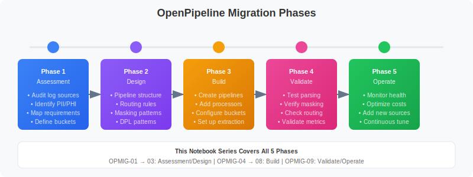

# OpenPipeline Migration Guide: Part 3

> **Series:** OPMIG | **Notebook:** 3 of 9 | **Created:** December 2025

## Migration Assessment & Planning

---

## Learning Objectives

By the end of this notebook, you will:

- ✅ Discover and analyze your current data landscape
- ✅ **Use Davis Copilot for intelligent discovery**
- ✅ Assess parsing requirements and coverage
- ✅ Identify cost optimization opportunities
- ✅ Detect sensitive data requiring masking
- ✅ **Prioritize sources using scoring matrix**
- ✅ **Create data-driven migration waves**
- ✅ Generate comprehensive source inventory

---

---

## Discovery: Current Data Landscape

Start by understanding what data you're currently ingesting and how it's being processed.

---

## Using Davis Copilot for Discovery

If you have access to the Dynatrace MCP Server, you can use Davis Copilot to assist with migration discovery.

### Davis Copilot Capabilities

| Tool | Purpose | Example Use Case |
|------|---------|------------------|
| **chat_with_davis_copilot** | Ask any Dynatrace question | "What log sources exist in my environment?" |
| **generate_dql_from_natural_language** | Natural language → DQL | "Show me error logs from the last week" |
| **explain_dql_in_natural_language** | Explain complex queries | Understand existing queries |
| **verify_dql** | Validate DQL syntax | Check queries before running |
| **execute_dql** | Run queries against tenant | Get real data |

### Example: Discovery with Davis Copilot

**Question to Davis:**
```
"What are the top 10 log sources by volume in the last 7 days?"
```

**Davis generates DQL:**
```dql
fetch logs, from: now() - 7d
| summarize {log_count = count()}, by: {log.source}
| sort log_count desc
| limit 10
```

**Question to Davis:**
```
"Show me logs that might contain credit card numbers"
```

**Davis generates DQL:**
```dql
// Security pattern detection - look for potential credit card or payment data
fetch logs, from: now() - 1h
| filter contains(toString(content), "card") OR contains(toString(content), "payment") OR contains(toString(content), "credit")
| summarize {count = count()}, by: {log.source}
| sort count desc
```

### Benefits of MCP-Assisted Discovery

| Benefit | Description |
|---------|-------------|
| **Natural Language** | No need to know DQL syntax |
| **Real Data** | Execute against live tenant |
| **Syntax Validation** | Catch errors before execution |
| **Explanation** | Understand complex patterns |
| **Faster Discovery** | Iterate quickly on queries |

> 💡 **Tip:** Use Davis Copilot iteratively. Ask initial questions, review results, then refine your questions based on what you discover.

### Discovery Workflow with MCP

```
1. ASK DAVIS
   └─ "What log sources exist?"
   
2. DAVIS GENERATES DQL
   └─ fetch logs | summarize...
   
3. VERIFY SYNTAX
   └─ mcp verify_dql(query)
   
4. EXECUTE
   └─ mcp execute_dql(query)
   
5. ANALYZE RESULTS
   └─ Identify patterns, volumes
   
6. REFINE
   └─ Ask follow-up questions
```

---

```python
// Overall data volume summary by data type
// Understand the scale of your migration
fetch logs, from: now() - 7d
| summarize {log_count = count()}
| fieldsAdd data_type = "logs", daily_avg = log_count / 7
```

```python
// Compare logs processed by OpenPipeline vs potentially classic
// Identifies migration progress
fetch logs, from: now() - 7d
| fieldsAdd processing_type = if(isNotNull(dt.openpipeline.source), "OpenPipeline", else: "Unknown/Classic")
| summarize {record_count = count()}, by: {processing_type}
| fieldsAdd daily_avg = record_count / 7
| sort record_count desc
```

```python
// Breakdown by OpenPipeline source type
// Shows which ingestion methods are being used
fetch logs, from: now() - 7d
| summarize {record_count = count()}, by: {dt.openpipeline.source}
| fieldsAdd daily_avg = round(record_count / 7, decimals: 0)
| sort record_count desc
```

```python
// Check span ingestion landscape (OpenPipeline handles spans too!)
fetch spans, from: now() - 7d
| summarize {span_count = count()}, by: {dt.openpipeline.source}
| fieldsAdd daily_avg = round(span_count / 7, decimals: 0)
| sort span_count desc
```

---

## Volume Analysis

Understanding volume patterns helps you prioritize migration and plan for cost optimization.

```python
// Daily log volume trend
// Identify growth patterns and peak days
fetch logs, from: now() - 30d
| makeTimeseries {daily_count = count()}, interval: 1d
```

```python
// Hourly volume pattern (typical day)
// Understand when peak ingestion occurs
fetch logs, from: now() - 7d
| fieldsAdd hour_of_day = getHour(timestamp)
| summarize {avg_hourly = count() / 7}, by: {hour_of_day}
| sort hour_of_day asc
```

```python
// Volume by log source - TOP 25
// Identify highest volume sources for prioritization
fetch logs, from: now() - 7d
| summarize {record_count = count()}, by: {log.source}
| sort record_count desc
| limit 25
| fieldsAdd daily_avg = round(record_count / 7, decimals: 0)
```

```python
// Volume by host entity
// Identify which hosts generate the most logs
fetch logs, from: now() - 7d
| filter isNotNull(dt.entity.host)
| summarize {record_count = count()}, by: {dt.entity.host}
| sort record_count desc
| limit 20
| fieldsAdd daily_avg = round(record_count / 7, decimals: 0)
```

```python
// Volume by Kubernetes namespace (if applicable)
fetch logs, from: now() - 7d
| filter isNotNull(k8s.namespace.name)
| summarize {record_count = count()}, by: {k8s.namespace.name}
| sort record_count desc
| limit 20
| fieldsAdd daily_avg = round(record_count / 7, decimals: 0)
```

---

## Source Inventory

Create a comprehensive inventory of log sources for migration planning.

```python
// Complete log source inventory with characteristics
fetch logs, from: now() - 7d
| summarize {
    total_records = count(),
    unique_hosts = countDistinct(dt.entity.host),
    has_loglevel = countIf(isNotNull(loglevel)),
    error_count = countIf(loglevel == "ERROR" OR status == "ERROR")
  }, by: {log.source}
| fieldsAdd parsing_coverage = round((toDouble(has_loglevel) / toDouble(total_records)) * 100, decimals: 1)
| fieldsAdd error_rate = round((toDouble(error_count) / toDouble(total_records)) * 100, decimals: 2)
| sort total_records desc
| limit 30
```

```python
// Log sources by ingestion method
// Map sources to their OpenPipeline ingestion type
fetch logs, from: now() - 7d
| summarize {record_count = count()}, by: {log.source, dt.openpipeline.source}
| sort record_count desc
| limit 50
```

```python
// Log sources by current pipeline assignment
// Identify which sources already have custom pipelines
fetch logs, from: now() - 7d
| summarize {record_count = count()}, by: {log.source, dt.openpipeline.pipelines}
| sort record_count desc
| limit 50
```

```python
// Log sources by bucket
// Shows current storage distribution
fetch logs, from: now() - 7d
| summarize {record_count = count()}, by: {log.source, dt.system.bucket}
| sort record_count desc
| limit 50
```

---

## Parsing Requirements Analysis

Identify which log sources need parsing pipelines to extract structured data.

```python
// Overall parsing coverage assessment
// What percentage of logs have structured log levels?
fetch logs, from: now() - 24h
| summarize {
    total = count(),
    with_loglevel = countIf(isNotNull(loglevel)),
    with_status = countIf(isNotNull(status)),
    either = countIf(isNotNull(loglevel) OR isNotNull(status))
  }
| fieldsAdd loglevel_coverage = round((toDouble(with_loglevel) / toDouble(total)) * 100, decimals: 1)
| fieldsAdd status_coverage = round((toDouble(with_status) / toDouble(total)) * 100, decimals: 1)
| fieldsAdd overall_coverage = round((toDouble(either) / toDouble(total)) * 100, decimals: 1)
```

```python
// Sources with low parsing coverage (need custom parsing)
// These sources should be prioritized for parsing pipelines
fetch logs, from: now() - 7d
| summarize {
    total_records = count(),
    parsed = countIf(isNotNull(loglevel) OR isNotNull(status))
  }, by: {log.source}
| filter total_records > 1000
| fieldsAdd parsing_pct = round((toDouble(parsed) / toDouble(total_records)) * 100, decimals: 1)
| filter parsing_pct < 50
| sort total_records desc
| limit 25
```

```python
// Sample unparsed log content for pattern analysis
// Review these to design parsing rules
fetch logs, from: now() - 1h
| filter isNull(loglevel) AND isNull(status)
| fields timestamp, log.source, content
| limit 50
```

```python
// Identify JSON logs that could benefit from JSON parsing
// JSON logs can be automatically parsed in OpenPipeline
fetch logs, from: now() - 1h
| filter startsWith(toString(content), "{")
| summarize {json_logs = count()}, by: {log.source}
| sort json_logs desc
| limit 20
```

```python
// Sample JSON logs for structure analysis
fetch logs, from: now() - 1h
| filter startsWith(toString(content), "{")
| fields timestamp, log.source, content
| limit 20
```

---

## Cost Optimization Opportunities

Identify logs that can be dropped or routed to shorter retention buckets to reduce costs.

```python
// Debug log volume - prime candidates for dropping
fetch logs, from: now() - 7d
| summarize {
    total = count(),
    debug_logs = countIf(loglevel == "DEBUG" OR status == "DEBUG"),
    trace_logs = countIf(loglevel == "TRACE" OR status == "TRACE")
  }
| fieldsAdd debug_pct = round((toDouble(debug_logs) / toDouble(total)) * 100, decimals: 2)
| fieldsAdd trace_pct = round((toDouble(trace_logs) / toDouble(total)) * 100, decimals: 2)
| fieldsAdd droppable_pct = round((toDouble(debug_logs + trace_logs) / toDouble(total)) * 100, decimals: 2)
```

```python
// Health check and metrics endpoint logs - often droppable
fetch logs, from: now() - 7d
| summarize {
    total = count(),
    health_checks = countIf(contains(toString(content), "health") OR contains(toString(content), "healthz")),
    readiness = countIf(contains(toString(content), "ready") OR contains(toString(content), "readiness")),
    liveness = countIf(contains(toString(content), "alive") OR contains(toString(content), "liveness")),
    metrics = countIf(contains(toString(content), "/metrics") OR contains(toString(content), "/prometheus"))
  }
| fieldsAdd droppable = health_checks + readiness + liveness + metrics
| fieldsAdd savings_pct = round((toDouble(droppable) / toDouble(total)) * 100, decimals: 2)
```

```python
// Log level distribution by source
// Identify sources with high debug/trace output
fetch logs, from: now() - 7d
| filter isNotNull(loglevel)
| summarize {record_count = count()}, by: {log.source, loglevel}
| sort log.source asc, record_count desc
```

```python
// Highly repetitive log patterns (noise candidates)
// Find logs with same content appearing many times
fetch logs, from: now() - 1h
| summarize {occurrences = count()}, by: {content}
| filter occurrences > 100
| sort occurrences desc
| limit 25
```

```python
// Estimate potential cost savings from dropping debug/noise
fetch logs, from: now() - 7d
| summarize {
    total = count(),
    droppable_debug = countIf(loglevel == "DEBUG" OR status == "DEBUG" OR loglevel == "TRACE"),
    droppable_health = countIf(contains(toString(content), "health") OR contains(toString(content), "/metrics")),
    info_logs = countIf(loglevel == "INFO" OR status == "INFO")
  }, by: {log.source}
| fieldsAdd potential_drops = droppable_debug + droppable_health
| fieldsAdd drop_pct = round((toDouble(potential_drops) / toDouble(total)) * 100, decimals: 1)
| filter potential_drops > 100
| sort potential_drops desc
| limit 25
```

## Migration Priority Scoring Matrix

Use this data-driven approach to prioritize which log sources to migrate first.

### Scoring Factors

| Factor | Weight | High Score (5) | Low Score (1) |
|--------|--------|----------------|---------------|
| **Volume** | 25% | >1M logs/day | <10K logs/day |
| **Cost Savings Potential** | 25% | >50% droppable | <5% droppable |
| **Security Risk** | 25% | Contains PII/PHI | No sensitive data |
| **Parsing Complexity** | 10% | JSON/simple format | Complex multi-format |
| **Business Criticality** | 15% | Production core services | Dev/test environments |

### Calculating Priority Score

```
Priority Score = 
  (Volume Score × 0.25) +
  (Cost Savings Score × 0.25) +
  (Security Risk Score × 0.25) +
  (Parsing Complexity Score × 0.10) +
  (Business Criticality Score × 0.15)
  
Range: 1.0 (lowest) to 5.0 (highest)
```

### Priority Tiers

| Score Range | Tier | Action |
|-------------|------|--------|
| **4.0 - 5.0** | 🔴 Critical | Wave 1 - Migrate immediately |
| **3.0 - 3.9** | 🟠 High | Wave 2 - Migrate within 2 weeks |
| **2.0 - 2.9** | 🟡 Medium | Wave 3 - Migrate within 1 month |
| **1.0 - 1.9** | 🟢 Low | Wave 4 - Migrate when convenient |

### Example: E-Commerce Logs

**Source:** `payment-service`

| Factor | Score | Justification |
|--------|-------|---------------|
| Volume | 5 | 2M logs/day |
| Cost Savings | 4 | 60% debug logs droppable |
| Security Risk | 5 | Contains credit card numbers |
| Parsing | 4 | JSON format (easy) |
| Criticality | 5 | Core payment processing |

**Priority Score:** 
```
(5 × 0.25) + (4 × 0.25) + (5 × 0.25) + (4 × 0.10) + (5 × 0.15) = 4.65
```

**Result:** 🔴 **Wave 1 - Critical Priority**

### Example: Development Logs

**Source:** `dev-test-service`

| Factor | Score | Justification |
|--------|-------|---------------|
| Volume | 2 | 50K logs/day |
| Cost Savings | 3 | 30% debug logs |
| Security Risk | 1 | No sensitive data |
| Parsing | 3 | Moderate complexity |
| Criticality | 1 | Non-production |

**Priority Score:**
```
(2 × 0.25) + (3 × 0.25) + (1 × 0.25) + (3 × 0.10) + (1 × 0.15) = 1.95
```

**Result:** 🟢 **Wave 4 - Low Priority**

---

## Defining Migration Waves

Organize your migration into manageable waves based on priority scores.



<!--MARKDOWN_TABLE_ALTERNATIVE
| Phase | Focus | Notebooks |
|-------|-------|-----------|
| Phase 1 | Assessment | Audit sources, identify PII, map requirements |
| Phase 2 | Design | Pipeline structure, routing, masking patterns |
| Phase 3 | Build | Create pipelines, add processors, configure buckets |
| Phase 4 | Validate | Test parsing, verify masking, check routing |
| Phase 5 | Operate | Monitor health, optimize costs, continuous tuning |
-->

### Wave 1: Critical (Weeks 1-2)

**Criteria:**
- Priority score ≥ 4.0
- High security risk OR high business criticality
- Quick wins with significant impact

**Typical Sources:**
- Payment/financial transaction logs
- Authentication/authorization logs
- Production API gateways
- Customer-facing services

**Migration Activities:**
1. Configure masking for sensitive data
2. Set up high-retention buckets (90+ days)
3. Extract critical business metrics
4. Implement drop rules for noise
5. Validate thoroughly before cutover

### Wave 2: High Priority (Weeks 3-4)

**Criteria:**
- Priority score 3.0 - 3.9
- High volume sources
- Significant cost savings potential

**Typical Sources:**
- High-volume application logs
- Microservices with debug logs
- Infrastructure logs (K8s, cloud)
- Database audit logs

**Migration Activities:**
1. Implement tiered bucket strategy
2. Configure aggressive drop rules
3. Extract SLI/SLO metrics
4. Parse for standard fields

### Wave 3: Medium Priority (Weeks 5-6)

**Criteria:**
- Priority score 2.0 - 2.9
- Moderate volume
- Standard processing requirements

**Typical Sources:**
- Supporting microservices
- Batch processing logs
- Background workers
- Scheduled jobs

**Migration Activities:**
1. Use default bucket with standard retention
2. Basic parsing and enrichment
3. Standard drop rules

### Wave 4: Low Priority (Weeks 7+)

**Criteria:**
- Priority score < 2.0
- Low volume or non-critical
- Development/test environments

**Typical Sources:**
- Development environment logs
- Test automation logs
- Experimental services
- Legacy systems (soon to be retired)

**Migration Activities:**
1. Short retention buckets (7 days)
2. Minimal processing
3. May consider NOT migrating if retiring soon

### Wave Planning Template

| Wave | Timeline | Sources | Expected Outcome |
|------|----------|---------|------------------|
| **Wave 1** | Week 1-2 | 5-10 critical sources | Security compliance, audit logs |
| **Wave 2** | Week 3-4 | 10-20 high-volume sources | 50%+ cost savings |
| **Wave 3** | Week 5-6 | 20-30 standard sources | Complete production migration |
| **Wave 4** | Week 7+ | Remaining sources | 100% migration complete |

### Risk Mitigation Per Wave

| Wave | Mitigation Strategy |
|------|---------------------|
| **Wave 1** | Extra validation, staged rollout, 24/7 monitoring |
| **Wave 2** | Standard validation, rollout groups, business hours monitoring |
| **Wave 3** | Standard process, batch rollout |
| **Wave 4** | Minimal ceremony, quick rollout |

---

```dql
// Generate priority scoring data for your log sources
// Use this data to calculate priority scores manually

fetch logs, from: now() - 7d
| summarize {
    // VOLUME FACTOR
    total_records = count(),
    daily_avg = count() / 7,
    
    // COST SAVINGS FACTOR
    debug_count = countIf(loglevel == "DEBUG" OR status == "DEBUG"),
    trace_count = countIf(loglevel == "TRACE" OR status == "TRACE"),
    health_checks = countIf(contains(toString(content), "health") OR contains(toString(content), "/ready")),
    
    // SECURITY FACTOR (indicators)
    potential_pii = countIf(
        contains(toString(content), "@") OR
        contains(toString(content), "card") OR
        contains(toString(content), "ssn") OR
        contains(toString(content), "password")
    ),
    
    // PARSING FACTOR
    parsed_records = countIf(isNotNull(loglevel)),
    
    // ERROR RATE (criticality indicator)
    error_count = countIf(loglevel == "ERROR" OR status == "ERROR"),
    
    unique_hosts = countDistinct(dt.entity.host)
  }, by: {log.source}
| filter total_records > 1000  // Only sources with meaningful volume
| fieldsAdd droppable = debug_count + trace_count + health_checks
| fieldsAdd drop_pct = round((toDouble(droppable) / toDouble(total_records)) * 100, decimals: 1)
| fieldsAdd parsing_pct = round((toDouble(parsed_records) / toDouble(total_records)) * 100, decimals: 1)
| fieldsAdd error_rate = round((toDouble(error_count) / toDouble(total_records)) * 100, decimals: 2)
| fieldsAdd pii_pct = round((toDouble(potential_pii) / toDouble(total_records)) * 100, decimals: 2)
| sort total_records desc
| limit 50
```

---

## Security & Compliance Assessment

Identify logs containing sensitive data that needs masking before storage.

```python
// Search for potential PII patterns
// CAUTION: Review results carefully for actual sensitive data
fetch logs, from: now() - 1h
| filter contains(toString(content), "email")
    OR contains(toString(content), "password")
    OR contains(toString(content), "credit")
    OR contains(toString(content), "ssn")
    OR contains(toString(content), "social security")
| summarize {potential_pii = count()}, by: {log.source}
| sort potential_pii desc
| limit 20
```

```python
// Look for email patterns in logs
fetch logs, from: now() - 1h
| filter contains(toString(content), "@")
| summarize {email_patterns = count()}, by: {log.source}
| sort email_patterns desc
| limit 20
```

```python
// Sample logs with potential sensitive data for review
// Review these to design masking rules
fetch logs, from: now() - 1h
| filter contains(toString(content), "email") OR contains(toString(content), "password")
| fields timestamp, log.source, content
| limit 25
```

```python
// Look for IP addresses in logs (may need masking for GDPR)
fetch logs, from: now() - 1h
| filter contains(toString(content), ".")
| summarize {logs_with_dots = count()}, by: {log.source}
| sort logs_with_dots desc
| limit 20
```

```python
// Audit log sources - may need longer retention
fetch logs, from: now() - 7d
| filter contains(toString(log.source), "audit")
    OR contains(toString(content), "audit")
    OR contains(toString(content), "login")
    OR contains(toString(content), "authentication")
| summarize {audit_logs = count()}, by: {log.source}
| sort audit_logs desc
| limit 20
```

---

## Migration Priority Matrix

Based on your assessment, prioritize sources for migration using this framework:

### Priority Scoring Criteria

| Factor | Weight | High Score | Low Score |
|--------|--------|------------|------------|
| **Volume** | 30% | >1M logs/day | <10K logs/day |
| **Cost Savings Potential** | 25% | >30% droppable | <5% droppable |
| **Security Risk** | 25% | Contains PII | No sensitive data |
| **Parsing Complexity** | 10% | Simple JSON/structured | Complex multi-format |
| **Business Criticality** | 10% | Core business app | Development/test |

### Recommended Migration Waves

| Wave | Priority | Criteria | Examples |
|------|----------|----------|----------|
| **Wave 1** | 🔴 Critical | High volume + security risk | Payment logs, auth logs |
| **Wave 2** | 🟠 High | High volume + cost savings | Debug-heavy apps, health checks |
| **Wave 3** | 🟡 Medium | Medium volume, standard processing | Application logs |
| **Wave 4** | 🟢 Low | Low volume, minimal processing | Development, test environments |

```python
// Generate migration priority assessment by source
fetch logs, from: now() - 7d
| summarize {
    total_records = count(),
    debug_count = countIf(loglevel == "DEBUG" OR status == "DEBUG"),
    error_count = countIf(loglevel == "ERROR" OR status == "ERROR"),
    has_parsing = countIf(isNotNull(loglevel)),
    unique_hosts = countDistinct(dt.entity.host)
  }, by: {log.source}
| filter total_records > 1000
| fieldsAdd daily_avg = round(total_records / 7, decimals: 0)
| fieldsAdd drop_opportunity = round((toDouble(debug_count) / toDouble(total_records)) * 100, decimals: 1)
| fieldsAdd parsing_coverage = round((toDouble(has_parsing) / toDouble(total_records)) * 100, decimals: 1)
| fieldsAdd error_rate = round((toDouble(error_count) / toDouble(total_records)) * 100, decimals: 2)
| sort total_records desc
| limit 30
```

---

## Planning Your Migration

### Migration Checklist

Use this checklist to track your migration planning:

#### Discovery Phase ✓
- [ ] Inventoried all log sources
- [ ] Documented volume by source
- [ ] Identified OpenPipeline sources vs classic
- [ ] Analyzed current bucket distribution

#### Assessment Phase ✓
- [ ] Identified parsing requirements
- [ ] Calculated cost savings opportunities
- [ ] Found sources with sensitive data
- [ ] Assigned migration priorities

#### Planning Phase
- [ ] Defined migration waves
- [ ] Designed pipeline structure
- [ ] Planned routing rules
- [ ] Documented parsing patterns (DPL)
- [ ] Defined masking requirements
- [ ] Planned bucket strategy

#### Pre-Migration Testing
- [ ] Tested parsing patterns in DPL Architect
- [ ] Validated masking rules
- [ ] Tested routing conditions
- [ ] Verified metric extraction

### Pipeline Design Template

For each source being migrated, document:

| Aspect | Details |
|--------|----------|
| **Source Name** | (e.g., `nginx-access`) |
| **Volume** | (e.g., `500K/day`) |
| **Pipeline Name** | (e.g., `nginx-logs`) |
| **Routing Condition** | (e.g., `log.source == "nginx"`) |
| **Parsing Required?** | Yes/No |
| **Parse Pattern** | (DPL pattern) |
| **Masking Required?** | Yes/No |
| **Masking Rules** | (fields to mask) |
| **Drop Rules** | (conditions to drop) |
| **Metric Extraction** | (metrics to create) |
| **Target Bucket** | (bucket name) |
| **Retention** | (days) |

---

## Assessment Summary Export

Run these queries to create a summary you can export and share with your team.

```python
// Complete source inventory with all metrics
// Export this for migration planning documentation
fetch logs, from: now() - 7d
| summarize {
    total_records = count(),
    daily_avg = count() / 7,
    unique_hosts = countDistinct(dt.entity.host),
    debug_count = countIf(loglevel == "DEBUG" OR status == "DEBUG"),
    error_count = countIf(loglevel == "ERROR" OR status == "ERROR"),
    parsed_count = countIf(isNotNull(loglevel))
  }, by: {log.source, dt.openpipeline.source, dt.system.bucket}
| fieldsAdd parsing_pct = round((toDouble(parsed_count) / toDouble(total_records)) * 100, decimals: 1)
| fieldsAdd drop_opportunity_pct = round((toDouble(debug_count) / toDouble(total_records)) * 100, decimals: 1)
| fieldsAdd error_rate_pct = round((toDouble(error_count) / toDouble(total_records)) * 100, decimals: 2)
| sort total_records desc
| limit 100
```

---

## Next Steps

With your assessment complete, continue with:

| Notebook | Focus Area |
|----------|------------|
| **OPMIG-04** | Pipeline Configuration Fundamentals |
| **OPMIG-05** | Routing & Bucket Management |
| **OPMIG-06** | Processing, Parsing & Transformation |
| **OPMIG-07** | Metric & Event Extraction |
| **OPMIG-08** | Security, Masking & Compliance |

---

## References

- [OpenPipeline Configuration Tutorial](https://docs.dynatrace.com/docs/discover-dynatrace/platform/openpipeline/getting-started/tutorial-configure-processing)
- [Log Management Limits](https://docs.dynatrace.com/docs/analyze-explore-automate/logs/lma-limits)
- [Grail Buckets](https://docs.dynatrace.com/docs/platform/grail/data-model/buckets)

---

*Last Updated: December 12, 2025*
