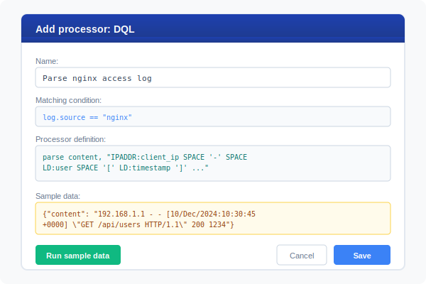
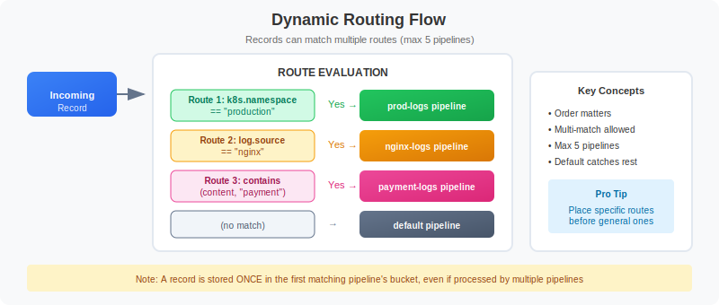

# OpenPipeline Migration Guide: Part 4

> **Series:** OPMIG | **Notebook:** 4 of 9 | **Created:** December 2025

## Pipeline Configuration Fundamentals

---

## Learning Objectives

By the end of this notebook, you will:

- ✅ Navigate the OpenPipeline UI confidently
- ✅ **Follow step-by-step UI walkthrough**
- ✅ Create custom pipelines from scratch
- ✅ Configure processors with best practices
- ✅ Test configurations with sample data
- ✅ **Build complete end-to-end pipeline examples**
- ✅ **Configure pipelines via API/code**
- ✅ Verify pipeline processing with DQL

---

---

## Accessing OpenPipeline Settings - Detailed Guide

### Navigation Path

**From Dynatrace Home:**
```
1. Click ☰ (hamburger menu) in top-left
2. Scroll to "Manage" section
3. Click "Settings"
4. In left sidebar, expand "Process and contextualize"
5. Click "OpenPipeline"
```

**Direct URL:**
```
https://{your-environment}.apps.dynatrace.com/ui/settings/openpipeline
```

### OpenPipeline UI Overview


<!-- MARKDOWN_TABLE_ALTERNATIVE
| UI Element | Purpose |
|------------|---------|
| Configuration scope dropdown | Select data type (Logs, Spans, Metrics, etc.) |
| Pipelines tab | View/create/edit pipelines |
| Dynamic routing tab | Configure routing rules |
| Ingest sources tab | Monitor data sources |
| + Pipeline button | Create new custom pipeline |
| Pipeline list | All pipelines for selected scope |
-->

### Configuration Scopes

The dropdown at the top lets you switch between data types:

| Scope | Icon | What It Handles |
|-------|------|----------------|
| **Logs** | 📋 | Log records from all sources |
| **Spans** | 🔗 | Distributed trace spans |
| **Metrics** | 📊 | Metric data ingestion |
| **Events** | ⚡ | Platform events |
| **Business Events** | 💼 | Business analytics events |
| **Security Events** | 🔐 | Security data |

> 💡 **Tip:** Each scope has its own separate set of pipelines. Start with **Logs** for your migration.

### Three Main Tabs

#### 1. Pipelines Tab
- View all pipelines for selected scope
- Create new pipelines
- Edit pipeline configuration
- Configure processing, extraction, storage

#### 2. Dynamic Routing Tab
- Create routing rules
- Map data to pipelines
- Set matching conditions
- Control route order

#### 3. Ingest Sources Tab
- View data sources
- See ingestion statistics
- Monitor source health
- Troubleshoot ingestion issues

---

## Step-by-Step: Creating Your First Pipeline

Let's walk through creating a complete pipeline for nginx access logs.

### Step 1: Create the Pipeline

**Actions:**
1. Go to OpenPipeline → Logs scope
2. Click **[+ Pipeline]** button (top-left)
3. Enter name: `nginx-access-logs`
4. Add description: `Process nginx access logs with parsing and metric extraction`
5. Click **Create**

**Result:** New empty pipeline appears in list

---

### Step 2: Configure Processing Stage

#### 2a. Add DQL Processor for Parsing

**Actions:**
1. Click on your `nginx-access-logs` pipeline
2. Go to **Processing** tab
3. Click **[+ Processor]** button
4. Select **DQL** from processor types

**Configuration:**
```
Name: Parse nginx access log

Matching condition:
log.source == "nginx" OR contains(content, "GET") OR contains(content, "POST")

Processor definition:
parse content, "IPADDR:client_ip SPACE '-' SPACE LD:user SPACE '[' LD:timestamp ']' SPACE '\"' LD:method SPACE LD:path SPACE LD:protocol '\"' SPACE INT:status_code SPACE INT:bytes"
```

**Test with Sample Data:**
```json
{
  "content": "192.168.1.100 - - [12/Dec/2024:10:30:45 +0000] \"GET /api/users HTTP/1.1\" 200 1234",
  "log.source": "nginx"
}
```

5. Click **[Run sample data]**
6. Verify fields extracted: `client_ip`, `method`, `path`, `status_code`, `bytes`
7. Click **[Save]**

#### 2b. Add Enrichment Processor

**Actions:**
1. Click **[+ Processor]** again
2. Select **DQL**

**Configuration:**
```
Name: Add environment tags

Matching condition:
(leave empty to apply to all)

Processor definition:
fieldsAdd environment = "production"
| fieldsAdd service_type = "web-server"
| fieldsAdd response_category = if(status_code < 400, "success", 
                                else: if(status_code < 500, "client_error", 
                                else: "server_error"))
```

3. Click **[Save]**

---

### Step 3: Configure Metric Extraction

**Actions:**
1. Go to **Metric extraction** tab
2. Click **[+ Metric]**

**Configuration for Request Count:**
```
Metric type: Counter
Metric key: log.nginx.request_count

Dimensions:
  - method
  - status_code
  - environment

Matching condition:
isNotNull(status_code)
```

3. Click **[Save]**
4. Click **[+ Metric]** again for bytes metric

**Configuration for Response Size:**
```
Metric type: Value
Metric key: log.nginx.response_bytes
Value field: bytes

Dimensions:
  - method
  - path

Matching condition:
isNotNull(bytes)
```

5. Click **[Save]**

---

### Step 4: Configure Storage

**Actions:**
1. Go to **Storage** tab
2. Select target bucket: `default_logs`
3. Click **[Save]**

> 💡 **Tip:** If you created custom buckets, select the appropriate one here (e.g., `web_logs` with 14-day retention)

---

### Step 5: Create Dynamic Routing

**Actions:**
1. Go to **Dynamic routing** tab (top of OpenPipeline page)
2. Click **[+ Dynamic route]**

**Configuration:**
```
Name: Route nginx logs

Matching condition:
log.source == "nginx" OR contains(content, "nginx")

Pipeline: nginx-access-logs
```

3. Click **[Save]**

---

### Step 6: Test End-to-End

**Option 1: Send Test Log via API**
```bash
curl -i -X POST \
  "https://{your-environment}.live.dynatrace.com/api/v2/logs/ingest" \
  -H "Content-Type: application/json" \
  -H "Authorization: Api-Token {your-token}" \
  -d '{
    "content": "192.168.1.100 - - [12/Dec/2024:10:30:45 +0000] \"GET /api/users HTTP/1.1\" 200 1234",
    "log.source": "nginx"
  }'
```

**Option 2: Check with Existing Logs**

Wait 2-3 minutes for processing, then run verification query (see next section).

---

### Step 7: Verify Processing

See the validation queries in the next section to confirm:
- Logs are routed to your pipeline ✓
- Fields are parsed correctly ✓
- Metrics are being generated ✓

---

## Complete Pipeline Examples

### Example 1: Application Logs with Error Tracking

**Use Case:** Java application logs with structured format

#### Pipeline: `java-app-logs`

**Processing Stage:**

**Processor 1: Parse Log Structure**
```dql
parse content, "'[' TIMESTAMP('yyyy-MM-dd HH:mm:ss'):log_time ']' SPACE '[' LD:level ']' SPACE '[' LD:thread ']' SPACE LD:class ' - ' DATA:message"
```

**Processor 2: Extract Request ID**
```dql
parse content, "'requestId=' LD:request_id"
```

**Processor 3: Classify Errors**
```dql
fieldsAdd error_type = if(contains(message, "NullPointerException"), "NPE",
                       else: if(contains(message, "SQLException"), "DB",
                       else: if(contains(message, "TimeoutException"), "Timeout",
                       else: "Other")))
| fieldsAdd severity = if(level == "ERROR", "critical",
                       else: if(level == "WARN", "warning",
                       else: "info"))
```

**Metric Extraction:**
- **Counter:** `log.java.error_count` (dimensions: error_type, class)
- **Counter:** `log.java.request_count` (dimensions: level, thread)

**Event Extraction:**
- **Event Name:** `application.error`
- **Description:** `Error in {class}: {error_type}`
- **Type:** ERROR
- **Matching:** `level == "ERROR"`

**Storage:** `default_logs` (35 days)

---

### Example 2: Payment Service with PCI-DSS Compliance

**Use Case:** Financial logs requiring credit card masking

#### Pipeline: `payment-service-secure`

**Processing Stage (in order):**

**Processor 1: Mask Credit Cards (FIRST!)**
```dql
fieldsAdd content = replacePattern(content, "CREDITCARD", replacement: "[CC_REDACTED]")
```

**Processor 2: Mask CVV**
```dql
fieldsAdd content = replacePattern(content, "('cvv='|'cvc=') INT{3,4}", replacement: "cvv=[REDACTED]")
```

**Processor 3: Parse Payment Data**
```dql
parse content, "'orderId=' INT:order_id ','"
| parse content, "'amount=' DOUBLE:amount"
| parse content, "'currency=' LD:currency"
| parse content, "'status=' LD:payment_status"
```

**Processor 4: Add Tags**
```dql
fieldsAdd service = "payment"
| fieldsAdd compliance = "pci-dss"
| fieldsAdd audit_required = true
```

**Metric Extraction:**
- **Value:** `log.payment.amount` (value: amount, dimensions: currency, payment_status)
- **Counter:** `log.payment.transaction_count` (dimensions: payment_status, currency)

**Business Event Extraction:**
- **Type:** `com.company.payment.processed`
- **Provider:** `payment-service`
- **Fields:** order_id, amount, currency, payment_status

**Storage:** `financial_logs` (90 days - compliance requirement)

---

### Example 3: Kubernetes Logs with Pod Context

**Use Case:** Container logs with K8s metadata

#### Pipeline: `kubernetes-app-logs`

**Processing Stage:**

**Processor 1: Drop System Logs**
```dql
Matching: k8s.namespace.name == "kube-system" AND loglevel == "DEBUG"
Action: Drop
```

**Processor 2: Parse JSON Logs**
```dql
parse content, "JSON:json_payload"
```

**Processor 3: Enrich with K8s Context**
```dql
fieldsAdd app = k8s.deployment.name
| fieldsAdd namespace = k8s.namespace.name
| fieldsAdd pod_name = k8s.pod.name
| fieldsAdd container = k8s.container.name
```

**Metric Extraction:**
- **Counter:** `log.k8s.pod_log_count` (dimensions: namespace, app, loglevel)

**Storage:** Route based on namespace:
- production namespace → `prod_logs` (35 days)
- staging namespace → `staging_logs` (14 days)
- dev namespace → `dev_logs` (7 days)

---

---

## Understanding the Interface

### Pipeline Configuration Tabs

Each pipeline has these configuration sections:

| Tab | Purpose | Key Actions |
|-----|---------|-------------|
| **Processing** | Transform and enrich data | Add DQL processors, parsers |
| **Metric extraction** | Create metrics from data | Define value/counter metrics |
| **Event extraction** | Generate events | Create platform events |
| **Bizevent extraction** | Create business events | Generate bizevents |
| **Storage** | Configure bucket routing | Set target bucket |

### Processor Configuration Panel

When adding a processor, you configure:

1. **Name**: Descriptive name for the processor
2. **Matching condition**: When this processor runs
3. **Processor definition**: What the processor does
4. **Sample data**: Test data to validate



<!-- MARKDOWN_TABLE_ALTERNATIVE
| Field | Purpose | Example |
|-------|---------|---------|
| Name | Identify the processor | "Parse nginx access log" |
| Matching condition | When to apply | `log.source == "nginx"` |
| Processor definition | DQL/DPL code | `parse content, "IPADDR:client_ip ..."` |
| Sample data | Test input | `{"content": "192.168.1.1 - - ..."}` |
| Run sample data | Execute test | Validate parsing |
-->

---

## Creating Your First Pipeline

### Step-by-Step: Create a Log Processing Pipeline

**Example**: Create a pipeline for nginx access logs

#### Step 1: Navigate to OpenPipeline
```
Settings → Process and contextualize → OpenPipeline → Logs
```

#### Step 2: Create Pipeline
1. Click **+ Pipeline**
2. Enter name: `nginx-access-logs`
3. Click **Create**

#### Step 3: Add Processing (Parsing)
1. Go to **Processing** tab
2. Click **+ Processor** → **DQL**
3. Configure:
   - **Name**: `Parse nginx access log`
   - **Matching condition**: `matchesValue(content, "*HTTP*")`
   - **Processor definition**:
   ```
   parse content, "IPADDR:client_ip SPACE '-' SPACE LD:user SPACE '[' LD:timestamp ']' SPACE '\"' LD:method SPACE LD:path SPACE LD:protocol '\"' SPACE INT:status_code SPACE INT:bytes"
   ```

#### Step 4: Test with Sample Data
1. Enter sample log:
   ```json
   {"content": "192.168.1.100 - - [12/Dec/2024:10:30:45 +0000] \"GET /api/users HTTP/1.1\" 200 1234"}
   ```
2. Click **Run sample data**
3. Verify extracted fields

#### Step 5: Save Pipeline
Click **Save** to store the configuration.

---

## Configuring Processors

### DQL Processor Examples

The DQL processor is the most flexible. Here are common patterns:

#### Add Static Fields
```
fieldsAdd environment = "production"
fieldsAdd application = "web-frontend"
```

#### Add Conditional Fields
```
fieldsAdd severity = if(loglevel == "ERROR", "critical", 
                     else: if(loglevel == "WARN", "warning", 
                     else: "normal"))
```

#### Parse with DPL Pattern
```
parse content, "'userId=' LD:user_id ','"
```

#### Remove Sensitive Fields
```
fieldsRemove password, secret_key, api_token
```

#### Rename Fields for Standardization
```
fieldsRename old_field_name = standardized_name
```

### Drop Processor Examples

Drop processors remove records matching conditions:

| Matching Condition | Effect |
|---------------------|--------|
| `loglevel == "DEBUG"` | Drop all debug logs |
| `contains(content, "healthz")` | Drop health check logs |
| `contains(content, "/metrics")` | Drop Prometheus scrapes |
| `status == "TRACE"` | Drop trace-level logs |

### Technology Parsers

Built-in parsers for common formats:

| Parser | Applies To | Extracted Fields |
|--------|------------|------------------|
| **Apache** | Apache access logs | client_ip, method, path, status |
| **Nginx** | Nginx access logs | Similar to Apache |
| **JSON** | JSON-formatted logs | All JSON fields flattened |
| **Syslog** | Syslog format | facility, severity, hostname |

---

## Setting Up Dynamic Routing

Dynamic routing sends data to specific pipelines based on matching conditions.

### Routing Configuration Steps

1. Go to **Dynamic routing** tab
2. Click **+ Dynamic route**
3. Configure:
   - **Name**: Descriptive route name
   - **Matching condition**: When to use this route
   - **Pipeline**: Target pipeline

### Matching Condition Examples

| Condition | Routes To |
|-----------|----------|
| `log.source == "nginx"` | nginx-logs pipeline |
| `k8s.namespace.name == "production"` | prod-logs pipeline |
| `contains(content, "payment")` | payment-logs pipeline |
| `dt.openpipeline.source == "generic"` | api-ingested pipeline |
| `host.name == "web-server-01"` | specific host pipeline |

### Route Evaluation Order



<!-- MARKDOWN_TABLE_ALTERNATIVE
| Step | Condition | Result |
|------|-----------|--------|
| 1 | Route 1 matches? | → Pipeline A (if yes) |
| 2 | Route 2 matches? | → Pipeline B (if yes) |
| 3 | No match | → Default Pipeline |

Key: Routes are evaluated in order. First match wins.
-->

> 💡 **Tip:** Routes are evaluated in order. Place more specific routes first, general routes last.

---

## Testing Your Configuration

### Using Sample Data in UI

Every processor supports sample data testing:

1. Enter JSON sample in **Sample data** field
2. Click **Run sample data**
3. Review output in preview panel
4. Adjust processor definition as needed

### Sample Data Format

```json
{
  "content": "Your log message here",
  "log.source": "your-source",
  "timestamp": "2024-12-12T10:30:00Z",
  "k8s.namespace.name": "production"
}
```

### Testing via API

Send test logs to validate end-to-end:

```bash
curl -i -X POST \
  "https://{your-environment}.live.dynatrace.com/api/v2/logs/ingest" \
  -H "Content-Type: application/json" \
  -H "Authorization: Api-Token {your-token}" \
  -d '{"content":"Test log message","log.source":"test-source"}'
```

Response `204` indicates successful ingestion.

---

## Configuration Best Practices

### Pipeline Design Principles

| Principle | Recommendation |
|-----------|----------------|
| **Single Purpose** | One pipeline per use case (not one mega-pipeline) |
| **Specific Routing** | Use precise matching conditions |
| **Security First** | Add masking processors early in the chain |
| **Drop Early** | Remove unwanted data before processing |
| **Test Thoroughly** | Validate every processor with sample data |

### Processor Ordering

Within a pipeline, order processors logically:

```
1. Masking      → Protect sensitive data first
2. Drop         → Remove unwanted records
3. Parse        → Extract structured fields
4. Enrich       → Add context fields
5. Transform    → Compute derived values
```

### Naming Conventions

| Type | Convention | Example |
|------|------------|----------|
| Pipeline | `{source}-{purpose}` | `nginx-access-logs` |
| Processor | `{action}-{target}` | `parse-request-line` |
| Route | `route-to-{pipeline}` | `route-to-nginx-logs` |

### Common Mistakes to Avoid

| Mistake | Problem | Solution |
|---------|---------|----------|
| Overly broad routing | Too many logs hit pipeline | Use specific conditions |
| No masking | Sensitive data stored | Add masking before processing |
| Complex conditions | Hard to maintain | Break into multiple pipelines |
| Untested patterns | Parsing fails on real data | Always test with samples |
| Missing fallback | Unknown data lost | Configure default pipeline |

---

## Verifying Pipeline Processing

After configuring pipelines, verify they're working correctly with these queries.

```python
// Verify logs are being processed by your new pipeline
// Replace 'your-pipeline-name' with your actual pipeline name
fetch logs, from: now() - 1h
| filter contains(toString(dt.openpipeline.pipelines), "your-pipeline-name")
| summarize {processed_count = count()}
| fieldsAdd status = if(processed_count > 0, "✅ Pipeline is processing logs", else: "⚠️ No logs processed yet")
```

```python
// Check routing distribution across all pipelines
fetch logs, from: now() - 1h
| summarize {record_count = count()}, by: {dt.openpipeline.pipelines}
| sort record_count desc
```

```python
// Verify parsing is extracting expected fields
// Check for a specific field that should be parsed
fetch logs, from: now() - 1h
| filter isNotNull(dt.openpipeline.pipelines)
| summarize {
    total = count(),
    with_loglevel = countIf(isNotNull(loglevel)),
    with_status = countIf(isNotNull(status))
  }, by: {dt.openpipeline.pipelines}
| fieldsAdd parsing_rate = round((toDouble(with_loglevel) / toDouble(total)) * 100, decimals: 1)
```

```python
// Sample recent logs from your pipeline to inspect parsed fields
fetch logs, from: now() - 1h
| filter contains(toString(dt.openpipeline.pipelines), "your-pipeline-name")
| limit 10
```

```python
// Check logs going to default pipeline (may need routing)
// High counts here suggest missing routing rules
fetch logs, from: now() - 1h
| filter isNull(dt.openpipeline.pipelines) OR dt.openpipeline.pipelines == "[]"
| summarize {unrouted = count()}, by: {log.source}
| sort unrouted desc
| limit 20
```

```python
// Monitor pipeline processing over time
fetch logs, from: now() - 24h
| filter isNotNull(dt.openpipeline.pipelines)
| makeTimeseries {record_count = count()}, by: {dt.openpipeline.pipelines}, interval: 1h
```

```python
// Verify bucket routing is working
fetch logs, from: now() - 1h
| filter isNotNull(dt.openpipeline.pipelines)
| summarize {record_count = count()}, by: {dt.openpipeline.pipelines, dt.system.bucket}
| sort record_count desc
```

---

## Complete Pipeline Example

Here's a complete example of a production pipeline configuration:

### Pipeline: `payment-service-logs`

**Routing Condition:**
```
k8s.namespace.name == "payments" OR log.source == "payment-service"
```

**Processors (in order):**

1. **Mask Credit Cards** (Masking)
   - Matching: `contains(content, "card")`
   - Definition: `fieldsAdd content = replacePattern(toString(content), "\\d{4}[- ]?\\d{4}[- ]?\\d{4}[- ]?\\d{4}", "****-****-****-****")`

2. **Drop Health Checks** (Drop)
   - Matching: `contains(content, "/health") OR contains(content, "/ready")`

3. **Parse Payment Logs** (DQL)
   - Matching: `matchesValue(content, "*transaction*")`
   - Definition: `parse content, "'transaction_id=' LD:transaction_id ',' 'amount=' DOUBLE:amount ',' 'status=' LD:payment_status"`

4. **Add Environment Tag** (DQL)
   - Matching: (none - applies to all)
   - Definition: `fieldsAdd service = "payment-service", criticality = "high"`

**Metric Extraction:**
- Name: `payment_amount_by_status`
- Field: `amount`
- Dimensions: `payment_status`

**Storage:**
- Bucket: `financial_logs` (90-day retention)

---

## Next Steps

Now that you can create and configure pipelines, continue with:

| Notebook | Focus Area |
|----------|------------|
| **OPMIG-05** | Routing & Bucket Management |
| **OPMIG-06** | Processing, Parsing & Transformation |
| **OPMIG-07** | Metric & Event Extraction |
| **OPMIG-08** | Security, Masking & Compliance |

---

## References

- [Configure Processing Pipeline](https://docs.dynatrace.com/docs/discover-dynatrace/platform/openpipeline/getting-started/tutorial-configure-processing)
- [Processing Examples](https://docs.dynatrace.com/docs/discover-dynatrace/platform/openpipeline/use-cases/processing-examples)
- [DQL Functions in OpenPipeline](https://docs.dynatrace.com/docs/discover-dynatrace/platform/openpipeline/reference/openpipeline-dql-functions)
- [Dynatrace Pattern Language](https://docs.dynatrace.com/docs/discover-dynatrace/platform/grail/dynatrace-pattern-language)

---

*Last Updated: December 12, 2025*
