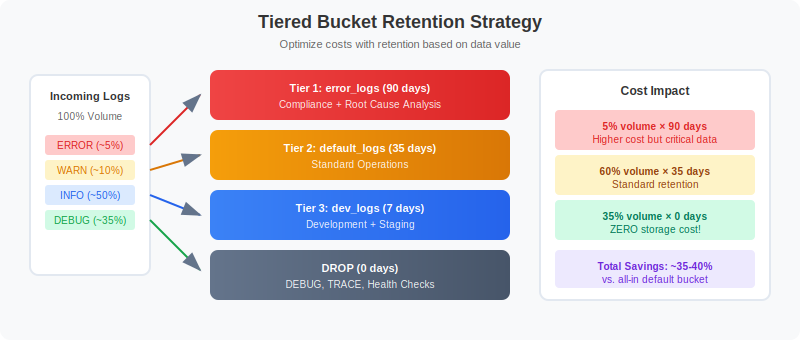
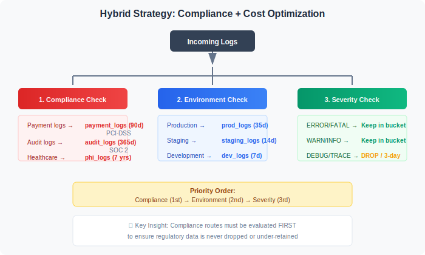
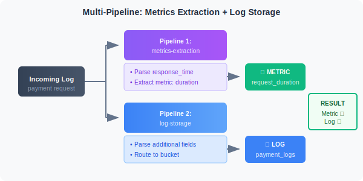

# OPMIG-05: Dynamic Routing & Bucket Management

> **Series:** OPMIG | **Notebook:** 5 of 9 | **Created:** December 2025

> **OpenPipeline Migration Series** | Notebook 5 of 9  
> **Level:** Intermediate  
> **Estimated Time:** 60 minutes

---

## Learning Objectives

By completing this notebook, you will:

1. Master dynamic routing strategies for different migration scenarios
2. Design multi-tier bucket architectures for cost optimization
3. ⭐ **NEW:** Calculate ROI and TCO for bucket optimization strategies
4. ⭐ **NEW:** Implement 3-tier and 5-tier bucket governance models
5. ⭐ **NEW:** Apply compliance-driven retention strategies
6. Configure multi-pipeline processing patterns
7. Analyze bucket usage and identify optimization opportunities

---


---

## Understanding Dynamic Routing

Dynamic routing is the mechanism that directs incoming data to specific pipelines based on matching conditions.

### How Routing Works


<!--MARKDOWN_TABLE_ALTERNATIVE
| Route | Condition | Target Pipeline |
|-------|-----------|-----------------|
| Route 1 | k8s.namespace.name == "production" | prod-logs |
| Route 2 | log.source == "nginx" | nginx-logs |
| Route 3 | contains(content, "payment") | payment-logs |
| Default | (no match) | default |
-->

### Key Routing Concepts

| Concept | Description |
|---------|-------------|
| **Matching Condition** | DQL expression that evaluates to true/false |
| **Route Priority** | Routes are evaluated in order (top to bottom) |
| **Multi-match** | One record can match multiple routes (max 5 pipelines) |
| **Default Pipeline** | Catches all records not matching any route |
| **Exclusive Routing** | Use specific conditions to prevent multi-match |

---

## Routing Strategies

### Strategy 1: Source-Based Routing

Route based on data source or ingestion method:

| Condition | Target Pipeline | Use Case |
|-----------|-----------------|----------|
| `log.source == "nginx"` | nginx-logs | Web server logs |
| `log.source == "application"` | app-logs | Application logs |
| `dt.openpipeline.source == "otlp"` | otel-logs | OpenTelemetry |
| `dt.openpipeline.source == "generic"` | api-logs | API ingestion |

### Strategy 2: Environment-Based Routing

Route based on environment or namespace:

| Condition | Target Pipeline | Bucket |
|-----------|-----------------|--------|
| `k8s.namespace.name == "production"` | prod-logs | default_logs (35d) |
| `k8s.namespace.name == "staging"` | staging-logs | dev_logs (7d) |
| `k8s.namespace.name == "development"` | dev-logs | dev_logs (7d) |

### Strategy 3: Content-Based Routing

Route based on log content patterns:

| Condition | Target Pipeline | Purpose |
|-----------|-----------------|----------|
| `contains(content, "payment")` | payment-logs | Financial logs |
| `contains(content, "security")` | security-logs | Security events |
| `contains(content, "audit")` | audit-logs | Compliance logs |

### Strategy 4: Severity-Based Routing

Route based on log level for tiered retention:

| Condition | Target Pipeline | Bucket |
|-----------|-----------------|--------|
| `loglevel == "ERROR"` | error-logs | error_logs (90d) |
| `loglevel == "WARN"` | warning-logs | default_logs (35d) |
| `loglevel == "DEBUG"` | debug-logs | short_retention (3d) |

### Strategy 5: Hybrid Routing

Combine multiple criteria for precise routing:

```
k8s.namespace.name == "production" AND log.source == "payment-service"
```

---

## Grail Buckets Explained

Grail buckets are storage containers with configurable retention and access policies.

### Default Buckets

| Bucket | Data Type | Default Retention |
|--------|-----------|-------------------|
| `default_logs` | Log records | 35 days |
| `default_spans` | Span/trace data | 35 days |
| `default_bizevents` | Business events | 35 days |
| `default_events` | Platform events | 35 days |

### Custom Bucket Use Cases

| Use Case | Bucket Strategy | Retention |
|----------|-----------------|----------|
| **Compliance/Audit** | `audit_logs` | 365+ days |
| **Financial Data** | `financial_logs` | 90 days |
| **Security Events** | `security_logs` | 180 days |
| **Development Logs** | `dev_logs` | 7 days |
| **Debug/Trace** | `debug_logs` | 3 days |
| **High-Volume Noise** | `ephemeral_logs` | 1 day |

### Bucket Benefits

1. **Cost Optimization**: Shorter retention = lower storage costs
2. **Compliance**: Longer retention for audit requirements
3. **Performance**: Smaller buckets = faster queries
4. **Access Control**: Bucket-level permissions
5. **Data Isolation**: Separate buckets for different teams/purposes

---

## Bucket Routing Configuration

### Configuring Bucket Routing in Pipeline

Each pipeline can route data to a specific bucket:

1. Open your pipeline in OpenPipeline settings
2. Go to **Storage** tab
3. Select target bucket from dropdown
4. Save pipeline

### Bucket Routing Rules

| Rule | Behavior |
|------|----------|
| **Pipeline bucket** | Records go to pipeline's configured bucket |
| **No bucket set** | Records go to default bucket for data type |
| **Multi-pipeline** | Record stored once in first pipeline's bucket |

> ⚠️ **Important:** A record is stored only ONCE, even if processed by multiple pipelines. It goes to the bucket of the FIRST matching pipeline.

### Creating Custom Buckets

Custom buckets are created via Grail settings:

```
Settings → Data and storage → Grail buckets → + Create bucket
```

Configure:
- **Name**: Descriptive bucket name
- **Table**: Data type (logs, spans, etc.)
- **Retention**: Days to retain data
- **Description**: Purpose of bucket

---

## Cost Optimization Patterns

### Pattern 1: Tiered Retention by Severity



<!--MARKDOWN_TABLE_ALTERNATIVE
| Tier | Bucket | Retention | Volume | Impact |
|------|--------|-----------|--------|--------|
| Critical | error_logs | 90 days | ~5% | Higher cost, critical data |
| Standard | default_logs | 35 days | ~60% | Standard retention |
| Development | dev_logs | 7 days | ~35% | Short retention |
| Drop | none | 0 days | dropped | Zero cost |
-->

### Pattern 2: Environment-Based Retention

| Environment | Bucket | Retention | Cost Impact |
|-------------|--------|-----------|-------------|
| Production | `prod_logs` | 35 days | Standard |
| Staging | `staging_logs` | 14 days | -60% |
| Development | `dev_logs` | 7 days | -80% |
| Ephemeral/Test | `temp_logs` | 3 days | -90% |

### Pattern 3: Drop + Sample

For extremely high-volume, low-value logs:

1. Drop 90% of health checks
2. Sample 10% to a short-retention bucket
3. Keep statistical visibility without full storage cost

### Pattern 4: Metric Extraction + Drop

For logs needed only for metrics:

1. Extract metrics (with dimensions) from logs
2. Drop the raw logs after extraction
3. Metrics persist for 10 years, logs dropped immediately

---

## Cost Optimization ROI Calculator ⭐ NEW

Understanding the financial impact of bucket strategies is critical for migration planning. This section provides detailed ROI calculations for common optimization patterns.

### DDU (Davis Data Units) Pricing Model

OpenPipeline storage is measured in **Davis Data Units (DDUs)**:

| Component | DDU Calculation |
|-----------|----------------|
| **Log Ingestion** | 0.001 DDU per MB ingested |
| **Storage (per day)** | 0.0001 DDU per MB per day retained |
| **DQL Query** | 0.001 DDU per MB scanned |

**Typical DDU Pricing:** ~$0.08 per DDU (varies by contract)

### Cost Formula

```
Total Cost = (Ingestion Cost) + (Storage Cost) + (Query Cost)

Where:
  Ingestion Cost = Volume (MB/day) × 0.001 DDU/MB × Price/DDU
  Storage Cost   = Volume (MB/day) × Retention (days) × 0.0001 DDU/MB/day × Price/DDU
  Query Cost     = Query Volume (MB) × 0.001 DDU/MB × Price/DDU
```

### Scenario 1: E-Commerce Platform - Tiered Retention

**Current State (No Optimization):**
```
Volume:          100 GB/day (100,000 MB/day)
Breakdown:       - ERROR:  5% (5,000 MB/day)
                 - WARN:  10% (10,000 MB/day)
                 - INFO:  50% (50,000 MB/day)
                 - DEBUG: 35% (35,000 MB/day)
Retention:       35 days (default_logs)
DDU Price:       $0.08 per DDU
```

**Current Monthly Cost:**
```
Ingestion:  100,000 MB/day × 30 days × 0.001 DDU/MB × $0.08 = $240/month
Storage:    100,000 MB/day × 35 days × 0.0001 DDU/MB/day × $0.08 = $2,800/month
Query:      Estimate ~20% of stored data queried/month
            (100,000 × 30 × 0.2) × 0.001 × $0.08 = $48/month

TOTAL:      $3,088/month
```

**Optimized State (3-Tier + Drop):**
```
Tier 1 (ERROR):     5,000 MB/day → error_logs (90 days)
Tier 2 (WARN/INFO): 60,000 MB/day → default_logs (35 days)
Tier 3 (DEBUG):     35,000 MB/day → DROPPED (0 days)
```

**Optimized Monthly Cost:**
```
Ingestion (only non-dropped):
  65,000 MB/day × 30 days × 0.001 × $0.08 = $156/month

Storage:
  Tier 1: 5,000 × 90 × 0.0001 × $0.08 = $360/month
  Tier 2: 60,000 × 35 × 0.0001 × $0.08 = $1,680/month
  Total storage = $2,040/month

Query (20% of stored):
  (5,000 × 30 × 0.2 + 60,000 × 30 × 0.2) × 0.001 × $0.08 = $31.20/month

TOTAL:      $2,227.20/month
```

**ROI Analysis:**
```
Monthly Savings:     $3,088 - $2,227 = $861/month
Annual Savings:      $861 × 12 = $10,332/year
Savings Percentage:  27.9%
Implementation Time: 4-8 hours
Payback Period:      Immediate (operational change only)
```

### Scenario 2: SaaS Platform - Multi-Environment

**Current State:**
```
Production:   50 GB/day × 35 days = $1,540/month
Staging:      30 GB/day × 35 days = $924/month
Development:  20 GB/day × 35 days = $616/month
TOTAL:        $3,080/month
```

**Optimized State:**
```
Production:   50 GB/day × 35 days = $1,540/month (no change)
Staging:      30 GB/day × 14 days = $369.60/month (60% reduction)
Development:  20 GB/day × 7 days  = $154.40/month (75% reduction)
TOTAL:        $2,064/month
```

**ROI Analysis:**
```
Monthly Savings:     $1,016/month
Annual Savings:      $12,192/year
Savings Percentage:  33%
```

### Scenario 3: Global Retailer - Compliance + Cost

**Requirements:**
- Payment logs: PCI-DSS requires 90 days
- Audit logs: SOC 2 requires 365 days
- Application logs: 35 days standard
- Debug logs: Drop immediately

**Volume Breakdown:**
```
Payment logs:  10 GB/day (10% of total)
Audit logs:    5 GB/day  (5% of total)
App logs:      60 GB/day (60% of total)
Debug logs:    25 GB/day (25% of total)
TOTAL:         100 GB/day
```

**Cost Calculation:**
```
Payment (90d):  10,000 × 90 × 0.0001 × $0.08 = $720/month
Audit (365d):   5,000 × 365 × 0.0001 × $0.08 = $1,460/month
App (35d):      60,000 × 35 × 0.0001 × $0.08 = $1,680/month
Debug (drop):   $0/month
Ingestion:      75,000 × 30 × 0.001 × $0.08 = $180/month

TOTAL:          $4,040/month
```

**vs. No Optimization (all 35 days):**
```
100 GB/day × 35 days = $3,080/month (but non-compliant!)
```

**Key Insight:** Sometimes optimization increases cost but ensures compliance. The cost of non-compliance (fines, audits) far exceeds storage costs.

---


---

## Analyzing Your Bucket Usage

Use these queries to understand your current bucket utilization and plan optimization.

```python
// Current bucket distribution for logs
// Shows where your logs are being stored
fetch logs, from: now() - 7d
| summarize {record_count = count()}, by: {dt.system.bucket}
| fieldsAdd daily_avg = round(record_count / 7, decimals: 0)
| sort record_count desc
```

```python
// Bucket usage by log source
// Identify which sources are consuming bucket capacity
fetch logs, from: now() - 7d
| summarize {record_count = count()}, by: {dt.system.bucket, log.source}
| sort record_count desc
| limit 30
```

```python
// Bucket usage by pipeline
// Shows which pipelines are routing to which buckets
fetch logs, from: now() - 7d
| filter isNotNull(dt.openpipeline.pipelines)
| summarize {record_count = count()}, by: {dt.openpipeline.pipelines, dt.system.bucket}
| sort record_count desc
```

```python
// Bucket usage trend over time
fetch logs, from: now() - 7d
| makeTimeseries {record_count = count()}, by: {dt.system.bucket}, interval: 1d
```

```python
// Identify logs that could move to shorter retention buckets
// Debug and trace logs are prime candidates
fetch logs, from: now() - 7d
| filter dt.system.bucket == "default_logs"
| summarize {
    total = count(),
    debug = countIf(loglevel == "DEBUG" OR status == "DEBUG"),
    trace = countIf(loglevel == "TRACE" OR status == "TRACE"),
    info = countIf(loglevel == "INFO" OR status == "INFO")
  }
| fieldsAdd debug_pct = round((toDouble(debug) / toDouble(total)) * 100, decimals: 2)
| fieldsAdd trace_pct = round((toDouble(trace) / toDouble(total)) * 100, decimals: 2)
| fieldsAdd optimization_potential = round((toDouble(debug + trace) / toDouble(total)) * 100, decimals: 2)
```

```python
// Check span bucket distribution
// Spans also use buckets
fetch spans, from: now() - 7d
| summarize {span_count = count()}, by: {dt.system.bucket}
| sort span_count desc
```

```python
// Estimate storage reduction from tiered retention
// Shows potential savings from routing to different buckets
fetch logs, from: now() - 7d
| summarize {
    total = count(),
    error_warn = countIf(loglevel == "ERROR" OR loglevel == "WARN"),
    info = countIf(loglevel == "INFO"),
    debug_trace = countIf(loglevel == "DEBUG" OR loglevel == "TRACE")
  }
| fieldsAdd tier1_90day = error_warn
| fieldsAdd tier2_35day = info
| fieldsAdd tier3_drop = debug_trace
| fieldsAdd current_cost_units = total * 35
| fieldsAdd optimized_cost_units = (tier1_90day * 90) + (tier2_35day * 35) + (tier3_drop * 0)
| fieldsAdd savings_pct = round((1.0 - (toDouble(optimized_cost_units) / toDouble(current_cost_units))) * 100, decimals: 1)
```

---

## Multi-Tier Bucket Strategies ⭐ NEW

Different organizations need different bucket architectures based on their scale, compliance requirements, and cost targets.

### 3-Tier Strategy (Small to Medium Organizations)

**Recommended for:** 10-500 GB/day, single or few environments

| Tier | Bucket Name | Retention | Use Case | Volume % |
|------|-------------|-----------|----------|----------|
| **Critical** | `critical_logs` | 90 days | Errors, security, audit | 10-15% |
| **Standard** | `default_logs` | 35 days | WARN, INFO, app logs | 60-70% |
| **Ephemeral** | `ephemeral_logs` | 7 days | DEBUG, health checks | 20-30% |

**Routing Configuration:**
```
Route 1 (Critical):
  Condition: loglevel == "ERROR" OR 
             contains(log.source, "security") OR 
             contains(log.source, "audit") OR
             contains(content, "payment")
  Pipeline:  critical-logs
  Bucket:    critical_logs (90 days)

Route 2 (Ephemeral):
  Condition: loglevel == "DEBUG" OR 
             loglevel == "TRACE" OR
             contains(content, "/health")
  Pipeline:  ephemeral-logs
  Bucket:    ephemeral_logs (7 days)

Default Route:
  Pipeline:  standard-logs
  Bucket:    default_logs (35 days)
```

**Expected Savings:** 25-35% vs. single-bucket approach

### 5-Tier Strategy (Enterprise Organizations)

**Recommended for:** 500+ GB/day, multiple environments, strict compliance

| Tier | Bucket Name | Retention | Use Case | Volume % |
|------|-------------|-----------|----------|----------|
| **Compliance** | `compliance_logs` | 365 days | SOC 2, GDPR, HIPAA audit trails | 3-5% |
| **Security** | `security_logs` | 180 days | Security events, attacks, vulns | 2-5% |
| **Production** | `prod_logs` | 90 days | Production errors, warnings | 10-15% |
| **Standard** | `default_logs` | 35 days | INFO logs, standard operations | 40-50% |
| **Development** | `dev_logs` | 7 days | Dev/staging, DEBUG, testing | 30-40% |

**Expected Savings:** 40-60% vs. single-bucket approach

### Hybrid Strategy (Compliance + Cost)

**Best for:** Organizations with compliance requirements AND cost constraints



<!-- MARKDOWN_TABLE_ALTERNATIVE
| Priority | Check | Destinations |
|----------|-------|--------------|
| 1st | Compliance | Payment → payment_logs (90d, PCI-DSS), Audit → audit_logs (365d, SOC 2), Healthcare → phi_logs (7 yrs, HIPAA) |
| 2nd | Environment | Production → prod_logs (35d), Staging → staging_logs (14d), Development → dev_logs (7d) |
| 3rd | Severity | ERROR/FATAL → Keep, WARN/INFO → Keep, DEBUG/TRACE → DROP or 3-day bucket |
-->

**Key Principle:** Compliance routes must be FIRST to ensure regulatory data isn't accidentally dropped or under-retained.

---

---

## Multi-Pipeline Processing

A single record can be processed by multiple pipelines (up to 5). This enables powerful patterns:

### Use Case: Extraction + Storage Pipeline



<!-- MARKDOWN_TABLE_ALTERNATIVE
| Pipeline | Purpose | Output |
|----------|---------|--------|
| Pipeline 1: metrics-extraction | Parse response_time, extract metric | 📊 Metric: request_duration |
| Pipeline 2: log-storage | Parse additional fields, route to bucket | 📋 Log: payment_logs |
| **Result** | Both outputs from single log | Metric ✓ + Log ✓ |
-->

### Use Case: Security + Operational Logs

```
Pipeline 1: security-analysis
  - Extract security events
  - Generate security alerts

Pipeline 2: operational-logs
  - Standard parsing
  - Normal storage
```

### Configuring Multi-Pipeline Routes

Create overlapping route conditions:

```
Route 1: log.source == "auth-service"  → security-logs
Route 2: log.source == "auth-service"  → app-logs

Both pipelines process the same record
```

> ⚠️ **Limit:** A record can be processed by maximum 5 pipelines. Beyond this, extraction stops.

```python
// Identify records processed by multiple pipelines
fetch logs, from: now() - 1h
| filter isNotNull(dt.openpipeline.pipelines)
| filter arraySize(dt.openpipeline.pipelines) > 1
| summarize {multi_pipeline_count = count()}, by: {dt.openpipeline.pipelines}
| sort multi_pipeline_count desc
| limit 20
```

```python
// Count of logs by number of pipelines processing them
fetch logs, from: now() - 1h
| filter isNotNull(dt.openpipeline.pipelines)
| fieldsAdd pipeline_count = arraySize(dt.openpipeline.pipelines)
| summarize {record_count = count()}, by: {pipeline_count}
| sort pipeline_count asc
```

---

## Bucket Governance & Access Control ⭐ NEW

Proper bucket governance ensures compliance, security, and operational efficiency.

### Access Control Patterns

#### Pattern 1: Role-Based Bucket Access

| Role | Bucket Access | Permissions |
|------|---------------|-------------|
| **Developers** | `dev_logs` | Read/Write |
| | `staging_logs` | Read/Write |
| | `prod_logs` | Read-only |
| **SRE/Platform** | All buckets | Read/Write |
| **Security Team** | `security_logs` | Read/Write |
| | `audit_logs` | Read-only (immutable) |
| | `compliance_logs` | Read-only (immutable) |
| **Auditors** | `audit_logs` | Read-only |
| | `compliance_logs` | Read-only |
| **Finance** | `payment_logs` | Read-only |

#### Pattern 2: Least Privilege by Environment

```
Development Team:
  - FULL access to dev_logs
  - READ access to staging_logs
  - NO access to prod_logs

QA Team:
  - FULL access to staging_logs
  - READ access to dev_logs
  - READ access to prod_logs (for troubleshooting only)

Production SRE:
  - FULL access to prod_logs, error_logs, security_logs
  - READ access to all other buckets
```

### Retention Policy Enforcement

| Bucket | Min Retention | Max Retention | Enforcement |
|--------|---------------|---------------|-------------|
| `dev_logs` | 1 day | 14 days | Auto-delete after max |
| `staging_logs` | 7 days | 30 days | Auto-delete after max |
| `default_logs` | 35 days | 35 days | Standard retention |
| `prod_logs` | 90 days | 90 days | Protected |
| `audit_logs` | 365 days | 2555 days | Immutable after 30d |
| `payment_logs` | 90 days | 2555 days | PCI-DSS compliant |
| `phi_logs` | 2555 days | 2555 days | HIPAA 7-year rule |

**Enforcement Methods:**
1. **Automated**: Grail automatically purges data after retention period
2. **Immutability**: Compliance buckets can be configured as write-once (after grace period)
3. **Audit Trail**: All retention changes logged in audit_logs

### Compliance Audit Trail Requirements

#### SOC 2 Compliance

**Required Logs (365 days minimum):**
- Authentication events (login, logout, MFA)
- Authorization changes (role assignments, permission changes)
- Data access (who accessed what, when)
- Configuration changes (pipeline edits, bucket changes)
- Security events (failed auth, suspicious activity)

**Bucket Configuration:**
```
Bucket: soc2_audit_logs
Retention: 365 days (minimum)
Immutability: Write-once after 30-day grace period
Access: Security team + auditors only
Encryption: At-rest encryption enforced
```

#### PCI-DSS Compliance

**Required Logs (90 days minimum, 12 months recommended):**
- Payment transaction logs (amounts MASKED, card numbers REDACTED)
- Access to cardholder data environments
- Authentication to payment systems
- Database queries touching payment data

**Bucket Configuration:**
```
Bucket: pci_payment_logs
Retention: 365 days (exceeds 90-day minimum)
Processing: MASK credit card numbers, CVV codes
Access: Payment team + security + auditors
Encryption: TLS 1.2+ in transit, AES-256 at rest
Monitoring: Alert on access attempts
```

#### HIPAA Compliance

**Required Logs (6 years minimum, 7 years recommended):**
- PHI access logs (who viewed which patient records)
- Authentication to healthcare systems
- Prescription and medical record changes
- Breach detection events

**Bucket Configuration:**
```
Bucket: hipaa_phi_logs
Retention: 2555 days (7 years)
Processing: MASK patient IDs, SSNs, dates of birth
           HASH medical record numbers
Access: Healthcare IT + compliance officers only
Encryption: FIPS 140-2 compliant
Audit: All bucket access logged to separate audit bucket
```

#### GDPR Compliance

**Special Considerations:**
- **Right to Erasure:** Logs with EU citizen PII must be deletable on request
- **Data Minimization:** Only collect necessary personal data
- **Retention Limits:** Cannot retain personal data longer than necessary

**Bucket Strategy:**
```
Bucket: eu_customer_logs
Retention: 90 days (balancing security and data minimization)
Processing: MASK email addresses, IP addresses
           ADD customer_id_hash (for erasure lookup)
Deletion API: Integrate with GDPR erasure requests
Data Residency: EU-only bucket (if required)
```

### Bucket Naming Conventions

**Recommended Pattern:** `<environment>_<purpose>_logs`

Examples:
```
prod_app_logs
prod_error_logs
prod_security_logs
staging_app_logs
dev_debug_logs
compliance_audit_logs
compliance_soc2_logs
compliance_pci_logs
compliance_hipaa_logs
ephemeral_healthcheck_logs
```

**Benefits:**
- Clear ownership and purpose
- Easy to identify in DQL queries
- Simplifies access control rules
- Supports automated governance checks

### Bucket Lifecycle Management

**Quarterly Review Checklist:**
- [ ] Review bucket usage and growth trends
- [ ] Validate retention periods still match requirements
- [ ] Check for unused or abandoned buckets
- [ ] Audit access control list changes
- [ ] Verify compliance bucket configurations
- [ ] Analyze query patterns for optimization opportunities
- [ ] Review storage costs vs. budget

**Annual Compliance Audit:**
- [ ] Verify all compliance buckets meet regulatory retention
- [ ] Confirm masking/redaction rules are working
- [ ] Test data erasure procedures (GDPR)
- [ ] Review audit trail completeness
- [ ] Validate encryption standards
- [ ] Document bucket governance changes

---


---

## Best Practices

### Routing Best Practices

| Practice | Description |
|----------|-------------|
| **Specific first** | Place specific routes before general ones |
| **Test conditions** | Validate matching conditions with sample data |
| **Avoid overlap** | Unless intentional multi-pipeline is needed |
| **Document routes** | Keep a map of route → pipeline → bucket |
| **Monitor default** | High default pipeline volume = missing routes |

### Bucket Best Practices

| Practice | Description |
|----------|-------------|
| **Meaningful names** | Use descriptive bucket names |
| **Match retention to value** | Critical data = longer retention |
| **Consider query patterns** | Frequently queried data in main bucket |
| **Plan for compliance** | Audit logs may need 365+ days |
| **Review regularly** | Re-evaluate bucket strategy quarterly |

### Cost Optimization Best Practices

| Practice | Impact |
|----------|--------|
| Drop DEBUG/TRACE | 30-50% volume reduction |
| Drop health checks | 5-20% volume reduction |
| Short retention for dev | 70-80% cost reduction |
| Extract metrics, drop logs | Metrics persist, logs don't |
| Sample high-volume noise | Keep visibility, reduce storage |

---

## Routing Configuration Examples

### Example 1: Environment-Based Routing

**Route 1: Production Logs**
```
Condition: k8s.namespace.name == "production" OR k8s.namespace.name == "prod"
Pipeline: production-logs
Bucket: production_logs (35 days)
```

**Route 2: Development Logs**
```
Condition: k8s.namespace.name == "development" OR k8s.namespace.name == "dev"
Pipeline: development-logs
Bucket: dev_logs (7 days)
```

### Example 2: Severity-Based Routing

**Route 1: Error Logs (high value)**
```
Condition: loglevel == "ERROR"
Pipeline: error-logs
Bucket: error_logs (90 days)
Processing: Parse stack traces, enrich with service info
```

**Route 2: Debug Logs (low value)**
```
Condition: loglevel == "DEBUG" OR loglevel == "TRACE"
Pipeline: debug-logs
Processing: DROP all (or route to 3-day bucket)
```

### Example 3: Compliance Routing

**Route 1: Audit Logs**
```
Condition: contains(log.source, "audit") OR contains(content, "authentication")
Pipeline: audit-logs
Bucket: audit_logs (365 days)
Processing: Mask PII, add compliance tags
```

---

## Next Steps

Now that you understand routing and buckets, continue with:

| Notebook | Focus Area |
|----------|------------|
| **OPMIG-06** | Processing, Parsing & Transformation |
| **OPMIG-07** | Metric & Event Extraction |
| **OPMIG-08** | Security, Masking & Compliance |
| **OPMIG-09** | Troubleshooting & Validation |

---

## References

- [OpenPipeline Data Flow](https://docs.dynatrace.com/docs/discover-dynatrace/platform/openpipeline/concepts/data-flow)
- [Grail Buckets](https://docs.dynatrace.com/docs/platform/grail/data-model/buckets)
- [OpenPipeline Limits](https://docs.dynatrace.com/docs/discover-dynatrace/platform/openpipeline/reference/limits)

---

*Last Updated: December 12, 2025*
