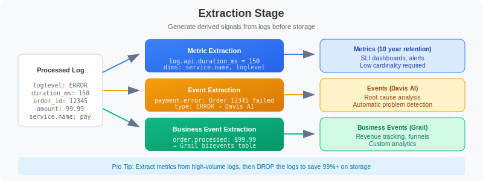

# OPMIG-07: Metric & Event Extraction

> **Series:** OPMIG | **Notebook:** 7 of 9 | **Created:** December 2025

> **OpenPipeline Migration Series** | Notebook 7 of 9  
> **Level:** Intermediate to Advanced  
> **Estimated Time:** 70 minutes

---

## Learning Objectives

By completing this notebook, you will:

1. Configure metric and event extraction from logs
2. Generate business events for analytics
3. ⭐ **NEW:** Implement SLI metrics using RED methodology (Rate, Errors, Duration)
4. ⭐ **NEW:** Extract business KPIs (revenue, conversion, user journey)
5. ⭐ **NEW:** Apply metric design best practices (cardinality, naming, aggregation)
6. Validate extractions with DQL queries
7. Optimize extraction for cost efficiency

---


---

## Extraction Stage Overview

The Extraction stage runs **after** Processing and **before** Storage. It generates:



<!--MARKDOWN_TABLE_ALTERNATIVE
| Extraction Type | Output | Use Case |
|-----------------|--------|----------|
| Metric Extraction | Metrics (10yr retention) | SLI dashboards, alerts, low cardinality |
| Event Extraction | Davis AI Events | Root cause analysis, problem detection |
| Business Event | Grail Bizevents | Revenue tracking, funnels, analytics |
-->

### Key Benefits

| Benefit | Description |
|---------|-------------|
| **Derived signals** | Create metrics from logs without app changes |
| **Cost optimization** | Extract metrics, then drop verbose logs |
| **Davis AI integration** | Generated events feed into AI analysis |
| **Business visibility** | Business events enable analytics dashboards |

---

## Metric Extraction

OpenPipeline supports two types of metrics:

### Value Metrics (Gauge)

Extract numeric values as gauge metrics.

| Field | Description |
|-------|-------------|
| **Key** | Metric name (e.g., `log.payment.amount`) |
| **Value** | Numeric field to extract |
| **Dimensions** | Fields to use as metric dimensions |
| **Matching Condition** | When to apply extraction |

**Example: Extract payment amount**
```
Metric Type: Value
Key: log.payment.amount
Value: amount
Dimensions: service.name, environment, status
Matching: contains(content, "payment") AND isNotNull(amount)
```

### Counter Metrics

Count occurrences of matching records.

| Field | Description |
|-------|-------------|
| **Key** | Metric name (e.g., `log.error.count`) |
| **Dimensions** | Fields to use as metric dimensions |
| **Matching Condition** | When to count |

**Example: Count errors**
```
Metric Type: Counter
Key: log.errors.count
Dimensions: service.name, error_code
Matching: loglevel == "ERROR"
```

### Metric Naming Conventions

```
Format: <source>.<domain>.<name>

Examples:
  log.api.request_count
  log.payment.amount
  log.auth.failed_attempts
  span.checkout.duration_ms
```

### Dimension Best Practices

| Do | Don't |
|----|-------|
| Low-cardinality fields | High-cardinality IDs |
| `service.name` | `request_id` |
| `environment` | `user_id` |
| `error_code` | `timestamp` |

---

## SLI Metric Patterns: RED Methodology ⭐ NEW

The **RED Method** (Rate, Errors, Duration) provides comprehensive service observability.

### RED Overview

| Metric | Measures | Why |
|--------|----------|-----|
| **Rate** | Requests/sec | Traffic volume, capacity |
| **Errors** | Error rate (%) | Reliability, SLA |
| **Duration** | Response time (p50, p95, p99) | User experience |

### Rate: Request Throughput

```
Type: Counter
Key: log.api.request_rate
Dimensions: method, path, status_category, service.name
Matching: isNotNull(path)
```

### Errors: Error Rate SLI

**Total Requests:**
```
Counter: log.api.request_total
Dimensions: service.name, endpoint
```

**Error Requests:**
```
Counter: log.api.request_errors
Dimensions: service.name, endpoint, error_type
Matching: status >= 500 OR loglevel == "ERROR"
```

### Duration: Latency Percentiles

```
Type: Value
Key: log.api.response_time_ms
Value: duration_ms
Dimensions: service.name, endpoint, status_category
```

### Latency Buckets (Apdex-style SLI)

Use `fieldsAdd` to create latency buckets:
```
fieldsAdd latency_bucket = if(duration_ms < 100, "fast",
                           else: if(duration_ms < 500, "acceptable",
                           else: if(duration_ms < 1000, "slow",
                           else: "very_slow")))
```

Then create a counter metric:
```
Counter: log.api.latency_bucket_count
Dimensions: latency_bucket, service.name, endpoint
```

---

---

## Event Extraction

Extract events that Davis AI can analyze for root cause analysis.

### Event Configuration

| Field | Description |
|-------|-------------|
| **Event Name** | Unique event type identifier |
| **Event Description** | Template for event description |
| **Matching Condition** | When to generate event |
| **Event Type** | Category: INFO, AVAILABILITY, ERROR, RESOURCE, CUSTOM |

### Event Types

| Type | Use Case |
|------|----------|
| `INFO` | Informational events |
| `AVAILABILITY` | Service up/down events |
| `ERROR` | Error conditions |
| `RESOURCE` | Resource contention events |
| `CUSTOM` | Custom event types |

### Event Description Templates

Use field placeholders in descriptions:

```
Payment failed for order {order_id}: {error_message}
Service {service.name} error rate exceeded threshold
Authentication failure for user {user_id} from IP {client_ip}
```

### Example Event Extraction

```
Event Name: payment.failure
Event Description: Payment failed for order {order_id}: {error_message}
Event Type: ERROR
Matching: contains(content, "payment") AND contains(content, "failed")
```

---

## Business Event Extraction

Business events are stored in Grail for business analytics.

### Business Event Configuration

| Field | Description |
|-------|-------------|
| **Event Type** | Business event type name |
| **Event Provider** | Source system identifier |
| **Data Fields** | Fields to include in event |
| **Matching Condition** | When to extract |

### Example: Order Events

```
Event Type: com.example.order.placed
Event Provider: checkout-service
Data Fields:
  - order_id
  - customer_id
  - total_amount
  - currency
  - timestamp
Matching: contains(content, "order placed successfully")
```

### Querying Business Events

---

## Business KPI Extraction ⭐ NEW

### Revenue Tracking

**Order Revenue:**
```
Type: Value
Key: log.revenue.order_amount
Value: amount
Dimensions: currency, service.name, payment_method
```

### Conversion Funnels

**E-Commerce Funnel:**
1. Product View → 2. Add to Cart → 3. Checkout → 4. Complete

Use `fieldsAdd` to categorize funnel stages:
```
fieldsAdd funnel_stage = if(action == "product_view", "1_view",
                         else: if(action == "add_to_cart", "2_cart",
                         else: if(action == "checkout_started", "3_checkout",
                         else: "4_complete")))
```

### Feature Usage

```
Counter: log.feature.usage_count
Dimensions: feature_name, feature_enabled, user_segment
```

---

```python
// Query business events extracted from logs
fetch bizevents, from: now() - 24h
| filter event.type == "com.example.order.placed"
| fields timestamp, order_id, customer_id, total_amount
| limit 50
```

```python
// Business event analytics - order totals by hour
fetch bizevents, from: now() - 24h
| filter event.type == "com.example.order.placed"
| makeTimeseries {
    order_count = count(),
    total_revenue = sum(total_amount)
  }, interval: 1h
```

---

## Extraction Matching Conditions

Matching conditions determine which records trigger extraction.

### Common Patterns

| Pattern | Condition |
|---------|-----------|
| Error logs | `loglevel == "ERROR"` |
| Specific service | `service.name == "payment-service"` |
| Contains text | `contains(content, "failed")` |
| Has field | `isNotNull(order_id)` |
| Numeric threshold | `duration_ms > 1000` |

### Combining Conditions

```
// AND - both must match
loglevel == "ERROR" AND service.name == "payment"

// OR - either matches
status == "failed" OR status == "error"

// Complex conditions
(loglevel == "ERROR" OR loglevel == "WARN") 
  AND contains(content, "payment") 
  AND isNotNull(amount)
```

### Field Reference in Conditions

Use any field available after processing:
- Original fields from ingestion
- Parsed fields from processors
- Computed fields from `fieldsAdd`

---

## Practical Examples

### Example 1: API Request Metrics

**Source Log:**
```
2024-12-12T10:30:45 INFO - GET /api/users completed in 150ms, status=200
```

**Pipeline Processing:**
```dql
// First, parse the log
parse content, "LD:method ' ' LD:path ' completed in ' INT:duration_ms 'ms, status=' INT:status_code"
```

**Metric Extraction 1: Request duration**
```
Type: Value
Key: log.api.request_duration_ms
Value: duration_ms
Dimensions: method, path, status_code
Matching: isNotNull(duration_ms)
```

**Metric Extraction 2: Request count**
```
Type: Counter
Key: log.api.request_count
Dimensions: method, path, status_code
Matching: isNotNull(path)
```

### Example 2: Error Event Generation

**Source Log:**
```
2024-12-12T10:30:45 ERROR PaymentService - Transaction failed: insufficient funds, orderId=12345
```

**Event Extraction:**
```
Event Name: payment.transaction.failed
Event Description: Transaction failed for order {order_id}: {error_reason}
Event Type: ERROR
Matching: loglevel == "ERROR" AND contains(content, "Transaction failed")
```

### Example 3: Login Business Events

**Source Log:**
```
2024-12-12T10:30:45 INFO AuthService - User login successful: userId=john123, ip=192.168.1.100
```

**Business Event Extraction:**
```
Event Type: com.example.auth.login
Event Provider: auth-service
Data Fields: user_id, client_ip, timestamp
Matching: contains(content, "login successful")
```

### Example 4: Combined Extraction

From a single payment log line, extract:

1. **Metric**: `log.payment.amount` (value: amount)
2. **Metric**: `log.payment.count` (counter)
3. **Event**: Payment processed (INFO)
4. **Business Event**: Order transaction

---

## Validating Extractions

After configuring extractions, verify they're working.

```python
// List log-extracted metrics
// Note: Use the Dynatrace UI (Observe > Metrics) to browse metrics
// Or use timeseries to query a specific metric:
// timeseries avg_value = avg(log.your_metric_name), from: now() - 24h
```

```python
// Query a specific extracted metric
// Replace 'log.api.request_duration_ms' with your metric key
timeseries {
    avg_duration = avg(log.api.request_duration_ms),
    max_duration = max(log.api.request_duration_ms)
  }, from: now() - 2h, interval: 5m
```

```python
// View extracted counter metric by dimension
// Replace 'log.api.request_count' with your metric key
timeseries {
    requests = sum(log.api.request_count)
  }, from: now() - 2h, interval: 5m
```

```python
// View extracted events
fetch events, from: now() - 24h
| filter isNotNull(event.name)
| summarize {event_count = count()}, by: {event.type, event.name}
| sort event_count desc
```

```python
// View specific event details
fetch events, from: now() - 24h
| filter event.name == "payment.transaction.failed"
| fields timestamp, event.name, event.description, event.type
| sort timestamp desc
| limit 25
```

```python
// View business events by type
fetch bizevents, from: now() - 24h
| summarize {bizevent_count = count()}, by: {event.type, event.provider}
| sort bizevent_count desc
```

```python
// Compare source log volume to extracted metrics
// This helps verify extraction is capturing expected data
fetch logs, from: now() - 1h
| filter contains(content, "payment")
| summarize {log_count = count()}
| fieldsAdd data_source = "logs"

// Then compare with:
// timeseries sum(log.payment.count)
```

---

## Metric Design Best Practices ⭐ NEW

### Cardinality Management

| Cardinality | Examples | Max Values | Use? |
|-------------|----------|------------|------|
| **Low** | environment, region | < 50 | ✅ Ideal |
| **Medium** | endpoint, error_code | 50-500 | ✅ Good |
| **High** | session_id, request_id | 500-10K | ⚠️ Avoid |
| **Very High** | user_id, order_id | > 10K | ❌ Never |

**Cardinality Example:**
```
✅ GOOD: 5 services × 3 environments × 4 methods = 60 time series
❌ BAD: 5 services × 100K user_ids = 500K time series
```

**Reduction Techniques:**
```dql
// Bucket high-cardinality values
fieldsAdd duration_bucket = if(duration_ms < 100, "<100ms",
                            else: if(duration_ms < 500, "100-500ms",
                            else: ">500ms"))

// Use segments instead of IDs
fieldsAdd user_segment = if(user_tier == "premium", "premium", else: "free")
```

### Naming Conventions

**Format:** `<source>.<domain>.<metric>.<unit>`

**Examples:**
```
✅ log.api.request_count
✅ log.api.response_time_ms
✅ log.payment.order_amount_usd
✅ log.auth.failed_login_count

❌ apiReqCnt (abbreviated, no unit)
❌ response_time (no source, no unit)
❌ count (no context)
```

### Cost Optimization

**Metrics vs. Logs:**
```
Scenario: 1M requests/day

Option 1: Store logs (35 days)
  - 35M log records × 500 bytes = 17.5 GB
  - Cost: ~$140/month

Option 2: Extract metrics + drop logs
  - 10 time series, 10 years retention = ~10 MB
  - Cost: ~$1/month
  - Savings: 99.3% 🎉
```

**When to Extract:**
- ✅ SLI tracking (RED)
- ✅ Business KPIs
- ✅ High-volume health checks
- ❌ Debugging (keep logs)
- ❌ Compliance/audit (keep logs)

---


---

## Best Practices

### Metric Extraction

| Practice | Reason |
|----------|--------|
| Use meaningful metric names | Easier discovery and querying |
| Limit dimensions (≤5-7) | Avoid metric cardinality explosion |
| Use low-cardinality dimensions | IDs cause metric bloat |
| Extract only what you need | Reduces storage costs |
| Test matching conditions | Ensure correct data selection |

### Event Extraction

| Practice | Reason |
|----------|--------|
| Meaningful event names | Easier to find in Davis AI |
| Descriptive templates | Context for troubleshooting |
| Appropriate event types | Correct Davis AI handling |
| Avoid over-extraction | Too many events = noise |

### Business Event Extraction

| Practice | Reason |
|----------|--------|
| Consistent event types | Enables analytics |
| Include all needed fields | Avoids re-processing |
| Use namespaced types | Prevents collisions |
| Document event schema | Helps consumers |

### Cost Optimization Pattern

**Extract → Drop → Save**

1. Extract metrics and events from verbose logs
2. Drop the original verbose logs
3. Keep only derived signals

This pattern reduces storage while preserving observability.

---

## Complete Extraction Pipeline Example

### Pipeline: `checkout-service-logs`

**Processing Stage (from OPMIG-06):**
```dql
// Parse order details
parse content, "'orderId=' INT:order_id ','"
| parse content, "'amount=' DOUBLE:amount"
| parse content, "'status=' LD:order_status"
| parse content, "'duration=' INT:duration_ms 'ms'"
```

**Metric Extraction 1: Order Amount**
```
Type: Value
Key: log.checkout.order_amount
Value: amount
Dimensions: order_status, service.name
Matching: isNotNull(amount)
```

**Metric Extraction 2: Order Count**
```
Type: Counter
Key: log.checkout.order_count
Dimensions: order_status, service.name
Matching: isNotNull(order_id)
```

**Metric Extraction 3: Processing Duration**
```
Type: Value
Key: log.checkout.processing_duration_ms
Value: duration_ms
Dimensions: order_status, service.name
Matching: isNotNull(duration_ms)
```

**Event Extraction: Order Failure**
```
Event Name: checkout.order.failed
Event Description: Order {order_id} failed with status {order_status}
Event Type: ERROR
Matching: order_status == "failed" OR order_status == "error"
```

**Business Event: Order Completed**
```
Event Type: com.example.checkout.order_completed
Event Provider: checkout-service
Data Fields: order_id, amount, order_status, duration_ms
Matching: order_status == "completed" OR order_status == "success"
```

---

## Next Steps

Now that you can extract metrics and events, continue with:

| Notebook | Focus Area |
|----------|------------|
| **OPMIG-08** | Security, Masking & Compliance |
| **OPMIG-09** | Troubleshooting & Validation |

---

## References

- [OpenPipeline Data Extraction](https://docs.dynatrace.com/docs/discover-dynatrace/platform/openpipeline/concepts/data-extraction)
- [Metric Extraction](https://docs.dynatrace.com/docs/discover-dynatrace/platform/openpipeline/use-cases/metric-extraction)
- [Business Event Extraction](https://docs.dynatrace.com/docs/discover-dynatrace/platform/openpipeline/use-cases/bizevent-extraction)
- [Davis AI Events](https://docs.dynatrace.com/docs/platform/davis-ai/basics/events)

---

*Last Updated: December 12, 2025*
